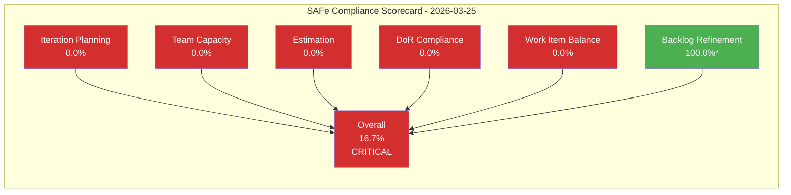
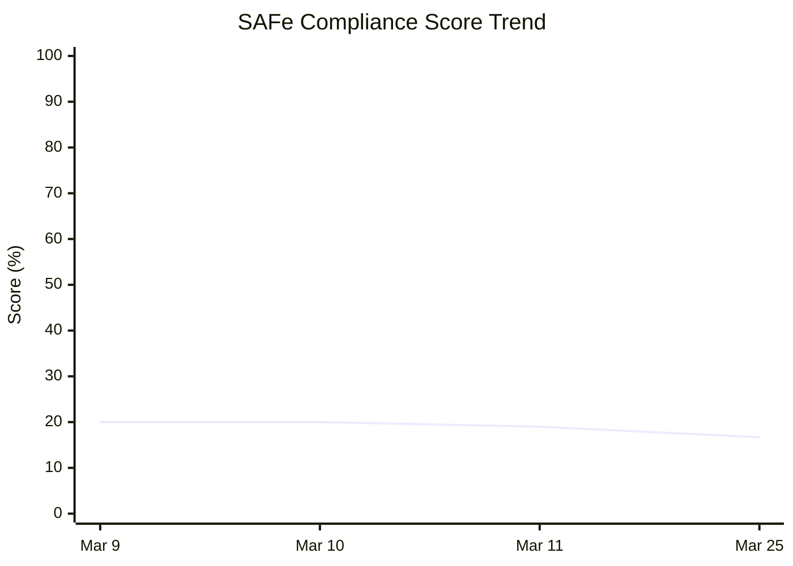
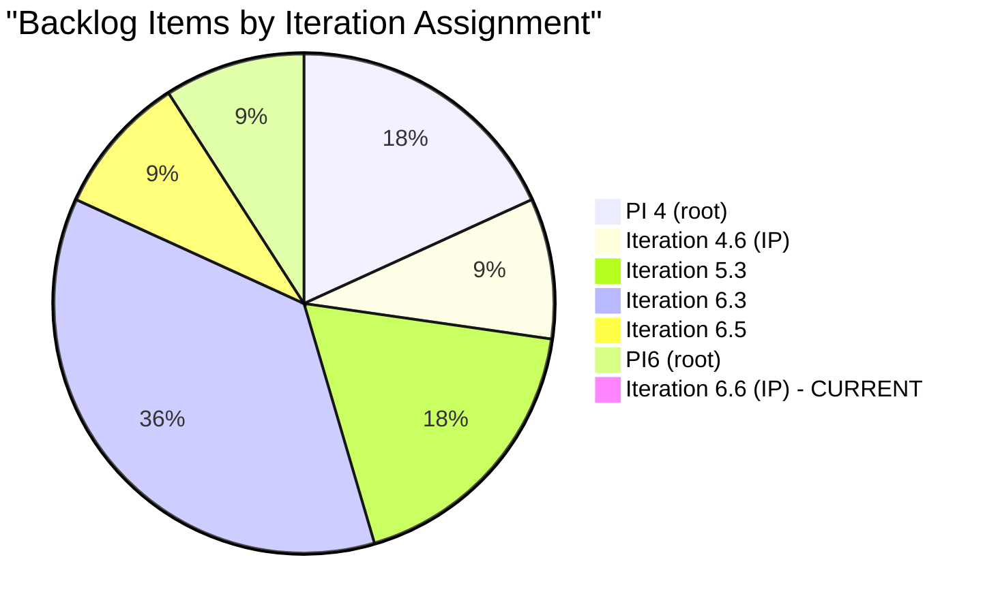

# SAFe Iteration Audit Report

## 1. Audit Metadata

| Field | Value |
|-------|-------|
| **Project** | AutoAllies (Auto Allies) |
| **Organization** | Jairo (dev.azure.com/jairo) |
| **Project ID** | `2d7af571-6ef6-4ad0-a509-c440e008b0fb` |
| **Team** | AA Operation Team |
| **Team Board ID** | `37592451-20d4-464a-b974-de8e09fb2e68` |
| **Workspace Folder** | `ado_aa_ops` |
| **Current Iteration** | Iteration 6.6 (IP) |
| **Iteration Path** | `Auto Allies\2026-PI6\Iteration 6.6 (IP)` |
| **Iteration Start** | 2026-03-23 |
| **Iteration Finish** | 2026-04-05 |
| **Audit Date** | 2026-03-25 (UTC-8, Day 3 of iteration) |
| **Previous Audit** | `AUDIT_20260311_215143.md` (2026-03-11, Iteration 6.5) |
| **Overall Score** | **16.7 -- Critical** |
| **Risk Band** | Critical (< 40) |

---

## 2. Executive Summary

This audit covers the first week of **Iteration 6.6 (IP)** -- the Innovation and Planning iteration that closes out PI6 (2026-PI6). The IP iteration is intended for PI retrospectives, PI7 planning, hackathons, and technical debt reduction. Despite this, the team has **zero work items assigned to Iteration 6.6 (IP)**.

The backlog remains frozen at 11 root items, all with an unchanged `ChangedDate` of **March 3, 2026** -- now **22 days of complete ADO stagnation**. This represents a continuation of the systemic disengagement pattern documented across four prior audits (March 9, 10, and 11). No work item has been moved to the current iteration, no capacity has been configured, and no items have been updated since the last audit 14 days ago.

The overall SAFe compliance score has dropped to **16.7%** (from 19% on March 11), driven by five of six dimensions scoring 0 due to an empty current iteration. The only non-zero dimension is Backlog Refinement (100.0), which is technically high because all items were last changed within 45 days -- however, this is misleading since the March 3 bulk timestamp does not represent genuine refinement activity.

**The team is now in the IP iteration with no planned PI7 readiness activities visible in ADO.**

---

## 3. Previous Audit Delta

| Metric | Mar 11 (Iter 6.5) | Mar 25 (Iter 6.6 IP) | Change |
|--------|-------------------|----------------------|--------|
| Current Iteration | 6.5 (Mar 9-22) | 6.6 IP (Mar 23 - Apr 5) | New iteration |
| Items in Current Iteration | 1 | **0** | -1 (worse) |
| Total Backlog Items | 11 | 11 | No change |
| Story Points Estimated | 2 of 11 | 2 of 11 | No change |
| Total Story Points | 6 | 6 | No change |
| Team Capacity Configured | No | No | No change |
| Days Since Any ADO Activity | 8 | **22** | +14 days |
| Overall SAFe Score | 19% | **16.7%** | -2.3 pts |
| Risk Band | Critical | Critical | Unchanged |
| Recommendations Addressed | 0 of 12 | 0 of 18 | Zero compliance |

### Key Delta Observations

1. **Iteration transition with no planning:** Iteration 6.5 ended on March 22 with only 1 item (Defect 199547). That item was not completed and remains assigned to Iteration 6.5 -- it was not carried forward to 6.6 IP.
2. **22-day ADO stagnation:** The last recorded activity across all 11 backlog items remains March 3, 2026. This is now the longest observed period of inactivity.
3. **IP iteration is empty:** The IP iteration, which should be used for PI planning and retrospective activities, has no work items, no capacity, and no visible planning artifacts.
4. **Zero recommendation compliance:** None of the 18 cumulative recommendations from four prior audits have been addressed.

---

## 4. Current Iteration Snapshot

### Iteration 6.6 (IP) -- Innovation and Planning

| Property | Value |
|----------|-------|
| Start Date | 2026-03-23 |
| Finish Date | 2026-04-05 |
| Duration | 14 calendar days (10 working days) |
| Day of Iteration | Day 3 (2026-03-25) |
| Items Assigned | **0** |
| Team Capacity Configured | **No** (error: no team capacity assigned) |
| Iteration Capacity Per Day | 28 hrs (project-level aggregate, not team-specific) |
| Team Days Off | 0 |

### SAFe IP Iteration Purpose

Per SAFe, the IP iteration should include:
- PI System Demo
- Inspect and Adapt (I&A) workshop
- PI Planning for PI7
- Innovation time / hackathon
- Technical debt and maintenance work
- Backlog refinement and grooming

**None of these activities are represented in ADO for Iteration 6.6 (IP).**

---

## 5. Work Item Analysis

### 5.1 Full Backlog -- Stories and Deliverables (11 items)

| ID | Type | Title | State | Assigned To | Iteration | Story Pts | Changed Date | Days Stale |
|----|------|-------|-------|-------------|-----------|-----------|--------------|------------|
| 199547 | Defect | Multiple Accounts Causing Missing Cases & Incorrect Name Display | New | Jerlyn Ates | 6.5 | -- | Mar 3 | 22 |
| 195253 | Spike | Explore other Hotline Services for Philippines - Cost Efficient | Ready | Karl Caumban | 4.6 (IP) | -- | Mar 3 | 22 |
| 192272 | Enabler | 800.com account management for Auto Allies | New | Karl Caumban | PI 4 | -- | Mar 3 | 22 |
| 192442 | Enabler | [Operations] Email and Chat Support - Gathering Scenario | New | Jerlyn Ates | PI 4 | -- | Mar 3 | 22 |
| 196778 | Spike | 5.3 AutoAllies New Attorneys Onboarding | Active | Axle Rean Auguis | 5.3 | -- | Mar 3 | 22 |
| 196777 | Spike | 5.3 Customer Support - Inbound Calls | Active | Axle Rean Auguis | 5.3 | -- | Mar 3 | 22 |
| 198606 | Spike | IT 6.3 Case Management - Master Dashboard Chat and Email Support | Active | Mary Secusana | 6.3 | 5 | Mar 3 | 22 |
| 198605 | Spike | IT 6.3 Case Management - Pending Cases with NO Assigned Attorney's | Active | Mary Secusana | 6.3 | 1 | Mar 3 | 22 |
| 198603 | Spike | IT 6.3 Case Management - Pending Cases with Assigned Attorney NOT Accepted | Active | Mary Secusana | 6.3 | -- | Mar 3 | 22 |
| 198607 | Spike | IT 6.3 Case Management - Cases with Violation Date Before/Same as Subscription Date | Active | Mary Secusana | 6.3 | -- | Mar 3 | 22 |
| 197565 | Spike | Improvement Plan for Axle in 2026-PI6 (3 months goal) | New | Axle Rean Auguis | PI6 | -- | Mar 3 | 22 |

### 5.2 Backlog Composition

| Work Item Type | Count | Share |
|----------------|-------|-------|
| Spike | 7 | 63.6% |
| Enabler | 2 | 18.2% |
| Defect | 1 | 9.1% |
| User Story | 0 | 0.0% |

### 5.3 State Distribution

| State | Count | Share |
|-------|-------|-------|
| Active | 6 | 54.5% |
| New | 4 | 36.4% |
| Ready | 1 | 9.1% |
| Closed/Done | 0 | 0.0% |

### 5.4 Iteration Distribution

| Iteration | Count | Notes |
|-----------|-------|-------|
| **6.6 (IP) -- current** | **0** | Empty current iteration |
| 6.5 | 1 | Defect 199547 (not carried forward) |
| 6.3 | 4 | Mary's case management Spikes |
| PI6 (root) | 1 | Axle's improvement plan |
| 5.3 | 2 | Axle's PI5 carryover Spikes |
| 4.6 (IP) | 1 | Karl's hotline Spike |
| PI 4 (root) | 2 | Oldest carryover items |

### 5.5 Assignment Distribution

| Team Member | Items | Types |
|-------------|-------|-------|
| Mary Secusana | 4 | 4 Spikes (all 6.3) |
| Axle Rean Auguis | 3 | 3 Spikes (5.3, PI6) |
| Karl Caumban | 2 | 1 Spike (4.6 IP), 1 Enabler (PI 4) |
| Jerlyn Ates | 2 | 1 Defect (6.5), 1 Enabler (PI 4) |

### 5.6 Story Point Coverage

| Metric | Value |
|--------|-------|
| Items with Story Points | 2 of 11 (18.2%) |
| Total Story Points | 6 (198606=5, 198605=1) |
| Unestimated Items | 9 (81.8%) |

### 5.7 DoR Assessment (Description + Acceptance Criteria)

| ID | Has Description (>=30 chars) | Has Acceptance Criteria (>=20 chars) | DoR Met |
|----|------------------------------|--------------------------------------|---------|
| 199547 | Yes | No | No |
| 195253 | No | No | No |
| 192272 | No | No | No |
| 192442 | No | No | No |
| 196778 | No | No | No |
| 196777 | No | No | No |
| 198606 | No | No | No |
| 198605 | No | No | No |
| 198603 | No | No | No |
| 198607 | No | No | No |
| 197565 | No | Yes (partial, ~45 chars after trimming markup) | No |

**DoR compliant items: 0 of 11** -- No item meets both Description and Acceptance Criteria thresholds.

---

## 6. SAFe Compliance Scorecard

### Core Metric Definitions

| Metric | Value | Derivation |
|--------|-------|------------|
| `visible_root_backlog_items` | 11 | Root items on Stories and Deliverables backlog |
| `current_iteration_root_items` | 0 | Items with IterationPath = Iteration 6.6 (IP) |
| `contributors_with_current_work` | 0 | No items in current iteration |
| `contributors_with_capacity` | 0 | No team capacity configured |
| `point_eligible_current_items` | 0 | No items in current iteration |
| `estimated_current_items` | 0 | No items in current iteration |
| `dor_compliant_current_items` | 0 | No items in current iteration |
| `fresh_visible_root_items` | 11 | All items changed within 45 days (Mar 3) |
| `stale_90_visible_root_items` | 0 | No items older than 90 days by ChangedDate |
| `stale_180_visible_root_items` | 0 | No items older than 180 days by ChangedDate |
| `untouched_current_items` | 0 | No items in current iteration |
| `dominant_type_share` | N/A | No items in current iteration |
| `spike_share` | N/A | No items in current iteration |

### Scorecard

| Dimension | Score | Evidence | Notes |
|-----------|-------|----------|-------|
| **1. Iteration Planning** | **0.0** | 0 of 11 items in Iteration 6.6 (IP) | Empty IP iteration; no PI planning artifacts visible |
| **2. Team Capacity** | **0.0** | 0 contributors with current work; no capacity configured | ADO returned "no team capacity assigned" |
| **3. Estimation** | **0.0** | 0 point-eligible items in current iteration | Denominator is 0; no items to estimate |
| **4. DoR Compliance** | **0.0** | 0 items in current iteration | Denominator is 0; no items to assess |
| **5. Work Item Balance** | **0.0** | 0 items in current iteration | Denominator is 0; balance cannot be assessed |
| **6. Backlog Refinement** | **100.0** | 11/11 fresh items; 0 stale-90; 0 stale-180 | Technically perfect, but misleading -- see notes below |
| **Overall Score** | **16.7** | (0 + 0 + 0 + 0 + 0 + 100) / 6 | **Critical** (< 40) |

### Backlog Refinement Score -- Important Caveat

The Backlog Refinement score of 100.0 is a mathematical artifact. All 11 items share the identical `ChangedDate` of `2026-03-03T00:34:53.33Z`, which falls within the 45-day freshness window. However, this timestamp originates from a bulk system operation (likely an iteration path reassignment), not from genuine team refinement activity. No individual item has been meaningfully updated, re-scoped, or refined. The score is deterministic per the rubric but does not reflect actual backlog health.

### Score Trend (4 Audits)

| Dimension | Mar 9 | Mar 10 | Mar 11 | Mar 25 | Trend |
|-----------|-------|--------|--------|--------|-------|
| Iteration Planning | 30% | 30% | 30% | **0%** | Collapsed |
| Team Capacity | 0% | 0% | 0% | 0% | Flat at zero |
| Estimation | 5% | 5% | 5% | **0%** | Collapsed |
| DoR Compliance | 20% | 20% | 20% | **0%** | Collapsed |
| Work Item Balance | 40% | 40% | 40% | **0%** | Collapsed |
| Backlog Refinement | 30% | 25% | 20% | **100%** | Artificial spike |
| **Overall** | **20%** | **20%** | **19%** | **16.7%** | Declining |

---

## 7. Dimension Findings

### 7.1 Iteration Planning -- Score: 0.0 (Critical)

**Finding:** Zero of 11 backlog items are assigned to Iteration 6.6 (IP). The IP iteration is entirely empty in ADO.

**SAFe Standard:** The IP iteration should contain planned activities for PI retrospective, Inspect & Adapt, PI7 planning preparation, innovation work, and technical debt remediation. These activities should be tracked as work items.

**Impact:** Without any planned IP activities, the team has no visible commitments for the final iteration of PI6. There is no evidence that PI7 planning is being prepared, which risks entering the next Program Increment without objectives, capacity plans, or a refined backlog.

**Comparison to Prior Audit:** The previous iteration (6.5) had at least 1 item committed. The current iteration has regressed to 0.

### 7.2 Team Capacity -- Score: 0.0 (Critical)

**Finding:** No team capacity is configured for Iteration 6.6 (IP). The ADO API returned "no team capacity assigned to the team." The project-level aggregate shows 28 hrs/day capacity, but this is not specific to the AA Operation Team for this iteration.

**SAFe Standard:** Even during IP iterations, teams should configure capacity to plan their PI planning preparation, innovation time, and maintenance work.

**Impact:** Without capacity data, there is no basis for load balancing, velocity calculation, or predictability metrics for PI7 planning.

**Comparison to Prior Audit:** Team capacity has been at 0% across all four audits (March 9, 10, 11, and 25). This is a persistent systemic gap.

### 7.3 Estimation -- Score: 0.0 (Critical)

**Finding:** No items exist in the current iteration, so no point-eligible items can be assessed. Across the full backlog, only 2 of 11 items (18.2%) have story points -- both are Mary Secusana's Iteration 6.3 Spikes (198605=1 SP, 198606=5 SP).

**SAFe Standard:** All work items should carry effort estimates to support capacity-based planning and velocity tracking.

**Impact:** The team has no estimation practice. Nine items remain unestimated after 22+ days.

### 7.4 DoR Compliance -- Score: 0.0 (Critical)

**Finding:** No items in the current iteration means the denominator is 0 and the score defaults to 0. Across the full backlog: zero items meet both Description (>=30 chars) and Acceptance Criteria (>=20 chars) thresholds. Only Defect 199547 has a substantive description. Only Spike 197565 has acceptance criteria (partial).

**SAFe Standard:** Items should meet the Definition of Ready before entering an iteration -- including clear description and testable acceptance criteria.

**Impact:** No item on the backlog is ready for work by DoR standards. If items were moved to 6.6 IP, they would all fail the DoR check.

### 7.5 Work Item Balance -- Score: 0.0 (Critical)

**Finding:** The current iteration is empty, so balance cannot be assessed. Across the full backlog: 63.6% Spikes, 18.2% Enablers, 9.1% Defects, 0% User Stories. The complete absence of User Stories means no direct end-user-value delivery is planned.

**SAFe Standard:** A healthy iteration should contain a mix of User Stories (primary), with Spikes, Enablers, and Defects as supporting types. User Stories should be the dominant work type.

**Impact:** The team has been in a permanent Spike-heavy pattern across all four audits with zero User Stories created. This indicates the team is not converting research findings into deliverable value.

### 7.6 Backlog Refinement -- Score: 100.0 (Artificially High)

**Finding:** All 11 items have `ChangedDate` of March 3, 2026 (22 days ago), which falls within the 45-day freshness window. No items exceed the 90-day or 180-day staleness thresholds by `ChangedDate`. The score computes to 100.0 with no penalties.

**Caveat:** This score is misleading. The March 3 timestamp reflects a bulk system operation, not genuine refinement. Items like 192272 and 192442 were originally created during PI 4 (September 2025) and have not been meaningfully reviewed. The `ChangedDate` was reset by a bulk iteration path move, masking true staleness.

**As the March 3 timestamp ages beyond 45 days (after April 17, 2026), the Backlog Refinement score will drop sharply unless items are individually updated.**

---

## 8. Risks and Bottlenecks

| # | Risk | Likelihood | Impact | Trend Since Mar 11 | Mitigation |
|---|------|-----------|--------|---------------------|------------|
| R1 | PI6 closes with zero measurable delivery | **Very High** | High | Worsening | Conduct emergency IP planning; move at least Defect 199547 to 6.6 IP |
| R2 | PI7 planning starts without velocity data or prepared backlog | **Very High** | High | Worsening | Use IP iteration to estimate all items; create PI7 objectives |
| R3 | Team enters PI7 with no capacity baseline | **High** | High | Stable (at worst) | Configure capacity for 6.6 IP immediately |
| R4 | Carryover items from PI4/PI5 become permanent backlog debt | **High** | Medium | Stable | Prune or close items older than 2 iterations during IP |
| R5 | ADO disengagement becomes permanent team culture | **Very High** | High | Worsening (22 days) | Management intervention; establish ADO as mandatory work system |
| R6 | Audit recommendations continue to be ignored | **Very High** | Medium | Worsening (0/18) | Verbal escalation; tie ADO compliance to team performance metrics |
| R7 | Backlog Refinement score will collapse after April 17 when all items pass 45-day threshold | **Certain** | Medium | New risk | Conduct genuine backlog refinement before April 17 |

---

## 9. Prioritized Recommendations

### Critical (P0) -- Immediate Action Required

| # | Action | Owner | Target Date | Rationale |
|---|--------|-------|-------------|-----------|
| P0-1 | Move active/relevant items to Iteration 6.6 (IP) and conduct IP Iteration Planning | Karl Caumban | 2026-03-26 | IP iteration is empty; PI planning activities must be tracked |
| P0-2 | Configure team capacity for all members in Iteration 6.6 (IP) | Karl Caumban | 2026-03-26 | Zero capacity across 4 audits; needed for PI7 velocity baseline |
| P0-3 | Conduct direct verbal escalation with the team about ADO usage | Ramon Aseniero Jr | 2026-03-25 (today) | 22 days of zero ADO activity; written audits have had no effect |
| P0-4 | Create PI7 Planning preparation items (PI Objectives, team composition, velocity targets) | Ramon + Karl | 2026-03-28 | IP iteration purpose is PI planning; no PI7 prep is visible |

### High (P1) -- This Week

| # | Action | Owner | Target Date | Rationale |
|---|--------|-------|-------------|-----------|
| P1-1 | Estimate all 9 unestimated backlog items with story points | Full Team | 2026-03-28 | 81.8% items unestimated; blocks velocity calculation |
| P1-2 | Add Description and Acceptance Criteria to all items (DoR compliance) | Item Owners | 2026-03-28 | 0/11 items meet DoR; quality gate is non-functional |
| P1-3 | Conduct Spike-to-Story conversion for completed Spikes | Full Team | 2026-03-31 | 7 Spikes (63.6%) with zero User Stories; no value delivery path |
| P1-4 | Decide fate of Defect 199547: carry to 6.6 IP or close | Jerlyn Ates + Karl | 2026-03-26 | Left orphaned in completed Iteration 6.5 |

### Medium (P2) -- Before IP Ends

| # | Action | Owner | Target Date | Rationale |
|---|--------|-------|-------------|-----------|
| P2-1 | Prune or close PI4/PI5 carryover items (192272, 192442, 195253, 196777, 196778) | Karl + Ramon | 2026-04-03 | 5 items from 2+ iterations ago creating backlog noise |
| P2-2 | Conduct PI6 Retrospective and document learnings | Full Team | 2026-04-03 | SAFe IP ceremony; no evidence of planning |
| P2-3 | Establish mandatory ADO update cadence for PI7 (daily standup with board review) | Karl Caumban | 2026-04-05 | Prevent recurrence of 22-day stagnation pattern |
| P2-4 | Set up ADO alerts for item staleness (>5 days unchanged) | Ramon | 2026-04-05 | Proactive monitoring for PI7 |

---

## 10. Evidence Gaps and Limitations

| # | Gap | Impact on Audit | Mitigation |
|---|-----|-----------------|------------|
| G1 | **Team capacity not configured** -- ADO returned "no team capacity assigned" for Iteration 6.6 (IP) | Team Capacity dimension defaults to 0; cannot assess individual load | Used project-level aggregate (28 hrs/day) as reference only; not used in scoring |
| G2 | **No items in current iteration** -- All items are in past iterations | Five of six dimensions default to 0 due to empty denominator | Scored deterministically per rubric; noted in findings |
| G3 | **Bulk ChangedDate masks true item age** -- All items show Mar 3 due to bulk operation | Backlog Refinement score (100.0) does not reflect actual refinement activity | Documented caveat; original creation dates not available via current API fields |
| G4 | **No Description/AcceptanceCriteria for most items** -- API returned empty/null for 10 of 11 Description fields and 10 of 11 AcceptanceCriteria fields | DoR assessment may undercount items if content exists but was not returned | Scored based on available evidence; noted as potential gap |
| G5 | **No work item revision history inspected** -- Individual revision histories were not queried | Cannot determine if any team activity occurred outside of field-level changes | Future audits may inspect revisions for deeper activity analysis |
| G6 | **14-day gap since last audit** -- Prior audit was March 11; this audit is March 25 | Any transient ADO activity between Mar 11-25 that was subsequently reverted would not be visible | ChangedDate evidence suggests no activity occurred in the gap |

---

## Visualization: Score Breakdown

*\* Backlog Refinement score is artificially high due to bulk ChangedDate reset on March 3. See Section 7.6.*

## Visualization: Audit Score Trend

## Visualization: Backlog Item Distribution by Iteration

---

*Report generated on March 25, 2026 at 01:39 UTC-8 | SAFe Framework v6.0 Standards Applied*
*Scoring rubric: ADO SAFe v1 (six-dimension deterministic)*
*Previous audit: `AUDIT_20260311_215143.md` (March 11, 2026)*
*Audit file: `AUDIT_2026-03-25_013903.md`*
