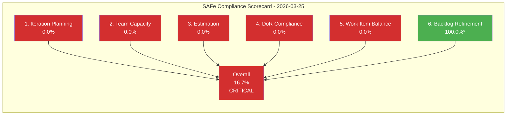
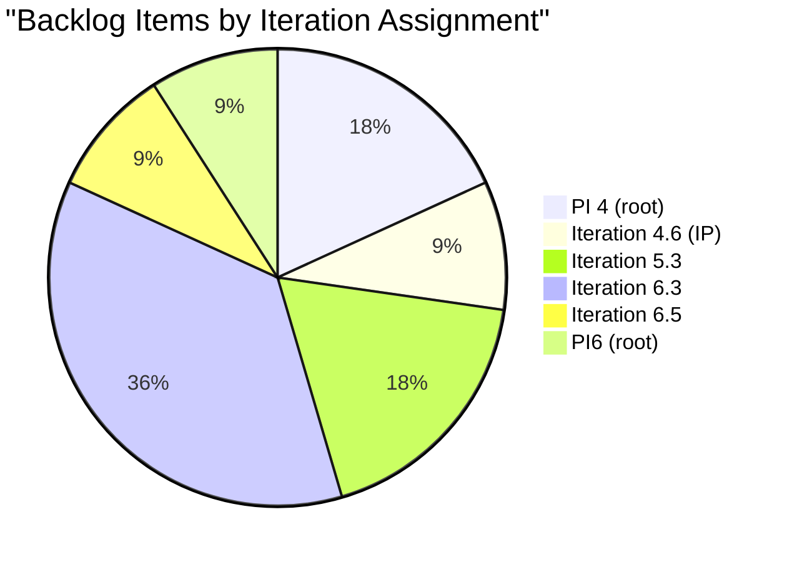
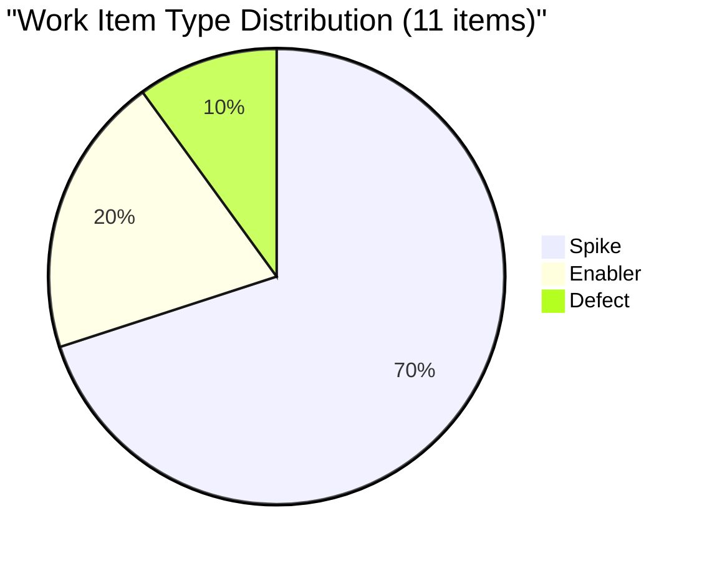
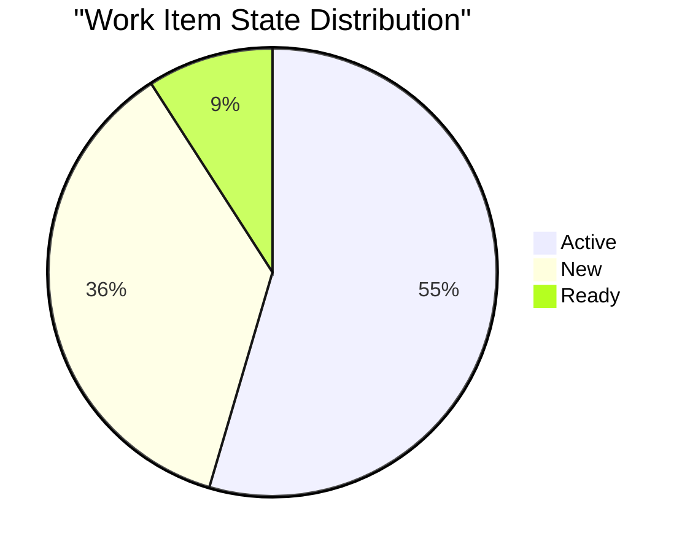
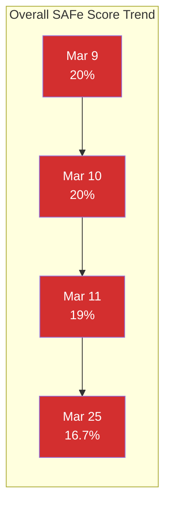
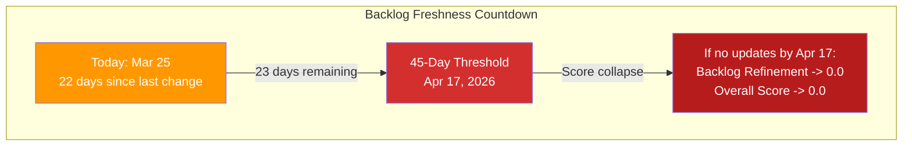

# SAFe Iteration Audit Report

## 1. Audit Metadata

| Field | Value |
|-------|-------|
| **Project** | AutoAllies (Auto Allies) |
| **Organization** | Jairo (dev.azure.com/jairo) |
| **Project ID** | `2d7af571-6ef6-4ad0-a509-c440e008b0fb` |
| **Team** | AA Operation Team |
| **Team Board ID** | `37592451-20d4-464a-b974-de8e09fb2e68` |
| **Team Board URL** | [Stories and Deliverables](https://dev.azure.com/jairo/Auto%20Allies/_boards/board/t/AA%20Operation%20Team/Stories%20and%20Deliverables) |
| **Backlog ID** | `Microsoft.RequirementCategory` |
| **Backlog Focus** | Stories and Deliverables |
| **Workspace Folder** | `ado_aa_ops` |
| **Current Iteration** | Iteration 6.6 (IP) |
| **Iteration Path** | `Auto Allies\2026-PI6\Iteration 6.6 (IP)` |
| **Iteration ID** | `40680df8-338c-46ea-a7b8-295da6a508d0` |
| **Iteration Start** | 2026-03-23 |
| **Iteration Finish** | 2026-04-05 |
| **Audit Date** | 2026-03-25 (Day 3 of iteration) |
| **Previous Audit** | `AUDIT_2026-03-25_013903.md` (2026-03-25, Iteration 6.6 IP) |
| **Overall Score** | **16.7 -- Critical** |
| **Risk Band** | Critical (< 40) |

**Scope boundary:** This audit inspects only the AA Operation Team's Stories and Deliverables backlog within the Auto Allies project under the Jairo ADO organization. No other teams, boards, projects, or repositories were analyzed. This project has no scoped GitHub repositories.

---

## 2. Executive Summary

This audit covers **Iteration 6.6 (IP)** -- the Innovation and Planning iteration closing PI6 (2026-PI6). Today is Day 3 of a 14-day iteration. The IP iteration remains **completely empty**: zero work items have been assigned, no team capacity has been configured, and no PI7 planning artifacts are visible in ADO.

The backlog continues to hold **11 root items**, all carrying an identical `ChangedDate` of **March 3, 2026 -- now 22 days of complete ADO stagnation**. No item has been created, moved, updated, estimated, or refined since the last audit earlier today or across the preceding five audits spanning March 9 through March 25.

The overall SAFe compliance score remains at **16.7% (Critical)**, unchanged from the earlier audit today. Five of six dimensions score 0.0 because the current iteration is empty. Backlog Refinement scores 100.0 purely because the March 3 bulk timestamp still falls within the 45-day freshness window -- this is a mathematical artifact, not evidence of healthy refinement.

**The team is now 3 days into the IP iteration with zero visible PI6 retrospective or PI7 planning activity. The window for meaningful IP utilization is narrowing.**

---

## 3. Previous Audit Delta

The previous audit (`AUDIT_2026-03-25_013903.md`) was produced earlier today and covers the same iteration. This section compares findings to identify any intra-day changes.

| Metric | Prior Audit (01:39) | This Audit (02:44) | Change |
|--------|---------------------|---------------------|--------|
| Current Iteration | 6.6 (IP) | 6.6 (IP) | Same |
| Items in Current Iteration | 0 | 0 | No change |
| Total Backlog Items | 11 | 11 | No change |
| Story Points Estimated | 2 of 11 | 2 of 11 | No change |
| Total Story Points | 6 | 6 | No change |
| Team Capacity Configured | No | No | No change |
| Days Since Any ADO Activity | 22 | 22 | No change |
| Overall SAFe Score | 16.7% | 16.7% | No change |
| Risk Band | Critical | Critical | Unchanged |
| Recommendations Addressed | 0 | 0 | Zero compliance |

### Delta Observations

1. **No ADO activity between audits.** All 11 work items retain `ChangedDate` of `2026-03-03T00:34:53.33Z`. No items were moved, updated, or created.
2. **Team capacity still unconfigured.** ADO API continues to return "no team capacity assigned to the team."
3. **Identical scoring.** All six dimensions produce identical results. The backlog state is frozen.
4. **Cumulative recommendation compliance remains at zero.** None of the recommendations from five prior audits (March 9, 10, 11, and both March 25 audits) have been addressed.

### Multi-Audit Score Trend

| Dimension | Mar 9 | Mar 10 | Mar 11 | Mar 25 (01:39) | Mar 25 (02:44) | Trend |
|-----------|-------|--------|--------|----------------|----------------|-------|
| Iteration Planning | 30% | 30% | 30% | 0% | **0%** | Collapsed since IP |
| Team Capacity | 0% | 0% | 0% | 0% | **0%** | Flat at zero |
| Estimation | 5% | 5% | 5% | 0% | **0%** | Collapsed since IP |
| DoR Compliance | 20% | 20% | 20% | 0% | **0%** | Collapsed since IP |
| Work Item Balance | 40% | 40% | 40% | 0% | **0%** | Collapsed since IP |
| Backlog Refinement | 30% | 25% | 20% | 100% | **100%** | Artificial spike |
| **Overall** | **20%** | **20%** | **19%** | **16.7%** | **16.7%** | Declining |

---

## 4. Current Iteration Snapshot

### Iteration 6.6 (IP) -- Innovation and Planning

| Property | Value |
|----------|-------|
| Start Date | 2026-03-23 |
| Finish Date | 2026-04-05 |
| Duration | 14 calendar days (10 working days) |
| Day of Iteration | Day 3 (2026-03-25) |
| Items Assigned | **0** |
| Team Capacity Configured | **No** (ADO error: "no team capacity assigned") |
| Project-Level Capacity Per Day | 28 hrs (not team-specific) |
| Team Days Off | 0 |

### SAFe IP Iteration Purpose

Per SAFe, the IP iteration should include:
- PI System Demo
- Inspect and Adapt (I&A) workshop
- PI Planning for PI7
- Innovation time / hackathon
- Technical debt and maintenance work
- Backlog refinement and grooming

**None of these activities are represented in ADO for Iteration 6.6 (IP).**

---

## 5. Work Item Analysis

### 5.1 Full Backlog -- Stories and Deliverables (11 root items)

| ID | Type | Title | State | Assigned To | Iteration | Story Pts | Changed Date | Days Stale |
|----|------|-------|-------|-------------|-----------|-----------|--------------|------------|
| 199547 | Defect | Multiple Accounts Causing Missing Cases & Incorrect Name Display | New | Jerlyn Ates | 6.5 | -- | Mar 3 | 22 |
| 195253 | Spike | Explore other Hotline Services for Philippines - Cost Efficient | Ready | Karl Caumban | 4.6 (IP) | -- | Mar 3 | 22 |
| 192272 | Enabler | 800.com account management for Auto Allies | New | Karl Caumban | PI 4 | -- | Mar 3 | 22 |
| 192442 | Enabler | [Operations] Email and Chat Support - Gathering Scenario | New | Jerlyn Ates | PI 4 | -- | Mar 3 | 22 |
| 196778 | Spike | 5.3 AutoAllies New Attorneys Onboarding | Active | Axle Rean Auguis | 5.3 | -- | Mar 3 | 22 |
| 196777 | Spike | 5.3 Customer Support - Inbound Calls | Active | Axle Rean Auguis | 5.3 | -- | Mar 3 | 22 |
| 198606 | Spike | IT 6.3 Case Management - Master Dashboard Chat and Email Support | Active | Mary Secusana | 6.3 | 5 | Mar 3 | 22 |
| 198605 | Spike | IT 6.3 Case Management - Pending Cases with NO Assigned Attorney's | Active | Mary Secusana | 6.3 | 1 | Mar 3 | 22 |
| 198603 | Spike | IT 6.3 Case Management - Pending Cases with Assigned Attorney NOT Accepted | Active | Mary Secusana | 6.3 | -- | Mar 3 | 22 |
| 198607 | Spike | IT 6.3 Case Management - Cases with Violation Date Before/Same as Subscription Date | Active | Mary Secusana | 6.3 | -- | Mar 3 | 22 |
| 197565 | Spike | Improvement Plan for Axle in 2026-PI6 (3 months goal) | New | Axle Rean Auguis | PI6 | -- | Mar 3 | 22 |

### 5.2 Backlog Composition

| Work Item Type | Count | Share |
|----------------|-------|-------|
| Spike | 7 | 63.6% |
| Enabler | 2 | 18.2% |
| Defect | 1 | 9.1% |
| **User Story** | **0** | **0.0%** |

### 5.3 State Distribution

| State | Count | Share |
|-------|-------|-------|
| Active | 6 | 54.5% |
| New | 4 | 36.4% |
| Ready | 1 | 9.1% |
| Closed/Done | 0 | 0.0% |

### 5.4 Iteration Distribution

| Iteration | Count | Notes |
|-----------|-------|-------|
| **6.6 (IP) -- current** | **0** | Empty current iteration |
| 6.5 | 1 | Defect 199547 (not carried forward) |
| 6.3 | 4 | Mary's case management Spikes |
| PI6 (root) | 1 | Axle's improvement plan |
| 5.3 | 2 | Axle's PI5 carryover Spikes |
| 4.6 (IP) | 1 | Karl's hotline Spike |
| PI 4 (root) | 2 | Oldest carryover items |

### 5.5 Assignment Distribution

| Team Member | Items | Types |
|-------------|-------|-------|
| Mary Secusana | 4 | 4 Spikes (all 6.3) |
| Axle Rean Auguis | 3 | 2 Spikes (5.3) + 1 Spike (PI6) |
| Karl Caumban | 2 | 1 Spike (4.6 IP) + 1 Enabler (PI 4) |
| Jerlyn Ates | 2 | 1 Defect (6.5) + 1 Enabler (PI 4) |

### 5.6 Story Point Coverage

| Metric | Value |
|--------|-------|
| Items with Story Points | 2 of 11 (18.2%) |
| Total Story Points | 6 (198606=5, 198605=1) |
| Unestimated Items | 9 (81.8%) |

### 5.7 DoR Assessment (Description + Acceptance Criteria)

| ID | Title (abbrev) | Description >= 30 chars | AC >= 20 chars | DoR Met |
|----|----------------|-------------------------|----------------|---------|
| 199547 | Multiple Accounts Causing Missing Cases... | Yes (~250 chars after trimming HTML) | No (empty) | No |
| 195253 | Explore other Hotline Services... | No (empty) | No (empty) | No |
| 192272 | 800.com account management... | No (empty) | No (empty) | No |
| 192442 | Email and Chat Support - Gathering... | No (empty) | No (empty) | No |
| 196778 | 5.3 AutoAllies New Attorneys Onboarding | No (empty) | No (empty) | No |
| 196777 | 5.3 Customer Support - Inbound Calls | No (empty) | No (empty) | No |
| 198606 | IT 6.3 Case Management - Master Dashboard... | No (empty) | No (empty) | No |
| 198605 | IT 6.3 Case Management - Pending Cases... | No (empty) | No (empty) | No |
| 198603 | IT 6.3 Case Management - Pending Cases... | No (empty) | No (empty) | No |
| 198607 | IT 6.3 Case Management - Cases with Violation... | No (empty) | No (empty) | No |
| 197565 | Improvement Plan for Axle... | No (empty) | Yes (~45 chars after trimming) | No |

**DoR compliant items: 0 of 11** -- No item meets both Description (>=30 chars) and Acceptance Criteria (>=20 chars) thresholds.

---

## 6. SAFe Compliance Scorecard

### Core Metric Definitions

| Metric | Value | Derivation |
|--------|-------|------------|
| `visible_root_backlog_items` | 11 | Root items on Stories and Deliverables backlog |
| `current_iteration_root_items` | 0 | Items with IterationPath = `Auto Allies\2026-PI6\Iteration 6.6 (IP)` |
| `contributors_with_current_work` | 0 | No items in current iteration |
| `contributors_with_capacity` | 0 | No team capacity configured (ADO API error) |
| `point_eligible_current_items` | 0 | No items in current iteration |
| `estimated_current_items` | 0 | No items in current iteration |
| `dor_compliant_current_items` | 0 | No items in current iteration |
| `fresh_visible_root_items` | 11 | All 11 items changed within 45 days (Mar 3 = 22 days ago) |
| `stale_90_visible_root_items` | 0 | No items older than 90 days by ChangedDate |
| `stale_180_visible_root_items` | 0 | No items older than 180 days by ChangedDate |
| `untouched_current_items` | 0 | No items in current iteration to evaluate |
| `dominant_type_share` | N/A | No items in current iteration |
| `spike_share` | N/A | No items in current iteration |

### Scorecard

| # | Dimension | Score | Formula | Evidence | Notes |
|---|-----------|-------|---------|----------|-------|
| 1 | **Iteration Planning** | **0.0** | 0 / 11 * 100 | 0 of 11 items in Iteration 6.6 (IP) | Empty IP iteration |
| 2 | **Team Capacity** | **0.0** | contributors_with_current_work = 0 -> 0 | No contributors; no capacity configured | ADO: "no team capacity assigned" |
| 3 | **Estimation** | **0.0** | point_eligible_current_items = 0 -> 0 | No items in current iteration | Cannot assess estimation |
| 4 | **DoR Compliance** | **0.0** | current_iteration_root_items = 0 -> 0 | No items in current iteration | Cannot assess DoR |
| 5 | **Work Item Balance** | **0.0** | current_iteration_root_items = 0 -> 0 | No items in current iteration | Cannot assess balance |
| 6 | **Backlog Refinement** | **100.0** | base=11/11*100=100; stale_90=0 (no penalty); stale_180=0 (no penalty); no current items (no untouched penalty) | 11/11 fresh; 0 stale | Artificially high -- see caveat below |
| | **Overall Score** | **16.7** | (0 + 0 + 0 + 0 + 0 + 100) / 6 | | **Critical** (< 40) |

### Backlog Refinement Score -- Important Caveat

The 100.0 score is a **mathematical artifact**. All 11 items share the identical `ChangedDate` of `2026-03-03T00:34:53.33Z`, which falls within the 45-day freshness window (threshold: Feb 8, 2026). This timestamp originates from a bulk system operation (likely iteration path reassignment), not from genuine team refinement. Items like 192272 and 192442 were created during PI 4 (approximately September 2025) and have not been meaningfully refined.

**Countdown:** The March 3 timestamp will exceed 45 days on **April 17, 2026**. If no items are individually updated before then, all 11 items will shift from "fresh" to "not fresh" and the Backlog Refinement score will collapse to 0.0, dropping the overall score to **0.0 (Critical)**.

---

## 7. Dimension Findings

### 7.1 Iteration Planning -- Score: 0.0 (Critical)

**Finding:** Zero of 11 backlog items are assigned to Iteration 6.6 (IP). The IP iteration is entirely empty in ADO.

**SAFe Standard:** The IP iteration should contain planned activities for PI retrospective, Inspect & Adapt, PI7 planning preparation, innovation time, and technical debt remediation. These activities should be tracked as work items.

**Impact:** Without any planned IP activities, the team has no visible commitments for the final iteration of PI6. There is no evidence that PI7 planning is being prepared. The team risks entering PI7 without objectives, capacity plans, or a refined backlog.

**Trend:** This dimension scored 30% during Iterations 6.3-6.5 (at least some items were in the active iteration). It collapsed to 0% when the team transitioned to IP without moving any items.

### 7.2 Team Capacity -- Score: 0.0 (Critical)

**Finding:** No team capacity is configured for Iteration 6.6 (IP). The ADO API returned "no team capacity assigned to the team." A project-level aggregate of 28 hrs/day exists but is not specific to this team or iteration.

**SAFe Standard:** Even during IP iterations, teams should configure capacity to plan PI planning preparation, innovation time, and maintenance work.

**Impact:** Without capacity data, there is no basis for load balancing, velocity calculation, or predictability metrics. PI7 planning will lack a capacity baseline.

**Trend:** Team capacity has scored 0% across all six audits (March 9, 10, 11, and three March 25 audits). This is the most persistent systemic gap.

### 7.3 Estimation -- Score: 0.0 (Critical)

**Finding:** No items exist in the current iteration, so no point-eligible items can be assessed. Across the full backlog, only 2 of 11 items (18.2%) carry story points: 198606 (5 SP) and 198605 (1 SP), both Mary Secusana's Iteration 6.3 Spikes.

**SAFe Standard:** All work items committed to an iteration should carry effort estimates to support capacity-based planning and velocity tracking.

**Impact:** The team has no meaningful estimation practice. Nine of eleven items remain unestimated after 22+ days.

### 7.4 DoR Compliance -- Score: 0.0 (Critical)

**Finding:** No items in the current iteration produces a zero denominator, defaulting the score to 0. Across the full backlog, zero items meet both Description (>=30 non-whitespace chars) and Acceptance Criteria (>=20 non-whitespace chars) thresholds:
- Only Defect 199547 has a substantive description (~250 chars after HTML trimming) but lacks Acceptance Criteria.
- Only Spike 197565 has Acceptance Criteria (~45 chars after markup trimming) but lacks a Description.

**Impact:** No item on the backlog would pass a DoR gate. If items were moved to 6.6 IP, they would all fail the readiness check.

### 7.5 Work Item Balance -- Score: 0.0 (Critical)

**Finding:** The current iteration is empty, making balance unassessable. Across the full backlog: 63.6% Spikes, 18.2% Enablers, 9.1% Defects, and **0% User Stories**. The complete absence of User Stories means no direct end-user value delivery is planned or tracked.

**SAFe Standard:** A healthy iteration contains a mix of User Stories (primary), with Spikes, Enablers, and Defects as supporting types.

**Impact:** The team has been in a permanent Spike-heavy pattern across all six audits with zero User Stories created. Spikes are research items that should convert into actionable User Stories -- this conversion has never occurred.

### 7.6 Backlog Refinement -- Score: 100.0 (Artificially High)

**Finding:** All 11 items have `ChangedDate` of March 3, 2026 (22 days ago), within the 45-day freshness window. No items exceed 90-day or 180-day staleness thresholds by `ChangedDate`. No penalties apply.

**Caveat:** This score is misleading. The March 3 timestamp reflects a bulk system operation, not genuine refinement. The true age of items like 192272 and 192442 dates back to PI 4 (September 2025). The score will collapse after April 17, 2026 when all items exceed 45 days unchanged.

---

## 8. Risks and Bottlenecks

| # | Risk | Likelihood | Impact | Trend | Mitigation |
|---|------|-----------|--------|-------|------------|
| R1 | PI6 closes with zero measurable delivery | **Very High** | High | Worsening | Emergency IP planning; assign items to 6.6 IP immediately |
| R2 | PI7 planning starts without velocity data or prepared backlog | **Very High** | High | Worsening | Use remaining IP days for estimation and backlog refinement |
| R3 | Team enters PI7 with no capacity baseline | **High** | High | Stable at worst | Configure capacity for 6.6 IP as reference baseline |
| R4 | Carryover items from PI4/PI5 become permanent backlog debt | **High** | Medium | Stable | Prune or close items older than 2 PIs during IP |
| R5 | ADO disengagement becomes permanent team culture | **Very High** | High | Worsening (22 days) | Management intervention; establish ADO as mandatory work system |
| R6 | Audit recommendations continue to be ignored (0 of 20+) | **Very High** | Medium | Worsening | Verbal escalation; tie ADO compliance to team performance metrics |
| R7 | Backlog Refinement score collapses after April 17 when all items pass 45-day threshold | **Certain** | Medium | Unchanged | Conduct genuine refinement (individual item updates) before April 17 |
| R8 | No User Stories created across entire PI6 | **Very High** | High | Stable at worst | Convert completed Spikes to User Stories for PI7 |

---

## 9. Prioritized Recommendations

### Critical (P0) -- Immediate Action Required

| # | Action | Owner | Target Date | Rationale |
|---|--------|-------|-------------|-----------|
| P0-1 | Conduct direct verbal escalation about ADO usage and audit compliance | Ramon Aseniero Jr | 2026-03-25 (today) | 22 days stagnation; 6 audits ignored; written recommendations have had zero effect |
| P0-2 | Move active/relevant items to Iteration 6.6 (IP) and conduct IP Iteration Planning | Karl Caumban | 2026-03-26 | IP iteration is empty; only 7 working days remain |
| P0-3 | Configure team capacity for all 4 members in Iteration 6.6 (IP) | Karl Caumban | 2026-03-26 | Zero capacity across 6 audits; needed for any planning |
| P0-4 | Create PI7 Planning preparation items (PI Objectives, team composition, velocity targets) | Ramon + Karl | 2026-03-28 | IP iteration purpose is PI planning; no prep is visible |

### High (P1) -- This Week

| # | Action | Owner | Target Date | Rationale |
|---|--------|-------|-------------|-----------|
| P1-1 | Estimate all 9 unestimated backlog items with story points | Full Team | 2026-03-28 | 81.8% items unestimated; blocks velocity calculation |
| P1-2 | Add Description and Acceptance Criteria to all items (DoR compliance) | Item Owners | 2026-03-28 | 0/11 items meet DoR; no quality gate |
| P1-3 | Convert completed Spikes into User Stories for PI7 | Full Team | 2026-03-31 | 7 Spikes (63.6%) with zero User Stories; no value delivery |
| P1-4 | Decide fate of Defect 199547: carry to 6.6 IP or close | Jerlyn Ates + Karl | 2026-03-26 | Orphaned in completed Iteration 6.5 |

### Medium (P2) -- Before IP Ends (April 5)

| # | Action | Owner | Target Date | Rationale |
|---|--------|-------|-------------|-----------|
| P2-1 | Prune or close PI4/PI5 carryover items (192272, 192442, 195253, 196777, 196778) | Karl + Ramon | 2026-04-03 | 5 items from 2+ PIs ago; backlog noise |
| P2-2 | Conduct PI6 Retrospective and document findings | Full Team | 2026-04-03 | SAFe IP ceremony; no evidence of planning |
| P2-3 | Establish mandatory ADO update cadence for PI7 (daily standup with board review) | Karl Caumban | 2026-04-05 | Prevent recurrence of 22-day stagnation |
| P2-4 | Set up ADO alerts for item staleness (>5 days unchanged) | Ramon | 2026-04-05 | Proactive monitoring for PI7 |

---

## 10. Evidence Gaps and Limitations

| # | Gap | Impact on Audit | Mitigation |
|---|-----|-----------------|------------|
| G1 | **Team capacity not configured** -- ADO returned "no team capacity assigned" for Iteration 6.6 (IP) | Team Capacity dimension defaults to 0; cannot assess load | Used project-level aggregate (28 hrs/day) as reference only; not scored |
| G2 | **No items in current iteration** -- All 11 items are assigned to past iterations | Five of six dimensions default to 0 due to empty denominator | Scored deterministically per rubric; documented in findings |
| G3 | **Bulk ChangedDate masks true item age** -- All items share `2026-03-03T00:34:53.33Z` | Backlog Refinement score (100.0) overstates actual health | Documented caveat; original creation dates approximate from iteration names |
| G4 | **No Description/AC for most items** -- API returned empty for 10/11 Description and 10/11 AC fields | DoR assessment may undercount if content exists outside these fields | Scored based on available API evidence |
| G5 | **No work item revision history inspected** -- Individual revisions not queried | Cannot detect transient ADO activity that left no field-level trace | Future audits may inspect revisions |
| G6 | **No scoped GitHub repositories** -- This project (ado_aa_ops) has no GitHub repos in scope | Cannot assess code delivery evidence or ADO-to-GitHub traceability | Limitation inherent to project scope |
| G7 | **Same-day repeat audit** -- Prior audit was ~1 hour ago on same date | Limited incremental insight; value is in confirming continued inaction | Delta section confirms identical state |

---

## Visualizations

### Score Breakdown

*\* Backlog Refinement is artificially high due to bulk ChangedDate reset. See Section 7.6.*

### Backlog Items by Iteration Assignment

*Note: Iteration 6.6 (IP) -- current iteration -- has 0 items and is not represented.*

### Backlog Composition by Work Item Type

*Note: User Story count is 0 -- absent from the entire backlog.*

### Work Item State Distribution

### Audit Score Trend

### Staleness Countdown

---

*Report generated on March 25, 2026 at 02:44 UTC-8 | SAFe Framework v6.0 Standards Applied*
*Scoring rubric: ADO SAFe v1 (six-dimension deterministic)*
*Previous audit: `AUDIT_2026-03-25_013903.md` (March 25, 2026, 01:39)*
*Audit file: `AUDIT_2026-03-25_024453.md`*
