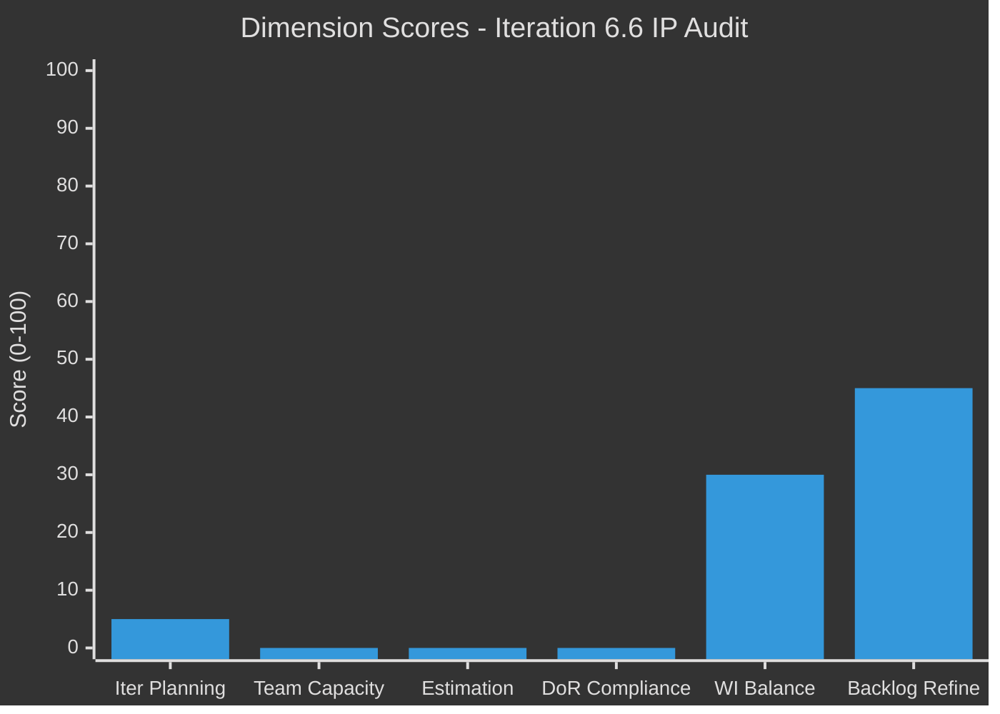

# SAFe Iteration Audit Report

## 1. Audit Metadata

| Field | Value |
|-------|-------|
| **Project** | Auto Allies |
| **Team** | UI UX Design Team |
| **Workspace** | `ado_aa_ux` |
| **Current Iteration** | Iteration 6.6 (IP) |
| **Iteration Start** | 2026-03-23 |
| **Iteration Finish** | 2026-04-05 |
| **Audit Date** | 2026-03-25 08:39 UTC |
| **Previous Audit** | AUDIT_20260311_152350.md (Iteration 6.5 Day 3) |
| **Overall Score** | **13.3 / 100** |
| **Risk Band** | **Critical** |
| **Scoring Rubric** | ADO SAFe v1 |

---

## 2. Executive Summary

This is the **fifth audit** of the UI UX Design Team and the **first audit of Iteration 6.6 (IP)** -- the Innovation and Planning sprint that closes PI 6. The team has transitioned from an empty Iteration 6.5 into the IP iteration. Of the team's 20 visible backlog items, only **1 item** (196669) is assigned to the current iteration, producing an Iteration Planning score of 5.0. No team capacity is configured for this iteration. The sole iteration item lacks Story Points, Description, and Acceptance Criteria.

A significant change since the last audit is the emergence of substantial development activity in the broader Auto Allies project iteration (15 root items across other teams), indicating project-level momentum that is **not reflected in the UI UX Design Team's own backlog**. The team's scoped Stories and Deliverables backlog remains largely static with only 1 of 20 items planned for the active sprint.

Three new User Story items (201473, 201476, 201494) were added to the backlog on 2026-03-23, and item 199122 was updated on 2026-03-16 -- the first signs of backlog activity since the last audit on March 11. However, these items were all assigned to the future PI7 iteration rather than the current 6.6 IP sprint.

Item #199978 (Case list Mock Up), which was flagged across all four prior audits for DoR violations, has been **moved out of the Auto Allies project scope** to Jairosoft Portfolio, removing it from this team's backlog. Item #193129 (Attorneys Overview REVAMP) remains in the expired Iteration 6.4 path and is now **182 days old** (created 2025-09-25).

The overall score of **13.3 (Critical)** reflects near-total absence of iteration planning, capacity management, estimation, and DoR compliance for this team's scoped backlog.

---

## 3. Previous Audit Delta

| Metric | Iteration 6.5 D3 (Mar 11) | Iteration 6.6 IP (Mar 25) | Change |
|--------|---------------------------|---------------------------|--------|
| Iteration | 6.5 | 6.6 (IP) | New iteration |
| Backlog Items | 18 | 20 | +2 new items |
| Items in Current Iteration | 0 | 1 | +1 (marginal improvement) |
| Team Capacity Set | No | No | No change |
| Story Points Committed | 0 | 0 | No change |
| DoR-Compliant Items in Sprint | 0 | 0 | No change |
| Unassigned Backlog Items | 8 | 9 | +1 (worsened) |
| #193129 Age (days) | 168 | 182 | +14 days |
| #199978 Status | In scope, DoR violation | Moved to different project | Removed from scope |
| Cumulative Recommendations | 35+ | 35+ | 0 acted upon |

**Key Deltas:**
- The team has entered a new iteration (6.6 IP) but planning remains minimal (1 item vs. 0 in 6.5).
- Three new User Stories were added to the backlog (201473, 201476, 201494) -- first new work items since prior audits, but all assigned to PI7 rather than current sprint.
- Item #199978 was moved to Jairosoft Portfolio, reducing the visible DoR violation count but not through remediation.
- The backlog grew from 18 to 20 items, but 9 items remain unassigned (up from 8).
- Item #193129 continues aging in the expired 6.4 iteration path.

---

## 4. Current Iteration Snapshot

| Metric | Value | SAFe Expectation |
|--------|-------|-----------------|
| Iteration | 6.6 (IP) | Innovation and Planning |
| Duration | 14 days (Mar 23 - Apr 5) | Standard |
| Days Elapsed | 3 of 14 (21%) | -- |
| Items Planned (from team backlog) | 1 | > 0 (met, minimally) |
| Story Points Committed | 0 | Based on velocity |
| Team Capacity Configured | No | Yes |
| Sprint Goal Defined | No evidence | Yes |
| Broader Iteration Items (all teams) | 15 root items | -- |

### Current Iteration Root Item (from team backlog)

| ID | Title | Type | State | Assigned To | Story Pts | DoR |
|----|-------|------|-------|-------------|:---------:|:---:|
| 196669 | Subscription Management Page for Admin Role Design | Design | New | Jaszmeine Villanueva | -- | Fail |

---

## 5. Work Item Analysis

### 5.1 Backlog Composition (20 items)

| Work Item Type | Count | % |
|---------------|:-----:|:-:|
| Design | 11 | 55% |
| User Story | 9 | 45% |
| **Total** | **20** | **100%** |

### 5.2 Backlog State Distribution

| State | Count | % |
|-------|:-----:|:-:|
| New | 18 | 90% |
| Design Review | 1 | 5% |
| Ready for Dev | 1 | 5% |

### 5.3 Assignment Distribution

| Person | Items | % |
|--------|:-----:|:-:|
| Unassigned | 9 | 45% |
| Jaszmeine Abigaille Villanueva | 7 | 35% |
| Aldrin Bataluna | 1 | 5% |
| Jerlyn Ates | 2 | 10% |
| Other (single items) | 1 | 5% |

### 5.4 Backlog Iteration Distribution

| Iteration Path | Items | Note |
|----------------|:-----:|------|
| 2026-PI7 (future) | 16 | Majority planned for next PI |
| Iteration 6.6 IP (current) | 1 | #196669 only |
| Iteration 6.4 (expired) | 1 | #193129 -- still stuck |
| Iteration 6.2 (expired) | 1 | #194395 -- Members Overview |
| Unassigned/Other | 1 | -- |

### 5.5 Backlog Freshness

| Category | Count | % |
|----------|:-----:|:-:|
| Fresh (changed within 45 days) | 13 | 65% |
| Aging (46-89 days) | 7 | 35% |
| Stale (90+ days) | 0 | 0% |
| Critical stale (180+ days) | 0 | 0% |

### 5.6 Chronic Item Tracker

| ID | Title | Created | Age (days) | State | Iteration | Notes |
|----|-------|---------|:----------:|-------|-----------|-------|
| 193129 | Attorneys Overview REVAMP - MVP version | 2025-09-25 | 182 | Ready for Dev | 6.4 (expired) | Still in expired iteration; last changed 2026-02-23 |
| 194395 | Members Overview REVISION | 2025-10-21 | 156 | Design Review | 6.2 (expired) | Still in expired iteration; last changed 2026-02-09 |

### 5.7 DoR Compliance Detail

Of the 1 current iteration root item:

| ID | Title | Description | Acceptance Criteria | DoR Status |
|----|-------|:-----------:|:-------------------:|:----------:|
| 196669 | Subscription Management Page for Admin Role Design | Missing | Missing | **FAIL** |

---

## 6. SAFe Compliance Scorecard

| Dimension | Score | Evidence | Notes |
|-----------|:-----:|----------|-------|
| **Iteration Planning** | 5.0 | 1 of 20 backlog items in current iteration | Near-empty sprint; 16 items parked in PI7 |
| **Team Capacity** | 0.0 | 0 of 1 contributors have capacity configured | ADO returned "No team capacity assigned to the team" |
| **Estimation** | 0.0 | 0 of 1 point-eligible items estimated | #196669 has no Story Points |
| **DoR Compliance** | 0.0 | 0 of 1 items have Description + Acceptance Criteria | #196669 missing both fields |
| **Work Item Balance** | 30.0 | 1 Design item; no User Stories in sprint; 100% type concentration | -40 (no User Stories) -30 (dominant type > 60%) |
| **Backlog Refinement** | 45.0 | 13/20 fresh; 0 stale 90+; 1/1 untouched current items | Base 65.0 - 20 (100% untouched current items) |
| **Overall** | **13.3** | **Critical** | All six dimensions below healthy threshold |

### Score Computation Detail

```
Iteration Planning  = round(1 / 20 * 100, 1)  = 5.0
Team Capacity       = round(0 / 1 * 100, 1)   = 0.0
Estimation          = round(0 / 1 * 100, 1)    = 0.0
DoR Compliance      = round(0 / 1 * 100, 1)    = 0.0

Work Item Balance:
  Start: 100
  No User Story in current iteration: -40
  Dominant type share (Design 100%) > 60%: -30
  Spike share (0%) <= 40%: no penalty
  Score = max(0, 100 - 40 - 30) = 30.0

Backlog Refinement:
  Base = round(13 / 20 * 100, 1) = 65.0
  Stale 90+ share (0/20 = 0%): no penalty
  Stale 180+ count (0): no penalty
  Untouched current items (1/1 = 100%) > 30%: -20
  Score = max(0, 65.0 - 20) = 45.0

Overall = round((5.0 + 0.0 + 0.0 + 0.0 + 30.0 + 45.0) / 6, 1) = 13.3
Risk Band: Critical (< 40)
```

```mermaid
%%{init: {'theme': 'dark'}}%%
radar
  title SAFe Compliance Scorecard - Iteration 6.6 (IP)
  axis "Iteration Planning" : 5
  axis "Team Capacity" : 0
  axis "Estimation" : 0
  axis "DoR Compliance" : 0
  axis "Work Item Balance" : 30
  axis "Backlog Refinement" : 45
```



---

## 7. Dimension Findings

### 7.1 Iteration Planning (5.0 / 100)

**Finding:** Only 1 of 20 backlog items is assigned to the current Iteration 6.6 (IP). Sixteen items are parked in the future PI7 iteration. Two items remain orphaned in expired iterations (6.2 and 6.4). The IP iteration is intended for innovation, planning, and completing carryover -- yet the team has essentially no planned scope.

**Impact:** The team has no meaningful sprint commitment. At 21% of the iteration elapsed, this mirrors the pattern from Iteration 6.5 where zero items were planned across the entire sprint.

### 7.2 Team Capacity (0.0 / 100)

**Finding:** ADO returned "No team capacity assigned to the team" for the UI UX Design Team in Iteration 6.6 (IP). The one contributor with work assigned (Jaszmeine Villanueva on #196669) has no configured capacity.

**Impact:** Without capacity data, the team cannot calculate a meaningful velocity, track utilization, or assess whether commitments are realistic. This is the fifth consecutive audit with zero capacity configuration.

### 7.3 Estimation (0.0 / 100)

**Finding:** The sole current iteration item (#196669, Design type) has no Story Points assigned. The item is point-eligible but unestimated.

**Impact:** Zero story points committed means zero measurable throughput, continuing the pattern of 0 SP velocity across all of PI 6 for this team.

### 7.4 DoR Compliance (0.0 / 100)

**Finding:** Item #196669 is missing both Description and Acceptance Criteria. It entered the iteration without meeting the Definition of Ready.

**Impact:** Without a description or acceptance criteria, there is no shared understanding of what "done" looks like for this item. This violates the project's own audit consideration: "Enforce DoR before sprint commitment."

### 7.5 Work Item Balance (30.0 / 100)

**Finding:** The single current iteration item is a Design type. No User Stories are planned in the sprint. The type concentration is 100% Design.

**Penalties Applied:**
- No User Story items: -40
- Dominant type share > 60%: -30

**Impact:** An IP iteration should ideally include a mix of work types (innovation stories, enablers, carryover). A single Design item with no User Stories represents an extremely narrow sprint scope.

### 7.6 Backlog Refinement (45.0 / 100)

**Finding:** 13 of 20 backlog items (65%) were changed within the last 45 days, which is a moderate freshness rate. No items exceed the 90-day or 180-day staleness thresholds. However, the sole current iteration item (#196669, last changed 2026-02-17) predates the iteration start (2026-03-23), meaning 100% of current items are untouched.

**Positive:** Three new User Stories were created on 2026-03-23, and one existing item was updated on 2026-03-16, showing some backlog refinement activity. The stale item situation from prior audits has improved -- no items exceed 90 days without a change.

**Penalty Applied:**
- 100% of current iteration items untouched since before sprint start: -20

---

## 8. Risks and Bottlenecks

| # | Risk | Likelihood | Impact | Trend |
|---|------|:----------:|:------:|:-----:|
| R1 | **PI 6 closes with zero delivery from UX team** -- IP iteration is the last sprint of PI 6, and the team has near-zero sprint scope | Very High | Critical | Continuing |
| R2 | **Fifth consecutive audit at Critical level** -- sustained process breakdown across 5 audits spanning 16 days | Very High | Critical | Continuing |
| R3 | **Audit recommendation non-adoption** -- 35+ recommendations across 4 prior audits with 0% action rate | Very High | High | Continuing |
| R4 | **Item #193129 aging beyond 6 months** -- now 182 days old, still in expired Iteration 6.4 | High | High | Worsening |
| R5 | **Ownership concentration** -- Jaszmeine holds 7 of 20 backlog items (35%) and is the only assignee on the current sprint item; 9 items (45%) are unassigned | High | Medium | Continuing |
| R6 | **PI7 over-commitment risk** -- 16 of 20 backlog items assigned to PI7 without completing any in PI6 | Medium | High | New |
| R7 | **Team-level vs. project-level disconnect** -- broader project has 15 active iteration items with multiple developers; UX team has 1 | Medium | Medium | New |

### Bottlenecks

1. **No Iteration Planning ceremony** -- The team has not held a visible planning session for 6.6 IP based on the single-item commitment.
2. **No capacity management discipline** -- Five consecutive iterations without capacity configuration.
3. **Backlog items accumulating in future PI** -- Items are being created and assigned to PI7 rather than being pulled into the current sprint.

---

## 9. Prioritized Recommendations

### 9.1 Immediate (Today -- Day 3 of Iteration 6.6 IP)

| # | Action | Owner | Priority |
|---|--------|-------|----------|
| R1 | **Pull backlog items into Iteration 6.6 IP** -- select 3-5 items from the PI7 backlog that can be started during the IP iteration; the IP sprint is meant for exactly this type of work | Karl (PM) | CRITICAL |
| R2 | **Configure team capacity** -- set daily hours for active team members (Jaszmeine, Aldrin, Jerlyn) in the 6.6 IP iteration | Karl (PM) | CRITICAL |
| R3 | **Complete DoR for #196669** -- add Description and Acceptance Criteria to the one planned item | Jaszmeine / Karl | CRITICAL |
| R4 | **Add Story Points to #196669** -- estimate the item so sprint velocity can be measured | Karl (PM) | HIGH |

### 9.2 This Week (Before IP Iteration Mid-Point)

| # | Action | Owner | Priority |
|---|--------|-------|----------|
| R5 | **Clean up expired iteration paths** -- move #193129 from 6.4 and #194395 from 6.2 to either the current sprint or the backlog root | Karl (PM) | HIGH |
| R6 | **Assign the 9 unassigned backlog items** -- every item needs an owner for PI7 planning to be credible | Karl / Ramon | HIGH |
| R7 | **Decide on #193129** -- at 182 days, formally close, descope, or re-commit with a concrete plan; all 4 child tasks remain in "New" | Ramon / Aldrin | HIGH |
| R8 | **Conduct PI 6 retrospective prep** -- document what was delivered (or not) in PI 6 for the I&P event | Karl (PM) | MEDIUM |

### 9.3 Process Improvements (for PI 7)

| # | Action | SAFe Practice |
|---|--------|---------------|
| R9 | Hold Iteration Planning ceremony before each sprint start | Iteration Planning |
| R10 | Configure capacity on Day 1 of every iteration | Capacity Planning |
| R11 | Enforce DoR gate: no items enter iteration without Description + AC + Story Points | Definition of Ready |
| R12 | Implement a formal recommendation tracking mechanism so audit findings are assigned and tracked | Inspect & Adapt |
| R13 | Set WIP limits and review cycle time for items exceeding 30 days | Flow Metrics |
| R14 | Schedule regular backlog refinement to prevent 45% unassigned rate | Backlog Refinement |
| R15 | Align UX team planning with broader project cadence -- development teams are active; UX team should synchronize | Team Sync |

---

## 10. Evidence Gaps and Limitations

| # | Gap | Impact on Scoring | Mitigation |
|---|-----|-------------------|------------|
| G1 | **Team capacity returned empty** -- ADO API returned "No team capacity assigned to the team"; no per-member capacity data available | Team Capacity dimension scored at 0; cannot differentiate between "not configured" and "API limitation" | Scored as 0 per rubric: denominator > 0 but numerator = 0 |
| G2 | **Sprint goal not inspectable via API** -- no ADO field directly exposes iteration-level sprint goals | Cannot verify or score sprint goal existence | Noted as observation; not part of the six-dimension rubric |
| G3 | **Iteration work items query returned a different team ID** -- the `wit_get_work_items_for_iteration` endpoint returned team `330e6bf1` (likely a shared/default team), not the scoped team `f095472a` | Iteration root items from that query may include items from other teams; scoring relied on the backlog query (scoped to the correct team) for `current_iteration_root_items` | Used `wit_list_backlog_work_items` as primary evidence per skill precedence rules |
| G4 | **Item #199978 moved to different project** -- previously flagged item is now under `Jairosoft Portfolio` iteration path, no longer visible in Auto Allies team backlog | Cannot track DoR remediation for this item | Noted as delta; no score impact since item is out of scope |
| G5 | **No revision history inspected** -- individual work item revision histories were not queried for all 20 backlog items | Cannot confirm exact dates of state transitions or field changes beyond `ChangedDate` | Relied on `ChangedDate` field as proxy per evidence precedence |
| G6 | **Description and Acceptance Criteria for most backlog items not returned** -- batch query returned these fields only when populated; many items show no value | DoR compliance assessment limited to current iteration items; full backlog DoR health unknown | Scored only current iteration items per rubric definition |

---

*Report generated on 2026-03-25 08:39 UTC using SAFe framework standards (ADO SAFe v1 rubric).*
*Audited by: Claude AI SAFe Consultant | Requested by: Ramon Aseniero Jr*
*Workspace: ado_aa_ux | Project: Auto Allies | Team: UI UX Design Team*
