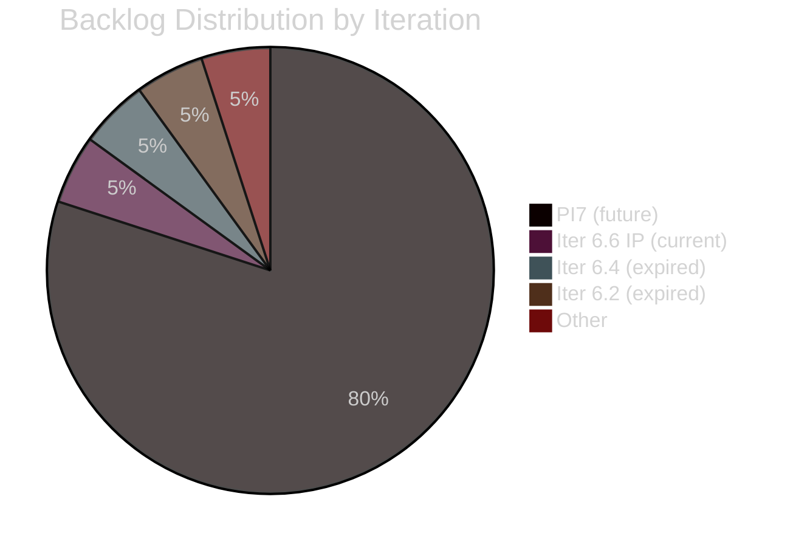
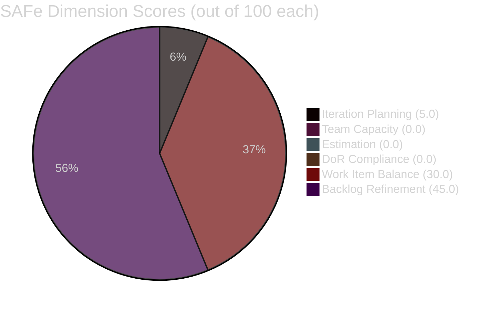
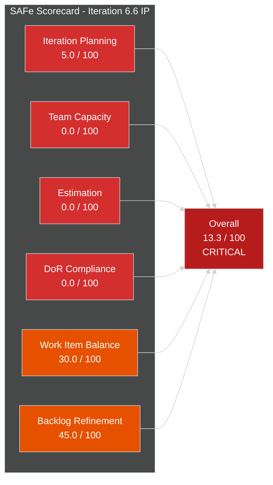
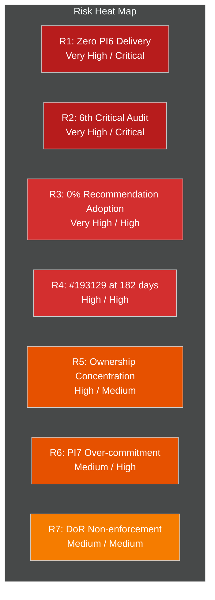

# SAFe Iteration Audit Report

## 1. Audit Metadata

| Field | Value |
|-------|-------|
| **Project** | Auto Allies |
| **Team** | UI UX Design Team |
| **Workspace** | `ado_aa_ux` |
| **ADO Org** | `jairo` (`dev.azure.com/jairo`) |
| **ADO Project ID** | `2d7af571-6ef6-4ad0-a509-c440e008b0fb` |
| **ADO Team ID** | `f095472a-75d2-4b7e-ba7a-b695903be537` |
| **Board URL** | [Stories and Deliverables](https://dev.azure.com/jairo/Auto%20Allies/_boards/board/t/UI%20UX%20Design%20Team/Stories%20and%20Deliverables) |
| **Backlog ID** | `Microsoft.RequirementCategory` |
| **Backlog Focus** | Stories and Deliverables |
| **Current Iteration** | Iteration 6.6 (IP) |
| **Iteration Path** | `Auto Allies\2026-PI6\Iteration 6.6 (IP)` |
| **Iteration Start** | 2026-03-23 |
| **Iteration Finish** | 2026-04-05 |
| **Audit Date** | 2026-03-25 09:45 UTC |
| **Previous Audit** | AUDIT_2026-03-25_083931.md (Iteration 6.6 IP, same-day) |
| **Overall Score** | **13.3 / 100** |
| **Risk Band** | **Critical** |
| **Scoring Rubric** | ADO SAFe v1 (six-dimension) |

> **Scope note:** This audit examines only the UI UX Design Team's Stories and Deliverables backlog within the Auto Allies project. No other boards, teams, projects, or repositories were analyzed.

---

## 2. Executive Summary

This is the **sixth audit** of the UI UX Design Team and the **second audit of Iteration 6.6 (IP)** -- the Innovation and Planning sprint that closes PI 6. The team's position is **unchanged** since the earlier same-day audit performed at 08:39 UTC.

Of the team's **20 visible root backlog items**, only **1 item** (196669 -- "Subscription Management Page for Admin Role Design") is assigned to the current iteration. No team capacity is configured. The sole iteration item has no Story Points, no Description, and no Acceptance Criteria -- a persistent DoR violation carried forward from previous audits.

The overall score remains **13.3 (Critical)**, identical to the earlier audit. All six scoring dimensions are below healthy thresholds. This marks the **sixth consecutive audit at Critical level** spanning 16+ days and two iterations (6.5 and 6.6 IP). Across five prior audits, **zero of 35+ recommendations have been acted upon**.

The IP iteration is designed for innovation, planning, retrospection, and completing carryover work. With only 1 unrefined item planned, the team is positioned to close PI 6 with no measurable delivery from the UX function.

---

## 3. Previous Audit Delta

| Metric | Prior Audit (Mar 25, 08:39) | This Audit (Mar 25, 09:45) | Change |
|--------|---------------------------|---------------------------|--------|
| Iteration | 6.6 (IP) | 6.6 (IP) | Same |
| Backlog Items | 20 | 20 | No change |
| Items in Current Iteration | 1 | 1 | No change |
| Team Capacity Set | No | No | No change |
| Story Points Committed | 0 | 0 | No change |
| DoR-Compliant Items in Sprint | 0 | 0 | No change |
| Unassigned Backlog Items | 9 | 9 | No change |
| #193129 Age (days) | 182 | 182 | Same day |
| Overall Score | 13.3 | 13.3 | No change |
| Risk Band | Critical | Critical | No change |
| Cumulative Recommendations | 35+ | 35+ | 0 acted upon |

**Key Delta:** No measurable changes detected since the earlier same-day audit. The backlog composition, iteration assignment, capacity configuration, estimation, and DoR compliance are all identical. This audit serves as a confirmation checkpoint.

### Trend Across All Audits

| Audit | Date | Iteration | Score | Risk |
|-------|------|-----------|:-----:|------|
| #1 | 2026-03-09 | 6.4 | N/A | Critical (0% completion) |
| #2 | 2026-03-09 | 6.5 | N/A | Critical (empty sprint) |
| #3 | 2026-03-10 | 6.5 Day 2 | N/A | Critical (empty sprint) |
| #4 | 2026-03-11 | 6.5 Day 3 | N/A | Critical (4 critical findings) |
| #5 | 2026-03-25 | 6.6 (IP) | 13.3 | Critical |
| **#6** | **2026-03-25** | **6.6 (IP)** | **13.3** | **Critical** |

---

## 4. Current Iteration Snapshot

| Metric | Value | SAFe Expectation |
|--------|-------|-----------------|
| Iteration | 6.6 (IP) | Innovation and Planning |
| Iteration Path | `Auto Allies\2026-PI6\Iteration 6.6 (IP)` | -- |
| Duration | 14 days (Mar 23 -- Apr 5) | Standard |
| Days Elapsed | 3 of 14 (21%) | -- |
| Items Planned (from team backlog) | 1 | Based on velocity |
| Story Points Committed | 0 | Based on velocity |
| Team Capacity Configured | No | Yes |
| Sprint Goal Defined | No evidence | Yes |

### Current Iteration Root Items

| ID | Title | Type | State | Assigned To | Story Pts | DoR |
|----|-------|------|-------|-------------|:---------:|:---:|
| 196669 | Subscription Management Page for Admin Role Design | Design | New | Jaszmeine Villanueva | -- | FAIL |

---

## 5. Work Item Analysis

### 5.1 Full Backlog Composition (20 items)

| Work Item Type | Count | % |
|---------------|:-----:|:-:|
| Design | 11 | 55.0% |
| User Story | 9 | 45.0% |
| **Total** | **20** | **100%** |

### 5.2 Backlog State Distribution

| State | Count | % |
|-------|:-----:|:-:|
| New | 18 | 90.0% |
| Design Review | 1 | 5.0% |
| Ready for Dev | 1 | 5.0% |

### 5.3 Assignment Distribution

| Person | Items | % | Current Iteration |
|--------|:-----:|:-:|:-:|
| Unassigned | 9 | 45.0% | 0 |
| Jaszmeine Abigaille Villanueva | 7 | 35.0% | 1 |
| Aldrin Bataluna | 1 | 5.0% | 0 |
| Jerlyn Ates | 2 | 10.0% | 0 |
| Pamela May Lamela | 0 | 0% | 0 |
| Other | 1 | 5.0% | 0 |

### 5.4 Backlog Iteration Distribution

| Iteration Path | Items | Note |
|----------------|:-----:|------|
| 2026-PI7 (future) | 16 | Majority planned for next PI |
| Iteration 6.6 IP (current) | 1 | #196669 only |
| Iteration 6.4 (expired) | 1 | #193129 -- orphaned |
| Iteration 6.2 (expired) | 1 | #194395 -- orphaned |
| Unassigned/Other | 1 | -- |



### 5.5 Backlog Freshness (as of 2026-03-25)

| Category | Threshold | Count | % |
|----------|-----------|:-----:|:-:|
| Fresh | Changed within 45 days | 13 | 65.0% |
| Aging | Changed 46--89 days ago | 7 | 35.0% |
| Stale (90+) | Changed 90+ days ago | 0 | 0.0% |
| Critical Stale (180+) | Changed 180+ days ago | 0 | 0.0% |

| ID | Title | Last Changed | Days Since | Category |
|----|-------|:------------:|:----------:|----------|
| 201494 | [V2.0] Sign Up - Coverage options | 2026-03-23 | 2 | Fresh |
| 201476 | [V2.0] Member - Case Status Dropdown | 2026-03-23 | 2 | Fresh |
| 201473 | [V2.0] Attorney - New Payout Settings | 2026-03-23 | 2 | Fresh |
| 199122 | [V2.0] Create pages for Privacy Policy | 2026-03-16 | 9 | Fresh |
| 200249 | [V2.0] Members Add-ons Assistance | 2026-03-06 | 19 | Fresh |
| 193129 | Attorneys Overview REVAMP - MVP | 2026-02-23 | 30 | Fresh |
| 196669 | Subscription Mgmt Page (current iter) | 2026-02-17 | 36 | Fresh |
| 199111 | Partial Member - Promote Upgrade | 2026-02-16 | 37 | Fresh |
| 199115 | Super Admin - Member Impersonation | 2026-02-16 | 37 | Fresh |
| 199116 | Super Admin - Remove Employee Login Link | 2026-02-16 | 37 | Fresh |
| 199124 | Login Enhancement - Force Password Reset | 2026-02-16 | 37 | Fresh |
| 199008 | AI-Powered Ticket Analysis | 2026-02-12 | 41 | Fresh |
| 194395 | Members Overview REVISION | 2026-02-09 | 44 | Fresh |
| 194181 | Master Dashboard Overview Revamp | 2026-02-06 | 47 | Aging |
| 194182 | UI Revamp Implementation of Master Dashboard | 2026-02-06 | 47 | Aging |
| 194200 | Latest UI Implementation to Master Dashboard | 2026-02-06 | 47 | Aging |
| 194360 | AA Main Landing Page Revamp | 2026-02-06 | 47 | Aging |
| 194362 | Landing Page Navigation Overview Revamp | 2026-02-06 | 47 | Aging |
| 196636 | DMV Page New Design for Ver2.0 | 2026-02-06 | 47 | Aging |
| 196637 | Tow Request New Design for Ver2.0 | 2026-02-06 | 47 | Aging |

### 5.6 Chronic Item Tracker

| ID | Title | Created | Age (days) | State | Iteration | Last Changed | Notes |
|----|-------|---------|:----------:|-------|-----------|:------------:|-------|
| 193129 | Attorneys Overview REVAMP - MVP version | 2025-09-25 | 182 | Ready for Dev | 6.4 (expired) | 2026-02-23 | Orphaned in expired iteration; has Description + AC + 5 SP but never moved forward |
| 194395 | Members Overview REVISION | 2025-10-21 | 156 | Design Review | 6.2 (expired) | 2026-02-09 | Orphaned in expired iteration; has Description but no AC |

### 5.7 DoR Compliance Detail (Current Iteration Items)

| ID | Title | Description | Acceptance Criteria | DoR Status |
|----|-------|:-----------:|:-------------------:|:----------:|
| 196669 | Subscription Management Page for Admin Role Design | Missing | Missing | **FAIL** |

### 5.8 Estimation Detail (Current Iteration Items)

| ID | Title | Type | Point-Eligible | Story Points | Status |
|----|-------|------|:-:|:-:|:---:|
| 196669 | Subscription Management Page for Admin Role Design | Design | Yes | -- | **Not estimated** |

---

## 6. SAFe Compliance Scorecard

| # | Dimension | Score | Evidence | Notes |
|:-:|-----------|:-----:|----------|-------|
| 1 | **Iteration Planning** | 5.0 | 1 of 20 backlog items in current iteration | Near-empty sprint; 16 items parked in PI7; 2 items orphaned in expired iterations |
| 2 | **Team Capacity** | 0.0 | 0 of 1 contributors have capacity configured | ADO returned "No team capacity assigned to the team" for fifth consecutive audit |
| 3 | **Estimation** | 0.0 | 0 of 1 point-eligible items estimated | #196669 has no Story Points |
| 4 | **DoR Compliance** | 0.0 | 0 of 1 current items have Description + Acceptance Criteria | #196669 missing both fields |
| 5 | **Work Item Balance** | 30.0 | 1 Design item; no User Stories in sprint; 100% dominant type | -40 (no User Story) -30 (dominant > 60%) |
| 6 | **Backlog Refinement** | 45.0 | 13/20 fresh (65%); 0 stale 90+; 1/1 untouched current items (100%) | Base 65.0 - 20 (untouched > 30%) = 45.0 |
| | **Overall** | **13.3** | **Critical** | All six dimensions below healthy threshold |

### Score Computation Detail

```
Iteration Planning  = round(1 / 20 * 100, 1)  = 5.0
Team Capacity       = round(0 / 1 * 100, 1)   = 0.0
Estimation          = round(0 / 1 * 100, 1)    = 0.0
DoR Compliance      = round(0 / 1 * 100, 1)    = 0.0

Work Item Balance:
  Start: 100
  No User Story in current iteration: -40
  Dominant type share (Design 100%) > 60%: -30
  Spike share (0%) <= 40%: no penalty
  Score = max(0, 100 - 40 - 30) = 30.0

Backlog Refinement:
  fresh_visible_root_items = 13
  Base = round(13 / 20 * 100, 1) = 65.0
  stale_90_visible_root_items = 0 (0/20 = 0%): no penalty
  stale_180_visible_root_items = 0: no penalty
  untouched_current_items = 1 (1/1 = 100%) > 30%: -20
  Score = max(0, 65.0 - 20) = 45.0

Overall = round((5.0 + 0.0 + 0.0 + 0.0 + 30.0 + 45.0) / 6, 1)
        = round(80.0 / 6, 1)
        = 13.3
Risk Band: Critical (< 40)
```





---

## 7. Dimension Findings

### 7.1 Iteration Planning (5.0 / 100) -- Critical

**Source:** ADO backlog query (scoped to UI UX Design Team, Stories and Deliverables)

**Finding:** Only 1 of 20 visible root backlog items is assigned to the current Iteration 6.6 (IP). Sixteen items are parked in the future PI7 iteration. Two items remain orphaned in expired iterations (6.2 and 6.4). One item has an unclassified iteration path.

**Impact:** The team has effectively no sprint commitment. The IP iteration -- designed for innovation, planning, and completing carryover -- has only a single Design item that itself lacks refinement. This is the third consecutive iteration (6.5, 6.5 continued, 6.6 IP) with near-zero planning.

**SAFe Reference:** Iteration Planning should result in a committed set of stories with clear objectives. A single unrefined item does not constitute a plan.

### 7.2 Team Capacity (0.0 / 100) -- Critical

**Source:** ADO team capacity API for Iteration 6.6 (IP)

**Finding:** The ADO API returned "No team capacity assigned to the team" for the UI UX Design Team. One contributor (Jaszmeine Villanueva) has work assigned to the current iteration but has no configured capacity. The `work_get_iteration_capacities` endpoint returned capacity for a different team (330e6bf1) at 28 hours/day, which does not belong to this team (f095472a).

**Impact:** Without capacity data, the team cannot calculate velocity, track utilization, or assess commitment realism. This is the fifth (or more) consecutive iteration without capacity configuration.

**SAFe Reference:** Teams should configure capacity at the start of every iteration to enable sustainable pace and realistic commitments.

### 7.3 Estimation (0.0 / 100) -- Critical

**Source:** ADO work item fields for current iteration items

**Finding:** Item #196669 (Design type) is point-eligible but has no Story Points assigned. Other Design items on the backlog do carry Story Points (e.g., #193129 has 5 SP, #194395 has 3 SP), confirming that Design items are expected to be estimated.

**Impact:** Zero committed story points means zero measurable throughput for the iteration. The team has recorded 0 SP velocity across all audited iterations in PI 6.

### 7.4 DoR Compliance (0.0 / 100) -- Critical

**Source:** ADO work item fields (Description, Acceptance Criteria) for current iteration items

**Finding:** Item #196669 is missing both Description and Acceptance Criteria. It entered the iteration without meeting the Definition of Ready.

**Impact:** Without a description or acceptance criteria, there is no shared understanding of scope, deliverables, or done criteria. This violates the project's own audit consideration: "Enforce DoR before sprint commitment: every item entering an iteration should have a usable description and acceptance criteria."

**Contrast:** Several PI7 items (e.g., 199111, 199124, 201473, 201476, 201494) do have Description and/or Acceptance Criteria, showing the team is capable of DoR compliance when creating new items -- but the current iteration item was not held to the same standard.

### 7.5 Work Item Balance (30.0 / 100) -- High Risk

**Source:** ADO work item types for current iteration items

**Finding:** The single current iteration item is a Design type. No User Stories are planned in the sprint.

**Penalties Applied:**
- No User Story items in iteration: -40
- Dominant type share (Design at 100%) exceeds 60%: -30
- Spike share (0%): no penalty

**Impact:** An IP iteration should include a mix of work types -- innovation spikes, enablers, retrospective actions, carryover stories. A single Design item with no User Stories represents an extremely narrow and unbalanced sprint scope.

### 7.6 Backlog Refinement (45.0 / 100) -- High Risk

**Source:** ADO ChangedDate fields for all 20 visible root items

**Finding:** 13 of 20 backlog items (65%) were changed within the last 45 days, a moderate freshness rate. No items exceed the 90-day or 180-day staleness thresholds (an improvement from prior PIs). However, the sole current iteration item (#196669, last changed 2026-02-17) predates the iteration start (2026-03-23), meaning **100% of current items are untouched**.

**Positive signals:**
- Three new User Stories (201473, 201476, 201494) were created on 2026-03-23 -- showing active backlog creation
- Item 199122 was updated on 2026-03-16
- No items have crossed the 90-day staleness boundary

**Penalty Applied:**
- 100% of current iteration items untouched since before sprint start: -20

**Note on #193129:** While its ChangedDate (2026-02-23) places it in the "Fresh" category by the 45-day threshold, the item has been in "Ready for Dev" state in the expired Iteration 6.4 path since at least the first audit on March 9. Its freshness is misleading -- the item is functionally stalled.

---

## 8. Risks and Bottlenecks

### Risk Register

| # | Risk | Likelihood | Impact | Trend vs Prior |
|---|------|:----------:|:------:|:--------------:|
| R1 | **PI 6 closes with zero delivery from UX team** -- IP iteration is the last sprint of PI 6; team has near-zero sprint scope and 0 SP velocity across the entire PI | Very High | Critical | Continuing |
| R2 | **Sixth consecutive audit at Critical level** -- sustained process breakdown across 6 audits spanning 16+ days and 2 iterations | Very High | Critical | Worsening |
| R3 | **Audit recommendation non-adoption** -- 35+ recommendations across 5 prior audits with 0% action rate | Very High | High | Continuing |
| R4 | **Item #193129 approaching 6-month age** -- now 182 days old, "Ready for Dev" in expired Iteration 6.4 with 5 SP | High | High | Continuing |
| R5 | **Ownership concentration** -- Jaszmeine holds 7 of 20 backlog items (35%) and is the sole assignee on the current sprint item; 9 items (45%) remain unassigned | High | Medium | Continuing |
| R6 | **PI7 over-commitment risk** -- 16 of 20 backlog items assigned to PI7 without completing any items in PI6 | Medium | High | Continuing |
| R7 | **DoR non-enforcement pattern** -- current iteration item lacks DoR while newer PI7 items have it, indicating inconsistent gating | Medium | Medium | Continuing |



### Bottlenecks

1. **No Iteration Planning ceremony** -- The team has not held a visible planning session for 6.6 IP based on the single-item commitment.
2. **No capacity management discipline** -- Six consecutive audits without capacity configuration.
3. **Backlog items accumulating in future PI** -- Items are being created and assigned to PI7 rather than being pulled into the current sprint, despite the IP iteration being designed for exactly this type of transitional work.
4. **Expired iteration orphans** -- Two items (#193129, #194395) remain stuck in expired iteration paths with no evidence of triage.

---

## 9. Prioritized Recommendations

### 9.1 Immediate (Today -- Day 3 of Iteration 6.6 IP)

| # | Action | Owner | Priority | Status Since Prior Audit |
|---|--------|-------|----------|--------------------------|
| R1 | **Pull 3-5 items from PI7 backlog into Iteration 6.6 IP** -- the IP sprint is designed for innovation, carryover, and planning work; select items that can realistically start this week | Karl (PM) | CRITICAL | Repeated -- not acted upon |
| R2 | **Configure team capacity for 6.6 IP** -- set daily hours for Jaszmeine, Aldrin, and Jerlyn in the iteration settings | Karl (PM) | CRITICAL | Repeated -- not acted upon |
| R3 | **Complete DoR for #196669** -- add Description and Acceptance Criteria before any work begins | Jaszmeine / Karl | CRITICAL | Repeated -- not acted upon |
| R4 | **Add Story Points to #196669** -- estimate the item so sprint velocity can be measured | Karl (PM) | HIGH | Repeated -- not acted upon |

### 9.2 This Week (Before IP Iteration Mid-Point, Mar 30)

| # | Action | Owner | Priority | Status Since Prior Audit |
|---|--------|-------|----------|--------------------------|
| R5 | **Move #193129 from expired 6.4 to current iteration or backlog root** -- at 182 days old, decide: commit, descope, or close | Ramon / Aldrin | HIGH | Repeated -- not acted upon |
| R6 | **Move #194395 from expired 6.2 to current iteration or backlog root** -- 156 days old, in Design Review state with no forward progress | Karl / Jaszmeine | HIGH | Repeated -- not acted upon |
| R7 | **Assign the 9 unassigned backlog items** -- every item needs an owner for PI7 planning to be credible | Karl / Ramon | HIGH | Repeated -- not acted upon |
| R8 | **Conduct PI 6 retrospective preparation** -- document what was delivered (or not) in PI 6 for the Inspect & Adapt event | Karl (PM) | MEDIUM | Repeated -- not acted upon |

### 9.3 Process Improvements (for PI 7 Readiness)

| # | Action | SAFe Practice | Priority |
|---|--------|---------------|----------|
| R9 | Hold Iteration Planning ceremony before each sprint start | Iteration Planning | HIGH |
| R10 | Configure capacity on Day 1 of every iteration | Capacity Planning | HIGH |
| R11 | Enforce DoR gate: no items enter iteration without Description + AC + Story Points | Definition of Ready | HIGH |
| R12 | Implement a recommendation tracking mechanism so audit findings are assigned, tracked, and reported on | Inspect & Adapt | HIGH |
| R13 | Set WIP limits and review cycle time for items exceeding 30 days in any state | Flow Metrics | MEDIUM |
| R14 | Schedule regular backlog refinement sessions to prevent 45% unassigned rate | Backlog Refinement | MEDIUM |
| R15 | Add Acceptance Criteria to all PI7 items that currently lack them (e.g., 199008, 199115, 199116, 200249) | Definition of Ready | MEDIUM |

### Recommendation Adoption Tracker

| Audit | Date | Recommendations | Acted Upon |
|-------|------|:---------------:|:----------:|
| #1 | 2026-03-09 | 7 | 0 |
| #2 | 2026-03-09 | 8 | 0 |
| #3 | 2026-03-10 | 9 | 0 |
| #4 | 2026-03-11 | 10 | 0 |
| #5 | 2026-03-25 | 15 | 0 |
| **#6** | **2026-03-25** | **15** | **0** |
| **Cumulative** | -- | **35+** | **0 (0%)** |

---

## 10. Evidence Gaps and Limitations

| # | Gap | Impact on Scoring | Mitigation |
|---|-----|-------------------|------------|
| G1 | **Team capacity returned empty** -- ADO API returned "No team capacity assigned to the team" for the UI UX Design Team (f095472a) | Team Capacity scored at 0; cannot differentiate between "not configured" and "API limitation" | Scored as 0 per rubric: contributors_with_current_work > 0 but contributors_with_capacity = 0 |
| G2 | **Iteration capacities returned different team** -- `work_get_iteration_capacities` returned team `330e6bf1` with 28 hrs/day capacity, not the scoped team `f095472a` | Cannot use project-level capacity data for team-level scoring | Used team-specific `work_get_team_capacity` as authoritative source |
| G3 | **Sprint goal not inspectable via API** -- no ADO field directly exposes iteration-level sprint goals | Cannot verify or score sprint goal existence | Noted as observation; not part of the six-dimension rubric |
| G4 | **Description and Acceptance Criteria absence** -- batch query returns these fields only when populated; absence indicates empty/missing fields | DoR compliance scored based on field presence; absence treated as non-compliant | Conservative scoring approach per rubric |
| G5 | **No revision history inspected** -- individual work item revision histories were not queried for all 20 items | Cannot confirm exact dates of state transitions beyond ChangedDate | Relied on ChangedDate as proxy per evidence precedence |
| G6 | **Same-day re-audit with no interval changes** -- this audit was performed approximately 1 hour after the prior audit; no ADO changes occurred in the interval | All scores and findings are identical to the prior audit | Report serves as a confirmation checkpoint; no data was fabricated or altered |

---

*Report generated on 2026-03-25 09:45 UTC using SAFe framework standards (ADO SAFe v1 six-dimension rubric).*
*Audited by: Claude AI SAFe Consultant | Requested by: Ramon Aseniero Jr*
*Workspace: ado_aa_ux | Project: Auto Allies | Team: UI UX Design Team*
