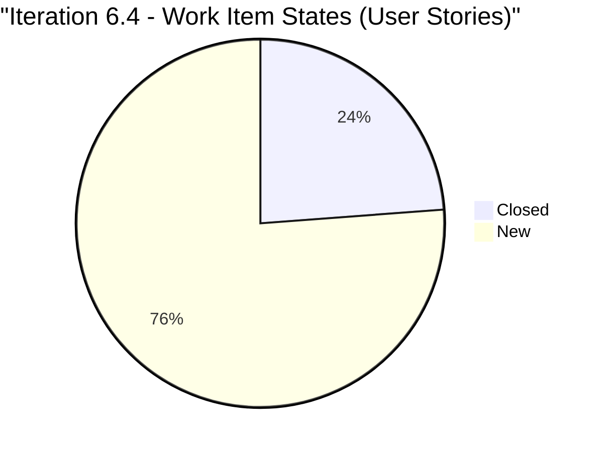
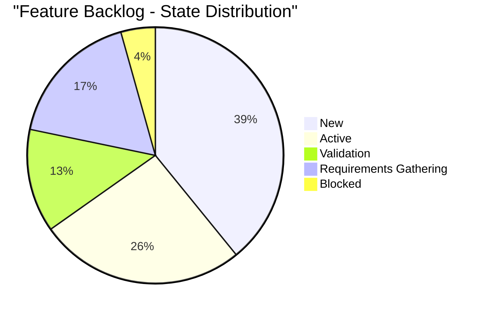
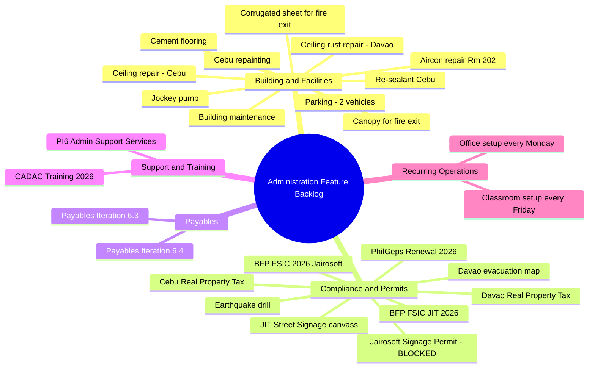
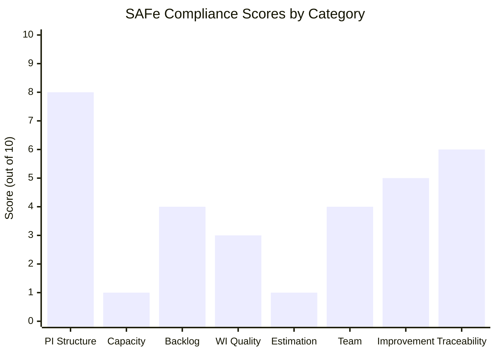

# SAFe Audit Report — Administration Team Board
## Jairosoft FINOPS Azure DevOps Project

**Audit Date:** February 25, 2026
**Auditor:** AI Agile PM Consultant
**Framework:** Scaled Agile Framework (SAFe) 6.0
**Current PI:** PI 6 (2026)
**Current Iteration:** Iteration 6.4 (Feb 23 – Mar 8, 2026)
**Board URL:** [Administration Team Board](https://dev.azure.com/jairo/Jairosoft%20FINOPS/_boards/board/t/Administration%20Team/Stories%20and%20Deliverables)

---

## 1. Executive Summary

This audit examines the Administration Team Board within the Jairosoft FINOPS project against SAFe framework standards. The team is currently in **Iteration 6.4** of **PI 6** and manages administrative services including building maintenance, compliance/permits, payables, and training. The audit reveals several areas requiring immediate attention around capacity planning, estimation practices, and work item quality, while recognizing that the team has established a solid PI and iteration cadence structure.

**Overall SAFe Compliance Score: 42/100 (Needs Significant Improvement)**

| Category | Score | Rating |
|---|---|---|
| PI & Iteration Structure | 8/10 | Good |
| Capacity Planning | 1/10 | Critical |
| Backlog Management | 4/10 | Poor |
| Work Item Quality | 3/10 | Poor |
| Estimation & Velocity | 1/10 | Critical |
| Team Structure & Collaboration | 4/10 | Poor |
| Continuous Improvement | 5/10 | Fair |
| Hierarchy & Traceability | 6/10 | Fair |

---

## 2. Project & Team Overview

### 2.1 Team Composition
The Jairosoft FINOPS project has **4 teams**:

- FINOPS Program Team (default)
- Finance Team
- **Administration Team** ← *audit target*
- Human Resource Recruitment Team

The Administration Team has a single visible active member: **Mark Colina** (`mcolina@jairosoft.com`), who is the sole assignee on all 23 work items in the current iteration.

### 2.2 PI & Iteration Cadence

The project follows a structured PI cadence with 2-week iterations. The team has progressed through the following PIs:

```
PI 0 (xPI 0)  → Iterations 0.6–0.7  (Nov–Dec 2024)
PI 1 (xPI 1)  → Iterations 1.1–1.7  (Dec 2024–Apr 2025) — includes IP Sprint
PI 3           → Iterations 3.1–3.6  (Jun–Sep 2025) — includes IP Sprint
PI 4           → Iterations 4.2–4.6  (Sep–Nov 2025) — includes IP Sprint
PI 5           → Iterations 5.1–5.3  (Dec 2025–Jan 2026)
PI 6 (current) → Iterations 6.1–6.6  (Jan–Apr 2026) — includes IP Sprint
```

**Finding:** PI 2 appears to be missing entirely from the iteration history. PI 5 only has 3 iterations instead of the standard 5-6. These gaps suggest either team restructuring or planning inconsistencies.

---

## 3. Current Iteration Analysis (6.4)

### 3.1 Work Item Breakdown

The current iteration contains **23 work items** organized as follows:

| Type | Count | New | Active | Closed |
|---|---|---|---|---|
| User Story | 21 | 16 | 0 | 5 |
| Task | 2 | 0 | 0 | 2 |
| **Total** | **23** | **16** | **0** | **7** |

**Completion Rate (Day 3 of 14): 24% of items closed (5 of 21 stories)**

### 3.2 Current Iteration Work Items by Category

**Category 1: Administrative Support Services** (Feature #199316 — Active)

| ID | Title | State |
|---|---|---|
| 198526 | Notarize of documents at Davao City Hall | Closed |
| 199392 | Pick up SO Certificate at TESDA | New |
| 199395 | Submit documents at BIR | Closed |
| 199427 | Deposit payment for JIT computer set at Union Bank | Closed |
| 199603 | Budget request Gas for grass cutter | Closed |
| 199604 | Purchase gasoline for grass cutting | New |
| 199605 | Implementation of grass cutting at the back of the building | New |
| 199614 | Notary of alpha list (Jairosoft) for BIR | Closed |

**Category 2: Payables for Iteration 6.4** (Feature #199319 — Active)

| ID | Title | State |
|---|---|---|
| 199320 | Condo Cebu payments | New |
| 199322 | Jairosoft food allowance payment | New |
| 199324 | Professional fee payment | New |
| 199328 | Water Davao and Cebu payment | New |
| 199331 | Government and EGOV payables | New |
| 199334 | Internet payment for Cebu and Davao office | New |
| 199336 | St. Peter payment for Edmund Mina | New |
| 199345 | VECO Cebu office payment | New |

**Category 3: CADAC Training 2026** (Feature #196719 — Active)

| ID | Title | State |
|---|---|---|
| 196725 | Participate in CADAC training (Day 1) | New |
| 199312 | Inquire and payment for CADAC training at UIC | New |
| 199466 | Participate in CADAC training (Day 2) | New |

**Category 4: Building Maintenance** (Feature #196416 — Active)

| ID | Title | State |
|---|---|---|
| 197121 | Purchase materials needed for repairing ceiling rust | New |
| 197122 | Implementation of repairing the ceiling rust 3rd floor | New |

### 3.3 Iteration Progress Diagram



---

## 4. Feature Backlog Analysis

The Administration Team has **26 Features** on their backlog in the following states:

| Feature State | Count |
|---|---|
| New | 9 |
| Active | 6 |
| Validation | 3 |
| Requirements Gathering | 4 |
| Blocked | 1 |
| (No other states) | — |

### 4.1 Feature State Distribution Diagram



### 4.2 Feature Categories

The features span several administrative domains:



### 4.3 Key Feature Risks

| Feature | State | Risk |
|---|---|---|
| #170869 — Jairosoft Signage Permit | **Blocked** | No resolution path visible; stale since creation |
| #156213 — Cement flooring at back | New | In backlog since early PIs; no progress |
| #158382 — Canopy for fire exit | New | Safety item with no movement |
| #176942 — Jockey pump installation | New | Fire safety equipment — stalled |

---

## 5. SAFe Compliance Assessment

### 5.1 What's Working Well

1. **PI & Iteration Cadence** — The team follows a consistent 2-week iteration cycle within defined PIs, including Innovation & Planning (IP) sprints at the end of each PI. This aligns with SAFe's recommended cadence.

2. **Hierarchy Structure** — The work item hierarchy (Epic → Feature → User Story → Task) is in place and most stories are linked to parent features, providing traceability.

3. **Iteration-aligned Payables** — The team creates per-iteration payable features (e.g., "Payables for Iteration 6.4"), demonstrating cadence-based financial planning.

### 5.2 Critical Findings

#### FINDING 1: No Capacity Planning (Severity: CRITICAL)

The team has **zero capacity configured** for Iteration 6.4. SAFe requires teams to establish capacity during Iteration Planning to ensure sustainable pace and predictable delivery.

**Impact:** Without capacity data, the team cannot determine if they are over- or under-committed. With 23 items assigned to a single person in a 2-week sprint, there is a high risk of overload.

**Recommendation:** Configure individual capacity per iteration based on available hours and activity type. The team should set capacity during PI Planning and refine it at the start of each iteration.

#### FINDING 2: No Story Point Estimation (Severity: CRITICAL)

**None of the 21 User Stories** in the current iteration have Story Points assigned. This is a fundamental gap that prevents velocity tracking, predictability metrics, and workload balancing.

**Impact:** Without estimation, the team cannot measure velocity, forecast future iterations, or perform meaningful sprint planning.

**Recommendation:** Adopt relative estimation using the Fibonacci scale (1, 2, 3, 5, 8, 13). All stories must be estimated before being committed to an iteration.

#### FINDING 3: Single Point of Failure — One Team Member (Severity: HIGH)

All 23 work items in Iteration 6.4 are assigned to **Mark Colina**. This represents a critical bus-factor risk. If this individual is unavailable, the entire team's delivery stops.

**Recommendation:** Either expand the team or document the rationale if this is intentionally a single-person team. In SAFe, even small teams benefit from cross-training and shared ownership.

#### FINDING 4: No Acceptance Criteria on Stories (Severity: HIGH)

User Stories lack visible acceptance criteria and descriptions. SAFe requires stories to follow the INVEST model (Independent, Negotiable, Valuable, Estimable, Small, Testable). Without acceptance criteria, there is no definition of "done" at the story level.

**Recommendation:** Every User Story should include a clear "As a... I want... So that..." format with explicit acceptance criteria.

#### FINDING 5: Work Item Title Quality Issues (Severity: MEDIUM)

Multiple work items contain typos and inconsistencies:

| ID     | Title Issue                                      |
| ------ | ------------------------------------------------ |
| 199322 | "Jairosoft food allowanec payment" → "allowance" |
| 199324 | "Prosessional fee payment" → "Professional"      |
| 199331 | "Goverment and EGOV payables" → "Government"     |
| 199334 | "Internet paymentfor Cebu..." → missing space    |

**Recommendation:** Establish a checklist for work item creation that includes title review before submission.

#### FINDING 6: Features Lack Business Value & Effort Estimates (Severity: HIGH)

None of the 26 Features have Business Value or Effort fields populated. SAFe uses WSJF (Weighted Shortest Job First) for prioritization, which requires these values.

**Recommendation:** Implement WSJF scoring during PI Planning. Each Feature should have Cost of Delay (Business Value + Time Criticality + Risk Reduction) and Job Size populated.

#### FINDING 7: Missing PI 2 and Incomplete PI 5 (Severity: MEDIUM)

The iteration history jumps from PI 1 to PI 3, and PI 5 has only 3 iterations instead of the typical 5-6. This suggests disruptions in planning cadence.

**Recommendation:** Document the rationale for skipped PIs. Maintain consistent PI boundaries to enable cross-PI velocity comparison.

#### FINDING 8: 16 of 21 Stories Still in "New" State (Severity: MEDIUM)

On Day 3 of a 14-day iteration, 76% of User Stories remain in "New" state with 0 in "Active." While some items may be scheduled for later in the iteration, the lack of any active work items alongside 5 already closed suggests a batch-processing pattern rather than continuous flow.

**Recommendation:** Move stories to "Active" when work begins. Consider implementing WIP limits to encourage flow over batch work.

### 5.3 Compliance Summary Diagram



---

## 6. Velocity & Predictability

### 6.1 Comparative Iteration Size

| Iteration | Period | User Stories | Tasks | Total Items |
|---|---|---|---|---|
| 6.2 (past) | Jan 26 – Feb 8 | ~28 | ~28 | ~56 |
| 6.3 (past) | Feb 9 – Feb 22 | ~25 | ~25 | ~50 |
| **6.4 (current)** | **Feb 23 – Mar 8** | **21** | **2** | **23** |

**Observation:** The current iteration has significantly fewer tasks compared to previous iterations. Prior iterations show a consistent pattern of 1:1 Story-to-Task ratio, while Iteration 6.4 has only 2 tasks for 21 stories. This indicates that task decomposition is largely missing.

**Recommendation:** Each User Story should be decomposed into at least 1-3 tasks to enable progress tracking and workload visibility.

---

## 7. Recommendations Summary

### Immediate Actions (This Iteration)

1. **Set team capacity** for Iteration 6.4 in Azure DevOps
2. **Add Story Points** to all 21 User Stories using team estimation
3. **Move active work items** from "New" to "Active" to reflect real status
4. **Fix typos** in work item titles (#199322, #199324, #199331, #199334)

### Short-Term Actions (Next 1-2 Iterations)

5. **Decompose stories into tasks** — target 1-3 tasks per story
6. **Add acceptance criteria** to all User Stories
7. **Populate Feature-level Business Value and Effort** for WSJF prioritization
8. **Address blocked Feature #170869** (Signage Permit) — escalate or remove

### Medium-Term Actions (Next PI Planning)

9. **Implement WSJF prioritization** at Feature level during PI Planning
10. **Establish velocity tracking** based on Story Points completed per iteration
11. **Cross-train team members** or formalize single-person team structure with risk mitigation plan
12. **Review and clean the Feature backlog** — 26 features for a single-person team may be unrealistic
13. **Document PI 2 gap** and standardize PI lengths to 5-6 iterations

### Process Improvement

14. **Implement a Definition of Ready** checklist: title, description, acceptance criteria, estimate, parent feature
15. **Implement a Definition of Done**: all tasks closed, acceptance criteria met, stakeholder validation
16. **Consider board column configuration** to enforce WIP limits

---

## 8. Risk Register

| Risk | Likelihood | Impact | Mitigation |
|---|---|---|---|
| Single team member unavailability | Medium | Critical | Cross-train, document processes |
| Feature backlog overwhelm (26 items, 1 person) | High | High | WSJF prioritization, backlog grooming |
| Safety features stalled (fire exit, pump) | Medium | High | Escalate to program level |
| No predictability metrics | Certain | Medium | Implement Story Points + velocity |
| Blocked signage permit | Certain | Low | Escalate or archive |

---

## 9. Conclusion

The Administration Team has established a solid foundation with proper PI and iteration cadence, including IP sprints. However, critical gaps in capacity planning, estimation, and work item quality undermine the team's ability to operate within SAFe's principles of transparency, inspection, and adaptation. The most urgent priorities are implementing Story Point estimation, setting team capacity, and addressing the single-point-of-failure risk. With focused improvement over the next 2-3 iterations, this team can significantly improve its SAFe maturity and delivery predictability.

---

*Report generated on February 25, 2026 | SAFe 6.0 Framework Standards*
*Next audit recommended: End of PI 6 (April 2026)*
