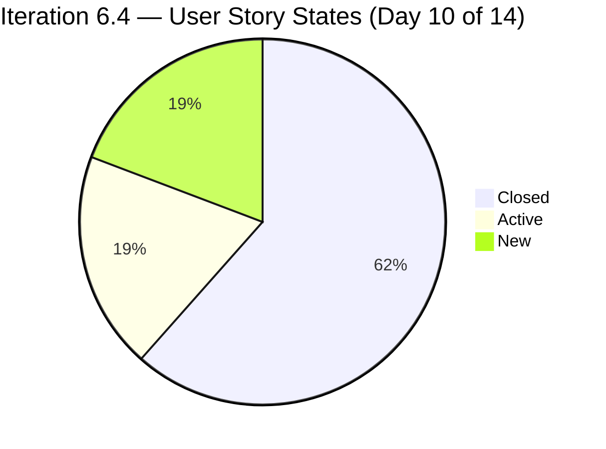
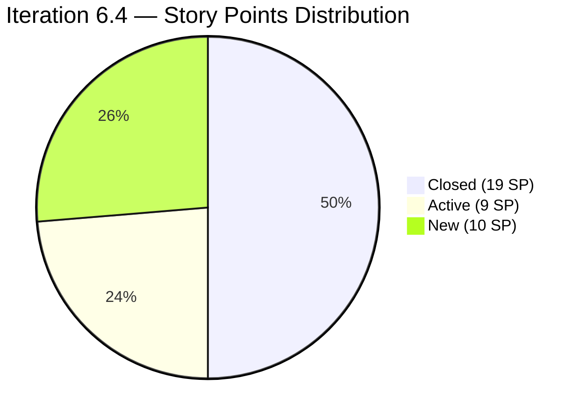
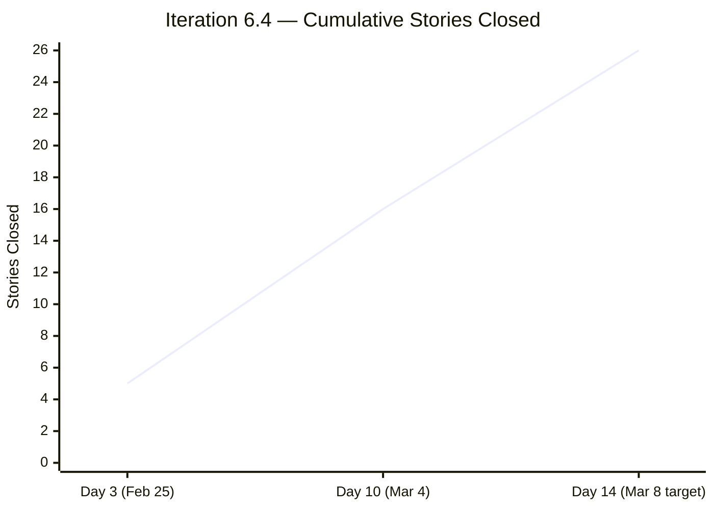
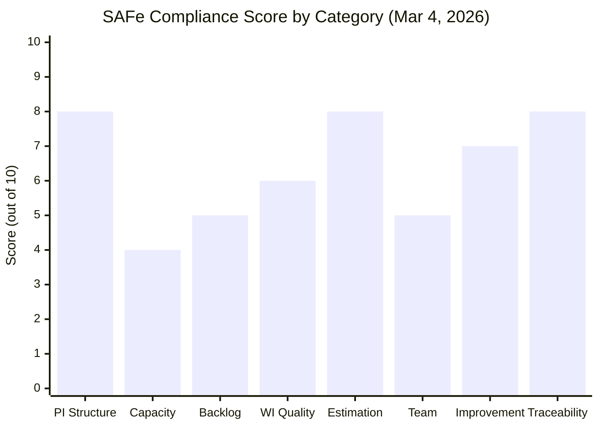
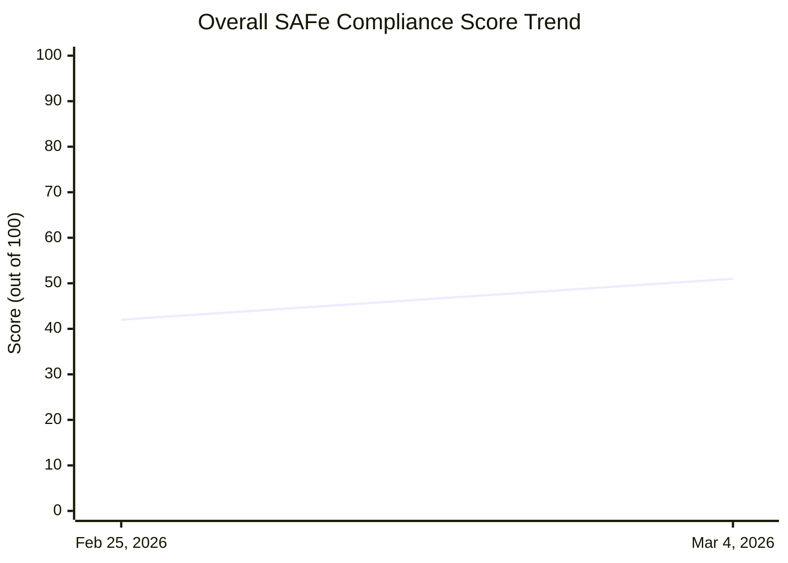
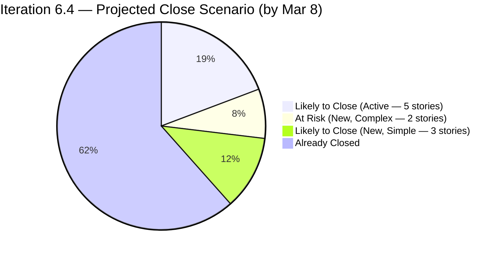

# SAFe Audit Report — Administration Team Board
## Jairosoft FINOPS Azure DevOps Project

**Audit Date:** March 4, 2026
**Auditor:** AI Agile PM Consultant
**Framework:** Scaled Agile Framework (SAFe) 6.0
**Current PI:** PI 6 (2026)
**Current Iteration:** Iteration 6.4 (Feb 23 – Mar 8, 2026) — Day 10 of 14
**Board URL:** [Administration Team Board](https://dev.azure.com/jairo/Jairosoft%20FINOPS/_boards/board/t/Administration%20Team/Stories%20and%20Deliverables)
**Previous Audit:** February 25, 2026

---

## 1. Executive Summary

This is the daily audit of the Administration Team Board for **Iteration 6.4, Day 10 of 14**. The team has made **remarkable progress** since the February 25, 2026 audit, resolving the two most critical SAFe compliance gaps (Story Point estimation and acceptance criteria), and significantly improving task decomposition, capacity planning, and flow management.

**Overall SAFe Compliance Score: 51/100 — Needs Improvement** *(↑ from 42/100 on Feb 25)*

| Category | Feb 25 Score | Mar 4 Score | Change | Rating |
|---|---|---|---|---|
| PI & Iteration Structure | 8/10 | 8/10 | → | Good |
| Capacity Planning | 1/10 | 4/10 | ↑ +3 | Poor |
| Backlog Management | 4/10 | 5/10 | ↑ +1 | Fair |
| Work Item Quality | 3/10 | 6/10 | ↑ +3 | Fair |
| Estimation & Velocity | 1/10 | 8/10 | ↑ +7 | Good |
| Team Structure & Collaboration | 4/10 | 5/10 | ↑ +1 | Fair |
| Continuous Improvement | 5/10 | 7/10 | ↑ +2 | Good |
| Hierarchy & Traceability | 6/10 | 8/10 | ↑ +2 | Good |

```mermaid
xychart-beta
    title "SAFe Compliance Score — Feb 25 vs Mar 4"
    x-axis ["PI Structure", "Capacity", "Backlog", "WI Quality", "Estimation", "Team", "Improvement", "Traceability"]
    y-axis "Score (out of 10)" 0 --> 10
    bar [8, 1, 4, 3, 1, 4, 5, 6]
    bar [8, 4, 5, 6, 8, 5, 7, 8]
```

---

## 2. Previous Audit Findings — Resolution Status

The following table tracks each finding from the February 25, 2026 audit against its current status.

| # | Finding | Severity | Prior Status | Current Status | Resolution |
|---|---|---|---|---|---|
| F1 | No Capacity Planning | CRITICAL | 0 hrs configured | Mark Colina: 8 hrs/day configured | ⚠️ PARTIAL |
| F2 | No Story Point Estimation | CRITICAL | 0/21 estimated | 25/26 estimated | ✅ RESOLVED |
| F3 | Single Point of Failure | HIGH | 1 member, 1 assignee | 2 members (Grace added) | ⚠️ PARTIAL |
| F4 | No Acceptance Criteria | HIGH | 0/21 with AC | 26/26 with AC | ✅ RESOLVED |
| F5a | Typo: #199322 "allowanec" | MEDIUM | Present | Title corrected | ✅ RESOLVED |
| F5b | Typo: #199324 "Prosessional" | MEDIUM | Present | Still present | ❌ OPEN |
| F5c | Typo: #199331 "Goverment" | MEDIUM | Present | Still present | ❌ OPEN |
| F5d | Typo: #199334 "paymentfor" | MEDIUM | Present | Still present | ❌ OPEN |
| F6 | Features lack WSJF values | HIGH | Not populated | Not yet verified | ⚠️ UNVERIFIED |
| F7 | Missing PI 2, Incomplete PI 5 | MEDIUM | Structural gap | Unchanged (structural) | ⚠️ STRUCTURAL |
| F8 | 76% stories in "New" state | MEDIUM | 16/21 "New" | 5/26 "New" (19%) | ✅ RESOLVED |
| F9 | Only 2 tasks for 21 stories | MEDIUM | 2 tasks | ~36 tasks for 26 stories | ✅ RESOLVED |

### 2.1 Key Improvements Since Feb 25

The team has acted on nearly every recommendation from the previous audit. In 7 days, they achieved:
- **Story Point coverage jumped from 0% to 96%** — the most critical gap is now essentially closed.
- **Acceptance criteria added to all 26 stories** — the team adopted the practice consistently.
- **Task decomposition radically improved** — from 2 tasks to ~36 tasks, giving the board real progress visibility.
- **Capacity planning initiated** — Mark Colina's daily capacity is now configured at 8 hours.
- **Flow significantly improved** — only 19% of stories are "New" on Day 10, compared to 76% on Day 3.
- **A second team member (Grace) has been onboarded** to the team.

---

## 3. Current Iteration Analysis — Iteration 6.4 (Day 10 of 14)

### 3.1 Work Item Summary

| Type | Count | Closed | Active | New |
|---|---|---|---|---|
| User Story | 26 | 16 | 5 | 5 |
| Task | ~36 | — | — | — |
| **Total Stories** | **26** | **16 (62%)** | **5 (19%)** | **5 (19%)** |

**Story Points:**
| State | Stories | Story Points |
|---|---|---|
| Closed | 16 | 19 SP |
| Active | 5 | 9 SP |
| New | 5 | 10 SP |
| **Total** | **26** | **~38 SP** |

At Day 10 of 14, the team has closed **19 out of ~38 committed story points (50%)** and 62% of stories. With 4 days remaining, the remaining 14 open/active stories need to be addressed.

### 3.2 Iteration Progress — State Distribution

### 3.3 Iteration Progress — Story Points by State

### 3.4 Detailed Work Item List

**Category 1: Administrative Support Services**

| ID | Title | State | SP |
|---|---|---|---|
| 198526 | Notarize of documents at Davao City Hall | ✅ Closed | 1 |
| 199392 | SO Certificate (TESDA) | 🔵 New | 1 |
| 199395 | Submit documents at BIR | ✅ Closed | 1 |
| 199427 | Deposit payment for JIT computer set at Union Bank | ✅ Closed | 1 |
| 199593 | Inquire BFP for certificate renewal | ✅ Closed | 1 |
| 199603 | Budget request Gas for grass cutter | ✅ Closed | 1 |
| 199604 | Purchase gasoline and nylon for grass cutting | ✅ Closed | 1 |
| 199605 | Implementation of grass cutting at the back of the building (Day 1) | 🟡 Active | 3 |
| 199614 | Notary of alpha list (Jairosoft) for BIR | ✅ Closed | 1 |
| 199763 | Notary of sworn declaration for BIR | ✅ Closed | 2 |
| 199923 | BIR alpha list submission | ✅ Closed | 1 |

**Category 2: Payables for Iteration 6.4**

| ID | Title | State | SP |
|---|---|---|---|
| 199320 | Condo Cebu payments | ✅ Closed | 2 |
| 199322 | Jairosoft food allowance payment | ✅ Closed | 1 |
| 199324 | Prosessional fee payment ⚠️ | 🟡 Active | 3 |
| 199328 | Water Davao and Cebu payment | ✅ Closed | 2 |
| 199331 | Goverment and EGOV payables ⚠️ | ✅ Closed | 2 |
| 199334 | Internet paymentfor Cebu and Davao office ⚠️ | 🔵 New | 4 |
| 199336 | St. Peter payment for Edmund Mina | 🟡 Active | 1 |
| 199345 | VECO Cebu office payment | 🔵 New | 1 |
| 199905 | Toyota Fortuner (Cebu) | ✅ Closed | ❌ None |
| 199942 | Plane ticket for Jove Moralde to Japan | ✅ Closed | 1 |

**Category 3: CADAC Training 2026**

| ID | Title | State | SP |
|---|---|---|---|
| 199312 | Inquire and payment for CADAC training at UIC | ✅ Closed | 1 |

**Category 4: Building Maintenance**

| ID | Title | State | SP |
|---|---|---|---|
| 197121 | Purchase materials needed for repairing ceiling rust | 🔵 New | 1 |
| 197122 | Implementation of repairing the ceiling rust 3rd floor | 🔵 New | 3 |

**Category 5: Events & Travel (New since Feb 25)**

| ID | Title | State | SP |
|---|---|---|---|
| 200080 | Phyton Asia 2026 | 🟡 Active | 1 |
| 200083 | Dr.Dental SOA Feb. 2026 | 🟡 Active | 1 |

> ⚠️ = Work item title contains a typo from the previous audit finding that remains unresolved.

### 3.5 Completion Trajectory

---

## 4. Capacity Analysis

### 4.1 Current Team Capacity Configuration

| Member | Capacity/Day | Activity | Days Off |
|---|---|---|---|
| Mark Colina | 8 hrs | Documentation | None |
| Grace | 0 hrs | (not set) | None |

**Finding (NEW — Partially Resolved):** Capacity is now configured for Mark Colina at 8 hrs/day, which is a significant improvement from the February 25 state of zero capacity for any team member. However, **"grace" (grace@jairosoft.com)** has been added to the team roster but her capacity remains at 0 hrs/day with no activity configured. This means the capacity planning for the second team member is incomplete.

**Additionally:** The activity type "Documentation" may be overly narrow. SAFe recommends breaking capacity into activity types that reflect the actual work (e.g., field operations, payments, compliance, maintenance). Using a single "Documentation" category limits the team's ability to balance workload across different types of administrative tasks.

### 4.2 Commitment vs. Capacity Assessment

| Metric | Value |
|---|---|
| Iteration duration | 14 days |
| Mark Colina capacity | 8 hrs/day × 14 days = 112 hrs |
| Grace capacity | 0 hrs |
| Total team capacity | 112 hrs |
| Committed user stories | 26 |
| Total story points committed | ~38 SP |

With 26 stories assigned to a single effective contributor (Mark Colina), the per-story time budget averages 4.3 hrs per story. This is workable for transactional tasks but tight for more complex items like building maintenance (#197121, #197122) and internet payments with 7 sub-items (#199334).

---

## 5. New Findings

### FINDING A: One Story Missing Story Points — #199905 (Severity: LOW)

Story #199905 "Toyota Fortuner (Cebu)" is **Closed** but has **no story points** assigned. While this is a single story and the item is already closed, it creates a gap in velocity tracking. The team needs to ensure estimation happens *before* work begins, not after.

**Recommendation:** Add story points retrospectively to #199905 and establish a "Definition of Ready" that requires estimation before a story can move to Active.

### FINDING B: Grace Added but Not Yet Productive (Severity: MEDIUM)

A second team member, **Grace (grace@jairosoft.com)**, has been added to the Administration Team, partially addressing the single-point-of-failure risk. However, Grace has 0 capacity configured for this iteration and no work items assigned. The addition of the team member is a positive structural step, but the onboarding is incomplete.

**Recommendation:** In Iteration 6.5, assign Grace a daily capacity and allocate at least some stories to her to begin cross-training and shared ownership.

### FINDING C: 5 Stories Still "New" on Day 10 — Risk to Iteration Completion (Severity: HIGH)

With only 4 days remaining (March 5–8), **5 stories totaling 10 story points** remain in "New" state:

| ID | Title | SP | Risk |
|---|---|---|---|
| 199392 | SO Certificate (TESDA) | 1 | Low |
| 197121 | Purchase materials for ceiling rust repair | 1 | Low |
| 197122 | Repairing the ceiling rust 3rd floor | 3 | Medium (implementation work) |
| 199334 | Internet payment for Cebu and Davao | 4 | Medium (7 providers to pay) |
| 199345 | VECO Cebu office payment | 1 | Low |

The building maintenance items (#197121, #197122) and the internet payments (#199334 — 7 providers) represent the highest completion risk. **If not started and completed this week, the iteration will not achieve 100% closure.**

**Recommendation:** Mark Colina should immediately move these 5 stories to "Active" status and prioritize #199334 (4 SP, 7 sub-items) and #197122 (3 SP, implementation work) as they carry the most effort.

### FINDING D: Description-Title Mismatch on #199392 (Severity: LOW)

Story #199392 has been renamed in the **title** to "SO Certificate (TESDA)" but the **description** still reads "Pick up SO Certificate at TESDA." This creates a minor disconnect between the story title and its acceptance criteria narrative.

**Recommendation:** Minor — update the description to match the new title format for consistency.

### FINDING E: 3 Typos from Previous Audit Remain Unresolved (Severity: MEDIUM)

| ID | Current Title | Typo | Correct Title |
|---|---|---|---|
| 199324 | Prosessional fee payment | "Prosessional" | "Professional fee payment" |
| 199331 | Goverment and EGOV payables | "Goverment" | "Government and EGOV payables" |
| 199334 | Internet paymentfor Cebu and Davao office | "paymentfor" | "Internet payment for Cebu and Davao office" |

These were flagged in the February 25 audit. One title (#199322) was corrected; the remaining three persist. Title quality affects backlog professionalism and searchability.

---

## 6. SAFe Compliance Assessment

### 6.1 Compliance Score Summary

### 6.2 Score Trend

### 6.3 Highlights of What's Working

The team demonstrated rapid response to audit findings — something that is **rare and commendable** for teams at early SAFe maturity stages. Specifically:

**Story point adoption was near-universal and fast.** Going from 0% to 96% estimation coverage in 7 days represents strong team engagement. This enables meaningful velocity tracking from Iteration 6.4 onward, which was impossible before.

**Task decomposition transformed the board's usefulness.** The shift from 2 tasks to ~36 tasks across 26 stories means the Kanban board now provides real visibility into day-to-day progress. Each story has at least one task, and complex items like internet payments (#199334) have 7 sub-tasks — exactly the granularity SAFe encourages.

**Flow is healthy at Day 10.** Only 19% of stories remain in "New" state, compared to 76% on Day 3 of the previous audit cycle. The team appears to be working items continuously rather than batch-completing them at the end.

---

## 7. Recommendations

### Immediate (Before Iteration 6.4 Closes — by March 8)

1. **Start and close the 5 remaining "New" stories** — especially #199334 (4 SP, internet payments) and #197122 (3 SP, ceiling rust repair implementation). Failure to complete these will reduce iteration velocity.
2. **Fix the 3 remaining title typos**: #199324, #199331, #199334.
3. **Add story points to #199905** (Toyota Fortuner) retroactively.
4. **Configure Grace's capacity** for the remainder of Iteration 6.4 if she will contribute any work.

### Short-Term (Iteration 6.5 Planning — next 2 weeks)

5. **Assign work items to Grace** in Iteration 6.5 to begin transitioning from a single-person team. Start with transactional items (payments, document pickups).
6. **Set Grace's daily capacity** during Iteration 6.5 planning.
7. **Expand capacity activity types** beyond "Documentation" — add categories like "Payments & Payables," "Compliance & Permits," "Facility Maintenance" to enable workload visibility by type.
8. **Implement Definition of Ready**: story points, acceptance criteria, and parent feature must be set before a story moves into an iteration.

### Medium-Term (PI 6 Planning / PI 7 Preparation)

9. **Verify and populate Feature-level WSJF scores** — Business Value, Time Criticality, Risk Reduction, and Job Size fields on all 26 Features in the backlog.
10. **Establish velocity baseline**: with estimation now in place, track Story Points Closed per iteration starting from 6.4. Target a stable velocity band by Iteration 6.6.
11. **Address stalled safety Features** in the backlog: canopy for fire exit (#158382), jockey pump (#176942). These are fire-safety items that should be escalated to the program level.
12. **Review blocked Feature #170869** (Jairosoft Signage Permit) — establish a resolution owner and timeline, or formally archive it.

---

## 8. Risk Register — Updated

| Risk | Likelihood | Impact | Change Since Feb 25 | Mitigation |
|---|---|---|---|---|
| Iteration 6.4 not fully closed (5 stories, 10 SP remain) | Medium | Medium | **NEW** | Prioritize #199334 and #197122 immediately |
| Single team member unavailability | Medium | High | ↓ Reduced (Grace added, but inactive) | Assign work to Grace in 6.5 |
| Grace not onboarded productively | High | Medium | **NEW** | Configure capacity, assign stories in 6.5 |
| Feature backlog overwhelm (26 features, 1 active contributor) | Medium | High | → Unchanged | WSJF prioritization, backlog grooming |
| Safety features stalled (fire exit, pump) | Medium | High | → Unchanged | Escalate to program level |
| WSJF not implemented at Feature level | High | Medium | → Unchanged | Implement during next PI Planning |
| No predictability metrics (baseline now emerging) | Low | Low | ↓ Reduced (estimation adopted) | Track velocity from 6.4 onward |
| Blocked signage permit #170869 | Certain | Low | → Unchanged | Escalate or archive |

---

## 9. Iteration Close Forecast

**Projected Completion: 21–24 of 26 stories (81–92%) — depending on execution of remaining New items.**

| Scenario | Stories Closed | SP Closed | Velocity |
|---|---|---|---|
| Best case (all 5 New completed) | 26/26 | 38 SP | 38 SP |
| Likely case (3 New completed) | 24/26 | 34 SP | 34 SP |
| Conservative (1 New completed) | 22/26 | 29 SP | 29 SP |

*This will establish the team's first measurable iteration velocity baseline.*

---

## 10. Conclusion

The Administration Team has achieved a **significant improvement** in SAFe compliance between February 25 and March 4, 2026 — moving from a score of 42/100 to 51/100 in just 7 days. The resolution of the two most critical findings (zero story point estimation and zero acceptance criteria) demonstrates a high level of team commitment and responsiveness to the audit process.

The most pressing issue as of Day 10 is **completing the 5 remaining "New" stories** before the iteration closes on March 8. The team should also immediately address Grace's onboarding to begin distributing the delivery load.

The team is now positioned to begin building a real velocity baseline in Iteration 6.4, which will make Iteration 6.5 planning significantly more reliable and data-driven.

**Next audit recommended: End of Iteration 6.4 (March 8, 2026) or start of Iteration 6.5 (March 9, 2026)**

---

*Report generated on March 4, 2026 | SAFe 6.0 Framework Standards*
*Auditor: AI Agile PM Consultant*
