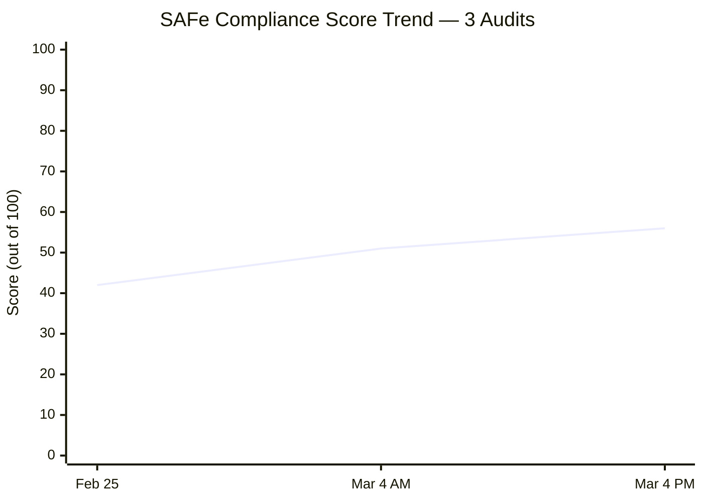
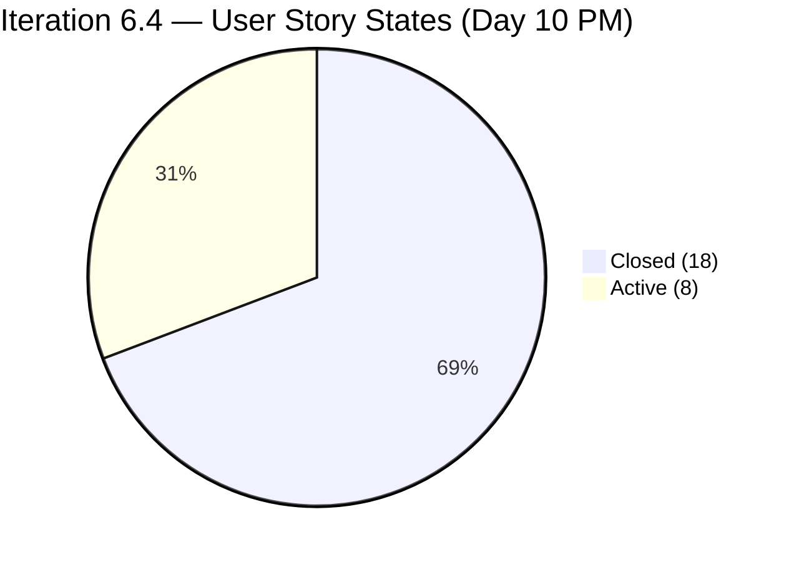
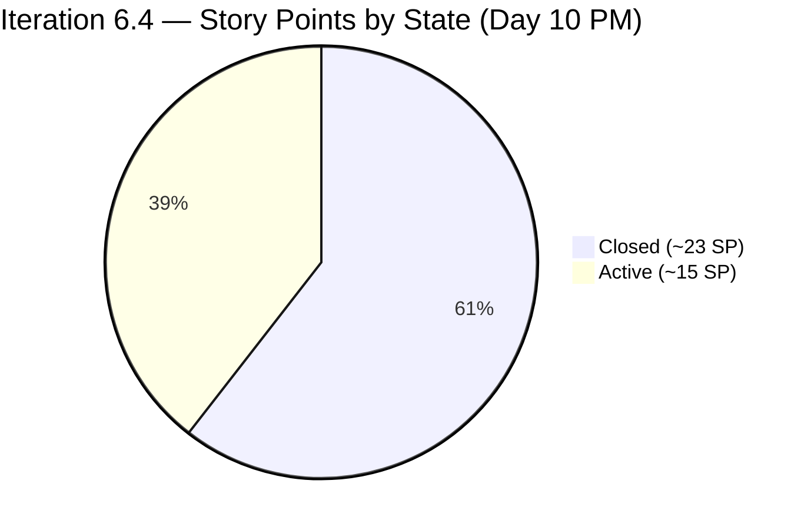
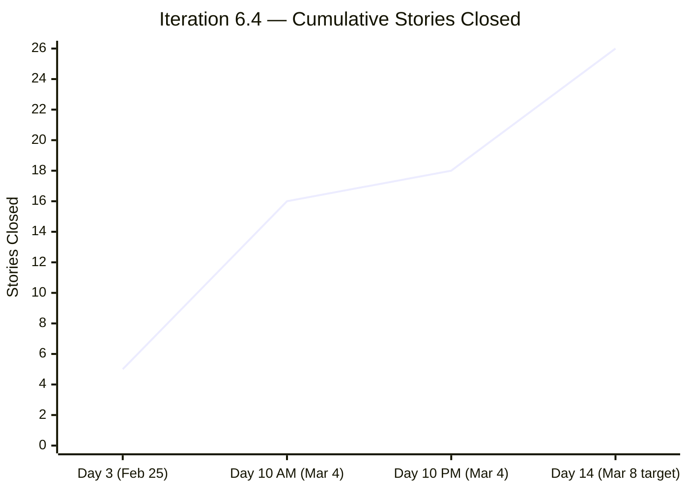
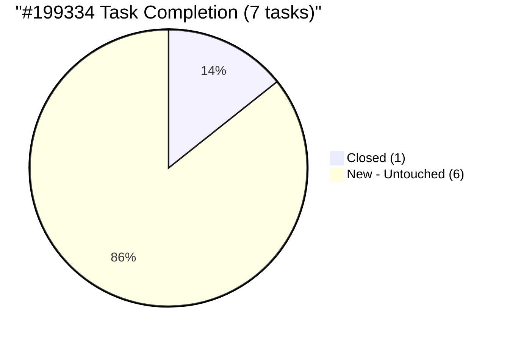
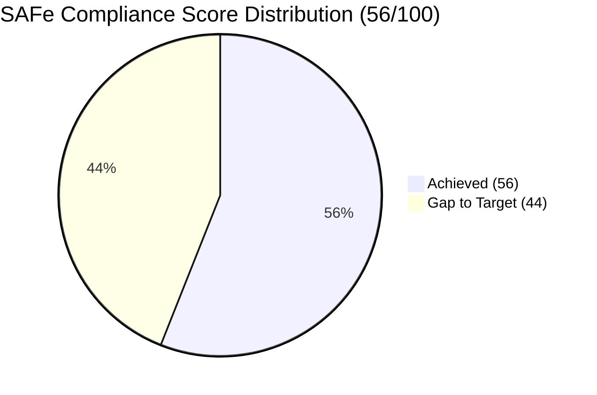
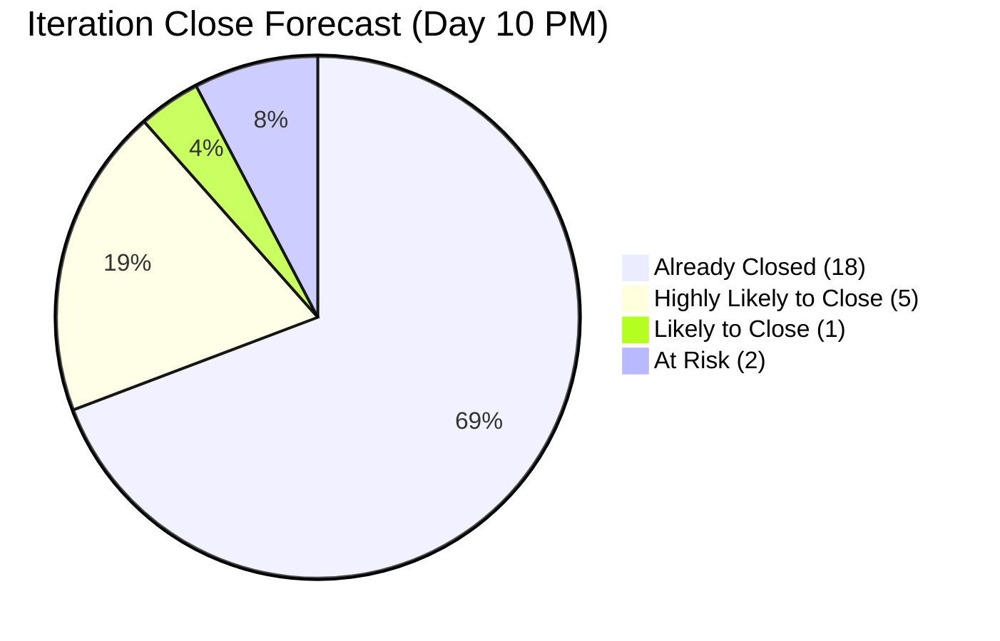

# SAFe Audit Report — Administration Team Board

## Jairosoft FINOPS Azure DevOps Project

**Audit Date:** March 4, 2026 — Evening Update
**Auditor:** AI Agile PM Consultant
**Framework:** Scaled Agile Framework (SAFe) 6.0
**Current PI:** PI 6 (2026)
**Current Iteration:** Iteration 6.4 (Feb 23 – Mar 8, 2026) — Day 10 of 14
**Board URL:** [Administration Team Board](https://dev.azure.com/jairo/Jairosoft%20FINOPS/_boards/board/t/Administration%20Team/Stories%20and%20Deliverables)
**Previous Audits:** February 25, 2026 | March 4, 2026 (AM)

---

## 1. Executive Summary

This is the **second audit of the day** for the Administration Team Board, providing an evening status snapshot for Iteration 6.4, Day 10. Since the morning audit, the team has **closed 2 more stories** and **moved all 5 previously "New" stories to Active**, fully addressing the highest-severity recommendation from the morning report (Finding C).

**Overall SAFe Compliance Score: 56/100 — Fair** *(↑ from 51/100 this morning, ↑ from 42/100 on Feb 25)*

| Category | Feb 25 | Mar 4 AM | Mar 4 PM | Change | Rating |
|---|---|---|---|---|---|
| PI & Iteration Structure | 8/10 | 8/10 | 8/10 | → | Good |
| Capacity Planning | 1/10 | 4/10 | 4/10 | → | Poor |
| Backlog Management | 4/10 | 5/10 | 6/10 | ↑ +1 | Fair |
| Work Item Quality | 3/10 | 6/10 | 7/10 | ↑ +1 | Good |
| Estimation & Velocity | 1/10 | 8/10 | 8/10 | → | Good |
| Team Structure & Collaboration | 4/10 | 5/10 | 5/10 | → | Fair |
| Continuous Improvement | 5/10 | 7/10 | 8/10 | ↑ +1 | Good |
| Hierarchy & Traceability | 6/10 | 8/10 | 8/10 | → | Good |

---

## 2. Previous Audit Findings — Resolution Tracker

The following table tracks each finding across all three audit cycles (Feb 25, Mar 4 AM, Mar 4 PM).

| # | Finding | Severity | Feb 25 | Mar 4 AM | Mar 4 PM | Resolution |
|---|---|---|---|---|---|---|
| F1 | No Capacity Planning | CRITICAL | 0 hrs | Mark: 8 hrs/day | Mark: 8 hrs/day | ⚠️ PARTIAL — Grace still at 0 hrs |
| F2 | No Story Point Estimation | CRITICAL | 0/21 estimated | 25/26 estimated | 25/26 estimated | ✅ RESOLVED (1 item: #199905 still missing) |
| F3 | Single Point of Failure | HIGH | 1 member | 2 members (Grace added) | 2 members (Grace at 0 capacity) | ⚠️ PARTIAL |
| F4 | No Acceptance Criteria | HIGH | 0/21 with AC | 26/26 with AC | 26/26 with AC | ✅ RESOLVED |
| F5a | Typo: #199322 "allowanec" | MEDIUM | Present | Corrected | Corrected | ✅ RESOLVED |
| F5b | Typo: #199324 "Prosessional" | MEDIUM | Present | Still present | **Corrected** | ✅ RESOLVED |
| F5c | Typo: #199331 "Goverment" | MEDIUM | Present | Still present | **Corrected** | ✅ RESOLVED |
| F5d | Typo: #199334 "paymentfor" | MEDIUM | Present | Still present | Still present | ❌ OPEN |
| F6 | Features lack WSJF values | HIGH | Not populated | Unverified | Unverified | ⚠️ UNVERIFIED |
| F7 | Missing PI 2, Incomplete PI 5 | MEDIUM | Structural gap | Unchanged | Unchanged | ⚠️ STRUCTURAL |
| F8 | 76% stories in "New" state | MEDIUM | 16/21 "New" | 5/26 "New" (19%) | **0/26 "New" (0%)** | ✅ RESOLVED |
| F9 | Only 2 tasks for 21 stories | MEDIUM | 2 tasks | ~36 tasks | 36 tasks | ✅ RESOLVED |
| FA | #199905 missing Story Points | LOW | — | Identified | Still missing | ❌ OPEN |
| FB | Grace not productive | MEDIUM | — | Identified | Unchanged (0 capacity) | ❌ OPEN |
| FC | 5 stories "New" on Day 10 | HIGH | — | 5 "New" stories | **0 "New" stories** | ✅ RESOLVED |
| FD | #199392 title/description mismatch | LOW | — | Identified | Unverified | ⚠️ UNVERIFIED |
| FE | 3 typos from prior audit | MEDIUM | — | 3 remaining | **1 remaining** | ⚠️ PARTIAL (2 of 3 fixed) |

### 2.1 Key Changes Since This Morning

The team demonstrated **same-day responsiveness** to audit findings — a remarkable level of engagement:

- **All 5 "New" stories have been moved to Active** — zero stories now remain in "New" state on Day 10. This was the morning audit's highest-severity recommendation.
- **2 additional stories closed** — #199605 (Grass cutting Day 1, 3 SP) and #200080 (Phyton Asia 2026, 1 SP).
- **2 of 3 remaining typos corrected** — #199324 ("Prosessional" → "Professional") and #199331 ("Goverment" → "Government"). Only #199334 ("paymentfor") remains.

---

## 3. Current Iteration Analysis — Iteration 6.4 (Day 10 of 14, PM)

### 3.1 Work Item Summary

| Type | Count | Closed | Active | New |
|---|---|---|---|---|
| User Story | 26 | 18 | 8 | 0 |
| Task | 36 | 23 | 7 | 6 |
| **Total** | **62** | **41 (66%)** | **15 (24%)** | **6 (10%)** |

### 3.2 Story State Comparison — Morning vs Evening

| Metric | Mar 4 AM | Mar 4 PM | Change |
|---|---|---|---|
| Closed Stories | 16 (62%) | 18 (69%) | +2 |
| Active Stories | 5 (19%) | 8 (31%) | +3 |
| New Stories | 5 (19%) | 0 (0%) | -5 |
| Closed Story Points | ~19 SP | ~23 SP | +4 SP |
| Active Story Points | ~9 SP | ~15 SP | +6 SP |
| New Story Points | ~10 SP | 0 SP | -10 SP |

### 3.3 Story Points Distribution

At Day 10 PM, the team has closed approximately **23 of ~38 committed story points (61%)** and **69% of stories**. With 4 days remaining, the 8 Active stories with ~15 SP need to be completed to achieve full iteration closure.

### 3.4 Detailed Work Item Status

**Closed Stories (18):**

| ID | Title | SP | Category |
|---|---|---|---|
| 198526 | Notarize of documents at Davao City Hall | 1 | Admin Support |
| 199312 | Inquire and payment for CADAC training at UIC | 1 | Training |
| 199320 | Condo Cebu payments | 2 | Payables |
| 199322 | Jairosoft food allowance payment | 1 | Payables |
| 199328 | Water Davao and Cebu payment | 2 | Payables |
| 199331 | Government and EGOV payables | 2 | Payables |
| 199395 | Submit documents at BIR | 1 | Admin Support |
| 199427 | Deposit payment for JIT computer set at Union Bank | 1 | Admin Support |
| 199593 | Inquire BFP for certificate renewal | 1 | Admin Support |
| 199603 | Budget request Gas for grass cutter | 1 | Admin Support |
| 199604 | Purchase gasoline and nylon for grass cutting | 1 | Admin Support |
| 199605 | Grass cutting at the back of the building (Day 1) | 3 | Admin Support |
| 199614 | Notary of alpha list (Jairosoft) for BIR | 1 | Admin Support |
| 199763 | Notary of sworn declaration for BIR | 2 | Admin Support |
| 199905 | Toyota Fortuner (Cebu) | ❌ None | Payables |
| 199923 | BIR alpha list submission | 1 | Admin Support |
| 199942 | Plane ticket for Jove Moralde to Japan | 1 | Events/Travel |
| 200080 | Phyton Asia 2026 | 1 | Events/Travel |

**Active Stories (8):**

| ID | Title | SP | Tasks | Task Progress | Risk |
|---|---|---|---|---|---|
| 197121 | Purchase materials for ceiling rust repair | 1 | 1 | 0/1 closed | Low |
| 197122 | Repairing the ceiling rust 3rd floor | 3 | 1 | 0/1 closed | **High** — implementation work |
| 199324 | Professional fee payment | 3 | 3 | 2/3 closed | Medium — 1 payment pending |
| 199334 | Internet paymentfor Cebu and Davao ⚠️ | 4 | 7 | 1/7 closed | **High** — 6 tasks untouched |
| 199336 | St. Peter payment for Edmund Mina | 1 | 1 | 0/1 closed | Low |
| 199345 | VECO Cebu office payment | 1 | 1 | 0/1 closed | Low |
| 199392 | SO Certificate (TESDA) | 1 | 1 | 0/1 closed | Low |
| 200083 | Dr.Dental SOA Feb. 2026 | 1 | 1 | 0/1 closed | Low |

> ⚠️ = Work item title contains a typo from previous audit findings.

### 3.5 Task-Level Analysis for High-Risk Stories

**#199334 — Internet paymentfor Cebu and Davao office (4 SP, 7 tasks):**

| Task ID | Title | State |
|---|---|---|
| 199749 | Globe Telecom - Marikriss payment | ✅ Closed |
| 199750 | Innove Communications Inc. - Cebu PAD payment | 🔴 New |
| 199751 | Innove Communications Inc. - Globe Meridian | 🔴 New |
| 199752 | Innove Communications Inc. - Cebu Office payment | 🔴 New |
| 199754 | Innove Communications Inc. - Azalea payment | 🔴 New |
| 199755 | Innove Communications Inc. - Davao Office payment | 🔴 New |
| 199756 | Globe Telecom - Marilyn payment | 🔴 New |

Only 1 of 7 internet provider payments has been completed. This is the **single highest-risk story** for iteration completion due to the volume of individual payment transactions required.

**#199324 — Professional fee payment (3 SP, 3 tasks):**

| Task ID | Title | State |
|---|---|---|
| 199742 | Book keeper Fee payment at BPI | ✅ Closed |
| 199743 | Dr. Karl Nazanzien Chavez fee payment at PNB | 🟡 Active |
| 199744 | Atty. Arsenio E. Caballero Jr. fee payment at BDO | ✅ Closed |

Good progress — 2 of 3 tasks completed. One active payment remaining.

### 3.6 Completion Trajectory

```mermaid
xychart-beta
    title "Iteration 6.4 — Stories by State Over Time"
    x-axis ["Feb 25", "Mar 4 AM", "Mar 4 PM"]
    y-axis "Count" 0 --> 26
    bar [5, 16, 18]
    bar [0, 5, 8]
    bar [16, 5, 0]
```

---

## 4. Capacity Analysis

### 4.1 Team Capacity Configuration (Unchanged)

| Member | Capacity/Day | Activity | Days Off |
|---|---|---|---|
| Mark Colina | 8 hrs | Documentation | None |
| Grace | 0 hrs | (not set) | None |

No changes since this morning. Grace remains at zero capacity with no work items assigned.

### 4.2 Commitment vs. Capacity (Updated)

| Metric | Value |
|---|---|
| Remaining iteration days | 4 (Mar 5–8) |
| Mark Colina remaining capacity | 8 hrs/day × 4 days = 32 hrs |
| Active stories requiring closure | 8 |
| Active story points | ~15 SP |
| Active tasks requiring closure | 13 (7 active + 6 new) |

With 32 hours remaining and 13 tasks to complete across 8 stories, Mark has approximately **2.5 hours per task**. The internet payments story (#199334) alone has 6 untouched tasks, making it the primary bottleneck.

---

## 5. New Findings (This Audit)

### FINDING F: #199334 Internet Payments — Critical Bottleneck (Severity: HIGH)

Story #199334 has moved from "New" to "Active" (resolving Finding C from this morning), but **6 of its 7 sub-tasks remain in "New" state**. Only the Globe Telecom - Marikriss payment has been completed. With 6 individual provider payments still pending and only 4 days remaining, this 4 SP story represents the **single largest risk to iteration completion**.

**Recommendation:** Prioritize #199334 immediately. If all 6 remaining payments cannot be completed by March 8, consider splitting the story or carrying incomplete tasks into Iteration 6.5 with proper documentation.

### FINDING G: Typos Mostly Resolved — 1 Remaining (Severity: LOW)

Of the 4 original typo findings from February 25:

- ✅ #199322 "allowanec" → Corrected (resolved by Mar 4 AM)
- ✅ #199324 "Prosessional" → Corrected to "Professional" (resolved today)
- ✅ #199331 "Goverment" → Corrected to "Government" (resolved today)
- ❌ #199334 "paymentfor" → Still reads "Internet paymentfor Cebu and Davao office"

**Recommendation:** Fix the remaining space in #199334's title: "Internet payment for Cebu and Davao office."

### FINDING H: #199905 Still Missing Story Points (Severity: LOW — Recurring)

This was first flagged this morning (Finding A). Story #199905 "Toyota Fortuner (Cebu)" remains Closed with no Story Points assigned. This creates a gap in velocity calculations.

**Recommendation:** Add story points retroactively to maintain velocity accuracy.

---

## 6. SAFe Compliance Assessment

### 6.1 Score Breakdown with Rationale

```mermaid
xychart-beta
    title "SAFe Compliance — Three-Audit Comparison"
    x-axis ["PI Structure", "Capacity", "Backlog", "WI Quality", "Estimation", "Team", "Improvement", "Traceability"]
    y-axis "Score (out of 10)" 0 --> 10
    bar [8, 1, 4, 3, 1, 4, 5, 6]
    bar [8, 4, 5, 6, 8, 5, 7, 8]
    bar [8, 4, 6, 7, 8, 5, 8, 8]
```

**Score Changes (AM → PM):**

- **Backlog Management (5 → 6):** Zero stories in "New" state on Day 10 demonstrates excellent flow management. All items are either being worked or completed.
- **Work Item Quality (6 → 7):** 2 of 3 remaining typos corrected today. Title quality has improved significantly since the Feb 25 baseline.
- **Continuous Improvement (7 → 8):** The team's same-day response to audit findings is exceptional. Correcting typos, moving stories to Active, and closing additional items within hours of the morning audit demonstrates a culture of responsiveness.

### 6.2 Compliance Maturity Radar

---

## 7. Iteration Close Forecast (Updated)

### 7.1 Scenario Analysis

| Story | SP | Tasks Remaining | Completion Likelihood |
|---|---|---|---|
| 199324 Professional fee | 3 | 1 active | 🟢 Highly Likely |
| 199336 St. Peter payment | 1 | 1 active | 🟢 Highly Likely |
| 199345 VECO Cebu | 1 | 1 active | 🟢 Highly Likely |
| 199392 SO Certificate (TESDA) | 1 | 1 active | 🟢 Highly Likely |
| 200083 Dr.Dental SOA | 1 | 1 active | 🟢 Highly Likely |
| 197121 Ceiling rust purchase | 1 | 1 active | 🟡 Likely |
| 197122 Ceiling rust repair | 3 | 1 active | 🟡 At Risk (implementation) |
| 199334 Internet payments | 4 | 6 new tasks | 🔴 High Risk |

### 7.2 Projected Outcomes

| Scenario | Stories Closed | SP Closed | Velocity |
|---|---|---|---|
| **Best case** (all 8 Active closed) | 26/26 (100%) | ~38 SP | 38 SP |
| **Likely case** (6 of 8 Active closed) | 24/26 (92%) | ~31 SP | 31 SP |
| **Conservative** (5 of 8 Active closed) | 23/26 (88%) | ~27 SP | 27 SP |

The most likely outcome is **24 of 26 stories closed (92%)**, with #199334 (internet payments) and #197122 (ceiling repair implementation) as the two items at highest risk of carrying over into Iteration 6.5.

---

## 8. Recommendations

### Immediate (Before Iteration 6.4 Closes — by March 8)

1. **Prioritize #199334 (Internet payments)** — Start the 6 remaining payment tasks immediately. This is the single largest risk item. If some payments cannot be completed, document and carry to 6.5.
2. **Close #199324 (Professional fee)** — Only 1 task remaining (Dr. Chavez fee payment). This should be completable quickly.
3. **Fix the last typo: #199334** — Change "paymentfor" to "payment for" in the title.
4. **Add story points to #199905** retroactively.
5. **Begin #197122 (ceiling rust repair)** — This is implementation work (3 SP) that needs physical execution time.

### Short-Term (Iteration 6.5 Planning)

1. **Configure Grace's capacity** and assign her initial work items.
2. **Expand activity types** beyond "Documentation" to better reflect actual work categories.
3. **Implement Definition of Ready** requiring estimation, acceptance criteria, and parent feature before iteration commitment.
4. **Review #199334 completion** — if tasks carry over, properly size and plan the remaining payments.

### Medium-Term (PI 7 Preparation)

1. **Implement WSJF** at Feature level with Business Value, Time Criticality, Risk Reduction, and Job Size.
2. **Track velocity baseline** — Iteration 6.4 will produce the team's first measurable velocity data point.
3. **Address stalled safety Features** — fire exit canopy (#158382), jockey pump (#176942).

---

## 9. Risk Register (Updated)

| Risk | Likelihood | Impact | Trend | Mitigation |
|---|---|---|---|---|
| #199334 not completed (6 tasks, 4 SP) | **High** | Medium | **NEW** | Prioritize immediately; plan carry-over if needed |
| #197122 ceiling repair not completed (3 SP) | Medium | Low | **NEW** | Start implementation; this may require physical scheduling |
| Grace not onboarded productively | High | Medium | → Unchanged | Configure capacity, assign stories in 6.5 |
| Feature backlog overwhelm (26 features, 1 active contributor) | Medium | High | → Unchanged | WSJF prioritization, backlog grooming |
| Safety features stalled (fire exit, pump) | Medium | High | → Unchanged | Escalate to program level |
| WSJF not implemented at Feature level | High | Medium | → Unchanged | Implement during next PI Planning |
| #199905 velocity data gap | Low | Low | → Unchanged | Add SP retroactively |
| Blocked signage permit #170869 | Certain | Low | → Unchanged | Escalate or archive |

---

## 10. Conclusion

The Administration Team continues to demonstrate **exceptional responsiveness** to audit findings. Within a single day, they moved all 5 "New" stories to Active state, closed 2 additional stories, and corrected 2 of the 3 remaining title typos. The overall SAFe compliance score has risen from 42/100 (Feb 25) to 56/100 (Mar 4 PM), a **33% improvement in 7 days**.

The primary concern heading into the final 4 days of Iteration 6.4 is **story #199334 (Internet payments)**, which has 6 of 7 tasks still untouched. This 4 SP story alone accounts for the majority of the iteration completion risk. If the team can execute on this item and close the remaining straightforward Active stories, they are on track for a **92%+ story completion rate** — an excellent outcome for their first fully-estimated iteration.

The team's velocity baseline from Iteration 6.4 will provide the foundation for data-driven planning in Iteration 6.5 and beyond.

**Next audit recommended: March 6, 2026 (Day 12) or March 8, 2026 (Iteration Close)**

---

*Report generated on March 4, 2026, 9:57 PM | SAFe 6.0 Framework Standards*
*Auditor: AI Agile PM Consultant*
