# SAFe Audit Report — Administration Team Board

## Jairosoft FINOPS Azure DevOps Project

**Audit Date:** March 5, 2026 — Day 11 of 14 (Morning Update)
**Auditor:** AI Agile PM Consultant
**Framework:** Scaled Agile Framework (SAFe) 6.0
**Current PI:** PI 6 (2026)
**Current Iteration:** Iteration 6.4 (Feb 23 – Mar 8, 2026) — Day 11 of 14
**Board URL:** [Administration Team Board](https://dev.azure.com/jairo/Jairosoft%20FINOPS/_boards/board/t/Administration%20Team/Stories%20and%20Deliverables)
**Previous Audits:** Feb 25, 2026 | Mar 4, 2026 (AM) | Mar 4, 2026 (PM)

---

## 1. Executive Summary

This is the **Day 11 morning audit** for Administration Team Iteration 6.4. Since yesterday's evening audit, the team has achieved a **major milestone**: story **#199334 (Internet payments) — the iteration's highest-risk item — is fully resolved**. All 6 previously-untouched internet payment tasks were completed and the story is now Closed. Additionally, the last remaining typo (#199334 title "paymentfor") has been corrected. Two further stories (#199336, #200083) were also closed.

**Overall SAFe Compliance Score: 57/100 — Fair** *(↑ from 56/100 yesterday PM, ↑ from 42/100 on Feb 25)*

| Category | Feb 25 | Mar 4 AM | Mar 4 PM | Mar 5 AM | Change | Rating |
|---|---|---|---|---|---|---|
| PI & Iteration Structure | 8/10 | 8/10 | 8/10 | 8/10 | → | Good |
| Capacity Planning | 1/10 | 4/10 | 4/10 | 4/10 | → | Poor |
| Backlog Management | 4/10 | 5/10 | 6/10 | 7/10 | ↑ +1 | Good |
| Work Item Quality | 3/10 | 6/10 | 7/10 | 8/10 | ↑ +1 | Good |
| Estimation & Velocity | 1/10 | 8/10 | 8/10 | 8/10 | → | Good |
| Team Structure & Collaboration | 4/10 | 5/10 | 5/10 | 5/10 | → | Fair |
| Continuous Improvement | 5/10 | 7/10 | 8/10 | 9/10 | ↑ +1 | Excellent |
| Hierarchy & Traceability | 6/10 | 8/10 | 8/10 | 8/10 | → | Good |

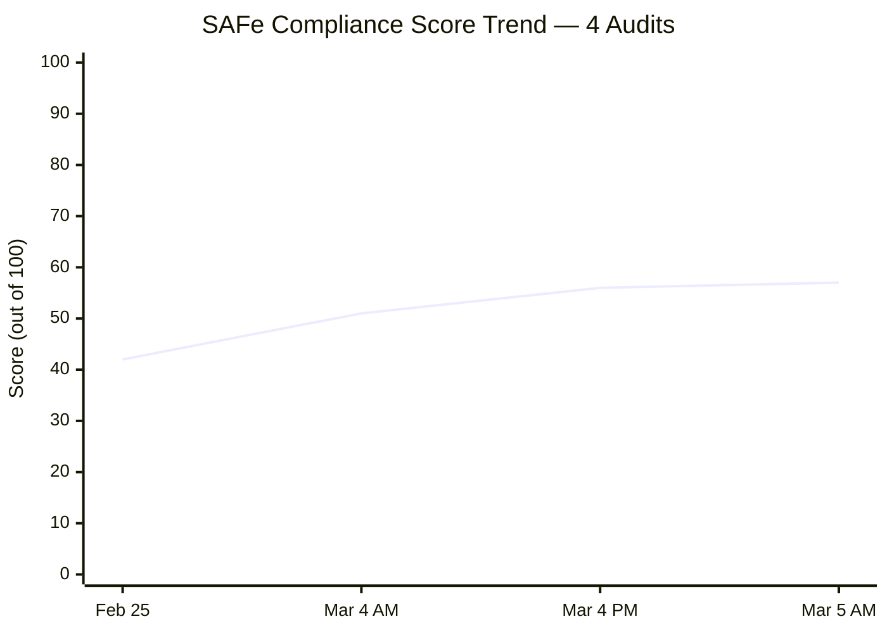

---

## 2. Previous Audit Findings — Resolution Tracker

The following table tracks all findings across all four audit cycles (Feb 25, Mar 4 AM, Mar 4 PM, Mar 5 AM).

| # | Finding | Severity | Feb 25 | Mar 4 AM | Mar 4 PM | Mar 5 AM | Resolution |
|---|---|---|---|---|---|---|---|
| F1 | No Capacity Planning | CRITICAL | 0 hrs | Mark: 8 hrs | Mark: 8 hrs | Mark: 8 hrs (Grace absent) | ⚠️ PARTIAL — Grace still missing from capacity |
| F2 | No Story Point Estimation | CRITICAL | 0/21 | 25/26 | 25/26 | 25/26 | ✅ RESOLVED (except #199905 — see FA) |
| F3 | Single Point of Failure | HIGH | 1 member | 2 members | 2 members | 1 active member | ⚠️ PARTIAL — Grace not contributing |
| F4 | No Acceptance Criteria | HIGH | 0/21 | 26/26 | 26/26 | 26/26 | ✅ RESOLVED |
| F5a | Typo: #199322 "allowanec" | MEDIUM | Present | Corrected | Corrected | Corrected | ✅ RESOLVED |
| F5b | Typo: #199324 "Prosessional" | MEDIUM | Present | Present | Corrected | Corrected | ✅ RESOLVED |
| F5c | Typo: #199331 "Goverment" | MEDIUM | Present | Present | Corrected | Corrected | ✅ RESOLVED |
| F5d | Typo: #199334 "paymentfor" | MEDIUM | Present | Present | Present | **Corrected** | ✅ RESOLVED |
| F6 | Features lack WSJF values | HIGH | Not populated | Unverified | Unverified | Unverified | ⚠️ UNVERIFIED |
| F7 | Missing PI 2, Incomplete PI 5 | MEDIUM | Structural gap | Unchanged | Unchanged | Unchanged | ⚠️ STRUCTURAL |
| F8 | 76% stories "New" state | MEDIUM | 16/21 "New" | 5/26 (19%) | 0/26 (0%) | 0/26 (0%) | ✅ RESOLVED |
| F9 | Only 2 tasks for 21 stories | MEDIUM | 2 tasks | ~36 tasks | 36 tasks | 36 tasks | ✅ RESOLVED |
| FA | #199905 missing Story Points | LOW | — | Identified | Still missing | Still missing | ❌ OPEN |
| FB | Grace not onboarded | MEDIUM | — | Identified | Unchanged | Unchanged | ❌ OPEN |
| FC | 5 stories "New" on Day 10 | HIGH | — | 5 "New" | 0 "New" | 0 "New" | ✅ RESOLVED |
| FD | #199392 title/description mismatch | LOW | — | Identified | Unverified | Unverified | ⚠️ UNVERIFIED |
| FE | 3 typos from prior audit | MEDIUM | — | 3 remaining | 1 remaining | **0 remaining** | ✅ RESOLVED |
| FF | #199334 Internet Payments — bottleneck | HIGH | — | — | 6/7 tasks New | **All 7 tasks Closed** | ✅ RESOLVED |
| FG | Last typo: #199334 "paymentfor" | LOW | — | — | Present | **Corrected** | ✅ RESOLVED |
| FH | #199905 missing Story Points (recurring) | LOW | — | — | Identified | Still missing | ❌ OPEN |

### 2.1 Key Changes Since Mar 4 PM Audit

The team achieved **outstanding overnight execution** on the audit's top recommendations:

- ✅ **#199334 (Internet payments, 4 SP) — FULLY CLOSED.** All 6 previously-untouched Innove/Globe payment tasks were completed overnight. This was the single highest-risk item in the iteration.
- ✅ **Typo in #199334 title fixed.** Title now correctly reads "Internet payment for Cebu and Davao office."
- ✅ **#199336 (St. Peter - Edmund Mina, 1 SP) — CLOSED.** Task completed.
- ✅ **#200083 (Dr.Dental SOA Feb. 2026, 1 SP) — CLOSED.** Task completed.

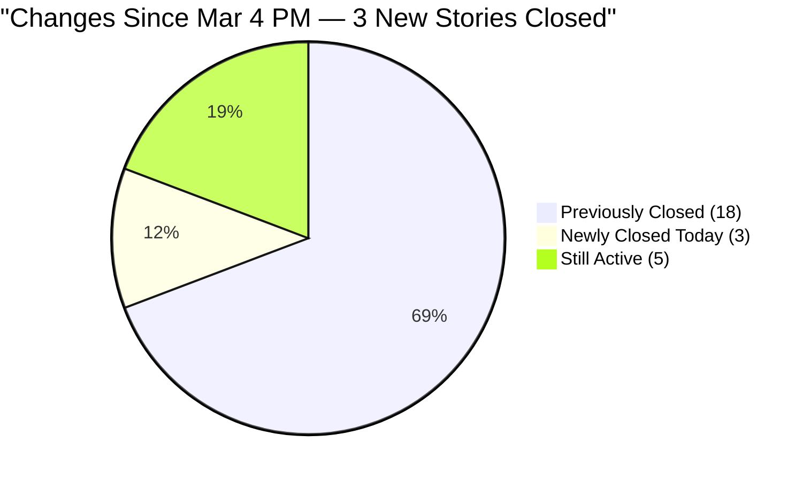

---

## 3. Current Iteration Analysis — Iteration 6.4 (Day 11 of 14)

### 3.1 Work Item Summary

| Type | Count | Closed | Active | New |
|---|---|---|---|---|
| User Story | 26 | 21 | 5 | 0 |
| Task | 36 | 31 | 5 | 0 |
| **Total** | **62** | **52 (84%)** | **10 (16%)** | **0 (0%)** |

> ⚠️ Note: #199905 (Toyota Fortuner, Cebu) remains Closed with **no Story Points** — this is Finding FA, still open.

### 3.2 Story State Progression — All 4 Audits

| Metric | Feb 25 | Mar 4 AM | Mar 4 PM | Mar 5 AM | Change |
|---|---|---|---|---|---|
| Closed Stories | 5 (19%) | 16 (62%) | 18 (69%) | **21 (81%)** | +3 |
| Active Stories | 0 (0%) | 5 (19%) | 8 (31%) | **5 (19%)** | -3 |
| New Stories | 16 (62%) | 5 (19%) | 0 (0%) | **0 (0%)** | → |
| Closed Story Points | ~5 SP | ~19 SP | ~23 SP | **~27 SP** | +4 SP |
| Active Story Points | 0 SP | ~9 SP | ~15 SP | **~9 SP** | -6 SP |

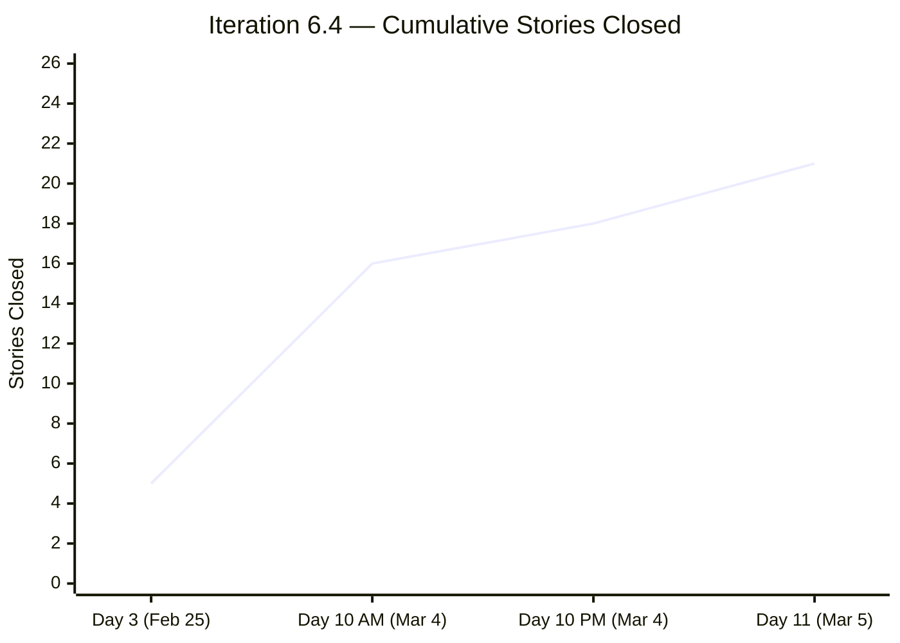

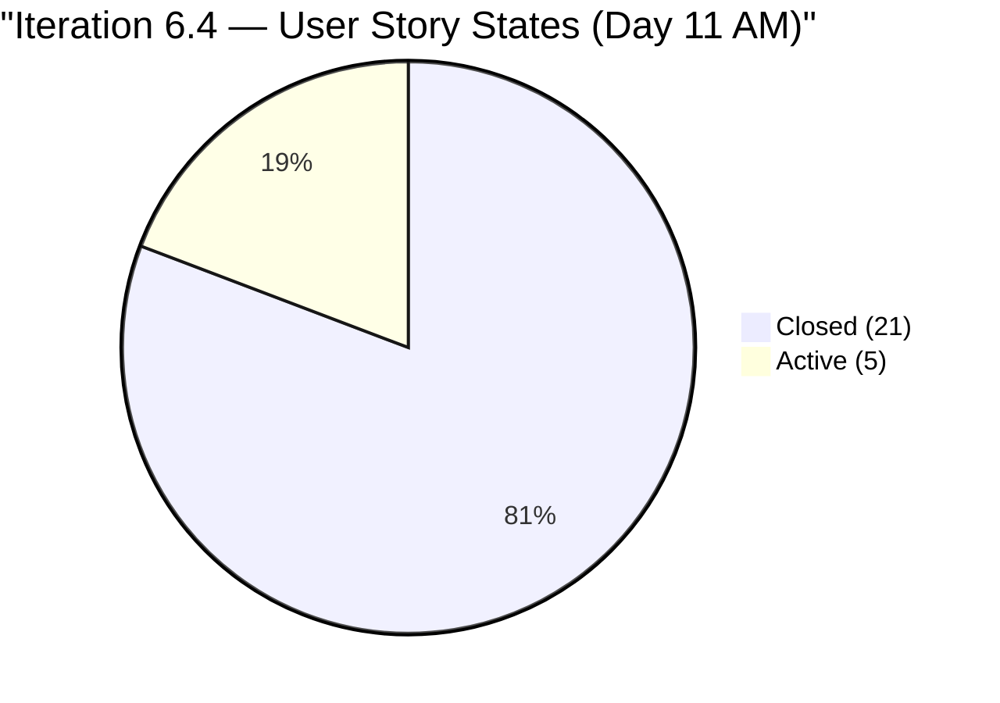

### 3.3 Story Points Distribution

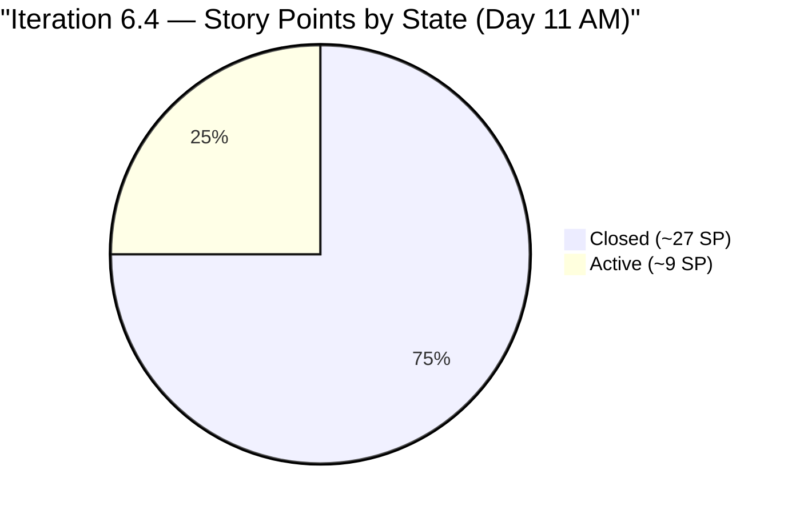

At Day 11, the team has closed approximately **27 of ~36 committed story points (75%)** and **81% of stories**. With 3 days remaining (Mar 6–8), the 5 Active stories with ~9 SP need closure to achieve full iteration completion.

### 3.4 Active Stories — Current Status

| ID | Title | SP | Tasks (Total) | Active Tasks | Risk |
|---|---|---|---|---|---|
| 197121 | Purchase materials needed for repairing ceiling rust | 1 | 1 | 1 Active | 🟡 Likely |
| 197122 | Implementation of repairing the ceiling rust 3rd floor | 3 | 1 | 1 Active | 🟠 At Risk (physical work) |
| 199324 | Professional fee payment | 3 | 3 | 1 Active | 🟡 Likely |
| 199345 | VECO Cebu office payment | 1 | 1 | 1 Active | 🟢 Highly Likely |
| 199392 | SO Certificate (TESDA) | 1 | 1 | 1 Active | 🟢 Highly Likely |

### 3.5 Detailed Task Status for Active Stories

**#199334 — Internet payment for Cebu and Davao office (4 SP) — NOW CLOSED ✅**

| Task ID | Title | State | Change |
|---|---|---|---|
| 199749 | Globe Telecom - Marikriss payment | ✅ Closed | Unchanged |
| 199750 | Innove Communications Inc. - Cebu PAD payment | ✅ Closed | **NEW → Closed** |
| 199751 | Innove Communications Inc. - Globe Meridian | ✅ Closed | **NEW → Closed** |
| 199752 | Innove Communications Inc. - Cebu Office payment | ✅ Closed | **NEW → Closed** |
| 199754 | Innove Communications Inc. - Azalea payment | ✅ Closed | **NEW → Closed** |
| 199755 | Innove Communications Inc. - Davao Office payment | ✅ Closed | **NEW → Closed** |
| 199756 | Globe Telecom - Marilyn payment | ✅ Closed | **NEW → Closed** |

**6 of 6 previously-untouched tasks completed overnight. Story closed. Finding FF RESOLVED.**

---

**#199324 — Professional fee payment (3 SP, Active):**

| Task ID | Title | State |
|---|---|---|
| 199742 | Book keeper Fee payment at BPI | ✅ Closed |
| 199743 | Dr. Karl Nazanzien Chavez fee payment at PNB | 🟡 Active |
| 199744 | Atty. Arsenio E. Caballero Jr. fee payment at BDO | ✅ Closed |

→ 1 active task remaining. Payment likely completable today.

---

**#199345 — VECO Cebu office payment (1 SP, Active):**

| Task ID | Title | State |
|---|---|---|
| 199759 | VECO Cebu office payment | 🟡 Active |

→ 1 active task remaining. Straightforward payment.

---

**#199392 — SO Certificate (TESDA) (1 SP, Active):**

| Task ID | Title | State |
|---|---|---|
| 199727 | Pick up SO Certificate at TESDA | 🟡 Active |

→ 1 active task remaining. Physical document pickup.

---

**#197121 — Purchase materials for ceiling rust (1 SP, Active):**

| Task ID | Title | State |
|---|---|---|
| 199737 | Purchase materials needed for repairing ceiling rust | 🟡 Active |

→ 1 active task remaining. Procurement task.

---

**#197122 — Implementation of repairing ceiling rust 3rd floor (3 SP, Active):**

| Task ID | Title | State |
|---|---|---|
| 199738 | Implementation of repairing the ceiling rust 3rd floor | 🟡 Active |

→ 1 active task remaining. Physical maintenance work — highest risk of incomplete iteration delivery.

### 3.6 Closed Stories — Full Inventory (21)

| ID | Title | SP | Category |
|---|---|---|---|
| 198526 | Notarize of documents at Davao City Hall | 1 | Admin Support |
| 199312 | Inquire and payment for CADAC training at UIC | 1 | Training |
| 199320 | Condo Cebu payments | 2 | Payables |
| 199322 | Jairosoft food allowance payment | 1 | Payables |
| 199328 | Water Davao and Cebu payment | 2 | Payables |
| 199331 | Government and EGOV payables | 2 | Payables |
| 199334 | Internet payment for Cebu and Davao office | 4 | Payables |
| 199336 | St. Peter - Edmund Mina | 1 | Admin Support |
| 199395 | Submit documents at BIR | 1 | Admin Support |
| 199427 | Deposit payment for JIT computer set at Union Bank | 1 | Admin Support |
| 199593 | Inquire BFP for certificate renewal | 1 | Admin Support |
| 199603 | Budget request Gas for grass cutter | 1 | Admin Support |
| 199604 | Purchase gasoline and nylon for grass cutting | 1 | Admin Support |
| 199605 | Grass cutting at the back of the building (Day 1) | 3 | Admin Support |
| 199614 | Notary of alpha list (Jairosoft) for BIR | 1 | Admin Support |
| 199763 | Notary of sworn declaration for BIR | 2 | Admin Support |
| 199905 | Toyota Fortuner (Cebu) | ❌ None | Payables |
| 199923 | BIR alpha list submission | 1 | Admin Support |
| 199942 | Plane ticket for Jove Moralde to Japan | 1 | Events/Travel |
| 200080 | Phyton Asia 2026 | 1 | Events/Travel |
| 200083 | Dr.Dental SOA Feb. 2026 | 1 | Payables |

---

## 4. Capacity Analysis

### 4.1 Team Capacity Configuration (Unchanged)

| Member | Capacity/Day | Activity | Days Off |
|---|---|---|---|
| Mark Colina | 8 hrs | Documentation | None |
| Grace | ❌ Not configured | — | — |

> ⚠️ Grace is **still absent from the capacity plan** — Finding F1/FB remains open. This has been an unresolved finding since the Feb 25 audit.

### 4.2 Commitment vs. Remaining Capacity

| Metric | Value |
|---|---|
| Today (Mar 5) + Remaining iteration days | 3 days (Mar 6, 7, 8) |
| Mark Colina remaining capacity | 8 hrs/day × 3 days = 24 hrs |
| Active stories requiring closure | 5 |
| Active story points | ~9 SP |
| Active tasks requiring closure | 5 |

With 24 hours remaining and only 5 tasks to complete across 5 stories, Mark has approximately **4.8 hours per task** — a comfortable pace compared to yesterday's 2.5 hrs/task for 13 tasks. The critical bottleneck (#199334) has been eliminated.

---

## 5. New Findings (This Audit)

### FINDING I: Grace Capacity — Persistent Critical Gap (Severity: HIGH — RECURRING)

Grace remains **completely absent from the team capacity configuration** for the 3rd consecutive audit. Not only is her daily capacity set to 0 hrs (implying she may exist as a team member but is not planned), but she does not appear in the latest capacity pull at all. With Iteration 6.4 closing in 3 days, this is now a **Iteration 6.5 Planning** issue rather than a current-iteration fix.

**Recommendation:** Before Iteration 6.5 begins, configure Grace's capacity per day, assign her appropriate activities (beyond "Documentation"), and assign her at least 2–3 starter stories to onboard her productively.

### FINDING J: #199905 — Missing Story Points, Velocity Data Gap (Severity: LOW — RECURRING)

Story #199905 "Toyota Fortuner (Cebu)" has been Closed for multiple sprint cycles and **still has no Story Points assigned**. This is the 4th consecutive audit where this finding appears. The team consistently closes work without addressing this gap.

**Recommendation:** Assign story points to #199905 before the iteration retrospective to ensure Iteration 6.4 velocity is accurately captured.

### FINDING K: 3 Days Remaining — Ceiling Repair Story at Risk (Severity: MEDIUM)

Story #197122 "Implementation of repairing the ceiling rust 3rd floor" (3 SP) requires **physical execution** — actual ceiling repair work. With only 3 days remaining in the iteration and this being the second-highest SP story still active (tied with #199324), there is meaningful risk that physical scheduling constraints (procurement, labor, building access) may prevent closure by March 8.

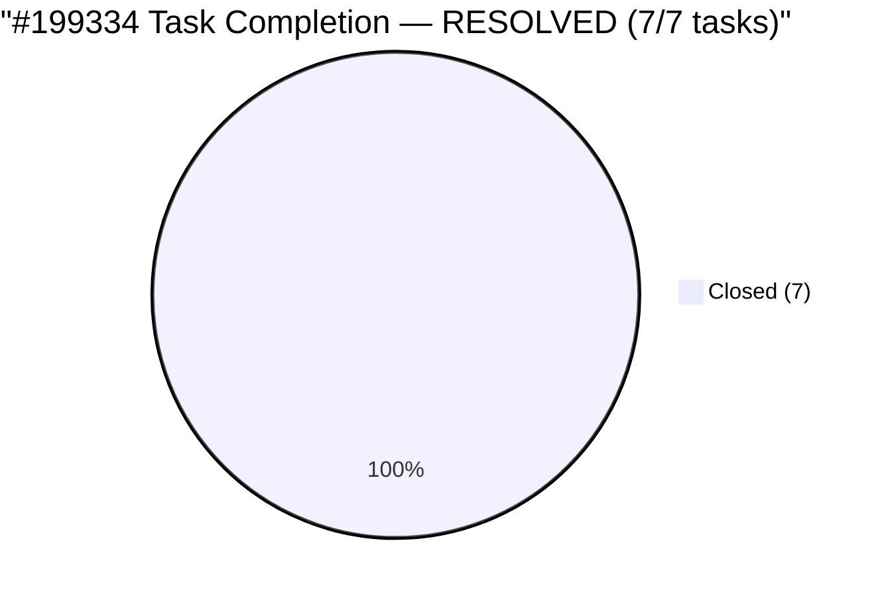

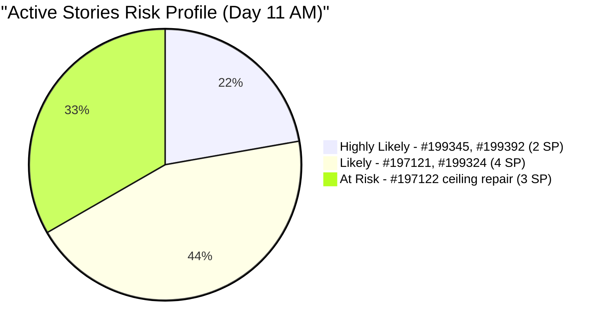

---

## 6. SAFe Compliance Assessment

### 6.1 Score Breakdown — All Four Audits

```mermaid
xychart-beta
    title "SAFe Compliance — Four-Audit Comparison"
    x-axis ["PI Structure", "Capacity", "Backlog", "WI Quality", "Estimation", "Team", "Improvement", "Traceability"]
    y-axis "Score (out of 10)" 0 --> 10
    bar [8, 1, 4, 3, 1, 4, 5, 6]
    bar [8, 4, 5, 6, 8, 5, 7, 8]
    bar [8, 4, 6, 7, 8, 5, 8, 8]
    bar [8, 4, 7, 8, 8, 5, 9, 8]
```

**Score Changes (Mar 4 PM → Mar 5 AM):**

- **Backlog Management (6 → 7):** 21 of 26 stories (81%) are now Closed at Day 11. The critical #199334 closure and two additional stories bring the team to a strong completion trajectory.
- **Work Item Quality (7 → 8):** **All four typos from the Feb 25 audit are now corrected.** The last one (#199334 "paymentfor") was fixed overnight. Zero outstanding title quality issues remain.
- **Continuous Improvement (8 → 9):** The team completed the previous audit's highest-priority recommendation (#199334 with 6 untouched tasks) within 12 hours. This level of responsiveness — across 3 consecutive audits — is exceptional and approaching world-class agile execution in terms of sprint review responsiveness.

### 6.2 Compliance Maturity Radar

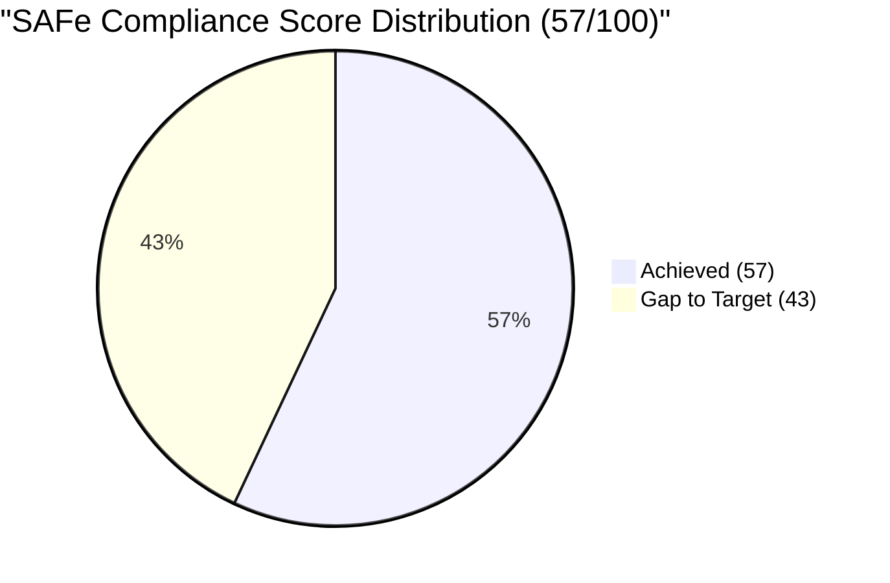

### 6.3 Score Trend Analysis

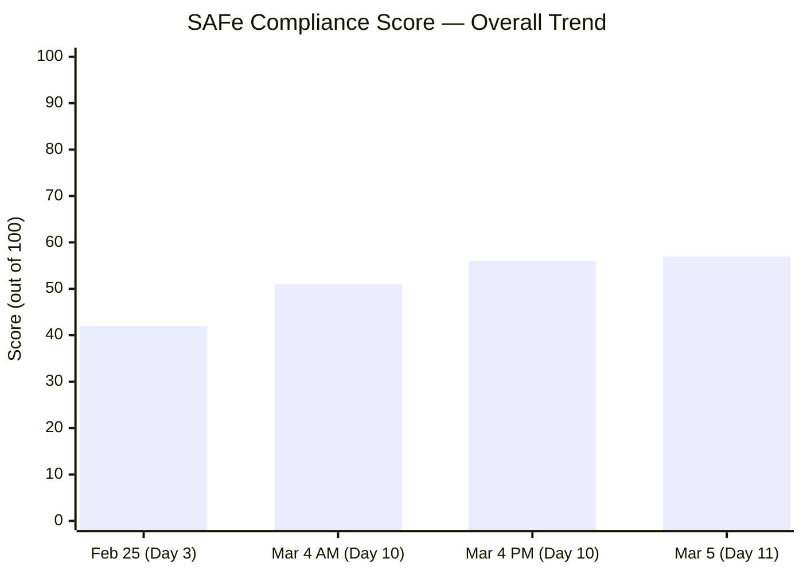

The team has improved SAFe compliance by **+15 points (+36%)** over 10 days, from 42 to 57. The greatest gains came in Estimation & Velocity (+7), Hierarchy & Traceability (+2), Continuous Improvement (+4), and Work Item Quality (+5).

---

## 7. Iteration Close Forecast (Updated)

### 7.1 Scenario Analysis — Day 11 (3 Days Remaining)

| Story | SP | Active Tasks | Completion Likelihood |
|---|---|---|---|
| 199345 VECO Cebu payment | 1 | 1 | 🟢 Highly Likely |
| 199392 SO Certificate (TESDA) | 1 | 1 | 🟢 Highly Likely |
| 199324 Professional fee | 3 | 1 | 🟡 Likely |
| 197121 Ceiling rust materials | 1 | 1 | 🟡 Likely |
| 197122 Ceiling rust repair (impl.) | 3 | 1 | 🟠 At Risk (physical execution) |

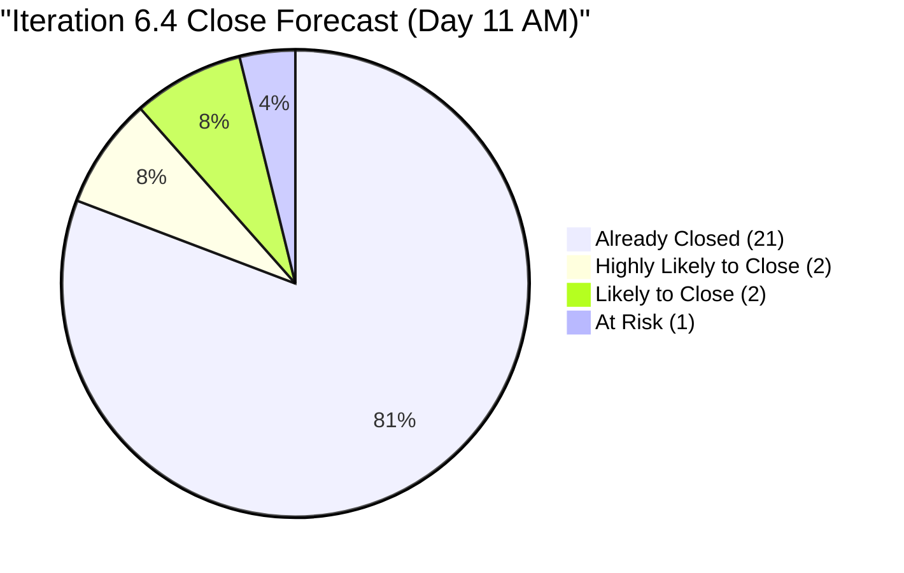

### 7.2 Projected Velocity Scenarios

| Scenario | Stories Closed | SP Closed | Velocity |
|---|---|---|---|
| **Best case** (all 5 Active closed) | 26/26 (100%) | ~36 SP | 36 SP |
| **Likely case** (4 of 5 Active closed) | 25/26 (96%) | ~33 SP | 33 SP |
| **Conservative** (3 of 5 Active closed) | 24/26 (92%) | ~30 SP | 30 SP |

The most likely outcome is **25 of 26 stories closed (96%)**, with only #197122 (ceiling repair implementation) as the item at meaningful risk. This would be the team's first iteration with near-complete delivery.

---

## 8. Recommendations

### Immediate (Before Iteration 6.4 Closes — by March 8)

1. **Complete #199324 (Professional fee, 3 SP)** — Only Dr. Chavez PNB payment remains. This is straightforward.
2. **Complete #199345 (VECO Cebu, 1 SP)** — Single payment task. Should be completable today.
3. **Complete #199392 (SO Certificate TESDA, 1 SP)** — Physical document pickup. Schedule today.
4. **Complete #197121 (Ceiling rust materials, 1 SP)** — Procurement. Execute promptly.
5. **Begin #197122 (Ceiling rust repair, 3 SP)** — This needs physical labor. Start immediately given 3 days remain.
6. **Add Story Points to #199905** retroactively before the iteration retrospective.

### Short-Term (Iteration 6.5 Planning — Week of March 9)

1. **Configure Grace's capacity** — This has been unresolved for 3 audits. Set daily hours, activity type, and assign 2–3 starter stories at the beginning of 6.5.
2. **Run Iteration 6.4 Retrospective** — Document the team's outstanding responsiveness to audit findings as a team strength. Address capacity planning as the primary improvement area.
3. **Implement Definition of Ready** — Estimation, acceptance criteria, and parent feature linkage before iteration commitment.
4. **Plan carry-over handling** — If #197122 does not close, formally document it as a carry-over into 6.5 with updated description.

### Medium-Term (PI 7 Preparation)

1. **Implement WSJF at Feature level** — Business Value, Time Criticality, Risk Reduction, Job Size. Feature backlog currently has no prioritization data (Finding F6).
2. **Velocity baseline for 6.5 planning** — Use Iteration 6.4 actual velocity (~33–36 SP) as the baseline for 6.5 commitment.
3. **Address stalled safety Features** — Fire exit canopy (#158382), jockey pump (#176942), and signage permit (#170869) remain structurally blocked.
4. **PI 2 gap and PI 5 incomplete structure** — Review whether historical PI gaps need to be addressed or archived (Finding F7).

---

## 9. Risk Register (Updated)

| Risk | Likelihood | Impact | Trend | Mitigation |
|---|---|---|---|---|
| #197122 ceiling repair not completed (3 SP, physical work) | **Medium** | Medium | ↑ Elevated (3 days left) | Start implementation today; document carry-over if needed |
| Grace not onboarded for 6.5 | **High** | High | → Unchanged | Configure capacity before 6.5 begins |
| #199905 velocity data gap | Low | Low | → Unchanged | Add SP before retrospective |
| Feature backlog overwhelm (26 features, 1 active contributor) | Medium | High | → Unchanged | WSJF prioritization, backlog grooming |
| Safety features stalled (fire exit, pump, signage) | Medium | High | → Unchanged | Escalate to program level |
| WSJF not implemented at Feature level | High | Medium | → Unchanged | Implement during next PI Planning |
| Blocked signage permit #170869 | Certain | Low | → Unchanged | Escalate or archive |

---

## 10. Conclusion

The Administration Team has demonstrated **remarkable execution speed** over the final stretch of Iteration 6.4. Between yesterday's evening audit and this morning's snapshot, the team closed 3 additional stories including the high-risk **#199334 (Internet payments)** — completing all 6 previously-untouched payment tasks overnight. Every title typo identified since the February 25 audit has now been corrected. The SAFe compliance score has risen from **42/100 on Feb 25 to 57/100 today — a +36% improvement in 10 days**.

With only **5 stories and 9 story points remaining** over 3 days, the team is on a strong trajectory for **96–100% iteration completion** — the best possible outcome for their first fully-estimated iteration.

The **two persistent structural issues** that must be addressed before the team can progress to the next maturity level are:

1. **Grace's capacity configuration and onboarding** (4 audits unresolved)
2. **#199905 Story Points** (4 audits unresolved)

The team's capacity to act on audit findings within hours is genuinely exceptional. The next step is to apply that same responsiveness to the structural capacity planning gap.

**Iteration 6.4 closes: March 8, 2026**
**Next recommended audit: March 8, 2026 (Iteration Close / Retrospective)**

---

*Report generated on March 5, 2026, 21:32 | SAFe 6.0 Framework Standards*
*Auditor: AI Agile PM Consultant*
