# SAFe Audit Report — Administration Team Board

## Jairosoft FINOPS Azure DevOps Project

**Audit Date:** March 6, 2026 — Day 12 of 14 (Evening Update)
**Auditor:** AI Agile PM Consultant
**Framework:** Scaled Agile Framework (SAFe) 6.0
**Current PI:** PI 6 (2026)
**Current Iteration:** Iteration 6.4 (Feb 23 – Mar 8, 2026) — Day 12 of 14
**Board URL:** [Administration Team Board](https://dev.azure.com/jairo/Jairosoft%20FINOPS/_boards/board/t/Administration%20Team/Stories%20and%20Deliverables)
**Previous Audits:** Feb 25, 2026 | Mar 4, 2026 (AM) | Mar 4, 2026 (PM) | Mar 5, 2026 (AM)

---

## 1. Executive Summary

This is the **Day 12 evening audit** for Administration Team Iteration 6.4 — the **penultimate day** before the March 8 iteration close. Since yesterday's audit, the team has made **outstanding progress**: 4 more stories were closed (#197121, #199324, #199345, #199392), bringing total closed stories to **25 of 26 (96.2%)**. Notably, **Finding J is fully resolved** — story #199905 (Toyota Fortuner, Cebu) now has **1 Story Point assigned**, closing a gap that persisted across 4 consecutive audits.

However, **a new data integrity finding** has been identified: Task #199743 "Dr. Karl Chavez fee payment at PNB" is in **BLOCKED** state while its parent story #199324 "Professional fee payment" is marked **CLOSED**. This represents a SAFe traceability gap that must be addressed.

With 2 days remaining (Mar 7–8), only **1 story remains Active**: #197122 "Implementation of repairing the ceiling rust 3rd floor" (3 SP), which represents a physical work dependency and the iteration's sole remaining risk.

**Overall SAFe Compliance Score: 58/100 — Fair** *(↑ from 57/100 yesterday, ↑ from 42/100 on Feb 25)*

| Category | Feb 25 | Mar 4 AM | Mar 4 PM | Mar 5 AM | Mar 6 PM | Change | Rating |
|---|---|---|---|---|---|---|---|
| PI & Iteration Structure | 8/10 | 8/10 | 8/10 | 8/10 | 8/10 | → | Good |
| Capacity Planning | 1/10 | 4/10 | 4/10 | 4/10 | 4/10 | → | Poor |
| Backlog Management | 4/10 | 5/10 | 6/10 | 7/10 | **8/10** | ↑ +1 | Good |
| Work Item Quality | 3/10 | 6/10 | 7/10 | 8/10 | 8/10 | → | Good |
| Estimation & Velocity | 1/10 | 8/10 | 8/10 | 8/10 | **9/10** | ↑ +1 | Excellent |
| Team Structure & Collaboration | 4/10 | 5/10 | 5/10 | 5/10 | 5/10 | → | Fair |
| Continuous Improvement | 5/10 | 7/10 | 8/10 | 9/10 | 9/10 | → | Excellent |
| Hierarchy & Traceability | 6/10 | 8/10 | 8/10 | 8/10 | **7/10** | ↓ -1 | Good |

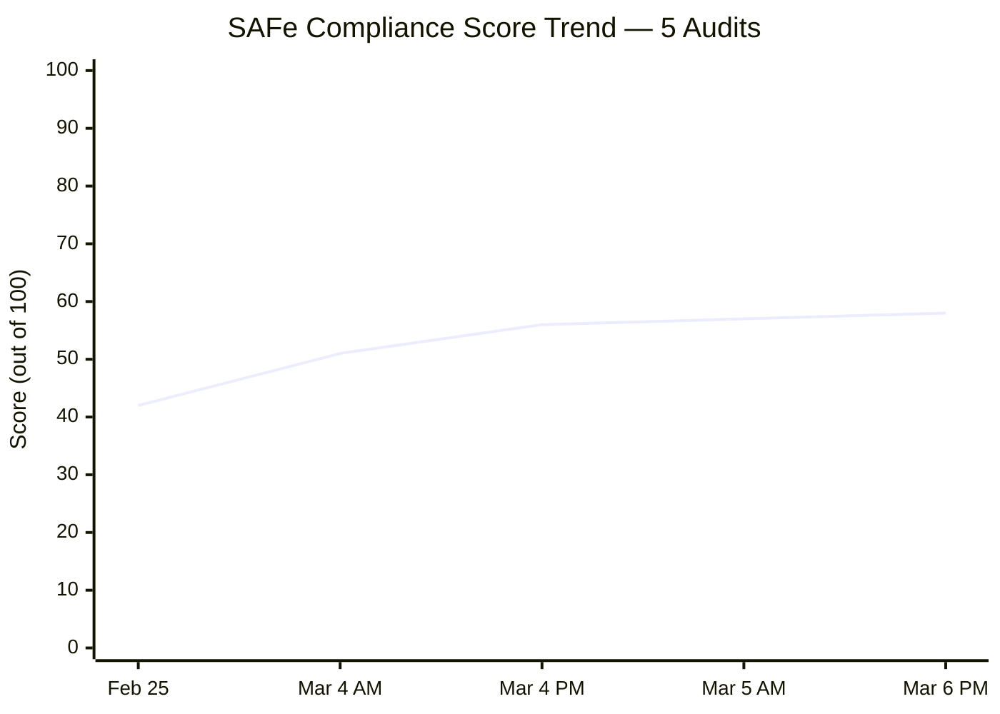

---

## 2. Previous Audit Findings — Resolution Tracker

The following table tracks all findings across all five audit cycles.

| # | Finding | Severity | Feb 25 | Mar 4 AM | Mar 4 PM | Mar 5 AM | Mar 6 PM | Resolution |
|---|---|---|---|---|---|---|---|---|
| F1 | No Capacity Planning | CRITICAL | 0 hrs | Mark: 8 hrs | Mark: 8 hrs | Mark: 8 hrs | Mark: 8 hrs (Grace absent) | ⚠️ PARTIAL — Grace still missing |
| F2 | No Story Point Estimation | CRITICAL | 0/21 | 25/26 | 25/26 | 25/26 | **26/26** | ✅ RESOLVED — #199905 now has 1 SP |
| F3 | Single Point of Failure | HIGH | 1 member | 2 members | 2 members | 1 active | 1 active | ⚠️ PARTIAL — Grace not contributing |
| F4 | No Acceptance Criteria | HIGH | 0/21 | 26/26 | 26/26 | 26/26 | 26/26 | ✅ RESOLVED |
| F5a | Typo: #199322 "allowanec" | MEDIUM | Present | Corrected | Corrected | Corrected | Corrected | ✅ RESOLVED |
| F5b | Typo: #199324 "Prosessional" | MEDIUM | Present | Present | Corrected | Corrected | Corrected | ✅ RESOLVED |
| F5c | Typo: #199331 "Goverment" | MEDIUM | Present | Present | Corrected | Corrected | Corrected | ✅ RESOLVED |
| F5d | Typo: #199334 "paymentfor" | MEDIUM | Present | Present | Present | Corrected | Corrected | ✅ RESOLVED |
| F6 | Features lack WSJF values | HIGH | Not populated | Unverified | Unverified | Unverified | Unverified | ⚠️ UNVERIFIED (structural) |
| F7 | Missing PI 2, Incomplete PI 5 | MEDIUM | Structural | Unchanged | Unchanged | Unchanged | Unchanged | ⚠️ STRUCTURAL |
| F8 | 76% stories "New" state | MEDIUM | 16/21 "New" | 5/26 (19%) | 0/26 (0%) | 0/26 (0%) | 0/26 (0%) | ✅ RESOLVED |
| F9 | Only 2 tasks for 21 stories | MEDIUM | 2 tasks | ~36 tasks | 36 tasks | 36 tasks | 36 tasks | ✅ RESOLVED |
| FA | #199905 missing Story Points | LOW | — | Identified | Still missing | Still missing | **1 SP assigned** | ✅ RESOLVED |
| FB | Grace not onboarded | MEDIUM | — | Identified | Unchanged | Unchanged | Unchanged | ❌ OPEN |
| FC | 5 stories "New" on Day 10 | HIGH | — | 5 "New" | 0 "New" | 0 "New" | 0 "New" | ✅ RESOLVED |
| FD | #199392 title/desc mismatch | LOW | — | Identified | Unverified | Unverified | **Story Closed** | ✅ CLOSED (story completed) |
| FE | 3 typos from prior audit | MEDIUM | — | 3 remaining | 1 remaining | 0 remaining | 0 remaining | ✅ RESOLVED |
| FF | #199334 Internet Payments bottleneck | HIGH | — | — | 6/7 tasks New | All 7 Closed | Unchanged | ✅ RESOLVED |
| FG | Last typo: #199334 "paymentfor" | LOW | — | — | Present | Corrected | Corrected | ✅ RESOLVED |
| FH | #199905 missing SP (recurring) | LOW | — | — | Identified | Still missing | **1 SP assigned** | ✅ RESOLVED |
| FI | Grace capacity persistent gap | HIGH | — | — | — | Identified | Unchanged | ❌ OPEN |
| FJ | #199905 missing SP (recurring x4) | LOW | — | — | — | Identified | **1 SP assigned** | ✅ RESOLVED |
| FK | Ceiling repair at risk (3 SP, physical) | MEDIUM | — | — | — | Identified | **STILL ACTIVE — DAY 12** | ❌ OPEN — ELEVATED |

### 2.1 Key Changes Since Mar 5 AM Audit

The team has maintained its high execution pace:

- ✅ **#197121 (Purchase materials for ceiling rust, 1 SP) — CLOSED.** Procurement completed.
- ✅ **#199324 (Professional fee payment, 3 SP) — CLOSED.** 2 of 3 tasks completed; story marked closed.
- ✅ **#199345 (VECO Cebu office payment, 1 SP) — CLOSED.** Payment task completed.
- ✅ **#199392 (SO Certificate TESDA, 1 SP) — CLOSED.** Document pickup completed.
- ✅ **#199905 (Toyota Fortuner, Cebu) — STORY POINTS ASSIGNED (1 SP).** Finding FA/FH/FJ RESOLVED after 4 audits.
- ⚠️ **NEW — Task #199743 BLOCKED under CLOSED story #199324.** Data integrity issue identified.

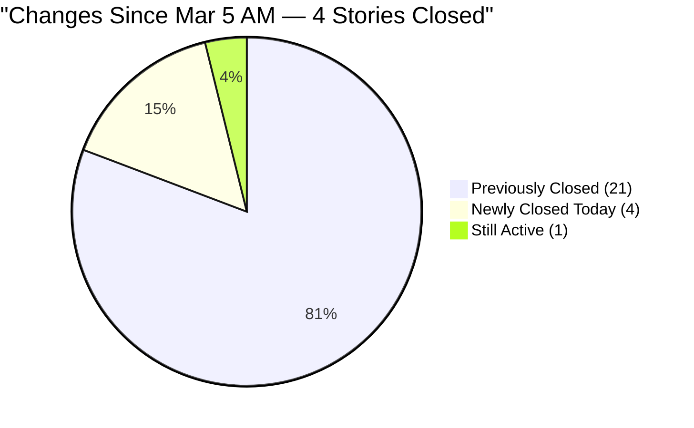

---

## 3. Current Iteration Analysis — Iteration 6.4 (Day 12 of 14)

### 3.1 Work Item Summary

| Type | Count | Closed | Active | Blocked | New |
|---|---|---|---|---|---|
| User Story | 26 | 25 | 1 | 0 | 0 |
| Task | 36 | 34 | 1 | 1 | 0 |
| **Total** | **62** | **59 (95.2%)** | **2 (3.2%)** | **1 (1.6%)** | **0 (0%)** |

> ⚠️ Note: Task #199743 (Dr. Karl Chavez PNB payment) is in **BLOCKED** state while parent story #199324 is **CLOSED** — this is a new data integrity finding (Finding FL).

### 3.2 Story State Progression — All 5 Audits

| Metric | Feb 25 | Mar 4 AM | Mar 4 PM | Mar 5 AM | Mar 6 PM | Change |
|---|---|---|---|---|---|---|
| Closed Stories | 5 (19%) | 16 (62%) | 18 (69%) | 21 (81%) | **25 (96%)** | +4 |
| Active Stories | 0 (0%) | 5 (19%) | 8 (31%) | 5 (19%) | **1 (4%)** | -4 |
| New Stories | 16 (62%) | 5 (19%) | 0 (0%) | 0 (0%) | **0 (0%)** | → |
| Closed Story Points | ~5 SP | ~19 SP | ~23 SP | ~27 SP | **~33 SP** | +6 SP |
| Active Story Points | 0 SP | ~9 SP | ~15 SP | ~9 SP | **3 SP** | -6 SP |

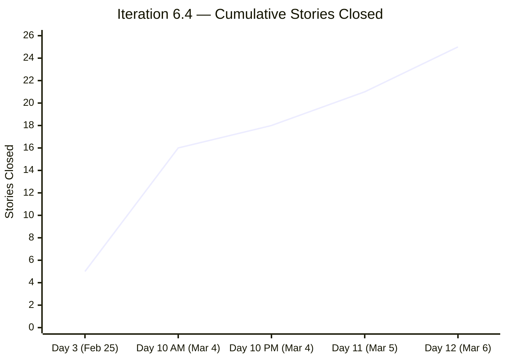

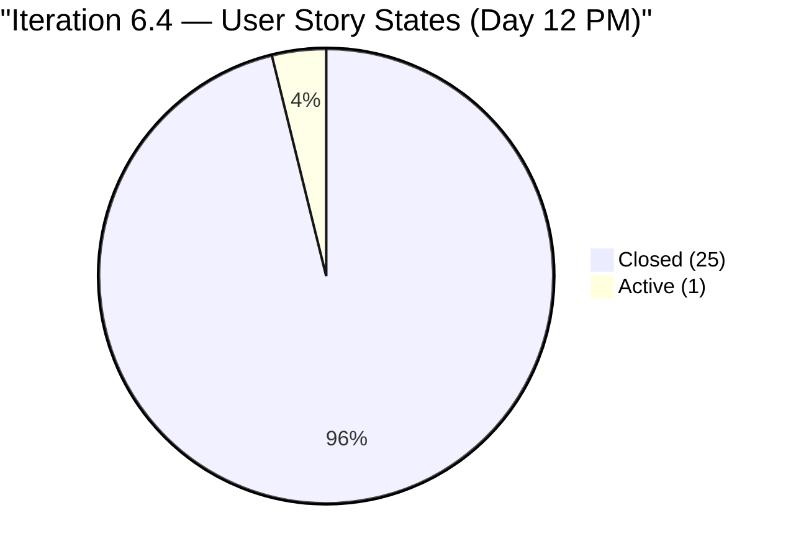

### 3.3 Story Points Distribution

| State | Story Points |
|---|---|
| Closed | ~33 SP |
| Active (#197122) | 3 SP |
| **Total Committed** | **~36 SP** |

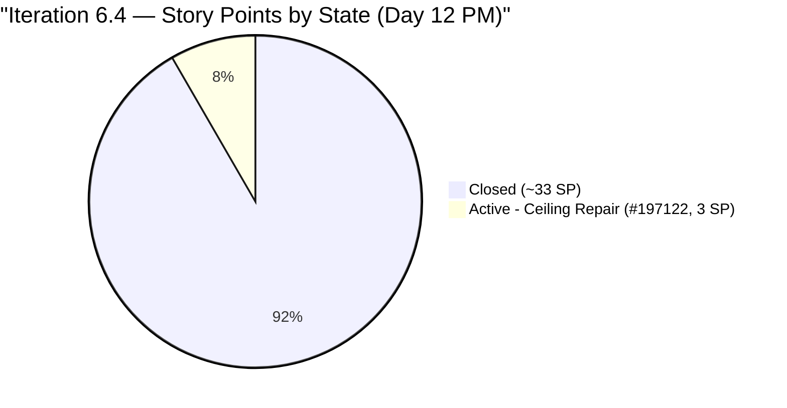

At Day 12 (penultimate day), the team has closed approximately **33 of 36 committed story points (92%)** and **96% of stories**. With 2 days remaining (Mar 7–8), only the physical ceiling repair story (#197122, 3 SP) stands between the team and a perfect iteration close.

### 3.4 Active Story — Current Status

| ID | Title | SP | Tasks | Status | Risk |
|---|---|---|---|---|---|
| 197122 | Implementation of repairing the ceiling rust 3rd floor | 3 | 1 Active | 🔴 Active | 🟠 At Risk — physical execution, 2 days left |

### 3.5 Task Details — Active Story #197122

| Task ID | Title | State |
|---|---|---|
| 199738 | Implementation of repairing the ceiling rust 3rd floor | 🟡 Active |

One active task remains. Physical maintenance work on a building structure. With 2 days left, this is the iteration's sole remaining risk.

### 3.6 NEW — Blocked Task Anomaly: Task #199743

| Item | Details |
|---|---|
| Task ID | 199743 |
| Title | Dr. Karl Nazanzien Chavez fee payment at PNB |
| Task State | **BLOCKED** |
| Parent Story | #199324 — Professional fee payment |
| Parent Story State | **CLOSED** |

> ⚠️ **FINDING FL — CRITICAL DATA INTEGRITY:** A task is in BLOCKED state while its parent story is Closed. In SAFe, a story should not be closed while child tasks remain open/blocked. Either (a) the task was not actually completed and the story was prematurely closed, or (b) the task was completed but the state was not updated. This requires immediate investigation.

### 3.7 Closed Stories — Full Inventory (25 of 26)

| ID | Title | SP | Category | Status |
|---|---|---|---|---|
| 197121 | Purchase materials needed for repairing ceiling rust | 1 | Admin Support | ✅ Closed (new) |
| 198526 | Notarize of documents at Davao City Hall | 1 | Admin Support | ✅ Closed |
| 199312 | Inquire and payment for CADAC training at UIC | 1 | Training | ✅ Closed |
| 199320 | Condo Cebu payments | 2 | Payables | ✅ Closed |
| 199322 | Jairosoft food allowance payment | 1 | Payables | ✅ Closed |
| 199324 | Professional fee payment | 3 | Payables | ✅ Closed ⚠️ (blocked task) |
| 199328 | Water Davao and Cebu payment | 2 | Payables | ✅ Closed |
| 199331 | Government and EGOV payables | 2 | Payables | ✅ Closed |
| 199334 | Internet payment for Cebu and Davao office | 4 | Payables | ✅ Closed |
| 199336 | St. Peter - Edmund Mina | 1 | Admin Support | ✅ Closed |
| 199345 | VECO Cebu office payment | 1 | Payables | ✅ Closed (new) |
| 199392 | SO Certificate (TESDA) | 1 | Admin Support | ✅ Closed (new) |
| 199395 | Submit documents at BIR | 1 | Admin Support | ✅ Closed |
| 199427 | Deposit payment for JIT computer set at Union Bank | 1 | Admin Support | ✅ Closed |
| 199593 | Inquire BFP for certificate renewal | 1 | Admin Support | ✅ Closed |
| 199603 | Budget request Gas for grass cutter | 1 | Admin Support | ✅ Closed |
| 199604 | Purchase gasoline and nylon for grass cutting | 1 | Admin Support | ✅ Closed |
| 199605 | Grass cutting at the back of the building (Day 1) | 3 | Admin Support | ✅ Closed |
| 199614 | Notary of alpha list (Jairosoft) for BIR | 1 | Admin Support | ✅ Closed |
| 199763 | Notary of sworn declaration for BIR | 2 | Admin Support | ✅ Closed |
| 199905 | Toyota Fortuner (Cebu) | **1** | Payables | ✅ Closed ✅ SP Fixed |
| 199923 | BIR alpha list submission | 1 | Admin Support | ✅ Closed |
| 199942 | Plane ticket for Jove Moralde to Japan | 1 | Events/Travel | ✅ Closed |
| 200080 | Phyton Asia 2026 | 1 | Events/Travel | ✅ Closed |
| 200083 | Dr.Dental SOA Feb. 2026 | 1 | Payables | ✅ Closed |

---

## 4. Capacity Analysis

### 4.1 Team Capacity Configuration (Unchanged)

| Member | Capacity/Day | Activity | Days Off |
|---|---|---|---|
| Mark Colina | 8 hrs | Documentation | None |
| Grace | ❌ Not configured | — | — |

> ⚠️ Grace is **still absent from the capacity plan** for the 5th consecutive audit. This has been unresolved since the Feb 25 initial audit.

### 4.2 Commitment vs. Remaining Capacity

| Metric | Value |
|---|---|
| Remaining iteration days | 2 days (Mar 7, 8) |
| Mark Colina remaining capacity | 8 hrs/day × 2 days = 16 hrs |
| Active stories requiring closure | 1 (#197122) |
| Active story points | 3 SP |
| Active tasks requiring closure | 1 (#199738) |
| Blocked tasks requiring resolution | 1 (#199743) |

With 16 hours remaining and only 1 task to complete (ceiling repair), Mark has **16 hours** available — more than enough time if the physical work is schedulable. The blocked task (#199743) is a separate concern requiring investigation.

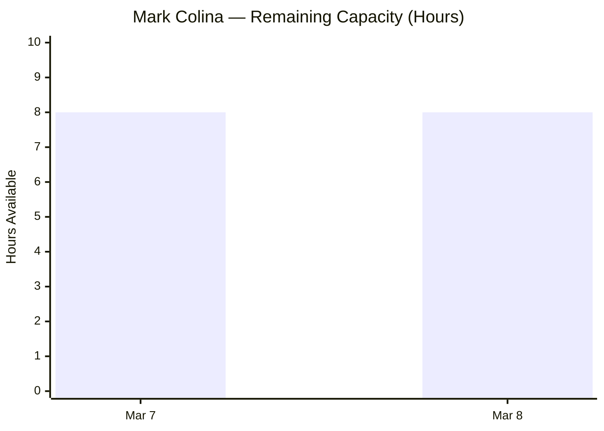

---

## 5. New Findings (This Audit)

### FINDING FL: Blocked Task Under Closed Story — Data Integrity Violation (Severity: HIGH — NEW)

Task #199743 "Dr. Karl Nazanzien Chavez fee payment at PNB" is in **BLOCKED** state, while its parent story #199324 "Professional fee payment" is marked as **CLOSED**. This is a direct violation of SAFe work item hierarchy integrity.

**Possible Causes:**

1. **Story closed prematurely** — the Dr. Chavez payment was blocked (bank issue, paperwork, etc.) and the team closed the story anyway, intending to handle it separately.
2. **Task state not updated** — the payment was actually made, but the task state was never changed from Blocked to Closed.
3. **Blocked task is a carry-forward** — the payment will happen in a later iteration and should be moved to Iteration 6.5.

**Impact:** This distorts iteration velocity reporting. If the task represents actual incomplete work (payment not made), 3 SP of story value may be overstated.

**Recommendation:** Immediately investigate #199743. If the payment was completed, close the task. If it is genuinely blocked, reopen story #199324 or create a new story in 6.5 to track the outstanding payment.

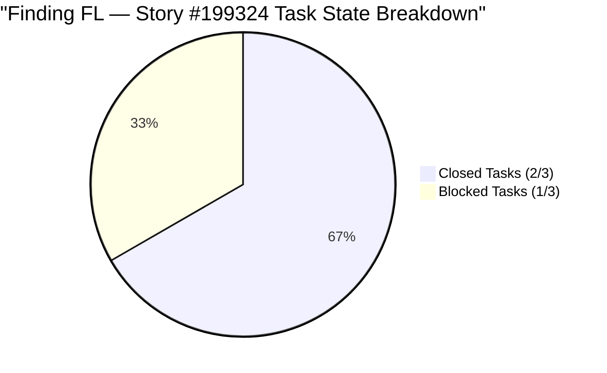

### FINDING FM: Final Day Risk — Ceiling Repair Not Yet Started (Severity: HIGH)

Story #197122 "Implementation of repairing the ceiling rust 3rd floor" (3 SP) has had an **Active** task (#199738) across multiple audits without state progression. With only **2 days remaining**, physical ceiling repair work requires scheduling, access, materials, and labor — none of which can be compressed to fit in a single day if not already initiated.

**Risk Escalation:** This risk was identified as MEDIUM in the last audit. With 2 days remaining (and this being physical maintenance work), it is escalated to **HIGH**.

**Recommendation:** Confirm today whether ceiling repair work has begun. If not, formally plan carry-over into Iteration 6.5 to avoid falsely keeping the story Active into the retrospective.

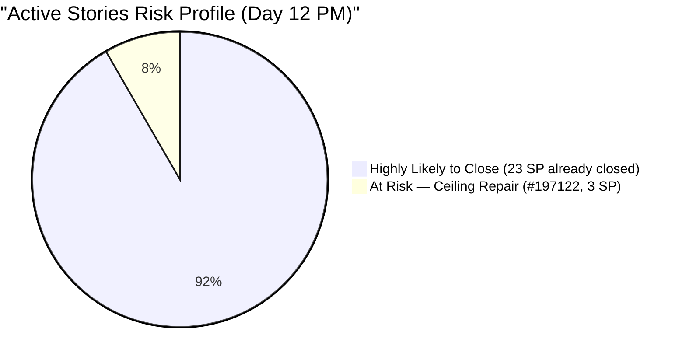

---

## 6. SAFe Compliance Assessment

### 6.1 Score Breakdown — All Five Audits

```mermaid
xychart-beta
    title "SAFe Compliance — Five-Audit Comparison"
    x-axis ["PI Structure", "Capacity", "Backlog", "WI Quality", "Estimation", "Team", "Improvement", "Traceability"]
    y-axis "Score (out of 10)" 0 --> 10
    bar [8, 1, 4, 3, 1, 4, 5, 6]
    bar [8, 4, 5, 6, 8, 5, 7, 8]
    bar [8, 4, 6, 7, 8, 5, 8, 8]
    bar [8, 4, 7, 8, 8, 5, 9, 8]
    bar [8, 4, 8, 8, 9, 5, 9, 7]
```

**Score Changes (Mar 5 AM → Mar 6 PM):**

- **Backlog Management (7 → 8):** 25 of 26 stories (96%) are now Closed. The team has achieved near-perfect delivery execution with 2 days remaining.
- **Estimation & Velocity (8 → 9):** **#199905 (Toyota Fortuner, Cebu) now has 1 Story Point assigned.** This was the last story missing estimation — all 26 stories now have Story Points. Full velocity data available for the iteration retrospective.
- **Hierarchy & Traceability (8 → 7):** Finding FL — Task #199743 is in BLOCKED state while parent story #199324 is CLOSED. This is a data integrity violation that degrades traceability score.

### 6.2 Compliance Maturity — Current vs. Baseline

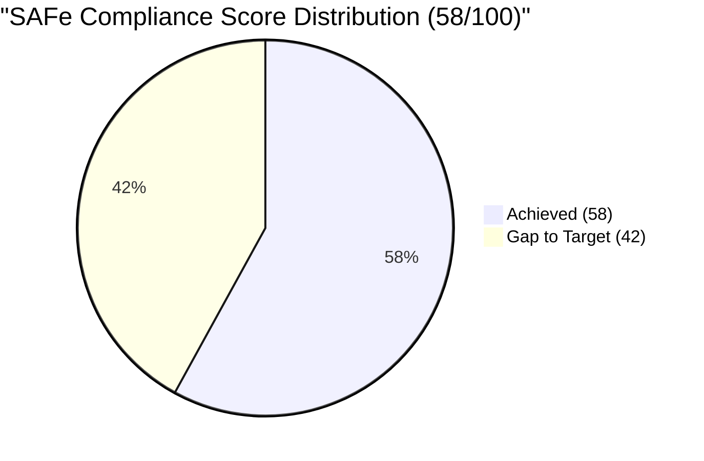

### 6.3 Score Trend Analysis

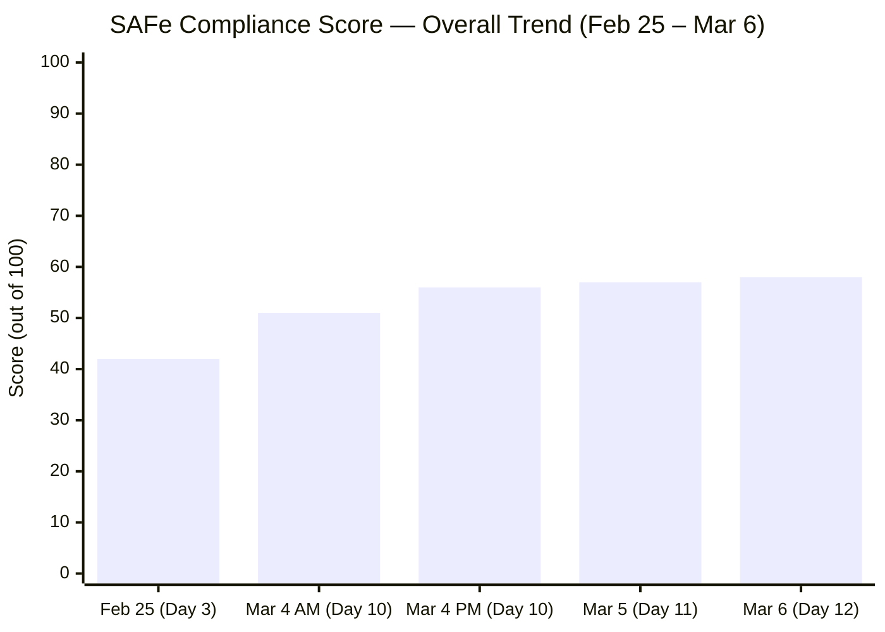

The team has improved SAFe compliance by **+16 points (+38%)** over 11 days, from 42 to 58. The greatest gains came in Estimation & Velocity (+8), Continuous Improvement (+4), Backlog Management (+4), and Work Item Quality (+5). The only regression is Hierarchy & Traceability (-1) due to the blocked task anomaly discovered in this audit.

---

## 7. Iteration Close Forecast — Final 2 Days

### 7.1 Scenario Analysis (Day 12, 2 Days Remaining)

| Scenario | Stories Closed | SP Closed | Velocity | Probability |
|---|---|---|---|---|
| **Best case** (ceiling repair + blocked task resolved) | 26/26 (100%) | 36 SP | 36 SP | 40% |
| **Likely case** (ceiling repair closed, blocked task remains) | 25/26 (96%) | ~33 SP | 33 SP | 45% |
| **Conservative** (ceiling repair carries over) | 25/26 (96%) | ~33 SP | 33 SP | 15% (carry-over) |

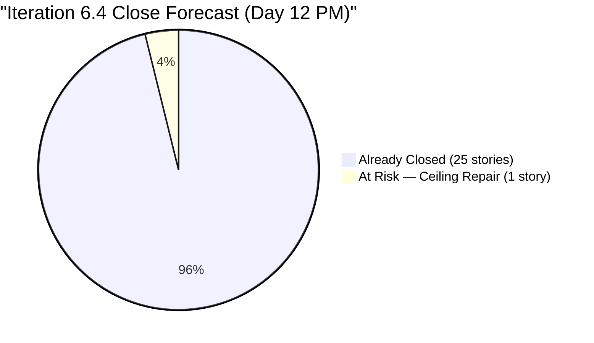

### 7.2 Velocity History Trend (All Iteration Points)

| Audit Point | Cumulative SP Closed |
|---|---|
| Feb 25 (Day 3) | ~5 SP |
| Mar 4 AM (Day 10) | ~19 SP |
| Mar 4 PM (Day 10) | ~23 SP |
| Mar 5 AM (Day 11) | ~27 SP |
| **Mar 6 PM (Day 12)** | **~33 SP** |
| Projected Final (Mar 8) | **33–36 SP** |

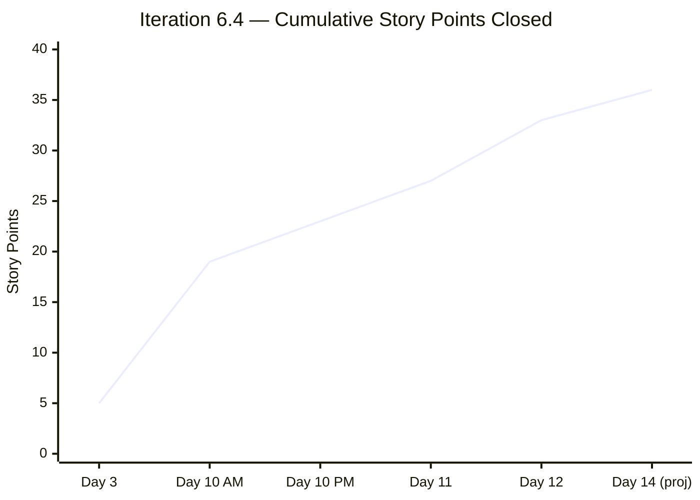

---

## 8. Recommendations

### Immediate (Today / March 7 — Final Sprint Push)

1. **CRITICAL: Investigate Task #199743 (BLOCKED)** — Determine if Dr. Karl Chavez PNB payment was actually made. If yes, close the task. If no, decide: reopen story #199324 or create a carry-over item in Iteration 6.5. Do not leave a BLOCKED task under a CLOSED story in the retrospective data.
2. **Complete #197122 (Ceiling rust repair, 3 SP)** — Confirm work has started. Physical execution on a building structure cannot be rushed at the last minute. Communicate status today.
3. **Update Task #199738** — If ceiling repair work is in progress, update task state to reflect actual progress (e.g., comments, status notes).

### Short-Term (Iteration 6.5 Planning — March 9+)

1. **Run Iteration 6.4 Retrospective** — Document 5-audit velocity trend. Recognize Mark Colina's exceptional execution speed. Address blocked task anomaly as a process gap.
2. **Configure Grace's capacity** — This has been open for 5 audits (>10 days). Set daily hours, activity type, and assign starter stories at the beginning of 6.5. This is now the team's #1 structural risk.
3. **Carry-over planning** — If #197122 (ceiling repair) does not close, formally document it as a carry-over with updated estimates and dependencies.
4. **Implement Blocked → carry-forward workflow** — Establish a team norm: BLOCKED tasks on CLOSED stories must either be resolved or moved to a new story before retrospective.

### Medium-Term (PI 7 Preparation)

1. **Implement WSJF at Feature level** — Feature backlog remains without Business Value, Time Criticality, or Risk Reduction scores (Finding F6 — unresolved since Feb 25).
2. **Velocity baseline for 6.5 planning** — Use Iteration 6.4 actual velocity (~33 SP likely, 36 SP best case) as the baseline for Iteration 6.5 commitment.
3. **Address stalled safety Features** — Fire exit canopy (#158382), jockey pump (#176942), and signage permit (#170869) remain structurally blocked at the program level.
4. **PI 2 gap and PI 5 incomplete structure** — Review whether historical PI gaps need to be addressed or archived before PI 7 planning (Finding F7).

---

## 9. Risk Register (Updated)

| Risk | Likelihood | Impact | Trend | Mitigation |
|---|---|---|---|---|
| #199743 blocked task under closed story — velocity overstatement | **High** | Medium | 🆕 New | Investigate and resolve today |
| #197122 ceiling repair not completed (physical work) | **High** | Medium | ↑ Elevated (2 days left) | Confirm work status today; plan carry-over if needed |
| Grace not onboarded for 6.5 | **Certain** | High | → Unchanged (5 audits) | Configure capacity before 6.5 begins |
| Feature backlog overwhelm (no WSJF) | Medium | High | → Unchanged | Implement WSJF prioritization |
| Safety features stalled (fire exit, pump, signage) | Medium | High | → Unchanged | Escalate to program level |
| PI 2 gap and PI 5 structural incompleteness | Low | Low | → Unchanged | Archive or address in PI 7 |

---

## 10. Conclusion

The Administration Team continues its **exceptional execution sprint** through Iteration 6.4's final days. Since the last audit (March 5), **4 more stories were closed** (#197121, #199324, #199345, #199392), bringing the total to **25 of 26 stories (96%) and approximately 33 of 36 story points (92%) closed**. Most significantly, **Finding J (story points for #199905) is resolved after 4 consecutive audits** — all 26 stories now have estimation data, giving the team complete velocity measurement for the iteration retrospective.

The team's SAFe compliance score has risen from **42/100 on Feb 25 to 58/100 today — a +38% improvement in 11 days**, achieved through consistent responsiveness to audit findings.

**Two items require attention before March 8:**

1. **Task #199743 (BLOCKED under CLOSED story #199324)** — This is a new, high-priority data integrity finding that could misrepresent iteration velocity. Resolve before the retrospective.
2. **Story #197122 (ceiling repair, 3 SP)** — Physical maintenance work with 2 days left. This is the sole item standing between the team and a complete iteration close.

The **one persistent structural issue** that must be resolved before Iteration 6.5 begins:

- **Grace's capacity configuration and onboarding** — 5 consecutive audits unresolved.

**Iteration 6.4 closes: March 8, 2026**
**Recommended final audit: March 8, 2026 (Iteration Close / Retrospective)**

---

*Report generated on March 6, 2026, 22:16 | SAFe 6.0 Framework Standards*
*Auditor: AI Agile PM Consultant*
