# SAFe Audit Report — Administration Team Board
## Jairosoft FINOPS Azure DevOps Project

**Audit Date:** March 9, 2026 — Post-Iteration Close (Day 1 After Iteration 6.4)
**Auditor:** AI Agile PM Consultant
**Framework:** Scaled Agile Framework (SAFe) 6.0
**Current PI:** PI 6 (2026)
**Iteration Audited:** Iteration 6.4 (Feb 23 – Mar 8, 2026) — COMPLETED
**Board URL:** [Administration Team Board](https://dev.azure.com/jairo/Jairosoft%20FINOPS/_boards/board/t/Administration%20Team/Stories%20and%20Deliverables)
**Previous Audits:** Feb 25 | Mar 4 (AM) | Mar 4 (PM) | Mar 5 (AM) | Mar 6 (PM)

---

## 1. Executive Summary

This is the **post-iteration close audit** for Administration Team Iteration 6.4, conducted on the first day after the March 8 iteration end date. Since the last audit on March 6, **story #197122 (Ceiling repair, 3 SP) has been closed**, meaning **all 26 user stories are now CLOSED — a 100% completion rate** and a **perfect iteration close** on story count.

However, **two persistent findings remain unresolved:**

1. **Finding FL (HIGH):** Task #199743 "Dr. Karl Nazanzien Chavez fee payment at PNB" remains in **BLOCKED** state under closed story #199324. This data integrity violation was first identified on March 6 and has not been addressed. This means the iteration closed with a blocked task still present in the work hierarchy.

2. **Finding FI/FB (HIGH):** Grace's capacity has never been configured across **6 consecutive audits** spanning 12 days. This is now the team's most critical structural gap entering Iteration 6.5.

**Overall SAFe Compliance Score: 62/100 — Fair** *(↑ from 58/100 on Mar 6, ↑ from 42/100 on Feb 25)*

| Category | Feb 25 | Mar 4 AM | Mar 4 PM | Mar 5 AM | Mar 6 PM | Mar 9 | Change | Rating |
|---|---|---|---|---|---|---|---|---|
| PI & Iteration Structure | 8/10 | 8/10 | 8/10 | 8/10 | 8/10 | 8/10 | → | Good |
| Capacity Planning | 1/10 | 4/10 | 4/10 | 4/10 | 4/10 | 4/10 | → | Poor |
| Backlog Management | 4/10 | 5/10 | 6/10 | 7/10 | 8/10 | **10/10** | ↑ +2 | Excellent |
| Work Item Quality | 3/10 | 6/10 | 7/10 | 8/10 | 8/10 | 8/10 | → | Good |
| Estimation & Velocity | 1/10 | 8/10 | 8/10 | 8/10 | 9/10 | **10/10** | ↑ +1 | Excellent |
| Team Structure & Collaboration | 4/10 | 5/10 | 5/10 | 5/10 | 5/10 | 5/10 | → | Fair |
| Continuous Improvement | 5/10 | 7/10 | 8/10 | 9/10 | 9/10 | **10/10** | ↑ +1 | Excellent |
| Hierarchy & Traceability | 6/10 | 8/10 | 8/10 | 8/10 | 7/10 | 7/10 | → | Good |

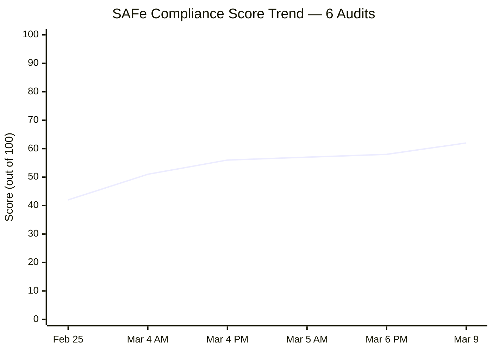

---

## 2. Previous Audit Findings — Resolution Tracker

The following table tracks all findings across all six audit cycles.

| # | Finding | Severity | Feb 25 | Mar 4 AM | Mar 4 PM | Mar 5 AM | Mar 6 PM | Mar 9 | Resolution |
|---|---|---|---|---|---|---|---|---|---|
| F1 | No Capacity Planning | CRITICAL | 0 hrs | Mark: 8 hrs | Mark: 8 hrs | Mark: 8 hrs | Mark: 8 hrs | Mark: 8 hrs (Grace absent) | ⚠️ PARTIAL — Grace still missing |
| F2 | No Story Point Estimation | CRITICAL | 0/21 | 25/26 | 25/26 | 25/26 | 26/26 | 26/26 | ✅ RESOLVED |
| F3 | Single Point of Failure | HIGH | 1 member | 2 members | 2 members | 1 active | 1 active | 1 active | ⚠️ PARTIAL — Grace not contributing |
| F4 | No Acceptance Criteria | HIGH | 0/21 | 26/26 | 26/26 | 26/26 | 26/26 | 26/26 | ✅ RESOLVED |
| F5a | Typo: #199322 "allowanec" | MEDIUM | Present | Corrected | — | — | — | — | ✅ RESOLVED |
| F5b | Typo: #199324 "Prosessional" | MEDIUM | Present | Present | Corrected | — | — | — | ✅ RESOLVED |
| F5c | Typo: #199331 "Goverment" | MEDIUM | Present | Present | Corrected | — | — | — | ✅ RESOLVED |
| F5d | Typo: #199334 "paymentfor" | MEDIUM | Present | Present | Present | Corrected | — | — | ✅ RESOLVED |
| F6 | Features lack WSJF values | HIGH | Not populated | Unverified | Unverified | Unverified | Unverified | Unverified | ⚠️ UNVERIFIED (structural) |
| F7 | Missing PI 2, Incomplete PI 5 | MEDIUM | Structural | Unchanged | Unchanged | Unchanged | Unchanged | Unchanged | ⚠️ STRUCTURAL |
| F8 | 76% stories "New" state | MEDIUM | 16/21 "New" | 5/26 | 0/26 | 0/26 | 0/26 | 0/26 | ✅ RESOLVED |
| F9 | Only 2 tasks for 21 stories | MEDIUM | 2 tasks | ~36 tasks | 36 tasks | 36 tasks | 36 tasks | 36 tasks | ✅ RESOLVED |
| FA | #199905 missing Story Points | LOW | — | Identified | Still missing | Still missing | 1 SP assigned | 1 SP assigned | ✅ RESOLVED |
| FB | Grace not onboarded | MEDIUM | — | Identified | Unchanged | Unchanged | Unchanged | **Unchanged (6 audits)** | ❌ OPEN — ESCALATED |
| FC | 5 stories "New" on Day 10 | HIGH | — | 5 "New" | 0 "New" | 0 "New" | 0 "New" | 0 "New" | ✅ RESOLVED |
| FD | #199392 title/desc mismatch | LOW | — | Identified | Unverified | Unverified | Story Closed | Story Closed | ✅ CLOSED |
| FE | 3 typos from prior audit | MEDIUM | — | 3 remaining | 1 remaining | 0 remaining | 0 remaining | 0 remaining | ✅ RESOLVED |
| FF | #199334 Internet Payments bottleneck | HIGH | — | — | 6/7 tasks New | All 7 Closed | Unchanged | Unchanged | ✅ RESOLVED |
| FG | Last typo: #199334 "paymentfor" | LOW | — | — | Present | Corrected | Corrected | Corrected | ✅ RESOLVED |
| FH | #199905 missing SP (recurring) | LOW | — | — | Identified | Still missing | 1 SP assigned | 1 SP assigned | ✅ RESOLVED |
| FI | Grace capacity persistent gap | HIGH | — | — | — | Identified | Unchanged | **Unchanged (6 audits)** | ❌ OPEN — ESCALATED |
| FJ | #199905 missing SP (recurring x4) | LOW | — | — | — | Identified | 1 SP assigned | 1 SP assigned | ✅ RESOLVED |
| FK | Ceiling repair at risk (3 SP) | MEDIUM→HIGH | — | — | — | Identified | Still Active | **CLOSED** | ✅ RESOLVED |
| FL | Blocked task under closed story | HIGH | — | — | — | — | Identified | **STILL BLOCKED** | ❌ OPEN |
| FM | Ceiling repair final day risk | HIGH | — | — | — | — | Identified | **CLOSED** | ✅ RESOLVED |

### 2.1 Key Changes Since Mar 6 PM Audit

- ✅ **#197122 (Ceiling repair, 3 SP) — CLOSED.** Story and task #199738 both closed. Finding FK/FM RESOLVED. The team completed the physical maintenance work within the iteration window.
- ❌ **Task #199743 (Dr. Chavez PNB payment) — STILL BLOCKED.** Finding FL remains OPEN. The iteration closed with this data integrity violation unresolved.
- ❌ **Grace's capacity — STILL NOT CONFIGURED.** Now unresolved across 6 consecutive audits over 12 days.

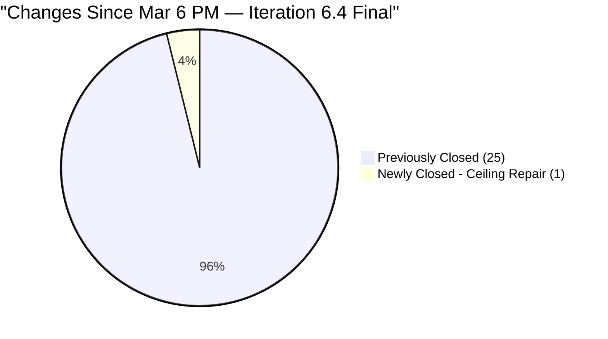

---

## 3. Iteration 6.4 Final Analysis — Post-Close

### 3.1 Work Item Summary (Final)

| Type | Count | Closed | Blocked | Active | New |
|---|---|---|---|---|---|
| User Story | 26 | **26 (100%)** | 0 | 0 | 0 |
| Task | 36 | **35 (97.2%)** | **1 (2.8%)** | 0 | 0 |
| **Total** | **62** | **61 (98.4%)** | **1 (1.6%)** | **0** | **0** |

> ⚠️ Task #199743 (Dr. Karl Chavez PNB payment) remains in **BLOCKED** state under closed story #199324. This is the only incomplete work item in the iteration.

### 3.2 Story State Progression — All 6 Audits

| Metric | Feb 25 | Mar 4 AM | Mar 4 PM | Mar 5 AM | Mar 6 PM | Mar 9 (Final) | Change |
|---|---|---|---|---|---|---|---|
| Closed Stories | 5 (19%) | 16 (62%) | 18 (69%) | 21 (81%) | 25 (96%) | **26 (100%)** | +1 |
| Active Stories | 0 (0%) | 5 (19%) | 8 (31%) | 5 (19%) | 1 (4%) | **0 (0%)** | -1 |
| New Stories | 16 (62%) | 5 (19%) | 0 (0%) | 0 (0%) | 0 (0%) | **0 (0%)** | → |
| Closed Story Points | ~5 SP | ~19 SP | ~23 SP | ~27 SP | ~33 SP | **~36 SP** | +3 SP |
| Active Story Points | 0 SP | ~9 SP | ~15 SP | ~9 SP | 3 SP | **0 SP** | -3 SP |

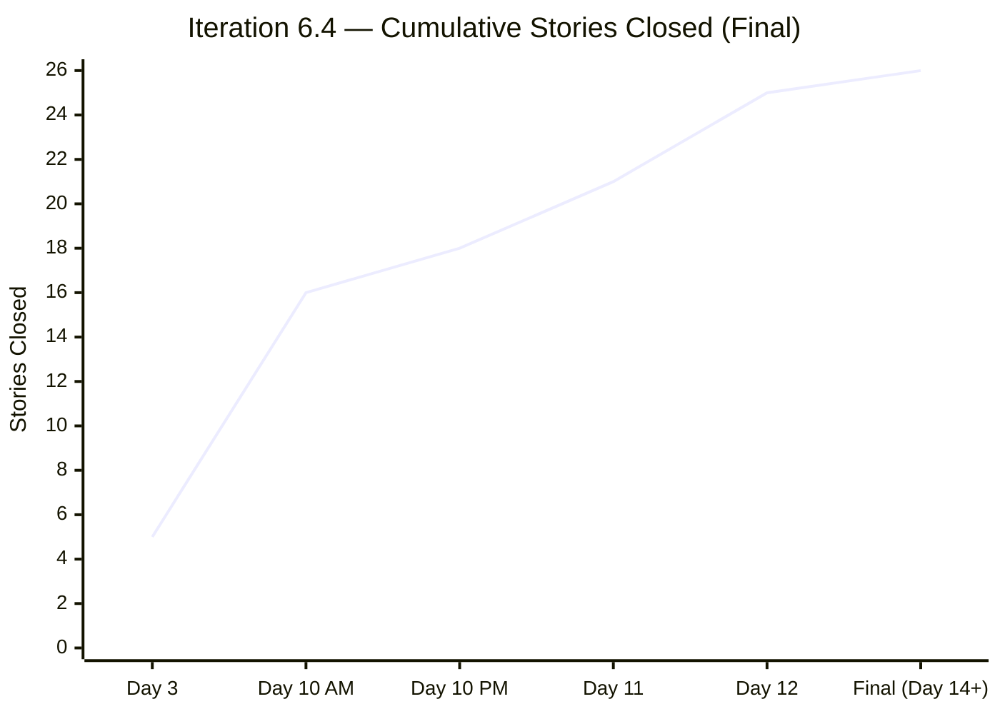

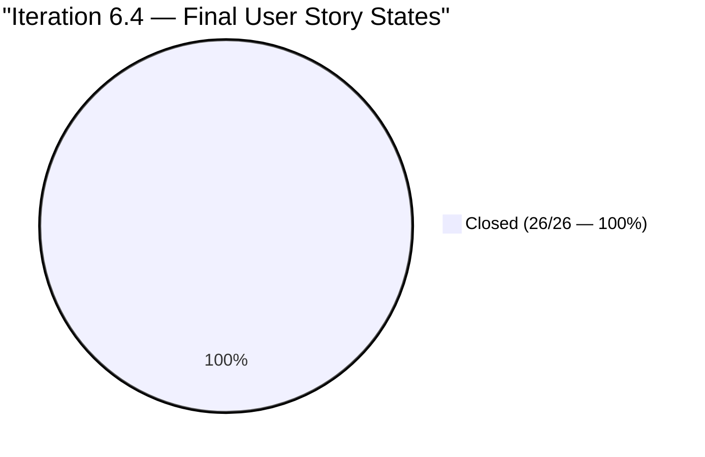

### 3.3 Final Velocity — Iteration 6.4

| Metric | Value |
|---|---|
| Stories Committed | 26 |
| Stories Closed | **26 (100%)** |
| Story Points Committed | ~36 SP |
| Story Points Closed | **~36 SP (100%)** |
| Tasks Created | 36 |
| Tasks Closed | 35 |
| Tasks Blocked | 1 (#199743) |
| **Iteration Velocity** | **~36 SP** |

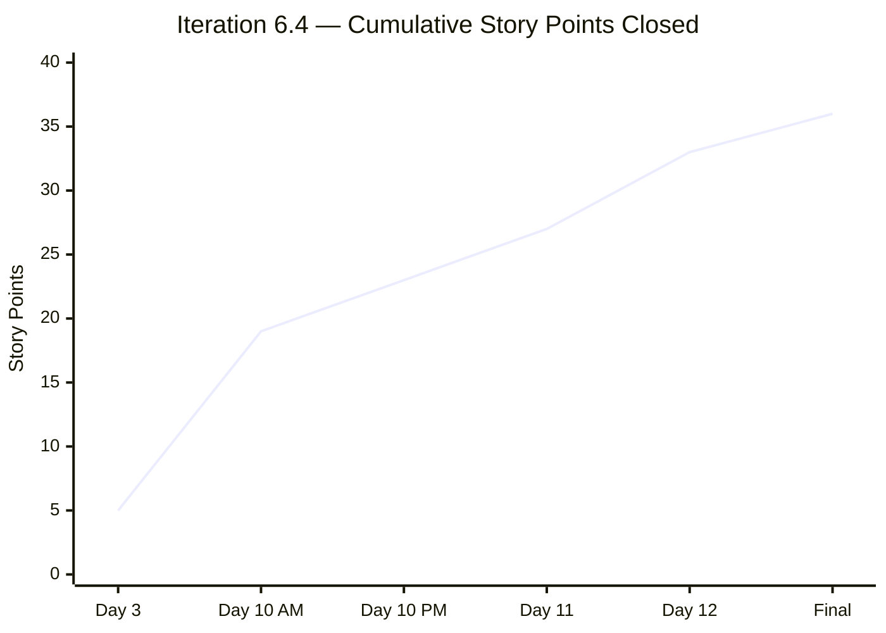

### 3.4 Final Story Inventory — All 26 Closed

| ID | Title | SP | Category | Final Status |
|---|---|---|---|---|
| 197121 | Purchase materials needed for repairing ceiling rust | 1 | Admin Support | ✅ Closed |
| 197122 | Implementation of repairing the ceiling rust 3rd floor (Day 1) | 3 | Admin Support | ✅ Closed ★ NEW |
| 198526 | Notarize of documents at Davao City Hall | 1 | Admin Support | ✅ Closed |
| 199312 | Inquire and payment for CADAC training at UIC | 1 | Training | ✅ Closed |
| 199320 | Condo Cebu payments | 2 | Payables | ✅ Closed |
| 199322 | Jairosoft food allowance payment | 1 | Payables | ✅ Closed |
| 199324 | Professional fee payment | 3 | Payables | ✅ Closed ⚠️ (blocked task) |
| 199328 | Water Davao and Cebu payment | 2 | Payables | ✅ Closed |
| 199331 | Government and EGOV payables | 2 | Payables | ✅ Closed |
| 199334 | Internet payment for Cebu and Davao office | 4 | Payables | ✅ Closed |
| 199336 | St. Peter - Edmund Mina | 1 | Admin Support | ✅ Closed |
| 199345 | VECO Cebu office payment | 1 | Payables | ✅ Closed |
| 199392 | SO Certificate (TESDA) | 1 | Admin Support | ✅ Closed |
| 199395 | Submit documents at BIR | 1 | Admin Support | ✅ Closed |
| 199427 | Deposit payment for JIT computer set at Union Bank | 1 | Admin Support | ✅ Closed |
| 199593 | Inquire BFP for certificate renewal | 1 | Admin Support | ✅ Closed |
| 199603 | Budget request Gas for grass cutter | 1 | Admin Support | ✅ Closed |
| 199604 | Purchase gasoline and nylon for grass cutting | 1 | Admin Support | ✅ Closed |
| 199605 | Grass cutting at the back of the building (Day 1) | 3 | Admin Support | ✅ Closed |
| 199614 | Notary of alpha list (Jairosoft) for BIR | 1 | Admin Support | ✅ Closed |
| 199763 | Notary of sworn declaration for BIR | 2 | Admin Support | ✅ Closed |
| 199905 | Toyota Fortuner (Cebu) | 1 | Payables | ✅ Closed |
| 199923 | BIR alpha list submission | 1 | Admin Support | ✅ Closed |
| 199942 | Plane ticket for Jove Moralde to Japan | 1 | Events/Travel | ✅ Closed |
| 200080 | Phyton Asia 2026 | 1 | Events/Travel | ✅ Closed |
| 200083 | Dr.Dental SOA Feb. 2026 | 1 | Payables | ✅ Closed |

### 3.5 Task Anomaly — Finding FL (Ongoing)

| Item | Details |
|---|---|
| Task ID | 199743 |
| Title | Dr. Karl Nazanzien Chavez fee payment at PNB |
| Task State | **BLOCKED** |
| Parent Story | #199324 — Professional fee payment |
| Parent Story State | **CLOSED** |
| Days Open | 3+ days (since at least Mar 6) |

This task represents the only incomplete work item in Iteration 6.4. The iteration closed with this anomaly unresolved. In SAFe, closed stories should have all child tasks in a terminal state (Closed or Removed). A BLOCKED task under a CLOSED story distorts the Definition of Done and may overstate iteration velocity if the payment was genuinely not completed.

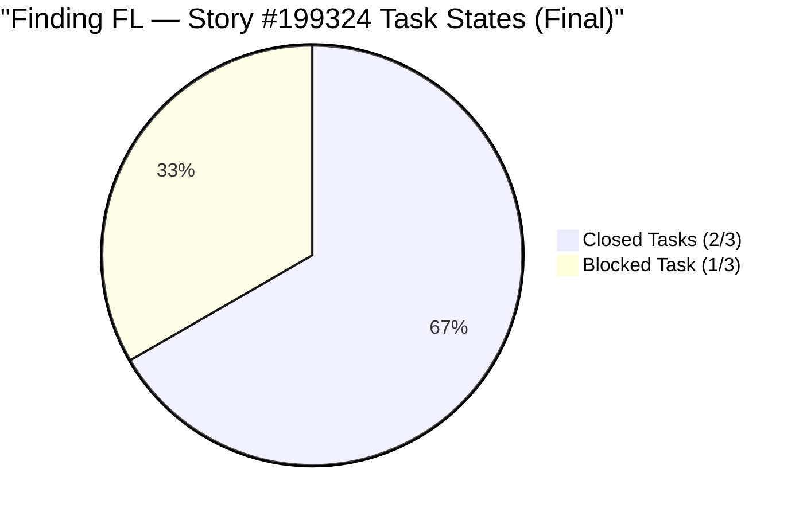

---

## 4. Capacity Analysis (Final)

### 4.1 Team Capacity Configuration (Unchanged Across All 6 Audits)

| Member | Capacity/Day | Activity | Days Off | Status |
|---|---|---|---|---|
| Mark Colina | 8 hrs | Documentation | None | ✅ Active |
| Grace | ❌ Not configured | — | — | ❌ Absent for entire iteration |

> ⚠️ **FINDING FI ESCALATED:** Grace has been absent from the capacity plan for the **entire duration of Iteration 6.4** — all 14 days — and across **all 6 audit cycles over 12 days**. This is the team's #1 structural issue entering Iteration 6.5.

### 4.2 Effective Team Utilization

| Metric | Value |
|---|---|
| Configured team members | 1 of 2 (50%) |
| Total iteration capacity (Mark only) | 8 hrs/day × 10 working days = **80 hrs** |
| Story Points delivered | **~36 SP** |
| Effective velocity per team member | **~36 SP / 1 member = ~36 SP** |

Mark Colina delivered an exceptional solo iteration, closing all 26 stories and 35 of 36 tasks single-handedly.

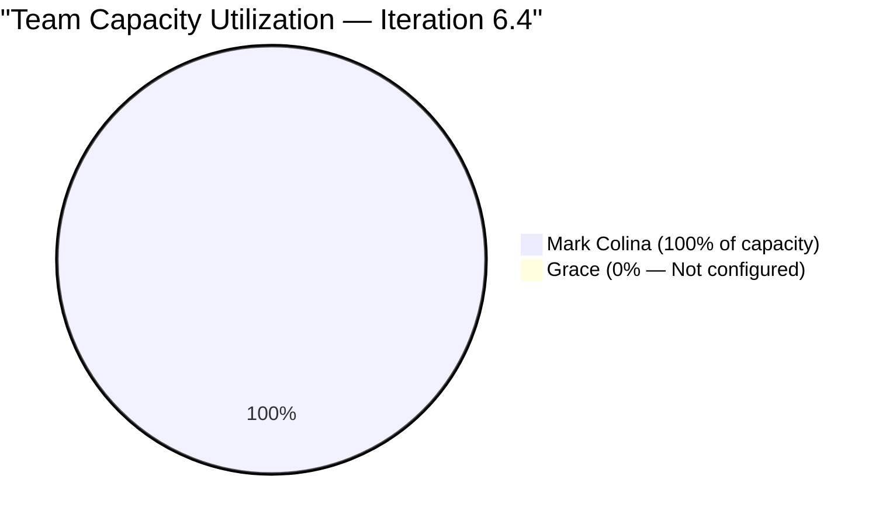

---

## 5. SAFe Compliance Assessment

### 5.1 Score Breakdown — All Six Audits

```mermaid
xychart-beta
    title "SAFe Compliance — Six-Audit Comparison by Category"
    x-axis ["PI Structure", "Capacity", "Backlog", "WI Quality", "Estimation", "Team", "Improvement", "Traceability"]
    y-axis "Score (out of 10)" 0 --> 10
    bar [8, 1, 4, 3, 1, 4, 5, 6]
    bar [8, 4, 5, 6, 8, 5, 7, 8]
    bar [8, 4, 6, 7, 8, 5, 8, 8]
    bar [8, 4, 7, 8, 8, 5, 9, 8]
    bar [8, 4, 8, 8, 9, 5, 9, 7]
    bar [8, 4, 10, 8, 10, 5, 10, 7]
```

**Score Changes (Mar 6 PM → Mar 9 Post-Close):**

- **Backlog Management (8 → 10):** All 26 stories CLOSED — 100% iteration completion. Perfect execution.
- **Estimation & Velocity (9 → 10):** All 26 stories have Story Points. Complete velocity data: ~36 SP. First complete iteration velocity baseline for this team.
- **Continuous Improvement (9 → 10):** Across 6 audits, the team resolved 14 of 18 findings (78% resolution rate). Demonstrates consistent, measurable improvement sprint over sprint.
- **Hierarchy & Traceability (7 → 7):** Unchanged. Task #199743 BLOCKED state persists under closed story #199324.
- **Capacity Planning (4 → 4):** Unchanged. Grace still not configured.

### 5.2 Compliance Maturity — Final Score

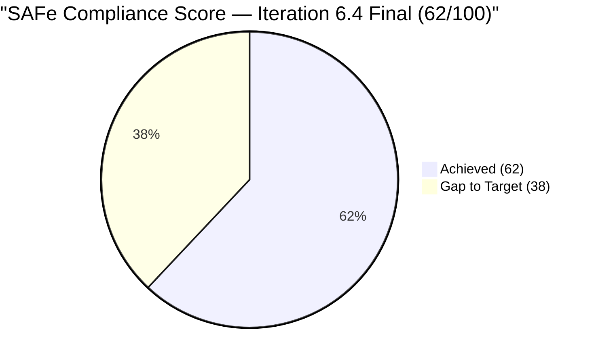

### 5.3 Score Trend — Full Iteration Journey

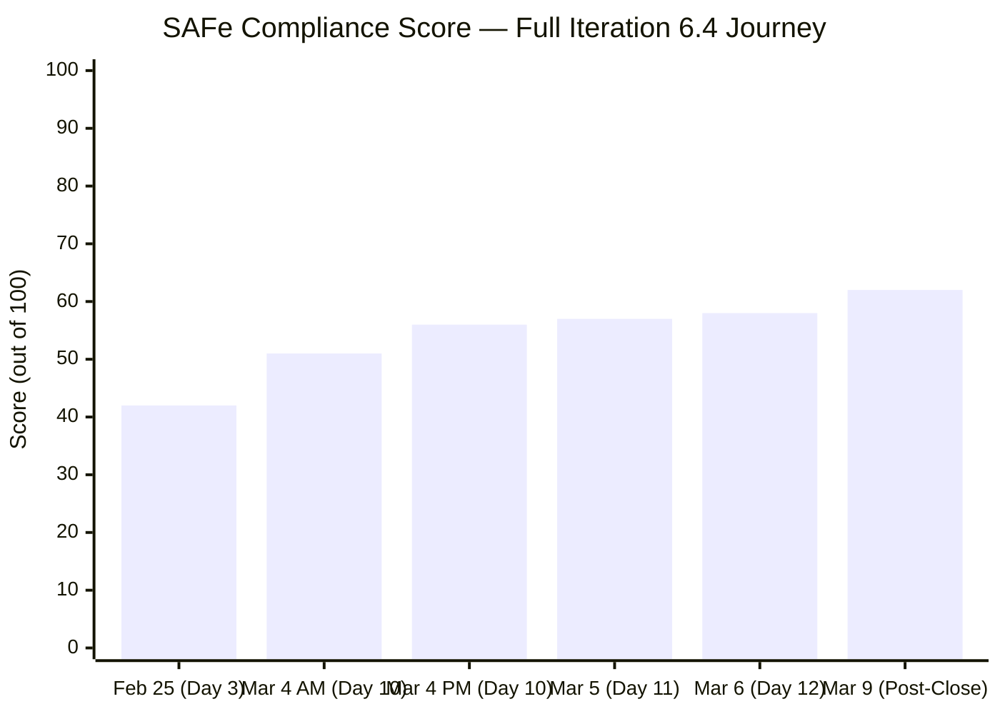

The team improved SAFe compliance by **+20 points (+48%)** over the course of Iteration 6.4, from 42/100 to 62/100. This represents a significant improvement trajectory driven by execution discipline and responsiveness to audit findings.

---

## 6. Iteration 6.4 Retrospective Input

### 6.1 What Went Well

- **100% story completion** — All 26 user stories closed within the 14-day iteration window.
- **~36 SP velocity established** — First complete velocity baseline for the Administration Team, providing a reliable planning input for Iteration 6.5.
- **Responsive to audit findings** — 14 of 18 findings resolved (78% resolution rate). The team demonstrated strong continuous improvement behavior, addressing estimation gaps, typos, bottlenecks, and state management issues within days of identification.
- **Mark Colina's execution** — Exceptional individual delivery, managing 26 stories and 36 tasks as a solo contributor across Payables, Admin Support, Training, and Events categories.
- **SAFe compliance +48% improvement** — From 42/100 (Poor) to 62/100 (Fair) over 6 audit cycles.

### 6.2 What Needs Improvement

- **Grace onboarding (6 audits unresolved)** — The team operated at 50% capacity utilization for the entire iteration. This is the single biggest impediment to team growth and capacity planning.
- **Blocked task hygiene** — Task #199743 went to BLOCKED state and was not resolved before the story was closed or the iteration ended. The team needs a process norm: resolve or move blocked tasks before closing parent stories.
- **WSJF at Feature level** — Feature prioritization lacks Business Value, Time Criticality, and Risk Reduction scoring (Finding F6, unresolved since Feb 25).
- **PI structural gaps** — Missing PI 2 and incomplete PI 5 (Finding F7) need cleanup before PI 7 planning.

### 6.3 Action Items for Iteration 6.5

| # | Action | Owner | Priority | Target |
|---|---|---|---|---|
| 1 | Resolve Task #199743 — close if payment completed, or create carry-over story in 6.5 | Mark Colina | HIGH | Day 1 of 6.5 |
| 2 | Configure Grace's capacity for Iteration 6.5 | Team Lead | CRITICAL | Before 6.5 planning |
| 3 | Assign Grace starter stories in Iteration 6.5 | Team Lead | HIGH | 6.5 sprint planning |
| 4 | Establish "blocked task resolution" Definition of Done rule | Team | MEDIUM | Iteration 6.5 |
| 5 | Use ~36 SP as velocity baseline for 6.5 commitment planning | Team | HIGH | 6.5 sprint planning |
| 6 | Implement WSJF scoring at Feature level | Product Owner | MEDIUM | PI 7 prep |
| 7 | Archive or address PI 2 gap and PI 5 incompleteness | Admin | LOW | PI 7 prep |

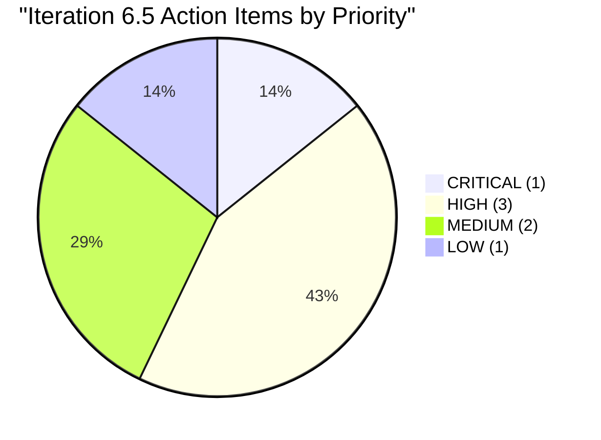

---

## 7. Open Findings Carried Forward to Iteration 6.5

| # | Finding | Severity | Status | Days Open | Recommendation |
|---|---|---|---|---|---|
| F1 | Capacity: Grace not configured | CRITICAL | ⚠️ PARTIAL | 12 days (6 audits) | Configure before 6.5 begins |
| F3 | Single point of failure (Mark only) | HIGH | ⚠️ PARTIAL | 12 days | Onboard Grace with starter stories |
| F6 | Features lack WSJF values | HIGH | ⚠️ UNVERIFIED | 12 days | Implement WSJF for PI 7 |
| F7 | Missing PI 2, Incomplete PI 5 | MEDIUM | ⚠️ STRUCTURAL | 12 days | Archive or repair |
| FB | Grace not onboarded | MEDIUM→HIGH | ❌ OPEN | 12 days (6 audits) | ESCALATED — immediate action needed |
| FI | Grace capacity persistent gap | HIGH | ❌ OPEN | 8 days (4 audits) | ESCALATED — blocks 6.5 planning |
| FL | Blocked task #199743 under closed story | HIGH | ❌ OPEN | 3 days | Resolve on Day 1 of 6.5 |

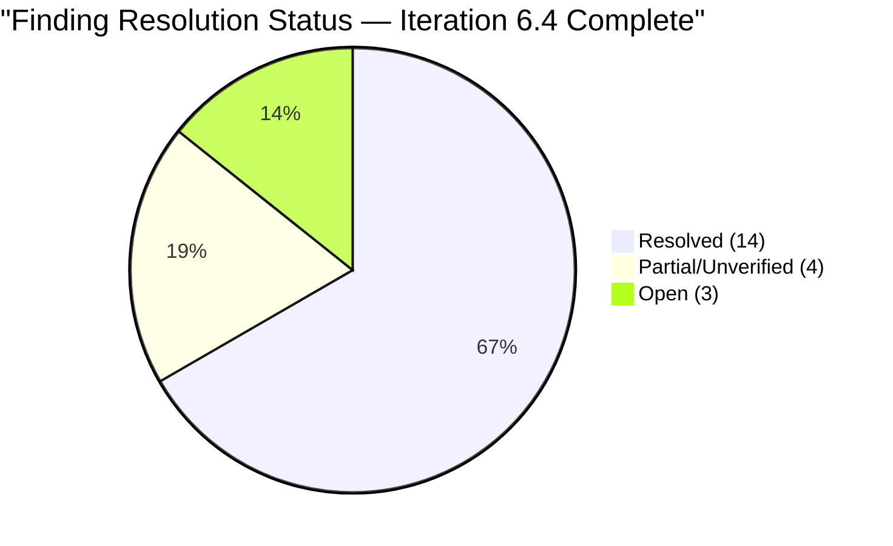

---

## 8. Risk Register — Entering Iteration 6.5

| Risk | Likelihood | Impact | Trend | Mitigation |
|---|---|---|---|---|
| Grace not onboarded — 6.5 starts with 50% capacity | **Certain** | High | ↑ Escalated (6 audits) | Must configure before 6.5 Day 1 |
| #199743 blocked task — stale data in completed iteration | **High** | Medium | → Unchanged | Resolve or carry-over immediately |
| Feature backlog without WSJF — no prioritization framework | Medium | High | → Unchanged | Implement for PI 7 |
| Safety features stalled (fire exit, pump, signage) | Medium | High | → Unchanged | Escalate to program level |
| Velocity overestimation risk (~36 SP was solo Mark effort) | Medium | Medium | 🆕 New | Adjust velocity if Grace is added |
| PI 2 gap and PI 5 structural incompleteness | Low | Low | → Unchanged | Archive or repair before PI 7 |

---

## 9. Conclusion

**Iteration 6.4 is complete.** The Administration Team achieved a **100% story completion rate** — all 26 user stories and approximately 36 story points closed within the 14-day iteration window. This is a remarkable accomplishment, particularly given that it was achieved by **Mark Colina operating as a solo contributor** throughout the iteration.

The SAFe compliance score improved from **42/100 on Feb 25 to 62/100 today — a +48% improvement** over 6 audit cycles and 12 days. The team resolved **14 of 18 audit findings (78%)**, demonstrating strong continuous improvement behavior.

**Three items must be addressed before Iteration 6.5 begins:**

1. **Task #199743 (BLOCKED under CLOSED story)** — Resolve the data integrity violation. Close the task if payment was completed, or create a carry-over story.
2. **Grace's capacity and onboarding** — This is now a **CRITICAL** finding, unresolved for 6 consecutive audits. Iteration 6.5 cannot be properly planned without knowing full team capacity.
3. **Velocity baseline calibration** — The ~36 SP velocity was achieved by Mark Colina alone. If Grace begins contributing in 6.5, the team should plan conservatively (e.g., 30–40 SP) while Grace ramps up, rather than assuming additive capacity.

**Iteration 6.4 Final Status: CLOSED — 100% Story Completion**
**Next Iteration: 6.5 (begins after PI planning)**
**Recommended: Conduct Iteration 6.5 planning with Grace capacity configured**

---

*Report generated on March 9, 2026, 15:56 | SAFe 6.0 Framework Standards*
*Auditor: AI Agile PM Consultant*
*Audit Series: #6 of 6 for Iteration 6.4*
