	type# SAFe Audit Report — Administration Team Board
## Jairosoft FINOPS Azure DevOps Project

**Audit Date:** March 9, 2026 — Iteration 6.5 Pre-Start (Day 0)
**Auditor:** AI Agile PM Consultant
**Framework:** Scaled Agile Framework (SAFe) 6.0
**Current PI:** PI 6 (2026)
**Iteration Audited:** Iteration 6.5 (Mar 10 – Mar 22, 2026) — PRE-START
**Board URL:** [Administration Team Board](https://dev.azure.com/jairo/Jairosoft%20FINOPS/_boards/board/t/Administration%20Team/Stories%20and%20Deliverables)
**Previous Audits:** Feb 25 | Mar 4 (AM) | Mar 4 (PM) | Mar 5 (AM) | Mar 6 (PM) | Mar 9 (Post-Close 6.4)
**Audit Series:** #7 (1st for Iteration 6.5)

---

## 1. Executive Summary

This is the **first audit of Iteration 6.5**, conducted on the day before the iteration officially begins (March 10, 2026). The purpose is to assess sprint readiness, validate that prior audit findings were addressed during the transition between iterations, and establish the Iteration 6.5 baseline.

**Iteration 6.5 at a Glance:**

| Metric | Value |
|---|---|
| Duration | March 10 – March 22, 2026 (10 working days) |
| User Stories | 14 |
| Tasks | 29 |
| Total Story Points | **29 SP** |
| Active Stories (pre-start) | 3 (21%) |
| New Stories | 11 (79%) |
| Team Members Configured | 1 of 2 (Mark Colina only) |
| Carry-Over Items from 6.4 | 2 (Story #199324, Task #199743) |

**Key Observations:**

1. **Velocity rightsized.** The team committed 29 SP — down from ~36 SP in Iteration 6.4. Given Mark's reduced daily capacity (6.5 hrs vs. 8 hrs, an 18.75% reduction), this 19.4% reduction in SP is well-calibrated.

2. **Estimation maturity at planning.** All 14 stories have story points assigned before the iteration begins. In 6.4, estimation was 0% at the first audit on Day 3. This is a major improvement.

3. **Grace capacity still not configured.** This finding has now persisted across **7 consecutive audits** spanning 12+ days. It is the team's most critical structural issue.

4. **Carry-over story #199324 linked to CLOSED Feature.** Story #199324 (Professional fee payment) was carried over from 6.4 but remains parented to Feature #199319 (Payables for Iteration 6.4), which is now **CLOSED**. This is a new hierarchy integrity issue.

5. **3 stories already Active before the iteration starts.** Stories #200289, #200321, and #200322 are in Active state on Day 0, suggesting work began before the sprint boundary — a SAFe iteration commitment practice concern.

**Overall SAFe Compliance Score: 54/100 — Fair** *(baseline for Iteration 6.5)*

| Category | 6.4 Baseline (Feb 25) | 6.4 Final (Mar 9) | **6.5 Baseline (Mar 9)** | Change vs. 6.4 Baseline | Rating |
|---|---|---|---|---|---|
| PI & Iteration Structure | 8/10 | 8/10 | **8/10** | → | Good |
| Capacity Planning | 1/10 | 4/10 | **5/10** | ↑ +4 | Fair |
| Backlog Management | 4/10 | 10/10 | **8/10** | ↑ +4 | Good |
| Work Item Quality | 3/10 | 8/10 | **7/10** | ↑ +4 | Good |
| Estimation & Velocity | 1/10 | 10/10 | **8/10** | ↑ +7 | Good |
| Team Structure & Collaboration | 4/10 | 5/10 | **5/10** | ↑ +1 | Fair |
| Continuous Improvement | 5/10 | 10/10 | **7/10** | ↑ +2 | Good |
| Hierarchy & Traceability | 6/10 | 7/10 | **6/10** | → | Fair |

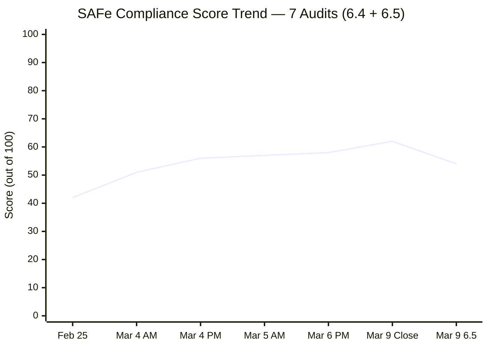

> **Note:** The score drop from 62 to 54 reflects the natural reset at the start of a new iteration — categories like Backlog Management and Continuous Improvement are re-evaluated against the new iteration's context rather than the completed 6.4 iteration.

---

## 2. Cross-Iteration Pattern Analysis — Learnings from 6.4

### 2.1 Velocity Trend

| Iteration | Stories | Story Points | Capacity (hrs/day) | Days Off | Completion |
|---|---|---|---|---|---|
| 6.4 (Final) | 26 | ~36 SP | 8.0 (Mark only) | 0 | **100% (26/26)** |
| 6.5 (Planned) | 14 | 29 SP | 6.5 (Mark only) | 1 (Mar 16) | TBD |
| **Change** | **-46%** | **-19%** | **-18.75%** | **+1 day** | — |

```mermaid
xychart-beta
    title "Iteration Comparison — 6.4 vs 6.5 Planning"
    x-axis ["Stories", "Story Points", "Tasks", "Capacity hrs/day"]
    y-axis "Count" 0 --> 40
    bar [26, 36, 36, 8]
    bar [14, 29, 29, 6.5]
```

**Analysis:** The 46% reduction in story count with only 19% reduction in SP means the team is planning **larger stories on average** in 6.5 (2.07 SP/story vs. 1.38 SP/story in 6.4). This represents more complex work items, which may impact throughput predictability.

### 2.2 Story Size Distribution — 6.4 vs 6.5

**Iteration 6.4 (26 stories):**
- 1 SP: 18 stories (69%)
- 2 SP: 3 stories (12%)
- 3 SP: 3 stories (12%)
- 4 SP: 1 story (4%)
- Average: 1.38 SP/story

**Iteration 6.5 (14 stories):**
- 1 SP: 6 stories (43%)
- 2 SP: 2 stories (14%)
- 3 SP: 4 stories (29%)
- 4 SP: 1 story (7%)
- Unassigned: 1 story (7%) — #199324 has 3 SP
- Average: 2.07 SP/story

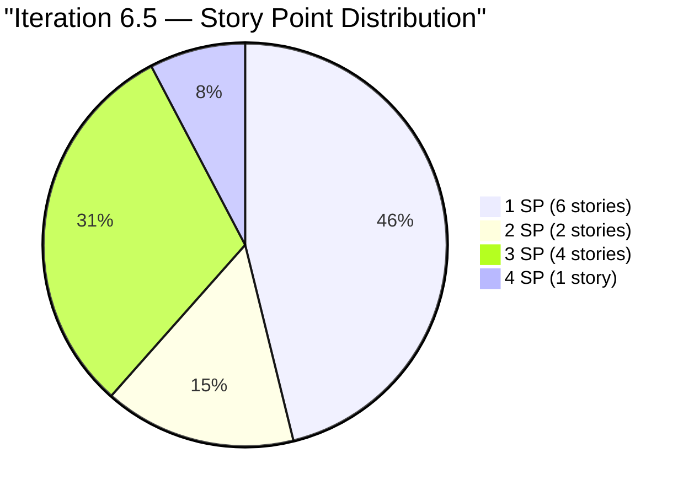

### 2.3 Capacity Planning Evolution

| Metric | 6.4 | 6.5 | Improvement |
|---|---|---|---|
| Mark hrs/day | 8.0 | 6.5 | More realistic |
| Activity Types | 1 (Documentation) | 3 (Deployment, Documentation, Requirements) | ✅ Better SAFe alignment |
| Days Off Planned | 0 | 1 (Mar 16) | ✅ Realistic planning |
| Grace Configured | ❌ No | ❌ No | ❌ No change |
| Total Capacity | 80 hrs (10 days × 8) | 58.5 hrs (9 days × 6.5) | -26.9% |

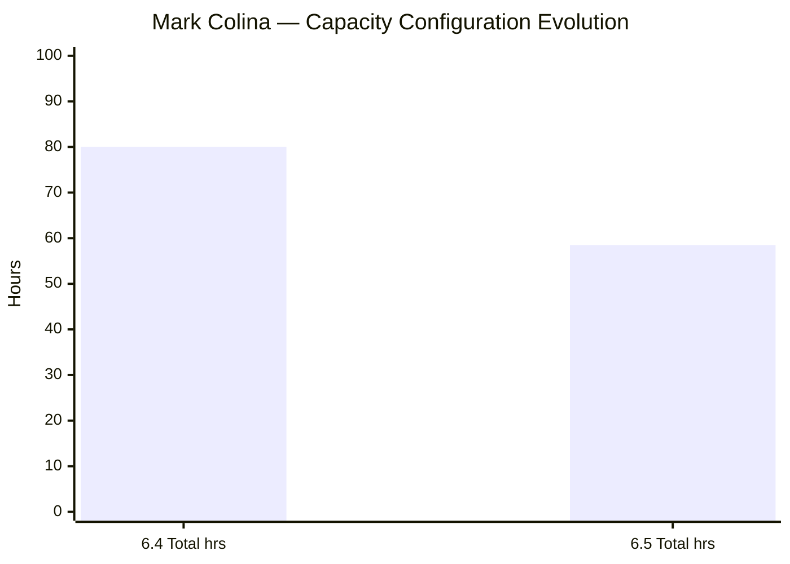

**Key Learning:** The restructured capacity with 3 activity types (Deployment 0.5 hrs, Documentation 3.5 hrs, Requirements 2.5 hrs) is a significant maturation step. SAFe recommends activity-based capacity to enable more granular planning and workload balancing.

### 2.4 Finding Resolution Across Iterations

Across 6 audits of Iteration 6.4, 18 findings were tracked:

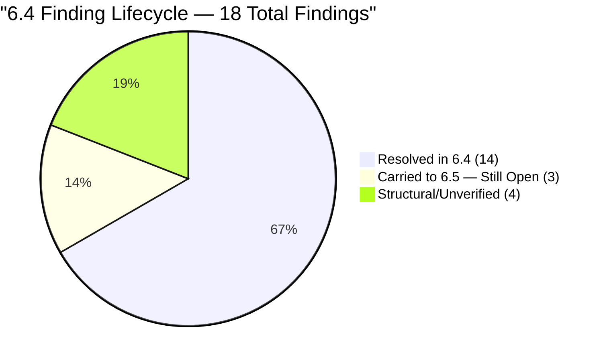

**Persistent Findings (7+ audits):**
- **F1/FB/FI — Grace capacity/onboarding:** 7 audits, 12+ days. CRITICAL.
- **F6 — WSJF at Feature level:** 7 audits. HIGH. No progress.
- **F7 — PI 2 gap, PI 5 incomplete:** 7 audits. MEDIUM. Structural.

**Positive Resolution Patterns:**
- Typos: Average 1.5 audits to resolution (fast turnaround)
- Estimation gaps: Average 3 audits to resolution (systematic improvement)
- State management: Average 1 audit to resolution (immediate action)
- Bottleneck resolution (#199334): 1 audit overnight (exceptional responsiveness)

### 2.5 Work Category Analysis

**Iteration 6.5 Work Breakdown by Category:**

| Category | Stories | SP | % of SP | Tasks |
|---|---|---|---|---|
| Payables (routinary) | 7 | 17 | 59% | 18 |
| Admin Support Services | 4 | 4 | 14% | 4 |
| CADAC Training | 2 | 6 | 21% | 2 |
| Ceiling Repair (on-going) | 1 | 2 | 7% | 2 |
| **Total** | **14** | **29** | **100%** | **26** |

> Note: 3 additional tasks (199743, 200614, 200483) bring total tasks to 29.

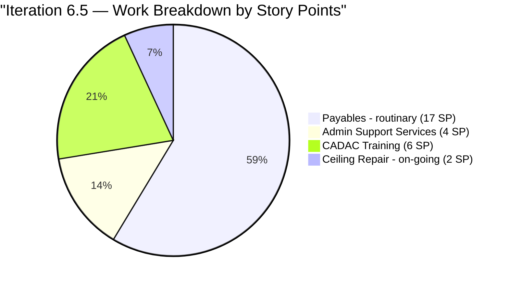

**Trend:** Payables continue to dominate (59% of SP in 6.5 vs. ~50% in 6.4). CADAC training is a new category consuming 21% of SP (6 SP across 2 days).

---

## 3. Iteration 6.5 Sprint Readiness Assessment

### 3.1 Complete Story Inventory

| ID | Title | SP | State | Parent Feature | Tasks | Tags |
|---|---|---|---|---|---|---|
| 196725 | Participate in CADAC training (Day 1) | 3 | New | #196719 CADAC training 2026 | 1 | CADAC |
| 199466 | Participate in CADAC training (Day 2) | 3 | New | #196719 CADAC training 2026 | 1 | CADAC |
| 200306 | Government payables | 4 | New | #200287 Payables 6.5 | 8 | routinary |
| 199324 | Professional fee payment | 3 | New | #199319 Payables 6.4 ⚠️ CLOSED | 1 | — |
| 200293 | Electricity for Davao and Cebu payables | 3 | New | #200287 Payables 6.5 | 4 | routinary |
| 200301 | Internet for Cebu and Davao payables | 3 | New | #200287 Payables 6.5 | 4 | routinary |
| 200298 | Condominium Cebu payables | 2 | New | #200287 Payables 6.5 | 2 | routinary |
| 200322 | Repairing the ceiling rust 3rd/2nd floor (Joniel) | 2 | **Active** | #196416 Repair ceiling rust | 2 | on-going |
| 200289 | Toyota Hilux - Cebu | 1 | **Active** | #200287 Payables 6.5 | 1 | routinary |
| 200291 | Food allowance Jairosoft - Feb. 16-27 | 1 | New | #200287 Payables 6.5 | 1 | routinary |
| 200321 | DOLE WAIR report | 1 | **Active** | #200288 Admin Support 6.5 | 1 | Admin Support |
| 200315 | 2nd batch SO certificate (TESDA) | 1 | New | #200288 Admin Support 6.5 | 1 | Admin Support |
| 200482 | JIT contract notary | 1 | New | #200288 Admin Support 6.5 | 1 | Admin Support |
| 200613 | BFP certification renewal follow up | 1 | New | #200588 BFP renewal 2026 | 1 | Admin Support |

### 3.2 Task Inventory (29 Tasks)

| Task ID | Title | State | Parent Story |
|---|---|---|---|
| 199736 | Participate in CADAC training (Day 1) | New | #196725 |
| 199760 | Participate in CADAC training (Day 2) | New | #199466 |
| 200307 | SSS Jairosoft Employee loans payment | New | #200306 |
| 200308 | Jairosoft Pag-IBIG Contributions payment | New | #200306 |
| 200309 | JIT Pag-IBIG Contributions payment | New | #200306 |
| 200310 | Jairosoft Pag-IBIG Employee Loans | New | #200306 |
| 200311 | Pag-IBIG Housing loan payment | New | #200306 |
| 200312 | Pag ibig BOD Contributions payment | New | #200306 |
| 200313 | PHIC JIT monthly contribution payment | New | #200306 |
| 200314 | PHIC Jairosoft monthly contribution payment | New | #200306 |
| 199743 | Dr. Karl Nazanzien Chavez fee payment at PNB | New | #199324 |
| 200290 | Toyota Hilux - Cebu payment at BPI Bank | **Active** | #200289 |
| 200292 | Food allowance Jairosoft - Feb. 16-27 payment at PNB | New | #200291 |
| 200299 | Azalea Condo Dues payment at Union Bank | New | #200298 |
| 200300 | Galleria Condo Dues payment at Union Bank | New | #200298 |
| 200324 | DOLE WAIR report submission | **Active** | #200321 |
| 200325 | Pick up 2nd batch SO certificate at (TESDA) | New | #200315 |
| 200294 | VECO - Meridian payment at PNB | New | #200293 |
| 200295 | VECO - Robinsons Galleria payment | New | #200293 |
| 200296 | VECO - Azalea payment | New | #200293 |
| 200297 | DLPC - Davao Light payment | New | #200293 |
| 200302 | Globe Telecom - Recruitment payment | New | #200301 |
| 200303 | Innove Communications Inc. - Globe Robinsons payment | New | #200301 |
| 200304 | Converge Davao office payment | New | #200301 |
| 200305 | Smart - Mam Kriss payment | New | #200301 |
| 200778 | Implementation of repairing the ceiling rust 3rd floor (Day 2) | **Active** | #200322 |
| 200779 | Implementation of repairing the ceiling rust 2nd floor (Day 3) | New | #200322 |
| 200483 | Notary of JIT contract at Davao City Hall | New | #200482 |
| 200614 | Go to BFP Cabantian follow up certification for 2026 | New | #200613 |

**Task State Summary:**
- New: 26 (90%)
- Active: 3 (10%)
- Blocked: 0
- Closed: 0

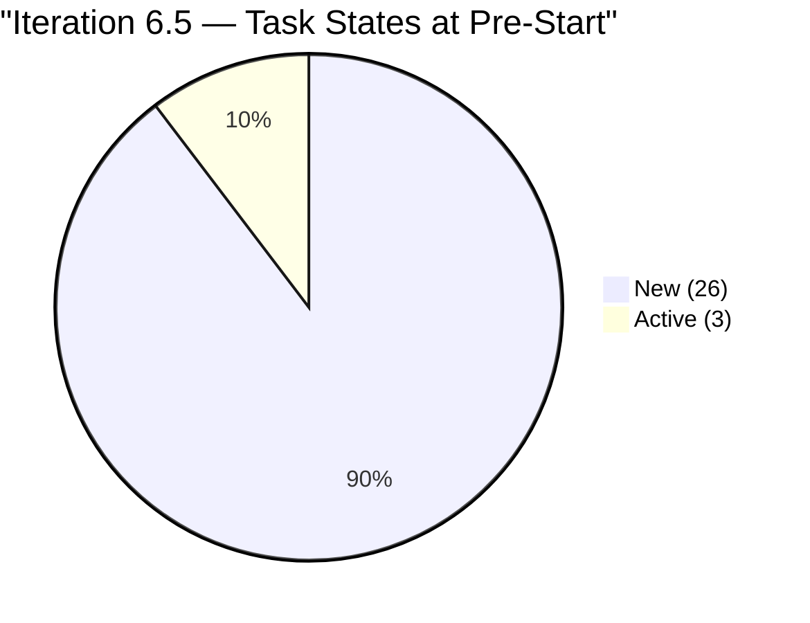

### 3.3 Feature Traceability

| Feature ID | Title | State | BV | Stories in 6.5 | SP |
|---|---|---|---|---|---|
| 200287 | Payables for Iteration 6.5 March 10-22, 2026 | Active | 10 | 6 | 14 |
| 200288 | PI6 Iteration 6.5 Admin Support Services | Active | 10 | 3 | 3 |
| 196719 | CADAC training 2026 | Active | 10 | 2 | 6 |
| 196416 | Repair ceiling rust third floor Davao office | Active | 8 | 1 | 2 |
| 200588 | BFP renewal certification 2026 | **New** | 5 | 1 | 1 |
| 199319 | Payables for Iteration 6.4 Feb. 23 - March 08, 2026 | **⚠️ CLOSED** | — | 1 (#199324) | 3 |

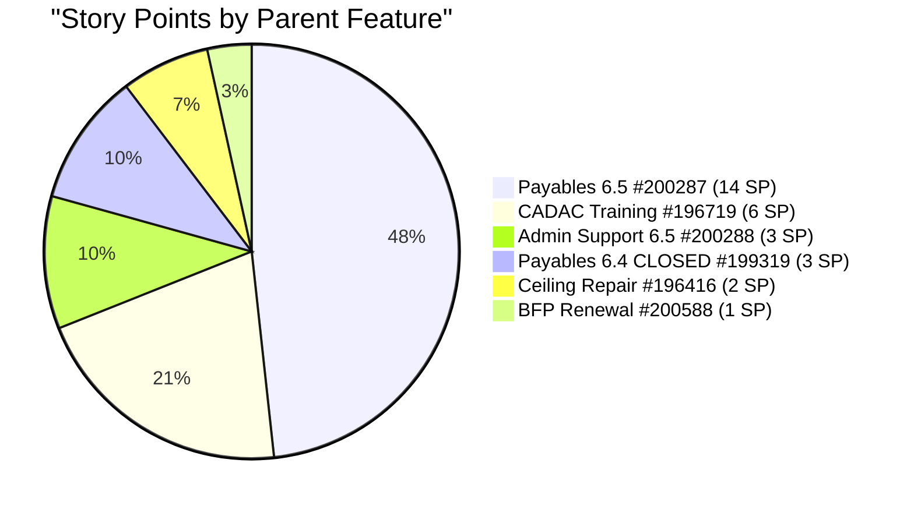

> ⚠️ **NEW FINDING (FN):** Story #199324 (3 SP) is parented to Feature #199319 (Payables for Iteration 6.4) which is **CLOSED**. This is a hierarchy integrity violation — active stories should not be children of closed features.

### 3.4 Acceptance Criteria Assessment

| Quality Check | Count | Percentage |
|---|---|---|
| Stories with Acceptance Criteria | **14/14** | **100%** |
| Stories with Story Points | **14/14** | **100%** |
| Stories with Descriptions | **14/14** | **100%** |
| Stories with Assigned Owner | **14/14** | **100%** |
| Stories with Tasks | **14/14** | **100%** |

**AC Quality Rating:**
- **Standard pattern (13 stories):** "Attached receipt" or "Attached photo" — minimal but consistent.
- **Enhanced pattern (1 story):** #200613 (BFP certification) has multi-line AC with 3 specific criteria: document submission, completion before expiration, and stakeholder updates. This is the **best AC quality observed in any story across the entire audit series**.

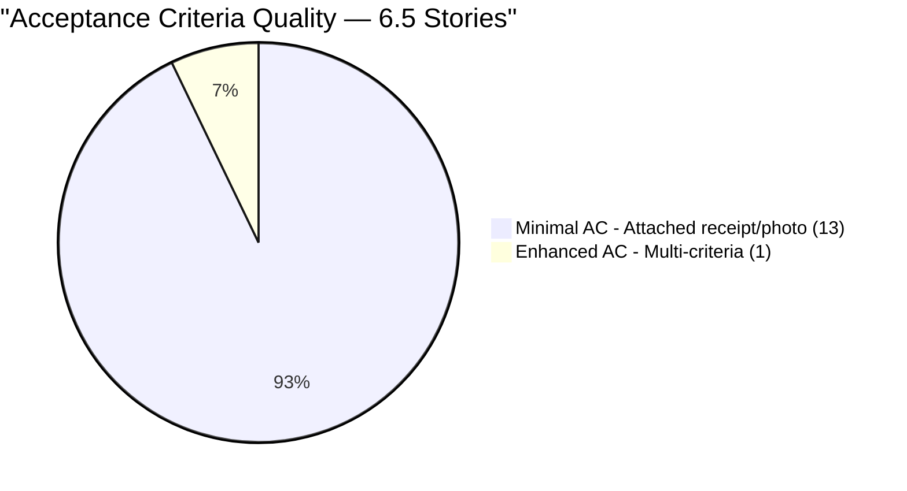

---

## 4. Previous Findings — Resolution Tracker (Cumulative)

| # | Finding | Severity | First Identified | Status at 6.4 Close | **Status at 6.5 Pre-Start** | Resolution |
|---|---|---|---|---|---|---|
| F1 | No Capacity Planning | CRITICAL | Feb 25 (Audit 1) | Mark only (Grace absent) | Mark reconfigured, **Grace still absent** | ⚠️ PARTIAL |
| F2 | No Story Point Estimation | CRITICAL | Feb 25 (Audit 1) | 26/26 estimated | **14/14 estimated at planning** | ✅ SUSTAINED |
| F3 | Single Point of Failure | HIGH | Feb 25 (Audit 1) | 1 active member | **1 active member** | ⚠️ PARTIAL |
| F4 | No Acceptance Criteria | HIGH | Feb 25 (Audit 1) | 26/26 with AC | **14/14 with AC at planning** | ✅ SUSTAINED |
| F5 | Typos in work items | MEDIUM | Feb 25 (Audit 1) | All corrected | ⚠️ See Finding FO | ⚠️ REGRESSION |
| F6 | Features lack WSJF values | HIGH | Feb 25 (Audit 1) | Unverified | **4/6 features have BV** | ⚠️ PARTIAL PROGRESS |
| F7 | Missing PI 2, Incomplete PI 5 | MEDIUM | Feb 25 (Audit 1) | Unchanged | **Unchanged** | ⚠️ STRUCTURAL |
| F8 | Stories stuck in "New" state | MEDIUM | Feb 25 (Audit 1) | 0% New at close | 79% New (expected Day 0) | ✅ N/A (iteration start) |
| F9 | Insufficient task decomposition | MEDIUM | Feb 25 (Audit 1) | 36 tasks for 26 stories | **29 tasks for 14 stories** | ✅ SUSTAINED |
| FB | Grace not onboarded | HIGH | Mar 4 AM (Audit 2) | Unchanged (6 audits) | **Unchanged (7 audits)** | ❌ OPEN — ESCALATED |
| FI | Grace capacity persistent gap | HIGH | Mar 5 AM (Audit 4) | Unchanged (4 audits) | **Unchanged (5 audits)** | ❌ OPEN — ESCALATED |
| FL | Blocked task under closed story | HIGH | Mar 6 PM (Audit 5) | BLOCKED (#199743) | **Reset to New** | ✅ RESOLVED |

### 4.1 Key Changes Since 6.4 Post-Close Audit

- ✅ **Finding FL RESOLVED.** Task #199743 (Dr. Chavez PNB payment) was reset from BLOCKED to **New** state. Story #199324 was also reset from Closed to **New** and carried into Iteration 6.5.
- ✅ **Estimation at planning.** All 14 stories have story points before the iteration begins — a significant process improvement vs. 6.4 where 0/21 stories had SP at the first audit.
- ✅ **Capacity detail improved.** Mark's capacity now uses 3 activity types (Deployment, Documentation, Requirements) instead of 1, with a realistic 6.5 hrs/day and 1 planned day off.
- ⚠️ **Grace still not configured.** 7th consecutive audit without Grace's capacity.
- 🆕 **NEW Finding FN.** Story #199324 is parented to CLOSED Feature #199319.
- 🆕 **NEW Finding FO.** Story #199324 description still contains "Prosessional" typo (first identified in Feb 25 as F5b, marked resolved in Mar 4 PM — but the carry-over brought it back).
- 🆕 **NEW Finding FP.** 3 stories already Active before iteration officially starts (Mar 10).
- ⚠️ **Feature #200588 (BFP renewal) in New state** — should be Active for an in-progress iteration.

---

## 5. New Findings — Iteration 6.5

### Finding FN (HIGH) — Active Story Under Closed Feature

| Item | Details |
|---|---|
| Story | #199324 — Professional fee payment (3 SP) |
| Story State | New |
| Parent Feature | #199319 — Payables for Iteration 6.4 Feb. 23 - March 08, 2026 |
| Feature State | **CLOSED** |
| Impact | Hierarchy integrity violation; story won't appear in 6.5 feature-level views |
| Recommendation | Re-parent #199324 to Feature #200287 (Payables for Iteration 6.5) |

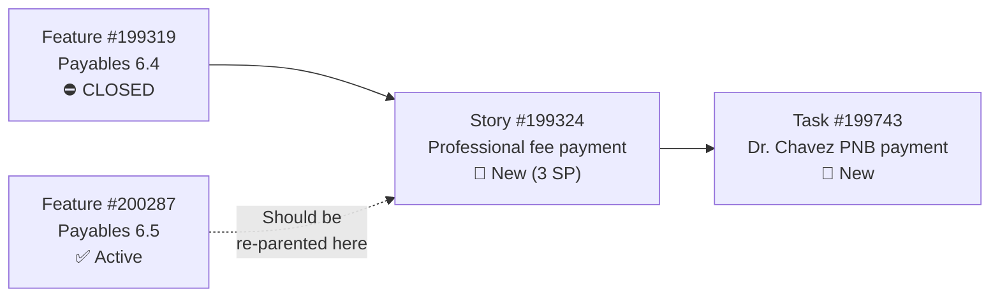

### Finding FO (LOW) — Recurring Typo in Carry-Over Story

| Item | Details |
|---|---|
| Story | #199324 — Professional fee payment |
| Issue | Description contains "Prosessional" instead of "Professional" |
| History | First identified Feb 25 (F5b), title corrected Mar 4 PM, but description was never fixed |
| Impact | Low — cosmetic, but represents incomplete fix from prior iteration |
| Recommendation | Correct description text to match title |

### Finding FP (MEDIUM) — Pre-Start Active Stories

| Story ID | Title | SP | Why Active |
|---|---|---|---|
| 200289 | Toyota Hilux - Cebu | 1 | Task #200290 already Active |
| 200321 | DOLE WAIR report | 1 | Task #200324 already Active |
| 200322 | Repairing the ceiling rust (Joniel) | 2 | Task #200778 already Active |

**Total:** 3 stories (4 SP, 14% of committed SP) are Active before the iteration's March 10 start date.

**Analysis:** In SAFe, work should begin at the iteration start — not before. Starting work before sprint commitment can indicate scope leakage from the prior iteration or informal work outside sprint boundaries. However, for continuity items like ceiling repair (#200322, an ongoing multi-iteration effort), pre-start activity may be justified.

**Recommendation:** Establish a team norm: stories should transition to Active only after the iteration officially starts, except for formally designated carry-over work.

### Finding FQ (LOW) — Feature #200588 in New State

| Item | Details |
|---|---|
| Feature | #200588 — BFP renewal certification 2026 |
| Feature State | **New** |
| Child Story | #200613 — BFP certification renewal follow up (1 SP, New) |
| Impact | New features with committed stories should be Active |
| Recommendation | Transition Feature #200588 to Active |

---

## 6. Capacity Analysis

### 6.1 Team Capacity Configuration

| Member | Capacity/Day | Activities | Days Off | Status |
|---|---|---|---|---|
| Mark Colina | **6.5 hrs** | Deployment (0.5), Documentation (3.5), Requirements (2.5) | Mar 16 (1 day) | ✅ Configured |
| Grace | ❌ Not configured | — | — | ❌ Absent (7 audits) |

### 6.2 Effective Capacity Calculation

| Metric | Value |
|---|---|
| Working days in iteration | 10 (Mar 10-22, minus weekends) |
| Mark's working days | 9 (10 minus 1 day off on Mar 16) |
| Mark's daily capacity | 6.5 hrs |
| **Mark's total capacity** | **58.5 hrs** |
| Grace's capacity | **0 hrs** (not configured) |
| **Team total capacity** | **58.5 hrs** |

### 6.3 Capacity vs. Commitment Analysis

| Metric | Value |
|---|---|
| Committed SP | 29 |
| Available capacity | 58.5 hrs |
| **Hrs per Story Point** | **2.02 hrs/SP** |
| 6.4 benchmark (80 hrs / 36 SP) | 2.22 hrs/SP |
| **Capacity utilization risk** | ⚠️ Tighter than 6.4 |

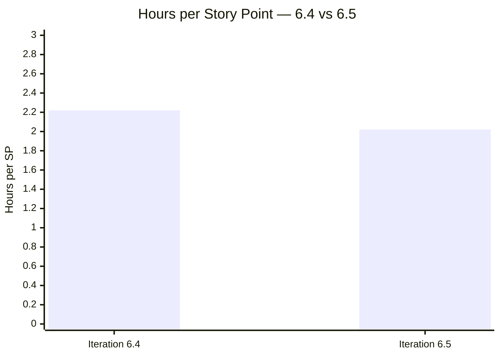

> The 6.5 plan allocates **2.02 hrs/SP** compared to **2.22 hrs/SP** in 6.4 — a 9% tighter budget. If 6.4's velocity was at full stretch, 6.5 may face completion pressure. Monitor closely.

---

## 7. SAFe Compliance Assessment — Iteration 6.5 Baseline

### 7.1 Category Scoring

**1. PI & Iteration Structure — 8/10 (→ unchanged)**
- PI 6 iteration cadence maintained (6.1 through 6.6 including IP sprint)
- Iteration 6.5 properly defined with dates and team assignment
- Deductions: PI 2 gap (F7) and PI 5 structural issues persist

**2. Capacity Planning — 5/10 (↑ from 4/10)**
- Mark's capacity properly configured with 3 activity types (improvement)
- 1 day off correctly planned (improvement)
- Grace still not configured (7 consecutive audits)
- +1 for activity-based capacity maturation

**3. Backlog Management — 8/10 (new baseline)**
- All 14 stories properly queued with tasks
- 29 tasks provide adequate decomposition (2.07 tasks/story average)
- Carry-over items identified and re-queued
- Deductions: 3 pre-start Active stories, #199324 hierarchy issue

**4. Work Item Quality — 7/10 (new baseline)**
- 14/14 stories have descriptions, AC, assignments, and SP
- 1 story (#200613) has enhanced multi-criteria AC
- Deductions: "Prosessional" typo recurrence in #199324, repetitive AC pattern ("Attached receipt/photo" for 13/14 stories)

**5. Estimation & Velocity — 8/10 (new baseline)**
- 100% SP coverage at planning (vs. 0% at 6.4 Day 3)
- Velocity rightsized: 29 SP vs. 36 SP (capacity-proportional)
- 6.4 velocity baseline available: ~36 SP
- Deductions: No WSJF scores for prioritization, tight hrs/SP ratio

**6. Team Structure & Collaboration — 5/10 (→ unchanged)**
- Mark remains sole active contributor
- Grace listed but not configured or contributing
- No cross-functional collaboration visible
- Single point of failure risk persists

**7. Continuous Improvement — 7/10 (new baseline)**
- Estimation at planning (lesson from 6.4 applied)
- Capacity restructured with activities (SAFe maturation)
- Carry-over items properly managed
- Deductions: Grace gap unresolved despite 7 audits, WSJF still not implemented, 3 persistent findings

**8. Hierarchy & Traceability — 6/10 (new baseline)**
- 5/6 features properly configured with Active state and Business Value
- Deductions: #199324 under CLOSED feature (FN), Feature #200588 in New state (FQ), Feature #199319 WSJF not set

```mermaid
xychart-beta
    title "SAFe Compliance by Category — 6.4 Baseline vs 6.4 Final vs 6.5 Baseline"
    x-axis ["PI Structure", "Capacity", "Backlog", "WI Quality", "Estimation", "Team", "Improvement", "Traceability"]
    y-axis "Score (out of 10)" 0 --> 10
    bar [8, 1, 4, 3, 1, 4, 5, 6]
    bar [8, 4, 10, 8, 10, 5, 10, 7]
    bar [8, 5, 8, 7, 8, 5, 7, 6]
```

### 7.2 Score Comparison

| Comparison | Score | Context |
|---|---|---|
| 6.4 Baseline (Feb 25, Audit 1) | 42/100 | No SP, no AC, no capacity |
| 6.4 Final (Mar 9, Audit 6) | 62/100 | 100% completion, 14/18 findings resolved |
| **6.5 Baseline (Mar 9, Audit 7)** | **54/100** | Planning complete, persistent gaps remain |
| **Net improvement vs. 6.4 baseline** | **+12 points** | Learnings from 6.4 applied to 6.5 planning |

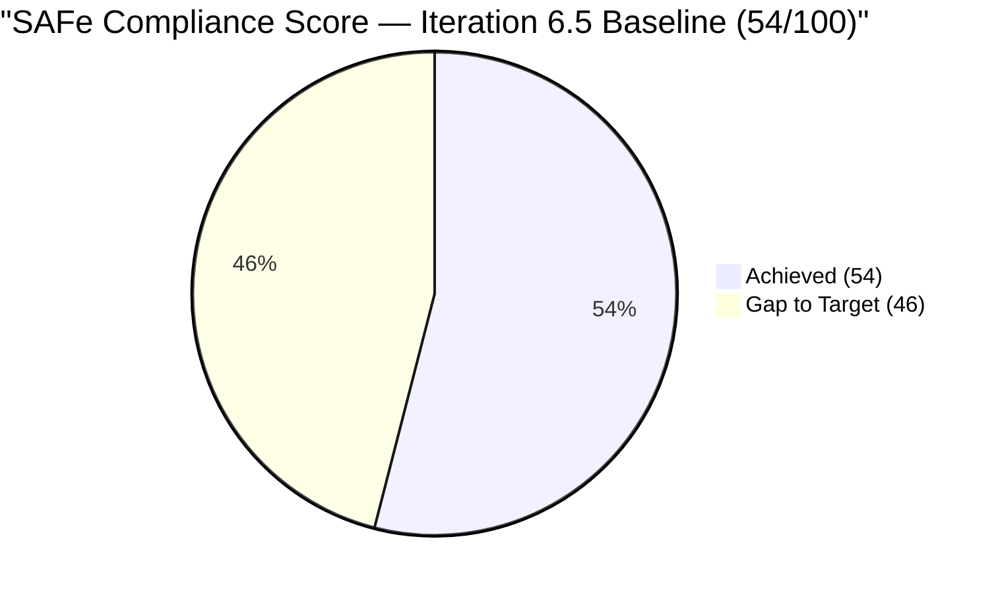

---

## 8. Risk Register — Iteration 6.5

| # | Risk | Likelihood | Impact | Trend | Mitigation |
|---|---|---|---|---|---|
| R1 | Grace not onboarded — 7th consecutive audit | **Certain** | High | ↑ Escalating | Must configure before 6.5 Day 2 |
| R2 | #199324 under CLOSED Feature — invisible to feature views | **Certain** | Medium | 🆕 New | Re-parent to Feature #200287 |
| R3 | Tight capacity (2.02 hrs/SP vs 2.22 in 6.4) | Medium | Medium | 🆕 New | Monitor burndown by Day 5 |
| R4 | 3 pre-start Active stories — scope leakage | Medium | Low | 🆕 New | Establish sprint boundary norms |
| R5 | Government payables (8 tasks, 4 SP) bottleneck potential | Medium | Medium | 🆕 New | Track daily; lesson from #199334 in 6.4 |
| R6 | Ceiling repair multi-iteration continuity risk | Medium | Medium | → Ongoing | Track independently from payables |
| R7 | Feature backlog without WSJF — no prioritization framework | Medium | High | → Persistent | Implement for PI 7 |
| R8 | PI 2 gap and PI 5 structural incompleteness | Low | Low | → Persistent | Archive or repair before PI 7 |

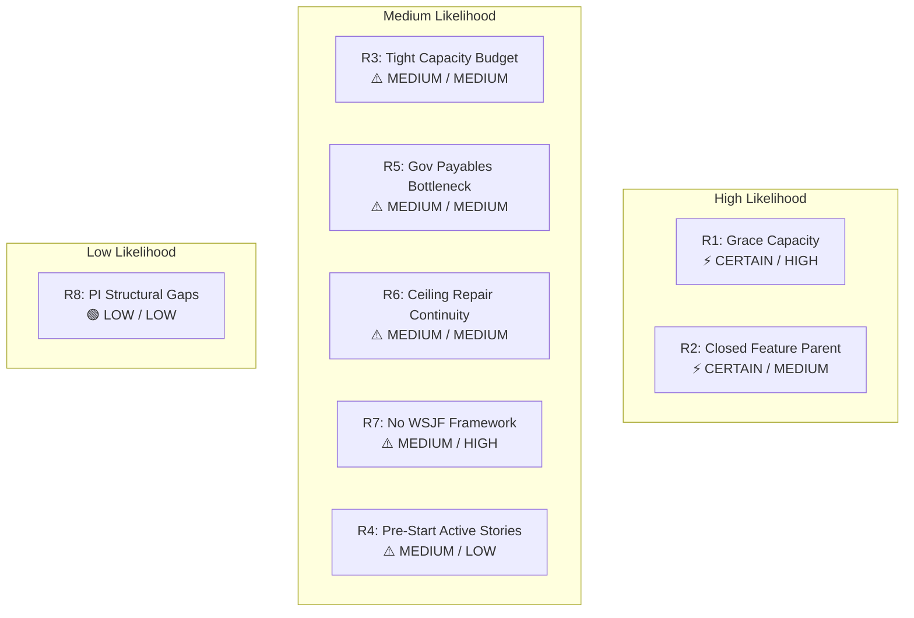

---

## 9. Action Items — Iteration 6.5 Day 1

| # | Action | Owner | Priority | Target |
|---|---|---|---|---|
| 1 | Configure Grace's capacity for Iteration 6.5 | Team Lead | **CRITICAL** | Day 1 |
| 2 | Re-parent Story #199324 from Feature #199319 (CLOSED) to #200287 (Active) | Mark Colina | **HIGH** | Day 1 |
| 3 | Fix "Prosessional" typo in Story #199324 description | Mark Colina | LOW | Day 1 |
| 4 | Transition Feature #200588 from New to Active | Mark Colina | LOW | Day 1 |
| 5 | Monitor Government payables (#200306, 8 tasks) for bottleneck potential | Mark Colina | MEDIUM | Daily |
| 6 | Establish sprint boundary norm — stories Active only after sprint start | Team | MEDIUM | Retrospective |
| 7 | Implement WSJF scoring at Feature level | Product Owner | MEDIUM | PI 7 prep |
| 8 | Archive or address PI 2 gap and PI 5 incompleteness | Admin | LOW | PI 7 prep |

---

## 10. Conclusion

**Iteration 6.5 is well-planned** compared to where Iteration 6.4 started. The team has demonstrably applied learnings from the 6.4 audit series: all 14 stories have story points and acceptance criteria at planning time (vs. 0% in 6.4), capacity is configured with realistic hours and activity types, velocity is appropriately rightsized, and carry-over items are addressed.

The committed 29 SP with 58.5 hours of capacity gives a tighter budget (2.02 hrs/SP) than 6.4's 2.22 hrs/SP, which warrants monitoring but is manageable if the team maintains the execution discipline demonstrated in 6.4.

**Three immediate actions are needed:**

1. **Grace's capacity** (CRITICAL, 7 audits unresolved) — The longest-standing finding in the audit series. Without Grace, the team operates at 50% staffing and carries a single-point-of-failure risk.

2. **Re-parent Story #199324** (HIGH) — The carry-over story from 6.4 is linked to a closed feature, creating a hierarchy violation that may impact reporting and traceability.

3. **Government payables monitoring** (MEDIUM) — With 8 tasks under a single 4 SP story, this mirrors the #199334 bottleneck pattern from 6.4 that required overnight resolution. Proactive daily tracking is recommended.

**Iteration 6.5 Pre-Start Status: READY — with 3 corrective actions required on Day 1**
**Next Audit: Recommended for March 12, 2026 (Day 3) to verify Day 1 actions and assess early progress**

---

*Report generated on March 9, 2026, 17:30 | SAFe 6.0 Framework Standards*
*Auditor: AI Agile PM Consultant*
*Audit Series: #7 — 1st audit for Iteration 6.5*
