# SAFe Audit Report — Administration Team Board
## Jairosoft FINOPS Azure DevOps Project

**Audit Date:** March 11, 2026 — Iteration 6.5 Day 2
**Auditor:** AI Agile PM Consultant
**Framework:** Scaled Agile Framework (SAFe) 6.0
**Current PI:** PI 6 (2026)
**Iteration Audited:** Iteration 6.5 (Mar 10 – Mar 22, 2026) — IN PROGRESS
**Board URL:** [Administration Team Board](https://dev.azure.com/jairo/Jairosoft%20FINOPS/_boards/board/t/Administration%20Team/Stories%20and%20Deliverables)
**Previous Audits:** Feb 25 | Mar 4 (AM) | Mar 4 (PM) | Mar 5 (AM) | Mar 6 (PM) | Mar 9 (Post-Close 6.4) | Mar 9 (6.5 Pre-Start)
**Audit Series:** #8 (2nd for Iteration 6.5)

---

## 1. Executive Summary

This is the **Day 2 audit of Iteration 6.5**, the first in-progress checkpoint since the pre-start baseline established on March 9. The iteration officially began on March 10, and this audit evaluates early execution, finding resolution, and identifies a notable milestone in team dynamics.

**Iteration 6.5 at a Glance — Day 2:**

| Metric | Pre-Start (Mar 9) | **Day 2 (Mar 11)** | Change |
|---|---|---|---|
| User Stories | 14 | **15** | +1 (scope change) |
| Total Story Points | 29 SP | **30 SP** | +1 SP |
| Closed Stories | 0 | **4 (26.7%)** | +4 |
| Closed Story Points | 0 | **5 SP (16.7%)** | +5 SP |
| Active Stories | 3 | **3 (20%)** | → (different stories) |
| New Stories | 11 | **8 (53.3%)** | -3 |
| Tasks | 29 | **30** | +1 |
| Tasks Closed | 0 | **5 (16.7%)** | +5 |

**Key Observations:**

1. **Grace is active in ADO.** Story #199324 (Professional fee) was activated **by Grace** (grace@jairosoft.com) on March 10. This is the **first Grace activity observed across all 8 audits** spanning 14+ days. While Grace's capacity is still not configured, this represents a breakthrough in team participation.

2. **Strong early execution.** 4 stories closed in the first 2 days (5 SP, 16.7% of total), including the multi-day ceiling repair story (#200322, 2 SP). At this pace, the team is tracking ahead of the 6.4 baseline where 5 stories (19%) were closed by Day 3.

3. **Mid-sprint scope change.** New Story #200867 (Exit/Entrance signage, 1 SP) was added on March 11, increasing the commitment from 29 SP to 30 SP. While small (+3.4%), this is the first mid-sprint scope addition observed in the audit series.

4. **Two findings resolved.** Finding FO (typo in #199324 description) and Finding FQ (Feature #200588 in New state) have both been addressed since the last audit.

5. **Feature #199319 reopened.** The previously CLOSED Payables 6.4 feature is now Active, partially addressing Finding FN — though Story #199324 should still be re-parented to the 6.5 Payables feature for proper iteration traceability.

**Overall SAFe Compliance Score: 56/100 — Fair** *(↑ +2 from 54/100 at 6.5 Pre-Start)*

| Category | 6.4 Baseline | 6.4 Final | 6.5 Pre-Start | **6.5 Day 2** | Change | Rating |
|---|---|---|---|---|---|---|
| PI & Iteration Structure | 8/10 | 8/10 | 8/10 | **8/10** | → | Good |
| Capacity Planning | 1/10 | 4/10 | 5/10 | **5/10** | → | Fair |
| Backlog Management | 4/10 | 10/10 | 8/10 | **7/10** | ↓ -1 | Good |
| Work Item Quality | 3/10 | 8/10 | 7/10 | **7/10** | → | Good |
| Estimation & Velocity | 1/10 | 10/10 | 8/10 | **8/10** | → | Good |
| Team Structure & Collaboration | 4/10 | 5/10 | 5/10 | **6/10** | ↑ +1 | Fair |
| Continuous Improvement | 5/10 | 10/10 | 7/10 | **8/10** | ↑ +1 | Good |
| Hierarchy & Traceability | 6/10 | 7/10 | 6/10 | **7/10** | ↑ +1 | Good |

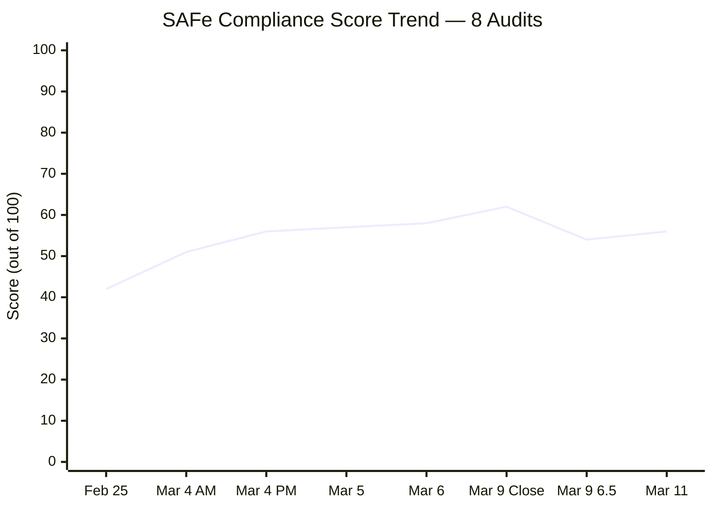

---

## 2. Changes Since Last Audit (Mar 9, Audit #7)

### 2.1 Stories Closed (4 stories, 5 SP)

| ID     | Title                                             | SP  | Parent Feature            | Closed Since |
| ------ | ------------------------------------------------- | --- | ------------------------- | ------------ |
| 200289 | Toyota Hilux - Cebu                               | 1   | #200287 Payables 6.5      | Pre-Start    |
| 200291 | Food allowance Jairosoft - Feb. 16-27             | 1   | #200287 Payables 6.5      | Pre-Start    |
| 200321 | DOLE WAIR report                                  | 1   | #200288 Admin Support 6.5 | Pre-Start    |
| 200322 | Repairing the ceiling rust 3rd/2nd floor (Joniel) | 2   | #196416 Ceiling Repair    | Pre-Start    |

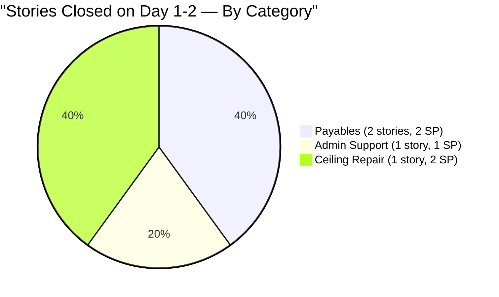

### 2.2 New Story Added — Scope Change

| Item | Details |
|---|---|
| Story ID | **#200867** |
| Title | Exit/Entrance signage |
| SP | 1 |
| State | Active |
| Parent Feature | #200288 — PI6 Iteration 6.5 Admin Support Services |
| Target Date | March 13, 2026 |
| Created | March 11, 2026, 02:05 UTC |
| Task | #200868 — Canvassing of Exit/Entrance signage (Active) |
| AC | "Attached photo of canvassed" |

**Analysis:** This story was created and immediately set to Active with a 2-day target window (Mar 11-13). It has proper structure: description, acceptance criteria, story points, assigned owner, and a child task. The scope impact is minimal (+1 SP, +3.4%), but mid-sprint additions should be tracked as they can indicate scope creep if the pattern persists.

### 2.3 Grace Activity — Milestone Event

| Event | Details |
|---|---|
| Action | Story #199324 activated |
| Activated By | **grace@jairosoft.com** |
| Date | March 10, 2026 |
| Significance | **First Grace activity in 8 audits (14+ days)** |

This is a significant positive signal. Grace has been absent from all work item activity since the audit series began on February 25. Her activation of Story #199324 suggests she is beginning to engage with the board, even though her capacity is not yet configured.

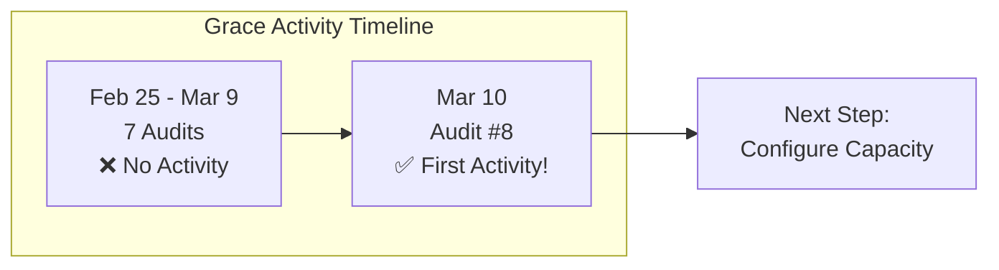

### 2.4 Story #199324 Updates

| Change | Before (Mar 9) | After (Mar 11) |
|---|---|---|
| Title | "Professional fee payment" | **"Professional fee"** |
| State | New | **Active** |
| Description | Contained "Prosessional" typo | **Fixed — proper text** |
| Activated By | — | **Grace (grace@jairosoft.com)** |
| Parent Feature #199319 | Closed | **Active (reopened)** |

### 2.5 Feature State Changes

| Feature ID | Title | Before (Mar 9) | After (Mar 11) | Impact |
|---|---|---|---|---|
| 199319 | Payables 6.4 | **Closed** | **Active** | Finding FN modified |
| 200588 | BFP renewal 2026 | **New** | **Active** | Finding FQ RESOLVED |
| 196416 | Ceiling Repair | Active | **Validation** | Feature progressing to completion |

---

## 3. Current Iteration Status — Complete Inventory

### 3.1 Story Inventory (15 Stories, 30 SP)

| ID | Title | SP | State | Parent Feature | Tasks | Tags |
|---|---|---|---|---|---|---|
| 200322 | Ceiling repair 3rd/2nd floor (Joniel) | 2 | ✅ Closed | #196416 Ceiling Repair | 2/2 Closed | on-going |
| 200289 | Toyota Hilux - Cebu | 1 | ✅ Closed | #200287 Payables 6.5 | 1/1 Closed | routinary |
| 200291 | Food allowance Feb. 16-27 | 1 | ✅ Closed | #200287 Payables 6.5 | 1/1 Closed | routinary |
| 200321 | DOLE WAIR report | 1 | ✅ Closed | #200288 Admin Support 6.5 | 1/1 Closed | Admin Support |
| 199324 | Professional fee | 3 | 🔵 Active | #199319 Payables 6.4 ⚠️ | 0/1 (New) | — |
| 200613 | BFP certification renewal follow up | 1 | 🔵 Active | #200588 BFP renewal | 0/1 (Active) | Admin Support |
| 200867 | Exit/Entrance signage | 1 | 🔵 Active | #200288 Admin Support 6.5 | 0/1 (Active) | — |
| 196725 | CADAC training (Day 1) | 3 | ⬜ New | #196719 CADAC 2026 | 0/1 (New) | CADAC |
| 199466 | CADAC training (Day 2) | 3 | ⬜ New | #196719 CADAC 2026 | 0/1 (New) | CADAC |
| 200306 | Government payables | 4 | ⬜ New | #200287 Payables 6.5 | 0/8 (New) | routinary |
| 200293 | Electricity Davao/Cebu payables | 3 | ⬜ New | #200287 Payables 6.5 | 0/4 (New) | routinary |
| 200301 | Internet Cebu/Davao payables | 3 | ⬜ New | #200287 Payables 6.5 | 0/4 (New) | routinary |
| 200298 | Condominium Cebu payables | 2 | ⬜ New | #200287 Payables 6.5 | 0/2 (New) | routinary |
| 200315 | 2nd batch SO certificate (TESDA) | 1 | ⬜ New | #200288 Admin Support 6.5 | 0/1 (New) | Admin Support |
| 200482 | JIT contract notary | 1 | ⬜ New | #200288 Admin Support 6.5 | 0/1 (New) | Admin Support |

### 3.2 Story State Summary

| State | Count | % | Story Points | % of SP |
|---|---|---|---|---|
| Closed | 4 | 26.7% | 5 | 16.7% |
| Active | 3 | 20.0% | 5 | 16.7% |
| New | 8 | 53.3% | 20 | 66.7% |
| **Total** | **15** | **100%** | **30** | **100%** |

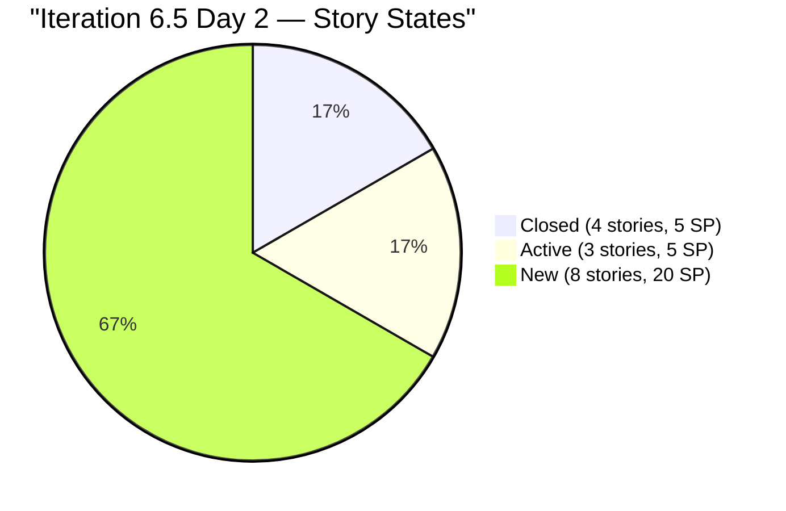

### 3.3 Task Summary (30 Tasks)

| State | Count | % |
|---|---|---|
| Closed | 5 | 16.7% |
| Active | 2 | 6.7% |
| New | 23 | 76.7% |
| **Total** | **30** | **100%** |

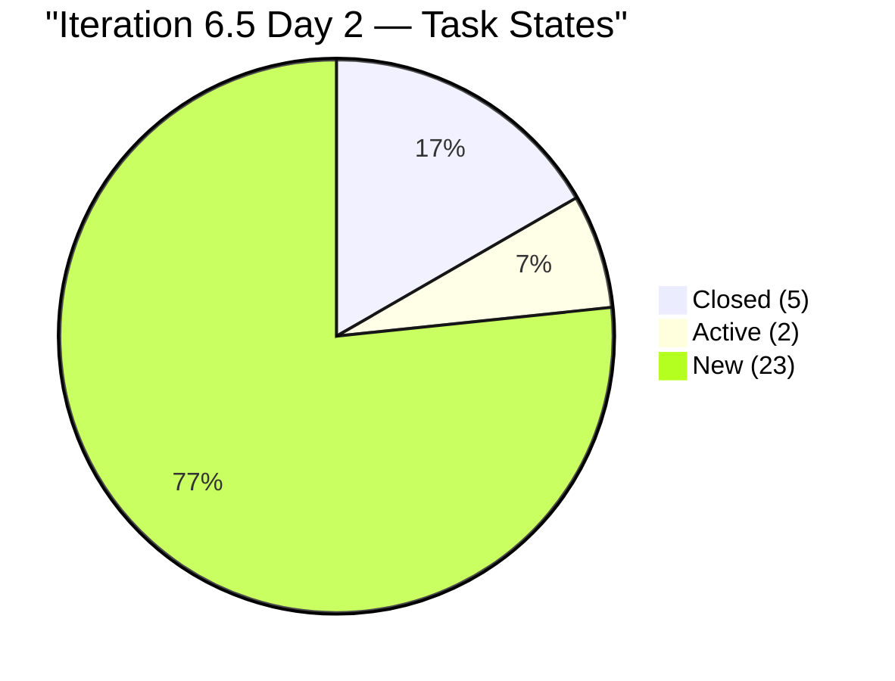

### 3.4 Burndown Projection

| Metric | Value |
|---|---|
| Total SP | 30 |
| Closed SP (Day 2) | 5 (16.7%) |
| Remaining SP | 25 |
| Working Days Remaining | 8 (of 10 total, minus 1 day off = 7 effective) |
| Required Velocity | 25 SP / 7 days = **3.57 SP/day** |
| Current Velocity (Day 1-2) | 5 SP / 2 days = **2.5 SP/day** |
| Projected Completion | ~22.5 SP at current pace (75% of commitment) |

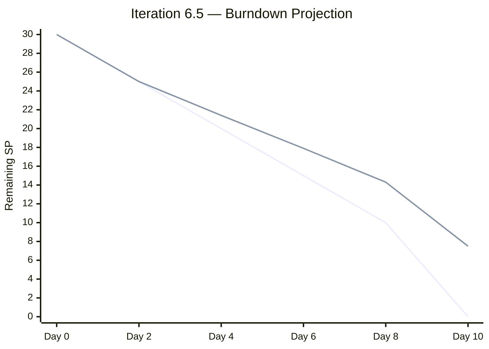

> **Note:** The ideal burndown (first line) vs. projected burndown (second line) shows a growing gap. The current velocity of 2.5 SP/day is below the required 3.57 SP/day. However, it is very early in the iteration — the larger stories (Government payables 4 SP, CADAC training 6 SP, Electricity/Internet 6 SP) will likely move in batches, creating step-function progress.

---

## 4. Feature Traceability

| Feature ID | Title | State | Stories in 6.5 | SP | Stories Closed |
|---|---|---|---|---|---|
| 200287 | Payables 6.5 | Active | 6 | 14 | 2 (2 SP) |
| 200288 | Admin Support 6.5 | Active | 4 (+1 new) | 4 (+1) | 1 (1 SP) |
| 196719 | CADAC training 2026 | Active | 2 | 6 | 0 |
| 199319 | Payables 6.4 ⚠️ Reopened | **Active** | 1 (#199324) | 3 | 0 |
| 196416 | Ceiling Repair | **Validation** | 1 | 2 | 1 (2 SP) ✅ |
| 200588 | BFP renewal 2026 | **Active** ✅ | 1 | 1 | 0 |

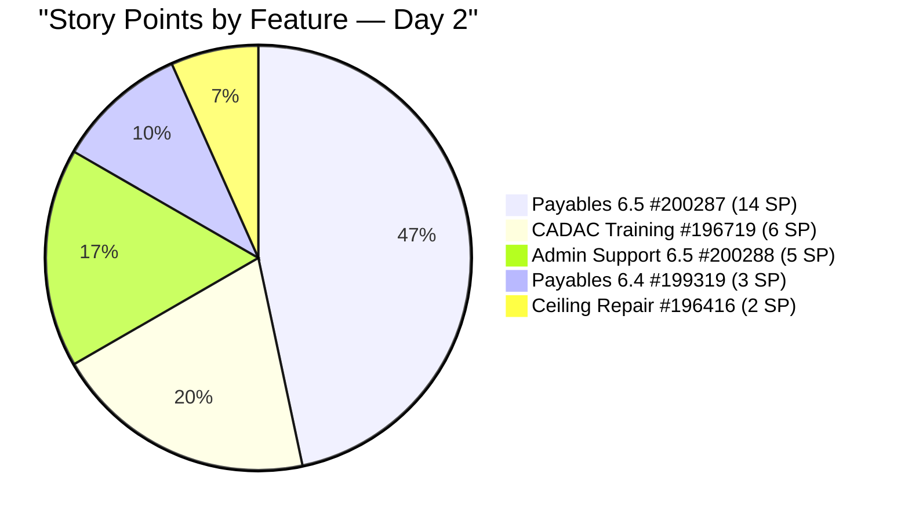

> **Note:** Feature #196416 (Ceiling Repair) has moved to **Validation** state with its sole 6.5 story closed. This represents the first feature-level completion in Iteration 6.5.

---

## 5. Previous Findings — Resolution Tracker

| # | Finding | Severity | First Identified | **Status (Mar 11)** | Resolution |
|---|---|---|---|---|---|
| F1 | No Capacity Planning | CRITICAL | Feb 25 | Mark configured, **Grace absent** | ⚠️ PARTIAL |
| F2 | No Story Point Estimation | CRITICAL | Feb 25 | **15/15 estimated** | ✅ SUSTAINED |
| F3 | Single Point of Failure | HIGH | Feb 25 | 1 active + **Grace showing activity** | ⚠️ IMPROVING |
| F4 | No Acceptance Criteria | HIGH | Feb 25 | **15/15 with AC** | ✅ SUSTAINED |
| F5 | Typos in work items | MEDIUM | Feb 25 | All corrected | ✅ SUSTAINED |
| F6 | Features lack WSJF values | HIGH | Feb 25 | 5/6 features have BV | ⚠️ PARTIAL |
| F7 | Missing PI 2, Incomplete PI 5 | MEDIUM | Feb 25 | Unchanged | ⚠️ STRUCTURAL |
| FB | Grace not onboarded | HIGH | Mar 4 | Grace active in board (**first time**) | ⚠️ IMPROVING |
| FI | Grace capacity persistent gap | HIGH | Mar 5 | **8 audits without capacity** | ❌ OPEN — ESCALATED |
| FN | Story under CLOSED Feature | HIGH | Mar 9 | Feature #199319 **reopened to Active** | ⚠️ MODIFIED |
| FO | Typo in #199324 description | LOW | Mar 9 | **Description corrected** | ✅ RESOLVED |
| FP | Pre-start Active stories | MEDIUM | Mar 9 | N/A — iteration now running | ✅ N/A |
| FQ | Feature #200588 in New state | LOW | Mar 9 | **Now Active** | ✅ RESOLVED |

### 5.1 Findings Resolved Since Last Audit

- ✅ **Finding FO RESOLVED.** Story #199324 description no longer contains "Prosessional" typo. The description has been completely rewritten with proper text.
- ✅ **Finding FQ RESOLVED.** Feature #200588 (BFP renewal certification 2026) is now in Active state.
- ⚠️ **Finding FN MODIFIED.** Feature #199319 (Payables 6.4) has been reopened from Closed to Active. While this addresses the "active story under closed feature" violation, the story is still parented to a prior iteration's feature rather than the current iteration's Payables feature (#200287).
- ⚠️ **Finding FB IMPROVING.** Grace activated Story #199324 on March 10 — her first board activity in the audit series. This is a positive step toward onboarding, though capacity configuration is still needed.

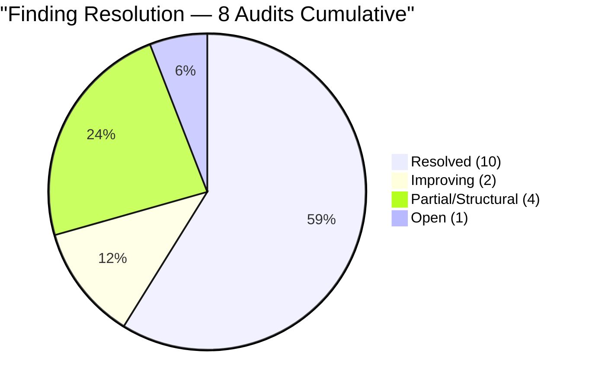

---

## 6. New Findings — Audit #8

### Finding FR (LOW) — Mid-Sprint Scope Addition

| Item | Details |
|---|---|
| Story | #200867 — Exit/Entrance signage (1 SP) |
| Added | March 11, 2026 (Day 2 of iteration) |
| Scope Impact | 29 SP → 30 SP (+3.4%) |
| Feature | #200288 — Admin Support 6.5 |
| Quality | Proper: description, AC, SP, task, assignee all present |
| Risk Level | LOW — minimal scope impact, well-formed story |

**SAFe Guidance:** In SAFe, iteration commitments should be stable once the iteration begins. Stories added mid-sprint should go through the team's change management process. While the impact here is minimal (1 SP), the pattern should be monitored. If scope additions accumulate, they can destabilize velocity predictability.

**Recommendation:** Track mid-sprint additions as a metric. If more than 10% of SP is added after iteration start, escalate to the Scrum Master.

### Finding FS (MEDIUM) — Story #199324 Still Under Wrong Feature

| Item | Details |
|---|---|
| Story | #199324 — Professional fee (3 SP, Active) |
| Current Parent | #199319 — Payables for Iteration **6.4** (Active) |
| Recommended Parent | #200287 — Payables for Iteration **6.5** (Active) |
| Impact | Iteration-level reporting may not correctly attribute this story's 3 SP to Iteration 6.5 feature work |
| Change from FN | Feature is no longer CLOSED (hierarchy violation resolved), but **iteration assignment is incorrect** |

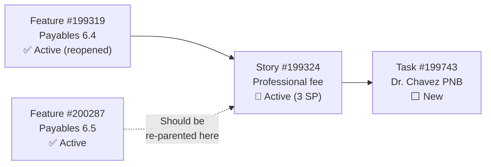

**Recommendation:** Re-parent #199324 to Feature #200287. Close Feature #199319 again once the story is moved — keeping a 6.4 feature open during 6.5 creates confusion in feature-level reporting.

---

## 7. Capacity Analysis

### 7.1 Team Capacity Configuration (Unchanged)

| Member | Capacity/Day | Activities | Days Off | Status |
|---|---|---|---|---|
| Mark Colina | 6.5 hrs | Deployment (0.5), Documentation (3.5), Requirements (2.5) | Mar 16 (1 day) | ✅ Configured |
| Grace | ❌ Not configured | — | — | ⚠️ Active in board but no capacity |

### 7.2 Capacity vs. Commitment

| Metric | Value |
|---|---|
| Total SP committed | 30 (+1 from scope change) |
| Available capacity | 58.5 hrs (Mark only) |
| **Hrs per Story Point** | **1.95 hrs/SP** |
| 6.5 Pre-Start benchmark | 2.02 hrs/SP (at 29 SP) |
| 6.4 benchmark | 2.22 hrs/SP |
| **Capacity pressure** | ⚠️ **Tightest in audit series** |

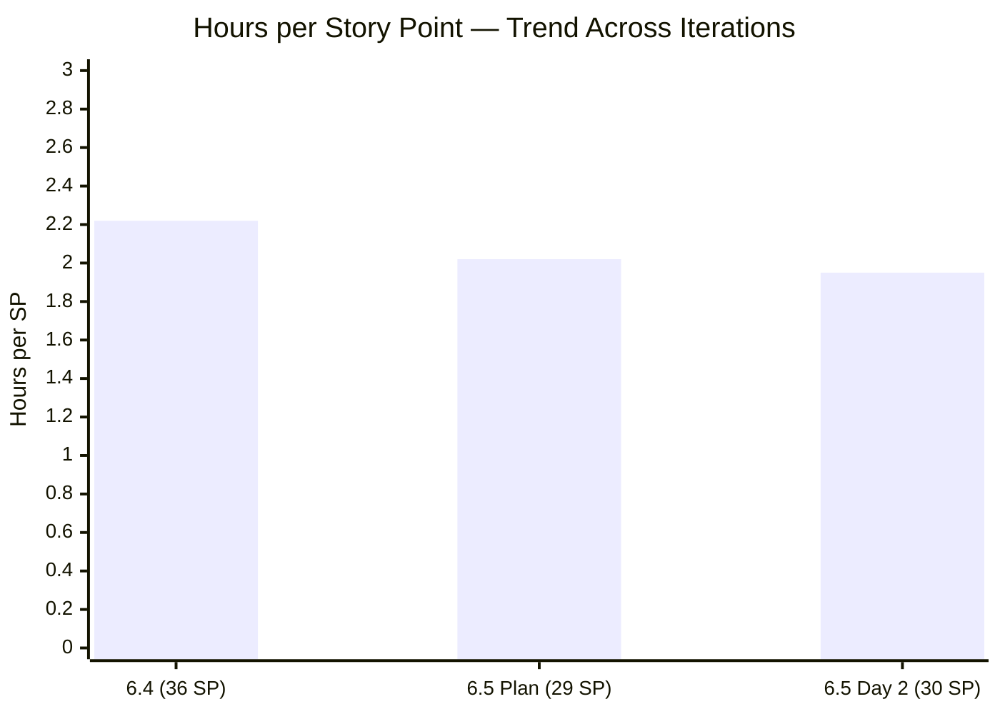

> The scope increase from 29 to 30 SP further tightens the capacity budget to **1.95 hrs/SP** — the tightest ratio observed in the audit series. If Grace begins contributing meaningful work, this pressure eases. Monitor closely.

---

## 8. Cross-Iteration Pattern Analysis

### 8.1 Early Execution Comparison — 6.4 vs 6.5

| Metric | 6.4 Day 3 (Feb 25) | **6.5 Day 2 (Mar 11)** | Comparison |
|---|---|---|---|
| Stories Closed | 5/21 (24%) | **4/15 (27%)** | ✅ Better pace |
| SP Closed | ~5/36 (14%) | **5/30 (17%)** | ✅ Better pace |
| Active Stories | 0 | **3** | ✅ Work in progress |
| Estimation Coverage | 0% | **100%** | ✅ Major improvement |
| Scope Changes | 0 | **1 story added** | ⚠️ New pattern |
| Grace Activity | None | **Yes — first time** | ✅ Breakthrough |

### 8.2 Finding Resolution Velocity

| Audit | New Findings | Resolved | Cumulative Open |
|---|---|---|---|
| #1 (Feb 25) | 9 | 0 | 9 |
| #2 (Mar 4 AM) | 5 | 3 | 11 |
| #3 (Mar 4 PM) | 2 | 3 | 10 |
| #4 (Mar 5) | 3 | 2 | 11 |
| #5 (Mar 6) | 2 | 2 | 11 |
| #6 (Mar 9 Close) | 0 | 5 | 6 |
| #7 (Mar 9 6.5) | 4 | 2 | 8 |
| **#8 (Mar 11)** | **2** | **2** | **8** |

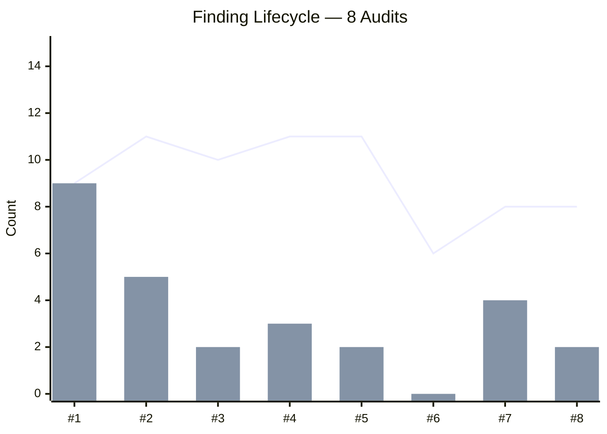

### 8.3 Work Category Breakdown — Day 2

| Category | Stories | SP | % of SP | Closed | Remaining SP |
|---|---|---|---|---|---|
| Payables (routinary) | 7 | 17 | 57% | 2 (2 SP) | 15 SP |
| Admin Support Services | 5 | 5 | 17% | 1 (1 SP) | 4 SP |
| CADAC Training | 2 | 6 | 20% | 0 | 6 SP |
| Ceiling Repair (on-going) | 1 | 2 | 7% | 1 (2 SP) ✅ | 0 SP |
| **Total** | **15** | **30** | **100%** | **4 (5 SP)** | **25 SP** |

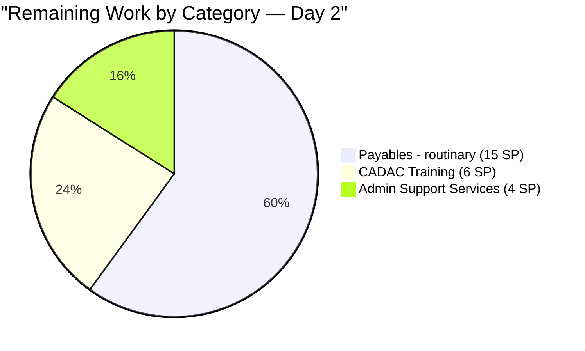

> **Ceiling Repair category is 100% complete** — the first category-level completion in 6.5. Payables remain the dominant workload at 57% of total SP.

---

## 9. SAFe Compliance Assessment — Day 2

### 9.1 Category Scoring

**1. PI & Iteration Structure — 8/10 (→ unchanged)**
- Iteration cadence maintained, dates properly defined
- Deductions: PI 2 gap and PI 5 structural issues persist

**2. Capacity Planning — 5/10 (→ unchanged)**
- Mark properly configured with 3 activity types and day off
- Grace still not configured despite showing board activity
- Deduction for 8th consecutive audit without Grace capacity

**3. Backlog Management — 7/10 (↓ -1 from 8)**
- Good execution: 4 stories closed, work flowing
- Mid-sprint scope addition (#200867) represents a backlog discipline concern
- Deduction for scope change after iteration commitment

**4. Work Item Quality — 7/10 (→ unchanged)**
- New story #200867 has proper AC, description, SP, and task
- #199324 description corrected (Finding FO resolved)
- Minimal AC pattern ("Attached receipt/photo") continues for most stories

**5. Estimation & Velocity — 8/10 (→ unchanged)**
- 15/15 stories have story points (including new addition)
- Velocity tracking: 5 SP / 2 days = 2.5 SP/day
- Tight capacity budget (1.95 hrs/SP)

**6. Team Structure & Collaboration — 6/10 (↑ +1)**
- **Grace activated a story** — first cross-team participation observed
- Mark remains primary contributor, but team is no longer purely solo
- +1 for demonstrated movement toward team collaboration

**7. Continuous Improvement — 8/10 (↑ +1)**
- Findings FO and FQ resolved since last audit
- Description quality improved (#199324 rewritten)
- Feature states corrected (#200588, #196416)
- +1 for sustained finding resolution velocity

**8. Hierarchy & Traceability — 7/10 (↑ +1)**
- Feature #200588 now Active (FQ resolved)
- Feature #196416 moved to Validation (progressing)
- Feature #199319 reopened (hierarchy violation partially addressed)
- Deduction: #199324 still under wrong iteration's feature

```mermaid
xychart-beta
    title "SAFe Compliance by Category — Key Milestones"
    x-axis ["PI Structure", "Capacity", "Backlog", "WI Quality", "Estimation", "Team", "Improvement", "Traceability"]
    y-axis "Score (out of 10)" 0 --> 10
    bar [8, 1, 4, 3, 1, 4, 5, 6]
    bar [8, 4, 10, 8, 10, 5, 10, 7]
    bar [8, 5, 8, 7, 8, 5, 7, 6]
    bar [8, 5, 7, 7, 8, 6, 8, 7]
```

### 9.2 Score Comparison

| Audit | Score | Context |
|---|---|---|
| 6.4 Baseline (Feb 25) | 42/100 | No SP, no AC, no capacity |
| 6.4 Final (Mar 9) | 62/100 | 100% completion |
| 6.5 Pre-Start (Mar 9) | 54/100 | New iteration reset |
| **6.5 Day 2 (Mar 11)** | **56/100** | Grace activity, 4 stories closed |
| **Trend** | **↑ +2** | Positive trajectory resumed |

---

## 10. Risk Register — Day 2 Update

| # | Risk | Likelihood | Impact | Trend | Mitigation |
|---|---|---|---|---|---|
| R1 | Grace capacity not configured — 8th audit | **Certain** | High | ⚠️ Improving (activity seen) | Configure immediately; Grace is now active |
| R2 | #199324 under wrong iteration feature | **Certain** | Medium | ⚠️ Modified from FN | Re-parent to #200287 |
| R3 | Tight capacity (1.95 hrs/SP) | Medium | Medium | ↑ Worsened (+1 SP scope) | Monitor burndown; Grace contribution could ease |
| R4 | Government payables (8 tasks, 4 SP) bottleneck | Medium | Medium | → Unchanged | All 8 tasks still New — track by Day 5 |
| R5 | Mid-sprint scope additions becoming pattern | Low | Medium | 🆕 New | Track; escalate if >10% SP added |
| R6 | Current velocity (2.5 SP/day) below required (3.57) | Medium | High | 🆕 New | Monitor; expect batch completions |
| R7 | Feature backlog without WSJF | Medium | High | → Persistent | Implement for PI 7 |
| R8 | PI 2 gap and PI 5 structural gaps | Low | Low | → Persistent | Archive before PI 7 |

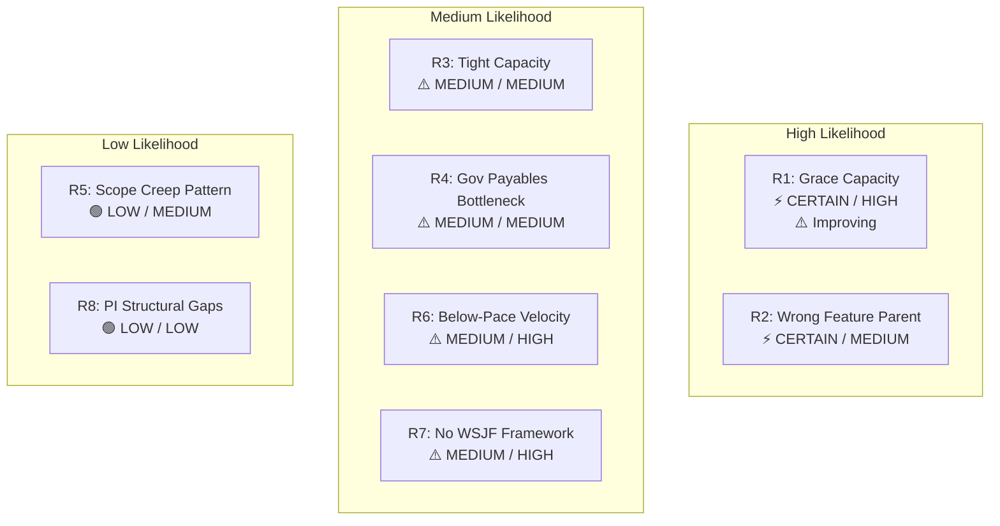

---

## 11. Action Items — Day 2

| # | Action | Owner | Priority | Target |
|---|---|---|---|---|
| 1 | Configure Grace's capacity for Iteration 6.5 | Team Lead | **CRITICAL** | Immediate |
| 2 | Re-parent Story #199324 from Feature #199319 to #200287 | Mark Colina | **HIGH** | Day 3 |
| 3 | Close Feature #199319 (Payables 6.4) after re-parenting | Mark Colina | MEDIUM | Day 3 |
| 4 | Monitor Government payables (#200306, 8 tasks) — all still New | Mark Colina | MEDIUM | By Day 5 |
| 5 | Track mid-sprint scope additions (1 so far: #200867) | Team | LOW | Ongoing |
| 6 | Implement WSJF scoring at Feature level | Product Owner | MEDIUM | PI 7 prep |

---

## 12. Conclusion

**Iteration 6.5 has started strong.** Four stories closed in the first two days (5 SP, 16.7%) puts the team ahead of the Day 3 pace from Iteration 6.4. The ceiling repair category is already 100% complete, and the DOLE WAIR report and early payables are done.

The most significant development in this audit is **Grace's first board activity** — activating Story #199324 on March 10. After 7 audits and 14 days of complete inactivity, this represents a genuine breakthrough toward resolving the longest-standing finding in the audit series. The immediate next step is to **configure Grace's capacity** to formalize her participation and enable proper workload planning.

**Three items need attention:**

1. **Grace's capacity** (CRITICAL, 8 audits) — Now urgent because Grace is actively participating. Configuring her capacity will improve the team's capacity budget and reduce the single-point-of-failure risk.

2. **Story #199324 re-parenting** (HIGH) — The feature is no longer closed, but the story still sits under Iteration 6.4's Payables feature. Move it to the 6.5 feature for proper traceability.

3. **Velocity monitoring** (MEDIUM) — Current pace (2.5 SP/day) is below the required 3.57 SP/day. The large remaining stories (Government payables 4 SP, CADAC 6 SP, Electricity/Internet 6 SP) will likely complete in batches. Check progress at Day 5.

**Iteration 6.5 Day 2 Status: ON TRACK — with corrective actions needed**
**Next Audit: Recommended for March 13, 2026 (Day 4) to assess mid-iteration progress**

---

*Report generated on March 11, 2026, 08:00 | SAFe 6.0 Framework Standards*
*Auditor: AI Agile PM Consultant*
*Audit Series: #8 — 2nd audit for Iteration 6.5*
