# SAFe Audit Report — Administration Team Board

## Jairosoft FINOPS Azure DevOps Project

**Audit Date:** March 12, 2026 — Iteration 6.5 Day 3
**Auditor:** AI Agile PM Consultant (Scheduled Task: admin-iteration-daily-audit)
**Framework:** Scaled Agile Framework (SAFe) 6.0
**Current PI:** PI 6 (2026)
**Iteration Audited:** Iteration 6.5 (Mar 10 – Mar 22, 2026) — IN PROGRESS
**Board URL:** [Administration Team Board](https://dev.azure.com/jairo/Jairosoft%20FINOPS/_boards/board/t/Administration%20Team/Stories%20and%20Deliverables)
**Previous Audits:** Feb 25 | Mar 4 AM | Mar 4 PM | Mar 5 | Mar 6 | Mar 9 (6.4 Close) | Mar 9 (6.5 Pre-Start) | Mar 11 (6.5 Day 2)
**Audit Series:** #9 (3rd for Iteration 6.5)

---

## 1. Executive Summary

This is the **Day 3 audit of Iteration 6.5**, conducted as part of the automated daily audit schedule. It follows Audit #8 (Mar 11, Day 2) and assesses execution progress, finding resolution velocity, and emerging risks at the mid-early stage of the iteration.

**Iteration 6.5 at a Glance — Day 3 vs. Day 2:**

| Metric              | Pre-Start (Mar 9) | Day 2 (Mar 11) | **Day 3 (Mar 12)** | Change            |
| ------------------- | ----------------- | -------------- | ------------------ | ----------------- |
| User Stories        | 14                | 15             | **15**             | →                 |
| Total Story Points  | 29 SP             | 30 SP          | **30 SP**          | →                 |
| Closed Stories      | 0                 | 4 (26.7%)      | **5 (33.3%)**      | ✅ +1              |
| Closed Story Points | 0 SP              | 5 SP (16.7%)   | **6 SP (20%)**     | ✅ +1 SP           |
| Active Stories      | 3                 | 3 (20%)        | **3 (20%)**        | → (different set) |
| New Stories         | 11                | 8 (53.3%)      | **7 (46.7%)**      | ✅ -1              |
| Tasks Total         | 29                | 30             | **30**             | →                 |
| Tasks Closed        | 0                 | 5 (16.7%)      | **6 (20%)**        | ✅ +1              |
| Tasks Active        | 3                 | 2 (6.7%)       | **4 (13.3%)**      | ✅ +2              |

**Key Observations:**

1. **Steady progress on Day 3.** Story #200867 (Exit/Entrance signage, 1 SP) was closed, bringing the closed count to 5 stories (6 SP, 20% of commitment). Task #200868 and Task #200779 were also closed, demonstrating clean story-to-task closure discipline.

2. **Electricity payables story activated.** Story #200293 (Electricity for Davao and Cebu, 3 SP) moved from New to Active, with Tasks #200294 (VECO Meridian) and #200295 (VECO Robinsons) becoming Active. Two of the four tasks remain New, suggesting partial execution underway.

3. **Velocity is below required pace.** At 2.0 SP/day (6 SP over 3 days), the team needs 4.0 SP/day for the remaining 6 effective working days. The mid-sprint large stories — Government payables (4 SP, all 8 tasks still New), CADAC training (6 SP), Internet (3 SP), Condominium (2 SP) — represent significant batch risk.

4. **Finding FS (re-parenting of #199324) remains unresolved.** The Day 2 action item targeted Day 3 for completion. Story #199324 and Task #199743 show Mar 12 activity timestamps, but the story remains under Feature #199319 (Payables 6.4) rather than the correct Feature #200287 (Payables 6.5). This is now approaching critical urgency.

5. **No new Grace activity observed.** After the Day 2 milestone (first observed Grace activity in 8 audits), there is no evidence of further engagement on Day 3. Capacity remains unconfigured.

6. **Government payables bottleneck risk growing.** Story #200306 (4 SP, 8 tasks) is now on Day 3 with zero task movement. By comparison, the Day 2 audit flagged this as a medium risk by Day 5. Continued inaction increases bottleneck probability.

**Overall SAFe Compliance Score: 55/100 — Fair** *(↓ -1 from 56/100 at Day 2)*

| Category | 6.4 Baseline | 6.4 Final | 6.5 Pre-Start | 6.5 Day 2 | **6.5 Day 3** | Change | Rating |
|---|---|---|---|---|---|---|---|
| PI & Iteration Structure | 8/10 | 8/10 | 8/10 | 8/10 | **8/10** | → | Good |
| Capacity Planning | 1/10 | 4/10 | 5/10 | 5/10 | **5/10** | → | Fair |
| Backlog Management | 4/10 | 10/10 | 8/10 | 7/10 | **7/10** | → | Good |
| Work Item Quality | 3/10 | 8/10 | 7/10 | 7/10 | **7/10** | → | Good |
| Estimation & Velocity | 1/10 | 10/10 | 8/10 | 8/10 | **8/10** | → | Good |
| Team Structure & Collaboration | 4/10 | 5/10 | 5/10 | 6/10 | **6/10** | → | Fair |
| Continuous Improvement | 5/10 | 10/10 | 7/10 | 8/10 | **7/10** | ↓ -1 | Good |
| Hierarchy & Traceability | 6/10 | 7/10 | 6/10 | 7/10 | **7/10** | → | Good |

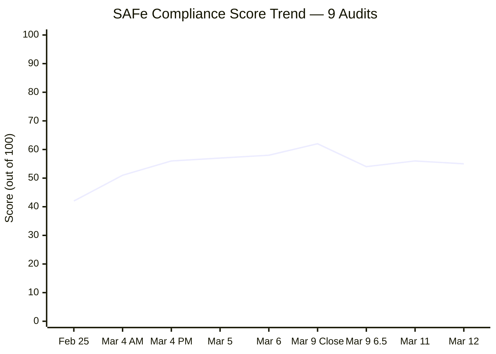

> **Score note:** The ↓ -1 reflects the Continuous Improvement deduction for overdue action items from Day 2 (the #199324 re-parenting action was targeted for Day 3 but remains pending). The score stabilizes otherwise — no new findings or regressions.

---

## 2. Changes Since Last Audit (Mar 11, Audit #8)

### 2.1 Stories Closed (1 new story since Day 2)

| ID | Title | SP | Parent Feature | Closed |
|---|---|---|---|---|
| 200867 | Exit/Entrance signage | 1 | #200288 Admin Support 6.5 | Day 3 (Mar 12) |

**Cumulative 6.5 Closures (5 stories, 6 SP):**

| ID | Title | SP | Category | Closed Day |
|---|---|---|---|---|
| 200322 | Repairing the ceiling rust 3rd/2nd floor (Joniel) | 2 | Ceiling Repair | Day 1 |
| 200289 | Toyota Hilux - Cebu | 1 | Payables | Day 1 |
| 200291 | Food allowance Jairosoft - Feb. 16-27 | 1 | Payables | Day 1 |
| 200321 | DOLE WAIR report | 1 | Admin Support | Day 2 |
| 200867 | Exit/Entrance signage | 1 | Admin Support | **Day 3** |

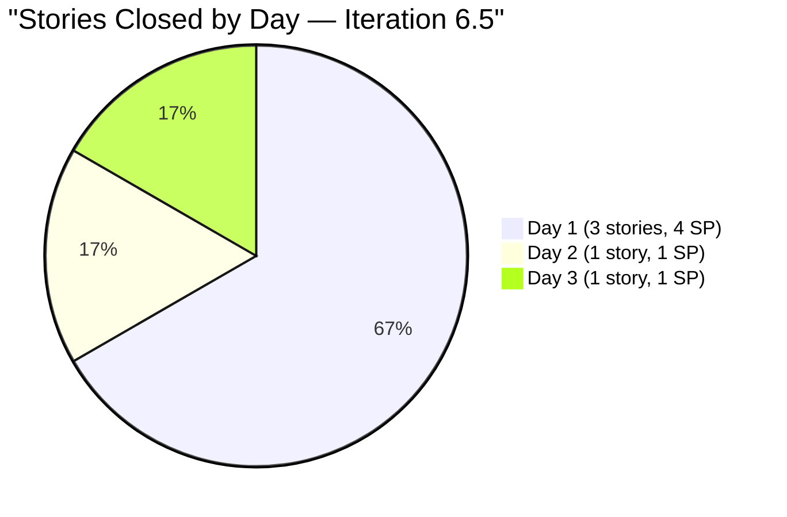

### 2.2 Story State Changes

| ID | Title | SP | Before (Day 2) | After (Day 3) | Change |
|---|---|---|---|---|---|
| 200867 | Exit/Entrance signage | 1 | 🔵 Active | ✅ **Closed** | ✅ Completed |
| 200293 | Electricity for Davao and Cebu payables | 3 | ⬜ New | 🔵 **Active** | Work started |

### 2.3 Task State Changes (Day 2 → Day 3)

| Task ID | Title | Before | After | Parent Story |
|---|---|---|---|---|
| 200868 | Canvassing of Exit/Entrance sign | 🔵 Active | ✅ **Closed** | #200867 (Closed) |
| 200779 | Ceiling rust 2nd floor (Day 3) | ⬜ New | ✅ **Closed** | #200322 (Closed) |
| 199743 | Dr. Karl Chavez fee at PNB | ⬜ New | 🔵 **Active** | #199324 (Active) |
| 200294 | VECO - Meridian payment at PNB | ⬜ New | 🔵 **Active** | #200293 (Active) |
| 200295 | VECO - Robinsons Galleria payment | ⬜ New | 🔵 **Active** | #200293 (Active) |

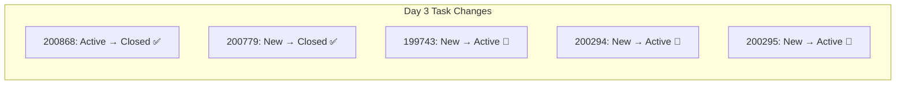

---

## 3. Current Iteration Status — Complete Inventory

### 3.1 Story Inventory (15 Stories, 30 SP)

| ID | Title | SP | State | Parent Feature | Tasks | Tags |
|---|---|---|---|---|---|---|
| 200322 | Ceiling repair 3rd/2nd floor (Joniel) | 2 | ✅ Closed | #196416 Ceiling Repair | 2/2 Closed | on-going |
| 200289 | Toyota Hilux - Cebu | 1 | ✅ Closed | #200287 Payables 6.5 | 1/1 Closed | routinary |
| 200291 | Food allowance Feb. 16-27 | 1 | ✅ Closed | #200287 Payables 6.5 | 1/1 Closed | routinary |
| 200321 | DOLE WAIR report | 1 | ✅ Closed | #200288 Admin Support 6.5 | 1/1 Closed | Admin Support |
| 200867 | Exit/Entrance signage | 1 | ✅ **Closed** | #200288 Admin Support 6.5 | 1/1 Closed | — |
| 199324 | Professional fee | 3 | 🔵 Active | #199319 Payables 6.4 ⚠️ | 1/1 Active | — |
| 200293 | Electricity for Davao and Cebu payables | 3 | 🔵 **Active** | #200287 Payables 6.5 | 2/4 Active | routinary |
| 200613 | BFP certification renewal follow up | 1 | 🔵 Active | #200588 BFP renewal | 1/1 Active | Admin Support |
| 196725 | CADAC training (Day 1) | 3 | ⬜ New | #196719 CADAC 2026 | 0/1 New | CADAC |
| 199466 | CADAC training (Day 2) | 3 | ⬜ New | #196719 CADAC 2026 | 0/1 New | CADAC |
| 200306 | Government payables | 4 | ⬜ New | #200287 Payables 6.5 | 0/8 New | routinary |
| 200301 | Internet Cebu/Davao payables | 3 | ⬜ New | #200287 Payables 6.5 | 0/4 New | routinary |
| 200298 | Condominium Cebu payables | 2 | ⬜ New | #200287 Payables 6.5 | 0/2 New | routinary |
| 200315 | 2nd batch SO certificate (TESDA) | 1 | ⬜ New | #200288 Admin Support 6.5 | 0/1 New | Admin Support |
| 200482 | JIT contract notary | 1 | ⬜ New | #200288 Admin Support 6.5 | 0/1 New | Admin Support |

### 3.2 Story State Summary — Day 3

| State | Count | % | Story Points | % of SP |
|---|---|---|---|---|
| Closed | 5 | 33.3% | 6 | 20.0% |
| Active | 3 | 20.0% | 7 | 23.3% |
| New | 7 | 46.7% | 17 | 56.7% |
| **Total** | **15** | **100%** | **30** | **100%** |

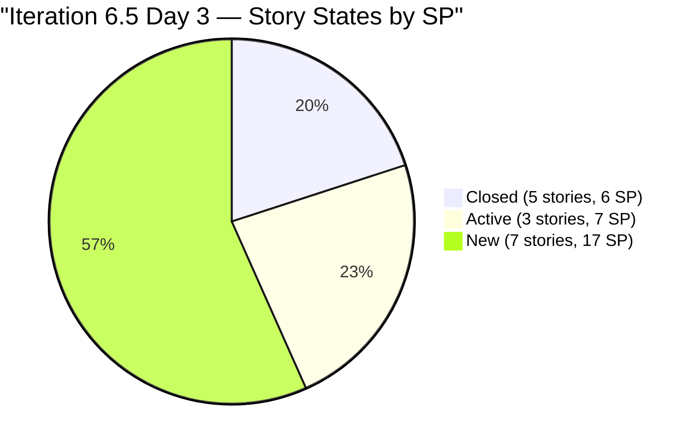

### 3.3 Task Summary — Day 3 (30 Tasks)

| State | Count | % | Change vs. Day 2 |
|---|---|---|---|
| Closed | 6 | 20.0% | +1 |
| Active | 4 | 13.3% | +2 |
| New | 20 | 66.7% | -3 |
| **Total** | **30** | **100%** | → |

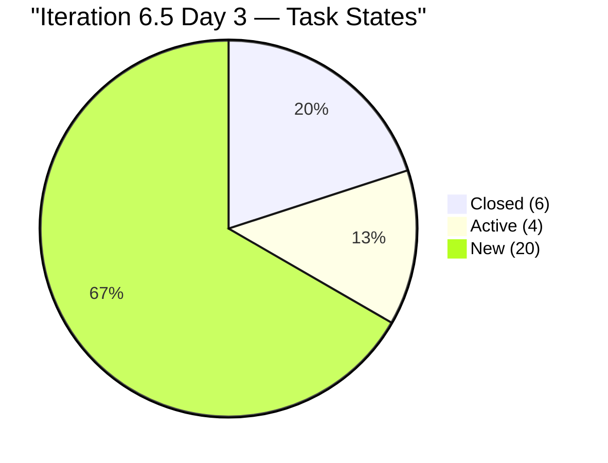

### 3.4 Burndown Projection — Day 3

| Metric | Day 2 | **Day 3** |
|---|---|---|
| SP Closed | 5 (16.7%) | **6 (20%)** |
| Remaining SP | 25 | **24** |
| Remaining Working Days (Mark) | 7 | **6** |
| Required Velocity | 3.57 SP/day | **4.0 SP/day** |
| Current Velocity | 2.5 SP/day | **2.0 SP/day** |
| Velocity Gap | -1.07 SP/day | **-2.0 SP/day** |
| Projected Completion at Current Pace | ~22.5 SP (75%) | **~18 SP (60%)** |

> ⚠️ **The velocity gap is widening.** Current pace projects only 60% completion — a significant shortfall. However, the large payables stories (Government 4 SP, Internet 3 SP, Electricity 3 SP in progress, CADAC 6 SP) are likely to complete in batches during Days 4–8. The next 2 working days will be critical indicators.

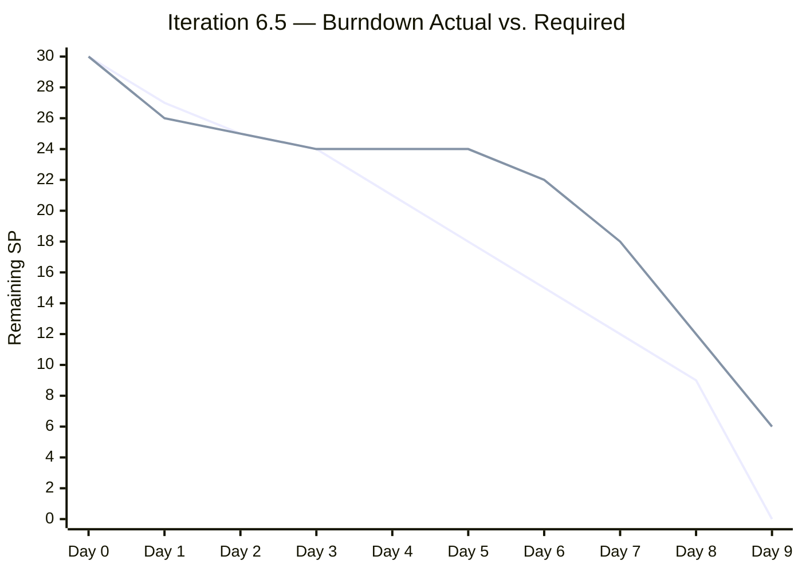

> Note: First line = ideal burndown (linear). Second line = observed/projected actual. Day 5 is Mark's day off (no progress expected).

---

## 4. Feature Traceability — Day 3

| Feature ID | Title | State | Stories in 6.5 | SP Total | SP Closed | % Done |
|---|---|---|---|---|---|---|
| 200287 | Payables 6.5 | ✅ Active | 6 | 14 | 2 (2 SP) | 14% |
| 200288 | Admin Support 6.5 | ✅ Active | 4 (+1 new) | 5 | 2 (2 SP) | 40% |
| 196719 | CADAC training 2026 | ✅ Active | 2 | 6 | 0 | 0% |
| 196416 | Ceiling Repair | ✅ Validation | 1 | 2 | 1 (2 SP) | 100% |
| 200588 | BFP renewal 2026 | ✅ Active | 1 | 1 | 0 | 0% |
| 199319 | Payables 6.4 ⚠️ | Active (wrong) | 1 (#199324) | 3 | 0 | 0% |

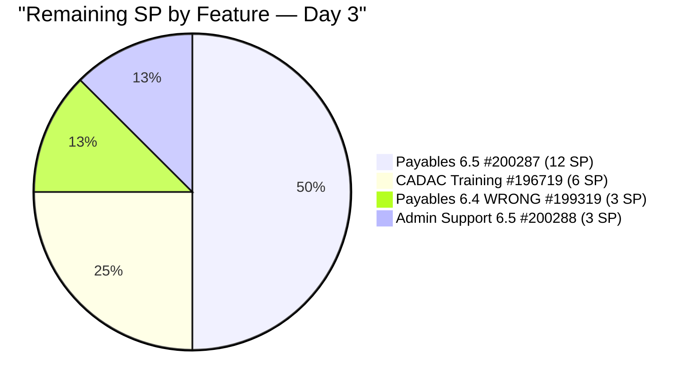

**Feature Health:**

- Feature #196416 (Ceiling Repair) is still in **Validation** — the only feature with 100% story closure. Should be moved to Closed.
- Feature #199319 (Payables 6.4) remains erroneously Active with Story #199324 — Finding FS still unresolved.
- All other features are properly Active.

---

## 5. Previous Findings — Resolution Tracker

| # | Finding | Severity | First Identified | **Status (Day 3)** | Notes |
|---|---|---|---|---|---|
| F1 | No Capacity Planning | CRITICAL | Feb 25 | Mark configured, Grace absent | ⚠️ PARTIAL |
| F2 | No Story Point Estimation | CRITICAL | Feb 25 | 15/15 estimated | ✅ SUSTAINED |
| F3 | Single Point of Failure | HIGH | Feb 25 | 1 active contributor (Grace: 1 activity observed) | ⚠️ IMPROVING |
| F4 | No Acceptance Criteria | HIGH | Feb 25 | 15/15 with AC | ✅ SUSTAINED |
| F5 | Typos in work items | MEDIUM | Feb 25 | All corrected | ✅ SUSTAINED |
| F6 | Features lack WSJF values | HIGH | Feb 25 | 5/6 features have BV | ⚠️ PARTIAL |
| F7 | Missing PI 2, Incomplete PI 5 | MEDIUM | Feb 25 | Unchanged | ⚠️ STRUCTURAL |
| FB | Grace not onboarded | HIGH | Mar 4 | 1 activity Day 2, none Day 3 | ⚠️ IMPROVING |
| FI | Grace capacity persistent gap | HIGH | Mar 5 | **9 audits without capacity** | ❌ OPEN — ESCALATED |
| FN | Story under closed feature | HIGH | Mar 9 | Feature #199319 reopened | ⚠️ MODIFIED |
| FO | Typo in #199324 description | LOW | Mar 9 | Corrected | ✅ RESOLVED |
| FQ | Feature #200588 in New state | LOW | Mar 9 | Now Active | ✅ RESOLVED |
| FR | Mid-sprint scope addition | LOW | Mar 11 | Story closed (#200867 done) | ✅ RESOLVED |
| FS | Story #199324 under wrong iteration feature | MEDIUM | Mar 11 | **Still open — Day 3 action overdue** | ❌ OVERDUE |

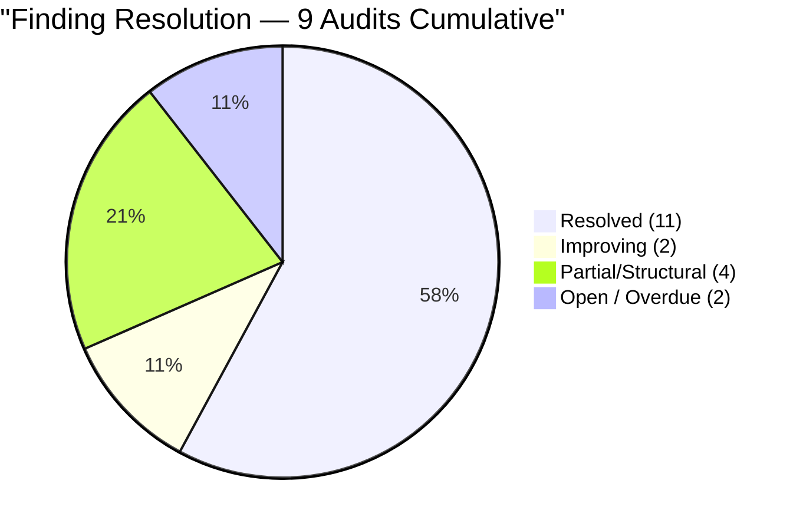

### 5.1 Finding Status Update

- ✅ **Finding FR RESOLVED.** Story #200867 (Exit/Entrance signage) is now Closed with its task also Closed. The mid-sprint scope addition has been cleanly completed.
- ❌ **Finding FS OVERDUE.** The Day 2 audit (Mar 11) raised Action Item #2: "Re-parent Story #199324 from Feature #199319 to #200287 — Target: Day 3." Today is Day 3. Story #199324 shows activity today (ChangedDate: 2026-03-12T01:56:50) and Task #199743 was moved to Active, but the parent feature linkage remains unchanged. This finding is now **OVERDUE**.
- ❌ **Finding FI ESCALATED.** Grace's capacity has now been absent for **9 consecutive audits across 17 days**. Despite showing board activity on Day 2, no further engagement is visible on Day 3.

---

## 6. New Findings — Audit #9

### Finding FT (HIGH) — Government Payables Story Stalled: Day 3 Zero Movement

| Item | Details |
|---|---|
| Story | #200306 — Government payables (4 SP, New) |
| Tasks | 8 tasks (all New, unchanged from Day 0) |
| Task IDs | 200307, 200308, 200309, 200310, 200311, 200312, 200313, 200314 |
| Days Stalled | 3 days — iteration start to present |
| Risk Pattern | Same as Story #199334 bottleneck in Iteration 6.4 |
| Government obligations include | SSS loans, Pag-IBIG contributions (×4 types), PHIC (×2) |

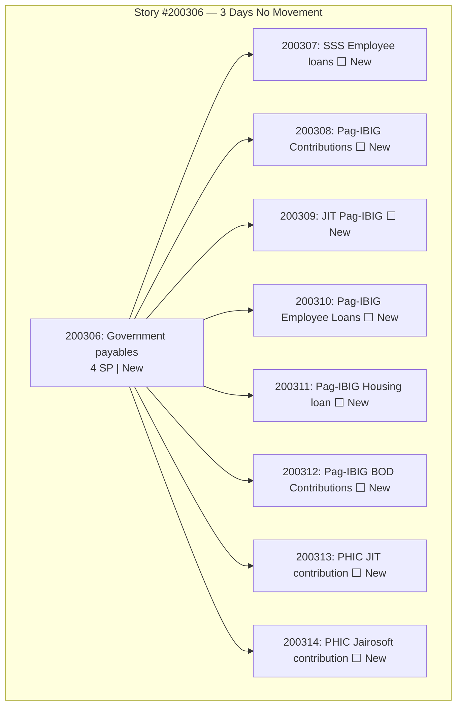

**SAFe Guidance:** In Iteration 6.4, a similar bottleneck (Story #199334) with multiple tasks stalled over several days was ultimately resolved in a single overnight sprint, but required escalation. Government payables are date-sensitive (statutory deadlines), making this especially critical. A 4 SP story with 8 tasks requires coordinated action — likely a single bank visit covering multiple obligations.

**Recommendation:** Flag to Mark Colina immediately. This story should be activated by Day 4 (March 13). If not moving by Day 5 (March 16 — Mark's day off), escalate to Ramon.

### Finding FU (MEDIUM) — Feature #196416 Ready to Close

| Item | Details |
|---|---|
| Feature | #196416 — Repair ceiling rust third floor Davao office |
| Current State | **Validation** |
| Child Stories in 6.5 | Story #200322 (Closed) |
| Story Points Remaining | 0 SP |
| Expected Next State | **Closed** |
| Impact | Feature is 100% complete but not formally closed |

**SAFe Guidance:** In SAFe, features should be closed when all stories are completed and accepted. Feature #196416 has been in Validation since Day 1 (March 10), with its sole 6.5 story (#200322) closed on Day 1. At Day 3, this feature should have been reviewed and closed during sprint execution.

**Recommendation:** Close Feature #196416 to reflect accurate feature-level completion status.

---

## 7. Work Category Progress — Day 3

| Category | Stories | SP Total | SP Closed | SP Active | SP New | % Done |
|---|---|---|---|---|---|---|
| Payables (routinary) | 7 | 17 | 2 SP | 6 SP | 9 SP | 12% |
| Admin Support Services | 5 | 5 | 2 SP | 1 SP | 2 SP | 40% |
| CADAC Training | 2 | 6 | 0 SP | 0 SP | 6 SP | 0% |
| Ceiling Repair (on-going) | 1 | 2 | 2 SP | 0 SP | 0 SP | **100%** ✅ |
| **Total** | **15** | **30** | **6 SP** | **7 SP** | **17 SP** | **20%** |

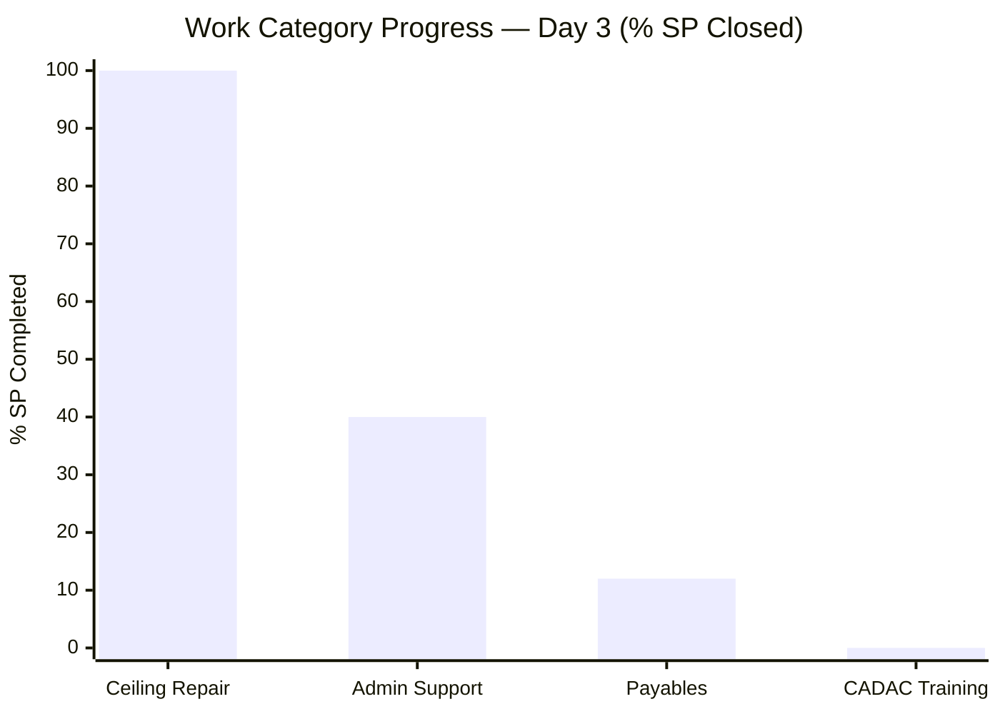

**Key Observations by Category:**

- **Ceiling Repair (100%)** — Complete. Feature should be closed (Finding FU).
- **Admin Support (40%)** — Best progress rate. 2 of 5 stories closed (DOLE WAIR + Exit/Entrance signage).
- **Payables (12%)** — Dominant workload (57% of SP) with only 2 of 7 stories closed. Electricity (3 SP) now Active, but Government (4 SP), Internet (3 SP), Condominium (2 SP) still entirely in New.
- **CADAC Training (0%)** — Zero progress. 2 stories, 6 SP, 2 tasks all New. Training-dependent delivery.

---

## 8. Capacity Analysis — Day 3

### 8.1 Team Capacity (Unchanged)

| Member | Capacity/Day | Activities | Days Off | Status |
|---|---|---|---|---|
| Mark Colina | 6.5 hrs | Deployment (0.5), Documentation (3.5), Requirements (2.5) | Mar 16 (1 day) | ✅ Configured |
| Grace | ❌ Not configured | — | — | ⚠️ 1 activity (Mar 10), none since |

### 8.2 Velocity vs. Capacity Analysis

| Metric | Day 2 | **Day 3** | Trend |
|---|---|---|---|
| SP Closed | 5 | **6** | +1 |
| Current Velocity (SP/day) | 2.5 | **2.0** | ↓ Declining |
| Required Velocity (SP/day) | 3.57 | **4.0** | ↑ Increasing |
| Velocity Gap | -1.07 | **-2.0** | ↓ Widening |
| Hrs/SP at Current Pace | 3.12 | **3.25** | ↑ Less efficient |
| Configured Hrs/SP | 1.95 | **1.95** | → Unchanged |

```mermaid
xychart-beta
    title "Velocity: Actual vs. Required (SP/Day)"
    x-axis ["Day 2", "Day 3"]
    y-axis "SP per Day" 0 --> 5
    bar [3.57, 4.0]
    bar [2.5, 2.0]
```

> ⚠️ **The velocity gap is the most critical operational risk at Day 3.** Unless large stories (Government payables, CADAC, Internet) begin moving in Days 4–6, the team will face a significant shortfall. Historical precedent from Iteration 6.4 shows batch completions are common — but this requires stories to actually start moving.

---

## 9. Cross-Iteration Pattern Analysis — 9 Audits

### 9.1 Early Execution Comparison: 6.4 Day 3 vs. 6.5 Day 3

| Metric | 6.4 Day 3 (Feb 25, Audit #1) | **6.5 Day 3 (Mar 12, Audit #9)** | Comparison |
|---|---|---|---|
| Stories Closed | 5/21 (24%) | **5/15 (33%)** | ✅ Better |
| SP Closed | ~5/36 (14%) | **6/30 (20%)** | ✅ Better |
| Estimation Coverage | 0% | **100%** | ✅ Major improvement |
| Tasks with Descriptions | Low | **100%** | ✅ Major improvement |
| AC Coverage | 0% | **100%** | ✅ Major improvement |
| Large Stories Stalled | 1 (#199334) | **1 (#200306)** | ⚠️ Same pattern |
| Velocity vs. Required | N/A | **50% (2.0 vs 4.0)** | ⚠️ Below pace |

### 9.2 Trend Analysis — SAFe Compliance Score (9 Audits)

| Audit | Date | Score | Event |
|---|---|---|---|
| #1 | Feb 25 | 42 | 6.4 Baseline — No SP, no AC |
| #2 | Mar 4 AM | 51 | +9 — First improvements |
| #3 | Mar 4 PM | 56 | +5 — Rapid remediation |
| #4 | Mar 5 | 57 | +1 — Capacity configured |
| #5 | Mar 6 | 58 | +1 — Sustained improvement |
| #6 | Mar 9 | 62 | +4 — 6.4 closed at 100% |
| #7 | Mar 9 | 54 | -8 — New iteration reset |
| #8 | Mar 11 | 56 | +2 — Grace activity, 4 stories closed |
| **#9** | **Mar 12** | **55** | **-1 — Overdue actions, velocity gap** |

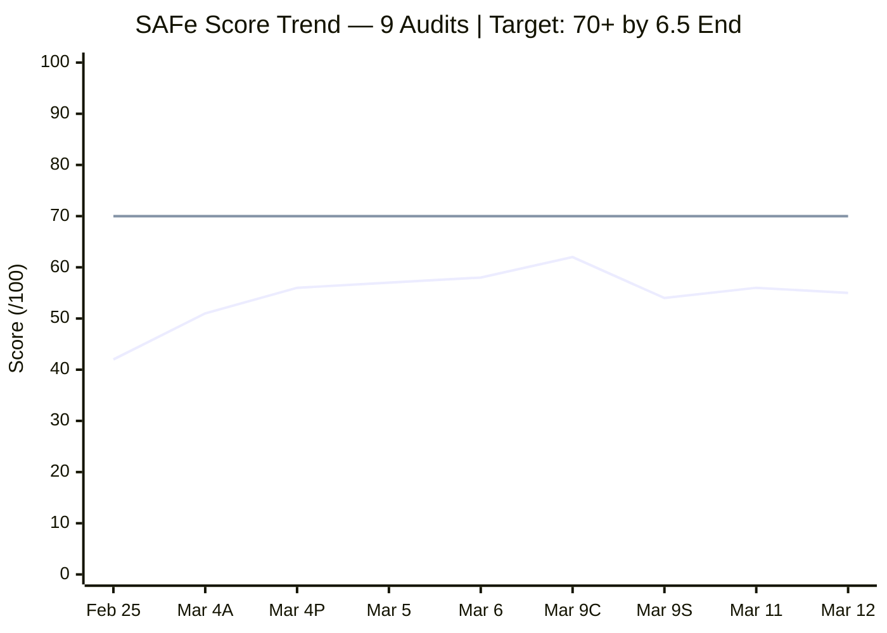

> The second line represents the target score of 70 (equivalent to 6.4's final peak-trajectory). Current 6.5 trajectory needs to accelerate significantly to reach or exceed the 6.4 Final of 62.

### 9.3 Finding Resolution Velocity (Cumulative)

| Audit | New Findings | Resolved | Open Count |
|---|---|---|---|
| #1 (Feb 25) | 9 | 0 | 9 |
| #2 (Mar 4 AM) | 5 | 3 | 11 |
| #3 (Mar 4 PM) | 2 | 3 | 10 |
| #4 (Mar 5) | 3 | 2 | 11 |
| #5 (Mar 6) | 2 | 2 | 11 |
| #6 (Mar 9 Close) | 0 | 5 | 6 |
| #7 (Mar 9 6.5) | 4 | 2 | 8 |
| #8 (Mar 11) | 2 | 2 | 8 |
| **#9 (Mar 12)** | **2** | **1** | **9** |

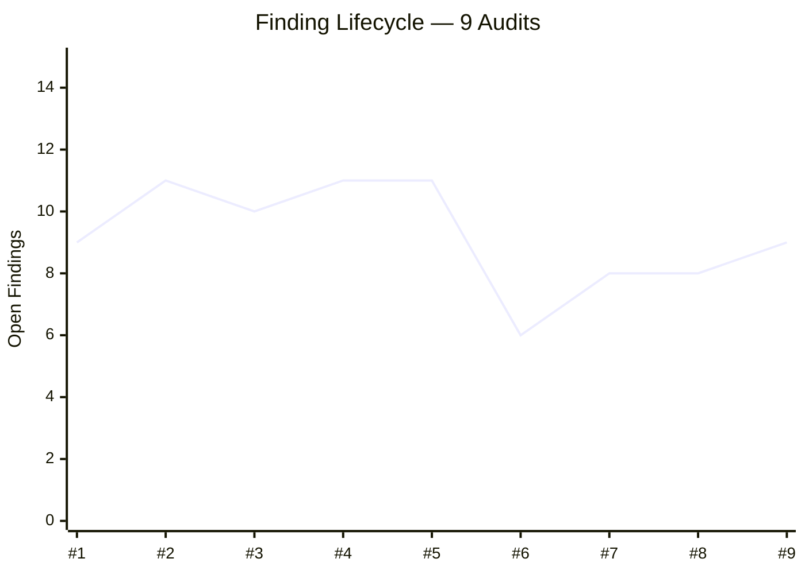

> ⚠️ **Open finding count increased by 1.** Finding FR resolved (Exit/Entrance signage closed), but two new findings (FT: Government payables stall, FU: Feature #196416 not closed) were added. This is the **first net increase in open findings since Audit #4** — a regression signal that warrants attention.

---

## 10. SAFe Compliance Assessment — Day 3

**1. PI & Iteration Structure — 8/10 (→ unchanged)**

- Iteration cadence maintained, dates properly defined
- Deductions: PI 2 gap and PI 5 structural issues persist

**2. Capacity Planning — 5/10 (→ unchanged)**

- Mark properly configured with 3 activity types and day off
- Grace: 9th consecutive audit without capacity configuration
- Grace showed board activity on Day 2 but not Day 3

**3. Backlog Management — 7/10 (→ unchanged)**

- 5 stories closed cleanly, work flowing
- Finding FT (Government payables stall) is new concern
- Finding FU (Feature not closed) adds hygiene issue
- Scope from Day 2 addition (#200867) now complete — clean resolution

**4. Work Item Quality — 7/10 (→ unchanged)**

- 15/15 stories have descriptions, AC, SP, and tasks
- AC quality remains largely minimal ("Attached receipt/photo") across 14 of 15 stories
- Minimal improvement in quality pattern since Day 2

**5. Estimation & Velocity — 8/10 (→ unchanged)**

- 15/15 stories have story points
- Actual velocity (2.0 SP/day) below required (4.0 SP/day)
- Maintained at 8 as it's still early; batch completions expected
- Will drop if no acceleration by Day 5

**6. Team Structure & Collaboration — 6/10 (→ unchanged)**

- Grace: no new observable activity on Day 3
- Mark remains primary contributor on all work items
- Single-point-of-failure risk unchanged

**7. Continuous Improvement — 7/10 (↓ -1 from 8)**

- Finding FS (re-parenting #199324) was Action Item #2 from Day 2, targeted Day 3 — **OVERDUE**
- Finding FR (scope addition #200867) resolved cleanly ✅
- Net finding count increased for first time in 5 audits
- Deduction for failure to resolve Day 2 action items on schedule

**8. Hierarchy & Traceability — 7/10 (→ unchanged)**

- Feature #200588 remains Active (FQ resolved — sustained)
- Feature #196416 in Validation (Finding FU: should close)
- Story #199324 still under Feature #199319 (Finding FS — overdue)
- Maintained at 7 as the violations are known and tracked

---

## 11. Risk Register — Day 3 Update

| # | Risk | Likelihood | Impact | Trend | Status |
|---|---|---|---|---|---|
| R1 | Grace capacity absent — 9th audit | **Certain** | High | → Persistent | ❌ OPEN — ESCALATED |
| R2 | Story #199324 under wrong feature | **Certain** | Medium | ↑ Now overdue | ❌ OVERDUE (Action #2 from Day 2) |
| R3 | Velocity 2.0 SP/day vs. required 4.0 | **High** | High | ↑ Worsening | ⚠️ NEW CONCERN |
| R4 | Government payables (8 tasks, 4 SP) stalled | **High** | High | ↑ Escalated | ⚠️ Day 3 = zero movement |
| R5 | Feature #196416 not closed (100% done) | **Certain** | Low | 🆕 New | ⚠️ Finding FU |
| R6 | CADAC training (6 SP) zero progress | Medium | High | → Unchanged | ⚠️ Date-dependent |
| R7 | Feature backlog without WSJF | Medium | High | → Persistent | ⚠️ PI 7 prep needed |
| R8 | PI 2 gap and PI 5 structural gaps | Low | Low | → Persistent | STRUCTURAL |

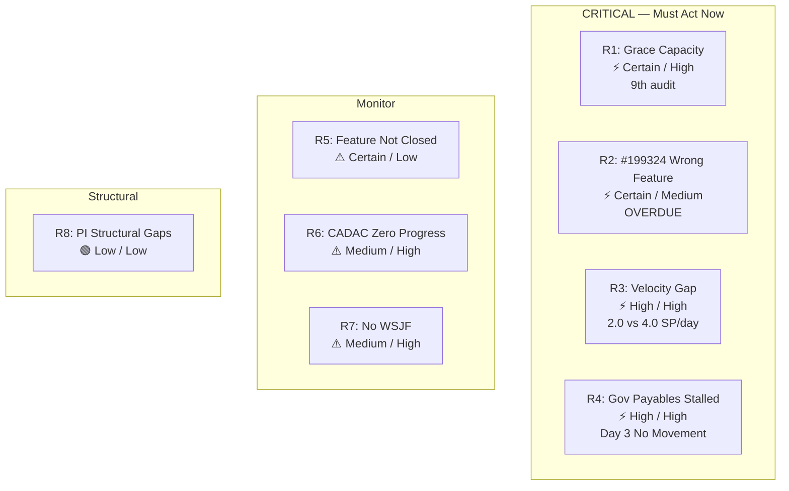

---

## 12. Action Items — Day 3

| # | Action | Owner | Priority | Target | Status |
|---|---|---|---|---|---|
| 1 | Re-parent Story #199324 from Feature #199319 to #200287 | Mark Colina | **CRITICAL** | **TODAY (Day 3)** | ❌ OVERDUE from Day 2 |
| 2 | Close Feature #199319 (Payables 6.4) after re-parenting | Mark Colina | **CRITICAL** | **TODAY (Day 3)** | ❌ OVERDUE from Day 2 |
| 3 | Close Feature #196416 (Ceiling Repair — 100% done) | Mark Colina | HIGH | Day 4 | 🆕 New |
| 4 | Activate Government payables Story #200306 (4 SP, 8 tasks) | Mark Colina | **HIGH** | **Day 4 (Mar 13)** | ❌ No movement in 3 days |
| 5 | Configure Grace's capacity for Iteration 6.5 | Team Lead | **CRITICAL** | Immediate | ❌ 9 audits unresolved |
| 6 | Begin CADAC training story (#196725) activation | Mark Colina | MEDIUM | Day 5–6 | ⬜ Pending |
| 7 | Monitor velocity — if below 3 SP/day by Day 5, escalate | Scrum Master | MEDIUM | Day 5 | Ongoing |

---

## 13. Trends & Learnings — 9-Audit Series Analysis

### 13.1 Patterns Confirmed

**Positive patterns (sustained from 6.4):**

- All stories have SP, AC, descriptions, and tasks — a massive improvement from 6.4 baseline
- Capacity configuration evolved from 0→3 activity types across the audit series
- Finding resolution is fast for low-complexity items (typos: avg 1 audit; state issues: avg 1 audit)
- Day 1 always closes multiple stories quickly (ceiling repair + routine payables)

**Concerning patterns (recurring):**

- **Grace gap** — Longest unresolved finding (17 days, 9 audits). Each audit generates a new observation but no structural change.
- **Single bottleneck story** — Appears in both 6.4 (#199334) and 6.5 (#200306): a multi-task story with all tasks stalled through Days 1-3.
- **Velocity slows in Days 2-3** — After an active Day 1, momentum typically slows before large batch completions in Days 5-8. However, the gap is wider in 6.5 than in 6.4.
- **Feature hygiene** — Iteration transitions generate hierarchy mismatches (closed features with active stories, features not progressing to Closed when done). This occurs in every iteration.

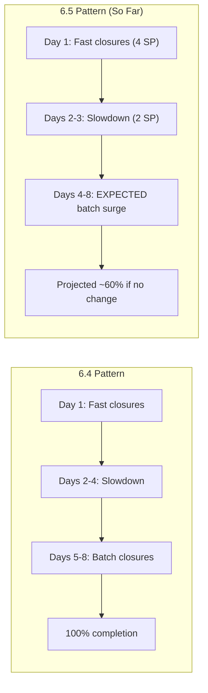

### 13.2 Iteration-over-Iteration Improvement Metrics

| Metric | 6.4 Day 3 Score | 6.5 Day 3 Score | Improvement |
|---|---|---|---|
| Overall SAFe Score | 42 | **55** | +13 points |
| Story Estimation Coverage | 0% | **100%** | +100% |
| AC Coverage | 0% | **100%** | +100% |
| Stories Closed (Day 3) | 5/21 (24%) | **5/15 (33%)** | +9% |
| SP Closed (Day 3) | ~14% | **20%** | +6% |
| Open Findings | 9 | **9** | → (same absolute count) |

> Despite the same open finding count, the **nature** of open findings has improved dramatically: from fundamental process gaps (no SP, no AC, no capacity) to execution items (re-parenting, feature state, velocity pace).

---

## 14. Conclusion

**Iteration 6.5 is progressing but needs acceleration.** Five stories are closed (6 SP, 20%), which is ahead of the equivalent point in 6.4 on a percentage basis. However, with 24 SP remaining and only 6 effective working days left for Mark, the team needs to maintain at least 4.0 SP/day — double the current pace.

**Four items demand immediate attention:**

1. **Government payables (#200306, 4 SP, 8 tasks)** — Zero movement in 3 days. History from 6.4 shows this category can batch-complete quickly, but only when started. Activate today (Day 3) or tomorrow at the latest.

2. **Story #199324 re-parenting** — Overdue since Day 2 action items. Every additional day this remains under the wrong feature degrades reporting accuracy. Takes 2 minutes to fix.

3. **Grace's capacity configuration** — Now in its 9th audit (17 days). With Grace showing board activity on Day 2, momentum toward full onboarding exists. Configuring capacity is the critical next step.

4. **Feature #196416 closure** — Ceiling Repair is 100% done (Validation state since Day 1). Should be formally closed to maintain accurate feature-level tracking.

**Iteration 6.5 Day 3 Status: NEEDS ACCELERATION — 4 corrective actions required**
**Next Scheduled Audit: March 13, 2026 (Day 4) — automated daily audit**

---

*Report generated on March 12, 2026 | SAFe 6.0 Framework Standards*
*Auditor: AI Agile PM Consultant (Scheduled Task: admin-iteration-daily-audit)*
*Audit Series: #9 — 3rd audit for Iteration 6.5*
