# SAFe Audit Report — Administration Team Board
## Jairosoft FINOPS Azure DevOps Project

**Audit Date:** March 16, 2026 — Iteration 6.5, Day 5 (Midpoint)
**Auditor:** AI Agile PM Consultant
**Framework:** Scaled Agile Framework (SAFe) 6.0
**Current PI:** PI 6 (2026)
**Iteration Audited:** Iteration 6.5 (Mar 10 – Mar 22, 2026)
**Board URL:** [Administration Team Board](https://dev.azure.com/jairo/Jairosoft%20FINOPS/_boards/board/t/Administration%20Team/Stories%20and%20Deliverables)
**Previous Audits:** 7 (Feb 25 – Mar 9, 2026)
**Audit Series:** #8 (2nd for Iteration 6.5)

---

## 1. Executive Summary

This is the **midpoint audit of Iteration 6.5**, conducted on Day 5 of 10 working days. Today (March 16) is Mark Colina's planned day off. The purpose is to assess mid-sprint progress, verify resolution of Day 1 action items from audit #7, and evaluate whether the iteration is on track for full completion.

**Iteration 6.5 Midpoint Snapshot:**

| Metric | Planned (Day 0) | Actual (Day 5) | Status |
|---|---|---|---|
| User Stories | 14 | **15** (+1 mid-sprint) | ⚠️ Scope change |
| Total Story Points | 29 SP | **30 SP** (+1 SP added) | ⚠️ Scope change |
| Stories Closed | 0 | **7 (47%)** | ✅ On track |
| Stories Active | 3 | **5 (33%)** | ✅ In progress |
| Stories New | 11 | **3 (20%)** | ✅ Good flow |
| Tasks Closed | 0 | **17 of 30 (57%)** | ✅ On track |
| SP Closed | 0 | **11 SP (37%)** | ⚠️ Slightly behind |
| SP Active (in-flight) | — | **12 SP (40%)** | ✅ Pipeline healthy |
| SP Untouched | 29 | **7 SP (23%)** | ⚠️ Monitor |

**Key Observations:**

1. **Solid execution pace.** With 47% of stories closed and 33% active at the 50% time mark, the iteration is tracking well. The 57% task closure rate exceeds the linear expectation.

2. **Mid-sprint scope addition.** Story #200867 (Exit/Entrance signage, 1 SP) was added on Day 2 and closed by Day 3. While the impact is small (1 SP), mid-sprint additions are a SAFe anti-pattern that should be tracked.

3. **CADAC training (6 SP, 20%) still untouched.** Both training stories remain in "New" state at the midpoint. If these are scheduled for the second week, this is expected. If not, 6 SP risks being unfinished.

4. **Government payables bottleneck did NOT materialize.** Story #200306 (4 SP, 8 tasks) was flagged as a bottleneck risk in audit #7. At midpoint, 6 of 8 tasks are closed. Excellent execution.

5. **Two prior audit findings resolved.** Feature #200588 (BFP renewal) moved to Active (FQ resolved). Story #199324 (Professional fee) closed naturally, resolving the hierarchy integrity issue (FN resolved).

6. **Grace capacity still not configured** — 8th consecutive audit. This remains the longest-standing unresolved finding in the audit series (21+ days).

**Overall SAFe Compliance Score: 55/100 — Fair** *(+1 from 6.5 baseline)*

| Category | 6.4 Baseline | 6.4 Final | 6.5 Baseline | **6.5 Midpoint** | Trend |
|---|---|---|---|---|---|
| PI & Iteration Structure | 8/10 | 8/10 | 8/10 | **8/10** | → |
| Capacity Planning | 1/10 | 4/10 | 5/10 | **5/10** | → |
| Backlog Management | 4/10 | 10/10 | 8/10 | **8/10** | → |
| Work Item Quality | 3/10 | 8/10 | 7/10 | **7/10** | → |
| Estimation & Velocity | 1/10 | 10/10 | 8/10 | **8/10** | → |
| Team Structure & Collaboration | 4/10 | 5/10 | 5/10 | **5/10** | → |
| Continuous Improvement | 5/10 | 10/10 | 7/10 | **8/10** | ↑ +1 |
| Hierarchy & Traceability | 6/10 | 7/10 | 6/10 | **6/10** | → |

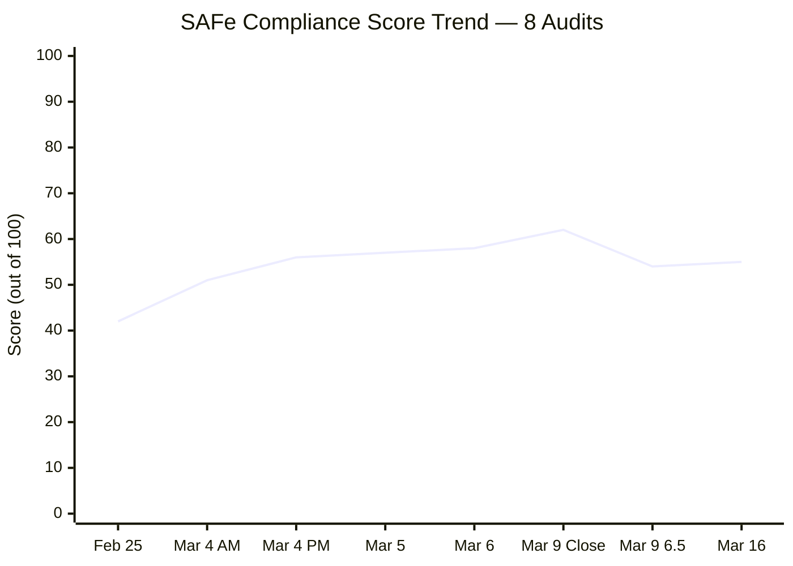

---

## 2. Iteration 6.5 Progress Analysis

### 2.1 Story Progress at Midpoint

| ID | Title | SP | State (Day 0) | **State (Day 5)** | Parent Feature | Tags |
|---|---|---|---|---|---|---|
| 200289 | Toyota Hilux - Cebu | 1 | Active | **Closed** ✅ | #200287 Payables 6.5 | routinary |
| 200291 | Food allowance Feb 16-27 | 1 | New | **Closed** ✅ | #200287 Payables 6.5 | routinary |
| 200298 | Condominium Cebu payables | 2 | New | **Closed** ✅ | #200287 Payables 6.5 | routinary |
| 200321 | DOLE WAIR report | 1 | Active | **Closed** ✅ | #200288 Admin Support 6.5 | Admin Support |
| 200322 | Ceiling rust repair 3rd/2nd floor | 2 | Active | **Closed** ✅ | #196416 Ceiling Repair | on-going |
| 199324 | Professional fee | 3 | New | **Closed** ✅ | #199319 Payables 6.4 | — |
| 200867 | Exit/Entrance signage | 1 | *N/A (added Day 2)* | **Closed** ✅ | #200288 Admin Support 6.5 | — |
| 200306 | Government payables | 4 | New | **Active** 🔵 | #200287 Payables 6.5 | routinary |
| 200293 | Electricity Davao/Cebu | 3 | New | **Active** 🔵 | #200287 Payables 6.5 | routinary |
| 200301 | Internet Cebu/Davao | 3 | New | **Active** 🔵 | #200287 Payables 6.5 | routinary |
| 200315 | 2nd batch SO cert (TESDA) | 1 | New | **Active** 🔵 | #200288 Admin Support 6.5 | Admin Support |
| 200613 | BFP certification renewal | 1 | New | **Active** 🔵 | #200588 BFP Renewal | Admin Support |
| 196725 | CADAC training (Day 1) | 3 | New | **New** ⚪ | #196719 CADAC 2026 | CADAC |
| 199466 | CADAC training (Day 2) | 3 | New | **New** ⚪ | #196719 CADAC 2026 | CADAC |
| 200482 | JIT contract notary | 1 | New | **New** ⚪ | #200288 Admin Support 6.5 | Admin Support |

### 2.2 Story State Flow — Day 0 vs Day 5

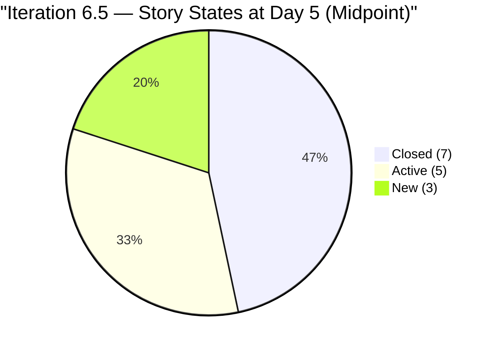

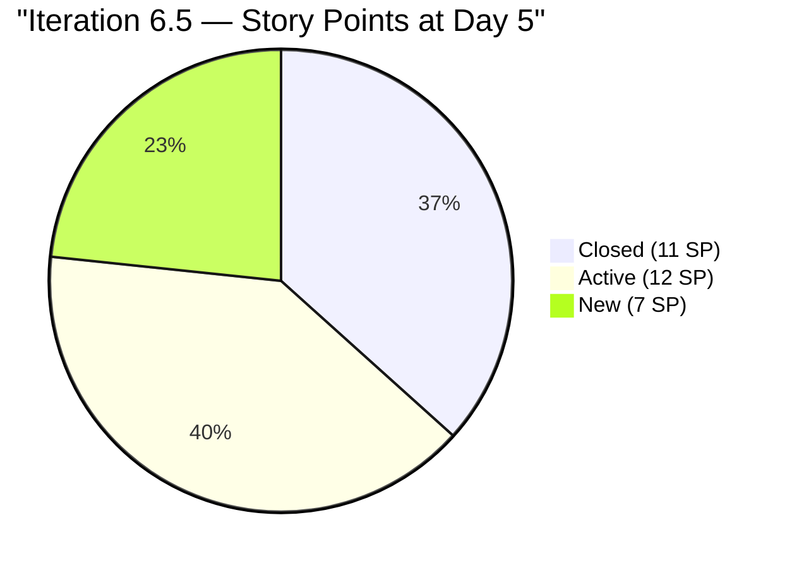

### 2.3 Burndown Analysis

| Metric | Expected (Linear) | Actual | Variance |
|---|---|---|---|
| Time elapsed | 50% (Day 5 of 10) | 50% | On schedule |
| Stories closed | 50% (7.5) | 47% (7/15) | -3% ⚡ Slight lag |
| SP closed | 50% (15 SP) | 37% (11/30 SP) | -13% ⚠️ Behind |
| Tasks closed | 50% (15) | 57% (17/30) | +7% ✅ Ahead |

**Analysis:** The gap between task closure (57%) and SP closure (37%) reveals that **smaller stories are closing faster** while larger stories (3-4 SP) are still in progress. With 12 SP currently Active, the in-flight pipeline is healthy. If these Active stories close during the second week, final SP closure would reach 23/30 SP (77%) minimum — with the remaining 7 SP (CADAC + JIT notary) needing completion.

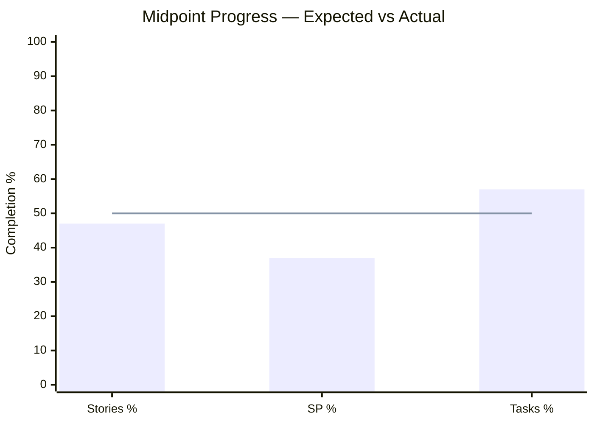

### 2.4 Task Progress Detail

| Task State | Count | Percentage |
|---|---|---|
| Closed | 17 | 57% |
| Active | 6 | 20% |
| New | 7 | 23% |
| **Total** | **30** | 100% |

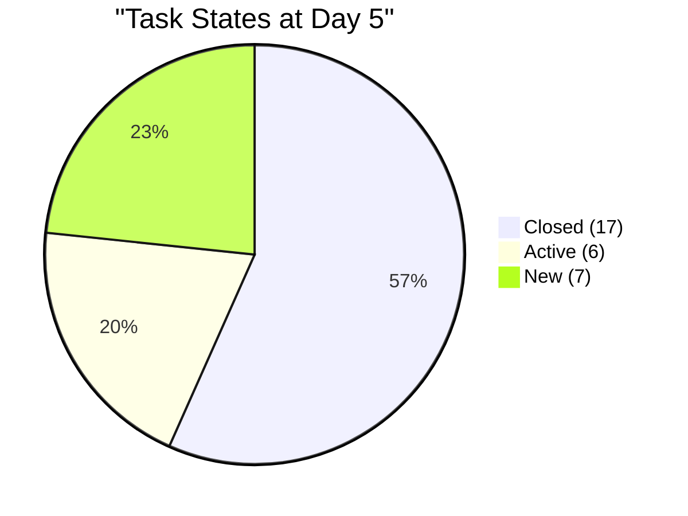

**Notable task-level observations:**

- **Government payables (#200306):** 6 of 8 tasks closed (75%). Only PHIC JIT and PHIC Jairosoft contributions remain (both New). Bottleneck risk from audit #7 has **not materialized** — excellent execution.
- **Electricity (#200293):** 2 of 4 tasks closed, 2 active. In progress.
- **Internet (#200301):** 2 of 4 active, 2 new. In progress.
- **CADAC tasks:** Both still New. 0% progress.

---

## 3. Previous Finding Resolution Tracker

| # | Finding | Severity | First Found | Status at 6.5 Baseline | **Status at 6.5 Midpoint** |
|---|---|---|---|---|---|
| F1 | Capacity: Grace not configured | CRITICAL | Feb 25 | Mark only, Grace absent | **Grace still absent (8 audits, 21+ days)** ❌ |
| F2 | No Story Point Estimation | CRITICAL | Feb 25 | 14/14 estimated | **15/15 estimated (incl. new #200867)** ✅ SUSTAINED |
| F3 | Single Point of Failure | HIGH | Feb 25 | 1 active member | **1 active member** ⚠️ OPEN |
| F4 | No Acceptance Criteria | HIGH | Feb 25 | 14/14 with AC | **15/15 with AC (new story has AC)** ✅ SUSTAINED |
| F5 | Typos in work items | MEDIUM | Feb 25 | Corrected | ✅ No new typos detected |
| F6 | Features lack WSJF values | HIGH | Feb 25 | 4/6 features have BV | **Unchanged** ⚠️ PARTIAL |
| F7 | Missing PI 2, Incomplete PI 5 | MEDIUM | Feb 25 | Unchanged | **Unchanged** ⚠️ STRUCTURAL |
| FB/FI | Grace capacity persistent gap | HIGH | Mar 4 | 7 audits unresolved | **8 audits unresolved** ❌ ESCALATED |
| FN | Story #199324 under CLOSED feature | HIGH | Mar 9 | Open | **Story now Closed — hierarchy moot** ✅ RESOLVED |
| FO | "Prosessional" typo in #199324 | LOW | Mar 9 | Open | **Title corrected to "Professional fee"** ✅ RESOLVED |
| FP | Pre-start Active stories | MEDIUM | Mar 9 | 3 stories Active Day 0 | **N/A at midpoint** ✅ N/A |
| FQ | Feature #200588 in New state | LOW | Mar 9 | New | **Now Active** ✅ RESOLVED |

### 3.1 Resolution Summary

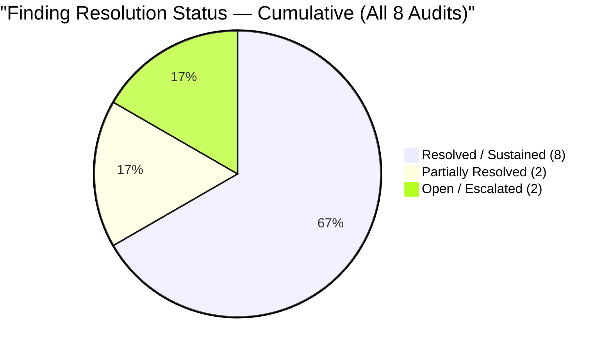

**Positive trend:** 3 of 4 new findings from audit #7 (FN, FO, FQ) have been resolved within one week. Only Grace capacity (FB/FI) remains persistently unresolved.

---

## 4. New Findings — Iteration 6.5 Midpoint

### Finding FR (LOW) — Mid-Sprint Scope Addition

| Item | Details |
|---|---|
| Story | #200867 — Exit/Entrance signage (1 SP) |
| Created | March 11, 2026 (Day 2 of iteration) |
| Closed | March 12, 2026 (Day 3) |
| Parent Feature | #200288 — Admin Support Services 6.5 (Active) |
| Impact | Scope increased from 29 SP → 30 SP after sprint commitment |
| Quality | Has description + AC ("Attached photo of canvassed") — consistent with team standards |

**Analysis:** In SAFe, the iteration commitment should be stable after planning. Adding work mid-sprint can destabilize predictability. However, this was a small item (1 SP) completed within 1 day, with minimal disruption. The team should track mid-sprint additions as a metric — if this becomes a pattern, it indicates planning gaps.

**Recommendation:** Document unplanned work as a separate category during retrospective. Track "scope creep rate" (added SP / committed SP) per iteration.

### Finding FS (MEDIUM) — CADAC Training Stories Untouched at Midpoint

| Item | Details |
|---|---|
| Stories | #196725 (Day 1, 3 SP) + #199466 (Day 2, 3 SP) = 6 SP |
| Current State | Both New — 0% progress |
| % of Committed SP | 20% of 30 SP |
| Tasks | #199736 (New), #199760 (New) |
| Risk | If training is in Week 2, this is expected. If not scheduled, 6 SP at risk. |

**Recommendation:** Verify that CADAC training dates are scheduled for the second week (Mar 17-22). If so, no action needed. If training dates are uncertain, these stories should be flagged as at-risk during daily standup.

### Finding FT (INFO) — Feature #196416 Closed with Completed Child

| Item | Details |
|---|---|
| Feature | #196416 — Repair ceiling rust third floor Davao office |
| Feature State | **Closed** (was Active at 6.5 baseline) |
| Child Story | #200322 — Closed ✅ |
| Child Tasks | #200778 (Closed), #200779 (Closed) ✅ |
| Impact | Positive — multi-iteration feature properly completed and closed |

**Note:** This is an informational finding. The ceiling repair work, tracked across multiple iterations, has been successfully completed. The feature was properly closed after all child work items were done — good SAFe practice.

---

## 5. Capacity Analysis

### 5.1 Team Capacity Configuration (Unchanged from Baseline)

| Member | Capacity/Day | Activities | Days Off | Status |
|---|---|---|---|---|
| Mark Colina | 6.5 hrs | Deployment (0.5), Documentation (3.5), Requirements (2.5) | Mar 16 (today) | ✅ Configured |
| Grace | ❌ Not configured | — | — | ❌ Absent (8 audits) |

### 5.2 Effective Capacity at Midpoint

| Metric | Value |
|---|---|
| Total working days | 10 |
| Mark's working days | 9 (today Mar 16 is day off) |
| Days elapsed (working) | 4 (Mar 10-13; today is off) |
| Days remaining (working) | 5 (Mar 17-22, minus weekends) |
| Hours consumed (estimated) | 26 hrs (4 days x 6.5 hrs) |
| Hours remaining | 32.5 hrs (5 days x 6.5 hrs) |
| SP remaining | 19 SP (12 Active + 7 New) |
| **Hours per remaining SP** | **1.71 hrs/SP** |
| Iteration benchmark | 2.02 hrs/SP (from baseline) |

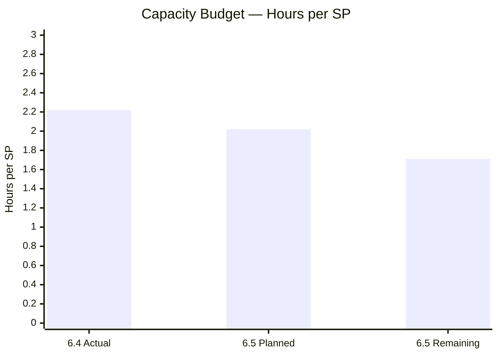

**⚠️ Capacity Pressure:** The remaining work requires 1.71 hrs/SP — tighter than the original plan of 2.02 hrs/SP. The 12 SP of Active stories should close relatively quickly (work already in progress), but the 7 SP of New stories (CADAC + JIT notary) will need to be started and completed within 5 working days.

---

## 6. Work Category Progress

| Category | Stories | SP | Closed SP | Active SP | New SP | % Done |
|---|---|---|---|---|---|---|
| Payables (routinary) | 7 | 17 | 7 | 10 | 0 | 41% |
| Admin Support Services | 5 | 5 | 2 | 2 | 1 | 40% |
| CADAC Training | 2 | 6 | 0 | 0 | 6 | **0%** |
| Ceiling Repair | 1 | 2 | 2 | 0 | 0 | **100%** |
| **Total** | **15** | **30** | **11** | **12** | **7** | **37%** |

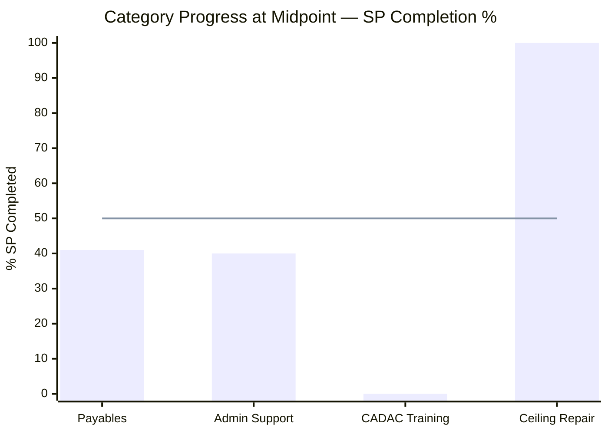

**Observations:**
- **Ceiling Repair:** 100% complete — the multi-iteration feature is done.
- **Payables & Admin Support:** ~40% complete with significant Active pipeline — on track.
- **CADAC Training:** 0% — the only category with zero progress. This represents 20% of total committed SP.

---

## 7. Feature Traceability

| Feature ID | Title | State (Baseline) | **State (Day 5)** | Child Stories | SP | Status |
|---|---|---|---|---|---|---|
| 200287 | Payables 6.5 | Active | **Active** | 6 (2 closed, 3 active, 0 new) | 14 | ✅ In progress |
| 200288 | Admin Support 6.5 | Active | **Active** | 5 (2 closed, 2 active, 1 new) | 5 | ✅ In progress |
| 196719 | CADAC training 2026 | Active | **Active** | 2 (0 closed, 0 active, 2 new) | 6 | ⚠️ Not started |
| 200588 | BFP renewal 2026 | **New** | **Active** ✅ | 1 (0 closed, 1 active, 0 new) | 1 | ✅ FQ Resolved |
| 196416 | Ceiling rust repair | Active | **Closed** ✅ | 1 (1 closed) | 2 | ✅ Complete |
| 199319 | Payables 6.4 (carry-over) | Closed | **Closed** | 1 (1 closed) | 3 | ✅ FN Resolved |

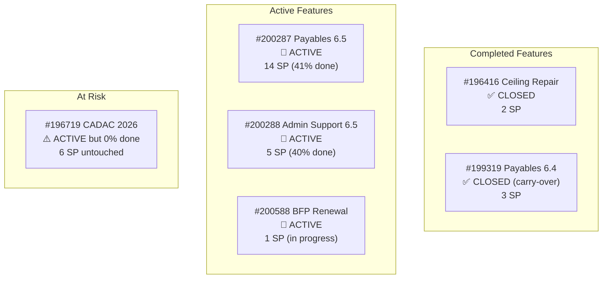

---

## 8. SAFe Compliance Assessment — Iteration 6.5 Midpoint

### 8.1 Category Scoring

**1. PI & Iteration Structure — 8/10 (→ unchanged)**
- Cadence maintained. Iteration 6.5 on track.
- Persistent deductions: PI 2 gap, PI 5 structural issues.

**2. Capacity Planning — 5/10 (→ unchanged)**
- Mark's capacity well-configured (3 activities, realistic hours, day off planned).
- Grace still absent (8th audit). Single capacity source.

**3. Backlog Management — 8/10 (→ unchanged)**
- Good story flow: 47% closed, 33% active, 20% new at midpoint.
- Mid-sprint addition (#200867) is a minor deduction.
- Government payables bottleneck risk successfully managed.

**4. Work Item Quality — 7/10 (→ unchanged)**
- New story #200867 has description + AC — standard maintained.
- AC quality remains minimal ("Attached photo/receipt") for most stories.

**5. Estimation & Velocity — 8/10 (→ unchanged)**
- 100% SP coverage maintained (15/15 including new story).
- Velocity trackable: 11 SP closed at midpoint.

**6. Team Structure & Collaboration — 5/10 (→ unchanged)**
- Mark remains sole contributor. Day off today demonstrates single-person risk.
- No collaborative patterns visible.

**7. Continuous Improvement — 8/10 (↑ from 7/10)**
- Feature #200588 moved to Active as recommended (+1 for acting on audit findings).
- Feature #196416 properly closed after completion.
- Typo in #199324 corrected.
- 3 of 4 audit #7 findings resolved within 1 week.
- Deductions: Grace gap unresolved, WSJF not implemented.

**8. Hierarchy & Traceability — 6/10 (→ unchanged)**
- Story #199324 still parented to closed Feature #199319 (though both now closed).
- Feature states generally consistent with child story states.
- No new hierarchy violations.

### 8.2 Score Comparison

| Audit | Score | Context |
|---|---|---|
| #1 — 6.4 Baseline (Feb 25) | 42/100 | No SP, no AC, no capacity |
| #6 — 6.4 Final (Mar 9) | 62/100 | 100% completion, major improvements |
| #7 — 6.5 Baseline (Mar 9) | 54/100 | New iteration reset |
| **#8 — 6.5 Midpoint (Mar 16)** | **55/100** | **Steady execution, 1 finding resolved** |

```mermaid
xychart-beta
    title "SAFe Compliance by Category — Trend Across Key Audits"
    x-axis ["PI Structure", "Capacity", "Backlog", "WI Quality", "Estimation", "Team", "Improvement", "Traceability"]
    y-axis "Score (out of 10)" 0 --> 10
    bar [8, 1, 4, 3, 1, 4, 5, 6]
    bar [8, 4, 10, 8, 10, 5, 10, 7]
    bar [8, 5, 8, 7, 8, 5, 7, 6]
    bar [8, 5, 8, 7, 8, 5, 8, 6]
```

---

## 9. Risk Register — Iteration 6.5 Midpoint

| # | Risk | Likelihood | Impact | Trend | Mitigation |
|---|---|---|---|---|---|
| R1 | Grace not configured — 8th audit | **Certain** | High | ↑ Escalating | Escalate to management; document workaround |
| R2 | CADAC 6 SP untouched at midpoint | **Medium** | Medium | 🆕 New | Verify training dates for Week 2 |
| R3 | Tight remaining capacity (1.71 hrs/SP) | **Medium** | Medium | ↑ Increased | Monitor daily; prioritize by WSJF if needed |
| R4 | Mid-sprint scope additions pattern | **Low** | Low | 🆕 New | Track scope creep rate per iteration |
| R5 | WSJF not implemented at Feature level | **Medium** | High | → Persistent | Target PI 7 Planning |
| R6 | PI 2 gap and PI 5 structural issues | **Low** | Low | → Persistent | Archive or document before PI 7 |

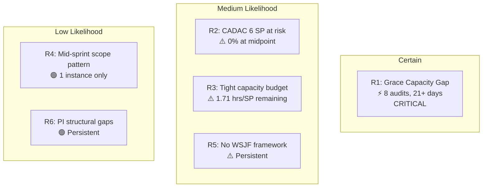

---

## 10. Iteration Completion Forecast

### 10.1 Scenario Analysis

| Scenario | SP Completed | Stories Completed | Completion % | Likelihood |
|---|---|---|---|---|
| **Best case** — All Active + New close | 30/30 SP | 15/15 | 100% | Medium |
| **Likely case** — Active close, CADAC partial | 26/30 SP | 13/15 | 87% | High |
| **Conservative** — Active close, New stays | 23/30 SP | 12/15 | 77% | Medium |

**Key dependency:** The CADAC training stories (6 SP) are the swing factor. If training is scheduled for Week 2 and Mark completes both days, 100% is achievable. If training is delayed or cannot fit in the remaining 5 days alongside 12 SP of active payables/admin work, expect 77-87% completion.

### 10.2 Recommended Daily Focus (Week 2)

| Day | Priority Focus | SP Target |
|---|---|---|
| Mar 17 (Tue) | Close Government payables (#200306, 2 tasks left) | +4 SP |
| Mar 18 (Wed) | Close Electricity + Internet (#200293, #200301) | +6 SP |
| Mar 19 (Thu) | CADAC Training Day 1 (#196725) + TESDA (#200315) | +4 SP |
| Mar 20 (Fri) | CADAC Training Day 2 (#199466) + BFP follow-up (#200613) | +4 SP |
| Mar 21-22 | JIT contract notary (#200482) + buffer | +1 SP |

---

## 11. Action Items

| # | Action | Owner | Priority | Target |
|---|---|---|---|---|
| 1 | **Configure Grace's capacity** — 8th consecutive audit without resolution | Team Lead | **CRITICAL** | Immediate |
| 2 | **Verify CADAC training dates** — 6 SP at risk if not scheduled this week | Mark Colina | **HIGH** | Mar 17 |
| 3 | **Close Government payables** — 2 remaining tasks (PHIC JIT + Jairosoft) | Mark Colina | MEDIUM | Mar 17 |
| 4 | **Track mid-sprint additions** as a retrospective metric | Team | LOW | Retrospective |
| 5 | **Begin WSJF scoring** at Feature level for PI 7 preparation | Product Owner | MEDIUM | PI 7 Planning |

---

## 12. Conclusion

**Iteration 6.5 is tracking well at the midpoint.** The team has closed 47% of stories (7/15) and 57% of tasks (17/30) halfway through the sprint. The execution discipline demonstrated in Iteration 6.4 is carrying forward — the government payables bottleneck risk flagged in audit #7 was proactively managed and largely resolved.

Three findings from audit #7 were addressed within one week (FN, FO, FQ), showing strong responsiveness to audit recommendations. The Continuous Improvement score increased to 8/10 as a result.

**The primary risk for full completion is the CADAC training block (6 SP, 20%).** These stories have zero progress at the midpoint and represent the largest untouched work. Mark's capacity budget is tighter in the second week (1.71 hrs/SP vs. 2.02 planned), so prioritization will be important.

**Grace's capacity remains the audit series' most critical persistent finding** at 21+ days and 8 consecutive audits. This should be escalated to management if it hasn't been already.

**Iteration 6.5 Midpoint Status: ON TRACK — with CADAC scheduling as the key risk to monitor**
**Next Audit: Recommended for March 20, 2026 (Day 9) for pre-close assessment**

---

*Report generated on March 16, 2026 | SAFe 6.0 Framework Standards*
*Auditor: AI Agile PM Consultant*
*Audit Series: #8 — 2nd audit for Iteration 6.5*
