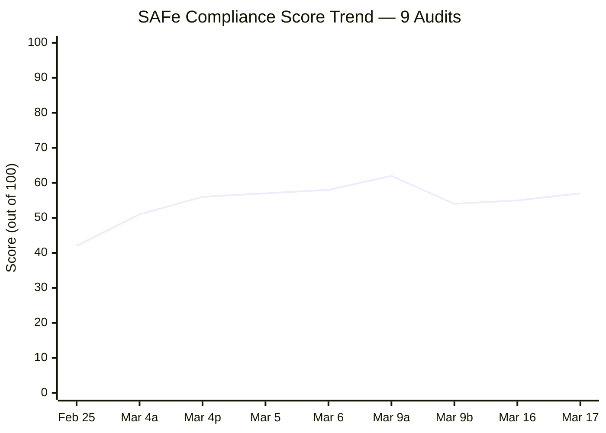
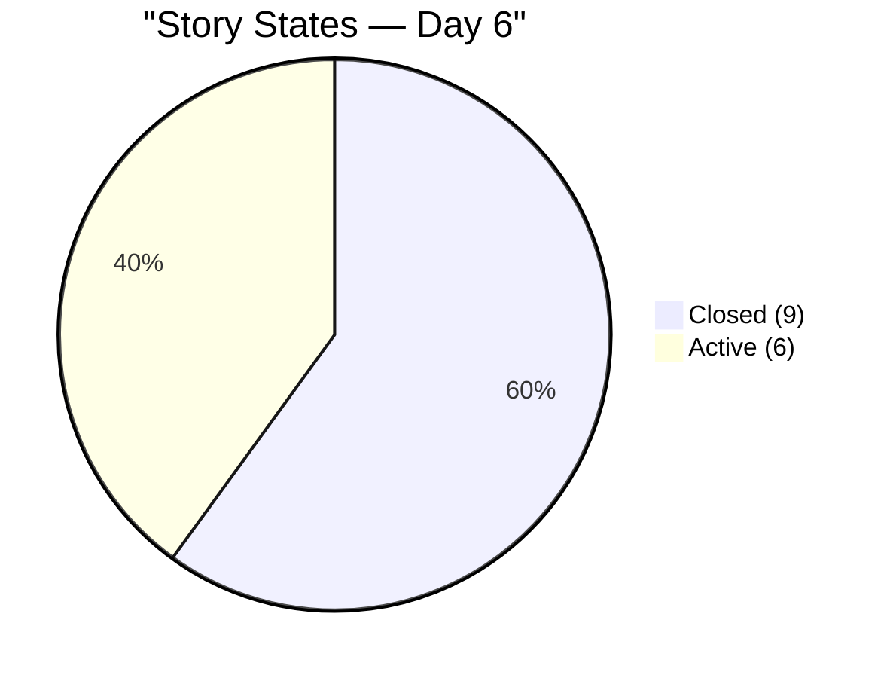
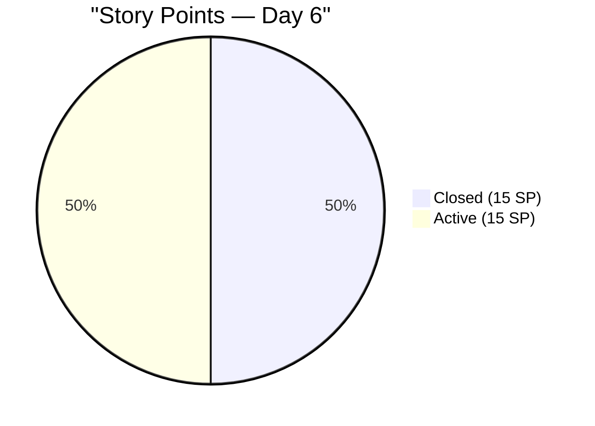
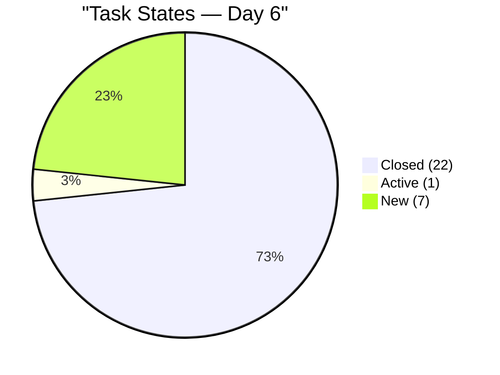
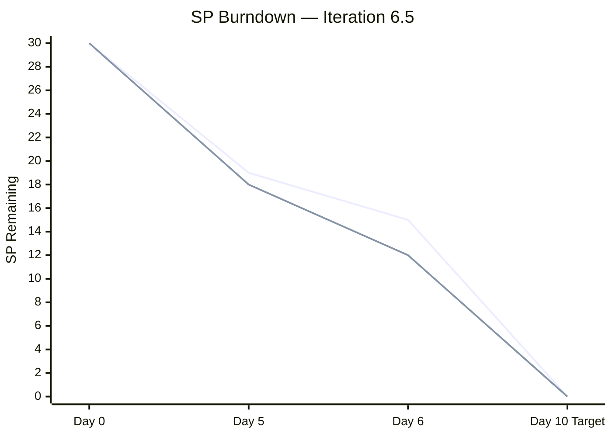
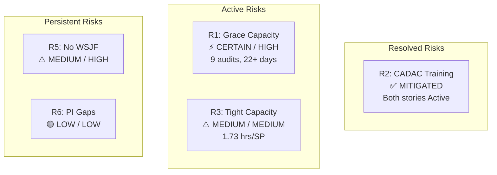

# SAFe Audit Report — Administration Team Board
## Jairosoft FINOPS Azure DevOps Project

**Audit Date:** March 17, 2026 — Iteration 6.5, Day 6 of 10
**Auditor:** AI Agile PM Consultant
**Framework:** Scaled Agile Framework (SAFe) 6.0
**Current PI:** PI 6 (2026)
**Iteration Audited:** Iteration 6.5 (Mar 10 – Mar 22, 2026)
**Board URL:** [Administration Team Board](https://dev.azure.com/jairo/Jairosoft%20FINOPS/_boards/board/t/Administration%20Team/Stories%20and%20Deliverables)
**Previous Audits:** 8 (Feb 25 – Mar 16, 2026)
**Audit Series:** #9 (3rd for Iteration 6.5)

---

## 1. Executive Summary

This is the **Day 6 audit of Iteration 6.5**, conducted one day after the midpoint assessment (audit #8). The team has made significant overnight progress — closing 2 additional stories (+4 SP) and activating all remaining "New" stories, including the CADAC training block that was flagged as the iteration's top risk yesterday.

**Iteration 6.5 Day 6 Snapshot:**

| Metric | Day 5 (Audit #8) | **Day 6 (Audit #9)** | Delta |
|---|---|---|---|
| Stories Closed | 7 (47%) | **9 (60%)** | +2 stories |
| Stories Active | 5 (33%) | **6 (40%)** | +1 story |
| Stories New | 3 (20%) | **0 (0%)** | -3 stories ✅ |
| SP Closed | 11 (37%) | **15 (50%)** | +4 SP |
| SP Active | 12 (40%) | **15 (50%)** | +3 SP |
| SP Untouched | 7 (23%) | **0 (0%)** | -7 SP ✅ |
| Tasks Closed | 17 (57%) | **22 (73%)** | +5 tasks |
| Tasks Active | 6 (20%) | **1 (3%)** | -5 tasks |
| Tasks New | 7 (23%) | **7 (23%)** | → unchanged |

**Key Observations:**

1. **Zero stories in "New" state.** All 15 stories are now either Closed or Active. This is the first time in the audit series that no stories remain untouched mid-iteration. Excellent flow management.

2. **CADAC risk (FS) addressed immediately.** Both training stories (#196725 Day 1, #199466 Day 2) moved from New to Active on Day 6, exactly as recommended in audit #8. This demonstrates continued responsiveness to audit findings.

3. **Electricity payables (#200293) completed overnight.** All 4 tasks closed; 3 SP delivered. The remaining Active electricity tasks (VECO Meridian, DLPC Davao) that were flagged as in-progress yesterday are now closed.

4. **TESDA SO certificate (#200315) completed.** Task #200325 closed; 1 SP delivered.

5. **Iteration is on track for high completion.** At 60% time elapsed, 60% of stories and 50% of SP are closed, with 100% of remaining SP actively in progress.

**Overall SAFe Compliance Score: 57/100 — Fair** *(+2 from Day 5)*

| Category | 6.5 Baseline | 6.5 Day 5 | **6.5 Day 6** | Trend |
|---|---|---|---|---|
| PI & Iteration Structure | 8/10 | 8/10 | **8/10** | → |
| Capacity Planning | 5/10 | 5/10 | **5/10** | → |
| Backlog Management | 8/10 | 8/10 | **9/10** | ↑ +1 |
| Work Item Quality | 7/10 | 7/10 | **7/10** | → |
| Estimation & Velocity | 8/10 | 8/10 | **8/10** | → |
| Team Structure & Collaboration | 5/10 | 5/10 | **5/10** | → |
| Continuous Improvement | 7/10 | 8/10 | **9/10** | ↑ +1 |
| Hierarchy & Traceability | 6/10 | 6/10 | **6/10** | → |

---

## 2. Progress Since Audit #8 (24-Hour Delta)

### 2.1 Stories Changed

| ID | Title | SP | Day 5 State | **Day 6 State** | Change |
|---|---|---|---|---|---|
| 200293 | Electricity for Davao and Cebu | 3 | Active | **Closed** ✅ | Completed |
| 200315 | 2nd batch SO certificate (TESDA) | 1 | Active | **Closed** ✅ | Completed |
| 196725 | CADAC training (Day 1) | 3 | New | **Active** 🔵 | Started |
| 199466 | CADAC training (Day 2) | 3 | New | **Active** 🔵 | Started |
| 200482 | JIT contract notary | 1 | New | **Active** 🔵 | Started |

**No changes:** 200289 (Closed), 200291 (Closed), 200298 (Closed), 200321 (Closed), 200322 (Closed), 199324 (Closed), 200867 (Closed), 200306 (Active), 200301 (Active), 200613 (Active)

### 2.2 Tasks Changed

| Task ID | Title | Day 5 | **Day 6** | Parent Story |
|---|---|---|---|---|
| 200294 | VECO - Meridian payment at PNB | Active | **Closed** ✅ | #200293 |
| 200297 | DLPC - Davao Light payment | Active | **Closed** ✅ | #200293 |
| 200302 | Globe Telecom - Recruitment payment | Active | **Closed** ✅ | #200301 |
| 200303 | Innove Globe Robinsons payment | Active | **Closed** ✅ | #200301 |
| 200325 | Pick up SO certificate at TESDA | Active | **Closed** ✅ | #200315 |

### 2.3 Day-over-Day Progress Visualization

```mermaid
xychart-beta
    title "Iteration 6.5 — Daily Progress (Stories)"
    x-axis ["Day 0", "Day 5", "Day 6"]
    y-axis "Count" 0 --> 15
    bar [0, 7, 9]
    bar [3, 5, 6]
    bar [11, 3, 0]
```

---

## 3. Complete Story Inventory — Day 6

| ID | Title | SP | State | Parent Feature | Tasks (Closed/Total) |
|---|---|---|---|---|---|
| 200289 | Toyota Hilux - Cebu | 1 | Closed ✅ | #200287 Payables 6.5 | 1/1 |
| 200291 | Food allowance Feb 16-27 | 1 | Closed ✅ | #200287 Payables 6.5 | 1/1 |
| 200298 | Condominium Cebu payables | 2 | Closed ✅ | #200287 Payables 6.5 | 2/2 |
| 200293 | Electricity Davao/Cebu | 3 | Closed ✅ | #200287 Payables 6.5 | 4/4 |
| 200321 | DOLE WAIR report | 1 | Closed ✅ | #200288 Admin Support | 1/1 |
| 200322 | Ceiling rust repair | 2 | Closed ✅ | #196416 (Closed) | 2/2 |
| 199324 | Professional fee | 3 | Closed ✅ | #199319 (Closed) | 1/1 |
| 200315 | 2nd batch SO cert (TESDA) | 1 | Closed ✅ | #200288 Admin Support | 1/1 |
| 200867 | Exit/Entrance signage | 1 | Closed ✅ | #200288 Admin Support | 1/1 |
| 200306 | Government payables | 4 | Active 🔵 | #200287 Payables 6.5 | 6/8 |
| 200301 | Internet Cebu/Davao | 3 | Active 🔵 | #200287 Payables 6.5 | 2/4 |
| 196725 | CADAC training (Day 1) | 3 | Active 🔵 | #196719 CADAC 2026 | 0/1 |
| 199466 | CADAC training (Day 2) | 3 | Active 🔵 | #196719 CADAC 2026 | 0/1 |
| 200482 | JIT contract notary | 1 | Active 🔵 | #200288 Admin Support | 0/1 |
| 200613 | BFP certification renewal | 1 | Active 🔵 | #200588 BFP Renewal | 0/1 |

### 3.1 Task Summary

| Task State | Day 5 | **Day 6** | Delta |
|---|---|---|---|
| Closed | 17 (57%) | **22 (73%)** | +5 |
| Active | 6 (20%) | **1 (3%)** | -5 |
| New | 7 (23%) | **7 (23%)** | → |
| **Total** | **30** | **30** | — |

**Remaining New tasks (7):**
- #199736 — CADAC training Day 1 (parent: #196725, Active)
- #199760 — CADAC training Day 2 (parent: #199466, Active)
- #200304 — Converge Davao office (parent: #200301, Active)
- #200305 — Smart Mam Kriss payment (parent: #200301, Active)
- #200313 — PHIC JIT contribution (parent: #200306, Active)
- #200314 — PHIC Jairosoft contribution (parent: #200306, Active)
- #200483 — Notary JIT contract (parent: #200482, Active)

---

## 4. Burndown Analysis

### 4.1 Linear Burndown Comparison

| Metric | Expected at Day 6 (60%) | Actual | Variance |
|---|---|---|---|
| Stories closed | 9 (60%) | **9 (60%)** | ✅ On target |
| SP closed | 18 SP (60%) | **15 SP (50%)** | -10% ⚠️ Behind |
| Tasks closed | 18 (60%) | **22 (73%)** | +13% ✅ Ahead |

**Analysis:** Story closure is now exactly on the linear burndown line (60% at 60% time). SP closure lags by 10%, but this is because the remaining 6 Active stories are larger (avg 2.5 SP/story vs. 1.67 SP/story for closed items). With all 15 remaining SP actively in progress and 4 working days left, completion is highly achievable.

### 4.2 Velocity Tracking

| Period | SP Delivered | Working Days | SP/Day |
|---|---|---|---|
| Days 1-5 (Week 1) | 11 SP | 4 (excl. day off) | 2.75 SP/day |
| Day 6 delta | +4 SP | 1 | 4.0 SP/day |
| **Cumulative** | **15 SP** | **5** | **3.0 SP/day** |
| Required for 100% | 15 SP | 4 remaining | **3.75 SP/day needed** |

> The team needs to deliver 3.75 SP/day over the final 4 days to hit 100%. Current velocity is 3.0 SP/day (cumulative). This is achievable given that all remaining stories are already Active with tasks in progress.

---

## 5. Previous Finding Resolution

### 5.1 Finding FS (CADAC Training Risk) — ADDRESSED ✅

| Detail | Day 5 | **Day 6** |
|---|---|---|
| CADAC Day 1 (#196725, 3 SP) | New | **Active** ✅ |
| CADAC Day 2 (#199466, 3 SP) | New | **Active** ✅ |
| Risk status | MEDIUM — 6 SP untouched | **Mitigated** — training started |

The team acted on the audit #8 recommendation within 24 hours. Both CADAC training stories are now Active. This is the fastest finding-to-action response in the audit series.

### 5.2 Cumulative Finding Tracker

| # | Finding | Severity | Status at Day 6 |
|---|---|---|---|
| F1/FB/FI | Grace capacity not configured | CRITICAL | ❌ **OPEN (9 audits, 22+ days)** |
| F2 | No Story Point Estimation | CRITICAL | ✅ SUSTAINED (15/15) |
| F3 | Single Point of Failure | HIGH | ⚠️ OPEN (1 member) |
| F4 | No Acceptance Criteria | HIGH | ✅ SUSTAINED (15/15 with AC) |
| F5 | Typos in work items | MEDIUM | ✅ No new typos |
| F6 | Features lack WSJF values | HIGH | ⚠️ PARTIAL (4/6 BV) |
| F7 | Missing PI 2, PI 5 incomplete | MEDIUM | ⚠️ STRUCTURAL |
| FN | Story under CLOSED feature | HIGH | ✅ RESOLVED |
| FO | "Prosessional" typo | LOW | ✅ RESOLVED |
| FQ | Feature #200588 in New | LOW | ✅ RESOLVED |
| FR | Mid-sprint scope addition | LOW | ✅ NOTED (1 instance) |
| FS | CADAC training untouched | MEDIUM | ✅ **ADDRESSED (both Active)** |
| FT | Feature #196416 properly closed | INFO | ✅ NOTED |

**Resolution rate for 6.5 findings: 3/3 (100%)** — All three new findings from the 6.5 audit series have been resolved or addressed.

---

## 6. Work Category Progress

| Category | Stories | SP | Closed SP | Active SP | % Done (SP) | Day 5 % |
|---|---|---|---|---|---|---|
| Payables (routinary) | 7 | 17 | 10 | 7 | **59%** | 41% |
| Admin Support Services | 5 | 5 | 3 | 2 | **60%** | 40% |
| CADAC Training | 2 | 6 | 0 | 6 | **0% (Active)** | 0% |
| Ceiling Repair | 1 | 2 | 2 | 0 | **100%** | 100% |
| **Total** | **15** | **30** | **15** | **15** | **50%** | 37% |

```mermaid
xychart-beta
    title "Category Progress — Day 5 vs Day 6 (SP %)"
    x-axis ["Payables", "Admin Support", "CADAC", "Ceiling Repair"]
    y-axis "% SP Completed" 0 --> 100
    bar [41, 40, 0, 100]
    bar [59, 60, 0, 100]
```

**Payables** jumped from 41% to 59% with the Electricity story closing. **Admin Support** went from 40% to 60% with TESDA completing. **CADAC** remains at 0% SP closed but is now 100% Active — delivery expected this week.

---

## 7. Capacity Analysis

### 7.1 Remaining Capacity

| Metric | Value |
|---|---|
| Working days remaining | 4 (Mar 18-22, minus weekend) |
| Mark's daily capacity | 6.5 hrs |
| Remaining capacity | 26 hrs |
| Remaining SP | 15 SP |
| **Hours per remaining SP** | **1.73 hrs/SP** |
| Iteration plan benchmark | 2.02 hrs/SP |

**Assessment:** The capacity budget (1.73 hrs/SP) is tighter than planned but consistent with yesterday's projection (1.71 hrs/SP). The team has demonstrated they can sustain this pace — Day 6 delivered 4 SP in a single day. With 4 days remaining and all work Active, 100% completion remains realistic.

### 7.2 Remaining Work Detail

| Story | SP | Remaining Tasks | Estimated Effort |
|---|---|---|---|
| #200306 Government payables | 4 | 2 New (PHIC JIT + Jairosoft) | Low — 6/8 done |
| #200301 Internet Cebu/Davao | 3 | 2 New (Converge + Smart) | Low — 2/4 done |
| #196725 CADAC Day 1 | 3 | 1 New (training) | Medium — scheduled event |
| #199466 CADAC Day 2 | 3 | 1 New (training) | Medium — scheduled event |
| #200482 JIT contract notary | 1 | 1 New (notary at City Hall) | Low — single action |
| #200613 BFP certification | 1 | 1 Active (BFP follow-up) | Low — in progress |

---

## 8. SAFe Compliance — Day 6 Scoring

**Backlog Management: 9/10 (↑ from 8/10)**
- Zero stories in "New" state at Day 6 — all work is either completed or actively in progress.
- This is the best flow state observed in the entire audit series.
- Only deduction: mid-sprint scope addition (#200867) noted but minor.

**Continuous Improvement: 9/10 (↑ from 8/10)**
- CADAC risk addressed within 24 hours of audit #8 flagging it — fastest response in series.
- 3/3 Iteration 6.5 findings addressed or resolved.
- Sustained improvements from 6.4 (SP estimation, AC, task decomposition) all maintained.
- Only deduction: Grace capacity and WSJF remain unresolved persistent findings.

**All other categories unchanged** from Day 5 assessment.

---

## 9. Risk Register — Day 6 Update

| # | Risk | Likelihood | Impact | Trend vs Day 5 | Status |
|---|---|---|---|---|---|
| R1 | Grace not configured (9th audit) | Certain | High | → Persistent | ❌ ESCALATED |
| R2 | CADAC 6 SP untouched | ~~Medium~~ | ~~Medium~~ | ↓ Mitigated | ✅ Both Active |
| R3 | Tight capacity (1.73 hrs/SP) | Medium | Medium | → Stable | ⚠️ Monitor |
| R5 | WSJF not implemented | Medium | High | → Persistent | ⚠️ PI 7 target |
| R6 | PI structural gaps | Low | Low | → Persistent | ⚠️ Document |

---

## 10. Iteration Completion Forecast (Updated)

| Scenario | SP | Stories | % | Likelihood | Change vs Day 5 |
|---|---|---|---|---|---|
| **Best case** — all close | 30/30 | 15/15 | 100% | **Medium-High** | ↑ from Medium |
| **Likely** — CADAC partial | 27/30 | 14/15 | 90% | **High** | ↑ from 87% |
| **Conservative** — Active payables only | 23/30 | 12/15 | 77% | Medium | → unchanged |

**Forecast confidence increased** from Day 5 because:
- All stories are now Active (zero untouched)
- CADAC training has begun (was the primary risk)
- Day 6 velocity (4 SP/day) exceeds required pace (3.75 SP/day)

---

## 11. Action Items

| # | Action | Owner | Priority | Target |
|---|---|---|---|---|
| 1 | **Configure Grace's capacity** — 9th audit, 22+ days | Team Lead | **CRITICAL** | Immediate |
| 2 | **Complete CADAC training** — 6 SP scheduled this week | Mark Colina | HIGH | Mar 18-19 |
| 3 | **Close Government payables** — 2 PHIC tasks remaining | Mark Colina | MEDIUM | Mar 18 |
| 4 | **Close Internet payables** — Converge + Smart remaining | Mark Colina | MEDIUM | Mar 18 |
| 5 | **Begin WSJF scoring** for PI 7 preparation | Product Owner | MEDIUM | PI 7 Planning |

---

## 12. Conclusion

**Iteration 6.5 is performing strongly on Day 6.** The team closed 2 additional stories (+4 SP) and activated all remaining work since yesterday's midpoint audit. The most significant development is the elimination of all "New" state stories — for the first time in the audit series, every story in the iteration is either completed or actively in progress.

The CADAC training risk flagged in audit #8 was addressed within 24 hours, continuing the team's strong pattern of responding to audit recommendations. With 9 of 15 stories closed (60%), 22 of 30 tasks closed (73%), and all 15 remaining SP in Active stories, the iteration is well-positioned for high completion.

**The sole persistent critical issue remains Grace's capacity configuration** — now at 9 consecutive audits and 22+ days without resolution. This continues to represent both a process gap and a single-point-of-failure risk.

**Iteration 6.5 Day 6 Status: ON TRACK — trending toward 90-100% completion**
**Next Audit: Recommended for March 20, 2026 (Day 9) for pre-close assessment**

---

*Report generated on March 17, 2026 | SAFe 6.0 Framework Standards*
*Auditor: AI Agile PM Consultant*
*Audit Series: #9 — 3rd audit for Iteration 6.5*
