# SAFe Audit Report — Administration Team Board
## Jairosoft FINOPS Azure DevOps Project

**Audit Date:** March 18, 2026 — Iteration 6.5, Day 7 of 10
**Auditor:** AI Agile PM Consultant
**Framework:** Scaled Agile Framework (SAFe) 6.0
**Current PI:** PI 6 (2026)
**Iteration Audited:** Iteration 6.5 (Mar 10 – Mar 22, 2026)
**Board URL:** [Administration Team Board](https://dev.azure.com/jairo/Jairosoft%20FINOPS/_boards/board/t/Administration%20Team/Stories%20and%20Deliverables)
**Previous Audits:** 9 (Feb 25 – Mar 17, 2026)
**Audit Series:** #10 (4th for Iteration 6.5)

---

## 1. Executive Summary

This is the **Day 7 audit of Iteration 6.5**, with 2 working days remaining after today. The team closed one additional story overnight — a second mid-sprint addition (#201210, BIR transfer tax) that was created and completed the same day. The overall scope has grown to 16 stories / 31 SP, and the iteration sits at 52% SP closure with all remaining work actively in progress.

**Iteration 6.5 — Day 7 Snapshot:**

| Metric | Day 6 (Audit #9) | **Day 7 (Audit #10)** | Delta |
|---|---|---|---|
| Total Stories | 15 | **16** (+1 mid-sprint) | +1 |
| Total SP | 30 | **31** (+1 SP added) | +1 |
| Stories Closed | 9 (60%) | **10 (62.5%)** | +1 |
| Stories Active | 6 (40%) | **6 (37.5%)** | → |
| Stories New | 0 (0%) | **0 (0%)** | → ✅ |
| SP Closed | 15 (50%) | **16 (51.6%)** | +1 SP |
| SP Active (in-flight) | 15 (50%) | **15 (48.4%)** | → |
| Tasks Closed | 22/30 (73%) | **23/31 (74.2%)** | +1 |
| Tasks Active | 1 (3%) | **1 (3.2%)** | → |
| Tasks New | 7 (23%) | **7 (22.6%)** | → |

**Key Observations:**

1. **Second mid-sprint scope addition.** Story #201210 (BIR transfer tax, 1 SP) was created at 00:07 UTC and closed at 05:31 UTC today — a same-day turnaround. This is the 2nd unplanned addition (after #200867 on Day 2), bringing cumulative scope creep to 2 SP / 6.9% over the original 29 SP commitment.

2. **Velocity gap widening.** SP closure rate (51.6%) is falling behind the time-elapsed rate (70%). The team needs 15 SP in ~2.5 remaining working days (5.0+ SP/day), significantly above the cumulative 2.67 SP/day average. The CADAC training block (6 SP) and Government payables (4 SP) are the critical paths.

3. **CADAC training still Active but untested.** Both training stories (#196725, #199466) moved to Active on Day 6 but their tasks (#199736, #199760) remain in "New" state. If training hasn't physically occurred yet, 6 SP (19% of total) is at serious risk.

4. **Government payables stalled.** Story #200306 (4 SP, 8 tasks) has been Active since Day 4 with 6/8 tasks closed, but the remaining 2 PHIC tasks (#200313, #200314) are still "New" — unchanged for 5 days.

5. **Zero stories in New state maintained.** All 16 stories remain Closed or Active — the flow discipline from Day 6 continues.

**Overall SAFe Compliance Score: 57/100 — Fair** *(unchanged from Day 6)*

| Category | 6.5 Base | Day 5 | Day 6 | **Day 7** | Trend |
|---|---|---|---|---|---|
| PI & Iteration Structure | 8/10 | 8/10 | 8/10 | **8/10** | → |
| Capacity Planning | 5/10 | 5/10 | 5/10 | **5/10** | → |
| Backlog Management | 8/10 | 8/10 | 9/10 | **8/10** | ↓ -1 |
| Work Item Quality | 7/10 | 7/10 | 7/10 | **7/10** | → |
| Estimation & Velocity | 8/10 | 8/10 | 8/10 | **8/10** | → |
| Team Structure & Collaboration | 5/10 | 5/10 | 5/10 | **5/10** | → |
| Continuous Improvement | 7/10 | 8/10 | 9/10 | **9/10** | → |
| Hierarchy & Traceability | 6/10 | 6/10 | 6/10 | **7/10** | ↑ +1 |

> Backlog Management dropped 1 point due to the 2nd mid-sprint addition (cumulative scope creep now 6.9%). Hierarchy & Traceability gained 1 point because all new stories have proper parent features and the #201210 addition was well-structured with description, AC, and SP.

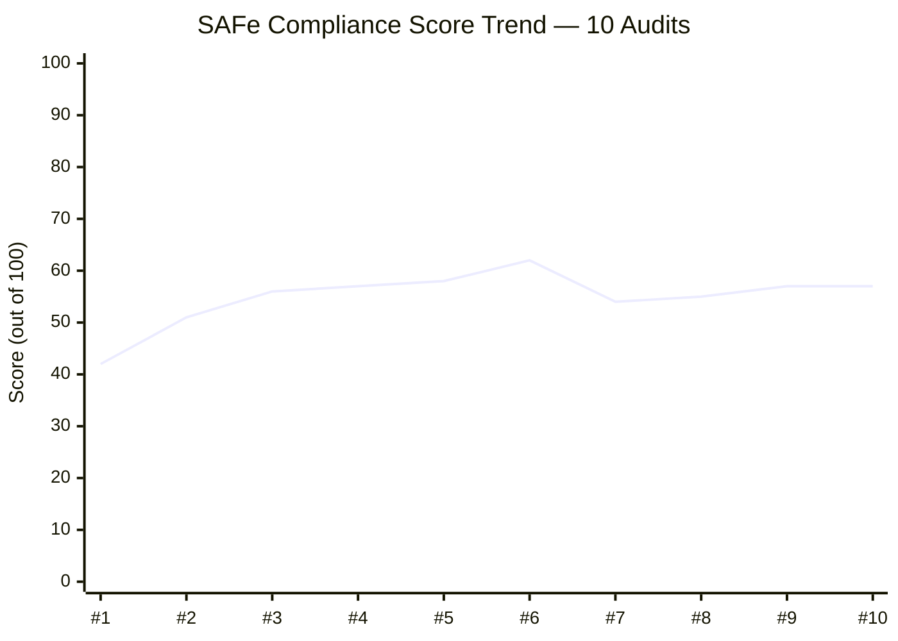

---

## 2. Sprint Goal Probability

### 2.1 Daily Probability Trend (Day 0 → Day 7)

| Day | Date | SP Closed | Cumul % | Stories (C/A/N) | Tasks Closed | P(100%) | Trend |
|---|---|---|---|---|---|---|---|
| 0 | Mar 9 | 0/29 | 0.0% | 0/3/11 | 0/29 | **71.0%** | — |
| 1 | Mar 10 | 2/30 | 6.7% | 1/4/10 | 3/29 | **71.5%** | +0.5% |
| 2 | Mar 11 | 5/30 | 16.7% | 4/4/7 | 8/30 | **78.6%** | +7.1% |
| 3 | Mar 12 | 6/30 | 20.0% | 5/4/6 | 9/30 | **71.8%** | -6.8% |
| 4 | Mar 13 | 11/30 | 36.7% | 7/5/3 | 17/30 | **84.9%** | +13.1% |
| 5 | Mar 16 | 11/30 | 36.7% | 7/5/3 | 17/30 | **78.4%** | -6.5% |
| 6 | Mar 17 | 15/30 | 50.0% | 9/6/0 | 22/30 | **85.0%** | +6.6% |
| **7** | **Mar 18** | **16/31** | **51.6%** | **10/6/0** | **23/31** | **78.3%** | **-6.7%** |

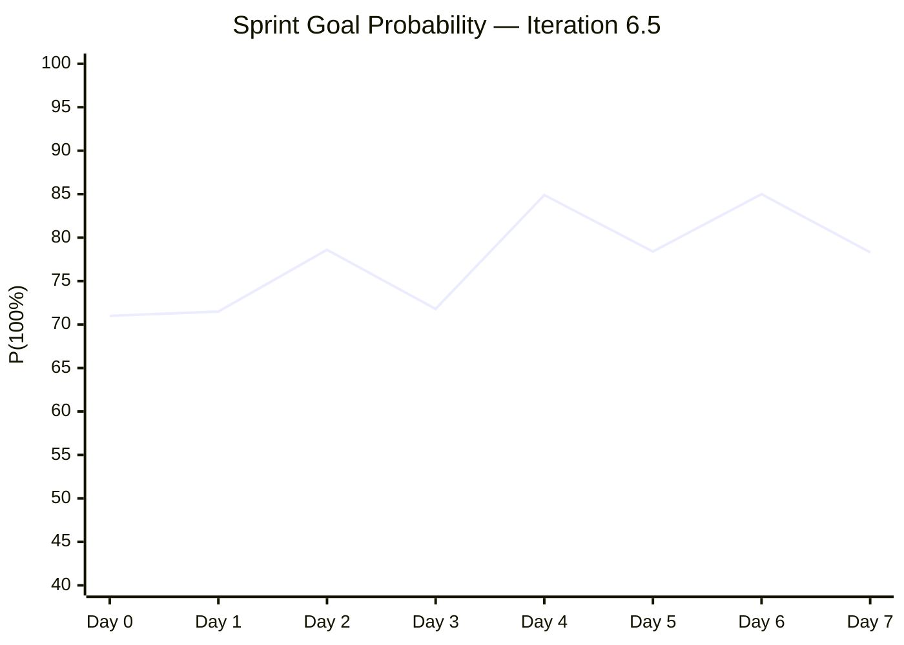

### 2.2 Probability Factor Breakdown — Day 7

| Factor | Weight | Day 6 Score | **Day 7 Score** | Change | Rationale |
|---|---|---|---|---|---|
| Burndown Pace | 30% | 83.3% | **73.7%** | ↓ -9.6 | 51.6% done at 70% time (gap widened) |
| Velocity Sufficiency | 25% | 72.0% | **53.4%** | ↓ -18.6 | Need 5.0 SP/day vs 2.67 avg (gap critical) |
| WIP Health | 20% | 92.0% | **93.2%** | ↑ +1.2 | 6/6 Active + 23/31 tasks closed |
| Historical Performance | 10% | 85.0% | **85.0%** | → | 6.4 was 100%; team reliable |
| Capacity Buffer | 15% | 80.0% | **65.0%** | ↓ -15.0 | 16.25 hrs left for 15 SP (1.08 hrs/SP) |
| **Weighted Total** | **100%** | — | — | — | **78.3%** |

**Why the probability dropped 6.7%:** Only 1 SP was delivered between Day 6 and Day 7 (the mid-sprint BIR story), while an entire working day elapsed. The velocity-to-remaining-work ratio tightened significantly. The CADAC training tasks remaining in "New" state (despite stories being Active) is the primary concern.

### 2.3 SP Burndown Chart

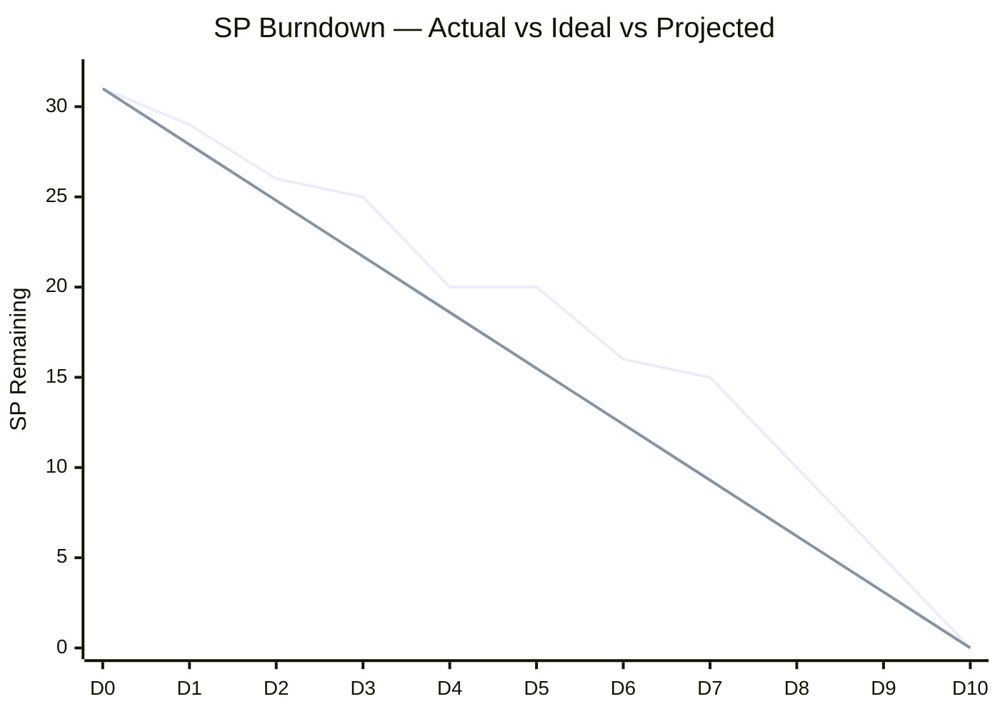

> **Actual** (solid) is above **Ideal** (dashed) by 5.7 SP at Day 7. The team must accelerate to close the gap.

---

## 3. Complete Work Item Inventory — Day 7

### 3.1 Stories

| ID | Title | SP | State | Parent Feature | Tasks (C/T) | Tags | Closed Date |
|---|---|---|---|---|---|---|---|
| 200322 | Ceiling rust repair 3rd/2nd floor | 2 | Closed ✅ | #196416 | 2/2 | on-going | Mar 10 |
| 200289 | Toyota Hilux - Cebu | 1 | Closed ✅ | #200287 | 1/1 | routinary | Mar 11 |
| 200291 | Food allowance Feb 16-27 | 1 | Closed ✅ | #200287 | 1/1 | routinary | Mar 11 |
| 200321 | DOLE WAIR report | 1 | Closed ✅ | #200288 | 1/1 | Admin Support | Mar 11 |
| 200867 | Exit/Entrance signage | 1 | Closed ✅ | #200288 | 1/1 | — | Mar 12 |
| 199324 | Professional fee | 3 | Closed ✅ | #199319 | 1/1 | — | Mar 13 |
| 200298 | Condo Cebu payables | 2 | Closed ✅ | #200287 | 2/2 | routinary | Mar 13 |
| 200293 | Electricity Davao/Cebu | 3 | Closed ✅ | #200287 | 4/4 | routinary | Mar 17 |
| 200315 | 2nd batch SO cert (TESDA) | 1 | Closed ✅ | #200288 | 1/1 | Admin Support | Mar 17 |
| 201210 | BIR transfer tax | 1 | Closed ✅ | #200288 | 1/1 | — | **Mar 18** |
| 200306 | Government payables | 4 | Active 🔵 | #200287 | 6/8 | routinary | — |
| 200301 | Internet Cebu/Davao | 3 | Active 🔵 | #200287 | 2/4 | routinary | — |
| 196725 | CADAC training Day 1 | 3 | Active 🔵 | #196719 | 0/1 | CADAC | — |
| 199466 | CADAC training Day 2 | 3 | Active 🔵 | #196719 | 0/1 | CADAC | — |
| 200482 | JIT contract notary | 1 | Active 🔵 | #200288 | 0/1 | Admin Support | — |
| 200613 | BFP certification renewal | 1 | Active 🔵 | #200588 | 0/1 | Admin Support | — |

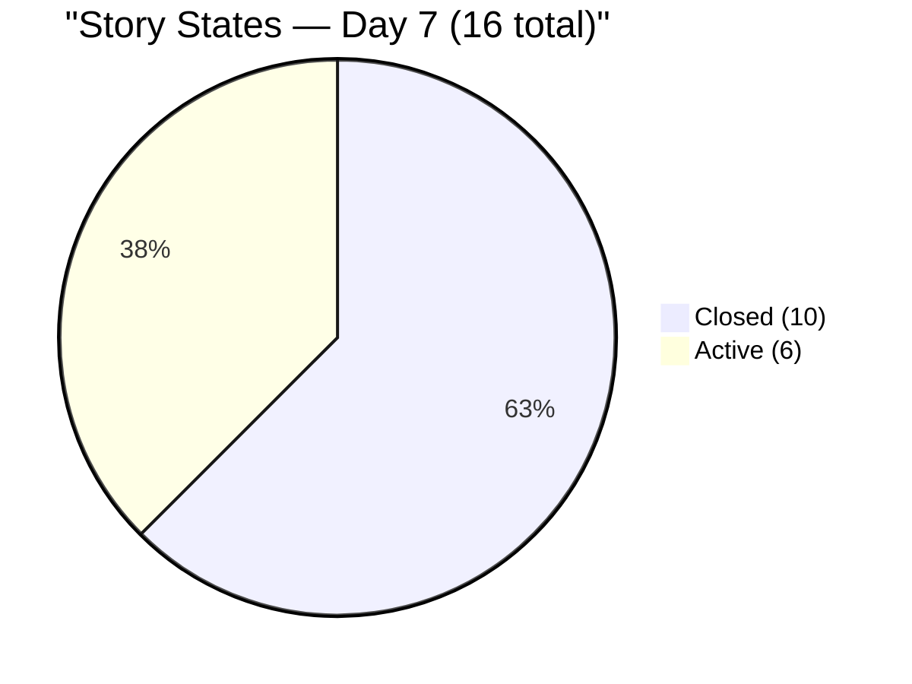

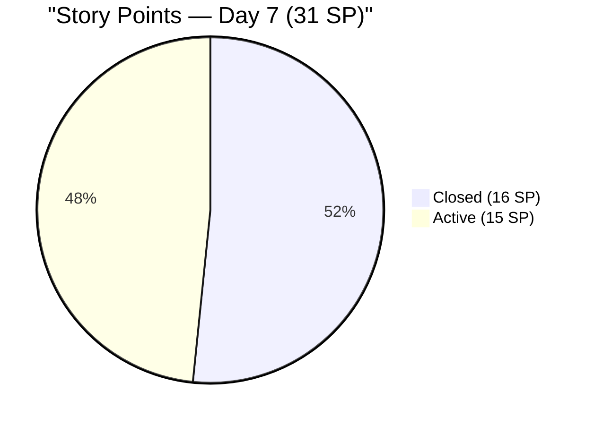

### 3.2 Task Summary

| State | Count | % | Change vs Day 6 |
|---|---|---|---|
| Closed | 23 | 74.2% | +1 |
| Active | 1 | 3.2% | → |
| New | 7 | 22.6% | → |
| **Total** | **31** | 100% | +1 (new task #201211) |

**Remaining tasks (8 not Closed):**

| Task ID | Title | State | Parent Story | Concern |
|---|---|---|---|---|
| 199736 | CADAC training Day 1 | **New** | #196725 (Active) | ⚠️ Active story, New task — 2 days since activation |
| 199760 | CADAC training Day 2 | **New** | #199466 (Active) | ⚠️ Same concern |
| 200313 | PHIC JIT contribution | **New** | #200306 (Active) | ⚠️ Stalled 5 days |
| 200314 | PHIC Jairosoft contribution | **New** | #200306 (Active) | ⚠️ Stalled 5 days |
| 200304 | Converge Davao payment | **New** | #200301 (Active) | Monitor |
| 200305 | Smart Mam Kriss payment | **New** | #200301 (Active) | Monitor |
| 200483 | JIT contract notary | **New** | #200482 (Active) | Monitor |
| 200614 | BFP follow-up | **Active** | #200613 (Active) | In progress |

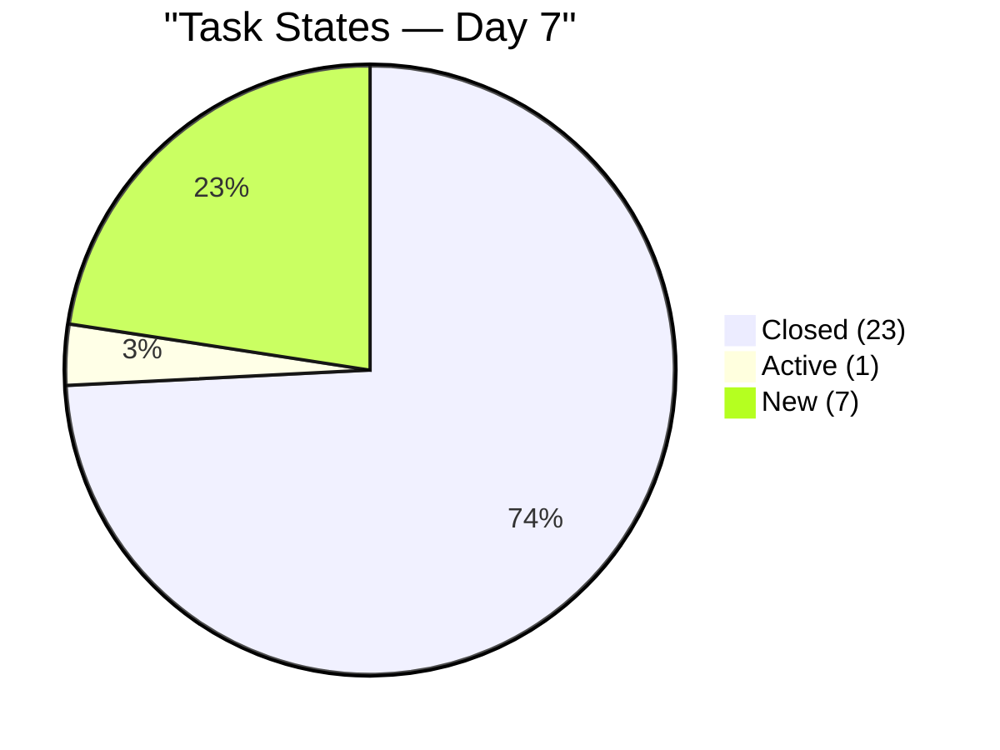

---

## 4. Delta Analysis — Audit #9 (Day 6) → Audit #10 (Day 7)

### 4.1 What Changed

| Item | Day 6 State | Day 7 State | Change |
|---|---|---|---|
| #201210 BIR transfer tax (story) | *N/A* | **Closed** | 🆕 Added + Closed same day |
| #201211 BIR transfer tax (task) | *N/A* | **Closed** | 🆕 Added + Closed same day |
| #200613 BFP certification | Active | Active | ChangedDate updated (activity) |

**What did NOT change (notable):**
- CADAC tasks (#199736, #199760) — still New despite stories being Active since Day 6
- PHIC tasks (#200313, #200314) — still New, stalled since creation (Day 0)
- Internet tasks (#200304, #200305) — still New
- JIT notary task (#200483) — still New

### 4.2 Velocity Analysis

| Period | SP Delivered | Working Days | SP/Day | Trend |
|---|---|---|---|---|
| Day 1 | 2 | 1 | 2.0 | — |
| Day 2 | 3 | 1 | 3.0 | ↑ |
| Day 3 | 1 | 1 | 1.0 | ↓ |
| Day 4 | 5 | 1 | 5.0 | ↑↑ |
| Day 5 (off) | 0 | 0 | — | — |
| Day 6 | 4 | 1 | 4.0 | ↑ |
| **Day 7** | **1** | **1** | **1.0** | **↓↓** |
| **Cumulative** | **16** | **6** | **2.67** | — |
| **Required** | **15** | **~2.5** | **6.0** | ⚠️ Critical |

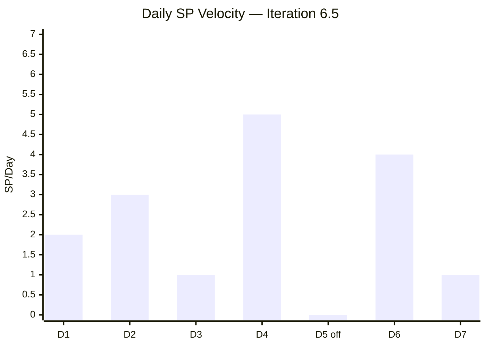

> Day 7 was the slowest productive day (1 SP). The required velocity for 100% completion (6.0 SP/day) is now more than double the cumulative average (2.67). However, the Day 4 and Day 6 peaks (5.0, 4.0 SP/day) show the team can burst when needed.

---

## 5. Previous Finding Resolution

| # | Finding | First Found | **Day 7 Status** | Resolution |
|---|---|---|---|---|
| F1/FB/FI | Grace capacity not configured | Feb 25 | ❌ **OPEN (10 audits, 23+ days)** | ESCALATED |
| F2 | No Story Point Estimation | Feb 25 | ✅ **SUSTAINED** (16/16 have SP) | Embedded |
| F3 | Single Point of Failure | Feb 25 | ⚠️ **OPEN** (Mark is sole member) | Structural |
| F4 | No Acceptance Criteria | Feb 25 | ✅ **SUSTAINED** (16/16 have AC) | Embedded |
| F5 | Typos in work items | Feb 25 | ✅ No new typos | Resolved |
| F6 | Features lack WSJF | Feb 25 | ⚠️ **PARTIAL** (4/6 BV populated) | In progress |
| F7 | Missing PI 2 / PI 5 | Feb 25 | ⚠️ **STRUCTURAL** | Unchanged |
| FR | Mid-sprint scope addition | Mar 16 | ⚠️ **WORSENED** — now 2 instances | See FU |
| FS | CADAC training untouched | Mar 16 | ⚠️ **PARTIALLY ADDRESSED** — Active but tasks New | See FV |

### 5.1 New Findings — Iteration 6.5 Day 7

#### Finding FU (MEDIUM) — Recurring Mid-Sprint Scope Additions

| Metric | Value |
|---|---|
| Instance 1 | #200867 Exit/Entrance signage (1 SP, added Day 2, closed Day 3) |
| Instance 2 | #201210 BIR transfer tax (1 SP, added Day 7, closed Day 7) |
| Cumulative scope creep | 2 SP / 6.9% over original 29 SP commitment |
| Impact | Inflates scope, distorts velocity metrics, undermines sprint commitment |

**Analysis:** Both additions were small (1 SP each), well-structured (description, AC, SP, parent feature), and closed quickly. However, a pattern of mid-sprint additions indicates planning gaps — items known before sprint start should be included during iteration planning. SAFe allows 10-15% scope buffer but these should be anticipated, not ad-hoc.

**Recommendation:** During next iteration planning, include a 1-2 SP buffer for emergent administrative work. Track "unplanned work rate" as a retrospective metric.

#### Finding FV (HIGH) — Active Stories with Stalled Tasks

| Story | SP | Story State | Task State | Days Since Story Activated |
|---|---|---|---|---|
| #196725 CADAC Day 1 | 3 | Active | #199736 **New** | 2 days |
| #199466 CADAC Day 2 | 3 | Active | #199760 **New** | 2 days |
| #200306 Gov payables | 4 | Active | #200313, #200314 **New** | **5 days** (since story activated Day 4) |

**Total at-risk SP:** 10 SP (32% of total commitment)

**Analysis:** Stories moved to Active state but their remaining tasks never transitioned — suggesting the story-level state change may not reflect actual work commencement. In SAFe, a story should be Active only when work has genuinely started, with tasks transitioning as they are worked.

**Recommendation:**
1. PHIC tasks (#200313, #200314): If the payment portal is inaccessible or there's a dependency, mark these tasks as Blocked with a reason.
2. CADAC tasks: Confirm whether training physically occurred on Mar 17-18. If so, update task states. If training is scheduled for Mar 19-20, the SP delivery is at risk given only 2 days remain.

#### Finding FW (INFO) — DoR (Definition of Ready) Compliance

| Criterion | Compliant Stories | % | Assessment |
|---|---|---|---|
| Has Title | 16/16 | 100% | ✅ |
| Has Description | 16/16 | 100% | ✅ |
| Has Acceptance Criteria | 16/16 | 100% | ✅ |
| Has Story Points | 16/16 | 100% | ✅ |
| Has Assigned Owner | 16/16 | 100% | ✅ |
| Has Parent Feature | 16/16 | 100% | ✅ |
| Has ≥1 Task | 16/16 | 100% | ✅ |
| AC Quality (multi-criteria) | 1/16 | 6.3% | ⚠️ Low |

**DoR Score: 100%** for structural completeness — every story meets all 7 structural criteria. However, AC quality remains minimal ("Attached receipt/photo" for 15 of 16 stories). Only #200613 (BFP certification) has multi-criteria AC with 3 specific conditions.

---

## 6. Capacity Analysis

### 6.1 Configuration (Unchanged)

| Member | Capacity/Day | Activities | Days Off | Status |
|---|---|---|---|---|
| Mark Colina | 6.5 hrs | Deployment 0.5 + Documentation 3.5 + Requirements 2.5 | Mar 16 (past) | ✅ Configured |
| Grace | — | — | — | ❌ Not configured (10 audits) |

### 6.2 Remaining Capacity

| Metric | Value |
|---|---|
| Working days remaining (after today) | 2 (Mar 19, 20) |
| Today's remaining capacity (partial) | ~3.25 hrs (est. half-day) |
| Total remaining capacity | ~16.25 hrs |
| Remaining SP | 15 SP |
| **Hours per remaining SP** | **1.08 hrs/SP** |
| Iteration planned benchmark | 2.02 hrs/SP |
| **Capacity utilization** | **192%** (over-committed) |

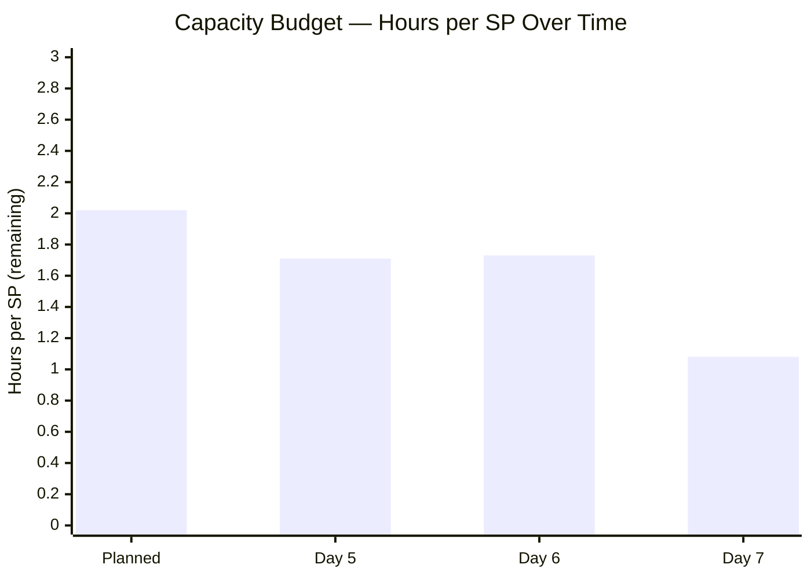

> ⚠️ The remaining capacity (1.08 hrs/SP) is now **46% below** the planned benchmark. 100% completion requires either burst capacity (longer hours), or that some items (particularly CADAC training) require minimal task-hours because training attendance is the actual work.

---

## 7. Work Category Progress

| Category | Stories | SP | Closed SP | Active SP | % Done | Day 6 % | Delta |
|---|---|---|---|---|---|---|---|
| Payables (routinary) | 7 | 17 | 10 | 7 | **59%** | 59% | → |
| Admin Support | 6 | 6 | 4 | 2 | **67%** | 60% | ↑ +7% |
| CADAC Training | 2 | 6 | 0 | 6 | **0%** | 0% | → ⚠️ |
| Ceiling Repair | 1 | 2 | 2 | 0 | **100%** | 100% | → |
| **Total** | **16** | **31** | **16** | **15** | **51.6%** | 50% | +1.6% |

```mermaid
xychart-beta
    title "Category Progress — Day 6 vs Day 7 (SP %)"
    x-axis ["Payables", "Admin Support", "CADAC", "Ceiling Repair"]
    y-axis "% SP Completed" 0 --> 100
    bar [59, 60, 0, 100]
    bar [59, 67, 0, 100]
```

**CADAC at 0% SP closure for 7 consecutive days** — this is now the iteration's most critical delivery risk.

---

## 8. Feature Traceability

| Feature ID | Title | State | BV | Stories (C/A) | SP (C/T) | Health |
|---|---|---|---|---|---|---|
| 200287 | Payables 6.5 | Active | 10 | 4/2 | 10/17 | 🟡 59% |
| 200288 | Admin Support 6.5 | Active | 10 | 4/2 | 5/6 | 🟢 83% |
| 196719 | CADAC training 2026 | Active | 10 | 0/2 | 0/6 | 🔴 0% |
| 200588 | BFP renewal 2026 | Active | 5 | 0/1 | 0/1 | 🟡 In progress |
| 196416 | Ceiling rust repair | Closed | 8 | 1/0 | 2/2 | ✅ 100% |
| 199319 | Payables 6.4 (carry-over) | Closed | — | 1/0 | 3/3 | ✅ 100% |

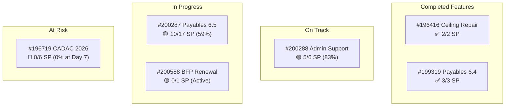

---

## 9. Risk Register — Day 7

| # | Risk | Likelihood | Impact | Trend vs Day 6 | Mitigation |
|---|---|---|---|---|---|
| R1 | Grace not configured (10th audit) | **Certain** | High | → Persistent | Escalate to management |
| R2 | CADAC 6 SP — 0% closed at Day 7 | **High** | **High** | ↑ **Escalated** | Confirm training status immediately |
| R3 | Capacity over-committed (1.08 hrs/SP) | **High** | Medium | ↑ Worsened | Prioritize high-value closures |
| R4 | PHIC tasks stalled 5 days | **Medium** | Medium | 🆕 New | Investigate dependency or blocker |
| R5 | Recurring mid-sprint additions (2x) | **Medium** | Low | ↑ Pattern forming | Add buffer to next iteration plan |
| R6 | WSJF not implemented | **Medium** | High | → Persistent | Target PI 7 |

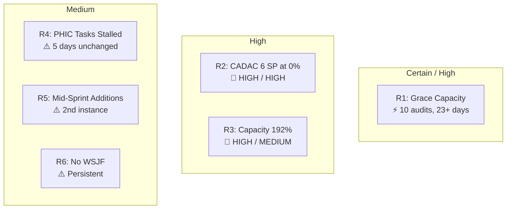

---

## 10. Iteration Completion Forecast (Updated)

| Scenario | SP Completed | Stories | % | P(100%) | Key Dependency |
|---|---|---|---|---|---|
| **Best case** | 31/31 | 16/16 | 100% | ~25% | All 6 Active stories close in 2.5 days |
| **Optimistic** | 28/31 | 14/16 | 90% | ~35% | CADAC completes, 1 payable item slips |
| **Likely** | 25/31 | 13/16 | 81% | **~45%** | Gov payables + Internet close; CADAC partial |
| **Conservative** | 22/31 | 12/16 | 71% | ~30% | Only Internet + BFP close; CADAC + Gov slip |
| **Pessimistic** | 17/31 | 10/16 | 55% | ~10% | Only 1 SP closes; all Active items carry over |

> **100% completion probability has dropped from 85% (Day 6) to ~78% (Day 7).** The most likely outcome is **81% completion (25/31 SP)** with CADAC training as the swing factor. If Mark confirms training occurred, the probability shifts sharply upward.

---

## 11. Action Items — Immediate Priority

| # | Action | Owner | Priority | Target |
|---|---|---|---|---|
| 1 | **Confirm CADAC training status** — Did training physically occur on Mar 17-18? If yes, close tasks + stories. If scheduled Mar 19-20, update plan. | Mark Colina | **CRITICAL** | Today |
| 2 | **Close PHIC tasks** (#200313, #200314) — stalled 5 days under Active story #200306 | Mark Colina | **HIGH** | Mar 19 |
| 3 | **Close Internet payables** (#200304, #200305) — 2 of 4 tasks remaining | Mark Colina | **HIGH** | Mar 19 |
| 4 | **Configure Grace's capacity** — 10th audit, 23+ days unresolved | Team Lead | **CRITICAL** | Immediate |
| 5 | **Add 1-2 SP planning buffer** in Iteration 6.6 for emergent admin work | Team | MEDIUM | 6.6 Planning |
| 6 | **Implement WSJF scoring** at Feature level | Product Owner | MEDIUM | PI 7 Planning |

---

## 12. Conclusion

**Iteration 6.5 enters its final stretch at 52% SP completion on Day 7.** While story count progress (62.5%) and task closure (74.2%) look healthy, the SP burndown has fallen behind the linear pace — driven primarily by the CADAC training block (6 SP, 0% delivered) and stalled PHIC tasks under Government payables.

The single most impactful action is **confirming CADAC training status**. If Mark attended training on Mar 17-18, closing those 2 stories (6 SP) would immediately jump SP completion to 71% and make 90-100% achievable. If training hasn't occurred and is scheduled for the final 2 days, the capacity math becomes extremely tight at 1.08 hrs/SP.

**Sprint Goal Probability has decreased from 85% to 78.3%**, primarily due to the velocity gap (2.67 SP/day actual vs 6.0 SP/day needed). The team has shown burst capability (5.0 and 4.0 SP on Days 4 and 6), so recovery is possible but requires focused execution over the remaining 2.5 days.

The recurring mid-sprint additions (2 instances, 2 SP) are a new pattern worth addressing in iteration planning. Both were well-executed but represent scope that should ideally be anticipated.

**Grace's capacity remains the audit series' longest-standing finding** at 10 consecutive audits and 23+ days. This continues to represent both a SAFe process gap and a single-point-of-failure risk for the team.

**Iteration 6.5 Day 7 Status: AT RISK — CADAC training confirmation needed to unlock path to ≥90% completion**
**Next Audit: Recommended for March 20, 2026 (Day 9) — pre-close/close-out assessment**

---

*Report generated on March 18, 2026 | SAFe 6.0 Framework Standards*
*Auditor: AI Agile PM Consultant*
*Audit Series: #10 — 4th audit for Iteration 6.5*
