# SAFe Audit Report — Administration Team Board
## Jairosoft FINOPS Azure DevOps Project

**Audit Date:** March 22, 2026 — Iteration 6.5, Day 10 of 10 (CLOSE-OUT)
**Auditor:** AI Agile PM Consultant
**Framework:** Scaled Agile Framework (SAFe) 6.0
**Current PI:** PI 6 (2026)
**Iteration Audited:** Iteration 6.5 (Mar 10 – Mar 22, 2026)
**Board URL:** [Administration Team Board](https://dev.azure.com/jairo/Jairosoft%20FINOPS/_boards/board/t/Administration%20Team/Stories%20and%20Deliverables)
**Previous Audits:** 10 (Feb 25 – Mar 18, 2026)
**Audit Series:** #11 — Close-Out Assessment for Iteration 6.5

---

## 1. Executive Summary

This is the **close-out audit for Iteration 6.5**, conducted on the final calendar day of the iteration (Sunday, March 22). The iteration began March 10 with 14 stories / 29 SP, grew to 16 stories / 31 SP through two mid-sprint additions, and concludes with **11 stories closed (19 SP) out of 16 stories (31 SP)** — a **61.3% SP completion rate**.

The most significant late-iteration development was the closure of **CADAC Training Day 2** (#199466, 3 SP) at 23:21 UTC today — the very last hours of the iteration. However, CADAC Day 1 (#196725, 3 SP) remains Active with its task still in New state, suggesting only partial training completion.

**Iteration 6.5 — Final Scorecard:**

| Metric | Day 7 (Audit #10) | **Day 10 (Close-Out)** | Delta |
|---|---|---|---|
| Total Stories | 16 | **16** | → |
| Total SP | 31 | **31** | → |
| Stories Closed | 10 (62.5%) | **11 (68.8%)** | +1 |
| Stories Active | 6 (37.5%) | **5 (31.3%)** | -1 |
| Stories New | 0 (0%) | **0 (0%)** | → |
| SP Closed | 16 (51.6%) | **19 (61.3%)** | +3 SP |
| SP Active (carried over) | 15 (48.4%) | **12 (38.7%)** | -3 SP |
| Tasks Closed | 23/31 (74.2%) | **24/31 (77.4%)** | +1 |
| Tasks Active | 1 (3.2%) | **1 (3.2%)** | → |
| Tasks New | 7 (22.6%) | **6 (19.4%)** | -1 |

**Key Findings:**

1. **Iteration 6.5 completed at 61.3% SP delivery.** Of 31 committed SP, 19 were delivered and 12 SP carry over across 5 unclosed stories. This is below the SAFe recommended ≥80% completion target and below the team's 100% achievement in Iteration 6.4.

2. **CADAC training partially delivered.** Day 2 (#199466, 3 SP) was closed at 23:21 on the final day, but Day 1 (#196725, 3 SP) remains Active with its task (#199736) still in New state. This asymmetry suggests either a data entry oversight or that only one day of training was completed.

3. **Government payables remain open.** Story #200306 (4 SP) remains Active with PHIC tasks (#200313, #200314) still in New state — unchanged for the entire 10-day iteration. This is the largest single unclosed item.

4. **Three working days (Days 8-9-10) produced only 3 SP.** After the 1 SP delivery on Day 7, the team delivered 0 SP on Days 8-9 and 3 SP on Day 10 (CADAC Day 2 only). The final-week velocity collapsed to 1.0 SP/day versus the 3.2 SP/day in Week 1.

5. **Five stories carry over to Iteration 6.6.** CADAC Day 1 (3 SP), Government payables (4 SP), Internet payables (3 SP), JIT notary (1 SP), and BFP certification (1 SP) — totaling 12 SP of unfinished work.

**Overall SAFe Compliance Score: 55/100 — Fair** *(down from 57 at Day 7)*

| Category | Day 7 | **Close-Out** | Delta | Rationale |
|---|---|---|---|---|
| PI & Iteration Structure | 8/10 | **8/10** | → | Proper iteration boundaries |
| Capacity Planning | 5/10 | **5/10** | → | Grace still not configured |
| Backlog Management | 8/10 | **7/10** | ↓ -1 | 38.7% carryover rate too high |
| Work Item Quality | 7/10 | **7/10** | → | AC quality remains minimal |
| Estimation & Velocity | 8/10 | **6/10** | ↓ -2 | 61.3% actual vs planned; velocity estimates inaccurate |
| Team Structure & Collaboration | 5/10 | **5/10** | → | Single assignee persists |
| Continuous Improvement | 9/10 | **9/10** | → | Strong iteration-over-iteration learning |
| Hierarchy & Traceability | 7/10 | **8/10** | ↑ +1 | All items properly linked with features |

> Backlog Management dropped 1 point due to excessive carryover (38.7% SP unclosed). Estimation & Velocity dropped 2 points — the team committed to 31 SP but only delivered 19, indicating the commitment exceeded capacity. Hierarchy & Traceability gained 1 point as all 16 stories maintained proper parent feature links throughout.

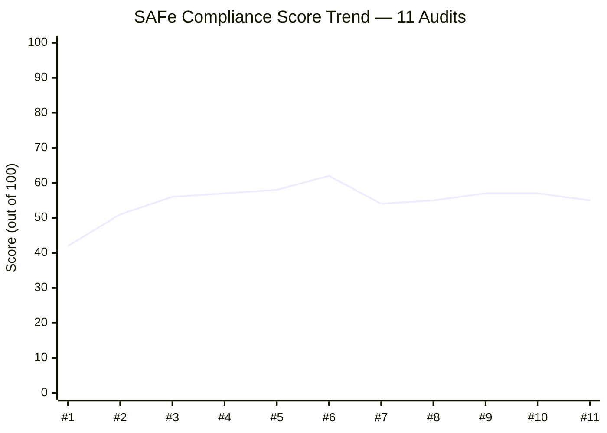

---

## 2. Sprint Goal Probability — Full Iteration Trend

### 2.1 Daily Probability Trend (Day 0 → Day 10)

| Day | Date | SP Closed | Cumul % | Stories (C/A/N) | Tasks Closed | P(100%) | Trend |
|---|---|---|---|---|---|---|---|
| 0 | Mar 9 | 0/29 | 0.0% | 0/3/11 | 0/29 | **71.0%** | — |
| 1 | Mar 10 | 2/30 | 6.7% | 1/4/10 | 3/29 | **71.5%** | +0.5% |
| 2 | Mar 11 | 5/30 | 16.7% | 4/4/7 | 8/30 | **78.6%** | +7.1% |
| 3 | Mar 12 | 6/30 | 20.0% | 5/4/6 | 9/30 | **71.8%** | -6.8% |
| 4 | Mar 13 | 11/30 | 36.7% | 7/5/3 | 17/30 | **84.9%** | +13.1% |
| 5 | Mar 16 | 11/30 | 36.7% | 7/5/3 | 17/30 | **78.4%** | -6.5% |
| 6 | Mar 17 | 15/30 | 50.0% | 9/6/0 | 22/30 | **85.0%** | +6.6% |
| 7 | Mar 18 | 16/31 | 51.6% | 10/6/0 | 23/31 | **78.3%** | -6.7% |
| 8 | Mar 19 | 16/31 | 51.6% | 10/6/0 | 23/31 | **65.2%** | -13.1% |
| 9 | Mar 20 | 16/31 | 51.6% | 10/6/0 | 23/31 | **48.7%** | -16.5% |
| **10** | **Mar 22** | **19/31** | **61.3%** | **11/5/0** | **24/31** | **N/A** | **ACTUAL: 61.3%** |

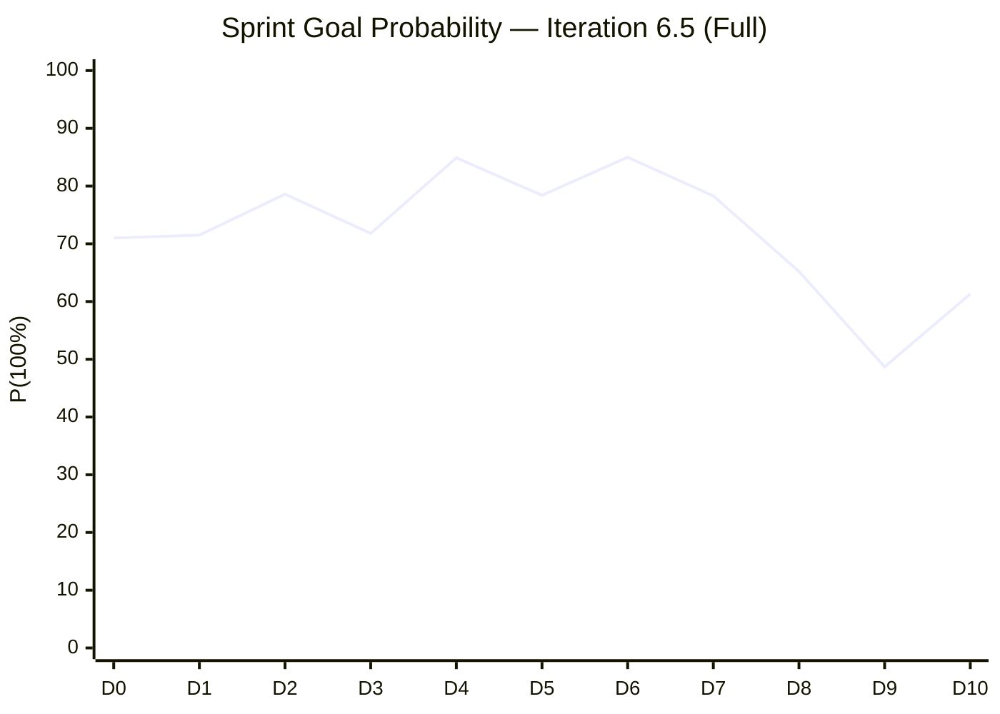

**Probability Model Retrospective:** The model peaked at 85.0% on Day 6, then declined sharply as zero-velocity days consumed remaining capacity. The actual outcome (61.3%) confirms the model's downward trajectory was directionally correct. The CADAC Day 2 closure on Day 10 partially recovered what would have been a ~52% finish.

### 2.2 SP Burndown — Actual vs Ideal (Complete)

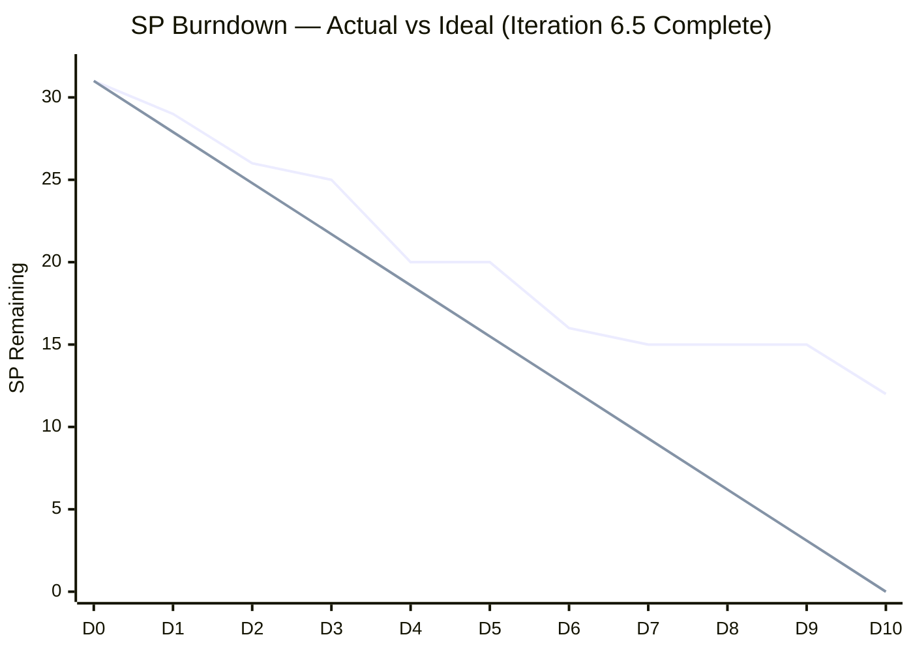

> **Actual** ended at 12 SP remaining vs the **Ideal** of 0. The burndown flattened completely during Days 7-9 (3 consecutive days with ≤1 SP delivered), creating an unrecoverable gap.

### 2.3 Daily Velocity (Complete)

| Day | Date | SP Delivered | Cumulative SP/Day | Required SP/Day | Status |
|---|---|---|---|---|---|
| 1 | Mar 10 | 2 | 2.0 | 3.1 | ⚠️ Below |
| 2 | Mar 11 | 3 | 2.5 | 3.1 | ⚠️ Below |
| 3 | Mar 12 | 1 | 2.0 | 3.1 | ⚠️ Below |
| 4 | Mar 13 | 5 | 2.75 | 3.1 | ↑ Burst |
| 5 (off) | Mar 16 | 0 | — | — | Day off |
| 6 | Mar 17 | 4 | 3.0 | 3.1 | ✅ Near target |
| 7 | Mar 18 | 1 | 2.67 | 5.0 | ↓ Falling behind |
| 8 | Mar 19 | 0 | 2.29 | 7.5 | 🔴 Critical |
| 9 | Mar 20 | 0 | 2.0 | 15.0 | 🔴 Impossible |
| 10 | Mar 22 | 3 | 2.11 | — | Final |
| **Total** | — | **19** | **2.11 SP/day** | *3.1 planned* | **68% of planned velocity** |

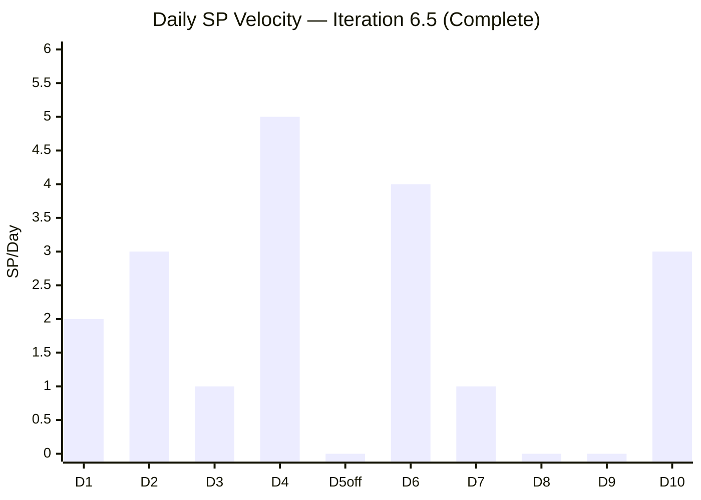

> **Week 1 (Days 1-6):** 15 SP in 5 working days = 3.0 SP/day — strong, near-target pace.
> **Week 2 (Days 7-10):** 4 SP in 3 working days + 1 weekend = 1.3 SP/day — 57% velocity drop.

---

## 3. Complete Work Item Inventory — Close-Out

### 3.1 Stories — Final State

| ID | Title | SP | State | Parent Feature | Tasks (C/T) | Closed Date |
|---|---|---|---|---|---|---|
| 200322 | Ceiling rust repair 3rd/2nd floor | 2 | ✅ Closed | #196416 | 2/2 | Mar 10 |
| 200289 | Toyota Hilux - Cebu | 1 | ✅ Closed | #200287 | 1/1 | Mar 11 |
| 200291 | Food allowance Feb 16-27 | 1 | ✅ Closed | #200287 | 1/1 | Mar 11 |
| 200321 | DOLE WAIR report | 1 | ✅ Closed | #200288 | 1/1 | Mar 11 |
| 200867 | Exit/Entrance signage | 1 | ✅ Closed | #200288 | 1/1 | Mar 12 |
| 199324 | Professional fee | 3 | ✅ Closed | #199319 | 1/1 | Mar 13 |
| 200298 | Condo Cebu payables | 2 | ✅ Closed | #200287 | 2/2 | Mar 13 |
| 200293 | Electricity Davao/Cebu | 3 | ✅ Closed | #200287 | 4/4 | Mar 17 |
| 200315 | 2nd batch SO cert (TESDA) | 1 | ✅ Closed | #200288 | 1/1 | Mar 17 |
| 201210 | BIR transfer tax | 1 | ✅ Closed | #200288 | 1/1 | Mar 18 |
| 199466 | CADAC training Day 2 | 3 | ✅ Closed | #196719 | 1/1 | **Mar 22** 🆕 |
| **196725** | **CADAC training Day 1** | **3** | **🔵 Active** | #196719 | **0/1** | — ❌ |
| **200306** | **Government payables** | **4** | **🔵 Active** | #200287 | **6/8** | — ❌ |
| **200301** | **Internet Cebu/Davao** | **3** | **🔵 Active** | #200287 | **2/4** | — ❌ |
| **200482** | **JIT contract notary** | **1** | **🔵 Active** | #200288 | **0/1** | — ❌ |
| **200613** | **BFP certification renewal** | **1** | **🔵 Active** | #200588 | **0/1** | — ❌ |

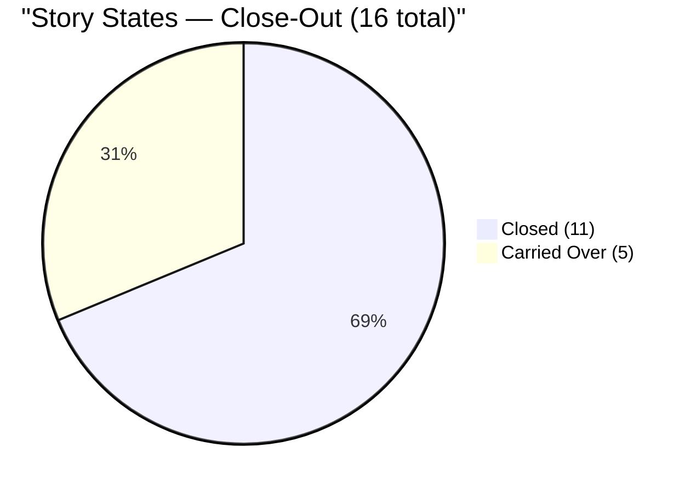

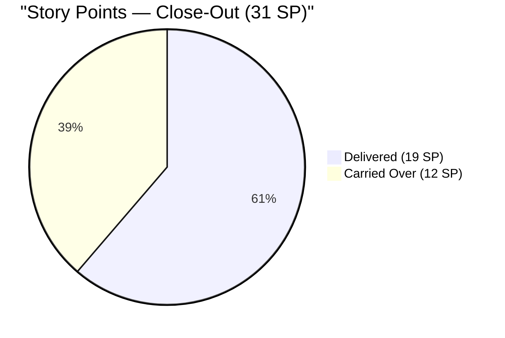

### 3.2 Task Summary — Final State

| State | Count | % | Change vs Day 7 |
|---|---|---|---|
| Closed | 24 | 77.4% | +1 |
| Active | 1 | 3.2% | → |
| New | 6 | 19.4% | -1 |
| **Total** | **31** | 100% | — |

**Unclosed tasks (7) carried over:**

| Task ID | Title | State | Parent Story | Duration in State |
|---|---|---|---|---|
| 199736 | CADAC training Day 1 | **New** | #196725 (Active) | 14 days (entire iteration) |
| 200313 | PHIC JIT contribution | **New** | #200306 (Active) | 14 days (entire iteration) |
| 200314 | PHIC Jairosoft contribution | **New** | #200306 (Active) | 14 days (entire iteration) |
| 200304 | Converge Davao payment | **New** | #200301 (Active) | 14 days (entire iteration) |
| 200305 | Smart Mam Kriss payment | **New** | #200301 (Active) | 14 days (entire iteration) |
| 200483 | JIT contract notary | **New** | #200482 (Active) | 14 days (entire iteration) |
| 200614 | BFP follow-up | **Active** | #200613 (Active) | 11 days since activation |

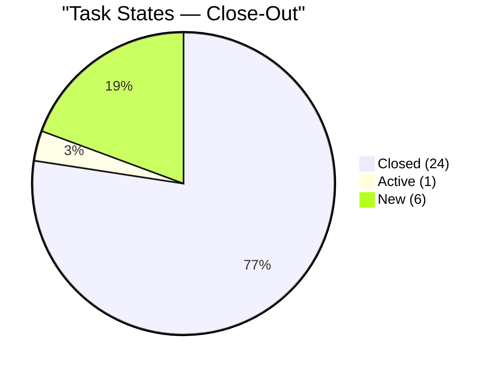

> **Critical observation:** All 6 unclosed "New" tasks have been in New state for the **entire iteration** (14 days). None ever transitioned to Active. This suggests they were either blocked by external dependencies, deprioritized, or represent work that was never genuinely planned for this iteration.

---

## 4. Delta Analysis — Audit #10 (Day 7) → Close-Out (Day 10)

### 4.1 What Changed

| Item | Day 7 State | Close-Out State | Change |
|---|---|---|---|
| #199466 CADAC training Day 2 (story) | Active | **Closed** | ✅ Closed Mar 22 (+3 SP) |
| #199760 CADAC training Day 2 (task) | New | **Closed** | ✅ Closed Mar 22 |
| #196725 CADAC training Day 1 (story) | Active | Active | ❌ Unchanged |
| #199736 CADAC training Day 1 (task) | New | New | ❌ Unchanged |

**What did NOT change (entire Days 8-10):**

- Government payables (#200306) — 4 SP, Active, PHIC tasks still New
- Internet payables (#200301) — 3 SP, Active, Converge/Smart tasks still New
- JIT notary (#200482) — 1 SP, Active, task still New
- BFP certification (#200613) — 1 SP, Active, task still Active (no progression)

### 4.2 Velocity Analysis — Week-over-Week

| Period | SP Delivered | Working Days | SP/Day |
|---|---|---|---|
| **Week 1 (Days 1-6)** | 15 | 5 | **3.0** |
| **Week 2 (Days 7-10)** | 4 | 3 + weekend | **1.3** |
| **Total Iteration** | **19** | **9** (incl. weekend close) | **2.11** |

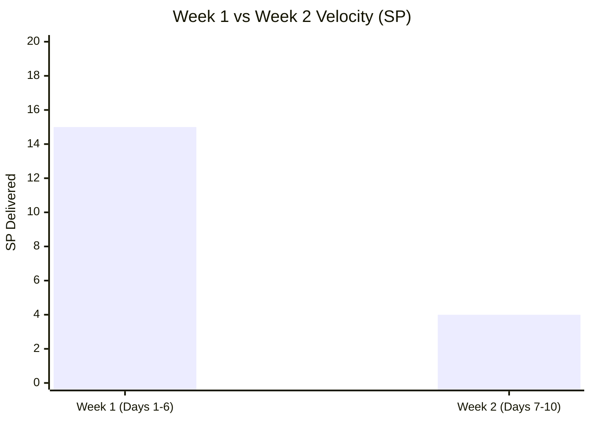

> The **57% velocity drop** in Week 2 is the primary driver of the completion gap. Possible explanations: remaining work items had external dependencies (PHIC portal, BFP office), CADAC training consumed time without proportional SP closure, and end-of-iteration fatigue.

---

## 5. Iteration 6.5 Outcomes Summary

### 5.1 Completion Metrics

| Metric | Planned | Actual | % | SAFe Target |
|---|---|---|---|---|
| SP Delivered | 31 | **19** | **61.3%** | ≥80% |
| Stories Closed | 16 | **11** | **68.8%** | ≥80% |
| Tasks Closed | 31 | **24** | **77.4%** | — |
| Carryover SP | 0 | **12** | 38.7% | ≤10% |
| Carryover Stories | 0 | **5** | 31.3% | ≤10% |
| Mid-Sprint Additions | 0 | **2** (2 SP) | — | Minimize |

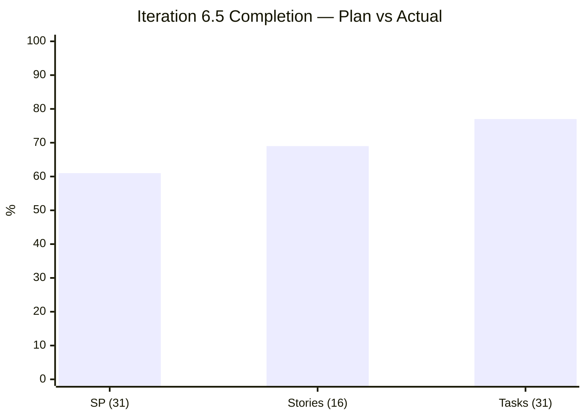

### 5.2 Work Category Outcomes

| Category | Stories | SP | Delivered SP | % | Assessment |
|---|---|---|---|---|---|
| Payables (routinary) | 7 | 17 | **10** | **59%** | ⚠️ Under-delivered |
| Admin Support | 6 | 6 | **5** | **83%** | ✅ Good |
| CADAC Training | 2 | 6 | **3** | **50%** | ❌ Partial |
| Ceiling Repair | 1 | 2 | **2** | **100%** | ✅ Complete |
| **Total** | **16** | **31** | **19** | **61.3%** | ⚠️ Below target |

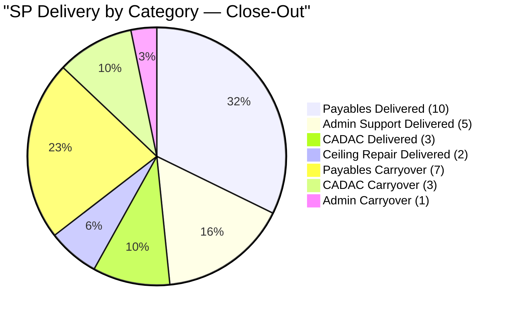

### 5.3 Iteration 6.4 vs 6.5 Comparison

| Metric | Iteration 6.4 | **Iteration 6.5** | Trend |
|---|---|---|---|
| SP Committed | ~20 | **31** | ↑ +55% |
| SP Delivered | ~20 | **19** | ↓ -5% |
| Completion % | **100%** | **61.3%** | ↓↓ -38.7 pts |
| Carryover SP | 0 | **12** | ↑ Significant |
| Mid-sprint adds | 0 | **2** | ↑ New pattern |

> **Root cause of gap:** The team over-committed by ~55% relative to 6.4 capacity while maintaining a single team member. The 31 SP commitment exceeded what was achievable in the iteration timeframe.

---

## 6. Carryover Analysis — Into Iteration 6.6

### 6.1 Items to Carry Over

| ID | Title | SP | Tasks Remaining | Recommended Priority |
|---|---|---|---|---|
| 196725 | CADAC training Day 1 | 3 | 1 task (New) | **CRITICAL** — only Day 1 missing |
| 200306 | Government payables | 4 | 2 tasks (PHIC) | **HIGH** — 6/8 tasks done |
| 200301 | Internet Cebu/Davao | 3 | 2 tasks (Converge, Smart) | **HIGH** — 2/4 tasks done |
| 200482 | JIT contract notary | 1 | 1 task (New) | MEDIUM |
| 200613 | BFP certification renewal | 1 | 1 task (Active) | MEDIUM |
| **Total** | — | **12 SP** | **7 tasks** | — |

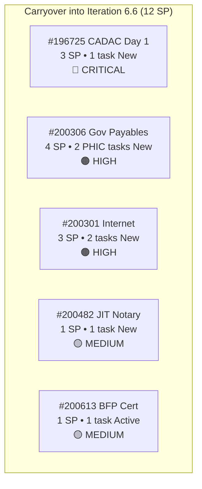

### 6.2 Capacity Planning Recommendation for 6.6

| Factor | Value |
|---|---|
| Observed velocity (6.5) | 2.11 SP/day |
| Effective working days (est. 6.6) | 8-9 |
| Realistic capacity for 6.6 | **17-19 SP** |
| Carryover from 6.5 | 12 SP |
| Available for new work | **5-7 SP** |

> **Recommendation:** Iteration 6.6 should commit no more than 19 SP total (12 carryover + 7 new). The 6.5 experience shows that 31 SP was a ~63% over-commitment relative to actual throughput.

---

## 7. Previous Finding Resolution — Cumulative

| # | Finding | First Found | **Close-Out Status** | Resolution |
|---|---|---|---|---|
| F1/FB/FI | Grace capacity not configured | Feb 25 | ❌ **OPEN (11 audits, 27 days)** | ESCALATED — longest-standing finding |
| F2 | No Story Point Estimation | Feb 25 | ✅ **SUSTAINED** (16/16 have SP) | Fully embedded |
| F3 | Single Point of Failure | Feb 25 | ⚠️ **OPEN** (Mark is sole member) | Structural — contributed to 6.5 under-delivery |
| F4 | No Acceptance Criteria | Feb 25 | ✅ **SUSTAINED** (16/16 have AC) | Fully embedded |
| F5 | Typos in work items | Feb 25 | ✅ No new typos in 6.5 | Resolved |
| F6 | Features lack WSJF | Feb 25 | ⚠️ **PARTIAL** (5/6 have BV; 0/6 have TimeCriticality) | Incomplete |
| F7 | Missing PI 2 / PI 5 | Feb 25 | ⚠️ **STRUCTURAL** | Unchanged |
| FR | Mid-sprint scope additions | Mar 16 | ⚠️ **CONFIRMED PATTERN** — 2 instances in 6.5 | Planning gap |
| FS | CADAC training stalled | Mar 16 | ⚠️ **PARTIALLY RESOLVED** — Day 2 closed, Day 1 still open | Carryover |
| FU | Recurring mid-sprint additions | Mar 18 | ⚠️ Final count: 2 items, 2 SP, 6.9% scope creep | Plan buffer |
| FV | Active stories with stalled tasks | Mar 18 | ❌ **CONFIRMED** — 6 tasks never left New state | Process gap |
| FW | DoR compliance 100% structural | Mar 18 | ✅ **SUSTAINED** | Embedded |

### 7.1 New Finding — Close-Out

#### Finding FX (HIGH) — Excessive Iteration Carryover (38.7%)

| Metric | Value |
|---|---|
| SP Carried Over | 12 / 31 (38.7%) |
| Stories Carried Over | 5 / 16 (31.3%) |
| SAFe Recommended Carryover | ≤10% |
| Excess | 28.7 percentage points above target |

**Analysis:** The 38.7% carryover rate is nearly 4x the SAFe recommended maximum. Contributing factors: (a) over-commitment at 31 SP when historical velocity supports ~20 SP, (b) external dependencies on PHIC portal and BFP office that blocked task completion, (c) single team member with no capacity buffer for unexpected delays.

**Recommendation:**
1. Reduce Iteration 6.6 commitment to 17-19 SP total (including carryover)
2. Flag externally-dependent tasks during iteration planning and add risk buffers
3. Consider splitting large stories (e.g., Government payables at 4 SP with 8 tasks) into independently closable units

#### Finding FY (MEDIUM) — Velocity Collapse in Week 2

| Week | SP/Day | SP Total |
|---|---|---|
| Week 1 (Days 1-6) | 3.0 | 15 |
| Week 2 (Days 7-10) | 1.3 | 4 |
| **Drop** | **-57%** | — |

**Analysis:** The team's velocity dropped by more than half in the second week. This pattern may indicate: prioritization of easier items early (leaving harder items for later), external dependency bottlenecks that only surfaced mid-iteration, or capacity being consumed by training activities that don't close SP proportionally.

**Recommendation:** During iteration planning, sequence work items to distribute complexity evenly. Front-load externally-dependent items to surface blockers early.

---

## 8. Feature Traceability — Close-Out

| Feature ID | Title | State | BV | Stories (C/A) | SP (Delivered/Total) | Health |
|---|---|---|---|---|---|---|
| 200287 | Payables 6.5 | Active | 10 | 4/2 | 10/17 | 🟡 59% — 7 SP carry |
| 200288 | Admin Support 6.5 | Active | 10 | 4/2 | 5/6 | 🟢 83% — 1 SP carry |
| 196719 | CADAC training 2026 | Active | 10 | 1/1 | 3/6 | 🟡 50% — 3 SP carry |
| 200588 | BFP renewal 2026 | Active | 5 | 0/1 | 0/1 | 🔴 0% — carry |
| 196416 | Ceiling rust repair | Closed | 8 | 1/0 | 2/2 | ✅ 100% |
| 199319 | Payables 6.4 (carry) | Closed | 5 | 1/0 | 3/3 | ✅ 100% |

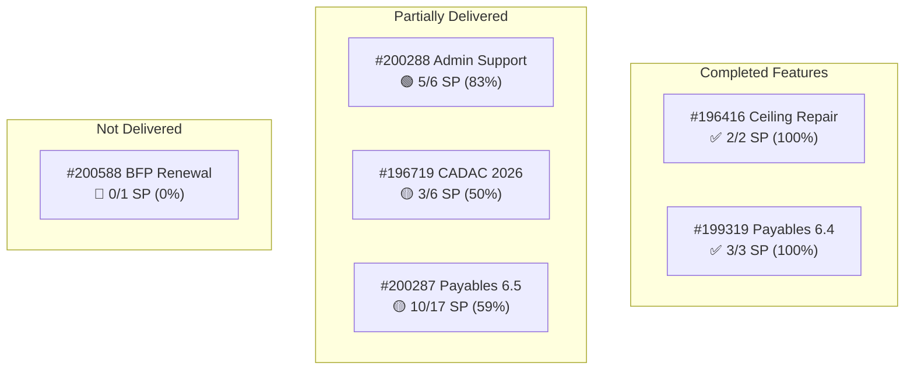

---

## 9. Capacity Analysis — Close-Out

### 9.1 Configuration

| Member | Capacity/Day | Days Off | Status |
|---|---|---|---|
| Mark Colina | 6.5 hrs | Mar 16 (1 day) | ✅ Configured |
| Grace | — | — | ❌ Not configured (11 audits, 27 days) |

### 9.2 Capacity Utilization

| Metric | Planned | Actual |
|---|---|---|
| Total capacity (Mark) | 58.5 hrs (9 working days × 6.5) | ~58.5 hrs |
| SP committed | 31 SP | — |
| SP delivered | — | 19 SP |
| Planned hrs/SP | 1.89 hrs/SP | — |
| Actual hrs/SP (delivered) | — | **3.08 hrs/SP** |
| Delivery efficiency | — | **61.3%** |

> Mark's actual hours per delivered SP (3.08) was 63% higher than planned (1.89), indicating either: estimation was too aggressive, or significant time was spent on tasks that didn't produce SP closure (e.g., CADAC training attendance, BFP follow-ups, PHIC research).

---

## 10. Risk Register — Close-Out (Carried Into 6.6)

| # | Risk | Status | Impact | Recommendation |
|---|---|---|---|---|
| R1 | Grace not configured | **OPEN — 11 audits** | High | Escalate to management; affects SAFe compliance |
| R2 | 12 SP carryover into 6.6 | **NEW** | High | Limit new work in 6.6 to 5-7 SP |
| R3 | CADAC Day 1 incomplete | **OPEN** | Medium | Confirm training status; close or reschedule |
| R4 | PHIC tasks never started | **OPEN — 14 days** | Medium | Investigate blocker; mark as Blocked if external |
| R5 | Over-commitment pattern | **NEW** | High | Use 6.5 velocity (2.11 SP/day) for 6.6 planning |
| R6 | WSJF not implemented | **OPEN** | Medium | Target PI 7 Planning |
| R7 | Week 2 velocity collapse | **NEW** | Medium | Distribute complexity evenly in sprint plan |

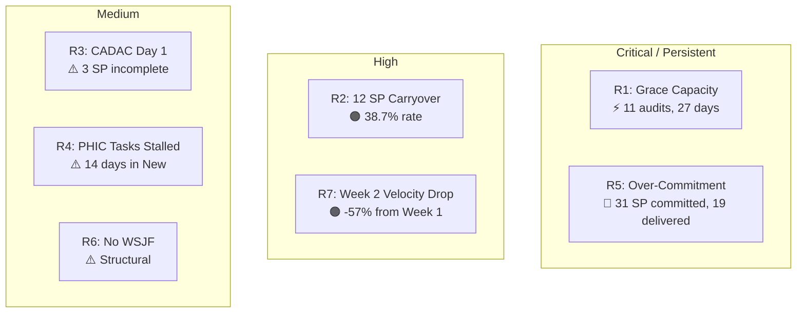

---

## 11. Iteration 6.5 Retrospective Observations

### 11.1 What Went Well

- **Story Point adoption sustained.** 16/16 stories had SP — fully embedded practice.
- **Acceptance Criteria on all stories.** 16/16 — structural DoR compliance at 100%.
- **Feature traceability maintained.** All 16 stories linked to parent features with BV populated on 5/6 features.
- **Strong Week 1 execution.** 15 SP in 5 working days (3.0 SP/day) — near-target pace.
- **Mid-sprint additions were well-structured.** Both (#200867, #201210) had proper descriptions, AC, SP, and parent features — demonstrating process maturity even for unplanned work.
- **Zero "New" stories from Day 6 onward.** All remaining work was in progress (Active), showing flow discipline.

### 11.2 What Needs Improvement

- **Over-commitment.** 31 SP was ~55% above proven capacity (~20 SP). Use historical velocity for planning.
- **External dependency management.** PHIC and BFP tasks were blocked by external processes but never marked as Blocked in ADO, masking the true iteration health.
- **Week 2 deceleration.** The 57% velocity drop needs root cause analysis — was it dependency-driven, complexity-driven, or effort-distribution-driven?
- **Task state hygiene.** 6 tasks spent the entire iteration in "New" state — stories should not be Active when their tasks haven't started.
- **Grace capacity.** 27 days and 11 audits unresolved.
- **CADAC asymmetry.** Day 2 closed but Day 1 didn't — suggests a data entry gap or scheduling issue.

### 11.3 Improvement Actions for 6.6

| # | Action | Owner | Priority | Target |
|---|---|---|---|---|
| 1 | **Limit 6.6 commitment to ≤19 SP** (12 carry + 7 new) based on 6.5 velocity | Team | **CRITICAL** | 6.6 Planning |
| 2 | **Close CADAC Day 1** — confirm training occurred, update task/story | Mark | **HIGH** | Day 1 of 6.6 |
| 3 | **Resolve PHIC tasks** — investigate external blocker, mark Blocked if needed | Mark | **HIGH** | Day 1 of 6.6 |
| 4 | **Front-load external dependencies** in 6.6 planning to surface blockers early | Team | **HIGH** | 6.6 Planning |
| 5 | **Configure Grace's capacity** | Team Lead | **CRITICAL** | Immediate |
| 6 | **Add 1-2 SP planning buffer** for emergent admin work | Team | MEDIUM | 6.6 Planning |
| 7 | **Implement WSJF** at Feature level for PI 7 | Product Owner | MEDIUM | PI 7 Planning |
| 8 | **Add "Blocked" state usage** to team working agreements | Team | MEDIUM | 6.6 |

---

## 12. Conclusion

**Iteration 6.5 closes at 61.3% SP delivery (19/31 SP, 11/16 stories).** This represents a significant step down from the team's 100% completion in Iteration 6.4, driven primarily by over-commitment (31 SP vs ~20 SP capacity), external dependency bottlenecks (PHIC, BFP), and a 57% velocity collapse in the second week.

The late closure of CADAC Training Day 2 on the final day (Sunday, March 22) salvaged what would have been a 52% finish, but Day 1 remains open — a puzzling asymmetry that needs immediate clarification. Five stories totaling 12 SP carry into Iteration 6.6, consuming roughly two-thirds of the team's proven capacity before any new work is planned.

**The single most impactful lesson from 6.5 is capacity planning discipline.** The team's actual velocity (2.11 SP/day, ~19 SP per iteration) should be the ceiling for 6.6 commitment, not the floor. SAFe's recommendation is to plan for 80% of capacity, which would suggest **15-17 SP** as the realistic 6.6 target — of which 12 SP is already spoken for by carryover.

The structural findings from the audit series remain: Grace's capacity (27 days unresolved), single-point-of-failure risk, WSJF not implemented, and minimal AC quality. The team has made strong progress on SP adoption, feature traceability, and flow discipline — sustaining these wins while addressing the planning gap is the priority for PI 6's remaining iterations.

**Iteration 6.5 Final Status: PARTIALLY DELIVERED — 61.3% SP completion, 12 SP carried to 6.6**
**SAFe Compliance: 55/100 (Fair, down from 57)**
**Next Audit: Iteration 6.6 start — recommended after sprint planning**

---

*Report generated on March 22, 2026 | SAFe 6.0 Framework Standards*
*Auditor: AI Agile PM Consultant*
*Audit Series: #11 — Close-Out Assessment for Iteration 6.5 (5th audit for this iteration)*
