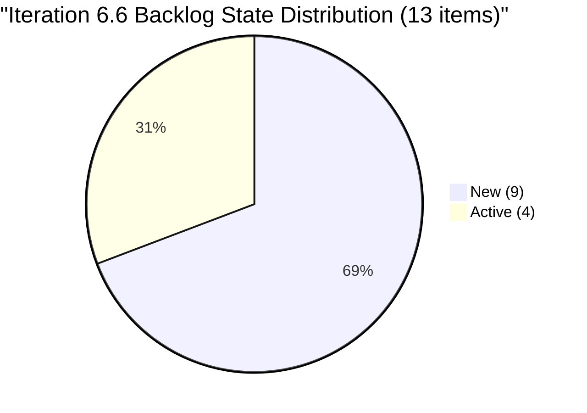
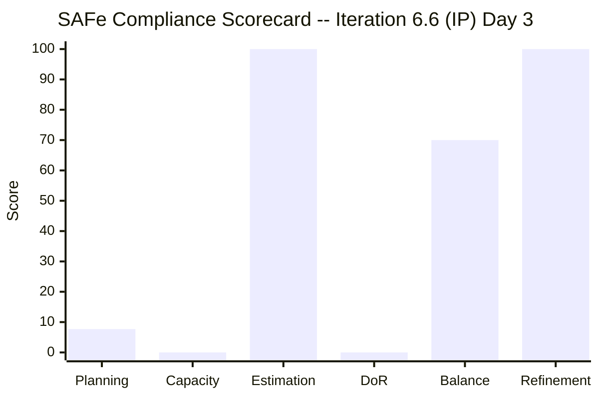
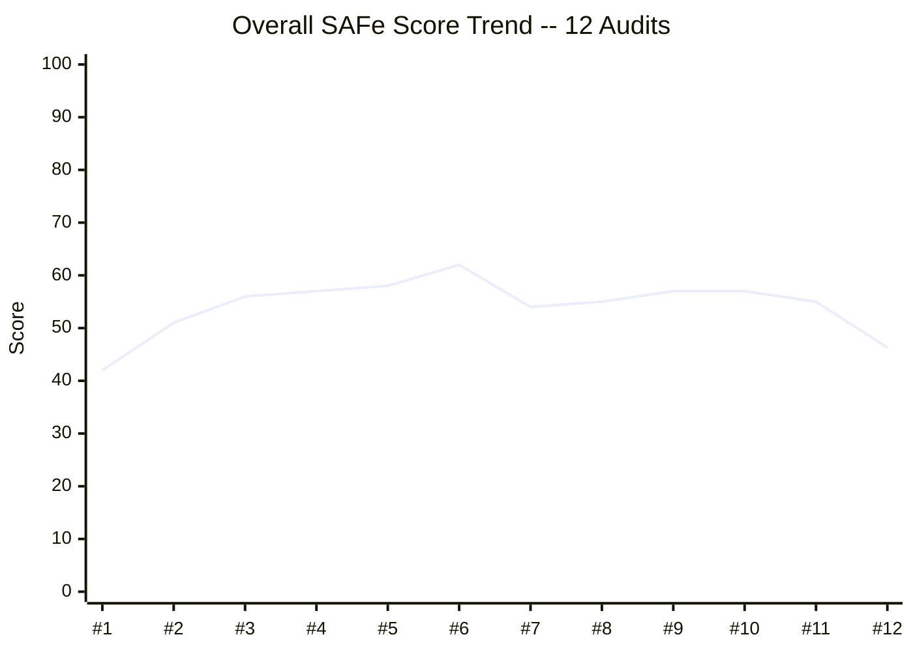

# SAFe Audit Report -- Administration Team Board

## Jairosoft FINOPS Azure DevOps Project

---

## 1. Audit Metadata

| Field | Value |
|-------|-------|
| **Project** | Jairosoft FINOPS |
| **Team** | Administration Team |
| **Workspace Folder** | `ado_admin` |
| **Current Iteration** | Iteration 6.6 (IP) |
| **Iteration Start** | March 23, 2026 |
| **Iteration Finish** | April 5, 2026 |
| **Audit Date** | March 25, 2026 (UTC) |
| **Audit Day** | Day 3 of 14 (early iteration) |
| **Previous Audit** | AUDIT_20260322_2329 (Mar 22, 2026 -- Iteration 6.5 Close-Out) |
| **Overall Score** | **46.3 / 100** |
| **Risk Band** | **High Risk** |
| **Audit Series** | #12 |
| **Framework** | SAFe 6.0 |
| **Board URL** | [Administration Team Board](https://dev.azure.com/jairo/Jairosoft%20FINOPS/_boards/board/t/Administration%20Team/Stories%20and%20Deliverables) |

---

## 2. Executive Summary

This is the first audit of **Iteration 6.6 (IP)** -- the Innovation and Planning sprint that closes out Program Increment 6. The audit is conducted on Day 3 of the 14-day iteration. The findings are critical.

**Iteration 6.6 (IP) is severely under-planned.** Only **1 of 13** visible backlog items has been assigned to this iteration. Five stories carrying 12 SP from Iteration 6.5 remain parked in the 6.5 iteration path and have not been moved forward. The backlog contains 12 unassigned items sitting at the root `Jairosoft FINOPS` iteration path with no sprint assignment.

**Capacity planning has regressed.** Mark Colina's capacity is configured with three activity types (Deployment, Documentation, Requirements) but all are set to **0 hours/day**. This is a regression from Iteration 6.5 where 8h/day Documentation capacity was configured.

**The single planned item (#200995) has no Description and no Acceptance Criteria**, failing the Definition of Ready. It was moved to Iteration 6.6 on March 23 by Grace but has not been elaborated.

**Key numbers at Day 3:**

- 1 story / 2 SP assigned to Iteration 6.6
- 0 hours/day team capacity configured
- 5 carryover stories (12 SP) still in Iteration 6.5 path -- not moved
- 12 backlog items unassigned to any sprint
- Overall SAFe compliance: 46.3/100 (down from 55/100 at 6.5 close-out)

---

## 3. Previous Audit Delta

**Previous:** AUDIT_20260322_2329 -- Iteration 6.5 Close-Out (Mar 22, 2026)

| Metric | Audit #11 (6.5 Close-Out) | **Audit #12 (6.6 Day 3)** | Delta |
|--------|---------------------------|---------------------------|-------|
| Overall Score | 55/100 | **46.3/100** | -8.7 pts |
| Risk Band | Fair | **High Risk** | Downgrade |
| Items in Sprint | 16 | **1** | -15 |
| SP in Sprint | 31 | **2** | -29 |
| Capacity Configured | 8h/day (Documentation) | **0h/day** | Regression |
| Carryover Items Addressed | N/A | **0 of 5 moved** | Not started |

**Delta analysis:** The score drop is driven primarily by the near-empty iteration plan (7.7 vs prior iterations where most items were assigned) and the capacity regression to zero. The previous audit recommended Iteration 6.6 commit 17-19 SP total (12 carryover + 5-7 new). Currently, only 2 SP are committed and the 12 SP carryover has not been formally moved.

**Resolved since last audit:** None. No prior findings were addressed between the 6.5 close-out and this audit.

**New risks introduced:**

- Capacity regression (all activities set to 0)
- IP Sprint planning not started despite being Day 3

---

## 4. Current Iteration Snapshot

### 4.1 Iteration 6.6 (IP) -- Assigned Work Items

| ID | Title | Type | SP | State | Assigned To | Changed Date | DoR |
|----|-------|------|-----|-------|-------------|-------------|-----|
| 200995 | Follow up Budget request for corrugated sheet | User Story | 2 | New | Mark Colina | Mar 23, 2026 | FAIL |

**Total:** 1 item, 2 SP, 1 assignee (Mark Colina)

### 4.2 Carryover from 6.5 (Still in 6.5 Iteration Path)

These 5 items were identified in the close-out audit as carryover candidates but have **not** been moved to Iteration 6.6:

| ID | Title | SP | State | Tasks Done | Last Changed |
|----|-------|----|-------|-----------|--------------|
| 200306 | Government payables | 4 | Active | 6/8 | Mar 13 |
| 200301 | Internet for Cebu and Davao payables | 3 | Active | 2/4 | Mar 17 |
| 200482 | JIT contract notary | 1 | Active | 0/1 | Mar 17 |
| 200613 | BFP certification renewal follow up | 1 | Active | 0/1 | Mar 18 |

**Note:** CADAC training Day 1 (#196725, 3 SP) was a carryover candidate from 6.5 but does not appear in the current backlog query, suggesting it may have been closed or removed from the team's backlog scope.

**Carryover subtotal (visible):** 4 items, 9 SP -- none reassigned to 6.6

### 4.3 Unassigned Backlog Items (Root Iteration Path)

These items sit in the root `Jairosoft FINOPS` iteration path with no sprint assignment:

| ID | Title | SP | State | Last Changed | Days Since Change |
|----|-------|----|-------|-------------|-------------------|
| 192221 | Purchase additional Corrugated Sheet and installation Day 1 | 2 | New | Feb 26 | 27 |
| 193412 | Implementation of aircon repair 2nd floor | 2 | New | Mar 9 | 16 |
| 197115 | Implementation of installing jockey pump | 4 | New | Feb 26 | 27 |
| 197111 | Recanvass for Jockey pump materials needed | 1 | New | Feb 26 | 27 |
| 197023 | Installation of corrugated sheet at Fire Exit | 3 | New | Mar 9 | 16 |
| 197029 | Implementation of Parking with roof for 2 vehicles (Day 1) | 3 | New | Mar 9 | 16 |
| 197028 | Purchase materials at Houseman Hardware | 1 | New | Mar 9 | 16 |
| 197113 | Purchase materials for Jockey pump | 1 | New | Mar 9 | 16 |

**Unassigned subtotal:** 8 items, 17 SP -- all in New state

### 4.4 Team Capacity

| Member | Activities | Capacity/Day | Days Off |
|--------|-----------|-------------|----------|
| Mark Colina | Deployment (0h), Documentation (0h), Requirements (0h) | **0 h/day** | 0 |
| **Team Total** | | **0 h/day** | 0 |

Capacity is effectively unconfigured. All three activity types exist but are set to zero.

---

## 5. Work Item Analysis

### 5.1 Backlog Composition (All 13 Visible Root Items)

| Category | Count | SP | % of Items |
|----------|-------|----|-----------|
| Building Admin | 9 | 19 | 69.2% |
| Logistics (Payables/Admin) | 4 | 9 | 30.8% |
| **Total** | **13** | **28** | 100% |

All 13 items are **User Story** type. No Defects, Issues, or Spikes present.

### 5.2 State Distribution

| State | Count | SP | % |
|-------|-------|----|---|
| New | 9 | 19 | 69.2% |
| Active | 4 | 9 | 30.8% |
| Closed | 0 | 0 | 0% |
| **Total** | **13** | **28** | 100% |

### 5.3 Age Distribution

| Age Bucket | Count | % | SP |
|------------|-------|---|----|
| Fresh (< 45 days) | 13 | 100% | 28 |
| Stale (> 90 days) | 0 | 0% | 0 |
| Very Stale (> 180 days) | 0 | 0% | 0 |

### 5.4 DoR Compliance Detail

**Definition of Ready criteria:** Description >= 30 non-whitespace chars AND Acceptance Criteria >= 20 non-whitespace chars.

For the sole current iteration item:

| ID | Title | Description | AC | DoR |
|----|-------|-----------|----|----|
| 200995 | Follow up Budget request for corrugated sheet | MISSING | MISSING | FAIL |

**Note on backlog items:** Most unassigned backlog items have minimal descriptions (single-sentence restatements of the title) and acceptance criteria that consist of "Attached receipt" or "Attached photos" (under 20 non-whitespace characters). If these items are moved into the iteration, DoR compliance will remain low.

---

## 6. SAFe Compliance Scorecard

| # | Dimension | Score | Evidence | Notes |
|---|-----------|-------|----------|-------|
| 1 | Iteration Planning | **7.7** | 1 of 13 root items assigned to 6.6 | 12 items unassigned; 5 carryover items not moved |
| 2 | Team Capacity | **0.0** | 0 of 1 contributors have positive capacity | Mark has 3 activities all at 0h/day -- regression from 6.5 |
| 3 | Estimation | **100.0** | 1 of 1 point-eligible items has SP > 0 | #200995 has 2 SP; denominator is 1 |
| 4 | DoR Compliance | **0.0** | 0 of 1 current items pass DoR | #200995 missing Description and Acceptance Criteria |
| 5 | Work Item Balance | **70.0** | 100% User Story (dominant > 60%: -30) | Single type but it is the correct type; no Spikes |
| 6 | Backlog Refinement | **100.0** | 13/13 items changed within 45 days; 0 stale | All items recently touched; no staleness penalties |
| | **Overall** | **46.3** | | **High Risk** |

### Score Trend (Audits #1 - #12)

> The score of 46.3 is the lowest since Audit #1 (42). This is expected at Day 3 of a new iteration where planning has barely started, but the severity of the gaps warrants urgent action.

---

## 7. Dimension Findings

### 7.1 Iteration Planning (7.7/100) -- CRITICAL

**Finding F-IP1 (CRITICAL): Iteration 6.6 has only 1 of 13 backlog items assigned.**

The IP Sprint started March 23 and we are now on Day 3. Only one item (#200995, 2 SP) has been moved into the iteration. The five carryover stories from Iteration 6.5 (totaling 9 SP still visible in the backlog) remain assigned to the 6.5 iteration path.

The previous audit recommended committing 17-19 SP (12 carryover + 5-7 new). Current commitment is 2 SP -- approximately 10% of the recommended level.

**Impact:** The team has no meaningful iteration plan. Without explicit sprint assignment, work cannot be tracked, burned down, or measured against capacity.

### 7.2 Team Capacity (0.0/100) -- CRITICAL

**Finding F-TC1 (CRITICAL): Capacity has regressed to 0 h/day.**

Mark Colina's capacity was set to 8h/day Documentation during Iteration 6.5 (resolved finding from Mar 9). For Iteration 6.6, all three configured activities (Deployment, Documentation, Requirements) are at 0 h/day.

**Impact:** Without capacity, ADO cannot generate burndown charts, capacity alerts, or work distribution views. This was a resolved finding that has regressed.

### 7.3 Estimation (100.0/100) -- GOOD

The sole current iteration item (#200995) has Story Points = 2. All visible backlog items also have story points assigned. This is a sustained improvement from early audits where estimation was absent.

### 7.4 DoR Compliance (0.0/100) -- CRITICAL

**Finding F-DoR1 (HIGH): #200995 has no Description and no Acceptance Criteria.**

The item was created on March 12 and moved to Iteration 6.6 on March 23 by Grace. It has a title ("Follow up Budget request for corrugated sheet") and 2 SP, but no elaboration. It has a target date of March 27, which is 2 days away.

**Impact:** Work cannot be started safely without a Definition of Ready. The target date proximity makes this urgent.

### 7.5 Work Item Balance (70.0/100) -- MODERATE

All current iteration items are User Stories, which is the correct primary type. The -30 penalty comes from 100% type concentration (dominant share > 60%). For a single-item iteration, this is a mathematical artifact. If more items are planned, the mix will naturally diversify only if non-User-Story types are included.

For an IP Sprint, SAFe recommends allocating time for innovation, planning, and retrospective activities. No Spikes or exploration items are present, which is a concern for an IP Sprint specifically.

### 7.6 Backlog Refinement (100.0/100) -- GOOD

All 13 visible backlog items have been changed within the last 45 days. No items exceed the 90-day or 180-day staleness thresholds. There are no untouched items in the current iteration (the sole item was changed on the iteration start date).

This score reflects recent grooming activity, likely driven by the Iteration 6.5 planning and close-out cycle.

---

## 8. Risks and Bottlenecks

### Risk 1 (CRITICAL): IP Sprint Planning Not Started

- **Description:** Day 3 of 14 with only 1 item / 2 SP committed. No iteration plan exists.
- **Impact:** The team will either work without tracking or waste iteration days before planning.
- **Mitigation:** Conduct immediate sprint planning. Move carryover items and select new work from the 17 SP unassigned backlog.

### Risk 2 (CRITICAL): Capacity Regression

- **Description:** Mark's capacity reset to 0 h/day across all activities.
- **Impact:** No burndown, no capacity alerts, no over-allocation detection.
- **Mitigation:** Set capacity to 8h/day immediately. For an IP Sprint, consider allocating across multiple activities (e.g., 4h Documentation, 2h Requirements, 2h Deployment).

### Risk 3 (HIGH): Carryover Items Orphaned in 6.5

- **Description:** 4 visible carryover items (9 SP) remain assigned to Iteration 6.5. They are not visible in 6.6 planning views.
- **Impact:** Work in progress is invisible to the current iteration. Progress tracking is broken.
- **Mitigation:** Move all active carryover items to Iteration 6.6 iteration path.

### Risk 4 (HIGH): Single Team Member (Bus Factor = 1)

- **Description:** Mark Colina is the sole contributor across all 13 backlog items. This has been flagged in every audit since #1.
- **Impact:** Any absence blocks all work. No peer review or knowledge sharing.
- **Mitigation:** Structural issue requiring management decision. At minimum, document critical processes.

### Risk 5 (MEDIUM): IP Sprint Not Used for Innovation/Planning

- **Description:** The IP Sprint in SAFe is designated for innovation, planning the next PI, retrospectives, and technical debt reduction. The sole planned item is a routine budget follow-up.
- **Impact:** Missed opportunity for PI 7 preparation, retrospective, and process improvement.
- **Mitigation:** Add PI 7 planning activities, team retrospective, and at least one innovation/spike item.

---

## 9. Prioritized Recommendations

### Priority 1: Conduct Sprint Planning Immediately (CRITICAL -- Day 3 deadline)

1. **Move carryover items to 6.6:** Reassign #200306, #200301, #200482, #200613 from Iteration 6.5 path to Iteration 6.6 (IP).
2. **Select additional backlog items:** Choose 5-7 SP of new work from the 8 unassigned items (17 SP available).
3. **Set total commitment at 15-17 SP:** Based on 6.5 actual velocity of 2.11 SP/day across 9 working days, capacity is approximately 19 SP. Subtract buffer for IP activities.
4. **Target date:** Complete planning by end of Day 3 (March 25).

### Priority 2: Restore Capacity Configuration (CRITICAL -- immediate)

1. Set Mark Colina's capacity to 8 h/day.
2. Distribute across activities appropriate for an IP Sprint:
   - Documentation: 4 h/day (carryover work)
   - Requirements: 2 h/day (PI 7 planning)
   - Deployment: 2 h/day (operational tasks)
3. Configure any planned days off.

### Priority 3: Elaborate #200995 to Meet DoR (HIGH -- before March 27 target date)

1. Add a Description (>= 30 non-whitespace characters) explaining what "follow up budget request" entails.
2. Add Acceptance Criteria (>= 20 non-whitespace characters) defining what "done" looks like.
3. Verify the March 27 target date is achievable.

### Priority 4: Add IP Sprint Activities (MEDIUM -- within first week)

1. Create a Spike or User Story for "PI 6 Retrospective" -- review the full PI 6 performance.
2. Create a planning item for "PI 7 Iteration Planning" -- draft the next PI's iteration structure.
3. Consider adding a technical debt or process improvement item.

### Priority 5: Review Acceptance Criteria Quality Across Backlog (MEDIUM -- ongoing)

Most backlog items have minimal AC ("Attached receipt", "Attached photos"). While this was flagged as resolved in prior audits (all items have AC present), the quality remains below SAFe standards. For items moving into 6.6, expand AC to include specific, testable conditions.

---

## 10. Evidence Gaps and Limitations

| Gap | Impact | Mitigation |
|-----|--------|-----------|
| **CADAC Day 1 (#196725) not in backlog query** | Cannot confirm if it was closed, removed, or moved to another team's backlog | Item may have been closed between 6.5 close-out and this audit; would need work item detail query to confirm |
| **Prior audit used different scoring rubric** | Delta comparison between Audit #11 (8-category /100 rubric) and Audit #12 (6-dimension /100 rubric) is not directly comparable | Noted in delta section; trend line uses prior scores as-reported |
| **Day 3 snapshot bias** | Iteration is only 21% elapsed; scores for Planning, Capacity, and DoR will likely improve if action is taken | Noted throughout; this is an early-iteration audit and scores reflect current state, not final outcome |
| **Iteration 6.5 carryover items still in 6.5 path** | These items are visible in the backlog but not counted as current_iteration_root_items because their IterationPath does not match 6.6 | Scored strictly per rubric; impact documented in findings |
| **Team capacity at iteration level shows 0** | Cannot distinguish between "not configured" and "intentionally set to 0" | Treated as unconfigured per prior audit context; Mark had 8h/day in 6.5 |

---

*Report generated: March 25, 2026 08:40 UTC*
*Auditor: AI Agile PM Consultant (SAFe 6.0)*
*Rubric: ADO SAFe v1 (six-dimension deterministic scoring)*
*Next recommended audit: March 28, 2026 (Day 6 -- mid-iteration check)*
