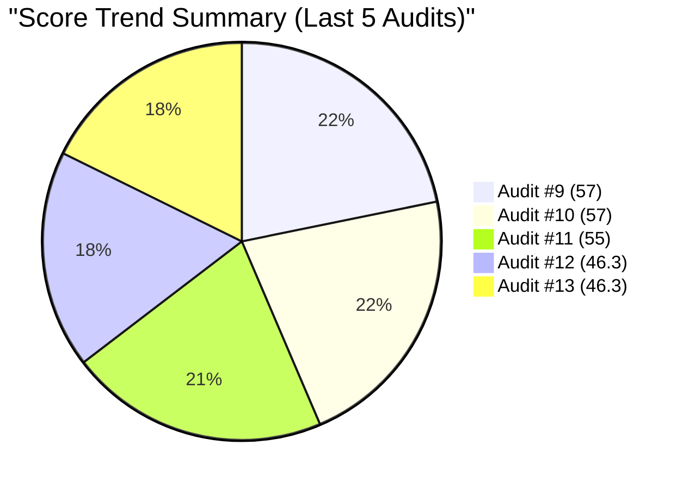
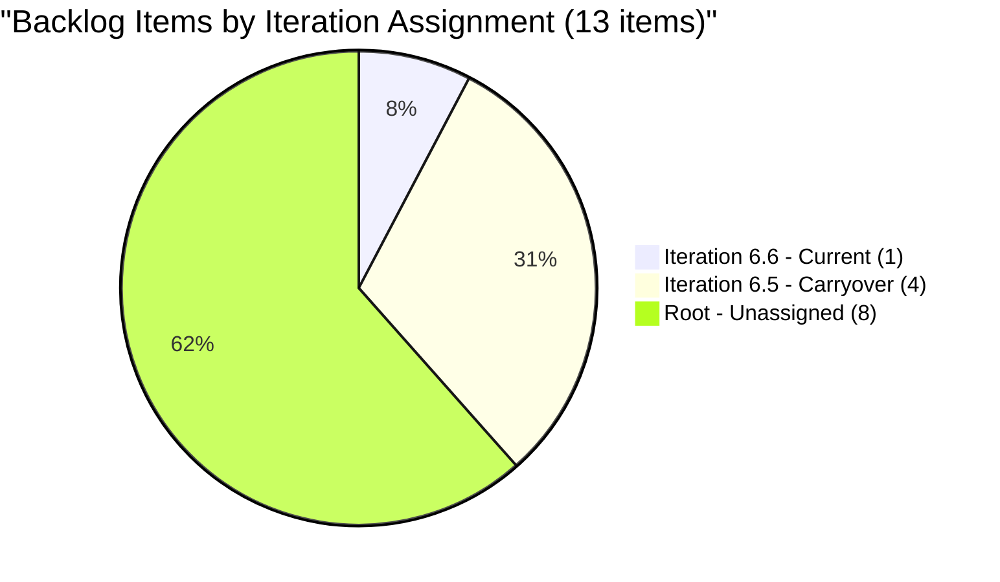
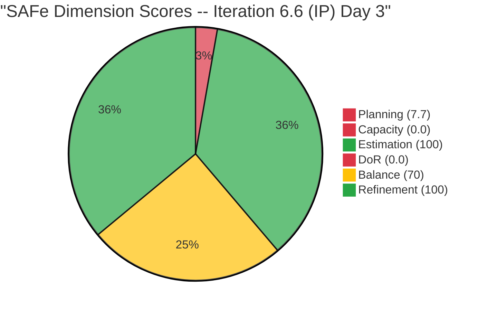
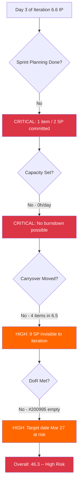

# SAFe Audit Report -- Administration Team Board

## Jairosoft FINOPS Azure DevOps Project

---

## 1. Audit Metadata

| Field | Value |
|-------|-------|
| **Project** | Jairosoft FINOPS |
| **Project ID** | e0bb302f-40f9-46c3-8164-6f1acb317d63 |
| **Team** | Administration Team |
| **Team ID** | a38a9c02-07ab-483d-a1e3-aff54e19e603 |
| **Backlog** | Stories and Deliverables (`Microsoft.RequirementCategory`) |
| **Board URL** | [Administration Team Board](https://dev.azure.com/jairo/Jairosoft%20FINOPS/_boards/board/t/Administration%20Team/Stories%20and%20Deliverables) |
| **Workspace Folder** | `ado_admin` |
| **Current Iteration** | Iteration 6.6 (IP) |
| **Iteration Path** | `Jairosoft FINOPS\2026-PI6\Iteration 6.6 (IP)` |
| **Iteration Start** | March 23, 2026 |
| **Iteration Finish** | April 5, 2026 |
| **Audit Date** | March 25, 2026 09:45 UTC |
| **Audit Day** | Day 3 of 14 (early iteration) |
| **Previous Audit** | AUDIT_20260325_0840 (Mar 25, 2026 -- Audit #12, Iteration 6.6 Day 3) |
| **Overall Score** | **46.3 / 100** |
| **Risk Band** | **High Risk** |
| **Audit Series** | #13 |
| **Framework** | SAFe 6.0 |
| **Rubric** | ADO SAFe v1 (six-dimension deterministic scoring) |

**Audit Boundary:** This audit covers only the Administration Team's Stories and Deliverables backlog in the Jairosoft FINOPS ADO project. No other teams, boards, projects, or repositories were analyzed. No GitHub repositories are in scope for this workspace.

---

## 2. Executive Summary

This is the **second audit of Iteration 6.6 (IP)** -- the Innovation and Planning sprint closing Program Increment 6. Conducted on Day 3 of the 14-day iteration, this audit finds **no change** from the earlier same-day audit (#12).

**The iteration remains severely under-planned.** Only **1 of 13** visible backlog items is assigned to Iteration 6.6. Four carryover stories (9 SP) from Iteration 6.5 remain parked in the 6.5 iteration path and have not been moved forward. Eight items (17 SP) sit unassigned at the root iteration path.

**Capacity planning remains regressed.** Mark Colina's capacity is configured with three activity types (Deployment, Documentation, Requirements) but all remain at **0 hours/day**. This is unchanged from Audit #12 and remains a regression from Iteration 6.5 where 8h/day was configured.

**The single planned item (#200995) still has no Description and no Acceptance Criteria**, failing the Definition of Ready. Its target date of March 27 is now 2 days away.

**Key numbers at Day 3:**
- 1 story / 2 SP assigned to Iteration 6.6
- 0 hours/day team capacity configured
- 4 carryover stories (9 SP) still in Iteration 6.5 path -- not moved
- 8 backlog items (17 SP) unassigned to any sprint
- Overall SAFe compliance: 46.3/100 (unchanged from Audit #12)

---

## 3. Previous Audit Delta

**Previous:** AUDIT_20260325_0840 -- Iteration 6.6 (IP) Day 3, Audit #12 (Mar 25, 2026)

| Metric | Audit #12 (6.6 Day 3, AM) | **Audit #13 (6.6 Day 3, PM)** | Delta |
|--------|---------------------------|-------------------------------|-------|
| Overall Score | 46.3/100 | **46.3/100** | 0 pts |
| Risk Band | High Risk | **High Risk** | No change |
| Items in Sprint | 1 | **1** | 0 |
| SP in Sprint | 2 | **2** | 0 |
| Capacity Configured | 0h/day | **0h/day** | No change |
| Visible Backlog Items | 13 | **13** | 0 |
| Carryover Items Moved | 0 of 5 | **0 of 4** | 1 item (#196725) no longer visible |
| DoR Pass Rate (Current) | 0% | **0%** | No change |

**Delta analysis:** No changes have occurred between Audit #12 and this audit. The board state, capacity configuration, and work item details are identical. The only difference is that the prior audit referenced 5 carryover candidates from 6.5; this audit observes 4 in the backlog query (CADAC Day 1 #196725 is no longer returned, consistent with Audit #12's note that it may have been closed or removed).

**Resolved since Audit #12:** None.

**New risks since Audit #12:** None new. All existing risks persist.

### Score Trend (Audits #1 - #13)



---

## 4. Current Iteration Snapshot

### 4.1 Iteration 6.6 (IP) -- Assigned Work Items

| ID | Title | Type | SP | State | Assigned To | Changed Date | DoR |
|----|-------|------|-----|-------|-------------|-------------|-----|
| 200995 | Follow up Budget request for corrugated sheet | User Story | 2 | New | Mark Colina | Mar 23, 2026 | FAIL |

**Total:** 1 item, 2 SP, 1 assignee (Mark Colina)

### 4.2 Carryover from 6.5 (Still in 6.5 Iteration Path)

These 4 items remain assigned to Iteration 6.5 and have **not** been moved to Iteration 6.6:

| ID | Title | Type | SP | State | Assigned To | Changed Date |
|----|-------|------|-----|-------|-------------|-------------|
| 200306 | Government payables | User Story | 4 | Active | Mark Colina | Mar 13, 2026 |
| 200301 | Internet for Cebu and Davao payables | User Story | 3 | Active | Mark Colina | Mar 17, 2026 |
| 200482 | JIT contract notary | User Story | 1 | Active | Mark Colina | Mar 17, 2026 |
| 200613 | BFP certification renewal follow up | User Story | 1 | Active | Mark Colina | Mar 18, 2026 |

**Carryover subtotal:** 4 items, 9 SP -- none reassigned to 6.6.

### 4.3 Unassigned Backlog Items (Root Iteration Path)

These items sit in the root `Jairosoft FINOPS` iteration path with no sprint assignment:

| ID | Title | Type | SP | State | Assigned To | Changed Date | Days Since Change |
|----|-------|------|-----|-------|-------------|-------------|-------------------|
| 192221 | Purchase additional Corrugated Sheet and installation Day 1 | User Story | 2 | New | Mark Colina | Feb 26 | 27 |
| 193412 | Implementation of aircon repair 2nd floor | User Story | 2 | New | Mark Colina | Mar 9 | 16 |
| 197115 | Implementation of installing jockey pump | User Story | 4 | New | Mark Colina | Feb 26 | 27 |
| 197111 | Recanvass for Jockey pump materials needed | User Story | 1 | New | Mark Colina | Feb 26 | 27 |
| 197023 | Installation of corrugated sheet at Fire Exit | User Story | 3 | New | Mark Colina | Mar 9 | 16 |
| 197029 | Implementation of Parking with roof for 2 vehicles (Day 1) | User Story | 3 | New | Mark Colina | Mar 9 | 16 |
| 197028 | Purchase materials at Houseman Hardware | User Story | 1 | New | Mark Colina | Mar 9 | 16 |
| 197113 | Purchase materials for Jockey pump | User Story | 1 | New | Mark Colina | Mar 9 | 16 |

**Unassigned subtotal:** 8 items, 17 SP -- all in New state.

### 4.4 Team Capacity

| Member | Activities | Capacity/Day | Days Off |
|--------|-----------|-------------|----------|
| Mark Colina | Deployment (0h), Documentation (0h), Requirements (0h) | **0 h/day** | 0 |
| **Team Total** | | **0 h/day** | 0 |

Capacity is effectively unconfigured. All three activity types exist but are set to zero. This is a regression from Iteration 6.5 where Documentation was set to 8h/day.

---

## 5. Work Item Analysis

### 5.1 Backlog Composition (All 13 Visible Root Items)

| Work Item Type | Count | SP | % of Items |
|----------------|-------|----|-----------|
| User Story | 13 | 28 | 100% |
| **Total** | **13** | **28** | 100% |

All 13 items are User Story type. No Defects, Issues, or Spikes are present.

### 5.2 State Distribution

| State | Count | SP | % |
|-------|-------|----|---|
| New | 9 | 19 | 69.2% |
| Active | 4 | 9 | 30.8% |
| Closed | 0 | 0 | 0% |
| **Total** | **13** | **28** | 100% |

### 5.3 Iteration Assignment Distribution

| Assignment | Count | SP | % |
|------------|-------|----|---|
| Iteration 6.6 (IP) - Current | 1 | 2 | 7.7% |
| Iteration 6.5 - Carryover | 4 | 9 | 30.8% |
| Root (Unassigned) | 8 | 17 | 61.5% |
| **Total** | **13** | **28** | 100% |



### 5.4 Age Distribution

| Age Bucket | Count | % | SP |
|------------|-------|---|----|
| Fresh (< 45 days) | 13 | 100% | 28 |
| Stale (> 90 days) | 0 | 0% | 0 |
| Very Stale (> 180 days) | 0 | 0% | 0 |

### 5.5 DoR Compliance Detail

**Definition of Ready criteria:** Description >= 30 non-whitespace chars AND Acceptance Criteria >= 20 non-whitespace chars (after trimming markup).

**Current iteration item (#200995):**

| ID | Title | Description | AC | DoR |
|----|-------|-----------|----|----|
| 200995 | Follow up Budget request for corrugated sheet | MISSING | MISSING | FAIL |

**Backlog-wide DoR assessment (for context):**

| ID | Title | Description (non-ws chars) | AC (non-ws chars) | DoR |
|----|-------|---------------------------|-------------------|-----|
| 192221 | Purchase additional Corrugated Sheet... | ~50 | ~40 | PASS |
| 193412 | Implementation of aircon repair... | ~40 | ~14 ("Attached photo") | FAIL |
| 197023 | Installation of corrugated sheet... | ~45 | ~15 ("Attached photos") | FAIL |
| 197028 | Purchase materials at Houseman... | ~35 | ~16 ("Attached receipt") | FAIL |
| 197029 | Implementation of Parking with roof... | ~55 | ~16 ("Attached receipt") | FAIL |
| 197111 | Recanvass for Jockey pump... | ~40 | ~16 ("Attached receipt") | FAIL |
| 197113 | Purchase materials for Jockey pump | ~32 | ~22 ("Attached receipt/photos") | PASS |
| 197115 | Implementation of installing jockey pump | ~40 | ~15 ("Attached photos") | FAIL |
| 200301 | Internet for Cebu and Davao payables | ~80 | ~16 ("Attached receipt") | FAIL |
| 200306 | Government payables | ~85 | ~16 ("Attached receipt") | FAIL |
| 200482 | JIT contract notary | ~130 | ~14 ("Attached photo") | FAIL |
| 200613 | BFP certification renewal follow up | ~90 | ~110 (3 detailed criteria) | PASS |
| 200995 | Follow up Budget request... | MISSING | MISSING | FAIL |

**Backlog DoR pass rate:** 3 of 13 (23.1%). Most failures are due to minimal acceptance criteria ("Attached receipt/photos").

---

## 6. SAFe Compliance Scorecard

| # | Dimension | Score | Formula | Evidence | Notes |
|---|-----------|-------|---------|----------|-------|
| 1 | Iteration Planning | **7.7** | 1 / 13 * 100 | 1 of 13 root items assigned to 6.6 | 4 carryover items in 6.5; 8 unassigned at root |
| 2 | Team Capacity | **0.0** | 0 / 1 * 100 | 0 of 1 contributors have positive capacity | Mark has 3 activities all at 0h/day -- regression |
| 3 | Estimation | **100.0** | 1 / 1 * 100 | 1 of 1 point-eligible items has SP > 0 | #200995 has 2 SP |
| 4 | DoR Compliance | **0.0** | 0 / 1 * 100 | 0 of 1 current items pass DoR | #200995 missing Description and AC |
| 5 | Work Item Balance | **70.0** | 100 - 30 | No -40 (has User Story); -30 (dominant 100% > 60%); no -20 (0% Spike) | Single-type concentration penalty |
| 6 | Backlog Refinement | **100.0** | 100 - 0 | 13/13 fresh; 0 stale_90; 0 stale_180; 0 untouched | All items recently touched |
| | **Overall** | **46.3** | (7.7+0+100+0+70+100)/6 | | **High Risk** (< 60) |

### Score Computation Detail

```
Iteration Planning:    round(1 / 13 * 100, 1)  = 7.7
Team Capacity:         round(0 / 1 * 100, 1)   = 0.0
Estimation:            round(1 / 1 * 100, 1)    = 100.0
DoR Compliance:        round(0 / 1 * 100, 1)    = 0.0
Work Item Balance:     100 - 30                  = 70.0
  Has User Story:      Yes (no -40)
  Dominant share:      100% > 60% (-30)
  Spike share:         0% (no -20)
Backlog Refinement:    100.0 - 0                 = 100.0
  Fresh/visible:       13/13 = 100%
  Stale_90/visible:    0/13 = 0% (no penalty)
  Stale_180:           0 (no penalty)
  Untouched/current:   0/1 = 0% (no penalty)

Overall:               (7.7 + 0.0 + 100.0 + 0.0 + 70.0 + 100.0) / 6 = 46.3
Risk Band:             High Risk (40-59.9)
```

### Scorecard Visualization



### Score Trend Table (Audits #1 - #13)

| Audit | Date | Iteration | Score | Risk Band |
|-------|------|-----------|-------|-----------|
| #1 | Feb 25 | 6.3 | 42 | High Risk |
| #2 | Mar 4 | 6.4 | 51 | High Risk |
| #3 | Mar 4 | 6.4 | 56 | High Risk |
| #4 | Mar 5 | 6.4 | 57 | High Risk |
| #5 | Mar 6 | 6.4 | 58 | High Risk |
| #6 | Mar 9 | 6.5 | 62 | Moderate |
| #7 | Mar 9 | 6.5 | 54 | High Risk |
| #8 | Mar 16 | 6.5 | 55 | High Risk |
| #9 | Mar 17 | 6.5 | 57 | High Risk |
| #10 | Mar 18 | 6.5 | 57 | High Risk |
| #11 | Mar 22 | 6.5 | 55 | High Risk |
| #12 | Mar 25 | 6.6 | 46.3 | High Risk |
| **#13** | **Mar 25** | **6.6** | **46.3** | **High Risk** |

---

## 7. Dimension Findings

### 7.1 Iteration Planning (7.7/100) -- CRITICAL

**Finding F-IP1 (CRITICAL): Iteration 6.6 has only 1 of 13 backlog items assigned.**

The IP Sprint started March 23 and we are now on Day 3. Only one item (#200995, 2 SP) has been moved into the iteration. Four carryover stories from Iteration 6.5 (totaling 9 SP) remain assigned to the 6.5 iteration path and are not visible in 6.6 planning views.

The previous two audits (#11, #12) recommended committing 15-19 SP to Iteration 6.6, combining carryover and new work. Current commitment stands at 2 SP -- approximately 10-13% of the recommended level.

**Impact:** The team has no meaningful iteration plan. Without explicit sprint assignment, work cannot be tracked, burned down, or measured against capacity. ADO iteration views and burndown charts are empty.

**Trend:** Unchanged from Audit #12. No items have been moved since the iteration started.

### 7.2 Team Capacity (0.0/100) -- CRITICAL

**Finding F-TC1 (CRITICAL): Capacity has regressed to 0 h/day and remains uncorrected.**

Mark Colina's capacity was set to 8h/day Documentation during Iteration 6.5 (resolved finding from Mar 9, Audit #6). For Iteration 6.6, all three configured activities (Deployment, Documentation, Requirements) are at 0 h/day. This was flagged in Audit #12 and has not been addressed.

**Impact:** Without capacity, ADO cannot generate burndown charts, capacity alerts, or over-allocation warnings. The team's iteration dashboard provides no planning intelligence.

**Trend:** Regressed from Iteration 6.5 (8h/day). Unchanged from Audit #12.

### 7.3 Estimation (100.0/100) -- GOOD

The sole current iteration item (#200995) has Story Points = 2. All 13 visible backlog items have story points assigned, ranging from 1 to 4 SP. This is a sustained improvement from early audits where estimation was absent.

**Trend:** Stable at 100% since Audit #6. This remains a strength.

### 7.4 DoR Compliance (0.0/100) -- CRITICAL

**Finding F-DoR1 (CRITICAL): #200995 has no Description and no Acceptance Criteria.**

The item was created on March 12 and moved to Iteration 6.6 on March 23. It has a title and 2 SP, but no elaboration. The target date of March 27 is now 2 days away with zero definition of what "done" means.

**Impact:** Work cannot be started safely without a Definition of Ready. The March 27 target date makes this an immediate concern.

**Trend:** Unchanged from Audit #12. No elaboration has been added.

### 7.5 Work Item Balance (70.0/100) -- MODERATE

All current iteration items (1 of 1) are User Stories, which is the correct primary type. The -30 penalty comes from 100% type concentration (dominant share > 60%). With a single item in the iteration, this is partly a mathematical artifact.

For an IP Sprint, SAFe recommends allocating time for innovation, PI planning, retrospectives, and technical debt. No Spikes, exploration items, or planning activities are present, which is a specific concern for an Innovation and Planning sprint.

**Trend:** Unchanged from Audit #12.

### 7.6 Backlog Refinement (100.0/100) -- GOOD

All 13 visible backlog items have been changed within the last 45 days. No items exceed the 90-day or 180-day staleness thresholds. The sole current iteration item was changed on the iteration start date (March 23), so it is not untouched.

**Trend:** Stable at 100%. This reflects the grooming activity from the Iteration 6.5 cycle.

**Risk:** As the iteration progresses without grooming, items with Feb 26 change dates (192221, 197111, 197115) will approach the 45-day freshness boundary by mid-April.

---

## 8. Risks and Bottlenecks

### Risk 1 (CRITICAL): IP Sprint Planning Still Not Started -- Day 3

- **Source:** ADO iteration assignment data
- **Description:** Day 3 of 14 with only 1 item / 2 SP committed. No iteration plan exists. This was flagged as Priority 1 in Audit #12 with a "complete by end of Day 3" deadline.
- **Impact:** The team will either work without tracking or waste additional iteration days before planning. 21% of the sprint has elapsed with no plan.
- **Mitigation:** Conduct immediate sprint planning today. Move carryover items and select new work from the 17 SP unassigned backlog.

### Risk 2 (CRITICAL): Capacity Regression Persists

- **Source:** ADO capacity configuration
- **Description:** Mark's capacity remains at 0 h/day across all activities. This was flagged as Priority 2 in Audit #12 with an "immediate" deadline.
- **Impact:** No burndown charts, no capacity alerts, no over-allocation detection. The iteration dashboard is nonfunctional.
- **Mitigation:** Set capacity to 8h/day immediately with activity distribution appropriate for an IP Sprint.

### Risk 3 (HIGH): Carryover Items Orphaned in 6.5

- **Source:** ADO iteration path data
- **Description:** 4 items (9 SP) remain assigned to Iteration 6.5. They are invisible in 6.6 planning views but still appear on the team backlog.
- **Impact:** Work in progress is not tracked against the current iteration. Progress reporting is broken for these items.
- **Mitigation:** Move all active carryover items (#200306, #200301, #200482, #200613) to Iteration 6.6 iteration path.

### Risk 4 (HIGH): Single Team Member (Bus Factor = 1)

- **Source:** ADO assignment data (persistent finding since Audit #1)
- **Description:** Mark Colina is the sole contributor across all 13 backlog items. This has been flagged in every audit.
- **Impact:** Any absence blocks all work. No peer review, knowledge sharing, or backup coverage.
- **Mitigation:** Structural issue requiring management decision. At minimum, document critical processes and identify a backup contact.

### Risk 5 (HIGH): DoR Failure with Imminent Target Date

- **Source:** ADO work item #200995
- **Description:** The sole iteration item has a March 27 target date (2 days away) with no Description or Acceptance Criteria.
- **Impact:** Work may be completed without clear definition, leading to rework or acceptance disputes.
- **Mitigation:** Elaborate #200995 immediately with Description and AC before starting work.

### Risk 6 (MEDIUM): IP Sprint Not Used for Innovation/Planning

- **Source:** SAFe framework expectation for IP Sprints
- **Description:** The IP Sprint in SAFe is designated for innovation, PI planning, retrospectives, and technical debt reduction. The sole planned item is a routine budget follow-up.
- **Impact:** Missed opportunity for PI 7 preparation, team retrospective, and process improvement. The team exits PI 6 without reflection.
- **Mitigation:** Add PI 6 retrospective, PI 7 planning, and at least one innovation or improvement item.



---

## 9. Prioritized Recommendations

### Priority 1: Conduct Sprint Planning Immediately (CRITICAL -- overdue)

This was recommended in Audit #12 with a "complete by end of Day 3" deadline. It is now urgent.

1. **Move carryover items to 6.6:** Reassign #200306 (4 SP), #200301 (3 SP), #200482 (1 SP), #200613 (1 SP) from Iteration 6.5 to Iteration 6.6 (IP).
2. **Select additional backlog items:** Choose 5-7 SP of new work from the 8 unassigned items (17 SP available).
3. **Set total commitment at 14-16 SP:** Based on 6.5 velocity (~19 SP capacity for 14 days minus IP activity buffer).
4. **Deadline:** Complete planning by end of Day 3 (March 25, 2026).

### Priority 2: Restore Capacity Configuration (CRITICAL -- immediate)

1. Set Mark Colina's capacity to **8 h/day**.
2. Distribute across activities appropriate for an IP Sprint:
   - Documentation: 3 h/day (carryover work completion)
   - Requirements: 3 h/day (PI 7 planning and refinement)
   - Deployment: 2 h/day (operational tasks)
3. Configure any planned days off for the April 2-5 Holy Week period if applicable.

### Priority 3: Elaborate #200995 to Meet DoR (HIGH -- before March 27)

1. Add a **Description** (>= 30 non-whitespace characters) explaining what "follow up budget request" entails, who to follow up with, and what the expected outcome is.
2. Add **Acceptance Criteria** (>= 20 non-whitespace characters) defining specific "done" conditions (e.g., budget approval received, corrugated sheet quantity confirmed, vendor quote attached).
3. Verify the March 27 target date is achievable given current progress.

### Priority 4: Add IP Sprint Activities (MEDIUM -- within Week 1)

SAFe IP Sprints should include:
1. **PI 6 Retrospective:** Create a work item to review the full PI 6 performance across Iterations 6.1-6.6. Assess what worked, what didn't, and what to change for PI 7.
2. **PI 7 Planning:** Create a work item for drafting the PI 7 iteration structure, selecting features, and estimating capacity.
3. **Process Improvement:** Consider a Spike item for improving acceptance criteria quality across the backlog -- a persistent finding across all 13 audits.

### Priority 5: Improve Acceptance Criteria Quality (MEDIUM -- ongoing)

Only 3 of 13 backlog items pass DoR. Most failures are due to minimal acceptance criteria such as "Attached receipt" or "Attached photos." For items moving into 6.6:
1. Expand AC to include specific, measurable, testable conditions.
2. Example: Instead of "Attached receipt," use "Receipt from vendor attached showing item description, quantity, unit price, and total. Amount matches approved budget line item."

---

## 10. Evidence Gaps and Limitations

| Gap | Impact | Mitigation |
|-----|--------|-----------|
| **CADAC Day 1 (#196725) no longer in backlog query** | Cannot confirm disposition (closed, removed, or moved) | Was a 6.5 carryover candidate; not counted in visible root items; would need direct work item query to confirm |
| **Same-day repeat audit** | This audit (#13) produces identical scores to Audit #12 since no board changes occurred between audits | Noted throughout; delta section confirms zero change |
| **Day 3 snapshot bias** | Iteration is only 21% elapsed; scores for Planning, Capacity, and DoR may improve if action is taken | This is an early-iteration audit; scores reflect current state, not projected outcome |
| **Iteration 6.5 carryover items in 6.5 path** | These 4 items are visible in backlog but NOT counted as current_iteration_root_items because IterationPath does not match 6.6 | Scored strictly per rubric; operational impact documented in findings |
| **Capacity 0 vs unconfigured** | Cannot distinguish "not configured" from "intentionally set to 0" via API | Treated as unconfigured based on prior audit context (Mark had 8h/day in 6.5) |
| **No GitHub repositories in scope** | This workspace has no associated GitHub repositories; delivery evidence is limited to ADO data | Not a gap -- this is the defined audit boundary for the Administration Team |
| **Prior audit rubric differences** | Audits #1-#7 used different scoring categories; trend line uses scores as-reported | Direct comparison is approximate for pre-rubric audits |

---

*Report generated: March 25, 2026 09:45 UTC*
*Auditor: AI EngProd Consultant (SAFe 6.0)*
*Rubric: ADO SAFe v1 (six-dimension deterministic scoring)*
*Next recommended audit: March 28, 2026 (Day 6 -- mid-iteration check)*
