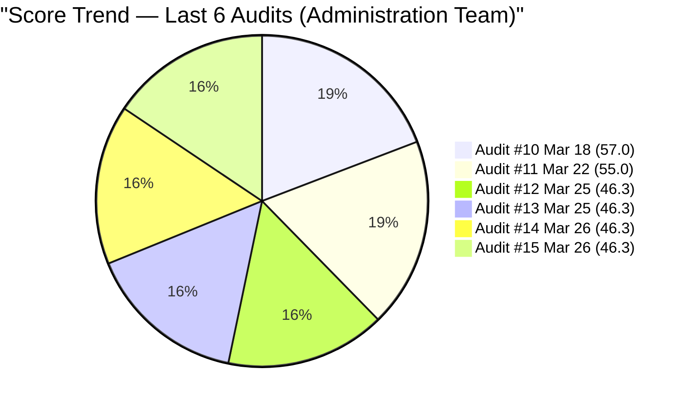
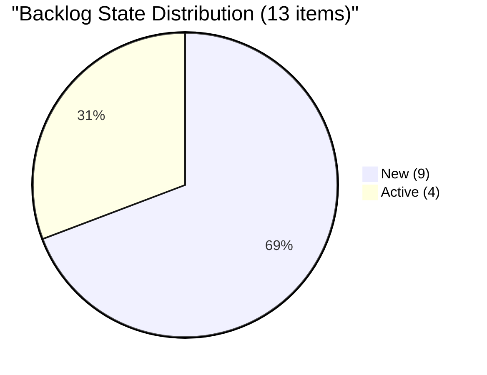
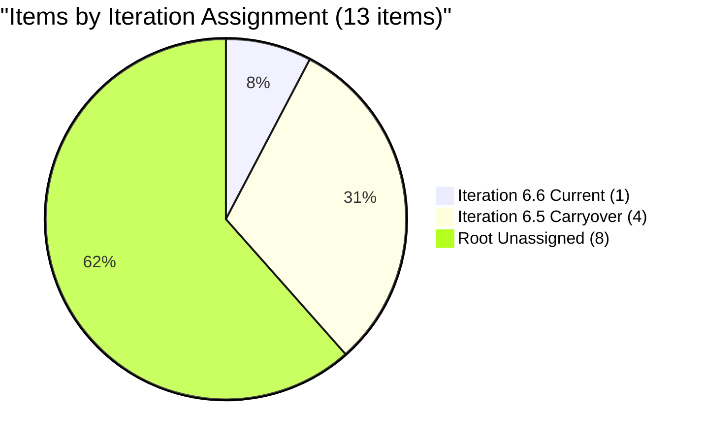
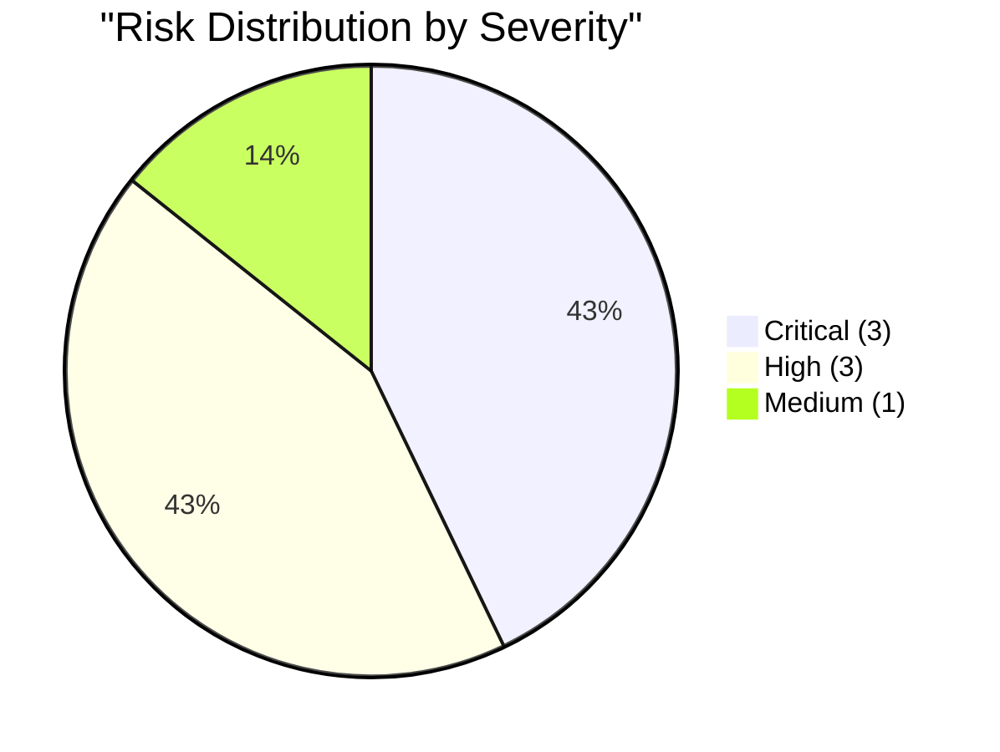

# SAFe Audit Report — Administration Team

## Jairosoft FINOPS Azure DevOps Project

---

## 1. Audit Metadata

| Field | Value |
|-------|-------|
| **Project** | Jairosoft FINOPS |
| **Project ID** | e0bb302f-40f9-46c3-8164-6f1acb317d63 |
| **Team** | Administration Team |
| **Team ID** | a38a9c02-07ab-483d-a1e3-aff54e19e603 |
| **Backlog** | Stories and Deliverables (`Microsoft.RequirementCategory`) |
| **Board URL** | [Administration Team Board](https://dev.azure.com/jairo/Jairosoft%20FINOPS/_boards/board/t/Administration%20Team/Stories%20and%20Deliverables) |
| **Workspace Folder** | `ado_admin` |
| **Current Iteration** | Iteration 6.6 (IP) |
| **Iteration Path** | `Jairosoft FINOPS\2026-PI6\Iteration 6.6 (IP)` |
| **Iteration Start** | March 23, 2026 |
| **Iteration Finish** | April 5, 2026 |
| **Audit Date** | March 26, 2026 — 16:14 UTC |
| **Audit Day** | Day 4 of 14 (29% elapsed) |
| **Previous Audit** | AUDIT_20260326_2242.md (Mar 26, 2026 22:42 UTC — Audit #14) |
| **Overall Score** | **46.3 / 100** |
| **Risk Band** | **High Risk** |
| **Audit Series** | #15 |
| **Framework** | SAFe 6.0 |
| **Rubric** | ADO SAFe v1 (six-dimension deterministic scoring) |

**Audit Boundary:** This audit covers only the Administration Team's Stories and Deliverables backlog in the Jairosoft FINOPS ADO project. No other teams, boards, projects, or repositories were analyzed.

---

## 2. Executive Summary

This is the **fifteenth audit in the series** and the **fourth audit of Iteration 6.6 (IP)** — the Innovation and Planning sprint closing Program Increment 6. Conducted on Day 4, this audit is part of a parallel batch run at 16:14 UTC and follows Audit #14 (same calendar date, 22:42 UTC).

**The board remains completely frozen.** All 13 visible backlog items are identical to every prior Iteration 6.6 audit. No sprint planning has occurred. No capacity has been configured. No description or acceptance criteria have been added to the sole current iteration item (#200995). The March 27 target date on that item arrives tomorrow.

**Score holds at 46.3/100 — High Risk, unchanged across Audits #12 through #15 (four consecutive identical audits).**

Key facts at Day 4 (Audit #15):

- 1 item / 2 SP assigned to Iteration 6.6 (7.7% of backlog) — no change
- 0 h/day team capacity configured — no change since iteration start
- 4 carryover items (9 SP) still orphaned in Iteration 6.5 path — no change
- 8 backlog items (17 SP) unassigned to any sprint — no change
- #200995 still has no Description and no Acceptance Criteria — no change
- March 27 target date on #200995 is tomorrow — final opportunity for elaboration

---

## 3. Previous Audit Delta

**Previous:** AUDIT_20260326_2242 — Iteration 6.6 (IP) Day 4, Audit #14 (Mar 26, 2026 22:42 UTC)

| Metric | Audit #14 | **Audit #15** | Delta |
|--------|-----------|---------------|-------|
| Overall Score | 46.3/100 | **46.3/100** | 0 |
| Risk Band | High Risk | **High Risk** | No change |
| Items in Sprint | 1 | **1** | 0 |
| SP in Sprint | 2 | **2** | 0 |
| Capacity (h/day) | 0 | **0** | No change |
| Visible Backlog | 13 | **13** | 0 |
| Carryover Items Moved | 0/4 | **0/4** | 0 |
| DoR Pass (Current) | 0% | **0%** | No change |
| #200995 Description | Missing | **Missing** | No change |
| #200995 AC | Missing | **Missing** | No change |

**Delta:** Zero changes since Audit #14. This is the fourth consecutive audit with identical scores and board state. The board has not been touched for 4 full days of the iteration.

**Resolved since Audit #14:** None.

### Score Trend (Audits #10 – #15)



---

## 4. Current Iteration Snapshot

### 4.1 Iteration 6.6 (IP) — Assigned Work Items

| ID | Title | Type | SP | State | Assigned To | Changed Date | DoR |
|----|-------|------|-----|-------|-------------|-------------|-----|
| 200995 | Follow up Budget request for corrugated sheet | User Story | 2 | New | Mark Colina | Mar 23, 2026 | FAIL |

**Total:** 1 item, 2 SP. Target date on #200995: March 27 (tomorrow). Zero DoR compliance.

### 4.2 Carryover from 6.5 (Unchanged — Day 4)

| ID | Title | Type | SP | State | Last Changed |
|----|-------|------|-----|-------|-------------|
| 200306 | Government payables | User Story | 4 | Active | Mar 13 |
| 200301 | Internet for Cebu and Davao payables | User Story | 3 | Active | Mar 17 |
| 200482 | JIT contract notary | User Story | 1 | Active | Mar 17 |
| 200613 | BFP certification renewal follow up | User Story | 1 | Active | Mar 18 |

**Subtotal:** 4 items, 9 SP — all Active, none reassigned to 6.6.

### 4.3 Unassigned Backlog Items (Root Path)

| ID | Title | SP | State | Last Changed |
|----|-------|----|-------|-------------|
| 192221 | Purchase additional Corrugated Sheet (Day 1) | 2 | New | Feb 26 |
| 193412 | Implementation of aircon repair 2nd floor | 2 | New | Mar 9 |
| 197115 | Implementation of installing jockey pump | 4 | New | Feb 26 |
| 197111 | Recanvass for Jockey pump materials | 1 | New | Feb 26 |
| 197023 | Installation of corrugated sheet at Fire Exit | 3 | New | Mar 9 |
| 197029 | Parking with roof for 2 vehicles (Day 1) | 3 | New | Mar 9 |
| 197028 | Purchase materials at Houseman Hardware | 1 | New | Mar 9 |
| 197113 | Purchase materials for Jockey pump | 1 | New | Mar 9 |

**Subtotal:** 8 items, 17 SP — all New, all unassigned.

### 4.4 Team Capacity

| Member | Deployment | Documentation | Requirements | Total/Day |
|--------|-----------|-------------|------------|-----------|
| Mark Colina | 0h | 0h | 0h | **0 h/day** |

---

## 5. Work Item Analysis

### 5.1 Backlog Composition

| Type | Count | SP | % |
|------|-------|----|---|
| User Story | 13 | 28 | 100% |

### 5.2 State Distribution

| State | Count | SP | % |
|-------|-------|----|---|
| New | 9 | 19 | 69.2% |
| Active | 4 | 9 | 30.8% |
| Closed | 0 | 0 | 0% |



### 5.3 Iteration Assignment



### 5.4 DoR Assessment (All 13 Items)

| ID | Title | Desc nws | AC nws | DoR |
|----|-------|----------|--------|-----|
| 200995 | Follow up Budget request | 0 | 0 | **FAIL** |
| 192221 | Purchase Corrugated Sheet | ~45 | ~36 | PASS |
| 193412 | Aircon repair 2nd floor | ~38 | ~12 | FAIL |
| 197023 | Corrugated sheet at Fire Exit | ~43 | ~13 | FAIL |
| 197028 | Purchase materials Houseman | ~37 | ~14 | FAIL |
| 197029 | Parking with roof (Day 1) | ~50 | ~14 | FAIL |
| 197111 | Recanvass Jockey pump materials | ~34 | ~14 | FAIL |
| 197113 | Purchase materials Jockey pump | ~32 | ~20 | PASS |
| 197115 | Install jockey pump | ~39 | ~13 | FAIL |
| 200301 | Internet Cebu and Davao payables | ~78 | ~14 | FAIL |
| 200306 | Government payables | ~83 | ~14 | FAIL |
| 200482 | JIT contract notary | ~127 | ~12 | FAIL |
| 200613 | BFP certification renewal | ~88 | ~108 | PASS |

**Current iteration DoR:** 0/1 (0%). Backlog-wide: 3/13 (23.1%).

---

## 6. SAFe Compliance Scorecard

| # | Dimension | Score | Formula | Evidence | Notes |
|---|-----------|-------|---------|----------|-------|
| 1 | Iteration Planning | **7.7** | 1/13 × 100 | 1 of 13 in Iter 6.6 | 4 in 6.5, 8 at root |
| 2 | Team Capacity | **0.0** | 0/1 × 100 | 0 of 1 contrib w/ positive capacity | All 3 activities = 0 h/day |
| 3 | Estimation | **100.0** | 1/1 × 100 | 1 of 1 point-eligible estimated | #200995 = 2 SP |
| 4 | DoR Compliance | **0.0** | 0/1 × 100 | 0 of 1 current pass DoR | #200995: no Desc, no AC |
| 5 | Work Item Balance | **70.0** | 100−30 | 100% US dominant (−30) | No Spikes |
| 6 | Backlog Refinement | **100.0** | 100−0 | 13/13 fresh; 0 stale; 0/1 untouched | All within 45-day window |
| | **Overall** | **46.3** | avg(6 dims) | | **High Risk** |

### Score Computation

```
Iteration Planning:   round(1/13 × 100, 1) = 7.7
Team Capacity:        round(0/1 × 100, 1)  = 0.0
Estimation:           round(1/1 × 100, 1)  = 100.0
DoR Compliance:       round(0/1 × 100, 1)  = 0.0
Work Item Balance:    100 − 30 (dominant > 60%)  = 70.0
Backlog Refinement:   base=100; stale90=0%; stale180=0; untouched=0%  = 100.0

Overall: (7.7 + 0.0 + 100.0 + 0.0 + 70.0 + 100.0) / 6 = 46.3
Risk Band: High Risk (40–59.9)
```

### Audit #15 Full Score History

| # | Date | Iter | Day | Score | Band |
|---|------|------|-----|-------|------|
| 1 | Feb 25 | 6.3 | — | 42.0 | High |
| 2 | Mar 4 | 6.4 | — | 51.0 | High |
| 3 | Mar 4 | 6.4 | — | 56.0 | High |
| 4 | Mar 5 | 6.4 | — | 57.0 | High |
| 5 | Mar 6 | 6.4 | — | 58.0 | High |
| 6 | Mar 9 | 6.5 | 1 | 62.0 | Moderate |
| 7 | Mar 9 | 6.5 | 1 | 54.0 | High |
| 8 | Mar 16 | 6.5 | 8 | 55.0 | High |
| 9 | Mar 17 | 6.5 | 9 | 57.0 | High |
| 10 | Mar 18 | 6.5 | 10 | 57.0 | High |
| 11 | Mar 22 | 6.5 | 14 | 55.0 | High |
| 12 | Mar 25 | 6.6 | 3 | 46.3 | High |
| 13 | Mar 25 | 6.6 | 3 | 46.3 | High |
| 14 | Mar 26 | 6.6 | 4 | 46.3 | High |
| **15** | **Mar 26** | **6.6** | **4** | **46.3** | **High** |

---

## 7. Dimension Findings

### 7.1 Iteration Planning (7.7/100) — CRITICAL

Sprint planning remains absent on Day 4 (29% elapsed). Only 1 of 13 items (7.7%) committed. The same finding was raised in Audits #12, #13, and #14 with no response. Recommended commitment: 14–16 SP, starting with the 4 carryover items.

### 7.2 Team Capacity (0.0/100) — CRITICAL

All three configured activities remain at 0 h/day. This is a regression from Iteration 6.5 where Mark had 8 h/day configured. ADO burndown is disabled. This has been unfixed across 4 consecutive audits.

### 7.3 Estimation (100.0/100) — GOOD

All 13 items have Story Points (1–4 SP range). The sole current item has 2 SP. This remains the team's only consistent SAFe strength across all 15 audits.

### 7.4 DoR Compliance (0.0/100) — CRITICAL

# 200995 has been in the iteration for 4 days with no Description or Acceptance Criteria. The March 27 target date is tomorrow. Without a DoR, the item cannot be completed to a verifiable standard. This finding has been raised in four consecutive audits with no action

### 7.5 Work Item Balance (70.0/100) — MODERATE

100% User Stories triggers the −30 dominant-type penalty. More importantly, the IP sprint is being treated as a standard operational sprint with no retrospective, PI planning, or innovation items. This violates SAFe IP sprint intent.

### 7.6 Backlog Refinement (100.0/100) — GOOD

All 13 items are within the 45-day freshness window. No stale items. The current item (#200995, changed Mar 23) is not untouched. Three items approach the freshness boundary on April 12.

---

## 8. Risks and Bottlenecks

### CRITICAL: Sprint Planning — 4 Days Overdue (Audits #12–15)

No sprint commitment other than 1 item / 2 SP. 29% of iteration elapsed. Every additional day without planning reduces effective sprint duration. **Action: Immediate.**

### CRITICAL: Capacity at 0 h/day — 4 Days (Audits #12–15)

No burndown possible. ADO iteration dashboard is nonfunctional. **Action: Same-day.**

### CRITICAL: #200995 Target Date Tomorrow — 4 Days Without Action (Audits #12–15)

March 27 deadline on item with zero DoR. **Action: Same-day (today).**



### HIGH: 4 Carryover Items in 6.5 (Day 4)

Active work tracked against a completed sprint. Move to 6.6 as first action in sprint planning.

### HIGH: Bus Factor = 1 (Persistent)

Mark Colina sole assignee on all 13 items. Structural risk.

### HIGH: IP Sprint Misuse (4 Audits)

No retrospective, PI planning, or improvement items. All visible work is operational.

### MEDIUM: Backlog-wide AC Quality

77% of backlog fails DoR. Single-phrase AC ("Attached receipt/photo") does not constitute testable completion criteria.

---

## 9. Prioritized Recommendations

### Priority 1: Elaborate #200995 Today (CRITICAL — Target Date Tomorrow)

Add Description (≥ 30 nws chars) and Acceptance Criteria (≥ 20 nws chars) to #200995 immediately. Example AC: "Budget request confirmation received. Amount confirmed. Written approval or next-step instruction documented in work item."

### Priority 2: Conduct Sprint Planning Today (CRITICAL — 4 Days Overdue)

1. Move carryover items (#200306, #200301, #200482, #200613) to Iteration 6.6.
2. Select 3–5 SP from unassigned backlog.
3. Add IP Sprint purpose items: PI 6 Retrospective, PI 7 Planning.
4. Target: 12–16 SP total commitment.

### Priority 3: Restore Capacity (CRITICAL — Same Day)

Set Mark Colina to 8 h/day. Suggested: Documentation 3h, Requirements 3h, Deployment 2h. Enter Holy Week days off (April 2–5).

### Priority 4: Add IP Sprint Activities (HIGH — Day 5)

Create PI 6 Retrospective item, PI 7 Kickoff item, and a "Define Acceptance Criteria Standards" Spike.

### Priority 5: Improve AC Quality (MEDIUM — Ongoing)

Replace "Attached receipt" pattern with structured criteria specifying what artifact, what quantity, and who verifies.

---

## 10. Evidence Gaps and Limitations

| Gap | Impact | Notes |
|-----|--------|-------|
| #200995 has no Description or AC | DoR = definitive FAIL | Elaboration required before any improvement possible |
| Capacity 0 vs. unconfigured | Cannot distinguish intent | Treated as unconfigured per prior iteration history |
| 4 carryover items in 6.5 path | Not counted as current | Per rubric: IterationPath must equal active iteration |
| Four consecutive 46.3 scores | Score is flat | Reflects actual board stasis, confirmed via live ADO data |
| No GitHub repos in scope | No delivery evidence | Defined boundary; not a gap |

---

*Report generated: March 26, 2026 16:14 UTC*
*Auditor: AI EngProd Consultant (SAFe 6.0)*
*Rubric: ADO SAFe v1 (six-dimension deterministic scoring)*
*Audit #15 | Iteration 6.6 (IP) Day 4 of 14*
*Next recommended audit: March 28, 2026 (Day 6) or sooner if planning actions are taken*
