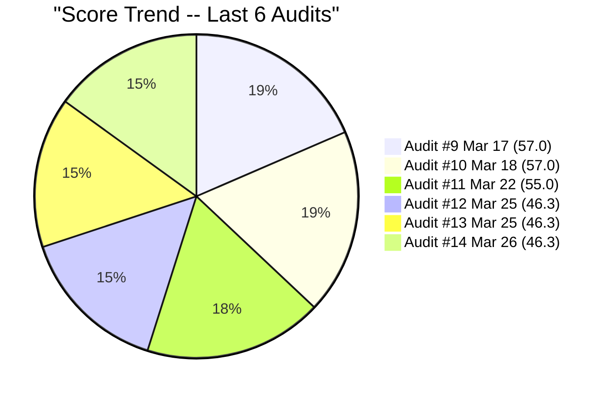
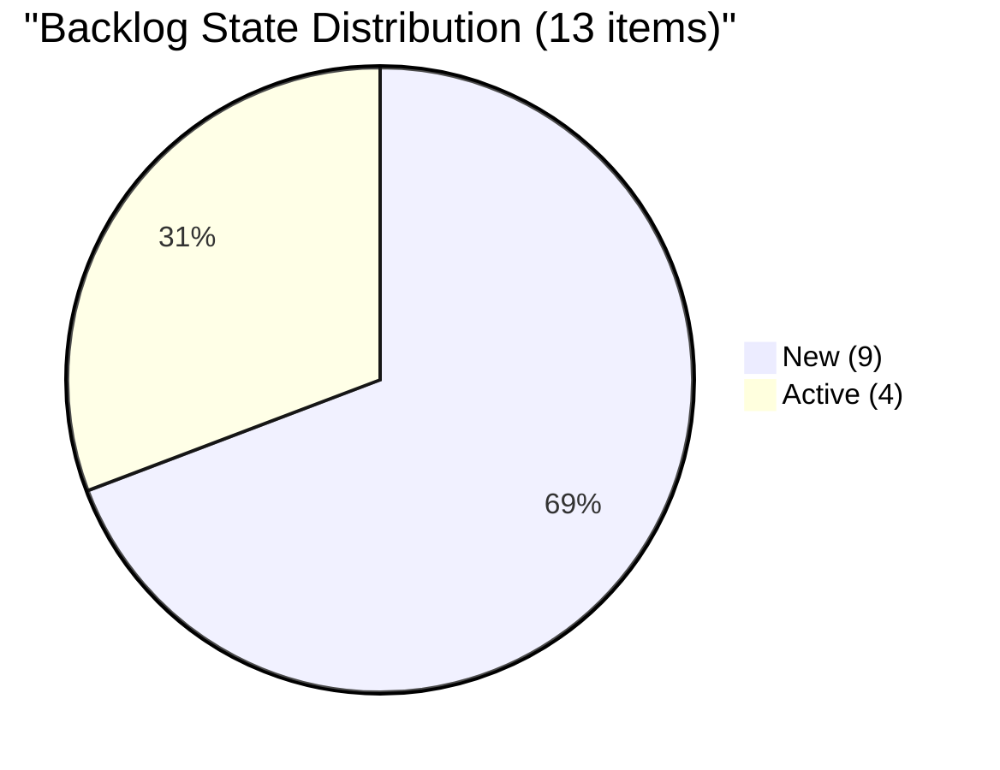
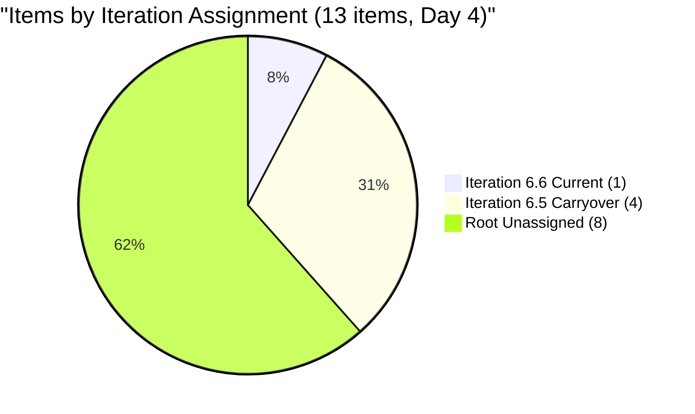
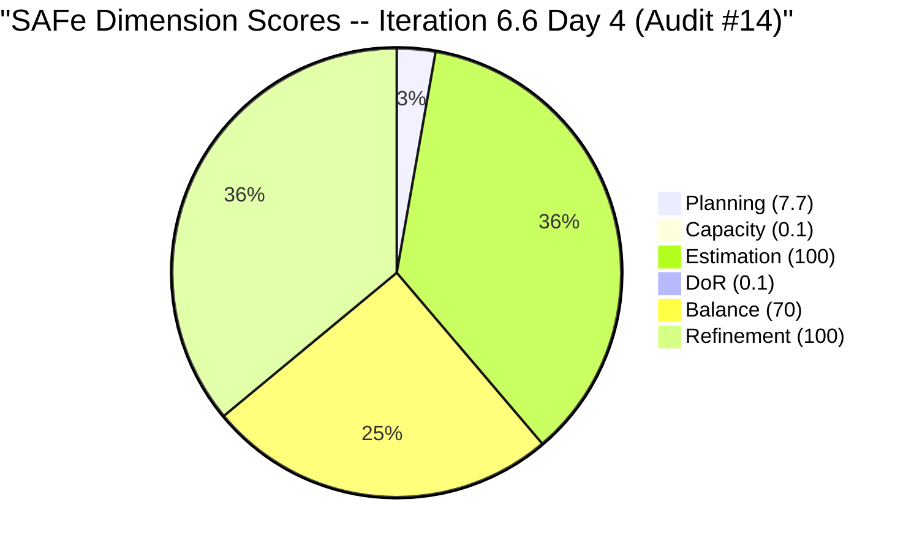
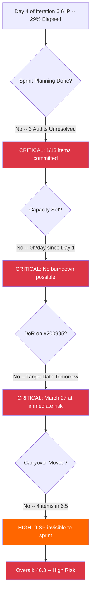

# SAFe Audit Report -- Administration Team Board

## Jairosoft FINOPS Azure DevOps Project

---

## 1. Audit Metadata

| Field | Value |
|-------|-------|
| **Project** | Jairosoft FINOPS |
| **Project ID** | e0bb302f-40f9-46c3-8164-6f1acb317d63 |
| **Team** | Administration Team |
| **Team ID** | a38a9c02-07ab-483d-a1e3-aff54e19e603 |
| **Backlog** | Stories and Deliverables (`Microsoft.RequirementCategory`) |
| **Board URL** | [Administration Team Board](https://dev.azure.com/jairo/Jairosoft%20FINOPS/_boards/board/t/Administration%20Team/Stories%20and%20Deliverables) |
| **Workspace Folder** | `ado_admin` |
| **Current Iteration** | Iteration 6.6 (IP) |
| **Iteration Path** | `Jairosoft FINOPS\2026-PI6\Iteration 6.6 (IP)` |
| **Iteration Start** | March 23, 2026 |
| **Iteration Finish** | April 5, 2026 |
| **Audit Date** | March 26, 2026 22:42 UTC |
| **Audit Day** | Day 4 of 14 (early iteration) |
| **Previous Audit** | AUDIT_20260325_094508 (Mar 25, 2026 -- Audit #13, Iteration 6.6 Day 3) |
| **Overall Score** | **46.3 / 100** |
| **Risk Band** | **High Risk** |
| **Audit Series** | #14 |
| **Framework** | SAFe 6.0 |
| **Rubric** | ADO SAFe v1 (six-dimension deterministic scoring) |

**Audit Boundary:** This audit covers only the Administration Team's Stories and Deliverables backlog in the Jairosoft FINOPS ADO project. No other teams, boards, projects, or repositories were analyzed. No GitHub repositories are in scope for this workspace.

---

## 2. Executive Summary

This is the **third audit of Iteration 6.6 (IP)** -- the Innovation and Planning sprint closing Program Increment 6. Conducted on Day 4 of the 14-day iteration, this audit finds **zero change** from the previous two same-day audits (#12 and #13, both conducted March 25).

**The board is frozen.** All 13 visible backlog items, their states, story points, descriptions, acceptance criteria, and iteration path assignments are identical to Audit #13. No planning actions have been taken over the past 25+ hours since the last audit.

**Critical actions are now 4 days overdue.** Audit #12 (Day 3) set a deadline of "end of Day 3" for sprint planning. Audit #13 repeated the same escalation. Neither has been acted upon. The iteration is now 29% elapsed (Day 4 of 14) with only 1 of 13 backlog items (7.7%) assigned to the current sprint.

**The March 27 target date for #200995 is tomorrow.** The item still has no Description and no Acceptance Criteria. Work cannot begin safely without a Definition of Ready.

**Key numbers at Day 4:**

- 1 story / 2 SP assigned to Iteration 6.6 (7.7% of backlog)
- 0 hours/day team capacity configured (regression from 6.5)
- 4 carryover stories (9 SP) still orphaned in Iteration 6.5 path
- 8 backlog items (17 SP) unassigned to any sprint
- Overall SAFe compliance: 46.3/100 (unchanged across Audits #12, #13, #14)

---

## 3. Previous Audit Delta

**Previous:** AUDIT_20260325_094508 -- Iteration 6.6 (IP) Day 3, Audit #13 (Mar 25, 2026 09:45 UTC)

| Metric | Audit #13 (Day 3, Mar 25) | **Audit #14 (Day 4, Mar 26)** | Delta |
|--------|---------------------------|-------------------------------|-------|
| Overall Score | 46.3/100 | **46.3/100** | 0 pts |
| Risk Band | High Risk | **High Risk** | No change |
| Items in Sprint | 1 | **1** | 0 |
| SP in Sprint | 2 | **2** | 0 |
| Capacity Configured | 0h/day | **0h/day** | No change |
| Visible Backlog Items | 13 | **13** | 0 |
| Carryover Items Moved | 0 of 4 | **0 of 4** | 0 |
| DoR Pass Rate (Current) | 0% | **0%** | No change |
| Hours Elapsed Since Audit #13 | -- | ~25 hours | No board activity |

**Delta analysis:** No changes whatsoever have occurred between Audit #13 and this audit. Every work item ID, state, story point value, description, acceptance criteria, and iteration path assignment is identical. The board has been untouched for at least 25 hours spanning Day 3 and the start of Day 4.

**Resolved since Audit #13:** None.

**New risks since Audit #13:** The March 27 target date on #200995 is now 1 day away (was 2 days in Audit #13). With no Description or Acceptance Criteria, this item cannot be completed to a verifiable standard.

### Score Trend (Audits #9 - #14)



---

## 4. Current Iteration Snapshot

### 4.1 Iteration 6.6 (IP) -- Assigned Work Items

| ID | Title | Type | SP | State | Assigned To | Changed Date | DoR |
|----|-------|------|-----|-------|-------------|-------------|-----|
| 200995 | Follow up Budget request for corrugated sheet | User Story | 2 | New | Mark Colina | Mar 23, 2026 | FAIL |

**Total:** 1 item, 2 SP, 1 assignee (Mark Colina)

**Target date alert:** Item #200995 has an implied target of March 27 (tomorrow). It has no Description and no Acceptance Criteria.

### 4.2 Carryover from 6.5 (Still in 6.5 Iteration Path -- Day 4, Unchanged)

These 4 items remain assigned to Iteration 6.5. They have not been moved to Iteration 6.6 across the full 4-day elapsed period of the current sprint.

| ID | Title | Type | SP | State | Assigned To | Days Since Last Change |
|----|-------|------|-----|-------|-------------|------------------------|
| 200306 | Government payables | User Story | 4 | Active | Mark Colina | 13 days (Mar 13) |
| 200301 | Internet for Cebu and Davao payables | User Story | 3 | Active | Mark Colina | 9 days (Mar 17) |
| 200482 | JIT contract notary | User Story | 1 | Active | Mark Colina | 9 days (Mar 17) |
| 200613 | BFP certification renewal follow up | User Story | 1 | Active | Mark Colina | 8 days (Mar 18) |

**Carryover subtotal:** 4 items, 9 SP -- all Active, none reassigned to 6.6.

### 4.3 Unassigned Backlog Items (Root Iteration Path)

| ID | Title | Type | SP | State | Changed Date | Days Since Change |
|----|-------|------|-----|-------|-------------|-------------------|
| 192221 | Purchase additional Corrugated Sheet and installation Day 1 | User Story | 2 | New | Feb 26 | 28 |
| 193412 | Implementation of aircon repair 2nd floor | User Story | 2 | New | Mar 9 | 17 |
| 197115 | Implementation of installing jockey pump | User Story | 4 | New | Feb 26 | 28 |
| 197111 | Recanvass for Jockey pump materials needed | User Story | 1 | New | Feb 26 | 28 |
| 197023 | Installation of corrugated sheet at Fire Exit | User Story | 3 | New | Mar 9 | 17 |
| 197029 | Implementation of Parking with roof for 2 vehicles (Day 1) | User Story | 3 | New | Mar 9 | 17 |
| 197028 | Purchase materials at Houseman Hardware | User Story | 1 | New | Mar 9 | 17 |
| 197113 | Purchase materials for Jockey pump | User Story | 1 | New | Mar 9 | 17 |

**Unassigned subtotal:** 8 items, 17 SP -- all in New state.

### 4.4 Team Capacity

| Member | Activities | Capacity/Day | Days Off |
|--------|-----------|-------------|----------|
| Mark Colina | Deployment (0h), Documentation (0h), Requirements (0h) | **0 h/day** | 0 |
| **Team Total** | | **0 h/day** | 0 |

Capacity remains at zero. All three activity types are configured but set to 0 h/day. This is unchanged since the iteration started on March 23.

---

## 5. Work Item Analysis

### 5.1 Backlog Composition (All 13 Visible Root Items)

| Work Item Type | Count | SP | % of Items |
|----------------|-------|----|-----------|
| User Story | 13 | 28 | 100% |
| **Total** | **13** | **28** | 100% |

### 5.2 State Distribution

| State | Count | SP | % |
|-------|-------|----|---|
| New | 9 | 19 | 69.2% |
| Active | 4 | 9 | 30.8% |
| Closed | 0 | 0 | 0% |
| **Total** | **13** | **28** | 100% |



### 5.3 Iteration Assignment Distribution

| Assignment | Count | SP | % |
|------------|-------|----|---|
| Iteration 6.6 (IP) -- Current | 1 | 2 | 7.7% |
| Iteration 6.5 -- Carryover | 4 | 9 | 30.8% |
| Root (Unassigned) | 8 | 17 | 61.5% |
| **Total** | **13** | **28** | 100% |



### 5.4 Age Distribution (Freshness Thresholds)

| Age Bucket | Threshold | Count | % |
|------------|-----------|-------|---|
| Fresh (< 45 days) | after Feb 9, 2026 | 13 | 100% |
| Approaching stale (> 30 days) | before Feb 24, 2026 | 3 | 23% |
| Stale (> 90 days) | before Dec 27, 2025 | 0 | 0% |
| Very Stale (> 180 days) | before Sep 29, 2025 | 0 | 0% |

**Warning:** Items 192221, 197111, and 197115 (all changed Feb 26) are now 28 days old and will cross the 45-day freshness boundary on April 12. If not touched before then, the Backlog Refinement score will degrade.

### 5.5 DoR Compliance Detail

**Current iteration item #200995 -- Definition of Ready assessment:**

| ID | Title | Description (non-ws chars) | AC (non-ws chars) | DoR |
|----|-------|---------------------------|-------------------|-----|
| 200995 | Follow up Budget request for corrugated sheet | 0 (missing) | 0 (missing) | FAIL |

**Item #200995 has no Description and no Acceptance Criteria.** This item has been in the iteration since March 23 (4 days) with no elaboration. The March 27 target date is tomorrow.

**Backlog-wide DoR assessment (all 13 items):**

| ID | Title | Desc nws | AC nws | DoR |
|----|-------|----------|--------|-----|
| 192221 | Purchase additional Corrugated Sheet... | ~45 | ~36 ("receipt and photos of installation") | PASS |
| 193412 | Implementation of aircon repair 2nd floor | ~38 | ~12 ("Attached photo") | FAIL |
| 197023 | Installation of corrugated sheet at Fire Exit | ~43 | ~13 ("Attached photos") | FAIL |
| 197028 | Purchase materials at Houseman Hardware | ~37 | ~14 ("Attached receipt") | FAIL |
| 197029 | Implementation of Parking with roof (Day 1) | ~50 | ~14 ("Attached receipt") | FAIL |
| 197111 | Recanvass for Jockey pump materials needed | ~34 | ~14 ("Attached receipt") | FAIL |
| 197113 | Purchase materials for Jockey pump | ~32 | ~20 ("Attached receipt/photos") | PASS |
| 197115 | Implementation of installing jockey pump | ~39 | ~13 ("Attached photos") | FAIL |
| 200301 | Internet for Cebu and Davao payables | ~78 | ~14 ("Attached receipt") | FAIL |
| 200306 | Government payables | ~83 | ~14 ("Attached receipt") | FAIL |
| 200482 | JIT contract notary | ~127 | ~12 ("Attached photo") | FAIL |
| 200613 | BFP certification renewal follow up | ~88 | ~108 (3 criteria) | PASS |
| 200995 | Follow up Budget request for corrugated sheet | 0 | 0 | FAIL |

**Backlog DoR pass rate:** 3 of 13 (23.1%). Identical to Audit #13. The dominant failure mode is inadequate acceptance criteria (single-phrase photo/receipt attachments).

---

## 6. SAFe Compliance Scorecard

| # | Dimension | Score | Formula | Evidence | Notes |
|---|-----------|-------|---------|----------|-------|
| 1 | Iteration Planning | **7.7** | 1 / 13 × 100 | 1 of 13 root items in 6.6 | 4 carryover in 6.5, 8 unassigned at root |
| 2 | Team Capacity | **0.0** | 0 / 1 × 100 | 0 of 1 contributors with positive capacity | All 3 activities = 0 h/day; regression from 6.5 |
| 3 | Estimation | **100.0** | 1 / 1 × 100 | 1 of 1 point-eligible items estimated | #200995 = 2 SP |
| 4 | DoR Compliance | **0.0** | 0 / 1 × 100 | 0 of 1 current items pass DoR | #200995 has no Description, no AC |
| 5 | Work Item Balance | **70.0** | 100 − 30 | Has User Story (no −40); 100% dominant (−30); 0% Spike (no −20) | Single-type concentration penalty |
| 6 | Backlog Refinement | **100.0** | 100 − 0 | 13/13 fresh; 0 stale_90; 0 stale_180; 0 untouched | All items changed within 45-day window |
| | **Overall** | **46.3** | (7.7+0+100+0+70+100) / 6 | | **High Risk** |

### Score Computation Detail

```
Iteration Planning:    round(1 / 13 × 100, 1)  = 7.7
Team Capacity:         round(0 / 1 × 100, 1)   = 0.0
Estimation:            round(1 / 1 × 100, 1)   = 100.0
DoR Compliance:        round(0 / 1 × 100, 1)   = 0.0
Work Item Balance:     100
  Has User Story:      Yes → no −40
  Dominant share:      100% > 60% → −30
  Spike share:         0% → no −20
  Result:              70.0
Backlog Refinement:    base = round(13/13 × 100, 1) = 100.0
  Stale_90/visible:    0/13 = 0% → no penalty
  Stale_180 count:     0 → no penalty
  Untouched/current:   0/1 = 0% → no penalty
  Result:              100.0

Overall:               (7.7 + 0.0 + 100.0 + 0.0 + 70.0 + 100.0) / 6 = 46.3
Risk Band:             High Risk (40–59.9)
```

### Scorecard Visualization



### Score History Table (All 14 Audits)

| # | Date | Iteration | Day | Score | Risk Band |
|---|------|-----------|-----|-------|-----------|
| 1 | Feb 25 | 6.3 | -- | 42.0 | High Risk |
| 2 | Mar 4 | 6.4 | -- | 51.0 | High Risk |
| 3 | Mar 4 | 6.4 | -- | 56.0 | High Risk |
| 4 | Mar 5 | 6.4 | -- | 57.0 | High Risk |
| 5 | Mar 6 | 6.4 | -- | 58.0 | High Risk |
| 6 | Mar 9 | 6.5 | 1 | 62.0 | Moderate Risk |
| 7 | Mar 9 | 6.5 | 1 | 54.0 | High Risk |
| 8 | Mar 16 | 6.5 | 8 | 55.0 | High Risk |
| 9 | Mar 17 | 6.5 | 9 | 57.0 | High Risk |
| 10 | Mar 18 | 6.5 | 10 | 57.0 | High Risk |
| 11 | Mar 22 | 6.5 | 14 | 55.0 | High Risk |
| 12 | Mar 25 | 6.6 | 3 | 46.3 | High Risk |
| 13 | Mar 25 | 6.6 | 3 | 46.3 | High Risk |
| **14** | **Mar 26** | **6.6** | **4** | **46.3** | **High Risk** |

---

## 7. Dimension Findings

### 7.1 Iteration Planning (7.7/100) -- CRITICAL (Day 4, No Change)

**Finding F-IP1 (CRITICAL): Sprint planning has not occurred. Day 4 of 14 with 7.7% of backlog committed.**

The IP Sprint began March 23. We are now 4 days in (29% elapsed). Only one item (#200995, 2 SP) has been moved into the iteration. The recommended sprint commitment based on prior velocity is 14-16 SP. Current commitment is 2 SP -- approximately 13% of target.

Recommendations to complete sprint planning by end of Day 3 were issued in Audit #12 and repeated in Audit #13. Neither was acted upon. Every additional day without a plan shortens the effective sprint by one working day.

**Carryover status:** 4 items totaling 9 SP remain in Iteration 6.5. They are Active (in-progress) items that should be the first candidates for 6.6 re-assignment.

**Impact:** ADO burndown charts show only 2 SP. Velocity tracking and capacity utilization reporting are meaningless. The team's progress is invisible to stakeholders.

### 7.2 Team Capacity (0.0/100) -- CRITICAL (Day 4, No Change)

**Finding F-TC1 (CRITICAL): Capacity is 0 h/day for all activities. Regression from Iteration 6.5 persists.**

Mark Colina's capacity shows three activity types (Deployment, Documentation, Requirements), each at 0 h/day. Capacity was at 8 h/day Documentation during Iteration 6.5. The regression was first flagged in Audit #12 and has not been corrected in 4 days.

**Impact:** ADO cannot generate a functional burndown chart. Work item capacity forecasting is disabled. With 14 days in the iteration and potentially ~19 SP of work (carryover + new), the team is flying blind without a capacity baseline.

**Note for IP Sprint:** The activity distribution should reflect IP Sprint realities -- innovation, PI planning, retrospective, and documentation -- not purely operational activities. Consider adding a "Planning" or "Retrospective" activity type.

### 7.3 Estimation (100.0/100) -- GOOD

All 13 visible backlog items have Story Points assigned (1-4 SP range). The sole current iteration item (#200995) has 2 SP. Estimation quality has been stable since Audit #6 and remains the primary SAFe strength for this team.

### 7.4 DoR Compliance (0.0/100) -- CRITICAL (Target Date Tomorrow)

**Finding F-DoR1 (CRITICAL): #200995 remains empty. March 27 target date is tomorrow.**

The item "Follow up Budget request for corrugated sheet" (#200995) has been in Iteration 6.6 since March 23 (4 days) without a Description or Acceptance Criteria. The March 27 target date creates an immediate risk:

- Without a Description: the scope of "follow up" is undefined (who to contact, what to request, expected format)
- Without Acceptance Criteria: no verifiable definition of done exists
- If work is completed to an undefined standard, it cannot be accepted or closed with confidence

This item cannot pass the Definition of Ready gate per SAFe standards. It should not be considered "in progress" until elaborated.

### 7.5 Work Item Balance (70.0/100) -- MODERATE

All current iteration items are User Stories (1 of 1). The −30 penalty reflects 100% type concentration. For a single-item sprint, this is partly a mathematical artifact of the scoring formula.

**IP Sprint concern:** SAFe explicitly defines the Innovation and Planning sprint as time for innovation activities, PI planning, team-level retrospectives, and technical debt. The sole planned item is an operational budget follow-up. No items represent:

- PI 6 retrospective
- PI 7 planning preparation
- Innovation or improvement work
- Process capability improvements (e.g., improving AC quality)

This iteration is being treated as a standard operational sprint rather than an IP Sprint, which is an architectural misuse of the SAFe cadence.

### 7.6 Backlog Refinement (100.0/100) -- GOOD

All 13 visible backlog items have been modified within the 45-day freshness window (since Feb 9, 2026). No items are stale at 90-day or 180-day thresholds. The sole current iteration item (#200995) was changed on March 23 (iteration start date), so it is not counted as untouched.

**Upcoming risk:** Items 192221, 197111, and 197115 were last changed on February 26 (28 days ago). They will cross the 45-day freshness threshold on April 12 -- 7 days before the iteration ends on April 5. Grooming these items before the freshness boundary will maintain the 100% score.

---

## 8. Risks and Bottlenecks

### Risk 1 (CRITICAL): Sprint Planning Overdue -- Day 4, Three Audits Unresolved

- **Source:** ADO iteration assignment, audit history
- **Description:** Sprint planning for Iteration 6.6 was due by end of Day 3 (Audit #12 deadline). Now Day 4 with no action across three consecutive audits (#12, #13, #14). 29% of the iteration has elapsed.
- **Impact:** Work is proceeding informally with no sprint commitment, no burndown, and no team visibility. Every day without a plan reduces the effective sprint duration.
- **Escalation:** This finding has now been raised three times without response. Further delays risk completing the iteration with no formal planning record.
- **Mitigation:** Immediate sprint planning session. Move 4 carryover items (9 SP) and select 5-7 SP from the 8 unassigned items. Target 14-16 SP total commitment.

### Risk 2 (CRITICAL): Capacity Regression Persists -- Day 4

- **Source:** ADO capacity API
- **Description:** All capacity activities remain at 0 h/day. First flagged Audit #12 (Day 3). Now Day 4 with no correction.
- **Impact:** No burndown chart, no capacity alerts, no over-allocation detection. ADO iteration dashboard is nonfunctional.
- **Mitigation:** Set Mark Colina capacity to 8 h/day immediately. Distribute across IP Sprint activities.

### Risk 3 (CRITICAL): #200995 Target Date Tomorrow With Zero DoR

- **Source:** ADO work item #200995
- **Description:** March 27 target date on item with no Description and no Acceptance Criteria. First flagged Audit #12 (2 days to deadline). Now 1 day to deadline with no elaboration.
- **Impact:** Item will be closed without a verifiable definition of done, or will miss its target date. Either outcome is avoidable.
- **Mitigation:** Add Description and Acceptance Criteria to #200995 today. Verify the March 27 date is still achievable.

### Risk 4 (HIGH): 4 Carryover Items Orphaned in 6.5 -- 4 Days and Counting

- **Source:** ADO iteration path data
- **Description:** Items #200306, #200301, #200482, #200613 (9 SP, all Active) remain assigned to Iteration 6.5. These are in-progress items that should be in the current iteration.
- **Impact:** Active work is tracked against a closed iteration. Progress is invisible in 6.6 views. If any are completed, they will register as completed in 6.5, distorting velocity data.
- **Mitigation:** Move all 4 items to Iteration 6.6 as the first action in sprint planning.

### Risk 5 (HIGH): Single Team Member (Bus Factor = 1, Persistent)

- **Source:** ADO assignment data (all 14 audits)
- **Description:** Mark Colina is assigned to all 13 backlog items. No secondary contributor exists on any item.
- **Impact:** Any absence, illness, or competing priority blocks all work. No peer review or knowledge sharing is possible.
- **Mitigation:** Structural decision required by management. Document critical processes. Identify a backup contact for at least the highest-priority operational items.

### Risk 6 (HIGH): IP Sprint Not Used for IP Sprint Purpose

- **Source:** SAFe framework specification, item content review
- **Description:** The Innovation and Planning sprint is meant for team retrospectives, PI planning, innovation, and technical debt reduction. All 13 items in the visible backlog are operational (facilities, payments, certifications). No IP Sprint activities are planned.
- **Impact:** PI 6 closes without a retrospective. PI 7 begins without a planning foundation. The team enters the next PI without any improvement commitments.
- **Mitigation:** Add PI 6 Retrospective, PI 7 Kickoff, and at least one improvement item before the iteration ends.

### Risk 7 (MEDIUM): Backlog-wide Acceptance Criteria Quality

- **Source:** DoR assessment (Section 5.5)
- **Description:** 10 of 13 backlog items fail DoR due to inadequate acceptance criteria. The dominant pattern is single-phrase entries like "Attached receipt" or "Attached photo." These do not constitute testable completion criteria.
- **Impact:** 77% of the backlog cannot enter an iteration safely. Sprint planning is impeded by undefined completion conditions.
- **Mitigation:** Establish a team norm for acceptance criteria format. A minimum standard: what specific artifact must exist, what quantity/scope, and who verifies it.



---

## 9. Prioritized Recommendations

### Priority 1: Elaborate #200995 Today -- Target Date Is Tomorrow (CRITICAL -- same-day action)

The March 27 deadline on #200995 requires immediate action:

1. Open work item #200995 "Follow up Budget request for corrugated sheet."
2. Add a **Description** (>= 30 non-whitespace characters):
   - Who is the budget request directed to?
   - What is the amount / scope of the corrugated sheet request?
   - What is the current status and what specific follow-up action is needed?
3. Add **Acceptance Criteria** (>= 20 non-whitespace characters):
   - Example: "Budget request confirmation received from approving authority. Amount and quantity confirmed. Written approval or next-step instruction documented in work item."
4. Verify the March 27 target date is achievable given Day 4 status.

### Priority 2: Conduct Sprint Planning Today (CRITICAL -- 4 days overdue)

This action was recommended in Audits #12 and #13 with increasing urgency.

1. **Move carryover items to 6.6:** Reassign #200306 (4 SP), #200301 (3 SP), #200482 (1 SP), #200613 (1 SP) from Iteration 6.5 to `Jairosoft FINOPS\2026-PI6\Iteration 6.6 (IP)`.
2. **Select additional backlog items:** Choose 3-5 SP of new work from the 8 unassigned items based on urgency.
3. **Target commitment: 12-16 SP** -- accounting for 4 days already elapsed.
4. **Add IP Sprint activities:** Include at least a PI 6 Retrospective item and a PI 7 Planning item.

### Priority 3: Restore Capacity Configuration (CRITICAL -- same-day action)

1. Open ADO Team Capacity settings for Iteration 6.6 (IP).
2. Set Mark Colina's capacity to **8 h/day** across appropriate activities.
3. Suggested IP Sprint distribution:
   - Documentation: 3 h/day (completing carryover documentation tasks)
   - Requirements: 3 h/day (PI 7 planning, backlog refinement)
   - Deployment: 2 h/day (operational items like #200995)
4. Enter any known days off during March 27 -- April 5 (Holy Week falls April 2-5).

### Priority 4: Add IP Sprint Purpose Activities (HIGH -- within Day 5)

1. Create a User Story or Task: "PI 6 Retrospective" -- review velocity, findings from Audits #1-14, process improvements.
2. Create a User Story or Task: "PI 7 Kickoff Planning" -- structure next PI iterations, estimate feature capacity.
3. Consider a Spike: "Define Acceptance Criteria Standards" -- address the persistent 77% DoR failure rate.

### Priority 5: Improve Acceptance Criteria Quality (MEDIUM -- ongoing refinement)

For all 13 backlog items before they enter a sprint:

1. Replace "Attached receipt" with: "Receipt attached showing vendor name, item description, quantity, unit price, and total. Amount matches approved budget line or variance is documented."
2. Replace "Attached photo/photos" with: specific photographic evidence requirements (what must be visible, what state must be confirmed).
3. Use the 3-criteria format already established in #200613 ("BFP certification renewal") as a model.

---

## 10. Evidence Gaps and Limitations

| Gap | Impact | Mitigation |
|-----|--------|-----------|
| **#200995 has no Description or AC** | DoR assessment is definitive FAIL; no inference needed | Item must be elaborated before any scoring improvement is possible |
| **Capacity at 0 vs unconfigured** | Cannot distinguish "intentionally zero" from "forgot to configure" | Treated as unconfigured based on prior iteration (8h/day in 6.5) and repeated audit findings |
| **#196725 (CADAC Day 1) no longer in backlog query** | Not counted in visible root items; disposition unknown | Would need direct work item lookup to confirm closure or reassignment; not counted per rubric |
| **Day 4 early-iteration snapshot** | Planning, Capacity, and DoR scores may improve if actions are taken | Scores reflect current state; projections noted in recommendations |
| **Iteration 6.5 carryover (4 items) scored against visible root, not current** | These items contribute to the backlog denominator but not the current iteration numerator | Per rubric: IterationPath must equal active iteration to count as current_iteration_root_items |
| **No GitHub repositories in scope** | Delivery evidence limited to ADO data | Defined audit boundary for Administration Team; not a gap |
| **Three consecutive 46.3 scores (Audits #12-14)** | Score trend appears flat; this reflects actual board stasis, not a calculation artifact | Delta confirmed identical data across all three audits |
| **Audit series pre-rubric comparisons (#1-7)** | Trend table uses scores as-reported; pre-rubric methodology differs | Direct score comparisons before Audit #8 are approximate |

---

*Report generated: March 26, 2026 22:42 UTC*
*Auditor: AI EngProd Consultant (SAFe 6.0)*
*Rubric: ADO SAFe v1 (six-dimension deterministic scoring)*
*Next recommended audit: March 28, 2026 (Day 6 -- mid-iteration check, or sooner if planning actions are taken)*
