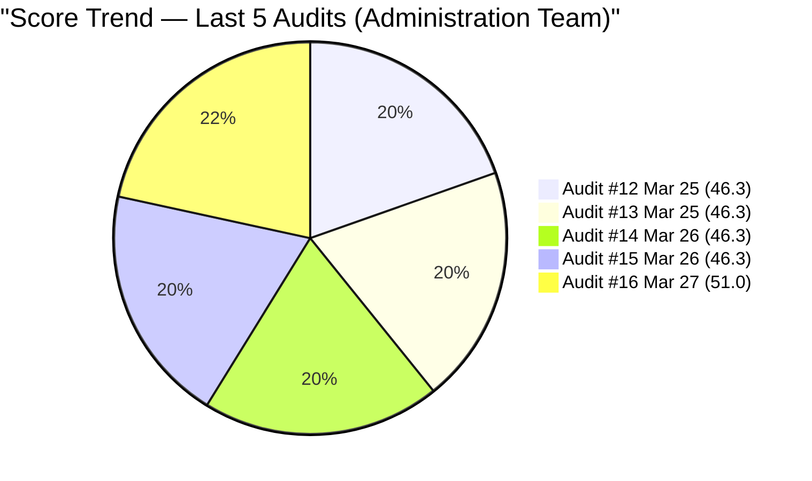
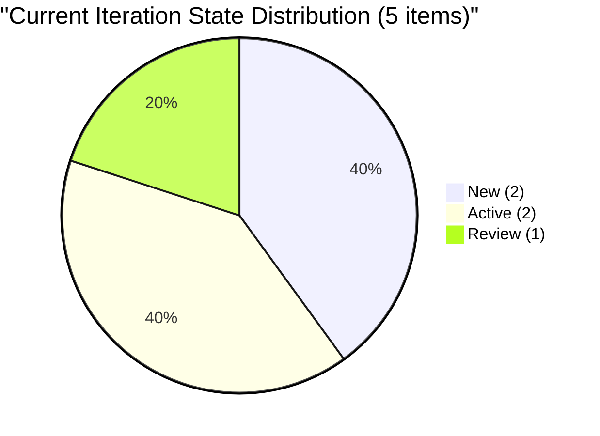
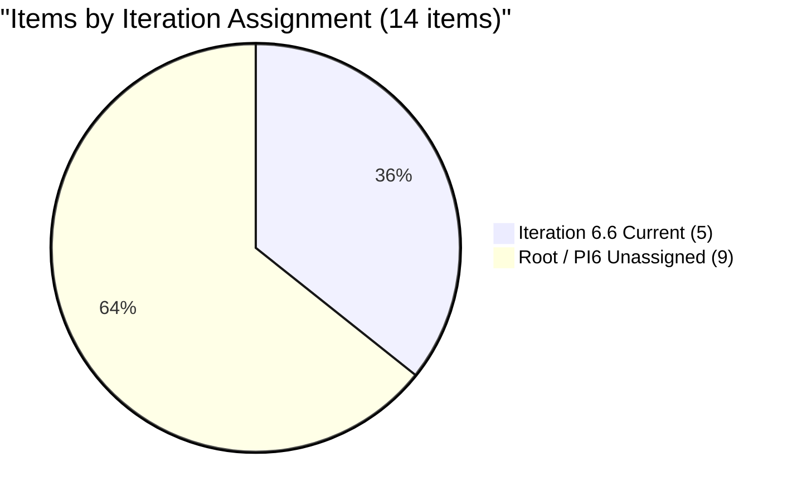
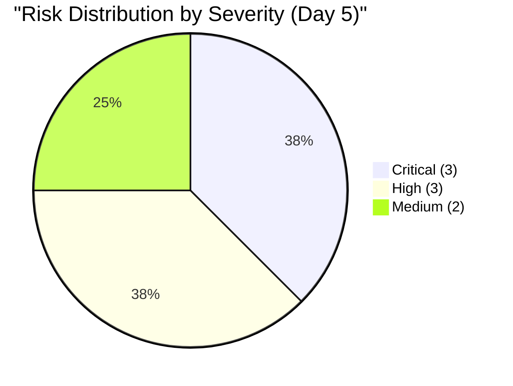

# SAFe Audit Report — Administration Team

## Jairosoft FINOPS Azure DevOps Project

---

## 1. Audit Metadata

| Field | Value |
|-------|-------|
| **Project** | Jairosoft FINOPS |
| **Project ID** | e0bb302f-40f9-46c3-8164-6f1acb317d63 |
| **Team** | Administration Team |
| **Team ID** | a38a9c02-07ab-483d-a1e3-aff54e19e603 |
| **Backlog** | Stories and Deliverables (`Microsoft.RequirementCategory`) |
| **Board URL** | [Administration Team Board](https://dev.azure.com/jairo/Jairosoft%20FINOPS/_boards/board/t/Administration%20Team/Stories%20and%20Deliverables) |
| **Workspace Folder** | `ado_admin` |
| **Current Iteration** | Iteration 6.6 (IP) |
| **Iteration Path** | `Jairosoft FINOPS\2026-PI6\Iteration 6.6 (IP)` |
| **Iteration Start** | March 23, 2026 |
| **Iteration Finish** | April 5, 2026 |
| **Audit Date** | March 27, 2026 — 09:00 UTC |
| **Audit Day** | Day 5 of 14 (36% elapsed) |
| **Previous Audit** | AUDIT_20260326_1614.md (Mar 26, 2026 16:14 UTC — Audit #15) |
| **Overall Score** | **51.0 / 100** |
| **Risk Band** | **High Risk** |
| **Audit Series** | #16 |
| **Framework** | SAFe 6.0 |
| **Rubric** | ADO SAFe v1 (six-dimension deterministic scoring) |

**Audit Boundary:** This audit covers only the Administration Team's Stories and Deliverables backlog in the Jairosoft FINOPS ADO project. No other teams, boards, projects, or repositories were analyzed.

---

## 2. Executive Summary

This is the **sixteenth audit in the series** and the **fifth audit of Iteration 6.6 (IP)**. Conducted on Day 5 (36% elapsed), this is the first audit on March 27, 2026.

**Partial sprint planning occurred today.** Three of the four 6.5 carryover items (#200306, #200301, #200613) were reassigned to Iteration 6.6, bringing current sprint commitment from 1 to 5 items and from 2 to 10 SP. This is the first positive board movement in five consecutive identical audits. However:

- Capacity remains at 0 h/day — still unconfigured Day 5
- #200995 target date was today (March 27) — item still has no Description or Acceptance Criteria
- #201856 was added to Iteration 6.6 today with no Story Points, no Description, no AC
- #200482 (JIT contract notary, 1 SP) disappeared from the backlog — likely moved off or closed; status unclear
- One new item (#201835, solar provider evaluation, 2 SP) added at PI6 root — good content but unassigned to sprint
- #200301 is now in Review state (progress signal) — first item to reach Review in this iteration

**Score improves to 51.0/100 — still High Risk, but first upward movement in 4 audits (+4.7 from 46.3).**

---

## 3. Previous Audit Delta

**Previous:** AUDIT_20260326_1614 — Iteration 6.6 (IP) Day 4, Audit #15 (Mar 26, 2026 16:14 UTC)

| Metric | Audit #15 | **Audit #16** | Delta |
|--------|-----------|---------------|-------|
| Overall Score | 46.3/100 | **51.0/100** | **+4.7** |
| Risk Band | High Risk | **High Risk** | No change |
| Items in Iteration 6.6 | 1 | **5** | **+4** |
| SP in Iteration 6.6 | 2 | **10** | **+8** |
| Capacity (h/day) | 0 | **0** | No change |
| Visible Backlog | 13 | **14** | +1 (#201856 added) |
| Carryover Items Moved (6.5→6.6) | 0/4 | **3/4** | **+3** |
| DoR Pass (Current) | 0% | **20%** | **+20%** |
| Estimation Coverage (Current) | 100% | **80%** | −20% (#201856 no SP) |
| #200995 Description | Missing | **Missing** | No change |
| #200995 AC | Missing | **Missing** | No change |

**Key changes since Audit #15:**

- #200301 (Internet payables, 3 SP) reassigned to Iter 6.6 and moved to Review state — first item in Review this iteration
- #200306 (Government payables, 4 SP) reassigned to Iter 6.6, remains Active
- #200613 (BFP certification, 1 SP) reassigned to Iter 6.6, remains Active
- #200482 (JIT contract notary, 1 SP) disappeared from backlog — status unknown (closed or moved)
- #201835 (Solar provider evaluation, 2 SP) — new item created today at PI6 root; has full Desc and AC
- #201856 — new item added directly to Iteration 6.6 with no SP, no Description, no AC
- #200995 target date (March 27) passed with no elaboration

**Resolved since Audit #15:** Three carryover items moved to current iteration.

### Score Trend (Audits #12 – #16)



---

## 4. Current Iteration Snapshot

### 4.1 Iteration 6.6 (IP) — Assigned Work Items (5 Items)

| ID | Title | Type | SP | State | Assigned To | Changed Date | DoR |
|----|-------|------|-----|-------|-------------|-------------|-----|
| 200995 | Follow up Budget request for corrugated sheet | User Story | 2 | New | Mark Colina | Mar 23 | FAIL |
| 200301 | Internet for Cebu and Davao payables | User Story | 3 | Review | Mark Colina | Mar 27 | FAIL (AC weak) |
| 200306 | Government payables | User Story | 4 | Active | Mark Colina | Mar 27 | FAIL (AC weak) |
| 200613 | BFP certification renewal follow up | User Story | 1 | Active | Mark Colina | Mar 27 | PASS |
| 201856 | (Title not yet set) | User Story | — | New | Mark Colina | Mar 27 | FAIL |

**Total:** 5 items, 10 SP. 1 DoR pass (20%).

### 4.2 Unassigned Backlog Items

| ID | Title | Path | SP | State | Last Changed |
|----|-------|------|----|-------|-------------|
| 192221 | Purchase additional Corrugated Sheet | Root | 2 | New | Feb 26 |
| 193412 | Implementation of aircon repair 2nd floor | Root | 2 | New | Mar 9 |
| 197115 | Implementation of installing jockey pump | Root | 4 | New | Feb 26 |
| 197111 | Recanvass for Jockey pump materials | Root | 1 | New | Feb 26 |
| 197023 | Installation of corrugated sheet at Fire Exit | Root | 3 | New | Mar 9 |
| 197029 | Parking with roof for 2 vehicles | Root | 3 | New | Mar 9 |
| 197028 | Purchase materials at Houseman Hardware | Root | 1 | New | Mar 9 |
| 197113 | Purchase materials for Jockey pump | Root | 1 | New | Mar 9 |
| 201835 | Evaluate Tier 1 solar provider in Davao | PI6 | 2 | New | Mar 27 |

**Subtotal:** 9 items, 19 SP — all unassigned to sprint.

### 4.3 Missing Item Note

**#200482** (JIT contract notary, 1 SP, Active) was present in the backlog in Audit #15 (under Iteration 6.5 path). It does not appear in today's backlog query. It may have been closed, removed, or reassigned outside the team's visible backlog. This is treated as a positive resolution or out-of-scope.

### 4.4 Team Capacity

| Member | Deployment | Documentation | Requirements | Total/Day |
|--------|-----------|-------------|------------|-----------|
| Mark Colina | 0h | 0h | 0h | **0 h/day** |

Capacity remains unconfigured on Day 5. ADO burndown is disabled.

---

## 5. Work Item Analysis

### 5.1 Backlog Composition (14 Items)

| Type | Count | SP | % |
|------|-------|----|---|
| User Story | 14 | 29 (10 assigned + 19 unassigned − #201856 no SP) | 100% |

Note: #201856 has no SP; estimated total assigned = 10 SP; total unassigned = 19 SP; #201856 excluded from SP total.

### 5.2 State Distribution (Current Iteration — 5 Items)



### 5.3 Iteration Assignment (14 Items)



### 5.4 DoR Assessment (Current 5 Items)

| ID | Title | Desc nws | AC nws | DoR |
|----|-------|----------|--------|-----|
| 200995 | Follow up Budget request | 0 | 0 | **FAIL** |
| 200301 | Internet payables | ~75 | ~14 | **FAIL** (AC: "Attached receipt" < 20 nws) |
| 200306 | Government payables | ~85 | ~14 | **FAIL** (AC: "Attached receipt" < 20 nws) |
| 200613 | BFP certification renewal | ~115 | ~122 | **PASS** |
| 201856 | (No title/content) | 0 | 0 | **FAIL** |

**Current iteration DoR:** 1/5 (20%). Progress from 0% but still low.

---

## 6. SAFe Compliance Scorecard

| # | Dimension | Score | Formula | Evidence | Notes |
|---|-----------|-------|---------|----------|-------|
| 1 | Iteration Planning | **35.7** | 5/14 × 100 | 5 of 14 in Iter 6.6 | 3 carryovers moved today; 9 at root/PI6 |
| 2 | Team Capacity | **0.0** | 0/1 × 100 | 0 h/day all activities | Day 5 unconfigured — still critical |
| 3 | Estimation | **80.0** | 4/5 × 100 | 4 of 5 current have SP | #201856 added without SP |
| 4 | DoR Compliance | **20.0** | 1/5 × 100 | 1 of 5 current pass DoR | #200613 passes; others fail |
| 5 | Work Item Balance | **70.0** | 100 − 30 | 100% User Story (dominant > 60%) | No Spikes; −30 penalty |
| 6 | Backlog Refinement | **100.0** | base=100; no penalties | 14/14 fresh; 0 stale; 0 untouched | All items changed ≥ Mar 23 or before but within 45 days |
| | **Overall** | **51.0** | avg(6 dims) | | **High Risk** |

### Score Computation

```
Iteration Planning:   round(5/14 × 100, 1) = 35.7
Team Capacity:        round(0/1 × 100, 1)  = 0.0
Estimation:           round(4/5 × 100, 1)  = 80.0
DoR Compliance:       round(1/5 × 100, 1)  = 20.0
Work Item Balance:    100 − 30 (dominant > 60%) = 70.0
Backlog Refinement:   base=100; stale90=0; stale180=0; untouched current=0% = 100.0

Overall: (35.7 + 0.0 + 80.0 + 20.0 + 70.0 + 100.0) / 6 = 305.7 / 6 = 50.95 → 51.0
Risk Band: High Risk (40–59.9)
```

### Full Score History (Audits #1–#16)

| # | Date | Iter | Day | Score | Band |
|---|------|------|-----|-------|------|
| 1 | Feb 25 | 6.3 | — | 42.0 | High |
| 2 | Mar 4 | 6.4 | — | 51.0 | High |
| 3 | Mar 4 | 6.4 | — | 56.0 | High |
| 4 | Mar 5 | 6.4 | — | 57.0 | High |
| 5 | Mar 6 | 6.4 | — | 58.0 | High |
| 6 | Mar 9 | 6.5 | 1 | 62.0 | Moderate |
| 7 | Mar 9 | 6.5 | 1 | 54.0 | High |
| 8 | Mar 16 | 6.5 | 8 | 55.0 | High |
| 9 | Mar 17 | 6.5 | 9 | 57.0 | High |
| 10 | Mar 18 | 6.5 | 10 | 57.0 | High |
| 11 | Mar 22 | 6.5 | 14 | 55.0 | High |
| 12 | Mar 25 | 6.6 | 3 | 46.3 | High |
| 13 | Mar 25 | 6.6 | 3 | 46.3 | High |
| 14 | Mar 26 | 6.6 | 4 | 46.3 | High |
| 15 | Mar 26 | 6.6 | 4 | 46.3 | High |
| **16** | **Mar 27** | **6.6** | **5** | **51.0** | **High** |

---

## 7. Dimension Findings

### 7.1 Iteration Planning (35.7/100) — CRITICAL

Three carryover items moved to Iteration 6.6 today — first sprint planning action in 4+ days. Sprint commitment now stands at 5 items / 10 SP (from 1/2). However, 35.7 remains the lowest Iteration Planning score in the series. The target should be 80–90%: 11–12 of 14 items assigned. Nine items (19 SP) remain unassigned. Adding the 5 highest-priority root items would bring this dimension to ~78.6. Adding all 9 would bring it to 100.0.

Additionally, #201856 was added to Iteration 6.6 without SP, Desc, or AC — this item must be elaborated before it can contribute to DoR.

### 7.2 Team Capacity (0.0/100) — CRITICAL

Mark Colina's capacity remains at 0 h/day across all three activities on Day 5. This is unchanged since iteration start. ADO burndown is non-functional. The #200301 item reaching Review state indicates real work is occurring, but it is invisible to the ADO system. This is an urgent correction required today.

### 7.3 Estimation (80.0/100) — MODERATE

4 of 5 current items have Story Points. #201856 was created without SP — this is a regression from the perfect estimation record maintained across all prior audits. Add SP to #201856 immediately. All 9 unassigned items also have SP — this is good hygiene.

### 7.4 DoR Compliance (20.0/100) — CRITICAL

Improvement from 0.0% to 20.0% — #200613 now passes due to its multi-bullet AC. However:

- #200995: still no Desc, no AC — target date passed today
- #200301 and #200306: single-phrase AC ("Attached receipt") fails the ≥20 nws threshold
- #201856: brand-new item with zero content

Three of five current items fail DoR due to the "Attached receipt" AC pattern — the persistent weakness across the entire Administration Team audit series.

### 7.5 Work Item Balance (70.0/100) — MODERATE

All 14 items are User Stories. The IP sprint purpose (innovation, retrospective, PI planning) is being served only through operational items. No Spike, no Retrospective item, no PI7 Planning item has been created in 5 days of the IP sprint.

### 7.6 Backlog Refinement (100.0/100) — GOOD

All 14 items are within the 45-day freshness window. No stale items. The 5 current items were all touched on or after March 23. Zero untouched penalty. This dimension remains the team's strongest consistent performer.

---

## 8. Risks and Bottlenecks



### CRITICAL: Capacity Remains 0 h/Day — Day 5

Five days into the iteration, ADO burndown is still non-functional. #200301 reached Review state (evidence of real work) but the system shows 0 capacity. **Action: Same day.**

### CRITICAL: #200995 Target Date Passed — No Elaboration (Day 5)

March 27 was the documented target date. The item still has zero Description and zero Acceptance Criteria. With no DoR, the item cannot be verified as done. This has been raised across five consecutive audits with no action. **Action: Immediate.**

### CRITICAL: DoR Deficiency Across 4 of 5 Current Items

Only 1 of 5 current items passes DoR. Even items in Active/Review states (#200306 Active, #200301 Review) have inadequate AC. Work may complete to an unverifiable standard. **Action: Today.**

### HIGH: #201856 Added Without Content

New item added to Iteration 6.6 with no title content beyond default, no SP, no Description, no AC. This worsens both Estimation (80.0 from 100.0) and DoR dimensions. **Action: Elaborate before next audit.**

### HIGH: 9 Items Still Unassigned (Day 5, 36% Elapsed)

19 SP in the unassigned pool with 9 working days remaining (Apr 2–5 are Holy Week). Effective sprint window is shortening. Pull 3–5 items into Iteration 6.6 today to reach a meaningful sprint commitment. **Action: Today.**

### HIGH: Holy Week Gap (April 2–5)

The sprint ends April 5. The last 4 days may be impacted by Holy Week (Philippine public holidays). Effective working time may be 7–8 days, not 10. Plan accordingly. No days-off configured in ADO.

### MEDIUM: #201835 Created at PI6 Root (Not Assigned to Sprint)

New solar provider evaluation item (2 SP, strong Desc and AC) was created but not pulled into Iteration 6.6. Either assign it or defer it explicitly.

### MEDIUM: AC Quality Pattern — "Attached Receipt"

Five of the original backlog items use single-phrase AC ("Attached receipt," "Attached photos"). This pattern fails DoR and renders completion unverifiable. Requires AC rewrite standard.

---

## 9. Prioritized Recommendations

### Priority 1: Restore Capacity Today (CRITICAL)

Set Mark Colina's capacity: Documentation 4h, Requirements 3h, Deployment 1h = 8 h/day. Enter Holy Week days-off (April 2–5 if applicable). This enables ADO burndown and demonstrates planning intent.

### Priority 2: Elaborate #200995 Today — Target Date Has Passed (CRITICAL)

Add Description (≥30 nws): describe what the budget request is for, who needs to approve it, and what the current status is. Add Acceptance Criteria (≥20 nws): "Budget request confirmation received from [approver]. Approval reference number or written decision documented in this work item."

### Priority 3: Fix AC on #200301 and #200306 (CRITICAL)

Replace "Attached receipt" with structured criteria:

- **#200301:** "Payment receipt for Cebu/Davao internet services is obtained and uploaded. Invoice number and payment date are recorded. Finance team notified of completion."
- **#200306:** "All government-imposed taxes paid. Proof of payment (OR number/BIR receipt) obtained and filed. Applicable billing period documented."

### Priority 4: Elaborate or Reassign #201856 (HIGH — Today)

Set title, add SP, Description, and AC to the new item currently in Iteration 6.6. If not ready for this sprint, move it to the backlog root.

### Priority 5: Pull 3–5 Root Items into Iteration 6.6 (HIGH — Today)

Recommended pull-in order by readiness: #192221 (Corrugated Sheet, 2 SP, has Desc+AC), #197113 (Jockey pump materials, 1 SP), #197023 (Fire Exit sheet, 3 SP). Target: 14–18 SP total commitment by end of Day 6.

### Priority 6: Create IP Sprint Items (HIGH — Day 6)

Add at minimum: PI 6 Retrospective (1 SP), PI 7 Planning Kickoff (2 SP). These are SAFe mandatory IP sprint activities — currently absent across all 16 audits.

---

## 10. Evidence Gaps and Limitations

| Gap | Impact | Notes |
|-----|--------|-------|
| #200482 not in backlog | Status unclear | Likely closed or moved off board; treated as resolved |
| #201856 no title/SP/Desc/AC | Cannot score as DoR pass | Item is effectively a placeholder; needs same-day elaboration |
| Capacity 0 vs. actual work visible | #200301 reached Review — real work is occurring | Treated as unconfigured; burndown nonfunctional |
| "Attached receipt" AC pattern | 3 items fail DoR threshold | Structural AC quality gap; requires coaching |
| No GitHub repos in scope | No delivery evidence | Defined boundary |

---

*Report generated: March 27, 2026 09:00 UTC*
*Auditor: AI EngProd Consultant (SAFe 6.0)*
*Rubric: ADO SAFe v1 (six-dimension deterministic scoring)*
*Audit #16 | Iteration 6.6 (IP) Day 5 of 14 | Score: 51.0/100 (High Risk)*
*Previous: AUDIT_20260326_1614 (46.3/100 — High Risk)*
*Delta: +4.7 — First upward movement in 4 consecutive audits*
