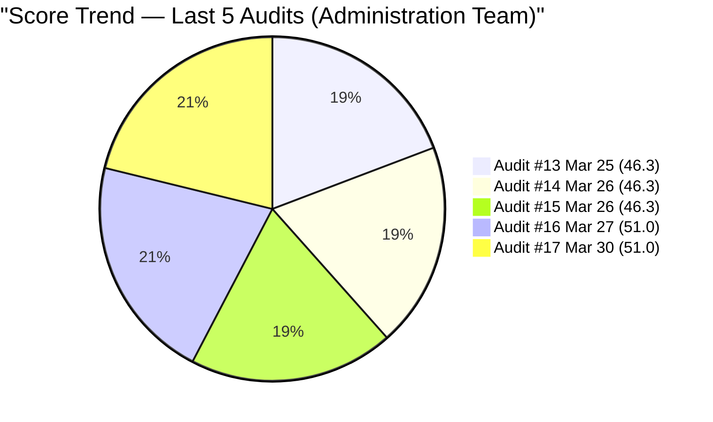
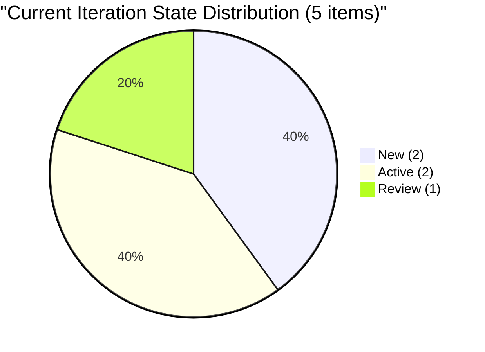
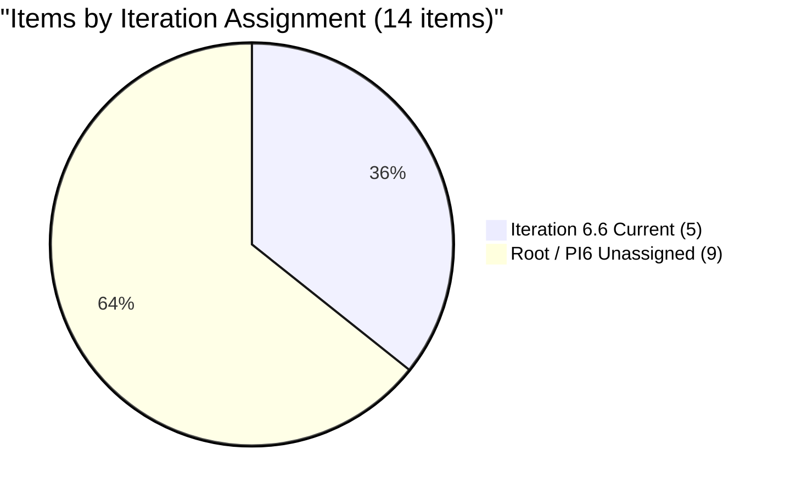
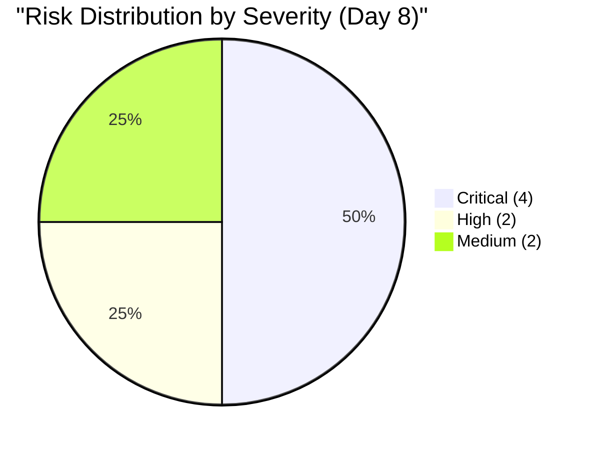

# SAFe Audit Report — Administration Team

## Jairosoft FINOPS Azure DevOps Project

---

## 1. Audit Metadata

| Field | Value |
|-------|-------|
| **Project** | Jairosoft FINOPS |
| **Project ID** | e0bb302f-40f9-46c3-8164-6f1acb317d63 |
| **Team** | Administration Team |
| **Team ID** | a38a9c02-07ab-483d-a1e3-aff54e19e603 |
| **Backlog** | Stories and Deliverables (`Microsoft.RequirementCategory`) |
| **Board URL** | [Administration Team Board](https://dev.azure.com/jairo/Jairosoft%20FINOPS/_boards/board/t/Administration%20Team/Stories%20and%20Deliverables) |
| **Workspace Folder** | `ado_admin` |
| **Current Iteration** | Iteration 6.6 (IP) |
| **Iteration Path** | `Jairosoft FINOPS\2026-PI6\Iteration 6.6 (IP)` |
| **Iteration Start** | March 23, 2026 |
| **Iteration Finish** | April 5, 2026 |
| **Audit Date** | March 30, 2026 — 09:00 UTC |
| **Audit Day** | Day 8 of 14 (57% elapsed) |
| **Previous Audit** | AUDIT_20260327_0900.md (Mar 27, 2026 09:00 UTC — Audit #16) |
| **Overall Score** | **51.0 / 100** |
| **Risk Band** | **High Risk** |
| **Audit Series** | #17 |
| **Framework** | SAFe 6.0 |
| **Rubric** | ADO SAFe v1 (six-dimension deterministic scoring) |

**Audit Boundary:** This audit covers only the Administration Team's Stories and Deliverables backlog in the Jairosoft FINOPS ADO project. No other teams, boards, projects, or repositories were analyzed.

---

## 2. Executive Summary

This is the **seventeenth audit in the series** and the **sixth audit of Iteration 6.6 (IP)**. Conducted on Day 8 (57% elapsed), the sprint is now past its midpoint with only 6 working days remaining (and Holy Week April 2-5 likely reducing effective days further).

**No board movement since Audit #16 (March 27).** All 14 backlog items, their states, iteration assignments, and content remain identical. The three-day gap between audits has produced zero observable changes:

- Capacity remains at 0 h/day — unconfigured on Day 8
- #200995 target date passed 3 days ago — still no Description or Acceptance Criteria
- #201856 ("Signage Canvass Approval") still has no SP, no Description, no AC
- #200301 remains in Review (unchanged since Mar 27) — no progression to Closed
- No new items created or moved since March 27
- 9 items (19 SP) remain unassigned to any sprint

**Score holds at 51.0/100 — High Risk. Zero movement across all dimensions for the third consecutive day.**

---

## 3. Previous Audit Delta

**Previous:** AUDIT_20260327_0900 — Iteration 6.6 (IP) Day 5, Audit #16 (Mar 27, 2026 09:00 UTC)

| Metric | Audit #16 | **Audit #17** | Delta |
|--------|-----------|---------------|-------|
| Overall Score | 51.0/100 | **51.0/100** | **0.0** |
| Risk Band | High Risk | **High Risk** | No change |
| Items in Iteration 6.6 | 5 | **5** | No change |
| SP in Iteration 6.6 | 10 | **10** | No change |
| Capacity (h/day) | 0 | **0** | No change |
| Visible Backlog | 14 | **14** | No change |
| DoR Pass (Current) | 20% | **20%** | No change |
| Estimation Coverage (Current) | 80% | **80%** | No change |
| #200301 State | Review | **Review** | No change |
| #200995 Target Date | Passed (Mar 27) | **Passed (+3 days)** | Worsening |
| Days Remaining | 9 | **6** | -3 |

**Key changes since Audit #16:** None. All work items, states, assignments, descriptions, and acceptance criteria are identical. The only change is the passage of time: 3 additional days have elapsed with no action.

### Score Trend (Audits #13 – #17)



---

## 4. Current Iteration Snapshot

### 4.1 Iteration 6.6 (IP) — Assigned Work Items (5 Items)

| ID | Title | Type | SP | State | Assigned To | Changed Date | DoR |
|----|-------|------|-----|-------|-------------|-------------|-----|
| 200995 | Follow up Budget request for corrugated sheet | User Story | 2 | New | Mark Colina | Mar 23 | FAIL |
| 200301 | Internet for Cebu and Davao payables | User Story | 3 | Review | Mark Colina | Mar 27 | FAIL (AC weak) |
| 200306 | Government payables | User Story | 4 | Active | Mark Colina | Mar 27 | FAIL (AC weak) |
| 200613 | BFP certification renewal follow up | User Story | 1 | Active | Mark Colina | Mar 27 | PASS |
| 201856 | Signage Canvass Approval | User Story | — | New | Mark Colina | Mar 27 | FAIL |

**Total:** 5 items, 10 SP (4 estimated). 1 DoR pass (20%).

### 4.2 Unassigned Backlog Items

| ID | Title | Path | SP | State | Last Changed |
|----|-------|------|----|-------|-------------|
| 192221 | Purchase additional Corrugated Sheet and installation Day 1 | Root | 2 | New | Feb 26 |
| 193412 | Implementation of aircon repair 2nd floor | Root | 2 | New | Mar 9 |
| 197115 | Implementation of installing jockey pump | Root | 4 | New | Feb 26 |
| 197111 | Recanvass for Jockey pump materials needed | Root | 1 | New | Feb 26 |
| 197023 | Installation of corrugated sheet at Fire Exit | Root | 3 | New | Mar 9 |
| 197029 | Implementation of Parking with roof for 2 vehicles (Day 1) | Root | 3 | New | Mar 9 |
| 197028 | Purchase materials at Houseman Hardware | Root | 1 | New | Mar 9 |
| 197113 | Purchase materials for Jockey pump | Root | 1 | New | Mar 9 |
| 201835 | Vendor Selection & Procurement | PI6 | 2 | New | Mar 27 |

**Subtotal:** 9 items, 19 SP — all unassigned to sprint.

### 4.3 Team Capacity

| Member | Capacity/Day | Activities | Days Off |
|--------|-------------|------------|----------|
| Mark Colina | **0 h/day** | None configured | 0 |

**Admin Team total: 0 h/day.** Capacity remains unconfigured on Day 8. ADO burndown is disabled.

---

## 5. Work Item Analysis

### 5.1 Backlog Composition (14 Items)

| Type | Count | SP | % |
|------|-------|----|---|
| User Story | 14 | 28 (10 assigned + 19 unassigned − 1 unestimated) | 100% |

### 5.2 State Distribution (Current Iteration — 5 Items)



### 5.3 Iteration Assignment (14 Items)



### 5.4 DoR Assessment (Current 5 Items)

| ID | Title | Desc nws | AC nws | DoR |
|----|-------|----------|--------|-----|
| 200995 | Follow up Budget request | 0 | 0 | **FAIL** |
| 200301 | Internet payables | ~80 | ~15 | **FAIL** (AC < 20 nws) |
| 200306 | Government payables | ~85 | ~15 | **FAIL** (AC < 20 nws) |
| 200613 | BFP certification renewal | ~115 | ~120 | **PASS** |
| 201856 | Signage Canvass Approval | 0 | 0 | **FAIL** |

**Current iteration DoR:** 1/5 (20%). Unchanged from Audit #16.

---

## 6. SAFe Compliance Scorecard

| # | Dimension | Score | Formula | Evidence | Notes |
|---|-----------|-------|---------|----------|-------|
| 1 | Iteration Planning | **35.7** | 5/14 x 100 | 5 of 14 in Iter 6.6 | 9 at root/PI6; no change since Mar 27 |
| 2 | Team Capacity | **0.0** | 0/1 x 100 | 0 h/day all activities | Day 8 unconfigured — critical |
| 3 | Estimation | **80.0** | 4/5 x 100 | 4 of 5 current have SP | #201856 still missing SP |
| 4 | DoR Compliance | **20.0** | 1/5 x 100 | 1 of 5 current pass DoR | #200613 passes; others fail |
| 5 | Work Item Balance | **70.0** | 100 - 30 | 100% User Story (dominant > 60%) | No Spikes; -30 penalty |
| 6 | Backlog Refinement | **100.0** | base=100; no penalties | 14/14 fresh; 0 stale; 0 untouched | All items within 45-day window |
| | **Overall** | **51.0** | avg(6 dims) | | **High Risk** |

### Score Computation

```
Iteration Planning:   round(5/14 x 100, 1) = 35.7
Team Capacity:        round(0/1 x 100, 1)  = 0.0
Estimation:           round(4/5 x 100, 1)  = 80.0
DoR Compliance:       round(1/5 x 100, 1)  = 20.0
Work Item Balance:    100 - 30 (dominant > 60%) = 70.0
Backlog Refinement:   base=100; stale90=0; stale180=0; untouched=0% = 100.0

Overall: (35.7 + 0.0 + 80.0 + 20.0 + 70.0 + 100.0) / 6 = 305.7 / 6 = 50.95 -> 51.0
Risk Band: High Risk (40-59.9)
```

### Full Score History (Audits #1-#17)

| # | Date | Iter | Day | Score | Band |
|---|------|------|-----|-------|------|
| 1 | Feb 25 | 6.3 | — | 42.0 | High |
| 2 | Mar 4 | 6.4 | — | 51.0 | High |
| 3 | Mar 4 | 6.4 | — | 56.0 | High |
| 4 | Mar 5 | 6.4 | — | 57.0 | High |
| 5 | Mar 6 | 6.4 | — | 58.0 | High |
| 6 | Mar 9 | 6.5 | 1 | 62.0 | Moderate |
| 7 | Mar 9 | 6.5 | 1 | 54.0 | High |
| 8 | Mar 16 | 6.5 | 8 | 55.0 | High |
| 9 | Mar 17 | 6.5 | 9 | 57.0 | High |
| 10 | Mar 18 | 6.5 | 10 | 57.0 | High |
| 11 | Mar 22 | 6.5 | 14 | 55.0 | High |
| 12 | Mar 25 | 6.6 | 3 | 46.3 | High |
| 13 | Mar 25 | 6.6 | 3 | 46.3 | High |
| 14 | Mar 26 | 6.6 | 4 | 46.3 | High |
| 15 | Mar 26 | 6.6 | 4 | 46.3 | High |
| 16 | Mar 27 | 6.6 | 5 | 51.0 | High |
| **17** | **Mar 30** | **6.6** | **8** | **51.0** | **High** |

---

## 7. Dimension Findings

### 7.1 Iteration Planning (35.7/100) — CRITICAL

Only 5 of 14 backlog items are assigned to Iteration 6.6 — unchanged since Day 5. With 57% of the sprint elapsed, 9 items (19 SP) remain in the unassigned pool. The IP sprint purpose (innovation, retrospective, PI planning) is not reflected in the sprint commitment. At this point in the sprint, pulling additional items carries diminishing returns, but at minimum the highest-priority ready items should be formally assigned or deferred to PI 7.

### 7.2 Team Capacity (0.0/100) — CRITICAL

Mark Colina's capacity has been 0 h/day for the entire Iteration 6.6 — now 8 days running. This has been flagged in every audit since Iteration 6.6 started. ADO burndown is completely non-functional. The Review state on #200301 proves work is happening, but it is invisible to ADO planning tools. This is the longest capacity gap in the audit series history.

### 7.3 Estimation (80.0/100) — MODERATE

4 of 5 current items have Story Points. #201856 ("Signage Canvass Approval") was created on Mar 27 without SP and remains unestimated 3 days later. All 9 unassigned items have SP — good backlog hygiene.

### 7.4 DoR Compliance (20.0/100) — CRITICAL

Only #200613 passes DoR. The other 4 current items fail:
- **#200995**: Zero Description, zero AC — target date passed March 27 (now 3 days overdue)
- **#200301 and #200306**: Description is adequate but AC is "Attached receipt" (~15 non-whitespace characters, below the 20 threshold)
- **#201856**: Zero Description, zero AC

The "Attached receipt" AC pattern has been a persistent finding across 17 consecutive audits.

### 7.5 Work Item Balance (70.0/100) — MODERATE

All 14 backlog items are User Stories. For an IP sprint, SAFe expects innovation work, retrospective items, and PI planning activities. None exist. The -30 penalty for dominant type share > 60% applies. This has been consistent across the entire Iteration 6.6 audit series.

### 7.6 Backlog Refinement (100.0/100) — GOOD

All 14 items were last changed within the 45-day window. No stale items at 90 or 180 days. No untouched current items. This dimension remains the team's strongest performer.

---

## 8. Risks and Bottlenecks



### CRITICAL: Three-Day Stall — No Board Activity Since March 27

Zero changes across all 14 work items between Day 5 and Day 8. No state transitions, no new items, no content updates. With 57% of the sprint elapsed, the team is at risk of another iteration with minimal delivery.

### CRITICAL: Capacity Still 0 h/Day on Day 8

Eight days into the iteration with no capacity configured. This is the longest continuous capacity gap in the audit series. ADO burndown, velocity tracking, and sprint planning are all non-functional.

### CRITICAL: #200995 Target Date 3 Days Overdue

The target date of March 27 has passed. The item still has zero Description and zero AC in "New" state. This item has been flagged in 6 consecutive audits with no remediation.

### CRITICAL: Holy Week Impact — Effective Sprint Ending

April 2-5 includes Holy Week (Philippine public holidays). The effective remaining work window may be as few as 2-3 days (Mar 30-Apr 1). No days-off are configured in ADO. Sprint commitment of 10 SP with 2 items in New state is at high risk of non-delivery.

### HIGH: #201856 Still a Placeholder After 3 Days

Created March 27, "Signage Canvass Approval" has a title but no SP, no Description, no AC. It occupies a current iteration slot without contributing to planning quality.

### HIGH: #200301 Stuck in Review

#200301 ("Internet for Cebu and Davao payables") has been in Review since March 27 with no progression to Closed. If review is complete, it should be closed to reflect actual delivery.

### MEDIUM: 9 Items Unassigned (64% of Backlog)

19 SP sitting in the unassigned pool. While pulling items this late in the sprint is not ideal, formal disposition (defer to PI 7 or assign) is needed for backlog hygiene.

### MEDIUM: AC Quality — "Attached Receipt" Pattern Persists

Three current items and multiple backlog items use single-phrase AC ("Attached receipt," "Attached photos"). This structural pattern has been flagged since Audit #1 with no remediation.

---

## 9. Prioritized Recommendations

### Priority 1: Configure Capacity Immediately (CRITICAL — Same Day)

Set Mark Colina's capacity to 8 h/day with appropriate activity split (e.g., Documentation 4h, Requirements 3h, Deployment 1h). Add Holy Week days-off (April 2-5). This is overdue by 8 days.

### Priority 2: Close #200301 If Review Is Complete (CRITICAL — Same Day)

If the internet payables review is done, move to Closed. This demonstrates delivery and prevents the item from appearing stalled. If review is blocked, document the blocker.

### Priority 3: Resolve #200995 — Target Date 3 Days Overdue (CRITICAL — Same Day)

Either: (a) Add Description and AC to meet DoR and move to Active, or (b) Remove from current iteration if the budget request is no longer relevant. Do not leave a past-due item in "New" state.

### Priority 4: Elaborate #201856 or Remove from Sprint (HIGH — Today)

Add Story Points, Description (>= 30 nws), and AC (>= 20 nws) to "Signage Canvass Approval." If not ready, move to backlog root.

### Priority 5: Formally Disposition Unassigned Items (HIGH — Before Sprint End)

For each of the 9 unassigned items, decide: pull into 6.6 (if completable by Apr 1), or explicitly defer to PI 7 backlog. Do not leave 64% of the backlog in limbo at sprint end.

### Priority 6: Fix AC on #200301 and #200306 (MEDIUM — Before Sprint End)

Replace "Attached receipt" with structured acceptance criteria that define verifiable completion conditions. Example for #200301: "Payment receipt for Cebu/Davao internet services obtained and uploaded. Invoice number and payment date recorded."

---

## 10. Evidence Gaps and Limitations

| Gap | Impact | Notes |
|-----|--------|-------|
| Capacity 0 vs. actual work | #200301 in Review — work is occurring | Burndown non-functional; velocity untracked |
| #200995 no elaboration despite target date | Cannot verify completion criteria | 6 audits flagged, no remediation |
| #201856 placeholder item | Inflates current count without planning value | Title exists but no other content |
| "Attached receipt" AC pattern | 3 current items fail DoR | Structural gap; requires coaching |
| No Holy Week days-off in ADO | Sprint capacity/burndown miscalculated | Philippine holidays April 2-5 |
| No GitHub repos in scope | No delivery evidence beyond board | Defined boundary |

---

*Report generated: March 30, 2026 09:00 UTC*
*Auditor: AI EngProd Consultant (SAFe 6.0)*
*Rubric: ADO SAFe v1 (six-dimension deterministic scoring)*
*Audit #17 | Iteration 6.6 (IP) Day 8 of 14 | Score: 51.0/100 (High Risk)*
*Previous: AUDIT_20260327_0900 (51.0/100 — High Risk)*
*Delta: 0.0 — No change; board stalled for 3 consecutive days*
