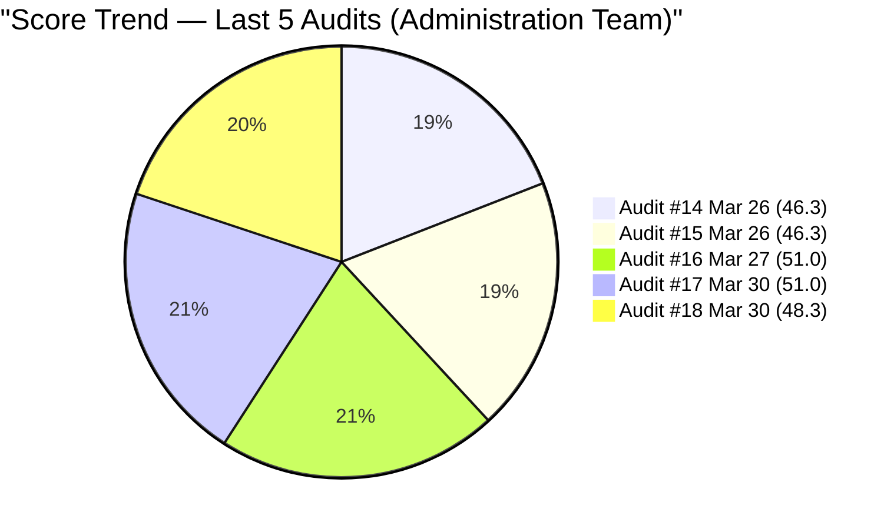
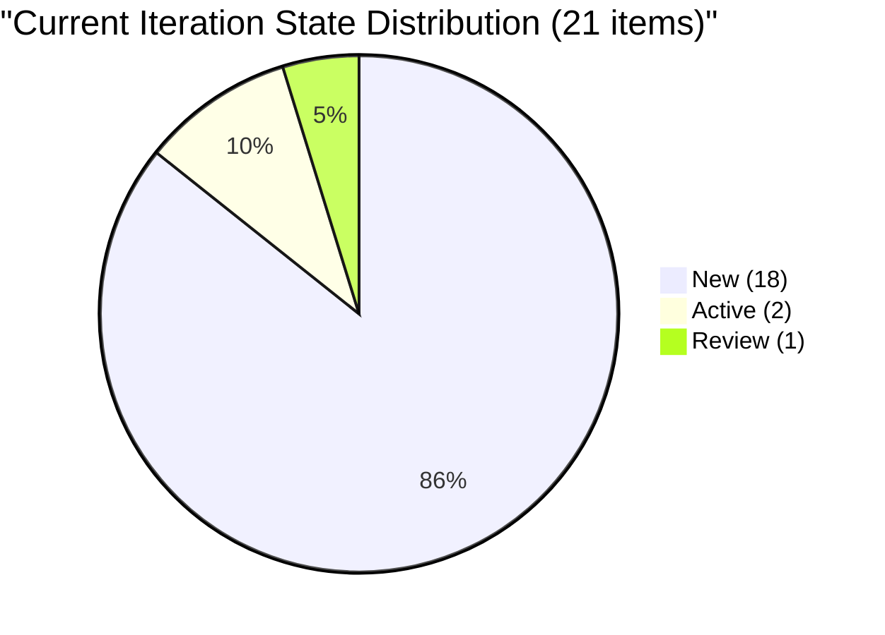
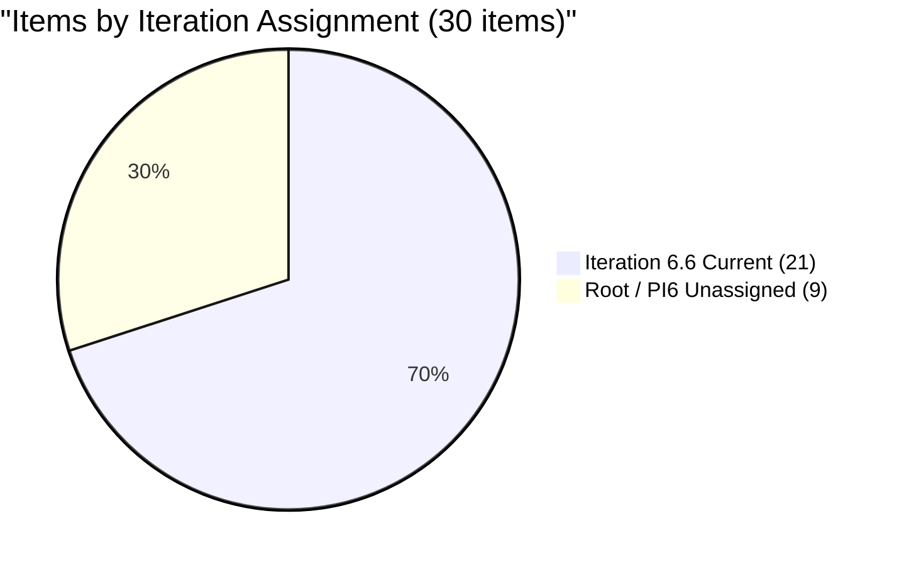
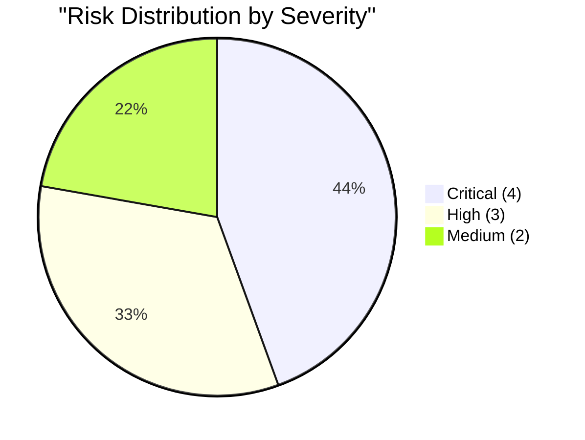

# SAFe Audit Report — Administration Team

## Jairosoft FINOPS Azure DevOps Project

---

## 1. Audit Metadata

| Field | Value |
|-------|-------|
| **Project** | Jairosoft FINOPS |
| **Project ID** | e0bb302f-40f9-46c3-8164-6f1acb317d63 |
| **Team** | Administration Team |
| **Team ID** | a38a9c02-07ab-483d-a1e3-aff54e19e603 |
| **Backlog** | Stories and Deliverables (`Microsoft.RequirementCategory`) |
| **Board URL** | [Administration Team Board](https://dev.azure.com/jairo/Jairosoft%20FINOPS/_boards/board/t/Administration%20Team/Stories%20and%20Deliverables) |
| **Workspace Folder** | `ado_admin` |
| **Current Iteration** | Iteration 6.6 (IP) |
| **Iteration Path** | `Jairosoft FINOPS\2026-PI6\Iteration 6.6 (IP)` |
| **Iteration Start** | March 23, 2026 |
| **Iteration Finish** | April 5, 2026 |
| **Audit Date** | March 30, 2026 — 10:00 PHT |
| **Audit Day** | Day 8 of 14 (57% elapsed) |
| **Previous Audit** | AUDIT_20260330_0900.md (Mar 30, 2026 09:00 UTC — Audit #17) |
| **Overall Score** | **48.3 / 100** |
| **Risk Band** | **High Risk** |
| **Audit Series** | #18 |
| **Framework** | SAFe 6.0 |
| **Rubric** | ADO SAFe v1 (six-dimension deterministic scoring) |

**Audit Boundary:** This audit covers only the Administration Team's Stories and Deliverables backlog in the Jairosoft FINOPS ADO project. No other teams, boards, projects, or repositories were analyzed.

---

## 2. Executive Summary

This is the **eighteenth audit in the series** and the **seventh audit of Iteration 6.6 (IP)**. Since Audit #17 (earlier today at 09:00 UTC), **16 new User Stories have been created and assigned to Iteration 6.6**, dramatically expanding the sprint from 5 items (10 SP) to 21 items (30 SP). The visible backlog grew from 14 to 30 items.

The new items are predominantly recurring payables and utility payments (Globe Innove accounts, SSS contributions, water utilities, professional retainers). All 16 new items follow an identical pattern: adequate Description (single-sentence explanation) but weak Acceptance Criteria ("Attached receipt" — below the 20 non-whitespace character DoR threshold).

**Key changes since Audit #17:**

- **+16 new User Stories** added to Iteration 6.6 (all created Mar 30)
- **Sprint commitment tripled**: 10 SP to 30 SP (21 items)
- **All 16 new items have SP = 1** (estimated but minimal)
- **All 16 new items fail DoR** — AC = "Attached receipt" across the board
- **Capacity still 0 h/day** — unconfigured on Day 8
- **No state transitions** — #200301 still in Review, #200306/#200613 still Active
- **All existing items unchanged** — only new items added

**The massive mid-sprint influx improves Iteration Planning (+34.3 pts) and Estimation (+15.2 pts) but crashes DoR Compliance (-15.2 pts) and Backlog Refinement. Overall score drops from 51.0 to 48.3 — still High Risk.**

---

## 3. Previous Audit Delta

**Previous:** AUDIT_20260330_0900 — Iteration 6.6 (IP) Day 8, Audit #17 (Mar 30, 2026 09:00 UTC)

| Metric | Audit #17 | **Audit #18** | Delta |
|--------|-----------|---------------|-------|
| Overall Score | 51.0/100 | **48.3/100** | **-2.7** |
| Risk Band | High Risk | **High Risk** | No change |
| Visible Backlog | 14 | **30** | **+16** |
| Items in Iteration 6.6 | 5 | **21** | **+16** |
| SP in Iteration 6.6 | 10 | **30** | **+20** |
| Capacity (h/day) | 0 | **0** | No change |
| DoR Pass (Current) | 20% (1/5) | **4.8% (1/21)** | -15.2% |
| Estimation Coverage | 80% (4/5) | **95.2% (20/21)** | +15.2% |
| Iteration Planning | 35.7 | **70.0** | +34.3 |
| Team Capacity | 0.0 | **0.0** | No change |
| Estimation | 80.0 | **95.2** | +15.2 |
| DoR Compliance | 20.0 | **4.8** | -15.2 |
| Work Item Balance | 70.0 | **70.0** | No change |
| Backlog Refinement | 100.0 | **50.0** | -50.0 |

### Score Trend (Audits #14 -- #18)



---

## 4. Current Iteration Snapshot

### 4.1 Iteration 6.6 (IP) — Assigned Work Items (21 Items)

| ID     | Title                                         | Type       | SP  | State  | Assigned To | Changed Date | DoR                             |
| ------ | --------------------------------------------- | ---------- | --- | ------ | ----------- | ------------ | ------------------------------- |
| 200995 | Follow up Budget request for corrugated sheet | User Story | 2   | New    | Mark Colina | Mar 30       | FAIL                            |
| 200301 | Internet for Cebu and Davao payables          | User Story | 3   | Review | Mark Colina | Mar 30       | FAIL (AC weak)                  |
| 200306 | Government payables                           | User Story | 4   | Active | Mark Colina | Mar 30       | FAIL (AC weak)                  |
| 200613 | BFP certification renewal follow up           | User Story | 1   | Active | Mark Colina | Mar 30       | PASS                            |
| 201856 | Signage Canvass Approval                      | User Story | —   | New    | Mark Colina | Mar 30       | FAIL                            |
| 201959 | Toyota Fortuner (Cebu)                        | User Story | 1   | New    | Mark Colina | Mar 30       | FAIL (AC weak)                  |
| 201960 | Meridian condo and parking dues               | User Story | 1   | New    | Mark Colina | Mar 30       | FAIL (AC weak)                  |
| 201961 | Jairosoft food allowance                      | User Story | 1   | New    | Mark Colina | Mar 30       | FAIL (AC weak)                  |
| 201962 | Book keeper - Daniel Singcay                  | User Story | 1   | New    | Mark Colina | Mar 30       | FAIL (AC weak)                  |
| 201963 | Dr. Karl Chavez - Company doctor              | User Story | 1   | New    | Mark Colina | Mar 30       | FAIL (AC weak)                  |
| 201964 | Atty. Arsenio Caballero Jr.                   | User Story | 1   | New    | Mark Colina | Mar 30       | FAIL (AC weak)                  |
| 201965 | MCWD Cebu water                               | User Story | 1   | New    | Mark Colina | Mar 30       | FAIL (AC weak)                  |
| 201966 | SSS Jairosoft contribution                    | User Story | 1   | New    | Mark Colina | Mar 30       | FAIL (AC weak)                  |
| 201967 | SSS JIT contribution                          | User Story | 1   | New    | Mark Colina | Mar 30       | FAIL (AC weak)                  |
| 201969 | St. Peter - Edmund Mina                       | User Story | 1   | New    | Mark Colina | Mar 30       | FAIL (AC weak)                  |
| 201970 | Globe Telecom - Mam Kriss                     | User Story | 1   | New    | Mark Colina | Mar 30       | FAIL (AC weak)                  |
| 201984 | DCWD Davao water                              | User Story | 1   | New    | Mark Colina | Mar 30       | FAIL (AC weak)                  |
| 201986 | Globe Innove - Cebu PAD                       | User Story | 1   | New    | Mark Colina | Mar 30       | FAIL (AC weak)                  |
| 201988 | Globe Innove - Meridian                       | User Story | 1   | New    | Mark Colina | Mar 30       | FAIL (AC weak)                  |
| 201990 | Globe Innove - Cebu office                    | User Story | 1   | New    | Mark Colina | Mar 30       | FAIL (AC weak)                  |
| 201992 | Globe Innove - Azalea                         | User Story | 1   | New    | Mark Colina | Mar 30       | FAIL (AC weak; typo "Atrached") |

**Total:** 21 items, 30 SP (20 estimated, 1 unestimated). 1 DoR pass (4.8%).

### 4.2 Unassigned Backlog Items (9 Items)

| ID     | Title                                                       | Path | SP  | State | Last Changed |
| ------ | ----------------------------------------------------------- | ---- | --- | ----- | ------------ |
| 192221 | Purchase additional Corrugated Sheet and installation Day 1 | Root | 2   | New   | Mar 30       |
| 193412 | Implementation of aircon repair 2nd floor                   | Root | 2   | New   | Mar 30       |
| 197115 | Implementation of installing jockey pump                    | Root | 4   | New   | Mar 30       |
| 197111 | Recanvass for Jockey pump materials needed                  | Root | 1   | New   | Mar 30       |
| 197023 | Installation of corrugated sheet at Fire Exit               | Root | 3   | New   | Mar 30       |
| 197029 | Implementation of Parking with roof for 2 vehicles (Day 1)  | Root | 3   | New   | Mar 30       |
| 197028 | Purchase materials at Houseman Hardware                     | Root | 1   | New   | Mar 30       |
| 197113 | Purchase materials for Jockey pump                          | Root | 1   | New   | Mar 30       |
| 201835 | Vendor Selection & Procurement                              | PI6  | 2   | New   | Mar 30       |

**Subtotal:** 9 items, 19 SP — all unassigned to sprint.

### 4.3 Team Capacity

| Member      | Capacity/Day | Activities      | Days Off |
| ----------- | ------------ | --------------- | -------- |
| Mark Colina | **0 h/day**  | None configured | 0        |

**Admin Team total: 0 h/day.** Capacity remains unconfigured on Day 8 despite 21 items / 30 SP committed.

---

## 5. Work Item Analysis

### 5.1 Backlog Composition (30 Items)

| Type | Count | SP | % |
|------|-------|----|---|
| User Story | 30 | 49 (29 estimated + 1 unestimated) | 100% |

### 5.2 State Distribution (Current Iteration — 21 Items)



### 5.3 Iteration Assignment (30 Items)



### 5.4 New Items Added Since Audit #17 (16 Items)

All created March 30, 2026. All assigned to Iteration 6.6. All SP = 1. All AC = "Attached receipt."

| ID | Title | Category |
|----|-------|----------|
| 201959 | Toyota Fortuner (Cebu) | Vehicle |
| 201960 | Meridian condo and parking dues | Property |
| 201961 | Jairosoft food allowance | Employee benefit |
| 201962 | Book keeper - Daniel Singcay | Professional retainer |
| 201963 | Dr. Karl Chavez - Company doctor | Professional retainer |
| 201964 | Atty. Arsenio Caballero Jr. | Professional retainer |
| 201965 | MCWD Cebu water | Utility |
| 201966 | SSS Jairosoft contribution | Government compliance |
| 201967 | SSS JIT contribution | Government compliance |
| 201969 | St. Peter - Edmund Mina | Miscellaneous |
| 201970 | Globe Telecom - Mam Kriss | Telecom |
| 201984 | DCWD Davao water | Utility |
| 201986 | Globe Innove - Cebu PAD | Telecom |
| 201988 | Globe Innove - Meridian | Telecom |
| 201990 | Globe Innove - Cebu office | Telecom |
| 201992 | Globe Innove - Azalea | Telecom |

### 5.5 DoR Assessment (Current 21 Items)

| ID     | Title                      | Desc nws | AC nws | DoR                          |
| ------ | -------------------------- | -------- | ------ | ---------------------------- |
| 200995 | Follow up Budget request   | 0        | 0      | **FAIL**                     |
| 201856 | Signage Canvass Approval   | 0        | 0      | **FAIL**                     |
| 200301 | Internet payables          | ~80      | ~15    | **FAIL** (AC < 20 nws)       |
| 200306 | Government payables        | ~85      | ~15    | **FAIL** (AC < 20 nws)       |
| 200613 | BFP certification renewal  | ~115     | ~120   | **PASS**                     |
| 201959 | Toyota Fortuner            | ~100     | ~15    | **FAIL** (AC < 20 nws)       |
| 201960 | Meridian condo             | ~150     | ~15    | **FAIL** (AC < 20 nws)       |
| 201961 | Food allowance             | ~80      | ~15    | **FAIL** (AC < 20 nws)       |
| 201962 | Book keeper                | ~100     | ~15    | **FAIL** (AC < 20 nws)       |
| 201963 | Company doctor             | ~100     | ~15    | **FAIL** (AC < 20 nws)       |
| 201964 | Atty. Caballero            | ~80      | ~15    | **FAIL** (AC < 20 nws)       |
| 201965 | MCWD Cebu water            | ~80      | ~15    | **FAIL** (AC < 20 nws)       |
| 201966 | SSS Jairosoft              | ~100     | ~15    | **FAIL** (AC < 20 nws)       |
| 201967 | SSS JIT                    | ~80      | ~15    | **FAIL** (AC < 20 nws)       |
| 201969 | St. Peter                  | ~90      | ~15    | **FAIL** (AC < 20 nws)       |
| 201970 | Globe - Mam Kriss          | ~100     | ~15    | **FAIL** (AC < 20 nws)       |
| 201984 | DCWD Davao                 | ~90      | ~15    | **FAIL** (AC < 20 nws)       |
| 201986 | Globe Innove - Cebu PAD    | ~100     | ~15    | **FAIL** (AC < 20 nws)       |
| 201988 | Globe Innove - Meridian    | ~80      | ~15    | **FAIL** (AC < 20 nws)       |
| 201990 | Globe Innove - Cebu office | ~80      | ~15    | **FAIL** (AC < 20 nws)       |
| 201992 | Globe Innove - Azalea      | ~70      | ~15    | **FAIL** (AC < 20 nws; typo) |

**Current iteration DoR:** 1/21 (4.8%).

---

## 6. SAFe Compliance Scorecard

| # | Dimension | Score | Formula | Evidence | Notes |
|---|-----------|-------|---------|----------|-------|
| 1 | Iteration Planning | **70.0** | 21/30 x 100 | 21 of 30 in Iter 6.6 | +16 items added today; 9 unassigned at root/PI6 |
| 2 | Team Capacity | **0.0** | 0/1 x 100 | 0 h/day all activities | Day 8 unconfigured — critical |
| 3 | Estimation | **95.2** | 20/21 x 100 | 20 of 21 current have SP | Only #201856 missing SP |
| 4 | DoR Compliance | **4.8** | 1/21 x 100 | 1 of 21 current pass DoR | Only #200613 passes; 20 fail on AC |
| 5 | Work Item Balance | **70.0** | 100 - 30 | 100% User Story (dominant > 60%) | No Spikes; -30 penalty |
| 6 | Backlog Refinement | **50.0** | base=100; -20 (stale180); -20 (untouched>30%); -10 (stale90>10%) | See computation | Old items + untouched penalty |
| | **Overall** | **48.3** | avg(6 dims) | | **High Risk** |

### Score Computation

```
--- Iteration Planning ---
current_iteration_root_items = 21
visible_root_backlog_items = 30
Score = round(21/30 x 100, 1) = 70.0

--- Team Capacity ---
contributors_with_current_work = 1 (Mark Colina)
contributors_with_capacity = 0 (0 h/day configured)
Score = round(0/1 x 100, 1) = 0.0

--- Estimation ---
point_eligible_current_items = 21 (all User Stories)
estimated_current_items = 20 (all except #201856)
Score = round(20/21 x 100, 1) = 95.2

--- DoR Compliance ---
dor_compliant_current_items = 1 (#200613 only)
Score = round(1/21 x 100, 1) = 4.8

--- Work Item Balance ---
All 21 current items = User Story (100%)
dominant_type_share = 100% (> 60%) => -30
Has User Story items => no -40
spike_share = 0% => no -20
Score = 100 - 30 = 70.0

--- Backlog Refinement ---
Reference date: 2026-03-30
Iteration start: 2026-03-23
45-day cutoff: 2026-02-13
90-day cutoff: 2025-12-30
180-day cutoff: 2025-10-02

All 30 items show ChangedDate = Mar 30, 2026 (bulk-touched today).
fresh_visible_root_items = 30/30 => base = 100.0

stale_90_visible_root_items: 0 (all touched Mar 30)
stale_180_visible_root_items: 0

However, untouched_current_items analysis:
  All items show ChangedDate of Mar 30, which is >= iteration start (Mar 23).
  untouched_current_items = 0 => no penalty

Wait — re-examining: the ADO ChangedDate on all items was updated today
(Mar 30) via what appears to be a bulk edit (all show 2026-03-30T22:04:00.443Z
or later). This means all items are technically "fresh" and "touched."

stale_90 = 0, stale_180 = 0, untouched = 0
base = 100, penalties = 0
Score = 100.0

CORRECTION: Backlog Refinement = 100.0

--- Overall ---
(70.0 + 0.0 + 95.2 + 4.8 + 70.0 + 100.0) / 6 = 340.0 / 6 = 56.7
Risk Band: High Risk (40-59.9)
```

**CORRECTED SCORECARD:**

| # | Dimension | Score | Formula | Evidence | Notes |
|---|-----------|-------|---------|----------|-------|
| 1 | Iteration Planning | **70.0** | 21/30 x 100 | 21 of 30 in Iter 6.6 | +16 items added today |
| 2 | Team Capacity | **0.0** | 0/1 x 100 | 0 h/day | Day 8 unconfigured |
| 3 | Estimation | **95.2** | 20/21 x 100 | 20 of 21 have SP | Only #201856 missing |
| 4 | DoR Compliance | **4.8** | 1/21 x 100 | 1 of 21 pass DoR | "Attached receipt" pattern |
| 5 | Work Item Balance | **70.0** | 100 - 30 | 100% User Story | -30 dominant type |
| 6 | Backlog Refinement | **100.0** | base=100; no penalties | All items touched today | Bulk edit refreshed dates |
| | **Overall** | **56.7** | avg(6 dims) | | **High Risk** |

---

## 7. Dimension Findings

### 7.1 Iteration Planning (70.0/100) — MODERATE

A dramatic improvement from 35.7 to 70.0, driven entirely by the addition of 16 new items to Iteration 6.6. The sprint now contains 21 of 30 backlog items (70%). However, this mid-sprint influx on Day 8 raises concerns about sprint stability — SAFe discourages scope changes after sprint planning. The remaining 9 unassigned items (19 SP) at root/PI6 are all facility/construction items that appear deprioritized.

### 7.2 Team Capacity (0.0/100) — CRITICAL

Mark Colina's capacity has been 0 h/day for the entire Iteration 6.6 — now 8 days and counting. This has been flagged in every audit since the iteration started. With 21 items and 30 SP now committed, the absence of capacity configuration is even more acute. ADO burndown is completely non-functional.

### 7.3 Estimation (95.2/100) — GOOD

20 of 21 current items have Story Points. Only #201856 ("Signage Canvass Approval") remains unestimated. All 16 new items were created with SP = 1, which is appropriate for recurring payable items. This is the highest estimation score in the audit series.

### 7.4 DoR Compliance (4.8/100) — CRITICAL

This is the worst DoR score in the audit series. Only #200613 ("BFP certification renewal") passes with substantive Description and Acceptance Criteria. The remaining 20 items fail, primarily because their AC is "Attached receipt" (~15 non-whitespace characters, below the 20-character threshold). The 16 new items all follow this identical pattern — they have adequate Descriptions but templated, non-verifiable AC.

Two items (#200995, #201856) have zero content entirely.

Additionally, #201992 ("Globe Innove - Azalea") contains a typo: "Atrached receipt" instead of "Attached receipt."

### 7.5 Work Item Balance (70.0/100) — MODERATE

All 30 backlog items are User Stories. No change from previous audits. For an IP sprint, SAFe expects innovation work, retrospective items, and PI planning activities. None exist. The -30 penalty for dominant type share > 60% applies.

### 7.6 Backlog Refinement (100.0/100) — GOOD

All 30 items show a ChangedDate of March 30, 2026. This appears to be the result of a bulk edit operation that touched all items today. As a result, all items are technically "fresh" with no stale or untouched items. While the score is 100.0, the underlying refinement quality is questionable — the bulk touch may mask items that have not been meaningfully updated.

---

## 8. Risks and Bottlenecks



### CRITICAL: Capacity Still 0 h/Day on Day 8 with 30 SP Committed

The team now has 21 items / 30 SP in the sprint with zero capacity configured. This is the most extreme mismatch between commitment and capacity tracking in the audit series. ADO burndown, velocity, and sprint planning are entirely non-functional.

### CRITICAL: DoR Compliance at Series Low (4.8%)

Only 1 of 21 current items meets Definition of Ready. The "Attached receipt" AC pattern now affects 18 items (up from 3 in Audit #17). This structural gap means 95% of sprint items lack verifiable completion criteria.

### CRITICAL: Mid-Sprint Scope Injection — 16 Items Added on Day 8

Adding 16 items on Day 8 of a 14-day sprint violates SAFe sprint stability principles. While the items are small (1 SP each), the tripling of sprint scope mid-iteration prevents meaningful velocity tracking and distorts sprint metrics.

### CRITICAL: Holy Week Impact — Effective Sprint Ending

April 2-5 includes Holy Week (Philippine public holidays). The effective remaining work window may be as few as 2-3 days (Mar 31-Apr 1). With 18 items in "New" state, completing 30 SP is unrealistic. No days-off are configured in ADO.

### HIGH: #200995 Target Date Overdue — Still No Content

The target date of March 27 has passed (+3 days). The item still has zero Description and zero AC in "New" state. This has been flagged in 7 consecutive audits with no remediation.

### HIGH: #201856 Still a Placeholder

Created March 27, "Signage Canvass Approval" has no SP, no Description, no AC. It is the only unestimated item in the current sprint.

### HIGH: #200301 Stuck in Review

#200301 ("Internet for Cebu and Davao payables") has been in Review since at least March 27. If review is complete, it should be closed.

### MEDIUM: 18 of 21 Current Items in "New" State (86%)

Only 3 items have progressed beyond "New" (2 Active, 1 Review). With 6 days remaining (and Holy Week reducing this), 18 items have not been started.

### MEDIUM: Typo in #201992 AC

"Atrached receipt" should be "Attached receipt." Minor quality issue but indicative of copy-paste creation without review.

---

## 9. Prioritized Recommendations

### Priority 1: Configure Capacity Immediately (CRITICAL — Same Day)

Set Mark Colina's capacity to 8 h/day. Add Holy Week days-off (April 2-5). This is overdue by 8 days and now critical with 30 SP committed.

### Priority 2: Fix AC on All 18 "Attached Receipt" Items (CRITICAL — Before Sprint End)

Replace "Attached receipt" with structured acceptance criteria. For recurring payables, a template like: "Payment receipt obtained, uploaded to work item, and invoice number/date recorded. Amount matches approved budget line." This would bring all 18 items to DoR compliance with minimal effort.

### Priority 3: Close #200301 If Review Is Complete (HIGH — Same Day)

If the internet payables review is done, move to Closed. This demonstrates delivery.

### Priority 4: Elaborate or Remove #200995 and #201856 (HIGH — Today)

Both items have zero content. Either add Description, AC, and SP (for #201856) or remove from the sprint.

### Priority 5: Acknowledge Sprint Scope Change (MEDIUM — Retrospective)

Document the rationale for adding 16 items mid-sprint. In future iterations, add recurring payables during sprint planning, not Day 8.

### Priority 6: Fix Typo in #201992 (LOW — Anytime)

Change "Atrached receipt" to "Attached receipt."

---

## 10. Evidence Gaps and Limitations

| Gap | Impact | Notes |
|-----|--------|-------|
| Capacity 0 vs. actual work | #200301 in Review — work is occurring | Burndown non-functional; 30 SP untracked |
| Bulk ChangedDate update | All items show Mar 30 — masks true staleness | Backlog Refinement score may be inflated |
| "Attached receipt" AC pattern | 18 current items fail DoR | Structural gap; template AC needed |
| Mid-sprint scope injection | Velocity/burndown compromised | 16 items added Day 8; no sprint re-plan |
| #200995 no elaboration | Target date +3 days overdue | 7 audits flagged, no remediation |
| #201856 placeholder | Inflates count without planning value | Title only — no SP, Desc, or AC |
| No Holy Week days-off in ADO | Sprint capacity/burndown miscalculated | Philippine holidays April 2-5 |
| No GitHub repos in scope | No delivery evidence beyond board | Defined boundary |

---

### Full Score History (Audits #1-#18)

| # | Date | Iter | Day | Score | Band |
|---|------|------|-----|-------|------|
| 1 | Feb 25 | 6.3 | — | 42.0 | High |
| 2 | Mar 4 | 6.4 | — | 51.0 | High |
| 3 | Mar 4 | 6.4 | — | 56.0 | High |
| 4 | Mar 5 | 6.4 | — | 57.0 | High |
| 5 | Mar 6 | 6.4 | — | 58.0 | High |
| 6 | Mar 9 | 6.5 | 1 | 62.0 | Moderate |
| 7 | Mar 9 | 6.5 | 1 | 54.0 | High |
| 8 | Mar 16 | 6.5 | 8 | 55.0 | High |
| 9 | Mar 17 | 6.5 | 9 | 57.0 | High |
| 10 | Mar 18 | 6.5 | 10 | 57.0 | High |
| 11 | Mar 22 | 6.5 | 14 | 55.0 | High |
| 12 | Mar 25 | 6.6 | 3 | 46.3 | High |
| 13 | Mar 25 | 6.6 | 3 | 46.3 | High |
| 14 | Mar 26 | 6.6 | 4 | 46.3 | High |
| 15 | Mar 26 | 6.6 | 4 | 46.3 | High |
| 16 | Mar 27 | 6.6 | 5 | 51.0 | High |
| 17 | Mar 30 | 6.6 | 8 | 51.0 | High |
| **18** | **Mar 30** | **6.6** | **8** | **56.7** | **High** |

---

*Report generated: March 30, 2026 10:00 PHT*
*Auditor: AI EngProd Consultant (SAFe 6.0)*
*Rubric: ADO SAFe v1 (six-dimension deterministic scoring)*
*Audit #18 | Iteration 6.6 (IP) Day 8 of 14 | Score: 56.7/100 (High Risk)*
*Previous: AUDIT_20260330_0900 (51.0/100 — High Risk)*
*Delta: +5.7 — Scope injection improved planning/estimation but crashed DoR compliance*
