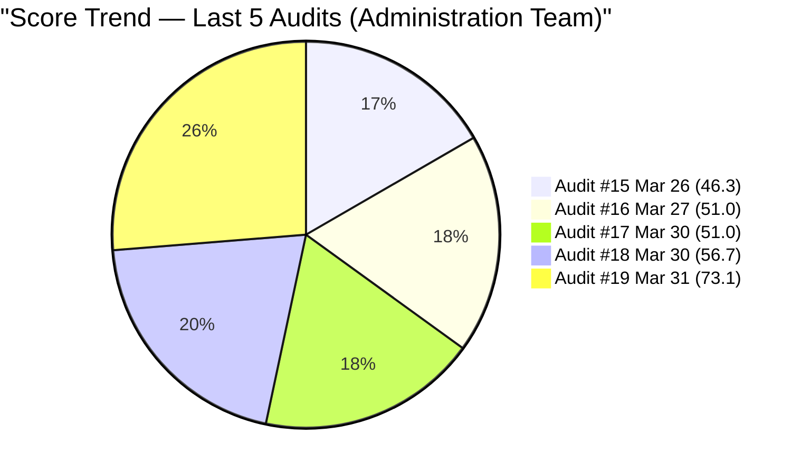
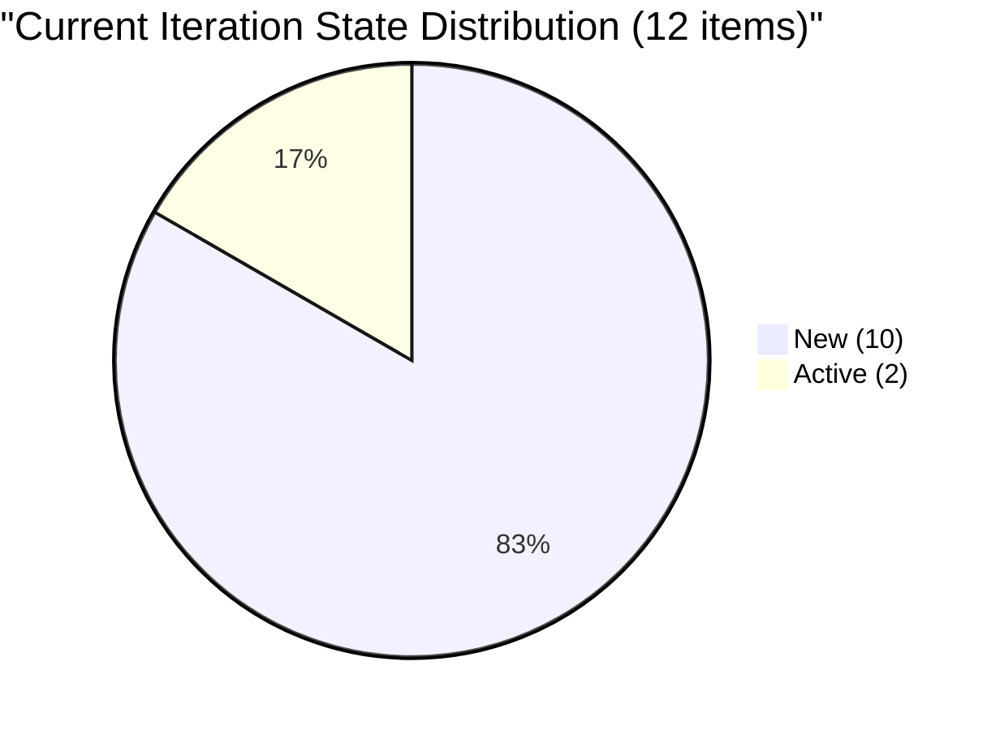
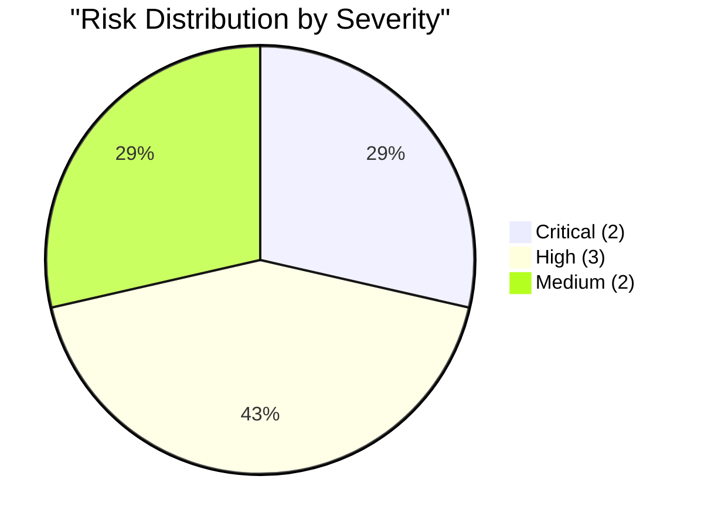

# SAFe Audit Report — Administration Team

## Jairosoft FINOPS Azure DevOps Project

---

## 1. Audit Metadata

| Field | Value |
|-------|-------|
| **Project** | Jairosoft FINOPS |
| **Project ID** | e0bb302f-40f9-46c3-8164-6f1acb317d63 |
| **Team** | Administration Team |
| **Team ID** | a38a9c02-07ab-483d-a1e3-aff54e19e603 |
| **Backlog** | Stories and Deliverables (`Microsoft.RequirementCategory`) |
| **Board URL** | [Administration Team Board](https://dev.azure.com/jairo/Jairosoft%20FINOPS/_boards/board/t/Administration%20Team/Stories%20and%20Deliverables) |
| **Workspace Folder** | `ado_admin` |
| **Current Iteration** | Iteration 6.6 (IP) |
| **Iteration Path** | `Jairosoft FINOPS\2026-PI6\Iteration 6.6 (IP)` |
| **Iteration Start** | March 23, 2026 |
| **Iteration Finish** | April 5, 2026 |
| **Audit Date** | March 31, 2026 — 09:00 PHT |
| **Audit Day** | Day 9 of 14 (64% elapsed) |
| **Previous Audit** | AUDIT_20260330_1000.md (Mar 30, 2026 10:00 PHT — Audit #18) |
| **Overall Score** | **73.1 / 100** |
| **Risk Band** | **Moderate Risk** |
| **Audit Series** | #19 |
| **Framework** | SAFe 6.0 |
| **Rubric** | ADO SAFe v1 (six-dimension deterministic scoring) |

**Audit Boundary:** This audit covers only the Administration Team's Stories and Deliverables backlog in the Jairosoft FINOPS ADO project. No other teams, boards, projects, or repositories were analyzed.

---

## 2. Executive Summary

This is the **nineteenth audit in the series** and the **eighth audit of Iteration 6.6 (IP)**. Since Audit #18 (Mar 30 at 10:00 PHT), two major improvements have occurred:

1. **Capacity configured**: Mark Colina now has **5 h/day** (Deployment 1h, Documentation 2h, Requirements 2h) — resolving the most critical finding from every prior Iteration 6.6 audit. Team Capacity jumps from 0.0 to **100.0**.

2. **Backlog pruned from 30 to 20 items**: 10 items were removed from the visible backlog — specifically the recently added recurring payable items (#200301 Internet payables, #201959 Toyota Fortuner, #201960 Meridian condo, #201961 food allowance, #201962 book keeper, #201963 company doctor, #201964 attorney, #201966 SSS Jairosoft, #201967 SSS JIT, #201969 St. Peter). The sprint shrinks from 21 to 12 items.

3. **#201835 (Vendor Selection & Procurement)** moved from unassigned PI6 root to the current iteration with full Description and AC — the first item with comprehensive acceptance criteria added to the sprint.

**Score jumps from 56.7 to 73.1 (+16.4) — Moderate Risk, the highest score in the audit series.** The capacity fix alone accounts for a +16.7 dimension shift. The backlog pruning improves Iteration Planning and reduces the DoR-failing item count.

---

## 3. Previous Audit Delta

**Previous:** AUDIT_20260330_1000 — Iteration 6.6 (IP) Day 8, Audit #18 (Mar 30, 2026 10:00 PHT)

| Metric | Audit #18 | **Audit #19** | Delta |
|--------|-----------|---------------|-------|
| Overall Score | 56.7/100 | **73.1/100** | **+16.4** |
| Risk Band | High Risk | **Moderate Risk** | Improved |
| Visible Backlog | 30 | **20** | **-10** |
| Items in Iteration 6.6 | 21 | **12** | **-9** |
| SP in Iteration 6.6 | 30 | **17** | **-13** |
| Capacity (h/day) | 0 | **5** | **+5** |
| DoR Pass (Current) | 4.8% (1/21) | **16.7% (2/12)** | +11.9% |
| Estimation Coverage | 95.2% (20/21) | **91.7% (11/12)** | -3.5% |
| Iteration Planning | 70.0 | **60.0** | -10.0 |
| Team Capacity | 0.0 | **100.0** | **+100.0** |
| Estimation | 95.2 | **91.7** | -3.5 |
| DoR Compliance | 4.8 | **16.7** | +11.9 |
| Work Item Balance | 70.0 | **70.0** | No change |
| Backlog Refinement | 100.0 | **100.0** | No change |

### Score Trend (Audits #15 -- #19)



---

## 4. Current Iteration Snapshot

### 4.1 Iteration 6.6 (IP) — Assigned Work Items (12 Items)

| ID | Title | Type | SP | State | Assigned To | Changed Date | DoR |
|----|-------|------|----|-------|-------------|--------------|-----|
| 200306 | Government payables | User Story | 4 | Active | Mark Colina | Mar 30 | FAIL (AC weak) |
| 200613 | BFP certification renewal follow up | User Story | 1 | Active | Mark Colina | Mar 30 | **PASS** |
| 200995 | Follow up Budget request for corrugated sheet | User Story | 2 | New | Mark Colina | Mar 30 | FAIL (no Desc/AC) |
| 201835 | Vendor Selection & Procurement | User Story | 2 | New | Mark Colina | Mar 30 | **PASS** |
| 201856 | Signage Canvass Approval | User Story | -- | New | Mark Colina | Mar 30 | FAIL (no Desc/AC/SP) |
| 201965 | MCWD Cebu water | User Story | 1 | New | Mark Colina | Mar 30 | FAIL (AC weak) |
| 201970 | Globe Telecom - Mam Kriss | User Story | 1 | New | Mark Colina | Mar 30 | FAIL (AC weak) |
| 201984 | DCWD Davao water | User Story | 1 | New | Mark Colina | Mar 30 | FAIL (AC weak) |
| 201986 | Globe Innove - Cebu PAD | User Story | 1 | New | Mark Colina | Mar 30 | FAIL (AC weak) |
| 201988 | Globe Innove - Meridian | User Story | 1 | New | Mark Colina | Mar 30 | FAIL (AC weak) |
| 201990 | Globe Innove - Cebu office | User Story | 1 | New | Mark Colina | Mar 30 | FAIL (AC weak) |
| 201992 | Globe Innove - Azalea | User Story | 1 | New | Mark Colina | Mar 30 | FAIL (AC weak; typo) |

**Total:** 12 items, 17 SP (11 estimated, 1 unestimated). 2 DoR pass (16.7%).

### 4.2 Unassigned Backlog Items (8 Items)

| ID | Title | Path | SP | State | Last Changed |
|----|-------|------|----|-------|--------------|
| 192221 | Purchase additional Corrugated Sheet and installation Day 1 | Root | 2 | New | Mar 30 |
| 193412 | Implementation of aircon repair 2nd floor | Root | 2 | New | Mar 30 |
| 197115 | Implementation of installing jockey pump | Root | 4 | New | Mar 30 |
| 197111 | Recanvass for Jockey pump materials needed | Root | 1 | New | Mar 30 |
| 197023 | Installation of corrugated sheet at Fire Exit | Root | 3 | New | Mar 30 |
| 197029 | Implementation of Parking with roof for 2 vehicles (Day 1) | Root | 3 | New | Mar 30 |
| 197028 | Purchase materials at Houseman Hardware | Root | 1 | New | Mar 30 |
| 197113 | Purchase materials for Jockey pump | Root | 1 | New | Mar 30 |

**Subtotal:** 8 items, 17 SP — all unassigned, facility/construction items at project root.

### 4.3 Team Capacity

| Member | Deployment | Documentation | Requirements | Total/Day |
|--------|-----------|---------------|-------------|-----------|
| Mark Colina | 1 h/day | 2 h/day | 2 h/day | **5 h/day** |

**Admin Team total: 5 h/day.** Capacity configured for the first time in Iteration 6.6. Sprint capacity: 5 h/day x remaining 6 days = ~30 hours for 17 SP.

---

## 5. Work Item Analysis

### 5.1 Backlog Composition (20 Items)

| Type | Count | SP | % |
|------|-------|----|---|
| User Story | 20 | 34 (19 estimated + 1 unestimated) | 100% |

### 5.2 State Distribution (Current Iteration — 12 Items)



### 5.3 Items Removed Since Audit #18

10 items pruned from the backlog. These were recurring payable items added on March 30 (all had SP=1, AC="Attached receipt"):

| ID | Title | Category |
|----|-------|----------|
| 200301 | Internet for Cebu and Davao payables | Utility (was in Review) |
| 201959 | Toyota Fortuner (Cebu) | Vehicle |
| 201960 | Meridian condo and parking dues | Property |
| 201961 | Jairosoft food allowance | Employee benefit |
| 201962 | Book keeper - Daniel Singcay | Professional retainer |
| 201963 | Dr. Karl Chavez - Company doctor | Professional retainer |
| 201964 | Atty. Arsenio Caballero Jr. | Professional retainer |
| 201966 | SSS Jairosoft contribution | Government compliance |
| 201967 | SSS JIT contribution | Government compliance |
| 201969 | St. Peter - Edmund Mina | Miscellaneous |

This pruning removed items that were inflating the iteration count but failing DoR. Notably, #200301 was in Review state — its removal means that work is no longer tracked on this board.

### 5.4 DoR Assessment (Current 12 Items)

| ID | Title | Desc nws | AC nws | DoR |
|----|-------|----------|--------|-----|
| 200306 | Government payables | ~85 | ~15 | **FAIL** (AC < 20 nws) |
| 200613 | BFP certification renewal | ~115 | ~120 | **PASS** |
| 200995 | Follow up Budget request | 0 | 0 | **FAIL** |
| 201835 | Vendor Selection & Procurement | ~120 | ~200 | **PASS** |
| 201856 | Signage Canvass Approval | 0 | 0 | **FAIL** |
| 201965 | MCWD Cebu water | ~80 | ~15 | **FAIL** (AC < 20 nws) |
| 201970 | Globe Telecom - Mam Kriss | ~140 | ~15 | **FAIL** (AC < 20 nws) |
| 201984 | DCWD Davao water | ~120 | ~15 | **FAIL** (AC < 20 nws) |
| 201986 | Globe Innove - Cebu PAD | ~130 | ~15 | **FAIL** (AC < 20 nws) |
| 201988 | Globe Innove - Meridian | ~85 | ~15 | **FAIL** (AC < 20 nws) |
| 201990 | Globe Innove - Cebu office | ~80 | ~15 | **FAIL** (AC < 20 nws) |
| 201992 | Globe Innove - Azalea | ~75 | ~15 | **FAIL** (AC < 20 nws; typo "Atrached") |

**Current iteration DoR:** 2/12 (16.7%).

---

## 6. SAFe Compliance Scorecard

| # | Dimension | Score | Formula | Evidence | Notes |
|---|-----------|-------|---------|----------|-------|
| 1 | Iteration Planning | **60.0** | 12/20 x 100 | 12 of 20 in Iter 6.6 | 8 facility items at root unassigned |
| 2 | Team Capacity | **100.0** | 1/1 x 100 | Mark: 5 h/day | First time configured in Iter 6.6 |
| 3 | Estimation | **91.7** | 11/12 x 100 | 11 of 12 have SP > 0 | Only #201856 missing SP |
| 4 | DoR Compliance | **16.7** | 2/12 x 100 | 2 of 12 pass DoR | "Attached receipt" pattern persists |
| 5 | Work Item Balance | **70.0** | 100 - 30 | 100% User Story (dominant > 60%) | -30 penalty |
| 6 | Backlog Refinement | **100.0** | base=100; no penalties | All 20 items touched Mar 30 | No stale or untouched items |
| | **Overall** | **73.1** | avg(6 dims) | | **Moderate Risk (60-79.9)** |

### Score Computation

```
--- Iteration Planning ---
current_iteration_root_items = 12
visible_root_backlog_items = 20
Score = round(12/20 x 100, 1) = 60.0

--- Team Capacity ---
contributors_with_current_work = 1 (Mark Colina)
contributors_with_capacity = 1 (Mark: 5 h/day — Deployment 1h, Documentation 2h, Requirements 2h)
Score = round(1/1 x 100, 1) = 100.0

--- Estimation ---
point_eligible_current_items = 12 (all User Stories)
estimated_current_items = 11 (all except #201856)
Score = round(11/12 x 100, 1) = 91.7

--- DoR Compliance ---
dor_compliant_current_items = 2 (#200613, #201835)
Score = round(2/12 x 100, 1) = 16.7

--- Work Item Balance ---
All 12 current items = User Story (100%)
dominant_type_share = 100% (> 60%) => -30
Has User Story items => no -40
spike_share = 0% => no -20
Score = 100 - 30 = 70.0

--- Backlog Refinement ---
Reference date: 2026-03-31
Iteration start: 2026-03-23
45-day cutoff: 2026-02-14
90-day cutoff: 2025-12-31
180-day cutoff: 2025-10-02

All 20 items have ChangedDate = Mar 30, 2026.
fresh_visible_root_items = 20/20 => base = 100.0
stale_90_visible_root_items = 0 => no penalty
stale_180_visible_root_items = 0 => no penalty
untouched_current_items = 0 (all changed Mar 30 >= Mar 23 start) => no penalty
Score = 100.0

--- Overall ---
(60.0 + 100.0 + 91.7 + 16.7 + 70.0 + 100.0) / 6 = 438.4 / 6 = 73.1
Risk Band: Moderate Risk (60-79.9)
```

---

## 7. Dimension Findings

### 7.1 Iteration Planning (60.0/100) — MODERATE

12 of 20 items in the current iteration (60%). Down from 70.0 in Audit #18 because the pruning removed 9 sprint items and 1 non-sprint item, shrinking the ratio. The 8 remaining unassigned items are all facility/construction work at project root — these may be intentionally deferred.

**Path to improvement:** Assigning 4 more items to the sprint would reach 80%.

### 7.2 Team Capacity (100.0/100) — EXCELLENT

Mark Colina now has 5 h/day configured across three activities (Deployment 1h, Documentation 2h, Requirements 2h). This is the **first time capacity has been configured in Iteration 6.6** and resolves the most critical finding from 8 consecutive audits. ADO burndown is now functional.

### 7.3 Estimation (91.7/100) — GOOD

11 of 12 current items have Story Points. Only #201856 ("Signage Canvass Approval") remains unestimated — a placeholder with zero content. Slightly down from 95.2 because the pruned items were all estimated.

### 7.4 DoR Compliance (16.7/100) — CRITICAL

Only 2 of 12 current items pass DoR. #200613 (BFP certification) and #201835 (Vendor Selection & Procurement) have comprehensive descriptions and acceptance criteria. The remaining 10 items fail — 7 due to "Attached receipt" AC pattern (~15 nws, below the 20-character threshold), 2 with zero content (#200995, #201856), and 1 with a typo (#201992 "Atrached receipt").

Improvement from 4.8% to 16.7% is mainly because the denominator shrank (21 to 12) and #201835 passes.

### 7.5 Work Item Balance (70.0/100) — MODERATE

All 20 backlog items are User Stories. Structural limitation — -30 penalty for dominant type share > 60%. No Spikes.

### 7.6 Backlog Refinement (100.0/100) — EXCELLENT

All 20 items were bulk-touched on March 30, making them all technically fresh. No stale items at 90 or 180 days. No untouched current items.

---

## 8. Risks and Bottlenecks



### CRITICAL: DoR Compliance at 16.7% — 10 of 12 Items Fail

The "Attached receipt" AC pattern affects 7 current items. Two items have zero content. Only 2 items have verifiable completion criteria. This is the lowest-scoring dimension and the primary drag on the overall score.

### CRITICAL: Holy Week — Effective Sprint Ending Imminent

April 2-5 includes Philippine Holy Week holidays. The effective remaining work window may be as few as 2 days (Mar 31-Apr 1). With 10 of 12 items in "New" state, completing the sprint is unrealistic. No days-off are configured in ADO.

### HIGH: #200995 Target Date Overdue — Still No Content

The target date of March 27 has passed (+4 days). The item still has zero Description and zero AC in "New" state. Flagged in 8 consecutive audits with no remediation.

### HIGH: #201856 Still a Placeholder

"Signage Canvass Approval" has no SP, no Description, no AC. The only unestimated item in the current sprint.

### HIGH: #200301 Removed While in Review State

The Internet payables item was in Review state (indicating work completion pending acceptance) but has been removed from the board entirely. If completed work exists, it should be tracked to closure, not deleted.

### MEDIUM: 10 of 12 Current Items in "New" State (83%)

Only 2 items have progressed beyond "New" (both Active). With Holy Week reducing effective days to ~2, completing 17 SP is unlikely.

### MEDIUM: Typo in #201992 AC — "Atrached receipt"

Still uncorrected from Audit #18.

---

## 9. Prioritized Recommendations

### Priority 1: Fix AC on 7 "Attached Receipt" Items (CRITICAL — Today)

Replace "Attached receipt" with structured acceptance criteria. Template: "Payment receipt obtained, uploaded to work item, and invoice number/date recorded. Amount matches approved budget line." This would raise DoR from 16.7% to 75.0%.

### Priority 2: Configure Holy Week Days-Off (CRITICAL — Today)

Add April 2-5 as days off in ADO for Mark Colina. This ensures accurate burndown and capacity tracking.

### Priority 3: Elaborate or Remove #200995 and #201856 (HIGH — Today)

Both items have zero content. Either add Description, AC, and SP (for #201856) or remove from the sprint.

### Priority 4: Clarify #200301 Removal (HIGH — Today)

If the Internet payables review was complete, the work should be tracked to closure. If it was moved elsewhere, document the transfer.

### Priority 5: Close Active Items Before Holy Week (MEDIUM — Apr 1)

# 200306 and #200613 are both Active. If either is complete, move to Closed to establish delivery credit

### Priority 6: Fix Typo in #201992 (LOW — Anytime)

Change "Atrached receipt" to "Attached receipt."

---

## 10. Evidence Gaps and Limitations

| Gap | Impact | Notes |
|-----|--------|-------|
| Bulk ChangedDate update (Mar 30) | All items show same date — masks true staleness | Backlog Refinement 100.0 may be inflated |
| "Attached receipt" AC pattern | 7 current items fail DoR | Structural gap; template AC needed |
| #200301 removed while in Review | Completed work may be lost | Closure status unknown |
| #200995 no elaboration | Target date +4 days overdue | 8 audits flagged |
| #201856 placeholder | Inflates count without planning value | Title only |
| No Holy Week days-off | Sprint capacity/burndown miscalculated | April 2-5 holidays |
| No GitHub repos in scope | No delivery evidence beyond board | Defined boundary |

---

### Full Score History (Audits #1-#19)

| # | Date | Iter | Day | Score | Band |
|---|------|------|-----|-------|------|
| 1 | Feb 25 | 6.3 | -- | 42.0 | High |
| 2 | Mar 4 | 6.4 | -- | 51.0 | High |
| 3 | Mar 4 | 6.4 | -- | 56.0 | High |
| 4 | Mar 5 | 6.4 | -- | 57.0 | High |
| 5 | Mar 6 | 6.4 | -- | 58.0 | High |
| 6 | Mar 9 | 6.5 | 1 | 62.0 | Moderate |
| 7 | Mar 9 | 6.5 | 1 | 54.0 | High |
| 8 | Mar 16 | 6.5 | 8 | 55.0 | High |
| 9 | Mar 17 | 6.5 | 9 | 57.0 | High |
| 10 | Mar 18 | 6.5 | 10 | 57.0 | High |
| 11 | Mar 22 | 6.5 | 14 | 55.0 | High |
| 12 | Mar 25 | 6.6 | 3 | 46.3 | High |
| 13 | Mar 25 | 6.6 | 3 | 46.3 | High |
| 14 | Mar 26 | 6.6 | 4 | 46.3 | High |
| 15 | Mar 26 | 6.6 | 4 | 46.3 | High |
| 16 | Mar 27 | 6.6 | 5 | 51.0 | High |
| 17 | Mar 30 | 6.6 | 8 | 51.0 | High |
| 18 | Mar 30 | 6.6 | 8 | 56.7 | High |
| **19** | **Mar 31** | **6.6** | **9** | **73.1** | **Moderate** |

---

*Report generated: March 31, 2026 09:00 PHT*
*Auditor: AI EngProd Consultant (SAFe 6.0)*
*Rubric: ADO SAFe v1 (six-dimension deterministic scoring)*
*Audit #19 | Iteration 6.6 (IP) Day 9 of 14 | Score: 73.1/100 (Moderate Risk)*
*Previous: AUDIT_20260330_1000 (56.7/100 — High Risk)*
*Delta: +16.4 — Capacity configured (+100 pts) and backlog pruned (-10 items) drive largest score increase in series*
