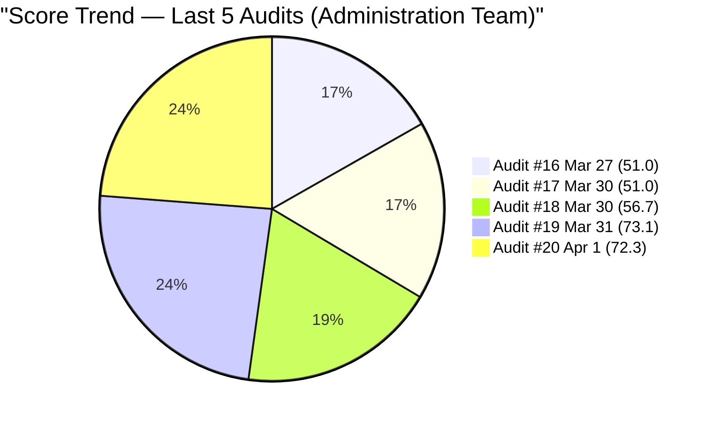
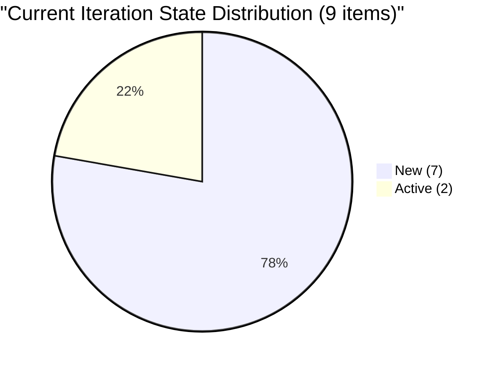
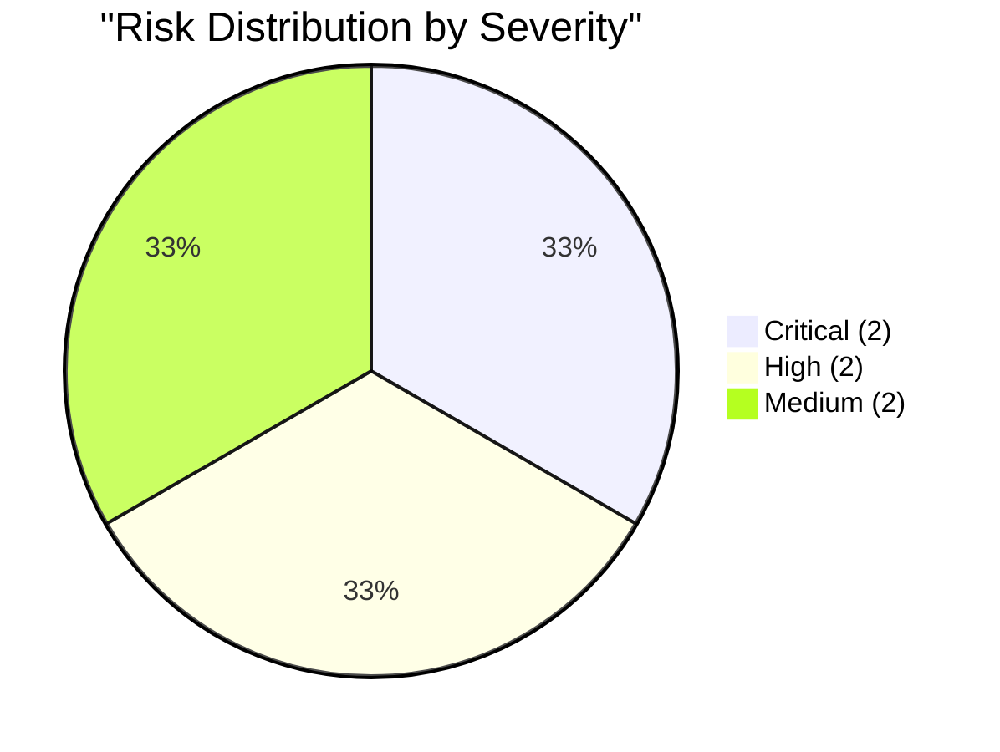

# SAFe Audit Report — Administration Team

## Jairosoft FINOPS Azure DevOps Project

---

## 1. Audit Metadata

| Field | Value |
|-------|-------|
| **Project** | Jairosoft FINOPS |
| **Project ID** | e0bb302f-40f9-46c3-8164-6f1acb317d63 |
| **Team** | Administration Team |
| **Team ID** | a38a9c02-07ab-483d-a1e3-aff54e19e603 |
| **Backlog** | Stories and Deliverables (`Microsoft.RequirementCategory`) |
| **Board URL** | [Administration Team Board](https://dev.azure.com/jairo/Jairosoft%20FINOPS/_boards/board/t/Administration%20Team/Stories%20and%20Deliverables) |
| **Workspace Folder** | `ado_admin` |
| **Current Iteration** | Iteration 6.6 (IP) |
| **Iteration Path** | `Jairosoft FINOPS\2026-PI6\Iteration 6.6 (IP)` |
| **Iteration Start** | March 23, 2026 |
| **Iteration Finish** | April 5, 2026 |
| **Audit Date** | April 1, 2026 — 09:00 PHT |
| **Audit Day** | Day 10 of 14 (71% elapsed) |
| **Previous Audit** | AUDIT_20260331_0900.md (Mar 31, 2026 09:00 PHT — Audit #19) |
| **Overall Score** | **72.3 / 100** |
| **Risk Band** | **Moderate Risk** |
| **Audit Series** | #20 |
| **Framework** | SAFe 6.0 |
| **Rubric** | ADO SAFe v1 (six-dimension deterministic scoring) |

**Audit Boundary:** This audit covers only the Administration Team's Stories and Deliverables backlog in the Jairosoft FINOPS ADO project. No other teams, boards, projects, or repositories were analyzed.

---

## 2. Executive Summary

This is the **twentieth audit in the series** and the **ninth audit of Iteration 6.6 (IP)**. Since Audit #19 (Mar 31 at 09:00 PHT), three items were removed from the backlog:

1. **3 Globe Innove items pruned:** #201986 (Cebu PAD), #201988 (Meridian), and #201990 (Cebu office) have been removed from the visible backlog. These were all 1 SP utility payment items with "Attached receipt" AC that were failing DoR.

The backlog shrinks from 20 to **17 items** and the current iteration from 12 to **9 items**. This pruning removes 3 DoR-failing items from the sprint and 3 from the visible backlog.

**Score moves from 73.1 to 72.3 (-0.8) -- Moderate Risk.** The slight decrease is because Iteration Planning drops (9/17=52.9 vs 12/20=60.0) and Estimation improves slightly (88.9 vs 91.7), while DoR improves from 16.7 to 22.2. The net effect is marginal.

---

## 3. Previous Audit Delta

**Previous:** AUDIT_20260331_0900 — Iteration 6.6 (IP) Day 9, Audit #19 (Mar 31, 2026 09:00 PHT)

| Metric | Audit #19 | **Audit #20** | Delta |
|--------|-----------|---------------|-------|
| Overall Score | 73.1/100 | **72.3/100** | **-0.8** |
| Risk Band | Moderate Risk | **Moderate Risk** | No change |
| Visible Backlog | 20 | **17** | **-3** |
| Items in Iteration 6.6 | 12 | **9** | **-3** |
| SP in Iteration 6.6 | 17 | **14** | **-3** |
| Capacity (h/day) | 5 | **5** | No change |
| DoR Pass (Current) | 16.7% (2/12) | **22.2% (2/9)** | +5.5% |
| Estimation Coverage | 91.7% (11/12) | **88.9% (8/9)** | -2.8% |
| Iteration Planning | 60.0 | **52.9** | -7.1 |
| Team Capacity | 100.0 | **100.0** | No change |
| Estimation | 91.7 | **88.9** | -2.8 |
| DoR Compliance | 16.7 | **22.2** | +5.5 |
| Work Item Balance | 70.0 | **70.0** | No change |
| Backlog Refinement | 100.0 | **100.0** | No change |

### Score Trend (Audits #16 -- #20)



---

## 4. Current Iteration Snapshot

### 4.1 Iteration 6.6 (IP) — Assigned Work Items (9 Items)

| ID | Title | Type | SP | State | Assigned To | Changed Date | DoR |
|----|-------|------|----|-------|-------------|--------------|-----|
| 200306 | Government payables | User Story | 4 | Active | Mark Colina | Mar 30 | FAIL (AC weak) |
| 200613 | BFP certification renewal follow up | User Story | 1 | Active | Mark Colina | Mar 30 | **PASS** |
| 200995 | Follow up Budget request for corrugated sheet | User Story | 2 | New | Mark Colina | Mar 30 | FAIL (no Desc/AC) |
| 201835 | Vendor Selection & Procurement | User Story | 2 | New | Mark Colina | Mar 30 | **PASS** |
| 201856 | Signage Canvass Approval | User Story | -- | New | Mark Colina | Mar 30 | FAIL (no Desc/AC/SP) |
| 201965 | MCWD Cebu water | User Story | 1 | New | Mark Colina | Mar 30 | FAIL (AC weak) |
| 201970 | Globe Telecom - Mam Kriss | User Story | 1 | New | Mark Colina | Mar 30 | FAIL (AC weak) |
| 201984 | DCWD Davao water | User Story | 1 | New | Mark Colina | Mar 30 | FAIL (AC weak) |
| 201992 | Globe Innove - Azalea | User Story | 1 | New | Mark Colina | Mar 30 | FAIL (AC weak; typo) |

**Total:** 9 items, 14 SP (8 estimated, 1 unestimated). 2 DoR pass (22.2%).

### 4.2 Unassigned Backlog Items (8 Items)

| ID | Title | Path | SP | State | Last Changed |
|----|-------|------|----|-------|--------------|
| 192221 | Purchase additional Corrugated Sheet and installation Day 1 | Root | 2 | New | Mar 30 |
| 193412 | Implementation of aircon repair 2nd floor | Root | 2 | New | Mar 30 |
| 197115 | Implementation of installing jockey pump | Root | 4 | New | Mar 30 |
| 197111 | Recanvass for Jockey pump materials needed | Root | 1 | New | Mar 30 |
| 197023 | Installation of corrugated sheet at Fire Exit | Root | 3 | New | Mar 30 |
| 197029 | Implementation of Parking with roof for 2 vehicles (Day 1) | Root | 3 | New | Mar 30 |
| 197028 | Purchase materials at Houseman Hardware | Root | 1 | New | Mar 30 |
| 197113 | Purchase materials for Jockey pump | Root | 1 | New | Mar 30 |

**Subtotal:** 8 items, 17 SP — all unassigned, facility/construction items at project root.

### 4.3 Items Removed Since Audit #19

3 Globe Innove items pruned from the backlog:

| ID | Title | SP | Previously |
|----|-------|----|-----------|
| 201986 | Globe Innove - Cebu PAD | 1 | Iter 6.6, New |
| 201988 | Globe Innove - Meridian | 1 | Iter 6.6, New |
| 201990 | Globe Innove - Cebu office | 1 | Iter 6.6, New |

All 3 had "Attached receipt" AC (failing DoR). Pruning is consistent with the consolidation pattern observed since Audit #18.

### 4.4 Team Capacity

| Member | Deployment | Documentation | Requirements | Total/Day |
|--------|-----------|---------------|-------------|-----------|
| Mark Colina | 1 h/day | 2 h/day | 2 h/day | **5 h/day** |

**Admin Team total: 5 h/day.** Sprint capacity: 5 h/day x remaining 4 days = ~20 hours for 14 SP (Holy Week may reduce this further).

---

## 5. Work Item Analysis

### 5.1 Backlog Composition (17 Items)

| Type | Count | SP | % |
|------|-------|----|---|
| User Story | 17 | 31 (16 estimated + 1 unestimated) | 100% |

### 5.2 State Distribution (Current Iteration — 9 Items)



### 5.3 DoR Assessment (Current 9 Items)

| ID | Title | Desc nws | AC nws | DoR |
|----|-------|----------|--------|-----|
| 200306 | Government payables | ~85 | ~15 | **FAIL** (AC < 20 nws) |
| 200613 | BFP certification renewal | ~115 | ~120 | **PASS** |
| 200995 | Follow up Budget request | 0 | 0 | **FAIL** |
| 201835 | Vendor Selection & Procurement | ~120 | ~200 | **PASS** |
| 201856 | Signage Canvass Approval | 0 | 0 | **FAIL** |
| 201965 | MCWD Cebu water | ~80 | ~15 | **FAIL** (AC < 20 nws) |
| 201970 | Globe Telecom - Mam Kriss | ~140 | ~15 | **FAIL** (AC < 20 nws) |
| 201984 | DCWD Davao water | ~120 | ~15 | **FAIL** (AC < 20 nws) |
| 201992 | Globe Innove - Azalea | ~75 | ~15 | **FAIL** (AC < 20 nws; typo "Atrached") |

**Current iteration DoR:** 2/9 (22.2%).

---

## 6. SAFe Compliance Scorecard

| # | Dimension | Score | Formula | Evidence | Notes |
|---|-----------|-------|---------|----------|-------|
| 1 | Iteration Planning | **52.9** | 9/17 x 100 | 9 of 17 in Iter 6.6 | 8 facility items at root unassigned |
| 2 | Team Capacity | **100.0** | 1/1 x 100 | Mark: 5 h/day | Stable since Audit #19 |
| 3 | Estimation | **88.9** | 8/9 x 100 | 8 of 9 have SP > 0 | Only #201856 missing SP |
| 4 | DoR Compliance | **22.2** | 2/9 x 100 | 2 of 9 pass DoR | "Attached receipt" pattern persists |
| 5 | Work Item Balance | **70.0** | 100 - 30 | 100% User Story (dominant > 60%) | -30 penalty |
| 6 | Backlog Refinement | **100.0** | base=100; no penalties | All 17 items touched Mar 30 | No stale or untouched items |
| | **Overall** | **72.3** | avg(6 dims) | | **Moderate Risk (60-79.9)** |

### Score Computation

```
--- Iteration Planning ---
current_iteration_root_items = 9
visible_root_backlog_items = 17
Score = round(9/17 x 100, 1) = 52.9

--- Team Capacity ---
contributors_with_current_work = 1 (Mark Colina)
contributors_with_capacity = 1 (Mark: 5 h/day — Deployment 1h, Documentation 2h, Requirements 2h)
Score = round(1/1 x 100, 1) = 100.0

--- Estimation ---
point_eligible_current_items = 9 (all User Stories)
estimated_current_items = 8 (all except #201856)
Score = round(8/9 x 100, 1) = 88.9

--- DoR Compliance ---
dor_compliant_current_items = 2 (#200613, #201835)
Score = round(2/9 x 100, 1) = 22.2

--- Work Item Balance ---
All 9 current items = User Story (100%)
dominant_type_share = 100% (> 60%) => -30
Has User Story items => no -40
spike_share = 0% => no -20
Score = 100 - 30 = 70.0

--- Backlog Refinement ---
Reference date: 2026-04-01
Iteration start: 2026-03-23
45-day cutoff: 2026-02-15
90-day cutoff: 2026-01-01
180-day cutoff: 2025-10-04

All 17 items have ChangedDate = Mar 30, 2026.
fresh_visible_root_items = 17/17 => base = 100.0
stale_90_visible_root_items = 0 => no penalty
stale_180_visible_root_items = 0 => no penalty
untouched_current_items = 0 (all changed Mar 30 >= Mar 23 start) => no penalty
Score = 100.0

--- Overall ---
(52.9 + 100.0 + 88.9 + 22.2 + 70.0 + 100.0) / 6 = 434.0 / 6 = 72.3
Wait — let me recompute: 52.9 + 100.0 + 88.9 + 22.2 + 70.0 + 100.0 = 434.0
434.0 / 6 = 72.3

Correction: Overall = 72.3
Risk Band: Moderate Risk (60-79.9)
```

Overall = 72.3
Risk Band: Moderate Risk (60-79.9)

---

## 7. Dimension Findings

### 7.1 Iteration Planning (52.9/100) — HIGH

9 of 17 items in the current iteration (52.9%). Down from 60.0 in Audit #19 because the pruning removed 3 sprint items while 0 non-sprint items were removed, shrinking the ratio further. The 8 remaining unassigned items are all facility/construction work at project root.

**Path to improvement:** Assigning 5 more items to the sprint would reach 82.4%.

### 7.2 Team Capacity (100.0/100) — EXCELLENT

Mark Colina at 5 h/day (Deployment 1h, Documentation 2h, Requirements 2h). Stable.

### 7.3 Estimation (88.9/100) — GOOD

8 of 9 current items have Story Points. Only #201856 ("Signage Canvass Approval") remains unestimated. Down from 91.7 because the pruned items were all estimated.

### 7.4 DoR Compliance (22.2/100) — CRITICAL

Only 2 of 9 current items pass DoR. Improved from 16.7% purely because the denominator shrank (12 to 9) while the numerator stayed at 2. #200613 (BFP certification) and #201835 (Vendor Selection & Procurement) remain the only items with comprehensive descriptions and acceptance criteria. The "Attached receipt" AC pattern affects 4 remaining items.

### 7.5 Work Item Balance (70.0/100) — MODERATE

All 17 backlog items are User Stories. Structural limitation. -30 penalty for dominant type share > 60%.

### 7.6 Backlog Refinement (100.0/100) — EXCELLENT

All 17 items were bulk-touched on March 30. No stale items. No untouched current items.

---

## 8. Risks and Bottlenecks



### CRITICAL: DoR Compliance at 22.2% — 7 of 9 Items Fail

The "Attached receipt" AC pattern affects 4 current items. Two items have zero content. Only 2 items have verifiable completion criteria. This remains the primary drag on the overall score.

### CRITICAL: Holy Week — Sprint Effectively Over

April 2-5 includes Philippine Holy Week holidays. Today (April 1) may be the last effective work day. With 7 of 9 items in "New" state, completing the sprint is unrealistic. No days-off are configured in ADO.

### HIGH: #200995 Target Date Overdue — Still No Content

The target date of March 27 has passed (+5 days). The item still has zero Description and zero AC in "New" state. Flagged in 9 consecutive audits with no remediation.

### HIGH: #201856 Still a Placeholder

"Signage Canvass Approval" has no SP, no Description, no AC. The only unestimated item in the current sprint.

### MEDIUM: 7 of 9 Current Items in "New" State (78%)

Only 2 items have progressed beyond "New" (both Active). With Holy Week starting tomorrow, completing 14 SP is unlikely.

### MEDIUM: Typo in #201992 AC — "Atrached receipt"

Still uncorrected from Audit #18.

---

## 9. Prioritized Recommendations

### Priority 1: Fix AC on 4 "Attached Receipt" Items (CRITICAL — Today)

Replace "Attached receipt" with structured acceptance criteria on #201965, #201970, #201984, #201992. Template: "Payment receipt obtained, uploaded to work item, and invoice number/date recorded. Amount matches approved budget line." This would raise DoR from 22.2% to 66.7%.

### Priority 2: Configure Holy Week Days-Off (CRITICAL — Today)

Add April 2-5 as days off in ADO for Mark Colina for accurate burndown and capacity tracking.

### Priority 3: Elaborate or Remove #200995 and #201856 (HIGH — Today)

Both items have zero content. Either add Description, AC, and SP (for #201856) or remove from the sprint.

### Priority 4: Close Active Items Before Holy Week (MEDIUM — Today)

# 200306 and #200613 are both Active. If either is complete, move to Closed to establish delivery credit

### Priority 5: Fix Typo in #201992 (LOW — Anytime)

Change "Atrached receipt" to "Attached receipt."

---

## 10. Evidence Gaps and Limitations

| Gap | Impact | Notes |
|-----|--------|-------|
| Bulk ChangedDate update (Mar 30) | All items show same date — masks true staleness | Backlog Refinement 100.0 may be inflated |
| "Attached receipt" AC pattern | 4 current items fail DoR | Structural gap; template AC needed |
| #200995 no elaboration | Target date +5 days overdue | 9 audits flagged |
| #201856 placeholder | Inflates count without planning value | Title only |
| No Holy Week days-off | Sprint capacity/burndown miscalculated | April 2-5 holidays |
| No GitHub repos in scope | No delivery evidence beyond board | Defined boundary |

---

### Full Score History (Audits #1-#20)

| # | Date | Iter | Day | Score | Band |
|---|------|------|-----|-------|------|
| 1 | Feb 25 | 6.3 | -- | 42.0 | High |
| 2 | Mar 4 | 6.4 | -- | 51.0 | High |
| 3 | Mar 4 | 6.4 | -- | 56.0 | High |
| 4 | Mar 5 | 6.4 | -- | 57.0 | High |
| 5 | Mar 6 | 6.4 | -- | 58.0 | High |
| 6 | Mar 9 | 6.5 | 1 | 62.0 | Moderate |
| 7 | Mar 9 | 6.5 | 1 | 54.0 | High |
| 8 | Mar 16 | 6.5 | 8 | 55.0 | High |
| 9 | Mar 17 | 6.5 | 9 | 57.0 | High |
| 10 | Mar 18 | 6.5 | 10 | 57.0 | High |
| 11 | Mar 22 | 6.5 | 14 | 55.0 | High |
| 12 | Mar 25 | 6.6 | 3 | 46.3 | High |
| 13 | Mar 25 | 6.6 | 3 | 46.3 | High |
| 14 | Mar 26 | 6.6 | 4 | 46.3 | High |
| 15 | Mar 26 | 6.6 | 4 | 46.3 | High |
| 16 | Mar 27 | 6.6 | 5 | 51.0 | High |
| 17 | Mar 30 | 6.6 | 8 | 51.0 | High |
| 18 | Mar 30 | 6.6 | 8 | 56.7 | High |
| 19 | Mar 31 | 6.6 | 9 | 73.1 | Moderate |
| **20** | **Apr 1** | **6.6** | **10** | **72.3** | **Moderate** |

---

*Report generated: April 1, 2026 09:00 PHT*
*Auditor: AI EngProd Consultant (SAFe 6.0)*
*Rubric: ADO SAFe v1 (six-dimension deterministic scoring)*
*Audit #20 | Iteration 6.6 (IP) Day 10 of 14 | Score: 72.3/100 (Moderate Risk)*
*Previous: AUDIT_20260331_0900 (73.1/100 -- Moderate Risk)*
*Delta: -0.8 -- Backlog pruned 3 more Globe Innove items; iteration planning ratio decreased*
