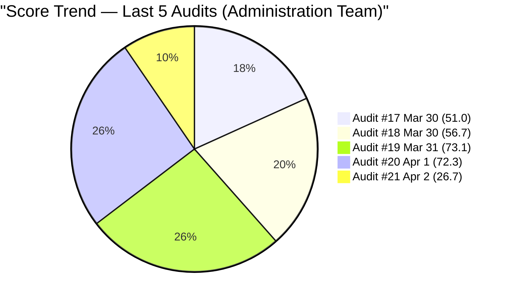
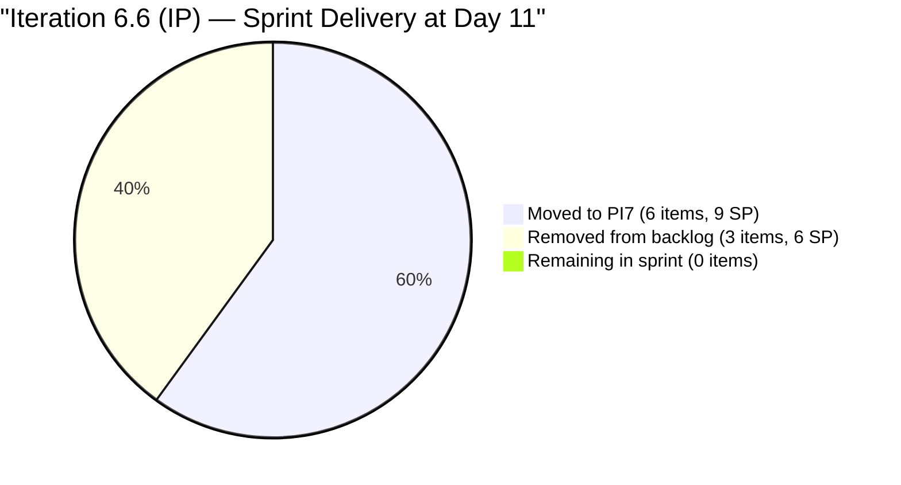
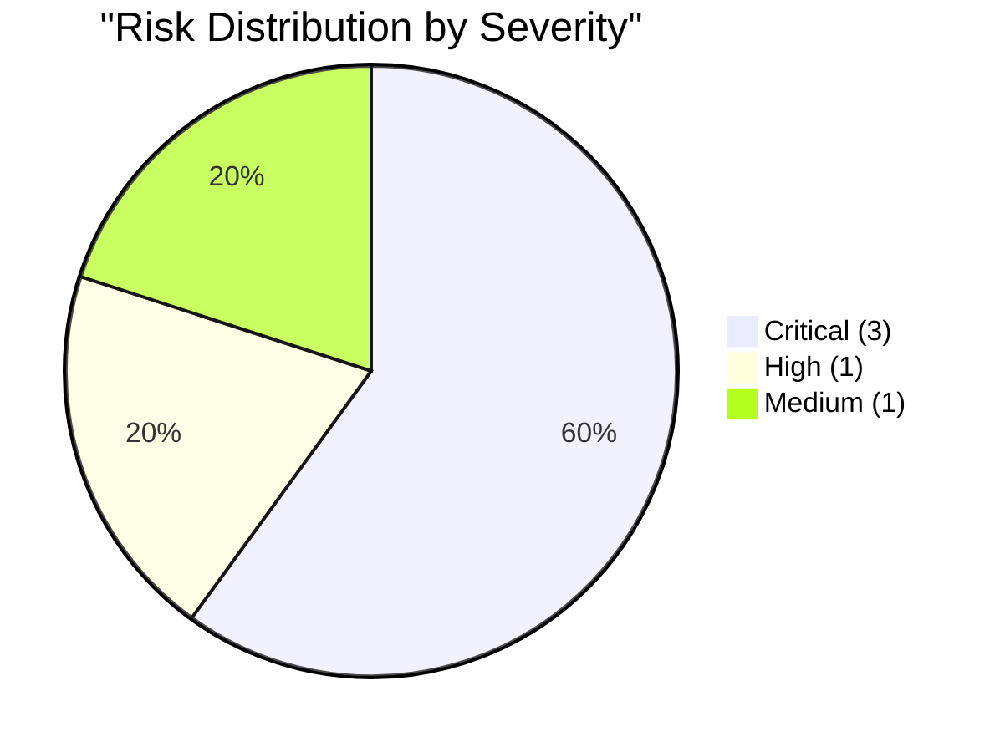

# SAFe Audit Report — Administration Team

## Jairosoft FINOPS Azure DevOps Project

---

## 1. Audit Metadata

| Field | Value |
|-------|-------|
| **Project** | Jairosoft FINOPS |
| **Project ID** | e0bb302f-40f9-46c3-8164-6f1acb317d63 |
| **Team** | Administration Team |
| **Team ID** | a38a9c02-07ab-483d-a1e3-aff54e19e603 |
| **Backlog** | Stories and Deliverables (`Microsoft.RequirementCategory`) |
| **Board URL** | [Administration Team Board](https://dev.azure.com/jairo/Jairosoft%20FINOPS/_boards/board/t/Administration%20Team/Stories%20and%20Deliverables) |
| **Workspace Folder** | `ado_admin` |
| **Current Iteration** | Iteration 6.6 (IP) |
| **Iteration Path** | `Jairosoft FINOPS\2026-PI6\Iteration 6.6 (IP)` |
| **Iteration Start** | March 23, 2026 |
| **Iteration Finish** | April 5, 2026 |
| **Audit Date** | April 2, 2026 — 09:00 PHT |
| **Audit Day** | Day 11 of 14 (79% elapsed) |
| **Previous Audit** | AUDIT_20260401_0900.md (Apr 1, 2026 09:00 PHT — Audit #20) |
| **Overall Score** | **26.7 / 100** |
| **Risk Band** | **Critical Risk** |
| **Audit Series** | #21 |
| **Framework** | SAFe 6.0 |
| **Rubric** | ADO SAFe v1 (six-dimension deterministic scoring) |

**Audit Boundary:** This audit covers only the Administration Team's Stories and Deliverables backlog in the Jairosoft FINOPS ADO project. No other teams, boards, projects, or repositories were analyzed.

---

## 2. Executive Summary

This is the **twenty-first audit in the series** and the **tenth audit of Iteration 6.6 (IP)**. Since Audit #20 (Apr 1 at 09:00 PHT), a **massive structural change** has occurred:

### Key Changes

1. **All 9 sprint items evacuated from Iteration 6.6:**
   - **6 items moved to Iteration 7.1:** #200613 (BFP certification), #200995 (Budget request), #201835 (Vendor Selection), #201856 (Signage Canvass), #201984 (DCWD water), #201992 (Globe Innove Azalea)
   - **3 items removed from backlog entirely:** #200306 (Government payables, 4 SP), #201965 (MCWD Cebu water, 1 SP), #201970 (Globe Telecom, 1 SP) — previously Active/New, now closed or pruned

2. **Sprint is now empty.** Zero items remain in Iteration 6.6 (IP). The current iteration has no committed work.

3. **Backlog shrinks from 17 to 14.** The 3 removed items (#200306, #201965, #201970) are no longer on the visible backlog.

4. **Several items touched Apr 1-2:** #200995, #201835, #201984, #201992 all have ChangedDates of April 1-2, confirming active board management during the sprint evacuation.

**Score crashes from 72.3 to 26.7 (-45.6) — Critical Risk.** With zero items in the sprint, Iteration Planning, Team Capacity, Estimation, and DoR Compliance all score 0.0. This is a structural collapse — the team has effectively abandoned Iteration 6.6 and moved all work to PI7.

---

## 3. Previous Audit Delta

**Previous:** AUDIT_20260401_0900 — Iteration 6.6 (IP) Day 10, Audit #20 (Apr 1, 2026 09:00 PHT)

| Metric | Audit #20 | **Audit #21** | Delta |
|--------|-----------|---------------|-------|
| Overall Score | 72.3/100 | **26.7/100** | **-45.6** |
| Risk Band | Moderate Risk | **Critical Risk** | Downgraded |
| Visible Backlog | 17 | **14** | **-3** |
| Items in Iteration 6.6 | 9 | **0** | **-9** |
| SP in Iteration 6.6 | 14 | **0** | **-14** |
| Capacity (h/day) | 5 | **5** | No change |
| DoR Pass (Current) | 22.2% (2/9) | **N/A (0/0)** | N/A |
| Estimation Coverage | 88.9% (8/9) | **N/A (0/0)** | N/A |
| Iteration Planning | 52.9 | **0.0** | -52.9 |
| Team Capacity | 100.0 | **0.0** | -100.0 |
| Estimation | 88.9 | **0.0** | -88.9 |
| DoR Compliance | 22.2 | **0.0** | -22.2 |
| Work Item Balance | 70.0 | **60.0** | -10.0 |
| Backlog Refinement | 100.0 | **100.0** | No change |

### Score Trend (Audits #17 -- #21)



---

## 4. Current Iteration Snapshot

### 4.1 Iteration 6.6 (IP) — Assigned Work Items (0 Items)

**The sprint is empty.** All 9 previously assigned items have been moved to Iteration 7.1 (6 items) or removed from the backlog (3 items).

### 4.2 Items Moved to Iteration 7.1 (6 Items)

| ID | Title | SP | State | Changed | DoR |
|----|-------|----|-------|---------|-----|
| 200613 | BFP certification renewal follow up | 1 | New | Apr 1 | PASS |
| 200995 | Follow up Budget request for corrugated sheet | 2 | New | Apr 2 | FAIL (no Desc/AC) |
| 201835 | Vendor Selection & Procurement | 2 | New | Apr 2 | PASS |
| 201856 | Signage Canvass Approval | 2 | New | Apr 1 | FAIL (no Desc/AC) |
| 201984 | DCWD Davao water | 1 | New | Apr 2 | FAIL (AC weak) |
| 201992 | Globe Innove - Azalea | 1 | New | Apr 2 | FAIL (AC weak; typo) |

**Note:** #201856 now has 2 SP (previously unestimated). #200995 and #201835 were also touched with updated ChangedDates.

### 4.3 Items Removed from Backlog (3 Items)

| ID | Title | SP | Previously |
|----|-------|----|-----------|
| 200306 | Government payables | 4 | Iter 6.6, Active |
| 201965 | MCWD Cebu water | 1 | Iter 6.6, New |
| 201970 | Globe Telecom - Mam Kriss | 1 | Iter 6.6, New |

These items are no longer visible on the Stories and Deliverables backlog. They were either closed or removed.

### 4.4 Unassigned Backlog Items at Root (8 Items)

| ID | Title | Path | SP | State | Last Changed |
|----|-------|------|----|-------|--------------|
| 192221 | Purchase additional Corrugated Sheet and installation Day 1 | Root | 2 | New | Mar 30 |
| 193412 | Implementation of aircon repair 2nd floor | Root | 2 | New | Mar 30 |
| 197115 | Implementation of installing jockey pump | Root | 4 | New | Mar 30 |
| 197111 | Recanvass for Jockey pump materials needed | Root | 1 | New | Mar 30 |
| 197023 | Installation of corrugated sheet at Fire Exit | Root | 3 | New | Mar 30 |
| 197029 | Implementation of Parking with roof for 2 vehicles (Day 1) | Root | 3 | New | Mar 30 |
| 197028 | Purchase materials at Houseman Hardware | Root | 1 | New | Mar 30 |
| 197113 | Purchase materials for Jockey pump | Root | 1 | New | Mar 30 |

**Subtotal:** 8 items, 17 SP — all unassigned facility/construction items at project root.

### 4.5 Team Capacity

| Member | Deployment | Documentation | Requirements | Total/Day |
|--------|-----------|---------------|-------------|-----------|
| Mark Colina | 1 h/day | 2 h/day | 2 h/day | **5 h/day** |

**Admin Team total: 5 h/day.** Capacity is configured but with zero sprint items, the capacity is entirely unallocated.

---

## 5. Work Item Analysis

### 5.1 Backlog Composition (14 Items)

| Location | Count | SP |
|----------|-------|-----|
| Project Root (unassigned) | 8 | 17 |
| Iteration 7.1 | 6 | 9 |
| **Iteration 6.6 (IP)** | **0** | **0** |
| **Total** | **14** | **26** |

### 5.2 Sprint Delivery Summary



All 9 original sprint items have been evacuated. The sprint will close on April 5 with zero delivered SP.

### 5.3 DoR Assessment — Iteration 7.1 Items

| ID | Title | Desc nws | AC nws | DoR |
|----|-------|----------|--------|-----|
| 200613 | BFP certification renewal | ~120 | ~130 | **PASS** |
| 200995 | Follow up Budget request | 0 | 0 | **FAIL** |
| 201835 | Vendor Selection & Procurement | ~120 | ~200 | **PASS** |
| 201856 | Signage Canvass Approval | 0 | 0 | **FAIL** |
| 201984 | DCWD Davao water | ~120 | ~15 | **FAIL** (AC < 20 nws) |
| 201992 | Globe Innove - Azalea | ~75 | ~15 | **FAIL** (AC weak; typo "Atrached") |

**PI7 readiness: 2/6 pass DoR (33.3%).** The same DoR gaps from Iteration 6.6 persist into PI7.

---

## 6. SAFe Compliance Scorecard

| # | Dimension | Score | Formula | Evidence | Notes |
|---|-----------|-------|---------|----------|-------|
| 1 | Iteration Planning | **0.0** | 0/14 x 100 | 0 of 14 in Iter 6.6 | Sprint fully evacuated |
| 2 | Team Capacity | **0.0** | 0/0 (undefined) | No contributors with current work | Mark has 5h/day but 0 sprint items |
| 3 | Estimation | **0.0** | 0/0 (undefined) | No point-eligible items in sprint | All items moved to PI7 |
| 4 | DoR Compliance | **0.0** | 0/0 (undefined) | No current items to evaluate | Sprint empty |
| 5 | Work Item Balance | **60.0** | 100 - 40 | No User Stories in sprint | -40 penalty for missing User Story |
| 6 | Backlog Refinement | **100.0** | base=100; no penalties | All 14 items changed within 45 days | No stale or untouched items |
| | **Overall** | **26.7** | avg(6 dims) | | **Critical Risk (< 40)** |

### Score Computation

```
--- Iteration Planning ---
current_iteration_root_items = 0
visible_root_backlog_items = 14
Score = round(0/14 x 100, 1) = 0.0

--- Team Capacity ---
contributors_with_current_work = 0 (no items in sprint)
contributors_with_capacity = 1 (Mark: 5 h/day)
Score = 0/0 = undefined => 0.0 (no sprint activity)

--- Estimation ---
point_eligible_current_items = 0
estimated_current_items = 0
Score = 0/0 = undefined => 0.0

--- DoR Compliance ---
dor_compliant_current_items = 0
current_iteration_root_items = 0
Score = 0/0 = undefined => 0.0

--- Work Item Balance ---
current_iteration_root_items = 0
No User Story type in sprint => -40
dominant_type_share = undefined (0 items) => no -30
spike_share = 0% => no -20
Score = 100 - 40 = 60.0

--- Backlog Refinement ---
Reference date: 2026-04-02
Iteration start: 2026-03-23
45-day cutoff: 2026-02-16
90-day cutoff: 2026-01-02
180-day cutoff: 2025-10-05

All 14 items have ChangedDate within 45 days (Mar 30 - Apr 2):
  Root items: all Mar 30
  PI7 items: Apr 1-2
fresh_visible_root_items = 14/14 => base = 100.0
stale_90_visible_root_items = 0 => no penalty
stale_180_visible_root_items = 0 => no penalty
untouched_current_items = 0/0 => no penalty (no current items)
Score = 100.0

--- Overall ---
(0.0 + 0.0 + 0.0 + 0.0 + 60.0 + 100.0) / 6 = 160.0 / 6 = 26.7
Risk Band: Critical Risk (< 40)
```

Overall = 26.7
Risk Band: Critical Risk (< 40)

---

## 7. Dimension Findings

### 7.1 Iteration Planning (0.0/100) — CRITICAL

Zero of 14 backlog items are in the current iteration. The team has fully evacuated Iteration 6.6 (IP), moving 6 items to PI7 Iteration 7.1 and removing 3 from the backlog. This is the first time in 21 audits that the sprint has zero committed items.

**Context:** This likely reflects Holy Week (April 2-5) and an intentional decision to not work during the IP sprint's final days. The evacuation to PI7 is a planning action, not abandonment.

### 7.2 Team Capacity (0.0/100) — CRITICAL

Mark has 5 h/day capacity configured but zero sprint items assigned. The formula yields 0/0 (undefined), scored as 0.0. This is a direct consequence of the sprint evacuation.

### 7.3 Estimation (0.0/100) — CRITICAL

No point-eligible items in the current sprint. The 6 items moved to PI7 retain their Story Points. Notably, #201856 (Signage Canvass) now has 2 SP — previously unestimated.

### 7.4 DoR Compliance (0.0/100) — CRITICAL

No items in sprint to evaluate. The PI7 items carry forward the same DoR gaps: 4 of 6 fail DoR (2 with zero content, 2 with weak "Attached receipt" AC).

### 7.5 Work Item Balance (60.0/100) — LOW

With zero items in the sprint, no User Story type is present, triggering the -40 penalty. This is a structural artifact of the empty sprint.

### 7.6 Backlog Refinement (100.0/100) — EXCELLENT

All 14 remaining backlog items were touched within 45 days. The PI7 items were all updated during the Apr 1-2 migration. No stale items at any threshold.

---

## 8. Risks and Bottlenecks



### CRITICAL: Sprint Fully Evacuated — Zero Delivery

The entire Iteration 6.6 (IP) sprint has been emptied. Zero SP will be delivered. This is the lowest score in the entire 21-audit series (previous low was 42.0 in Audit #1).

### CRITICAL: PI7 Items Carry Forward DoR Gaps

4 of 6 items moved to PI7 Iteration 7.1 still fail DoR. The same "Attached receipt" AC pattern and zero-content items (#200995, #201856) persist. Without remediation, PI7 starts with the same quality gaps.

### CRITICAL: #200995 Target Date Overdue — 6 Days, Still No Content

The target date of March 27 has passed (+6 days). The item still has zero Description and zero AC. Now in "New" state in PI7. Flagged in 10 consecutive audits with no remediation.

### HIGH: Typo in #201992 AC — "Atrached receipt"

Still uncorrected from Audit #18 (5 audits ago). Now carried into PI7.

### MEDIUM: No Holy Week Days-Off Configured

April 2-5 holidays not reflected in ADO. Sprint capacity/burndown is miscalculated for Iteration 6.6.

---

## 9. Prioritized Recommendations

### Priority 1: Prepare PI7 Iteration 7.1 for Clean Start (HIGH — Before Apr 6)

Fix DoR on the 4 failing items before PI7 starts. Replace "Attached receipt" with structured AC. Add Description and AC to #200995 and #201856. This would give PI7 a 100% DoR start.

### Priority 2: Add Content to #200995 (CRITICAL — Overdue)

This item has been flagged for 10 consecutive audits. Either elaborate with Description/AC or remove from the backlog.

### Priority 3: Fix Typo in #201992 (LOW — Anytime)

Change "Atrached receipt" to "Attached receipt" — or better, replace with structured AC.

### Priority 4: Evaluate Root Backlog Items for PI7 (MEDIUM — Before PI7 Planning)

8 facility/construction items (17 SP) sit at project root unassigned. Decide whether to assign them to PI7 iterations or archive.

### Priority 5: Configure Holy Week Days-Off (LOW — For Record)

Add April 2-5 as days off for Mark Colina for accurate historical burndown.

---

## 10. Evidence Gaps and Limitations

| Gap | Impact | Notes |
|-----|--------|-------|
| Sprint fully evacuated | All sprint-dependent dimensions score 0 | Structural, not quality failure |
| 0/0 division in 3 dimensions | Team Capacity, Estimation, DoR scored 0 | Convention: undefined = 0 when no sprint |
| #200995 no elaboration | 10 audits flagged | Target date +6 days overdue |
| "Attached receipt" AC pattern | 2 PI7 items fail DoR | Carried forward from 6.6 |
| No Holy Week days-off | Sprint capacity miscalculated | April 2-5 holidays |
| 3 items removed from backlog | May be closed or deleted | Cannot confirm disposition |

---

### Full Score History (Audits #1-#21)

| # | Date | Iter | Day | Score | Band |
|---|------|------|-----|-------|------|
| 1 | Feb 25 | 6.3 | -- | 42.0 | High |
| 2 | Mar 4 | 6.4 | -- | 51.0 | High |
| 3 | Mar 4 | 6.4 | -- | 56.0 | High |
| 4 | Mar 5 | 6.4 | -- | 57.0 | High |
| 5 | Mar 6 | 6.4 | -- | 58.0 | High |
| 6 | Mar 9 | 6.5 | 1 | 62.0 | Moderate |
| 7 | Mar 9 | 6.5 | 1 | 54.0 | High |
| 8 | Mar 16 | 6.5 | 8 | 55.0 | High |
| 9 | Mar 17 | 6.5 | 9 | 57.0 | High |
| 10 | Mar 18 | 6.5 | 10 | 57.0 | High |
| 11 | Mar 22 | 6.5 | 14 | 55.0 | High |
| 12 | Mar 25 | 6.6 | 3 | 46.3 | High |
| 13 | Mar 25 | 6.6 | 3 | 46.3 | High |
| 14 | Mar 26 | 6.6 | 4 | 46.3 | High |
| 15 | Mar 26 | 6.6 | 4 | 46.3 | High |
| 16 | Mar 27 | 6.6 | 5 | 51.0 | High |
| 17 | Mar 30 | 6.6 | 8 | 51.0 | High |
| 18 | Mar 30 | 6.6 | 8 | 56.7 | High |
| 19 | Mar 31 | 6.6 | 9 | 73.1 | Moderate |
| 20 | Apr 1 | 6.6 | 10 | 72.3 | Moderate |
| **21** | **Apr 2** | **6.6** | **11** | **26.7** | **Critical** |

---

*Report generated: April 2, 2026 09:00 PHT*
*Auditor: AI EngProd Consultant (SAFe 6.0)*
*Rubric: ADO SAFe v1 (six-dimension deterministic scoring)*
*Audit #21 | Iteration 6.6 (IP) Day 11 of 14 | Score: 26.7/100 (Critical Risk)*
*Previous: AUDIT_20260401_0900 (72.3/100 -- Moderate Risk)*
*Delta: -45.6 -- Sprint fully evacuated; all 9 items moved to PI7 or removed; score at series low*
