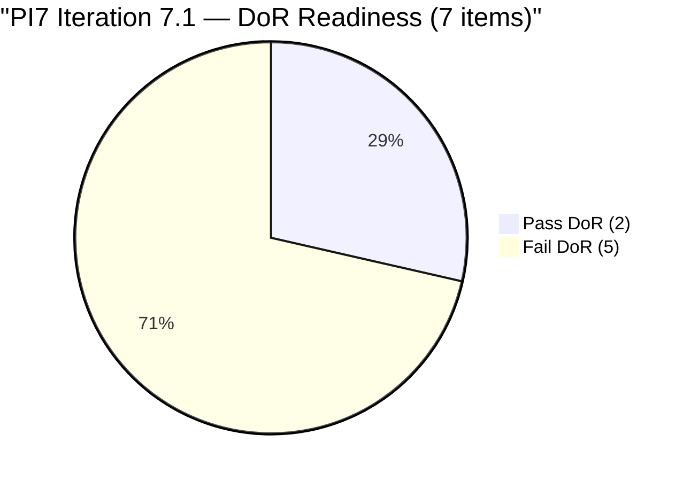
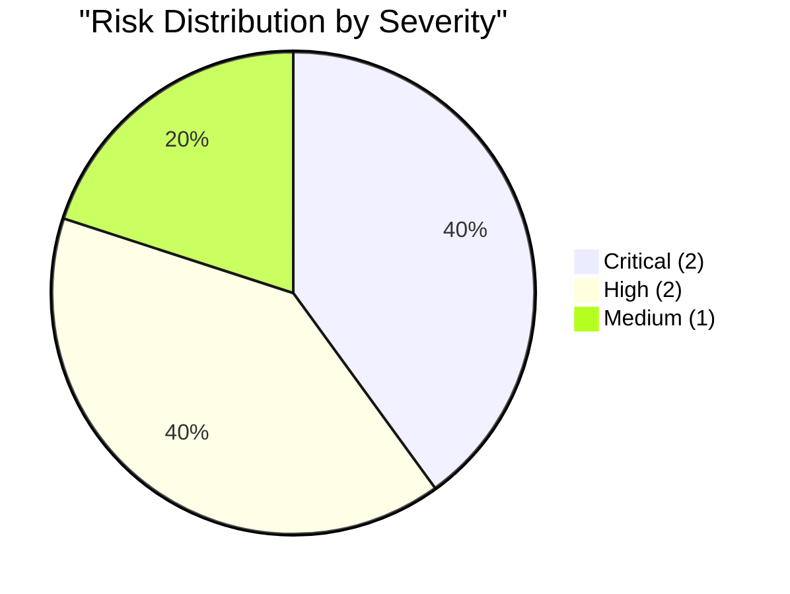

# SAFe Audit Report �� Administration Team

## Jairosoft FINOPS Azure DevOps Project

---

## 1. Audit Metadata

| Field | Value |
|-------|-------|
| **Project** | Jairosoft FINOPS |
| **Project ID** | e0bb302f-40f9-46c3-8164-6f1acb317d63 |
| **Team** | Administration Team |
| **Team ID** | a38a9c02-07ab-483d-a1e3-aff54e19e603 |
| **Backlog** | Stories and Deliverables (`Microsoft.RequirementCategory`) |
| **Board URL** | [Administration Team Board](https://dev.azure.com/jairo/Jairosoft%20FINOPS/_boards/board/t/Administration%20Team/Stories%20and%20Deliverables) |
| **Workspace Folder** | `ado_admin` |
| **Current Iteration** | Iteration 6.6 (IP) |
| **Iteration Path** | `Jairosoft FINOPS\2026-PI6\Iteration 6.6 (IP)` |
| **Iteration Start** | March 23, 2026 |
| **Iteration Finish** | April 5, 2026 |
| **Audit Date** | April 5, 2026 — 09:00 PHT |
| **Audit Day** | Day 14 of 14 (100% elapsed — final day) |
| **Previous Audit** | AUDIT_20260404_0900.md (Apr 4, 2026 09:00 PHT — Audit #22) |
| **Overall Score** | **22.9 / 100** |
| **Risk Band** | **Critical Risk** |
| **Audit Series** | #23 |
| **Framework** | SAFe 6.0 |
| **Rubric** | ADO SAFe v1 (seven-dimension deterministic scoring) |

**Audit Boundary:** This audit covers only the Administration Team's Stories and Deliverables backlog in the Jairosoft FINOPS ADO project. No other teams, boards, projects, or repositories were analyzed.

---

## 2. Executive Summary

This is the **twenty-third audit in the series** and the **final audit of Iteration 6.6 (IP)**. Since Audit #22 (Apr 4 at 09:00 PHT):

- **One new backlog item added:** #202297 "Government (EGOV) payables" (4 SP, New, Iteration 7.1) — backlog grows from 14 to 15
- **Three items updated:** #200995 title refined, #201984 renamed and SP increased 1->4, #201992 renamed and SP increased 1->4
- **Sprint remains empty** — zero items in Iteration 6.6 (IP); the IP sprint closes today with zero delivered SP
- PI 6 formally ends today. PI 7 starts tomorrow (April 6) with Iteration 7.1

**Score: 22.9 (was 26.7 under 6-dim rubric) — Critical Risk.** The decrease is due to the transition to 7-dimension rubric (dividing by 7 instead of 6) and the new Delivery Predictability dimension scoring 0.0 for the empty sprint.

---

## 3. Previous Audit Delta

**Previous:** AUDIT_20260404_0900 — Iteration 6.6 (IP) Day 13, Audit #22

| Metric | Audit #22 (6-dim) | **Audit #23 (7-dim)** | Delta |
|--------|-------|---------------|-------|
| Visible Backlog | 14 | **15** | +1 |
| Items in Iteration 6.6 | 0 | **0** | 0 |
| SP in Iteration 6.6 | 0 | **0** | 0 |
| Capacity (h/day) | 5 | **5** | 0 |
| Iteration Planning | 0.0 | **0.0** | 0.0 |
| Team Capacity | 0.0 | **0.0** | 0.0 |
| Estimation | 0.0 | **0.0** | 0.0 |
| DoR Compliance | 0.0 | **0.0** | 0.0 |
| Work Item Balance | 60.0 | **60.0** | 0.0 |
| Backlog Refinement | 100.0 | **100.0** | 0.0 |
| Delivery Predictability | N/A | **0.0** | New dim |
| **Overall** | **26.7** (6-dim) | **22.9** (7-dim) | **-3.8** |
| Risk Band | Critical Risk | **Critical Risk** | No change |

**Note:** The -3.8 delta is primarily a rubric change (7 dimensions vs 6), not a board deterioration.

---

## 4. Current Iteration Snapshot

### 4.1 Iteration 6.6 (IP) — Assigned Work Items (0 Items)

**The sprint closes today with zero items.** All items were evacuated to Iteration 7.1 or remain at project root.

### 4.2 Items in Iteration 7.1 (7 Items)

| ID | Title | SP | State | Changed | DoR |
|----|-------|----|-------|---------|-----|
| 200613 | BFP certification renewal follow up | 1 | New | Apr 1 | PASS |
| 200995 | Budget request for corrugated sheet | 2 | New | Apr 6 | FAIL (no Desc/AC) |
| 201835 | Vendor Selection & Procurement | 2 | New | Apr 2 | PASS |
| 201856 | Signage Canvass Approval | 2 | New | Apr 1 | FAIL (no Desc/AC) |
| 201984 | Utilities payables for Cebu and Davao | 4 | New | Apr 6 | FAIL (AC: "Attached receipt") |
| 201992 | Payables - Internet for Davao and Cebu office | 4 | New | Apr 6 | FAIL (AC: "Atrached receipt" — typo) |
| 202297 | Government (EGOV) payables | 4 | New | Apr 6 | FAIL (no Desc/AC) |

### 4.3 Items at Project Root (8 Items)

| ID | Title | SP | State | Changed |
|----|-------|----|-------|---------|
| 192221 | Purchase additional Corrugated Sheet and installation Day 1 | 2 | New | Mar 30 |
| 193412 | Implementation of aircon repair 2nd floor | 2 | New | Mar 30 |
| 197115 | Implementation of installing jockey pump | 4 | New | Mar 30 |
| 197111 | Recanvass for Jockey pump materials needed | 1 | New | Mar 30 |
| 197023 | Installation of corrugated sheet at Fire Exit | 3 | New | Mar 30 |
| 197029 | Implementation of Parking with roof for 2 vehicles (Day 1) | 3 | New | Mar 30 |
| 197028 | Purchase materials at Houseman Hardware | 1 | New | Mar 30 |
| 197113 | Purchase materials for Jockey pump | 1 | New | Mar 30 |

### 4.4 Team Capacity

| Member | Deployment | Documentation | Requirements | Total/Day |
|--------|-----------|---------------|-------------|-----------|
| Mark Colina | 1 h/day | 2 h/day | 2 h/day | **5 h/day** |

---

## 5. Work Item Analysis

### 5.1 Backlog Composition (15 Items)

| Location | Count | SP |
|----------|-------|-----|
| Project Root (unassigned) | 8 | 17 |
| Iteration 7.1 | 7 | 19 |
| **Iteration 6.6 (IP)** | **0** | **0** |
| **Total** | **15** | **36** |

### 5.2 PI7 Readiness — DoR Assessment

| Pass/Fail | Count | Items |
|-----------|-------|-------|
| **PASS** | 2 | #200613, #201835 |
| **FAIL** | 5 | #200995, #201856, #201984, #201992, #202297 |

**PI7 DoR readiness: 28.6% (2/7).** Down from 33.3% due to the new item failing DoR.



---

## 6. SAFe Compliance Scorecard

| # | Dimension | Score | Formula | Evidence | Notes |
|---|-----------|-------|---------|----------|-------|
| 1 | Iteration Planning | **0.0** | 0/15 x 100 | 0 of 15 in Iter 6.6 | Sprint fully evacuated |
| 2 | Team Capacity | **0.0** | 0/0 (undefined) | No contributors with current work | Mark has 5h/day but 0 sprint items |
| 3 | Estimation | **0.0** | 0/0 (undefined) | No point-eligible items in sprint | All items moved to PI7/root |
| 4 | DoR Compliance | **0.0** | 0/0 (undefined) | No current items to evaluate | Sprint empty |
| 5 | Work Item Balance | **60.0** | 100 - 40 | No User Stories in sprint | -40 penalty for missing User Story |
| 6 | Backlog Refinement | **100.0** | 15/15 fresh; no penalties | All items changed within 45 days | No stale items |
| 7 | Delivery Predictability | **0.0** | 0/0 (undefined) | No committed SP in sprint | Empty sprint |
| | **Overall** | **22.9** | 160.0 / 7 | | **Critical Risk (< 40)** |

### Score Computation

```
--- Iteration Planning ---
current_iteration_root_items = 0
visible_root_backlog_items = 15
Score = round(0/15 x 100, 1) = 0.0

--- Team Capacity ---
contributors_with_current_work = 0 (no items in sprint)
Score = 0 => 0.0

--- Estimation ---
point_eligible_current_items = 0
Score = 0/0 => 0.0

--- DoR Compliance ---
current_iteration_root_items = 0
Score = 0/0 => 0.0

--- Work Item Balance ---
No User Story in sprint => -40
Score = 100 - 40 = 60.0

--- Backlog Refinement ---
Reference date: 2026-04-05
45-day cutoff: 2026-02-19
All 15 items changed within 45 days (Mar 30 - Apr 6)
fresh = 15/15 = 100.0% => base = 100.0
stale_90 = 0, stale_180 = 0, untouched_current = 0/0
Score = 100.0

--- Delivery Predictability ---
committed_story_points = 0 (no estimated items in 6.6)
closed_story_points = 0
Score = 0/0 => 0.0

--- Overall ---
(0.0 + 0.0 + 0.0 + 0.0 + 60.0 + 100.0 + 0.0) / 7 = 160.0 / 7 = 22.9
Risk Band: Critical Risk (< 40)
```

---

## 7. Dimension Findings

### 7.1 Iteration Planning (0.0/100) — CRITICAL

Zero of 15 backlog items in the current iteration. The IP sprint was fully evacuated and closes today with no delivery. Expected for PI boundary + Holy Week.

### 7.2 Team Capacity (0.0/100) — CRITICAL

Mark has 5 h/day capacity configured but zero sprint items. Formula yields 0/0, scored as 0.0.

### 7.3 Estimation (0.0/100) — CRITICAL

No point-eligible items in the current sprint. Notable: #201984 and #201992 SP increased to 4 each, reflecting expanded PI7 scope.

### 7.4 DoR Compliance (0.0/100) — CRITICAL

No items in sprint to evaluate. PI7 items carry forward DoR gaps: 5 of 7 fail.

### 7.5 Work Item Balance (60.0/100) — MODERATE

With zero items, no User Story type is present, triggering -40.

### 7.6 Backlog Refinement (100.0/100) ��� EXCELLENT

All 15 items touched within 45 days. Active PI7 preparation evident from Apr 6 updates.

### 7.7 Delivery Predictability (0.0/100) ��� CRITICAL

No committed SP in the current iteration. Empty sprint = 0. This is structural (IP sprint evacuation), not a delivery failure.

---

## 8. Risks and Bottlenecks



### CRITICAL: PI 6 Closes with Zero Delivery in IP Sprint

The IP sprint ends today with zero items and zero SP delivered. However, this reflects deliberate PI boundary management during Holy Week.

### CRITICAL: PI7 Starts with 28.6% DoR Compliance

5 of 7 items in Iteration 7.1 fail DoR. Three have zero content (#200995, #201856, #202297). Two have weak AC (#201984, #201992). PI7 starts tomorrow with poor readiness.

### HIGH: Typo "Atrached receipt" in #201992 Persists (8+ audits)

Still uncorrected. Now with increased SP (4).

### HIGH: Single Contributor Risk (Mark Colina)

Bus factor = 1. Flagged in all 23 audits.

### MEDIUM: 8 Root Items Unassigned to Any Sprint

17 SP of facility/construction work sits at project root with no sprint assignment.

---

## 9. Prioritized Recommendations

| Priority | Action | Owner | Target |
|----------|--------|-------|--------|
| 1 | Fix DoR on 5 failing PI7 items | Mark / Ramon | Before Apr 6 |
| 2 | Assign root items to PI7 iterations | Ramon | PI7 Planning |
| 3 | Fix typo "Atrached" in #201992 | Mark | Anytime |
| 4 | Evaluate Mark's capacity vs 36 SP backlog | Ramon | PI7 Planning |

---

## 10. Evidence Gaps and Limitations

| Gap | Impact | Notes |
|-----|--------|-------|
| Sprint fully evacuated | 5 dimensions score 0 | Structural IP boundary |
| 0/0 division in 4 dimensions | Scored as 0 by convention | No sprint activity |
| 5/7 PI7 items fail DoR | PI7 starts with low readiness | Remediation needed |
| Rubric transition 6-dim to 7-dim | Overall drops 26.7 -> 22.9 | Not a board change |
| "Attached receipt" AC pattern | 2 items weak DoR | Carried from PI6 |

---

*Report generated: April 5, 2026 09:00 PHT*
*Auditor: AI EngProd Consultant (SAFe 6.0)*
*Rubric: ADO SAFe v1 (seven-dimension deterministic scoring)*
*Audit #23 | Iteration 6.6 (IP) Day 14 of 14 (FINAL) | Score: 22.9/100 (Critical Risk)*
*Previous: AUDIT_20260404_0900 (26.7/100 — Critical Risk, 6-dim)*
*Delta: -3.8 (rubric transition 6->7 dim; +1 backlog item; PI7 preparation active)*
