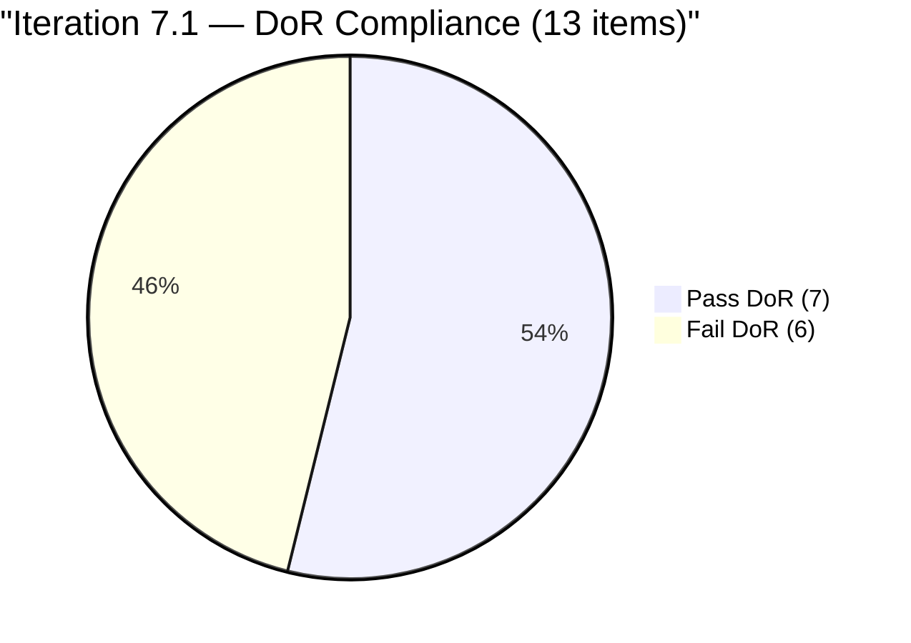
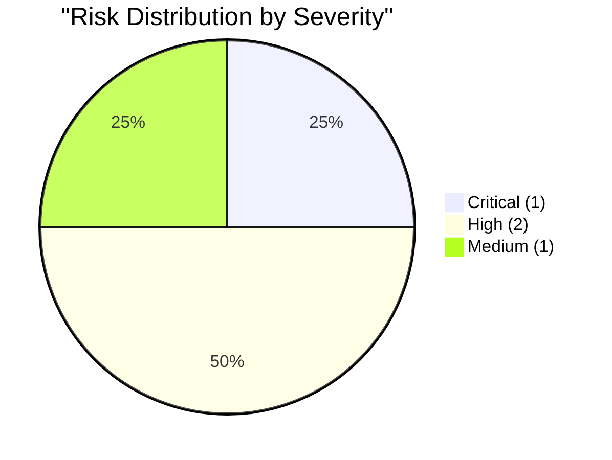

# SAFe Audit Report — Administration Team

## Jairosoft FINOPS Azure DevOps Project

---

## 1. Audit Metadata

| Field | Value |
|-------|-------|
| **Project** | Jairosoft FINOPS |
| **Project ID** | e0bb302f-40f9-46c3-8164-6f1acb317d63 |
| **Team** | Administration Team |
| **Team ID** | a38a9c02-07ab-483d-a1e3-aff54e19e603 |
| **Backlog** | Stories and Deliverables (`Microsoft.RequirementCategory`) |
| **Board URL** | [Administration Team Board](https://dev.azure.com/jairo/Jairosoft%20FINOPS/_boards/board/t/Administration%20Team/Stories%20and%20Deliverables) |
| **Workspace Folder** | `ado_admin` |
| **Current Iteration** | Iteration 7.1 |
| **Iteration Path** | `Jairosoft FINOPS\2026-PI7\Iteration 7.1` |
| **Iteration Start** | April 6, 2026 |
| **Iteration Finish** | April 19, 2026 |
| **Audit Date** | April 6, 2026 — 09:00 PHT |
| **Audit Day** | Day 1 of 14 (7% elapsed) |
| **Previous Audit** | AUDIT_20260405_0900.md (Apr 5, 2026 09:00 PHT — Audit #23) |
| **Overall Score** | **68.3 / 100** |
| **Risk Band** | **Moderate Risk** |
| **Audit Series** | #24 |
| **Framework** | SAFe 6.0 |
| **Rubric** | ADO SAFe v1 (seven-dimension deterministic scoring) |

**Audit Boundary:** This audit covers only the Administration Team's Stories and Deliverables backlog in the Jairosoft FINOPS ADO project. No other teams, boards, projects, or repositories were analyzed.

---

## 2. Executive Summary

This is the **twenty-fourth audit in the series** and the **first audit of PI 7 / Iteration 7.1**. Since Audit #23 (Apr 5, final day of Iteration 6.6 IP):

### Key Changes

1. **PI 7 begins today** — Iteration 7.1 (Apr 6 - Apr 19) is the new active iteration
2. **Backlog grew from 15 to 21 items (+6 new items):**
   - #202353 JIT BFP certificate renewal 2026 (3 SP, Active)
   - #202357 Fixation in rooftop Davao (5 SP, Requirements Gathering)
   - #202364 DOLE WAIR report (1 SP, Requirements Gathering)
   - #202366 Philgeps renewal for 2026 (3 SP, Requirements Gathering)
   - #202370 Toyota Hilux Cebu (no SP, Requirements Gathering)
   - #202376 Condo dues Cebu (2 SP, Requirements Gathering)
3. **13 items now assigned to Iteration 7.1** (was 0 in 6.6 IP)
4. **Score jumps from 22.9 to 68.3 (+45.4)** — sprint is populated, capacity aligned, estimation nearly complete

**This is the highest score the Administration Team has achieved in the audit series.** The PI 7 planning effort has significantly improved sprint hygiene.

---

## 3. Previous Audit Delta

**Previous:** AUDIT_20260405_0900 — Iteration 6.6 (IP) Day 14 (FINAL), Audit #23

| Metric | Audit #23 (6.6 IP) | **Audit #24 (7.1)** | Delta |
|--------|---------------------|---------------------|-------|
| Visible Backlog | 15 | **21** | +6 |
| Items in Current Iter | 0 | **13** | +13 |
| SP in Current Iter | 0 | **33** | +33 |
| Capacity (h/day) | 5 | **5** | 0 |
| Iteration Planning | 0.0 | **61.9** | +61.9 |
| Team Capacity | 0.0 | **100.0** | +100.0 |
| Estimation | 0.0 | **92.3** | +92.3 |
| DoR Compliance | 0.0 | **53.8** | +53.8 |
| Work Item Balance | 60.0 | **70.0** | +10.0 |
| Backlog Refinement | 100.0 | **100.0** | 0.0 |
| Delivery Predictability | 0.0 | **0.0** | 0.0 |
| **Overall** | **22.9** | **68.3** | **+45.4** |
| Risk Band | Critical Risk | **Moderate Risk** | Upgrade |

---

## 4. Current Iteration Snapshot

### 4.1 Iteration 7.1 — Work Items (13 Items, 33 SP)

| ID | Title | SP | State | Changed | DoR |
|----|-------|----|-------|---------|-----|
| 200613 | BFP certification renewal follow up | 1 | Ready | Apr 7 | PASS |
| 200995 | Budget request for corrugated sheet | 2 | Req Gathering | Apr 7 | PASS |
| 201835 | Vendor Selection & Procurement | 2 | Req Gathering | Apr 7 | PASS |
| 201856 | Signage Canvass Approval | 2 | Req Gathering | Apr 7 | FAIL (no Desc/AC) |
| 201984 | Utilities payables for Cebu and Davao | 4 | Ready | Apr 7 | PASS |
| 201992 | Payables - Internet for Davao and Cebu | 4 | Ready | Apr 7 | PASS |
| 202297 | Government (EGOV) payables | 4 | Req Gathering | Apr 7 | PASS |
| 202353 | JIT BFP certificate renewal 2026 | 3 | Active | Apr 7 | PASS |
| 202357 | Fixation in rooftop (Davao) | 5 | Req Gathering | Apr 7 | FAIL (no Desc/AC) |
| 202364 | DOLE WAIR report | 1 | Req Gathering | Apr 7 | FAIL (no Desc/AC) |
| 202366 | Philgeps renewal for 2026 | 3 | Req Gathering | Apr 7 | FAIL (no Desc/AC) |
| 202370 | Toyota Hilux (Cebu) | -- | Req Gathering | Apr 7 | FAIL (no SP, no Desc/AC) |
| 202376 | Condo dues (Cebu) | 2 | Req Gathering | Apr 7 | FAIL (no Desc/AC) |

### 4.2 Items at Project Root (8 Items, 17 SP)

| ID | Title | SP | State | Changed |
|----|-------|----|-------|---------|
| 192221 | Purchase additional Corrugated Sheet and installation Day 1 | 2 | New | Mar 30 |
| 193412 | Implementation of aircon repair 2nd floor | 2 | New | Mar 30 |
| 197115 | Implementation of installing jockey pump | 4 | New | Mar 30 |
| 197111 | Recanvass for Jockey pump materials needed | 1 | New | Mar 30 |
| 197023 | Installation of corrugated sheet at Fire Exit | 3 | New | Mar 30 |
| 197029 | Implementation of Parking with roof for 2 vehicles (Day 1) | 3 | New | Mar 30 |
| 197028 | Purchase materials at Houseman Hardware | 1 | New | Mar 30 |
| 197113 | Purchase materials for Jockey pump | 1 | New | Mar 30 |

### 4.3 Team Capacity

| Member | Deployment | Documentation | Requirements | Total/Day |
|--------|-----------|---------------|-------------|-----------|
| Mark Colina | 1 h/day | 2 h/day | 2 h/day | **5 h/day** |

---

## 5. Work Item Analysis

### 5.1 Backlog Composition (21 Items)

| Location | Count | SP |
|----------|-------|-----|
| Iteration 7.1 | 13 | 33 |
| Project Root (unassigned) | 8 | 17 |
| **Total** | **21** | **50** |

### 5.2 Sprint DoR Assessment (13 Items)

| Pass/Fail | Count | Items |
|-----------|-------|-------|
| **PASS** | 7 | #200613, #200995, #201835, #201984, #201992, #202297, #202353 |
| **FAIL** | 6 | #201856, #202357, #202364, #202366, #202370, #202376 |

**Sprint DoR readiness: 53.8% (7/13).** Six items lack Description and/or Acceptance Criteria.



---

## 6. SAFe Compliance Scorecard

| # | Dimension | Score | Formula | Evidence | Notes |
|---|-----------|-------|---------|----------|-------|
| 1 | Iteration Planning | **61.9** | 13/21 x 100 | 13 of 21 in Iter 7.1 | Strong PI7 commitment |
| 2 | Team Capacity | **100.0** | 1/1 x 100 | Mark: 5 h/day, sole contributor | Stable |
| 3 | Estimation | **92.3** | 12/13 x 100 | 12 of 13 have SP > 0 | #202370 missing SP |
| 4 | DoR Compliance | **53.8** | 7/13 x 100 | 7 pass Desc >= 30 AND AC >= 20 | 6 items lack content |
| 5 | Work Item Balance | **70.0** | 100 - 30 | 100% User Story; dominant > 60% | -30 penalty |
| 6 | Backlog Refinement | **100.0** | 21/21 fresh; no penalties | All items changed within 45 days | No stale items |
| 7 | Delivery Predictability | **0.0** | 0/33 x 100 | Day 1 — no closures yet | Early-sprint — low delivery expected |
| | **Overall** | **68.3** | 478.0 / 7 | | **Moderate Risk (60-79.9)** |

### Score Computation

```
--- Iteration Planning ---
visible_root_backlog_items = 21
current_iteration_root_items = 13
Score = round(13/21 x 100, 1) = 61.9

--- Team Capacity ---
contributors_with_current_work = 1 (Mark Colina — assigned to all 13 items)
contributors_with_capacity = 1 (Mark: 5 h/day)
Score = round(1/1 x 100, 1) = 100.0

--- Estimation ---
point_eligible_current_items = 13 (all User Stories expose SP field)
estimated_current_items = 12 (#202370 Toyota Hilux has no SP)
SP values: 1+2+2+2+4+4+4+3+5+1+3+2 = 33
Score = round(12/13 x 100, 1) = 92.3

--- DoR Compliance ---
current_iteration_root_items = 13
dor_compliant (Desc >= 30 nws AND AC >= 20 nws):
  PASS: 200613, 200995, 201835, 201984, 201992, 202297, 202353 = 7
  FAIL: 201856 (no Desc/AC), 202357 (no Desc/AC), 202364 (no Desc/AC),
        202366 (no Desc/AC), 202370 (no Desc/AC), 202376 (no Desc/AC) = 6
Score = round(7/13 x 100, 1) = 53.8

--- Work Item Balance ---
All 13 items are User Story
has User Story => no -40
dominant_type_share = 100% > 60% => -30
spike_share = 0% => no -20
Score = 100 - 30 = 70.0

--- Backlog Refinement ---
Reference date: 2026-04-06
45-day cutoff: 2026-02-20
90-day cutoff: 2026-01-06
180-day cutoff: 2025-10-09

All 21 items:
  Iter 7.1 (13 items): All changed Apr 6-7 = fresh
  Root (8 items): All changed Mar 30 = fresh
fresh_visible_root_items = 21 => base = round(21/21 x 100, 1) = 100.0
stale_90 = 0; stale_180 = 0 => no penalties
untouched_current: 0/13 (all changed Apr 6-7 >= iter start Apr 6)
Score = 100.0

--- Delivery Predictability ---
committed_story_points = 33 (12 estimated items)
closed_story_points = 0 (Day 1, no items Closed/Done)
Score = round(0/33 x 100, 1) = 0.0
Early-sprint: Day 1 of 14

--- Overall ---
(61.9 + 100.0 + 92.3 + 53.8 + 70.0 + 100.0 + 0.0) / 7 = 478.0 / 7 = 68.3
Risk Band: Moderate Risk (60-79.9)
```

---

## 7. Dimension Findings

### 7.1 Iteration Planning (61.9/100) — MODERATE

13 of 21 backlog items assigned to Iteration 7.1. The 8 unassigned items are facility/construction work from PI 6 sitting at project root. This is the strongest Iteration Planning score in the 24-audit series — up from 0.0 (empty IP sprint).

### 7.2 Team Capacity (100.0/100) — EXCELLENT

Mark Colina at 5 h/day across Deployment (1h), Documentation (2h), Requirements (2h). All sprint items assigned to Mark, the sole contributor with capacity.

### 7.3 Estimation (92.3/100) — LOW RISK

12 of 13 items estimated. Only #202370 (Toyota Hilux Cebu) missing Story Points. Total committed: 33 SP.

### 7.4 DoR Compliance (53.8/100) — HIGH

7 of 13 items pass DoR. Six items (#201856, #202357, #202364, #202366, #202370, #202376) lack Description and/or Acceptance Criteria entirely. These are all newly created items that entered the sprint without documentation.

### 7.5 Work Item Balance (70.0/100) — MODERATE

100% User Stories in the sprint. The -30 penalty applies for dominant type share > 60%. No Spikes or Defects present — reasonable for an administrative team but the rubric penalizes type concentration.

### 7.6 Backlog Refinement (100.0/100) — EXCELLENT

All 21 items have been touched within 45 days. No stale items at 90 or 180 days. Active PI 7 preparation is evident from the Apr 6-7 updates across the backlog.

### 7.7 Delivery Predictability (0.0/100) — CRITICAL (Expected)

Day 1 of a 14-day sprint. Zero items closed. **Early-sprint — low delivery expected.** This dimension will naturally improve as items progress through the sprint.

---

## 8. Risks and Bottlenecks



### CRITICAL: 6 Sprint Items Fail DoR on Day 1

Six of 13 sprint items lack Description and/or Acceptance Criteria. These items entered the sprint without proper documentation, violating SAFe Definition of Ready practices. This represents 46% of sprint content.

### HIGH: Single Contributor Risk (Mark Colina)

Bus factor = 1. Mark is assigned all 21 backlog items and carries 33 SP commitment for Iteration 7.1. Flagged in all 24 audits.

### HIGH: 33 SP Commitment for Single Contributor

33 SP committed for a single team member with 5 h/day capacity (70 total hours over 14 days). Historical delivery: Iteration 6.5 committed 31 SP, delivered 19 (61.3%). Risk of over-commitment.

### MEDIUM: 8 Root Items Unassigned to Any Sprint

17 SP of facility/construction work sits at project root with no sprint assignment. These should be triaged into PI 7 iterations or closed.

---

## 9. Prioritized Recommendations

| Priority | Action | Owner | Target |
|----------|--------|-------|--------|
| 1 | Add Description and AC to 6 failing DoR items (#201856, #202357, #202364, #202366, #202370, #202376) | Mark / Ramon | Day 1-2 |
| 2 | Add Story Points to #202370 (Toyota Hilux Cebu) | Mark | Day 1 |
| 3 | Triage 8 root items into PI7 iterations or close | Ramon | Week 1 |
| 4 | Evaluate 33 SP commitment against Mark's historical velocity (19 SP delivered in 6.5) | Ramon | PI7 Planning |

---

## 10. Evidence Gaps and Limitations

| Gap | Impact | Notes |
|-----|--------|-------|
| Day 1 of sprint | Delivery Predictability = 0.0 | Expected; will improve |
| 6 items lack Desc/AC | DoR Compliance at 53.8% | Newly created items need content |
| 1 item missing SP | Estimation at 92.3% | #202370 needs estimate |
| Single contributor | Bus factor = 1 | Structural limitation |
| Over-commitment risk | 33 SP vs historical 19 SP delivered | Monitor mid-sprint |

---

*Report generated: April 6, 2026 09:00 PHT*
*Auditor: AI EngProd Consultant (SAFe 6.0)*
*Rubric: ADO SAFe v1 (seven-dimension deterministic scoring)*
*Audit #24 | Iteration 7.1 Day 1 of 14 | Score: 68.3/100 (Moderate Risk)*
*Previous: AUDIT_20260405_0900 (22.9/100 — Critical Risk)*
*Delta: +45.4 — PI7 starts with populated sprint; 13 items committed; 6 new backlog items added*
