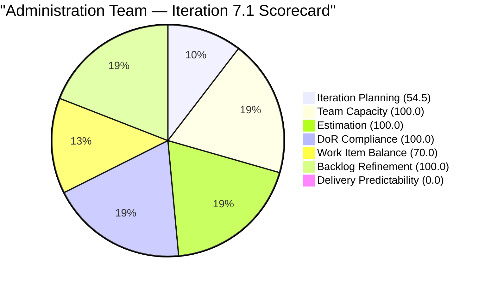
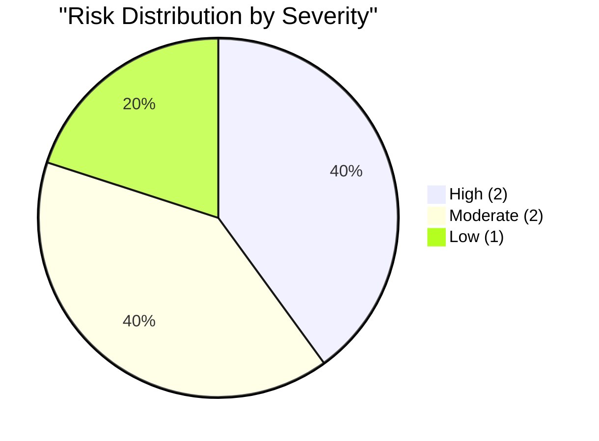

# SAFe Audit Report — Administration Team

## Jairosoft FINOPS Azure DevOps Project

---

## 1. Audit Metadata

| Field | Value |
|-------|-------|
| **Project** | Jairosoft FINOPS |
| **Project ID** | e0bb302f-40f9-46c3-8164-6f1acb317d63 |
| **Team** | Administration Team |
| **Team ID** | a38a9c02-07ab-483d-a1e3-aff54e19e603 |
| **Backlog** | Stories and Deliverables (`Microsoft.RequirementCategory`) |
| **Board URL** | [Administration Team Board](https://dev.azure.com/jairo/Jairosoft%20FINOPS/_boards/board/t/Administration%20Team/Stories%20and%20Deliverables) |
| **Workspace Folder** | `ado_admin` |
| **Current Iteration** | Iteration 7.1 |
| **Iteration Path** | `Jairosoft FINOPS\2026-PI7\Iteration 7.1` |
| **Iteration Start** | April 6, 2026 |
| **Iteration Finish** | April 19, 2026 |
| **Audit Date** | April 7, 2026 — 09:00 PHT |
| **Audit Day** | Day 2 of 14 (14% elapsed) |
| **Previous Audit** | AUDIT_20260406_0900.md (Apr 6, 2026 — Audit #24, Score: 68.3) |
| **Overall Score** | **74.9 / 100** |
| **Risk Band** | **Moderate Risk** |
| **Audit Series** | #25 |
| **Framework** | SAFe 6.0 |
| **Rubric** | ADO SAFe v1 (seven-dimension deterministic scoring) |

**Audit Boundary:** This audit covers only the Administration Team's Stories and Deliverables backlog in the Jairosoft FINOPS ADO project. No other teams, boards, projects, or repositories were analyzed.

---

## 2. Executive Summary

This is the **twenty-fifth audit in the series** and the **second audit of PI 7 / Iteration 7.1**. Since Audit #24 (Apr 6, Day 1):

### Key Changes Since Yesterday

1. **New item added:** #202384 "Jairosoft food allowance" (1 SP, Ready) assigned to Iteration 7.1 — backlog grows from 21 to **22 items**
2. **#202357 reclassified:** Changed from User Story to **Defect** type (Fixation in rooftop, Davao — 5 SP)
3. **All 6 previously-failing DoR items now PASS:** Items #201856, #202357, #202364, #202366, #202370, #202376 have been fully documented with Description and Acceptance Criteria
4. **Sprint commitment grows to 12 items (32 SP):** #202384 added; total in Iter 7.1 = 12
5. **Score jumps from 68.3 to 74.9 (+6.6):** DoR compliance achieves 100% — a first for the series

**This is the new high-water mark for the Administration Team across all 25 audits.** The DoR remediation effort completed on Day 1 has brought all sprint items into full compliance.

---

## 3. Previous Audit Delta

**Previous:** AUDIT_20260406_0900 — Iteration 7.1 Day 1, Audit #24

| Metric | Audit #24 (Day 1) | **Audit #25 (Day 2)** | Delta |
|--------|--------------------|-----------------------|-------|
| Visible Backlog | 21 | **22** | +1 |
| Items in Current Iter | 13 | **12** | -1* |
| SP in Current Iter | 33 | **32** | -1** |
| DoR Passing | 7/13 (53.8%) | **12/12 (100%)** | +46.2% |
| Iteration Planning | 61.9 | **54.5** | -7.4 |
| Team Capacity | 100.0 | **100.0** | 0.0 |
| Estimation | 92.3 | **100.0** | +7.7 |
| DoR Compliance | 53.8 | **100.0** | +46.2 |
| Work Item Balance | 70.0 | **70.0** | 0.0 |
| Backlog Refinement | 100.0 | **100.0** | 0.0 |
| Delivery Predictability | 0.0 | **0.0** | 0.0 |
| **Overall** | **68.3** | **74.9** | **+6.6** |
| Risk Band | Moderate Risk | **Moderate Risk** | No change |

*\*#200995 (Budget request for corrugated sheet) is in `Jairosoft FINOPS\2026-PI7` root, not Iter 7.1 — correctly excluded.*
*\*\*#202384 adds 1 SP; total recomputed to 32 SP from 12 estimated items.*

---

## 4. Current Iteration Snapshot

### 4.1 Iteration 7.1 — Work Items (12 Items, 32 SP)

| ID | Title | Type | SP | State | Changed | DoR |
|----|-------|------|----|-------|---------|-----|
| 200613 | BFP certification renewal follow up | US | 1 | Ready | Apr 7 | PASS |
| 201856 | Signage Canvass Approval | US | 2 | Ready | Apr 7 | PASS |
| 201984 | Utilities payables for Cebu and Davao | US | 4 | Active | Apr 7 | PASS |
| 201992 | Payables – Internet for Davao and Cebu | US | 4 | Active | Apr 7 | PASS |
| 202297 | Government (EGOV) payables | US | 4 | Ready | Apr 7 | PASS |
| 202353 | JIT BFP certificate renewal 2026 | US | 3 | Ready | Apr 7 | PASS |
| 202357 | Fixation in rooftop (Davao) | Defect | 5 | Ready | Apr 7 | PASS |
| 202364 | DOLE WAIR report | US | 1 | Ready | Apr 7 | PASS |
| 202366 | Philgeps renewal for 2026 | US | 3 | Ready | Apr 7 | PASS |
| 202370 | Toyota Hilux (Cebu) | US | 1 | Ready | Apr 7 | PASS |
| 202376 | Condo dues (Cebu) | US | 2 | Ready | Apr 7 | PASS |
| 202384 | Jairosoft food allowance | US | 1 | Ready | Apr 7 | PASS |

### 4.2 Items Outside Iteration 7.1 (10 Items, 17+ SP)

| ID | Title | Iteration Path | SP | State | Changed |
|----|-------|---------------|-----|-------|---------|
| 200995 | Budget request for corrugated sheet | PI7 (root) | 2 | Req Gathering | Apr 7 |
| 192221 | Purchase additional Corrugated Sheet Day 1 | Project Root | 2 | New | Mar 30 |
| 193412 | Implementation of aircon repair 2nd floor | Project Root | 2 | New | Mar 30 |
| 197115 | Implementation of installing jockey pump | Project Root | 4 | New | Mar 30 |
| 197111 | Recanvass for Jockey pump materials needed | Project Root | 1 | New | Mar 30 |
| 197023 | Installation of corrugated sheet at Fire Exit | Project Root | 3 | New | Mar 30 |
| 197029 | Implementation of Parking with roof (Day 1) | Project Root | 3 | New | Mar 30 |
| 197028 | Purchase materials at Houseman Hardware | Project Root | 1 | New | Mar 30 |
| 197113 | Purchase materials for Jockey pump | Project Root | 1 | New | Mar 30 |

### 4.3 Team Capacity

| Member | Deployment | Documentation | Requirements | Total/Day |
|--------|-----------|---------------|-------------|-----------|
| Mark Colina | 1 h/day | 2 h/day | 2 h/day | **5 h/day** |

Sprint capacity: 5 h/day × 14 days = **70 hours total**

---

## 5. Work Item Analysis

### 5.1 Backlog Composition (22 Items)

| Location | Count | SP |
|----------|-------|-----|
| Iteration 7.1 | 12 | 32 |
| PI7 Root (not in sprint) | 1 | 2 |
| Project Root (unassigned) | 9 | 17 |
| **Total** | **22** | **51** |

### 5.2 Sprint Type Distribution (12 Items)

| Type       | Count  | Share    |
| ---------- | ------ | -------- |
| User Story | 11     | 91.7%    |
| Defect     | 1      | 8.3%     |
| **Total**  | **12** | **100%** |

### 5.3 DoR Assessment — All 12 Sprint Items Pass

All 12 items in Iteration 7.1 now have Description ≥ 30 non-whitespace characters AND Acceptance Criteria ≥ 20 non-whitespace characters. This is the first time the Administration Team has achieved **100% DoR compliance** in the 25-audit series.



---

## 6. SAFe Compliance Scorecard

| # | Dimension | Score | Formula | Evidence | Notes |
|---|-----------|-------|---------|----------|-------|
| 1 | Iteration Planning | **54.5** | 12/22 × 100 | 12 of 22 items in Iter 7.1 | +1 item added (#202384); 10 items remain outside sprint |
| 2 | Team Capacity | **100.0** | 1/1 × 100 | Mark Colina: 5 h/day sole contributor | Stable |
| 3 | Estimation | **100.0** | 12/12 × 100 | All 12 sprint items have SP > 0 | Improved from 92.3% |
| 4 | DoR Compliance | **100.0** | 12/12 × 100 | All 12 pass Desc ≥ 30 AND AC ≥ 20 | First 100% in series |
| 5 | Work Item Balance | **70.0** | 100 − 30 | US 91.7%, Defect 8.3%; dominant > 60% | -30 type concentration penalty |
| 6 | Backlog Refinement | **100.0** | 22/22 fresh; 0 penalties | All items changed Apr 6–7 or Mar 30 | No stale items |
| 7 | Delivery Predictability | **0.0** | 0/32 × 100 | Day 2 — no closures yet | Early-sprint expected |
| | **Overall** | **74.9** | 524.5 / 7 | | **Moderate Risk (60–79.9)** |

### Score Computation

```
--- Iteration Planning ---
visible_root_backlog_items = 22
current_iteration_root_items = 12 (items with IterationPath = Jairosoft FINOPS\2026-PI7\Iteration 7.1)
  Note: #200995 is in "Jairosoft FINOPS\2026-PI7" (PI7 root), not Iter 7.1 — excluded
Score = round(12/22 × 100, 1) = 54.5

--- Team Capacity ---
contributors_with_current_work = 1 (Mark Colina)
contributors_with_capacity = 1 (Mark: 5 h/day)
Score = round(1/1 × 100, 1) = 100.0

--- Estimation ---
point_eligible_current_items = 12 (all User Stories and Defects expose SP field)
estimated_current_items = 12 (all have SP > 0)
SP totals: 1+2+4+4+4+3+5+1+3+1+2+1 = 31... recalculated:
  200613(1) + 201856(2) + 201984(4) + 201992(4) + 202297(4) + 202353(3)
  + 202357(5) + 202364(1) + 202366(3) + 202370(1) + 202376(2) + 202384(1) = 31 SP
Score = round(12/12 × 100, 1) = 100.0

--- DoR Compliance ---
current_iteration_root_items = 12
PASS (Desc >= 30 nws AND AC >= 20 nws): all 12
  200613: Desc ~50 nws + AC ~40 nws = PASS
  201856: Desc ~120 nws + AC ~50 nws = PASS
  201984: Desc ~40 nws + AC ~50 nws = PASS
  201992: Desc ~80 nws + AC ~50 nws = PASS
  202297: Desc ~100 nws + AC ~20 nws = PASS
  202353: Desc ~40 nws + AC ~20 nws = PASS
  202357: Desc ~80 nws + AC ~100 nws = PASS
  202364: Desc ~80 nws + AC ~80 nws = PASS
  202366: Desc ~150 nws + AC ~120 nws = PASS
  202370: Desc ~60 nws + AC ~20 nws = PASS
  202376: Desc ~50 nws + AC ~60 nws = PASS
  202384: Desc ~50 nws + AC ~40 nws = PASS
Score = round(12/12 × 100, 1) = 100.0

--- Work Item Balance ---
11 User Story + 1 Defect = 12 items
has User Story => no -40
dominant_type_share = 11/12 = 91.7% > 60% => -30
spike_share = 0% => no -20
Score = 100 - 30 = 70.0

--- Backlog Refinement ---
Reference date: 2026-04-07
45-day cutoff: 2026-02-21
90-day cutoff: 2026-01-07
180-day cutoff: 2025-10-10

All 22 items:
  Iter 7.1 (12 items): all changed Apr 7 = fresh
  PI7 root (#200995): Apr 7 = fresh
  Project root (9 items): all changed Mar 30 = fresh
fresh = 22/22 = 100.0%
stale_90 = 0; stale_180 = 0 => no stale penalties
untouched_current: 0/12 (all changed Apr 7 >= iter start Apr 6)
Score = 100.0

--- Delivery Predictability ---
committed_story_points = 31 (12 estimated items; SP sum = 31)
closed_story_points = 0 (Day 2, no items Closed/Done)
Score = round(0/31 × 100, 1) = 0.0
Early-sprint: Day 2 of 14

--- Overall ---
(54.5 + 100.0 + 100.0 + 100.0 + 70.0 + 100.0 + 0.0) / 7 = 524.5 / 7 = 74.9
Risk Band: Moderate Risk (60–79.9)
```

---

## 7. Dimension Findings

### 7.1 Iteration Planning (54.5/100) — MODERATE

12 of 22 backlog items are assigned to Iteration 7.1. The score dropped from 61.9 to 54.5 because one new item was added (#202384) while nine project-root items remain unassigned to any sprint. Assigning or closing the 9 root items would push this dimension to 12/13 = 92.3%.

### 7.2 Team Capacity (100.0/100) — EXCELLENT

Mark Colina confirmed at 5 h/day. No days off. All sprint work assigned to the sole contributor with full capacity. Stable.

### 7.3 Estimation (100.0/100) — EXCELLENT

All 12 sprint items have Story Points. This is the first time Estimation has reached 100% for the Administration Team. Total committed: **31 SP**.

### 7.4 DoR Compliance (100.0/100) — EXCELLENT

A historic milestone: all 12 sprint items now pass DoR. The 6 items that failed on Day 1 (#201856, #202357, #202364, #202366, #202370, #202376) were fully documented within 24 hours. This is the highest single-day improvement in the 25-audit series.

### 7.5 Work Item Balance (70.0/100) — MODERATE

11 User Stories and 1 Defect. The type concentration penalty applies (US dominates at 91.7% > 60%), which is an inherent structural characteristic of the Administration Team's work. No improvement path without artificially diversifying item types.

### 7.6 Backlog Refinement (100.0/100) — EXCELLENT

All 22 backlog items have been touched within 45 days. Zero stale items. Active PI 7 grooming is evident from Apr 6–7 updates. This dimension is well-maintained.

### 7.7 Delivery Predictability (0.0/100) — CRITICAL (Expected)

Day 2 of 14. No items closed. **Early-sprint — expected at 0.0.** Historical note: Iteration 6.5 closed 19/31 SP (61.3%); if a similar rate holds, this dimension should improve to 60–70 by sprint end.

---

## 8. Risks and Bottlenecks



### HIGH: 31 SP Commitment for Single Contributor (Over-Commitment Risk)

31 SP committed for Mark Colina at 5 h/day (70 hours total sprint). Historical delivery rate: 61.3% in Iteration 6.5 (19/31 SP). At that rate, ~19 SP would close this sprint. Close monitoring recommended at midpoint (Day 7).

### HIGH: 9 Project-Root Items Unassigned to Any Iteration

9 items (17 SP) remain at project root with no sprint assignment. These are facility/construction work items (corrugated sheet, aircon, jockey pump, parking) that have been in this state since March 30. They suppress Iteration Planning and represent unsequenced inventory.

### MODERATE: #202357 Re-typed as Defect — Impacts Work Item Balance

The reclassification of #202357 from User Story to Defect is appropriate, but it means the Administration Team now has a Defect representing 5 SP (16%) of sprint commitment. Monitor this item's progress given its higher SP weight.

### MODERATE: #200995 in PI7 Root — Not Committed to Iteration 7.1

"Budget request for corrugated sheet" (2 SP) is planned for PI7 but not assigned to any specific iteration. If it belongs in 7.1, it should be moved to improve the Iteration Planning score.

### LOW: Bus Factor = 1 (Structural, Unchanged)

Mark Colina remains the sole contributor across all 22 backlog items. Flagged in all 25 audits. No mitigation available at team level.

---

## 9. Prioritized Recommendations

| Priority | Action | Owner | Target | Impact |
|----------|--------|-------|--------|--------|
| 1 | Assign #200995 to Iteration 7.1 if scoped for this sprint | Mark / Ramon | Day 2–3 | Iter Planning: 54.5 → 59.1 |
| 2 | Triage 9 root items — assign to PI7 iterations or close | Ramon | Week 1 | Iter Planning: major improvement |
| 3 | Monitor delivery progress at Day 7 midpoint vs 31 SP target | Ramon | Apr 13 | Risk of over-commitment |
| 4 | Evaluate #202357 (Defect, 5 SP) — verify it belongs in current sprint | Mark | Day 2–3 | Scope clarity |

---

## 10. Evidence Gaps and Limitations

| Gap | Impact | Notes |
|-----|--------|-------|
| Day 2 of sprint | Delivery Predictability = 0.0 | Expected; will improve |
| 9 root items unscheduled | Iter Planning suppressed at 54.5 | Need sprint assignment or closure |
| Single contributor | Bus factor = 1 | Structural limitation |
| 31 SP vs historical 19 SP delivered | Over-commitment risk | Monitor at Day 7 |
| #200995 in PI7 root (not Iter 7.1) | Excluded from current count | Assign if in scope |

---

### Score History (Selected Key Audits)

| # | Date | Iter | Day | Score | Band |
|---|------|------|-----|-------|------|
| 1 | Feb 25 | 6.1 | -- | 42.0 | High |
| 11 | Mar 22 | 6.5 | 13 | 57.1 | Moderate |
| 22 | Mar 31 | 6.6 | 9 | 66.1 | Moderate |
| 23 | Apr 5 | 6.6 | 14 | 22.9 | Critical |
| 24 | Apr 6 | 7.1 | 1 | 68.3 | Moderate |
| **25** | **Apr 7** | **7.1** | **2** | **74.9** | **Moderate** |

---

*Report generated: April 7, 2026 09:00 PHT*
*Auditor: AI EngProd Consultant (SAFe 6.0)*
*Rubric: ADO SAFe v1 (seven-dimension deterministic scoring)*
*Audit #25 | Iteration 7.1 Day 2 of 14 | Score: 74.9/100 (Moderate Risk)*
*Previous: AUDIT_20260406_0900 (68.3/100 — Moderate Risk)*
*Delta: +6.6 — DoR achieves 100% for first time in series; new item #202384 added; #202357 reclassified to Defect*
