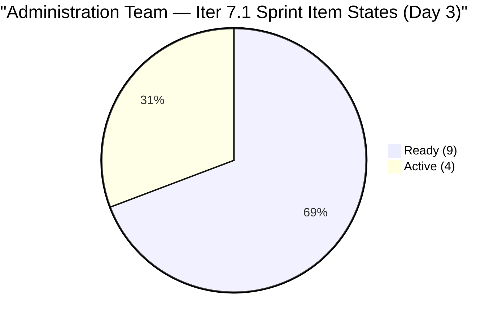
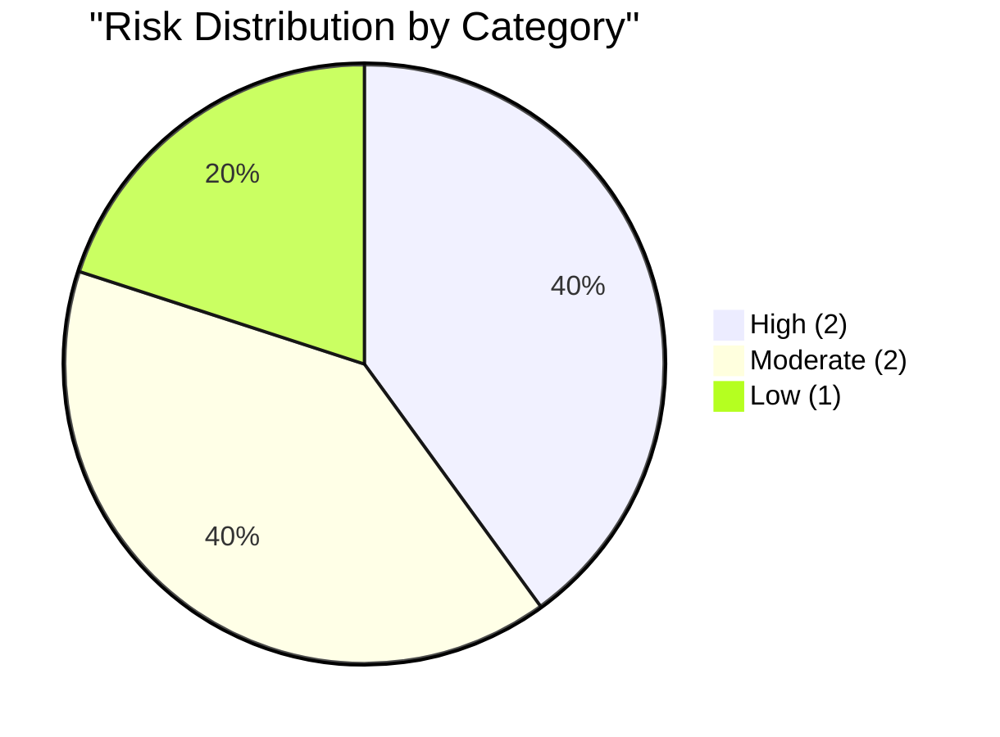
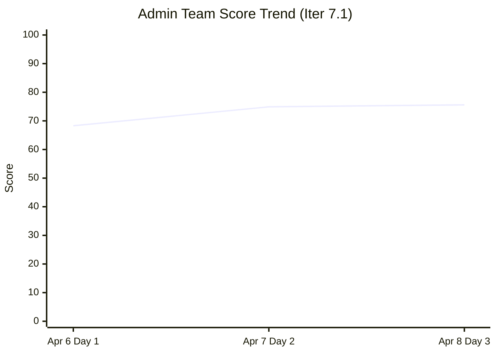

# SAFe Audit Report — Administration Team

## Jairosoft FINOPS Azure DevOps Project

---

## 1. Audit Metadata

| Field | Value |
|-------|-------|
| **Project** | Jairosoft FINOPS |
| **Project ID** | e0bb302f-40f9-46c3-8164-6f1acb317d63 |
| **Team** | Administration Team |
| **Team ID** | a38a9c02-07ab-483d-a1e3-aff54e19e603 |
| **Backlog** | Stories and Deliverables (`Microsoft.RequirementCategory`) |
| **Board URL** | [Administration Team Board](https://dev.azure.com/jairo/Jairosoft%20FINOPS/_boards/board/t/Administration%20Team/Stories%20and%20Deliverables) |
| **Workspace Folder** | `ado_admin` |
| **Current Iteration** | Iteration 7.1 |
| **Iteration Path** | `Jairosoft FINOPS\2026-PI7\Iteration 7.1` |
| **Iteration Start** | April 6, 2026 |
| **Iteration Finish** | April 19, 2026 |
| **Audit Date** | April 8, 2026 — 09:00 PHT |
| **Audit Day** | Day 3 of 14 (21% elapsed) |
| **Previous Audit** | AUDIT_20260407_0900.md (Apr 7, 2026 — Audit #25, Score: 74.9) |
| **Overall Score** | **75.6 / 100** |
| **Risk Band** | **Moderate Risk** |
| **Audit Series** | #26 |
| **Framework** | SAFe 6.0 |
| **Rubric** | ADO SAFe v1 (seven-dimension deterministic scoring) |

**Audit Boundary:** This audit covers only the Administration Team's Stories and Deliverables backlog in the Jairosoft FINOPS ADO project. No other teams, boards, projects, or repositories were analyzed.

---

## 2. Executive Summary

This is the **twenty-sixth audit in the series** and the **third audit of PI 7 / Iteration 7.1**. Since Audit #25 (Apr 7, Day 2):

### Key Changes Since Yesterday

1. **New item added:** #202493 "Davao Admin Adhoc Support April 06–19, 2026 cutoff" (5 SP, Active) assigned to Iteration 7.1 — sprint grows from 12 to **13 items (36 SP)**
2. **#202493 is immediately Active** — Mark has begun work on this item on the same day it was added
3. **#201984 and #201992** updated today (Apr 8) — both show continued progress in Active state
4. **#200995** (Budget request for corrugated sheet) updated Apr 8 — still at PI7 root, not assigned to Iter 7.1
5. **Score improves from 74.9 to 75.6 (+0.7):** Iteration Planning improves from 54.5 to 59.1 as the new sprint item is added; all other dimensions stable

The Administration Team continues its strongest audit series to date: 100% DoR compliance sustained, full estimation, and a new sprint item is already in Active state on Day 3.

---

## 3. Previous Audit Delta

**Previous:** AUDIT_20260407_0900 — Iteration 7.1 Day 2, Audit #25

| Metric | Audit #25 (Day 2) | **Audit #26 (Day 3)** | Delta |
|--------|--------------------|-----------------------|-------|
| Visible Backlog | 22 | **22** | 0 |
| Items in Current Iter | 12 | **13** | +1 |
| SP Committed | 31 | **36** | +5 |
| DoR Passing | 12/12 (100%) | **13/13 (100%)** | 0 |
| Iteration Planning | 54.5 | **59.1** | +4.6 |
| Team Capacity | 100.0 | **100.0** | 0.0 |
| Estimation | 100.0 | **100.0** | 0.0 |
| DoR Compliance | 100.0 | **100.0** | 0.0 |
| Work Item Balance | 70.0 | **70.0** | 0.0 |
| Backlog Refinement | 100.0 | **100.0** | 0.0 |
| Delivery Predictability | 0.0 | **0.0** | 0.0 |
| **Overall** | **74.9** | **75.6** | **+0.7** |
| Risk Band | Moderate Risk | **Moderate Risk** | No change |

---

## 4. Current Iteration Snapshot

### 4.1 Iteration 7.1 — Work Items (13 Items, 36 SP)

| ID | Title | Type | SP | State | Changed | DoR |
|----|-------|------|----|-------|---------|-----|
| 200613 | BFP certification renewal follow up | US | 1 | Ready | Apr 7 | PASS |
| 201856 | Signage Canvass Approval | US | 2 | Ready | Apr 7 | PASS |
| 201984 | Utilities payables for Cebu and Davao | US | 4 | Active | Apr 8 | PASS |
| 201992 | Payables — Internet for Davao and Cebu | US | 4 | Active | Apr 8 | PASS |
| 202297 | Government (EGOV) payables | US | 4 | Ready | Apr 7 | PASS |
| 202353 | JIT BFP certificate renewal 2026 | US | 3 | Ready | Apr 7 | PASS |
| 202357 | Fixation in rooftop (Davao) | Defect | 5 | Active | Apr 8 | PASS |
| 202364 | DOLE WAIR report | US | 1 | Ready | Apr 7 | PASS |
| 202366 | Philgeps renewal for 2026 | US | 3 | Ready | Apr 7 | PASS |
| 202370 | Toyota Hilux (Cebu) | US | 1 | Ready | Apr 7 | PASS |
| 202376 | Condo dues (Cebu) | US | 2 | Ready | Apr 7 | PASS |
| 202384 | Jairosoft food allowance | US | 1 | Ready | Apr 7 | PASS |
| 202493 | Davao Admin Adhoc Support Apr 06–19, 2026 | US | 5 | Active | Apr 8 | PASS |

### 4.2 Items Outside Iteration 7.1 (9 Items)

| ID | Title | Iteration Path | SP | State | Changed |
|----|-------|---------------|-----|-------|---------|
| 200995 | Budget request for corrugated sheet | PI7 (root) | 2 | Active | Apr 8 |
| 192221 | Purchase additional Corrugated Sheet Day 1 | Project Root | 2 | New | Mar 30 |
| 193412 | Implementation of aircon repair 2nd floor | Project Root | 2 | New | Mar 30 |
| 197115 | Implementation of installing jockey pump | Project Root | 4 | New | Mar 30 |
| 197111 | Recanvass for Jockey pump materials | Project Root | 1 | New | Mar 30 |
| 197023 | Installation of corrugated sheet at Fire Exit | Project Root | 3 | New | Mar 30 |
| 197029 | Implementation of Parking with roof (Day 1) | Project Root | 3 | New | Mar 30 |
| 197028 | Purchase materials at Houseman Hardware | Project Root | 1 | New | Mar 30 |
| 197113 | Purchase materials for Jockey pump | Project Root | 1 | New | Mar 30 |

### 4.3 Team Capacity

| Member | Activity | h/day | Days Off | Sprint Capacity |
|--------|----------|-------|----------|-----------------|
| Mark Colina | Deployment / Documentation / Requirements | 5 | 0 | 70 hours |

**Administration Team capacity (Iter 7.1):** 5 h/day × 14 days = **70 hours total**

---

## 5. Work Item Analysis

### 5.1 Backlog Composition (22 Items)

| Location | Count | SP |
|----------|-------|-----|
| Iteration 7.1 | 13 | 36 |
| PI7 Root (not in sprint) | 1 | 2 |
| Project Root (unassigned) | 8 | 15 |
| **Total** | **22** | **53** |

### 5.2 Sprint Type Distribution (13 Items)

| Type | Count | Share |
|------|-------|-------|
| User Story | 12 | 92.3% |
| Defect | 1 | 7.7% |
| **Total** | **13** | **100%** |

### 5.3 Active Items Progress

3 of 13 sprint items are in Active state (201984, 201992, 202357, 202493) — Mark is working concurrently on 4 items including the newly added adhoc support. 9 items remain in Ready state, waiting for Mark to pull them.



---

## 6. SAFe Compliance Scorecard

| # | Dimension | Score | Formula | Evidence | Notes |
|---|-----------|-------|---------|----------|-------|
| 1 | Iteration Planning | **59.1** | 13/22 × 100 | 13 of 22 items in Iter 7.1 | +1 item #202493 added |
| 2 | Team Capacity | **100.0** | 1/1 × 100 | Mark Colina: 5 h/day | Stable |
| 3 | Estimation | **100.0** | 13/13 × 100 | All 13 sprint items have SP > 0 | Sustained 100% |
| 4 | DoR Compliance | **100.0** | 13/13 × 100 | All 13 pass Desc ≥ 30 AND AC ≥ 20 nws | 100% sustained (2nd day) |
| 5 | Work Item Balance | **70.0** | 100 − 30 | US 92.3% > 60% — type concentration | Structural, unchanged |
| 6 | Backlog Refinement | **100.0** | 22/22 fresh; 0 penalties | All items changed within 45 days | No stale items |
| 7 | Delivery Predictability | **0.0** | 0/36 × 100 | Day 3 — no closures yet | Early-sprint (expected) |
| | **Overall** | **75.6** | 529.1 / 7 | | **Moderate Risk (60–79.9)** |

### Score Computation

```
--- Iteration Planning ---
visible_root_backlog_items = 22
current_iteration_root_items = 13
  (200613, 201856, 201984, 201992, 202297, 202353, 202357,
   202364, 202366, 202370, 202376, 202384, 202493)
  Note: #200995 = "Jairosoft FINOPS\2026-PI7" (PI7 root) — excluded
Score = round(13/22 × 100, 1) = 59.1

--- Team Capacity ---
contributors_with_current_work = 1 (Mark Colina — all 13 items)
contributors_with_capacity = 1 (Mark: 5 h/day)
Score = round(1/1 × 100, 1) = 100.0

--- Estimation ---
point_eligible_current_items = 13
estimated_current_items = 13 (all SP > 0)
SP sum: 1+2+4+4+4+3+5+1+3+1+2+1+5 = 36 SP
Score = round(13/13 × 100, 1) = 100.0

--- DoR Compliance ---
current_iteration_root_items = 13
#202493: Desc ~200 nws (long operational description) = PASS
         AC ~100 nws (8 bullet acceptance criteria) = PASS
All 13 items PASS (Desc >= 30 AND AC >= 20 nws)
Score = round(13/13 × 100, 1) = 100.0

--- Work Item Balance ---
12 User Story + 1 Defect = 13 items
has User Story => no -40
dominant_type_share = 12/13 = 92.3% > 60% => -30
spike_share = 0% => no -20
Score = 100 - 30 = 70.0

--- Backlog Refinement ---
Reference date: 2026-04-08
45-day cutoff: 2026-02-22
90-day cutoff: 2026-01-09
180-day cutoff: 2025-10-11

All 22 items:
  Iter 7.1 (13 items): all changed Apr 7-8 = fresh
  PI7 root (#200995): changed Apr 8 = fresh
  Project root (8 items): all changed Mar 30 = fresh (9 days ago)
fresh = 22/22 = 100%
stale_90 = 0; stale_180 = 0 => no penalties
untouched_current (changed before Apr 6): 0/13
Score = 100.0

--- Delivery Predictability ---
committed_story_points = 36 (13 estimated items)
closed_story_points = 0 (Day 3, no items Closed/Done)
Score = round(0/36 × 100, 1) = 0.0 [early-sprint, Day 3 of 14]

--- Overall ---
(59.1 + 100.0 + 100.0 + 100.0 + 70.0 + 100.0 + 0.0) / 7 = 529.1 / 7 = 75.6
Risk Band: Moderate Risk (60–79.9)
```

---

## 7. Dimension Findings

### 7.1 Iteration Planning (59.1/100) — MODERATE

13 of 22 backlog items are assigned to Iteration 7.1. Score improved from 54.5 to 59.1 with the addition of #202493. The 8 project-root items (facility/construction work) and #200995 (PI7 root) remain outside any sprint assignment. If the 8 root items were closed or assigned, this dimension would reach 13/14 = 92.9%.

### 7.2 Team Capacity (100.0/100) — EXCELLENT

Mark Colina: 5 h/day. No days off configured. Stable. At 5 h/day for 14 days = 70 hours total. With 36 SP committed, the implied velocity target is ~2.57 SP/day — above historical performance of ~1.36 SP/day in Iteration 6.5.

### 7.3 Estimation (100.0/100) — EXCELLENT

All 13 sprint items have Story Points. #202493 entered the sprint with 5 SP already assigned. Total committed: **36 SP**.

### 7.4 DoR Compliance (100.0/100) — EXCELLENT

100% DoR compliance maintained for the second consecutive day. #202493 entered with strong Documentation: a detailed operational description (~200 nws) and 8 itemized acceptance criteria (~100 nws). This represents strong pre-sprint preparation.

### 7.5 Work Item Balance (70.0/100) — MODERATE

12 User Stories and 1 Defect. The type concentration penalty is structural to the Administration Team's operational work mix. No path to improvement without artificially diversifying item types. Score is expected to remain at 70.0 for the duration of this sprint.

### 7.6 Backlog Refinement (100.0/100) — EXCELLENT

All 22 backlog items remain fresh. The 8 project-root items (Mar 30) are within the 45-day window through approximately May 14, 2026. No stale items. Continue PI7 grooming to maintain this score.

### 7.7 Delivery Predictability (0.0/100) — CRITICAL (Expected, Early Sprint)

Day 3 of 14. No items closed yet. 4 items in Active state (201984, 201992, 202357, 202493). Historical precedent: 6.5 delivered 61.3% (19/31 SP). At the same rate, ~22 SP would close this sprint, yielding ~61% delivery predictability. First closures are expected mid-sprint (Day 6–8).

---

## 8. Risks and Bottlenecks



### HIGH: 36 SP Commitment — Significant Over-Commitment Risk

36 SP committed for a single contributor (Mark Colina, 5 h/day). Historical delivery rate in Iteration 6.5 was 61.3% (19/31 SP). At the same rate applied to 36 SP, ~22 SP would close — leaving 14 SP undelivered. The addition of #202493 (5 SP, operational adhoc support) further increases scope. Close monitoring at Day 7 midpoint is critical.

### HIGH: 8 Project-Root Items Remain Unscheduled

8 facility/construction items (15 SP) persist at project root with no sprint or PI assignment. They have been in this state since March 30, 2026 (9 days). Without explicit disposition (assign to a future sprint or close), they continue to suppress the Iteration Planning score and represent unsequenced inventory.

### MODERATE: #200995 in PI7 Root — Not Committed to Iteration 7.1

"Budget request for corrugated sheet" (2 SP, Active as of Apr 8) remains at PI7 root. It is actively being worked. If it belongs in Iteration 7.1, assigning it would improve Iteration Planning from 59.1 to 14/23 = 60.9%.

### MODERATE: 4 Active Items Simultaneously — Risk of Partial Completion

Mark is concurrently active on items #201984, #201992, #202357, and #202493. Working 4 items simultaneously increases the risk of none reaching Done by sprint end. SAFe best practice is to limit WIP.

### LOW: Bus Factor = 1 (Structural, Unchanged)

Mark Colina remains the sole contributor across all 22 backlog items. Flagged in all 26 audits. No mitigation available at team level.

---

## 9. Prioritized Recommendations

| Priority | Action | Owner | Target | Impact |
|----------|--------|-------|--------|--------|
| 1 | Limit WIP — focus Active items to 1–2 before pulling new items | Mark | Day 3–4 | Delivery predictability improvement |
| 2 | Assign #200995 to Iteration 7.1 if it belongs in this sprint | Mark / Ramon | Day 3–4 | Iter Planning: 59.1 → 60.9 |
| 3 | Triage 8 root items — assign to PI7 sprint or close as completed | Ramon | Week 1 | Iter Planning: major improvement |
| 4 | Monitor delivery progress at Day 7 midpoint vs 36 SP target | Ramon | Apr 13 | Risk management |
| 5 | Begin closing completed items (check if #201984, #201992 are done) | Mark | Day 3–5 | Delivery Predictability improvement |

---

## 10. Evidence Gaps and Limitations

| Gap | Impact | Notes |
|-----|--------|-------|
| Day 3 of sprint | Delivery Predictability = 0.0 | Expected; monitor from Day 5 onward |
| 8 root items unscheduled | Iter Planning at 59.1 | Facility items need disposition |
| #200995 Active at PI7 root | Excluded from current count | Assign if in scope |
| 36 SP vs historical delivery ~22 SP | Over-commitment risk | Critical to monitor at midpoint |
| Single contributor | Bus factor = 1 | Structural limitation |

---

## Score History (Selected Key Audits)



| # | Date | Iter | Day | Score | Band |
|---|------|------|-----|-------|------|
| 1 | Feb 25 | 6.1 | — | 42.0 | High |
| 11 | Mar 22 | 6.5 | 13 | 57.1 | Moderate |
| 23 | Apr 5 | 6.6 | 14 | 22.9 | Critical |
| 24 | Apr 6 | 7.1 | 1 | 68.3 | Moderate |
| 25 | Apr 7 | 7.1 | 2 | 74.9 | Moderate |
| **26** | **Apr 8** | **7.1** | **3** | **75.6** | **Moderate** |

---

*Report generated: April 8, 2026 09:00 PHT*
*Auditor: AI EngProd Consultant (SAFe 6.0)*
*Rubric: ADO SAFe v1 (seven-dimension deterministic scoring)*
*Audit #26 | Iteration 7.1 Day 3 of 14 | Score: 75.6/100 (Moderate Risk)*
*Previous: AUDIT_20260407_0900 (74.9/100 — Moderate Risk)*
*Delta: +0.7 — #202493 added to sprint (5 SP, immediately Active); 4 items now in Active state; 100% DoR sustained*
