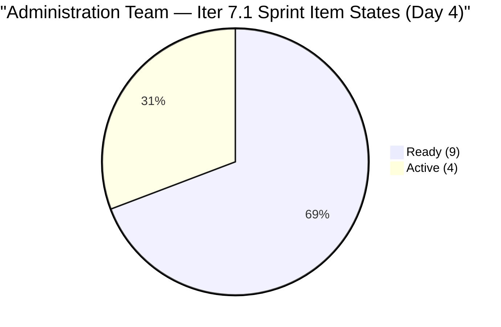
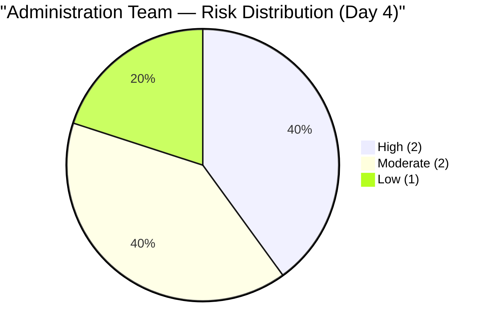
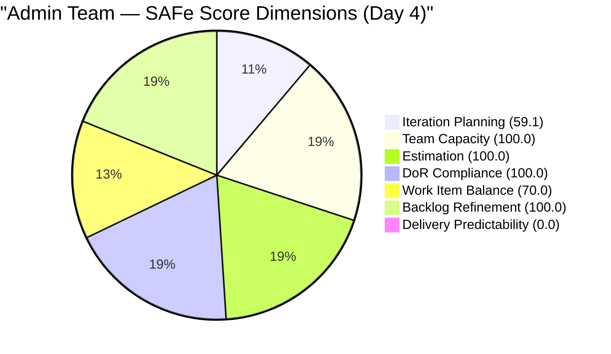

# SAFe Audit Report — Administration Team

## Jairosoft FINOPS Azure DevOps Project

---

## 1. Audit Metadata

| Field | Value |
|-------|-------|
| **Project** | Jairosoft FINOPS |
| **Project ID** | e0bb302f-40f9-46c3-8164-6f1acb317d63 |
| **Team** | Administration Team |
| **Team ID** | a38a9c02-07ab-483d-a1e3-aff54e19e603 |
| **Backlog** | Stories and Deliverables (`Microsoft.RequirementCategory`) |
| **Board URL** | [Administration Team Board](https://dev.azure.com/jairo/Jairosoft%20FINOPS/_boards/board/t/Administration%20Team/Stories%20and%20Deliverables) |
| **Workspace Folder** | `ado_admin` |
| **Current Iteration** | Iteration 7.1 |
| **Iteration Path** | `Jairosoft FINOPS\2026-PI7\Iteration 7.1` |
| **Iteration Start** | April 6, 2026 |
| **Iteration Finish** | April 19, 2026 |
| **Audit Date** | April 9, 2026 — 09:00 PHT |
| **Audit Day** | Day 4 of 14 (29% elapsed) |
| **Previous Audit** | AUDIT_20260408_0900.md (Apr 8, 2026 — Audit #26, Score: 75.6) |
| **Overall Score** | **75.6 / 100** |
| **Risk Band** | **Moderate Risk** |
| **Audit Series** | #27 |
| **Framework** | SAFe 6.0 |
| **Rubric** | ADO SAFe v1 (seven-dimension deterministic scoring) |

**Audit Boundary:** This audit covers only the Administration Team's Stories and Deliverables backlog in the Jairosoft FINOPS ADO project. No other teams, boards, projects, or repositories were analyzed.

---

## 2. Executive Summary

This is the **twenty-seventh audit in the series** and the **fourth audit of PI 7 / Iteration 7.1**. Since Audit #26 (Apr 8, Day 3):

### Key Changes Since Yesterday

1. **No new work items added or closed.** The sprint remains at 13 items, 36 SP committed.
2. **All sprint items last touched Apr 7–8.** No state transitions or field updates detected on April 9 in today's evidence window. Mark's four Active items (#201984, #201992, #202357, #202493) remain in progress.
3. **Score holds at 75.6.** All seven dimensions are structurally unchanged from yesterday. This is the third consecutive audit with a score between 75–76.
4. **Day 4 milestone:** 4 of 14 sprint days elapsed (29%). With 36 SP committed and 0 SP closed, the team needs to average ~3.3 SP/day over the remaining 10 days to reach 100% delivery. Historical delivery rate (Iter 6.5: ~1.36 SP/day) suggests ~22 SP realistic.

The Administration Team continues to sustain excellent DoR compliance, full estimation, and full capacity — the structural drag on the overall score is the 9 items outside the sprint (suppressing Iteration Planning to 59.1) and the type-concentration penalty in Work Item Balance (70.0).

---

## 3. Previous Audit Delta

**Previous:** AUDIT_20260408_0900 — Iteration 7.1 Day 3, Audit #26

| Metric | Audit #26 (Day 3) | **Audit #27 (Day 4)** | Delta |
|--------|--------------------|-----------------------|-------|
| Visible Backlog | 22 | **22** | 0 |
| Items in Current Iter | 13 | **13** | 0 |
| SP Committed | 36 | **36** | 0 |
| SP Closed | 0 | **0** | 0 |
| DoR Passing | 13/13 (100%) | **13/13 (100%)** | 0 |
| Iteration Planning | 59.1 | **59.1** | 0.0 |
| Team Capacity | 100.0 | **100.0** | 0.0 |
| Estimation | 100.0 | **100.0** | 0.0 |
| DoR Compliance | 100.0 | **100.0** | 0.0 |
| Work Item Balance | 70.0 | **70.0** | 0.0 |
| Backlog Refinement | 100.0 | **100.0** | 0.0 |
| Delivery Predictability | 0.0 | **0.0** | 0.0 |
| **Overall** | **75.6** | **75.6** | **0.0** |
| Risk Band | Moderate Risk | **Moderate Risk** | No change |

---

## 4. Current Iteration Snapshot

### 4.1 Iteration 7.1 — Work Items (13 Items, 36 SP)

| ID | Title | Type | SP | State | Changed | DoR |
|----|-------|------|----|-------|---------|-----|
| 200613 | BFP certification renewal follow up | US | 1 | Ready | Apr 7 | PASS |
| 201856 | Signage Canvass Approval | US | 2 | Ready | Apr 7 | PASS |
| 201984 | Utilities payables for Cebu and Davao | US | 4 | Active | Apr 8 | PASS |
| 201992 | Payables — Internet for Davao and Cebu | US | 4 | Active | Apr 8 | PASS |
| 202297 | Government (EGOV) payables | US | 4 | Ready | Apr 7 | PASS |
| 202353 | JIT BFP certificate renewal 2026 | US | 3 | Ready | Apr 7 | PASS |
| 202357 | Fixation in rooftop (Davao) | Defect | 5 | Active | Apr 8 | PASS |
| 202364 | DOLE WAIR report | US | 1 | Ready | Apr 7 | PASS |
| 202366 | Philgeps renewal for 2026 | US | 3 | Ready | Apr 7 | PASS |
| 202370 | Toyota Hilux (Cebu) | US | 1 | Ready | Apr 7 | PASS |
| 202376 | Condo dues (Cebu) | US | 2 | Ready | Apr 7 | PASS |
| 202384 | Jairosoft food allowance | US | 1 | Ready | Apr 7 | PASS |
| 202493 | Davao Admin Adhoc Support Apr 06–19, 2026 | US | 5 | Active | Apr 8 | PASS |

### 4.2 Items Outside Iteration 7.1 (9 Items)

| ID | Title | Iteration Path | SP | State | Changed |
|----|-------|---------------|-----|-------|---------|
| 200995 | Budget request for corrugated sheet | PI7 (root) | 2 | Active | Apr 8 |
| 192221 | Purchase additional Corrugated Sheet Day 1 | Project Root | 2 | New | Mar 30 |
| 193412 | Implementation of aircon repair 2nd floor | Project Root | 2 | New | Mar 30 |
| 197115 | Implementation of installing jockey pump | Project Root | 4 | New | Mar 30 |
| 197111 | Recanvass for Jockey pump materials | Project Root | 1 | New | Mar 30 |
| 197023 | Installation of corrugated sheet at Fire Exit | Project Root | 3 | New | Mar 30 |
| 197029 | Implementation of Parking with roof (Day 1) | Project Root | 3 | New | Mar 30 |
| 197028 | Purchase materials at Houseman Hardware | Project Root | 1 | New | Mar 30 |
| 197113 | Purchase materials for Jockey pump | Project Root | 1 | New | Mar 30 |

### 4.3 Team Capacity

| Member | Activity | h/day | Days Off | Sprint Capacity |
|--------|----------|-------|----------|-----------------|
| Mark Colina | Deployment (1h) / Documentation (2h) / Requirements (2h) | 5 | 0 | 70 hours |

---

## 5. Work Item Analysis

### 5.1 Backlog Composition (22 Items)

| Location | Count | SP |
|----------|-------|-----|
| Iteration 7.1 | 13 | 36 |
| PI7 Root (not in sprint) | 1 | 2 |
| Project Root (unassigned) | 8 | 15 |
| **Total** | **22** | **53** |

### 5.2 Sprint Type Distribution (13 Items)

| Type | Count | Share |
|------|-------|-------|
| User Story | 12 | 92.3% |
| Defect | 1 | 7.7% |
| **Total** | **13** | **100%** |

### 5.3 Sprint Item State Summary (Day 4)



### 5.4 Active Items Progress

4 of 13 sprint items remain in Active state: #201984, #201992, #202357, #202493. All four were last updated Apr 8. No transitions to Closed or Done detected on Day 4. 9 items remain in Ready, waiting for Mark to pull.

### 5.5 Backlog Age Profile

All 22 backlog items remain within the 45-day freshness window (cutoff: Feb 23, 2026):

- Iteration 7.1 items (13): last changed Apr 6–8
- PI7 root (#200995): last changed Apr 8
- Project root (8 items): last changed Mar 30 (10 days ago, expires ~May 14)

---

## 6. SAFe Compliance Scorecard

| # | Dimension | Score | Formula | Evidence | Notes |
|---|-----------|-------|---------|----------|-------|
| 1 | Iteration Planning | **59.1** | 13/22 × 100 | 13 of 22 items in Iter 7.1 | Stable — 9 items unscheduled |
| 2 | Team Capacity | **100.0** | 1/1 × 100 | Mark Colina: 5 h/day, 0 days off | Stable |
| 3 | Estimation | **100.0** | 13/13 × 100 | All 13 sprint items SP > 0 (sum 36 SP) | Sustained 100% |
| 4 | DoR Compliance | **100.0** | 13/13 × 100 | All 13 pass Desc ≥ 30 AND AC ≥ 20 nws | 100% sustained Day 4 |
| 5 | Work Item Balance | **70.0** | 100 − 30 | US 92.3% > 60% — type concentration | Structural, unchanged |
| 6 | Backlog Refinement | **100.0** | 22/22 fresh; 0 penalties | All items changed within 45 days | No stale items |
| 7 | Delivery Predictability | **0.0** | 0/36 × 100 | Day 4 — no closures yet | Early-sprint; first closures expected Day 6–8 |
| | **Overall** | **75.6** | 529.1 / 7 | | **Moderate Risk (60–79.9)** |

### Score Computation

```
--- Iteration Planning ---
visible_root_backlog_items = 22
current_iteration_root_items = 13
  (200613, 201856, 201984, 201992, 202297, 202353, 202357,
   202364, 202366, 202370, 202376, 202384, 202493)
  Note: #200995 at "Jairosoft FINOPS\2026-PI7" (PI7 root) — excluded
Score = round(13/22 × 100, 1) = 59.1

--- Team Capacity ---
contributors_with_current_work = 1 (Mark Colina)
contributors_with_capacity = 1 (Mark: Deployment 1h + Documentation 2h + Requirements 2h = 5 h/day)
Score = round(1/1 × 100, 1) = 100.0

--- Estimation ---
point_eligible_current_items = 13
estimated_current_items = 13 (all SP > 0)
committed_story_points = 1+2+4+4+4+3+5+1+3+1+2+1+5 = 36 SP
Score = round(13/13 × 100, 1) = 100.0

--- DoR Compliance ---
current_iteration_root_items = 13
All 13 verified: Desc ≥ 30 nws AND AC ≥ 20 nws
Score = round(13/13 × 100, 1) = 100.0

--- Work Item Balance ---
12 User Story + 1 Defect = 13 items
has User Story => no -40
dominant_type_share = 12/13 = 92.3% > 60% => -30
spike_share = 0% => no -20
Score = 100 - 30 = 70.0

--- Backlog Refinement ---
Reference date: 2026-04-09
45-day cutoff: 2026-02-23
90-day cutoff: 2026-01-09
180-day cutoff: 2025-10-12

All 22 items fresh (most recent: Mar 30 = 10 days ago, within 45 days)
stale_90 = 0; stale_180 = 0 => no penalties
untouched_current (changed before Apr 6): 0/13
Score = 100.0

--- Delivery Predictability ---
committed_story_points = 36
closed_story_points = 0 (Day 4, no items Closed/Done)
Score = round(0/36 × 100, 1) = 0.0 [early-sprint, Day 4 of 14]

--- Overall ---
(59.1 + 100.0 + 100.0 + 100.0 + 70.0 + 100.0 + 0.0) / 7 = 529.1 / 7 = 75.6
Risk Band: Moderate Risk (60–79.9)
```

---

## 7. Dimension Findings

### 7.1 Iteration Planning (59.1/100) — MODERATE

13 of 22 backlog items are in Iteration 7.1. Structurally unchanged through Day 4. The ceiling at 59.1 is set by 9 items outside the sprint:

- 1 item at PI7 root (#200995, Active) — not sprint-assigned
- 8 items at project root (facility/construction, Mar 30) — unscheduled

If the 8 root items were closed and #200995 added to the sprint: 14/14 = 100.0. Triage action remains the highest-leverage available change.

### 7.2 Team Capacity (100.0/100) — EXCELLENT

Mark Colina: 5 h/day (Deployment 1h + Documentation 2h + Requirements 2h). No days off. At 5 h/day × 14 days = 70 hours total. Implied sprint velocity target: 36 SP ÷ 14 days = 2.57 SP/day. Mark's historical rate (6.5: ~1.36 SP/day) suggests ~22 SP realistic. The team is capacity-configured but over-committed relative to historical throughput.

### 7.3 Estimation (100.0/100) — EXCELLENT

All 13 sprint items have Story Points (total 36 SP). Full estimation sustained through Day 4.

### 7.4 DoR Compliance (100.0/100) — EXCELLENT

100% DoR compliance sustained through Day 4 — fourth consecutive day. All 13 items have verified Description ≥ 30 nws and AcceptanceCriteria ≥ 20 nws. This is the strongest DoR record in the Administration Team's audit series.

### 7.5 Work Item Balance (70.0/100) — MODERATE

12 User Stories + 1 Defect. Structural type-concentration penalty (US at 92.3% > 60%). Expected to remain at 70.0 for the sprint duration unless new Defect or Spike types are added. No spike items.

### 7.6 Backlog Refinement (100.0/100) — EXCELLENT

All 22 items fresh as of Apr 9. The 8 project-root items (changed Mar 30) will reach the 45-day stale threshold around May 14, 2026. Recommend triage before May 14 to preserve the 100.0 score.

### 7.7 Delivery Predictability (0.0/100) — CRITICAL (Expected, Early Sprint)

Day 4 of 14. No items closed. 4 items in Active state. Based on historical performance in Iteration 6.5 (~22 SP delivered over 14 days), the first closures are expected around Day 6–8. The over-commitment of 36 SP against historical throughput of ~22 SP is the primary delivery risk.

---

## 8. Risks and Bottlenecks



### HIGH: 36 SP Commitment vs. ~22 SP Historical Throughput

Mark's historical velocity (Iter 6.5: 61.3% delivery = 19/31 SP) suggests ~22 SP realistic for this sprint. With 36 SP committed and 0 SP closed through Day 4, the gap is widening. At Day 4 of 14, ~3 SP per day is needed to hit 100% — nearly 2.5x Mark's historical rate.

**Watchpoint: Day 7 midpoint (Apr 12). If < 10 SP closed by then, adjust sprint scope.**

### HIGH: 8 Project-Root Items Stagnant Since March 30

8 facility/construction items (15 SP) at project root remain unscheduled. They have been New since March 30 (10 days). Without disposition before May 14, they will become stale and penalize Backlog Refinement.

### MODERATE: #200995 Active at PI7 Root — Not in Sprint

"Budget request for corrugated sheet" (2 SP, Active as of Apr 8) is being worked outside any sprint. If it belongs in Iteration 7.1, assigning it would improve Iteration Planning to 14/23 = 60.9%.

### MODERATE: 4 Concurrent Active Items — WIP Risk

Mark continues to work 4 items simultaneously (#201984, #201992, #202357, #202493). SAFe recommends limiting WIP to improve throughput. Focusing on 1–2 items to completion before pulling new work would improve delivery velocity.

### LOW: Bus Factor = 1 (Structural)

Mark Colina is the sole contributor across all 22 items. Persistent finding across all 27 audits. No team-level mitigation available.

---

## 9. Prioritized Recommendations

| Priority | Action | Owner | Target | Impact |
|----------|--------|-------|--------|--------|
| 1 | **Close Active items** — verify if #201984 or #201992 are complete; close immediately | Mark | Day 4–5 | First SP delivered; Delivery Predictability improvement |
| 2 | **Limit WIP to 2 Active items** — complete before pulling Ready items | Mark | Day 4 | Throughput improvement |
| 3 | **Monitor midpoint (Day 7 / Apr 12)** — if < 10 SP closed, negotiate scope reduction | Ramon | Apr 12 | Sprint delivery risk management |
| 4 | **Triage 8 root items** — assign to PI7 sprint or close | Ramon | This week | Iter Planning improvement; prevents future staleness |
| 5 | **Assign #200995 to Iteration 7.1** if it belongs in this sprint | Mark / Ramon | Day 4–5 | Iter Planning: 59.1 → 60.9 |

---

## 10. Evidence Gaps and Limitations

| Gap | Impact | Notes |
|-----|--------|-------|
| Day 4 — no closures yet | Delivery Predictability = 0.0 | Expected; monitor from Day 5 |
| 8 root items unscheduled | Iter Planning at 59.1 | Facility items need disposition |
| #200995 Active at PI7 root | Excluded from current iter count | Assign if in scope |
| 36 SP vs historical ~22 SP throughput | Over-commitment risk | Critical at Day 7 midpoint |
| No Apr 9 field updates detected | Possible data lag or quiet day | States appear stable from Apr 7–8 |

---

## Score History (Administration Team — PI 7)



| # | Date | Iter | Day | Score | Band | Key Event |
|---|------|------|-----|-------|------|-----------|
| 24 | Apr 6 | 7.1 | 1 | 68.3 | Moderate | PI7 Day 1 |
| 25 | Apr 7 | 7.1 | 2 | 74.9 | Moderate | 12 items, 31 SP |
| 26 | Apr 8 | 7.1 | 3 | 75.6 | Moderate | #202493 added; 36 SP |
| **27** | **Apr 9** | **7.1** | **4** | **75.6** | **Moderate** | **No changes; stable** |

---

*Report generated: April 9, 2026 09:00 PHT*
*Auditor: AI EngProd Consultant (SAFe 6.0)*
*Rubric: ADO SAFe v1 (seven-dimension deterministic scoring)*
*Audit #27 | Iteration 7.1 Day 4 of 14 | Score: 75.6/100 (Moderate Risk)*
*Previous: AUDIT_20260408_0900 (75.6/100 — Moderate Risk)*
*Delta: 0.0 — Score stable; no new items, no closures; 4 Active items unchanged from Apr 8; 100% DoR sustained*
