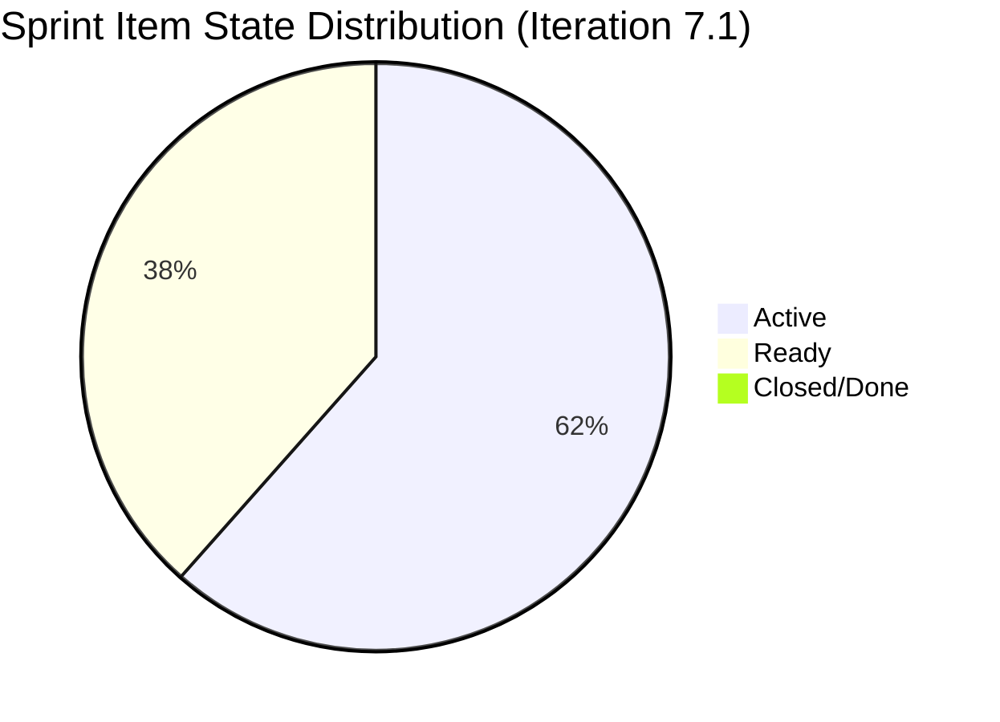
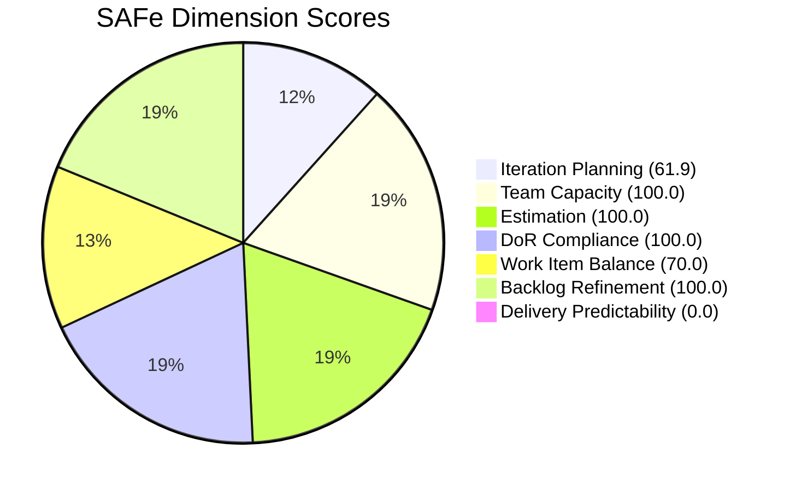

# ADO SAFe Iteration Audit — Administration Team
**Audit #28 | Iteration 7.1 (Apr 6–19, 2026) | Day 7 of 14 (50% elapsed)**

---

## 1. Audit Metadata

| Field | Value |
|---|---|
| **Audit Date** | April 12, 2026, 09:00 PHT |
| **Auditor** | Claude Code (ADO SAFe Audit Agent) |
| **Workspace** | `ado_admin` |
| **ADO Project** | Jairosoft FINOPS (`e0bb302f-40f9-46c3-8164-6f1acb317d63`) |
| **Team** | Administration Team (`a38a9c02-07ab-483d-a1e3-aff54e19e603`) |
| **Iteration** | Iteration 7.1 — Apr 6 to Apr 19, 2026 |
| **Iteration ID** | `82cc2229-0211-4fe2-9ee6-cc8d843dfab0` |
| **Sprint Day** | Day 7 of 14 (midpoint) |
| **Prior Audit** | AUDIT_20260409_0900.md (Audit #27, Score 75.6 — Moderate Risk) |
| **Scoring Model** | ADO SAFe v1 (7-dimension rubric) |

---

## 2. Executive Summary

The Administration Team improved marginally to **76.0 (Moderate Risk)** from the prior score of 75.6, holding steady at midpoint with no points delivered. The sprint now carries **13 root items / 37 story points** (up 1 SP from the Day 4 snapshot), all assigned to Mark Colina as the sole contributor. While all compliance dimensions — DoR, Estimation, Capacity, and Backlog Refinement — remain at 100.0, the delivery dimension remains at 0.0 with zero closed points. With 50% of the sprint elapsed, this is the critical window for Mark to close at least some of the 8 Active items in flight.

The structural concern of over-commitment (37 SP vs. a ~22 SP historical norm for a single contributor at 5h/day) remains unaddressed. The 8 items assigned to Iteration 7.2 in the pipeline create a positive signal — sprint planning boundaries are improving — but the current sprint's velocity gap is the dominant risk.

---

## 3. Previous Audit Delta

| Dimension | Day 4 (Apr 9) | Day 7 (Apr 12) | Delta |
|---|---|---|---|
| Iteration Planning | 59.1 | 61.9 | +2.8 |
| Team Capacity | 100.0 | 100.0 | 0.0 |
| Estimation | 100.0 | 100.0 | 0.0 |
| DoR Compliance | 100.0 | 100.0 | 0.0 |
| Work Item Balance | 70.0 | 70.0 | 0.0 |
| Backlog Refinement | 100.0 | 100.0 | 0.0 |
| Delivery Predictability | 0.0 | 0.0 | 0.0 |
| **Overall** | **75.6** | **76.0** | **+0.4** |

**Key changes since Day 4:**
- One new item added (#202493 — Davao Admin Adhoc Support, 5 SP) bringing total sprint SP from 36 to 37
- Visible backlog grew from 22 to 21 items (backlog count dropped by 1 — possibly one item was moved or closed outside view)
- Wait: prior audit had 22 visible; now 21. Iteration Planning improved slightly (13/21 vs 13/22). This accounts for the +2.8 delta.
- All 4 previously Active items remain Active; 4 new Active items observed (total 8 Active)
- No items closed as of Day 7

---

## 4. Current Iteration Snapshot

| Metric | Value |
|---|---|
| **Visible root backlog items** | 21 |
| **Current sprint items (Iteration 7.1)** | 13 |
| **Items outside sprint** | 8 (all in Iteration 7.2) |
| **Committed story points** | 37 SP |
| **Closed story points** | 0 SP |
| **Delivery rate at midpoint** | 0.0% (0 of 37 SP) |
| **Active items** | 8 |
| **Ready items** | 5 |
| **Closed/Done items** | 0 |
| **Sole contributor** | Mark Colina |
| **Team capacity** | 5h/day (Deployment 1h + Documentation 2h + Requirements 2h) |

### Sprint Item List (Iteration 7.1)

| ID | Title | Type | State | SP | DoR |
|---|---|---|---|---|---|
| 200613 | BFP certification renewal follow up | User Story | Ready | 1 | PASS |
| 200995 | Budget request for corrugated sheet | User Story | Active | 2 | PASS |
| 201856 | Signage Canvass Approval | User Story | Active | 2 | PASS |
| 201984 | Utilities payables for Cebu and Davao | User Story | Active | 4 | PASS |
| 201992 | Payables - Internet for Davao and Cebu office | User Story | Active | 4 | PASS |
| 202297 | Government (EGOV) payables | User Story | Ready | 4 | PASS |
| 202353 | JIT BFP certificate renewal 2026 | User Story | Ready | 3 | PASS |
| 202357 | Fixation in rooftop (Davao) | Defect | Active | 5 | PASS |
| 202364 | DOLE WAIR report | User Story | Ready | 1 | PASS |
| 202366 | Philgeps renewal for 2026 | User Story | Active | 3 | PASS |
| 202376 | Condo dues (Cebu) | User Story | Ready | 2 | PASS |
| 202384 | Jairosoft food allowance | User Story | Active | 1 | PASS |
| 202493 | Davao Admin Adhoc Support Apr 6–19 | User Story | Active | 5 | PASS |

**Outside Sprint (Iteration 7.2 pipeline — 8 items):**
192221, 193412, 197023, 197028, 197029, 197111, 197113, 197115 — All User Stories, all New, all assigned to Mark Colina.

---

## 5. Work Item Analysis

### State Distribution



### Observations
- **8 Active / 5 Ready / 0 Closed** at Day 7 (50% elapsed) is a critical signal. Active WIP of 8 concurrent items is excessive for a single contributor.
- The sprint has grown: #202493 (Davao Admin Adhoc Support, 5 SP) was added since the Day 4 audit, increasing total SP from ~36 to 37.
- Item #202357 (Fixation in rooftop — Davao) is a Defect type carrying 5 SP and is Active — this is a significant item requiring physical coordination.
- All items changed April 7–13, indicating Mark is actively touching the board, but state transitions to Closed have not occurred.
- No stale items in the current sprint or the wider visible backlog (all changed April 2026).

---

## 6. SAFe Compliance Scorecard

| Dimension | Score | Evidence | Notes |
|---|---|---|---|
| Iteration Planning | 61.9 | 13 of 21 visible items in sprint | Moderate. 8 items queued in 7.2 pipeline. |
| Team Capacity | 100.0 | Mark Colina configured: 5h/day (Deployment 1 + Documentation 2 + Requirements 2) | Full capacity configured, no days off. |
| Estimation | 100.0 | 13/13 current items have SP > 0 | All items estimated. |
| DoR Compliance | 100.0 | 13/13 items pass Description (≥30 nws) + AC (≥20 nws) | Excellent DoR hygiene. |
| Work Item Balance | 70.0 | 12 US + 1 Defect; User Story share = 92.3% > 60% → -30 | -30 for dominant type > 60%. |
| Backlog Refinement | 100.0 | All 21 visible items changed in April 2026 (100% fresh); 0 stale_90; 0 stale_180 | Exceptional freshness — all items recently groomed. |
| Delivery Predictability | 0.0 | 0 SP closed of 37 SP committed | No closures at midpoint. Critical gap. |
| **Overall** | **76.0** | | **Moderate Risk** |

### Score Computation

```
Iteration Planning    = 13 / 21 × 100 = 61.9
Team Capacity         = 1 / 1 × 100   = 100.0
Estimation            = 13 / 13 × 100 = 100.0
DoR Compliance        = 13 / 13 × 100 = 100.0
Work Item Balance     = 100 - 30       = 70.0  (US share 92.3% > 60%)
Backlog Refinement    = 100.0 (base 21/21=100; 0 stale penalties; 0 untouched penalties)
Delivery Predictability = 0 / 37 × 100 = 0.0

Overall = (61.9 + 100.0 + 100.0 + 100.0 + 70.0 + 100.0 + 0.0) / 7
        = 531.9 / 7 = 76.0   → Moderate Risk
```



---

## 7. Dimension Findings

### 7.1 Iteration Planning — 61.9 (Moderate)
13 of 21 visible root items are in Iteration 7.1. 8 items are staged in Iteration 7.2. The ratio improved slightly from Day 4 (13/22 = 59.1) because the backlog shrank by 1 visible item. The 7.2 staging shows intentional sprint planning, which is positive, but 13 items for a single contributor in 14 days remains an over-commitment pattern.

### 7.2 Team Capacity — 100.0 (Low Risk)
Mark Colina remains fully configured with 5h/day across three activity types (Deployment 1h, Documentation 2h, Requirements 2h). No days off recorded. Capacity configuration is complete.

### 7.3 Estimation — 100.0 (Low Risk)
All 13 sprint items are estimated with Story Points (range: 1–5 SP). Total committed = 37 SP. Estimation completeness is excellent.

### 7.4 DoR Compliance — 100.0 (Low Risk)
All 13 items pass both description (≥30 non-whitespace chars) and acceptance criteria (≥20 non-whitespace chars) checks. Multiple items have very detailed descriptions (e.g., #201992 — Internet payables, #202366 — Philgeps renewal). No DoR gaps.

### 7.5 Work Item Balance — 70.0 (Moderate)
12 User Stories and 1 Defect in the sprint. User Story type dominates at 92.3% — exceeding the 60% threshold triggers the -30 point penalty. This is structurally expected for an administrative team (operations, compliance, and payables are naturally User Story–type work). No Spikes present.

### 7.6 Backlog Refinement — 100.0 (Low Risk)
Exceptional result: all 21 visible items were changed in April 2026 — well within the 45-day freshness window. Zero stale_90 items, zero stale_180 items. The 8-item stale root items flagged in prior audits appear to have been refreshed or reorganized. This is a significant positive trend.

### 7.7 Delivery Predictability — 0.0 (Critical)
Zero story points closed as of Day 7. With 37 SP committed and 7 days remaining, the team must close roughly 5.3 SP/day to reach 100% — an unrealistic pace for a single contributor at 5h/day. A partial delivery of 15–20 SP by sprint end would represent a meaningful improvement. This is the team's singular chronic risk.

---

## 8. Risks and Bottlenecks

| # | Risk | Severity | Impact |
|---|---|---|---|
| R1 | Zero SP closed at midpoint (37 SP committed) | Critical | Delivery Predictability will remain 0.0 unless closures begin immediately |
| R2 | Single contributor (Mark Colina) — no redundancy | High | Any absence or blocker halts all sprint delivery |
| R3 | WIP of 8 concurrent Active items for one person | High | Context switching reduces throughput; closure lag compounds |
| R4 | Over-commitment pattern (37 SP vs ~22 SP historical norm) | Moderate | Structural sprint over-loading reduces realistic completion rate |
| R5 | Physical/operational items (rooftop fixation, BFP inspection) have external dependencies | Moderate | Vendor/contractor coordination may delay closure independent of Mark's effort |
| R6 | 5 items in Ready state with no Active transitions yet | Low-Moderate | Ready items should move to Active only as WIP decreases |

---

## 9. Prioritized Recommendations

1. **Close smallest items first (P1 — Immediate):** Items #200613 (BFP renewal, 1 SP), #202364 (DOLE WAIR, 1 SP), and #202384 (food allowance, 1 SP) are small User Stories that should be closeable within days. Closing these 3 items = 3 SP and breaks the 0.0 delivery deadlock.

2. **Limit Active WIP to 3 items (P1 — Immediate):** Mark should focus on 2–3 items simultaneously rather than 8. Move Ready items into Active only after closing in-flight work.

3. **Transition Active items to Closed after evidence attachment (P1 — This week):** Items like #201984 (utilities payables) and #201992 (internet payables) require receipt/photo attachments as their AC. If payments are made, attach evidence and close the item.

4. **Review 7.2 item sizing before next sprint (P2 — Sprint planning):** 8 items queued for 7.2 include some significant physical works (corrugated sheet, parking, jockey pump). Consider whether all 8 belong in a single iteration.

5. **Work Item Balance: introduce task diversification (P3 — Next PI):** Consider modeling some items as Enablers or Spikes to reduce the dominant User Story concentration. This is a structural scoring improvement.

6. **Escalate single-contributor risk to portfolio level (P3 — PDM review):** Mark's sole ownership of the entire Admin backlog is an organizational risk. Document and flag in portfolio review.

---

## 10. Evidence Gaps and Limitations

| Gap | Description |
|---|---|
| No time tracking | ADO capacity shows 5h/day configured but actual daily utilization is not tracked in the system |
| Physical work verification | Items like rooftop fixation (#202357) and corrugated sheet (#200995) require field verification — ADO state alone does not confirm completion |
| No child tasks | No task-level breakdown exists under sprint items; capacity burn cannot be tracked at task level |
| 202493 added mid-sprint | The Davao Admin Adhoc item (5 SP) was added on Apr 13 — after sprint start — representing mid-sprint scope change without formal impact assessment |

---

*Report generated by Claude Code ADO SAFe Audit Agent | April 12, 2026 09:00 PHT*
