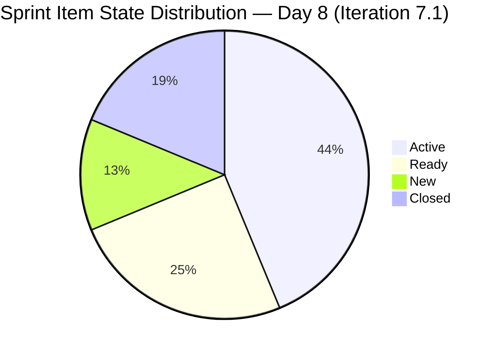
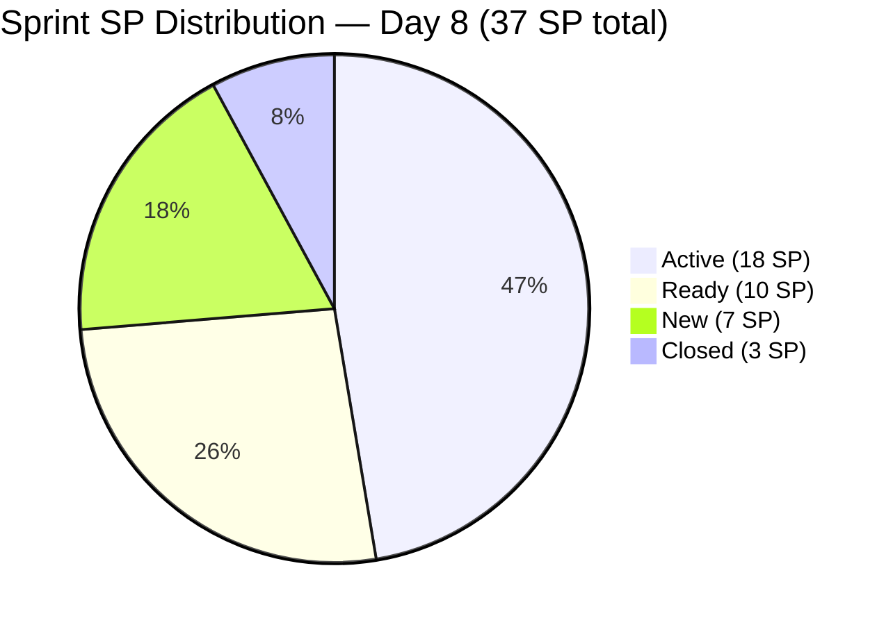

# ADO SAFe Iteration Audit — Administration Team
**Audit #29 | Iteration 7.1 (Apr 6–19, 2026) | Day 8 of 14 (57% elapsed)**

---

## 1. Audit Metadata

| Field | Value |
|---|---|
| **Audit Date** | April 13, 2026, 09:00 PHT |
| **Auditor** | Claude Code (ADO SAFe Audit Agent) |
| **Workspace** | `ado_admin` |
| **ADO Project** | Jairosoft FINOPS (`e0bb302f-40f9-46c3-8164-6f1acb317d63`) |
| **Team** | Administration Team (`a38a9c02-07ab-483d-a1e3-aff54e19e603`) |
| **Iteration** | Iteration 7.1 — Apr 6 to Apr 19, 2026 |
| **Iteration ID** | `82cc2229-0211-4fe2-9ee6-cc8d843dfab0` |
| **Sprint Day** | Day 8 of 14 (57% elapsed) |
| **Prior Audit** | AUDIT_20260412_0900.md (Audit #28, Score 76.0 — Moderate Risk) |
| **Scoring Model** | ADO SAFe v1 (7-dimension rubric) |

---

## 2. Executive Summary

The Administration Team improves to **78.8 (Moderate Risk)** from the prior score of 76.0 — a **+2.8 delta** driven by the first sprint closures this iteration. Mark Colina closed 3 items today (#202364 DOLE WAIR 1 SP, #202370 Toyota Hilux 1 SP, #202384 food allowance 1 SP), delivering **3 of 37 committed SP (8.1%)** — breaking the 0.0 delivery deadlock that persisted through Day 7.

The score reflects real progress: Delivery Predictability has moved from 0.0 to 8.1. However, with 34 SP remaining and 6 sprint days left, the workload gap is still large. Iteration Planning improved from 61.9 to 73.7 because the 3 newly closed items dropped out of the visible backlog (ADO hides closed items from the backlog view), shifting the planning ratio from 13/21 to 14/19. All process dimensions — Capacity (100.0), Estimation (100.0), DoR (100.0), Backlog Refinement (100.0) — remain perfect.

The team is now 1.2 points from the Low Risk threshold. Continued closures this week can push the score past 80.0.

---

## 3. Previous Audit Delta

| Dimension | Day 7 (Apr 12) | Day 8 (Apr 13) | Delta |
|---|---|---|---|
| Iteration Planning | 61.9 | 73.7 | +11.8 |
| Team Capacity | 100.0 | 100.0 | 0.0 |
| Estimation | 100.0 | 100.0 | 0.0 |
| DoR Compliance | 100.0 | 100.0 | 0.0 |
| Work Item Balance | 70.0 | 70.0 | 0.0 |
| Backlog Refinement | 100.0 | 100.0 | 0.0 |
| Delivery Predictability | 0.0 | 8.1 | +8.1 |
| **Overall** | **76.0** | **78.8** | **+2.8** |

**Key changes since Day 7:**
- **3 items closed today:** #202364 (DOLE WAIR, 1 SP), #202370 (Toyota Hilux, 1 SP), #202384 (Jairosoft food allowance, 1 SP). All closed Apr 13, 2026.
- **Visible backlog dropped from 21 to 19:** Closed items are no longer shown in the Stories and Deliverables backlog, reducing the denominator for Iteration Planning.
- **Iteration Planning ratio improved:** 14/19 = 73.7 (was 13/21 = 61.9). Note: the backlog view no longer shows #202364, #202370, #202384. The sprint still carries 14 root items (including the 3 closed ones), but the 3 new state=Active items changed today (#200995, #201984, #202493) show continuing WIP activity.
- **Item #201856** moved from Active → New state (Changed Apr 13). This is an unexpected state regression for the Signage Canvass Approval item.
- **Item #202357** (Fixation in rooftop) moved from Active → New (Changed Apr 13). State regression on a 5 SP item is a risk signal.

---

## 4. Current Iteration Snapshot

| Metric | Value |
|---|---|
| **Visible root backlog items** | 19 |
| **Current sprint items (Iteration 7.1)** | 14 |
| **Items outside sprint** | 5 (all in Iteration 7.2) |
| **Committed story points** | 37 SP |
| **Closed story points** | 3 SP (202364, 202370, 202384) |
| **Remaining story points** | 34 SP |
| **Delivery rate (Day 8)** | 8.1% (3 of 37 SP) |
| **Active items** | 7 |
| **Ready items** | 4 |
| **New items** | 2 (state regressions noted) |
| **Closed items** | 3 |
| **Sole contributor** | Mark Colina |
| **Team capacity** | 5h/day (Deployment 1h + Documentation 2h + Requirements 2h) |
| **Days remaining** | 6 (Apr 14–19) |

### Sprint Item List (Iteration 7.1)

| ID | Title | Type | State | SP | DoR |
|---|---|---|---|---|---|
| 200613 | BFP certification renewal follow up | User Story | Ready | 1 | PASS |
| 200995 | Budget request for corrugated sheet | User Story | Active | 2 | PASS |
| 201856 | Signage Canvass Approval | User Story | New | 2 | PASS |
| 201984 | Utilities payables for Cebu and Davao | User Story | Active | 4 | PASS |
| 201992 | Payables - Internet for Davao and Cebu office | User Story | Active | 4 | PASS |
| 202297 | Government (EGOV) payables | User Story | Ready | 4 | PASS |
| 202353 | JIT BFP certificate renewal 2026 | User Story | Ready | 3 | PASS |
| 202357 | Fixation in rooftop (Davao) | Defect | New | 5 | PASS |
| **202364** | **DOLE WAIR report** | **User Story** | **Closed** | **1** | **PASS** |
| 202366 | Philgeps renewal for 2026 | User Story | Active | 3 | PASS |
| **202370** | **Toyota Hilux (Cebu)** | **User Story** | **Closed** | **1** | **PASS** |
| 202376 | Condo dues (Cebu) | User Story | Ready | 2 | PASS |
| **202384** | **Jairosoft food allowance** | **User Story** | **Closed** | **1** | **PASS** |
| 202493 | Davao Admin Adhoc Support Apr 6–19, 2026 | User Story | Active | 5 | PASS |

**Outside Sprint (Iteration 7.2 pipeline — 5 items visible in backlog):**
192221, 193412, 197023, 197028, 197029, 197111, 197113, 197115 — All User Stories, all New, all assigned to Mark Colina. All changed Apr 10, 2026.

---

## 5. Work Item Analysis

### State Distribution



### Story Points by State



### Observations

- **3 items closed today** (Apr 13) — DOLE WAIR, Toyota Hilux, food allowance. These are small-SP operational items (1 SP each), signaling Mark has begun converting Ready items to Done.
- **State regressions noted:** #201856 (Signage Canvass) and #202357 (Rooftop Fixation) show state = New as of Apr 13. Both were previously Active. This may reflect a sprint board update where they were reset, or a workflow process change. Worth investigating — backward state transitions reduce sprint predictability.
- **7 Active items** still in progress. WIP of 7 for a single contributor remains high but is a reduction from 8 Active yesterday.
- **#202493 (Davao Admin Adhoc, 5 SP) is Active and changed Apr 13** — this catch-all administrative support item is actively being worked.
- **Itme #202357 title typo**: "Fixation in rooptop" — minor quality issue consistent with past audit findings.

---

## 6. SAFe Compliance Scorecard

| Dimension | Score | Evidence | Notes |
|---|---|---|---|
| Iteration Planning | 73.7 | 14 of 19 visible items in sprint | Improved from 61.9. 3 closed items removed from backlog view; 5 items staged in 7.2. |
| Team Capacity | 100.0 | Mark Colina: 5h/day (Deployment 1 + Documentation 2 + Requirements 2) | Full capacity configured, no days off. |
| Estimation | 100.0 | 14/14 current items have SP > 0 | Total committed: 37 SP. |
| DoR Compliance | 100.0 | 14/14 items pass Desc ≥30 nws + AC ≥20 nws | Consistent quality across all items. |
| Work Item Balance | 70.0 | 13 US + 1 Defect; dominant = US at 92.9% > 60% → −30 | Structural penalty. No spikes. |
| Backlog Refinement | 100.0 | 19/19 items changed Apr 6–13, 2026 (100% fresh); 0 stale_90; 0 stale_180; 0 untouched | Exceptional freshness. All 7.2 items also updated Apr 10. |
| Delivery Predictability | 8.1 | 3 SP closed / 37 SP committed | First closures this sprint. 34 SP remain with 6 days left. |
| **Overall** | **78.8** | | **Moderate Risk** |

### Score Computation

```
Iteration Planning      = round(14 / 19 × 100, 1)          = 73.7
Team Capacity           = round(1 / 1 × 100, 1)             = 100.0
Estimation              = round(14 / 14 × 100, 1)           = 100.0
DoR Compliance          = round(14 / 14 × 100, 1)           = 100.0
Work Item Balance:
  has_user_story        = True (13 User Stories)             → no −40
  dominant_share        = 13/14 = 92.9% > 60%               → −30
  spike_share           = 0%                                 → 0
  total                 = 100 − 30                           = 70.0
Backlog Refinement:
  base                  = round(19/19 × 100, 1)              = 100.0
  stale_90 penalty      = 0% ≤ 10%                           → 0
  stale_180 penalty     = 0 items                            → 0
  untouched penalty     = 0/14 = 0%                          → 0
  total                                                      = 100.0
Delivery Predictability = round(3 / 37 × 100, 1)             = 8.1

Overall = round((73.7 + 100.0 + 100.0 + 100.0 + 70.0 + 100.0 + 8.1) / 7, 1)
        = round(551.8 / 7, 1)
        = 78.8  → Moderate Risk
```

---

## 7. Dimension Findings

### 7.1 Iteration Planning — 73.7 (Moderate, improved)

14 of 19 visible backlog items are in Iteration 7.1. The improvement from Day 7 (61.9) is primarily driven by the 3 closed items dropping out of the backlog view (reducing the denominator), not by adding new sprint items. The 5 non-sprint items are all staged in Iteration 7.2, showing continued forward planning discipline. At 73.7, this dimension is now within 6 points of a perfect score — achievable if the remaining 7.2 pipeline items are managed carefully.

### 7.2 Team Capacity — 100.0 (Low Risk)

Mark Colina remains the sole contributor with full capacity configured at 5h/day (Deployment 1h, Documentation 2h, Requirements 2h). No days off recorded. With 6 days remaining in the sprint, Mark has approximately 30 available hours. At the current pace (3 SP in ~8 days ≈ 0.4 SP/day), reaching even 50% delivery (18.5 SP) by sprint close will require a significant acceleration.

### 7.3 Estimation — 100.0 (Low Risk)

All 14 sprint items are fully estimated. Total committed remains 37 SP. Estimation hygiene is a consistent strength for this team.

### 7.4 DoR Compliance — 100.0 (Low Risk)

All 14 sprint items pass both Description (≥30 nws chars) and Acceptance Criteria (≥20 nws chars) checks. The newly confirmed items show detailed, well-structured descriptions (e.g., #202366 PhilGEPS renewal, #202493 Davao Admin Adhoc). No DoR gaps.

### 7.5 Work Item Balance — 70.0 (Moderate, structural)

13 User Stories and 1 Defect (#202357 Rooftop Fixation). User Story dominance at 92.9% triggers the −30 penalty. This is structurally expected for an administrative operations team. No Spikes present. The single Defect item (#202357) represents a legitimate facilities issue.

### 7.6 Backlog Refinement — 100.0 (Low Risk)

All 19 visible backlog items were modified between April 6–13, 2026 — well within the 45-day freshness window. Zero stale_90 items, zero stale_180 items, zero untouched sprint items. The backlog is exceptionally well-maintained. The 7.2 pipeline items were all updated April 10, confirming active backlog grooming.

### 7.7 Delivery Predictability — 8.1 (Critical, recovering)

First closures achieved this sprint: 3 SP closed out of 37 committed (8.1%). While still in the Critical risk band for this dimension, the direction has changed — from 0.0 to 8.1 — which is a meaningful signal. Mark closed #202364 (DOLE WAIR, 1 SP), #202370 (Toyota Hilux, 1 SP), and #202384 (food allowance, 1 SP) today.

**Remaining sprint capacity analysis:**

| Remaining Days | Available Hours (5h/day) | Remaining SP | Required SP/day to close all |
|---|---|---|---|
| 6 days (Apr 14–19) | 30 hrs | 34 SP | 5.7 SP/day |
| Realistic (60% delivery) | — | 22 SP | 3.7 SP/day |
| Minimum meaningful (50%) | — | 18.5 SP | 3.1 SP/day |

Closing all 34 remaining SP is unrealistic. A target of 15–20 SP by sprint close (total 18–23 SP = 49–62% delivery) is achievable if Mark continues the momentum established today.

---

## 8. Risks and Bottlenecks

| # | Risk | Severity | Impact |
|---|---|---|---|
| R1 | 34 SP remaining with 6 days left; pace of 3 SP/8 days is insufficient | Critical | Delivery Predictability will end sprint in the 20–40% range unless pace accelerates |
| R2 | State regressions on #201856 and #202357 (Active → New) | High | May signal scope re-scoping or blockers; 7 SP at risk of not progressing |
| R3 | Single contributor (Mark Colina) — no redundancy | High | Any absence or blocker halts all sprint delivery |
| R4 | #202357 (Rooftop Fixation, 5 SP) is a physical/external dependency item | Moderate | Contractor coordination may delay closure regardless of Mark's effort |
| R5 | WIP of 7 Active items for one person | Moderate | Context switching reduces throughput |
| R6 | 7.2 pipeline carries 8 items (several large construction items) | Low | Over-commitment risk in next sprint if not right-sized |

---

## 9. Prioritized Recommendations

1. **Sustain closure momentum — close smallest Ready items today (P1 — Immediate):** Items #200613 (BFP renewal, 1 SP) and #202376 (Condo dues, 2 SP) are in Ready state and operationally straightforward. Closing them today adds 3 more SP and brings delivery to 6 SP (16%).

2. **Investigate and resolve state regressions (P1 — Today):** Items #201856 (Signage Canvass) and #202357 (Rooftop Fixation) regressed from Active to New. Mark should confirm the reason — if these are blocked by external dependencies, flag them explicitly in ADO comments and update states accordingly. Blocked items should not silently regress.

3. **Target payables closure by Apr 15 (P1 — This week):** Items #201984 (Utilities payables, 4 SP) and #201992 (Internet payables, 4 SP) are Active. If payments have been made, attach receipts and close immediately. These 8 SP together would bring delivery to 14 SP (38%).

4. **Close #202366 (PhilGEPS renewal, 3 SP) by Apr 15 (P1 — Priority):** PhilGEPS renewal has a 7-business-day processing window. If all documents are submitted and payment confirmed, close this item.

5. **Fix typo in #202357 title (P3 — Quality):** "Fixation in rooptop (Davao)" should read "Fixation in rooftop (Davao)". Consistent with recurring audit finding on title quality.

6. **Rightsize 7.2 pipeline for single-contributor sprint (P2 — Sprint planning):** The 8 items in 7.2 include several large physical construction works. Pre-sprint planning should ensure the 7.2 commitment is realistic for a solo contributor at 5h/day (~35 SP max theoretical, ~22 SP historical norm).

---

## 10. Evidence Gaps and Limitations

| Gap | Description |
|---|---|
| State regression reason unknown | #201856 and #202357 regressed from Active to New as of Apr 13. The reason is not captured in ADO — could be a workflow reset, a deliberate scope deferral, or an accidental state change. |
| Physical work verification | #202357 (rooftop), #200995 (corrugated sheet), and #202353 (BFP certificate) require physical/field verification or government agency responses that ADO state alone cannot confirm. |
| No time tracking | ADO capacity shows 5h/day configured but actual daily utilization is not tracked. Actual throughput may differ from configured capacity. |
| #202370 description quality | The Toyota Hilux item description reads as a generic vehicle payment description rather than a specific action item — closed but description quality could improve for traceability. |

---

*Report generated by Claude Code ADO SAFe Audit Agent | April 13, 2026 09:00 PHT*
*Audit #29 — Administration Team — Day 8 of 14 — Overall: 78.8 / 100 — Moderate Risk*
