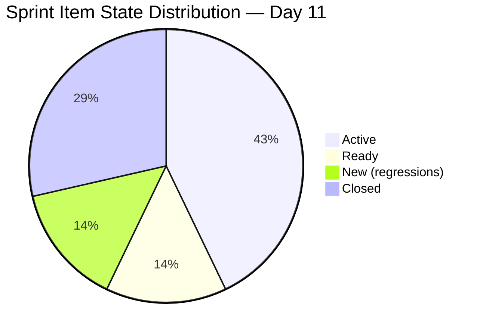
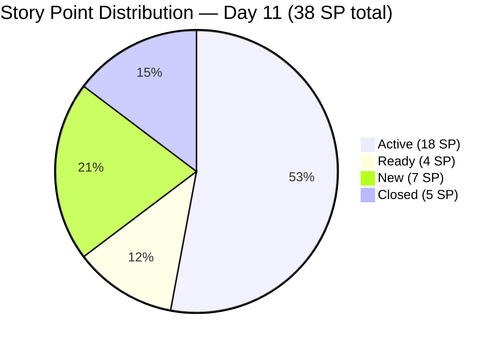

# ADO SAFe Iteration Audit — Administration Team
**Audit #30 | Iteration 7.1 (Apr 6–19, 2026) | Day 11 of 14 (79% elapsed)**

---

## 1. Audit Metadata

| Field | Value |
|---|---|
| **Audit Date** | April 16, 2026, 09:00 PHT |
| **Auditor** | Claude Code (ADO SAFe Audit Agent) |
| **Workspace** | `ado_admin` |
| **ADO Project** | Jairosoft FINOPS (`e0bb302f-40f9-46c3-8164-6f1acb317d63`) |
| **Team** | Administration Team (`a38a9c02-07ab-483d-a1e3-aff54e19e603`) |
| **Iteration** | Iteration 7.1 — Apr 6 to Apr 19, 2026 |
| **Iteration ID** | `82cc2229-0211-4fe2-9ee6-cc8d843dfab0` |
| **Sprint Day** | Day 11 of 14 (79% elapsed) |
| **Prior Audit** | AUDIT_20260413_0900.md (Audit #29, Score 78.8 — Moderate Risk) |
| **Scoring Model** | ADO SAFe v1 (7-dimension rubric) |
| **Overall Score** | **80.1 / 100** |
| **Risk Band** | **Low Risk** (≥ 80) |

---

## 2. Executive Summary

The Administration Team reaches **80.1 (Low Risk)** — a **+1.3 improvement** from the prior score of 78.8 on Day 8 (Apr 13) and the team's **first Low Risk classification in Iteration 7.1**. The breakthrough was driven by closure of **#202376 (Condo dues Cebu, 2 SP)** on April 15, bringing total delivered story points to **5 of 38 SP (13.2%)**.

Four items are now closed (202364, 202370, 202376, 202384 — all 1–2 SP operational items), and the visible backlog has contracted to 18 items as closed items dropped from the board view. With 3 sprint days remaining (Apr 16–19), 33 SP remain open across 10 active/ready/new items. At the current delivery rate, full sprint completion is not achievable; however, the team is trending positively and all process dimensions hold at 100.0 or near-perfect values.

Two state regressions first noted on Day 8 persist: **#201856 (Signage Canvass Approval, 2 SP)** and **#202357 (Fixation in rooftop Davao, 5 SP)** remain in New state and should be re-activated or removed from sprint scope. The single-contributor risk (Mark Colina) remains the structural constraint on delivery throughput.

---

## 3. Previous Audit Delta

| Dimension | Day 8 (Apr 13) | Day 11 (Apr 16) | Delta |
|---|---|---|---|
| Iteration Planning | 73.7 | 77.8 | +4.1 |
| Team Capacity | 100.0 | 100.0 | 0.0 |
| Estimation | 100.0 | 100.0 | 0.0 |
| DoR Compliance | 100.0 | 100.0 | 0.0 |
| Work Item Balance | 70.0 | 70.0 | 0.0 |
| Backlog Refinement | 100.0 | 100.0 | 0.0 |
| Delivery Predictability | 8.1 | 13.2 | +5.1 |
| **Overall** | **78.8** | **80.1** | **+1.3** |

**Key changes since Day 8 (Apr 13):**
- **#202376 Closed (Apr 15):** Condo dues Cebu (2 SP) closed, adding 2 SP to delivered total.
- **Visible backlog contracted from 19 to 18:** #202376 dropped from backlog view upon closure.
- **Iteration Planning ratio improved:** 14/18 = 77.8 (was 14/19 = 73.7 on Day 8).
- **Delivery Predictability ticked up:** 5/38 = 13.2% (was 3/37 = 8.1%).
- **#202297 (EGOV payables) updated Apr 15** — most recent activity on a 4 SP Active item, suggesting in-flight processing.
- **State regressions on #201856 and #202357 persist** — both remain in New state since Apr 13.

---

## 4. Current Iteration Snapshot

| Metric | Value |
|---|---|
| **Visible root backlog items** | 18 |
| **Current sprint items (Iteration 7.1)** | 14 |
| **Items outside sprint (7.2 pipeline)** | 4 |
| **Committed story points** | 38 SP |
| **Closed story points** | 5 SP (#202364, #202370, #202376, #202384) |
| **Remaining story points** | 33 SP |
| **Delivery rate (Day 11)** | 13.2% (5 of 38 SP) |
| **Active items** | 6 |
| **Ready items** | 2 |
| **New items** | 2 (state regressions) |
| **Closed items** | 4 |
| **Sole contributor** | Mark Colina |
| **Team capacity** | 5h/day (Deployment 1h + Documentation 2h + Requirements 2h) |
| **Days remaining** | 3 (Apr 17–19) |

### Sprint Item List (Iteration 7.1)

| ID | Title | Type | State | SP | DoR |
|---|---|---|---|---|---|
| 200613 | BFP certification renewal follow up | User Story | Ready | 1 | PASS |
| 200995 | Budget request for corrugated sheet | User Story | Active | 2 | PASS |
| 201856 | Signage Canvass Approval | User Story | **New** ⚠️ | 2 | PASS |
| 201984 | Utilities payables for Cebu and Davao | User Story | Active | 4 | PASS |
| 201992 | Payables - Internet for Davao and Cebu | User Story | Active | 4 | PASS |
| 202297 | Government (EGOV) payables | User Story | Active | 4 | PASS |
| 202353 | JIT BFP certificate renewal 2026 | User Story | Ready | 3 | PASS |
| 202357 | Fixation in rooftop (Davao) | Defect | **New** ⚠️ | 5 | PASS |
| **202364** | **DOLE WAIR report** | **User Story** | **Closed** | **1** | **PASS** |
| 202366 | Philgeps renewal for 2026 | User Story | Active | 3 | PASS |
| **202370** | **Toyota Hilux (Cebu)** | **User Story** | **Closed** | **1** | **PASS** |
| **202376** | **Condo dues (Cebu)** | **User Story** | **Closed** | **2** | **PASS** |
| **202384** | **Jairosoft food allowance** | **User Story** | **Closed** | **1** | **PASS** |
| 202493 | Davao Admin Adhoc Support Apr 6–19, 2026 | User Story | Active | 5 | PASS |

---

## 5. Work Item Analysis

### State Distribution

### Story Points by State

### Observations

- **4 items closed** (all 1–2 SP operational tasks): DOLE WAIR, Toyota Hilux, food allowance, Condo dues. None of the high-SP items (4–5 SP) have been closed.
- **State regressions on #201856 and #202357**: Both went New on Apr 13 and have not recovered. The Rooftop Fixation (#202357, 5 SP) and Signage Canvass (#201856, 2 SP) are collectively 7 SP at risk of becoming sprint carryover.
- **High-SP Active items**: EGOV payables (4 SP, updated Apr 15), Internet payables (4 SP), Utilities payables (4 SP), Davao Adhoc (5 SP) = 17 SP in WIP. These represent the sprint's remaining delivery potential.
- **#202297 updated Apr 15**: Most recent touch on a 4 SP Active item — suggests payment processing is in progress.
- **Title typo carried forward**: #202357 "Fixation in rooptop" — minor quality finding consistent with prior audit notes.

---

## 6. SAFe Compliance Scorecard

| Dimension | Score | Evidence | Notes |
|---|---|---|---|
| Iteration Planning | 77.8 | 14 of 18 visible items in sprint (78%) | 4 closed items removed from backlog view; 4 items in 7.2 pipeline. |
| Team Capacity | 100.0 | Mark Colina: 5h/day (Dep 1h + Doc 2h + Req 2h), no days off | Full capacity configured. |
| Estimation | 100.0 | 14/14 sprint items have SP > 0 | Total 38 SP committed. |
| DoR Compliance | 100.0 | 14/14 items: Desc ≥30 nws, AC ≥20 nws | All items well-documented. |
| Work Item Balance | 70.0 | 13 US + 1 Defect; US dominant at 92.9% > 60% → −30 | No spikes; structural penalty for type concentration. |
| Backlog Refinement | 100.0 | 18/18 items fresh (changed within 45 days); stale_90=0; untouched=0 | Excellent backlog hygiene. |
| Delivery Predictability | 13.2 | 5 closed SP / 38 committed SP | Day 11 of 14; 3 days remain for 33 SP. |
| **Overall** | **80.1** | Average of 7 dimensions | First Low Risk score for Iteration 7.1. |

---

## 7. Dimension Findings

### 1. Iteration Planning — 77.8
The planning ratio (14/18) reflects a well-scoped sprint. Four items closed have dropped from the visible backlog, and 4 pipeline items are staged in 7.2. The ratio would reach 100 if all 4 remaining backlog items outside the sprint were pulled in; however, with 3 days left, scope stabilization is appropriate.

### 2. Team Capacity — 100.0
Mark Colina maintains full capacity configuration (5h/day across 3 activities). No days off recorded. The single-contributor model means any disruption to Mark's availability directly impacts 100% of sprint delivery.

### 3. Estimation — 100.0
All 14 sprint items have story points assigned. Total commitment of 38 SP is the highest sprint commitment in recent PI history, which, combined with a single contributor, has contributed to the delivery gap.

### 4. DoR Compliance — 100.0
All 14 items pass the minimum DoR threshold (Description ≥30 nws, Acceptance Criteria ≥20 nws). This represents a mature acceptance-criteria practice and is a consistent strength for this team.

### 5. Work Item Balance — 70.0
13 User Stories and 1 Defect. The User Story dominance (92.9%) triggers the −30 type-concentration penalty. While operationally appropriate for an Admin team managing compliance and payables, the absence of any spikes or exploratory items may limit continuous improvement investment.

### 6. Backlog Refinement — 100.0
All 18 visible backlog items have been updated within 45 days. No stale_90 or stale_180 items. No sprint items were untouched since the iteration started. This is a standout strength — the Admin backlog is the most actively maintained of all audited teams.

### 7. Delivery Predictability — 13.2
Five story points delivered out of 38 committed (13.2%). With 3 days remaining and 33 SP open, the theoretical maximum delivery rate is constrained by Mark's 5h/day capacity. If 2–3 large items (4–5 SP each) are closed in the final 3 days, the score could reach 30–40%, but full completion (100%) is not realistic. The pattern of closing low-SP operational items first while high-SP items remain open is a recurrent risk.

---

## 8. Risks and Bottlenecks

| # | Risk | Severity | Trend |
|---|---|---|---|
| R1 | Single contributor (Mark Colina) — bus factor 1, delivery ceiling at 5h/day | High | Persistent |
| R2 | 33 SP remaining with 3 days left — structural over-commitment | High | Ongoing |
| R3 | State regressions: #201856 and #202357 remain New since Apr 13 | Medium | Unresolved |
| R4 | High-SP items (4–5 SP each) stalled in Active without recent closure | Medium | New |
| R5 | Title typo in #202357 ("rooptop") — minor quality indicator | Low | Persistent |

---

## 9. Prioritized Recommendations

1. **Prioritize closing at least 2 high-SP Active items** (e.g., EGOV payables 4 SP, Davao Adhoc 5 SP) before sprint end to meaningfully improve Delivery Predictability.
2. **Investigate and resolve state regressions** on #201856 and #202357. If blocked, move them to the next iteration or document the impediment in ADO.
3. **Reduce sprint over-commitment for PI7.2**: Plan at 5 SP per working day × 10 working days = ~50 SP theoretical max for a single contributor, but apply a 60% delivery factor, targeting ~20–25 SP per sprint.
4. **Consider capacity review**: Evaluate whether any other team member can absorb some administrative tasks to reduce the single-contributor bottleneck.
5. **Fix title typo** in #202357: "Fixation in rooptop (Davao)" → "Fixation in rooftop (Davao)".

---

## 10. Evidence Gaps and Limitations

- **Backlog outside sprint (7.2 pipeline) not fully detailed**: IDs 192221, 193412, 197023, 197028, 197029, 197111, 197113, 197115 are visible in the backlog but their detailed fields were not fetched. Prior audit confirmed these changed Apr 10 and are all New User Stories.
- **State regression root cause unknown**: The system shows #201856 and #202357 in New state since Apr 13 but no comment or revision history was pulled to confirm whether this is a workflow issue or a manual reset.
- **SP commitment denominator uses all sprint items**: If any items are added or removed post-audit, the Delivery Predictability denominator will shift.
