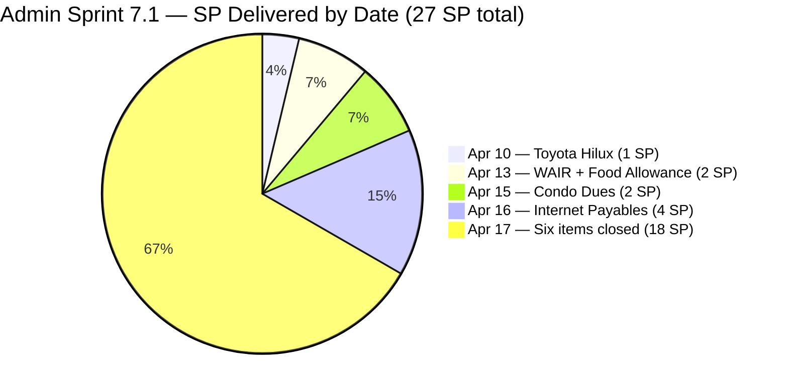
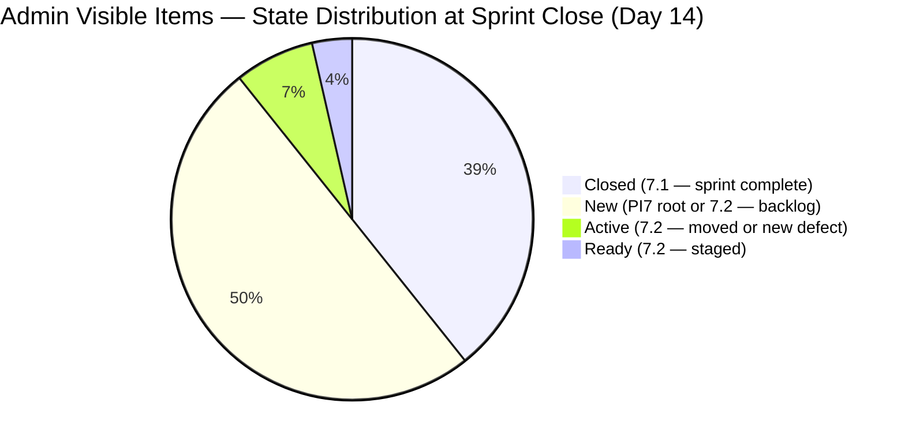
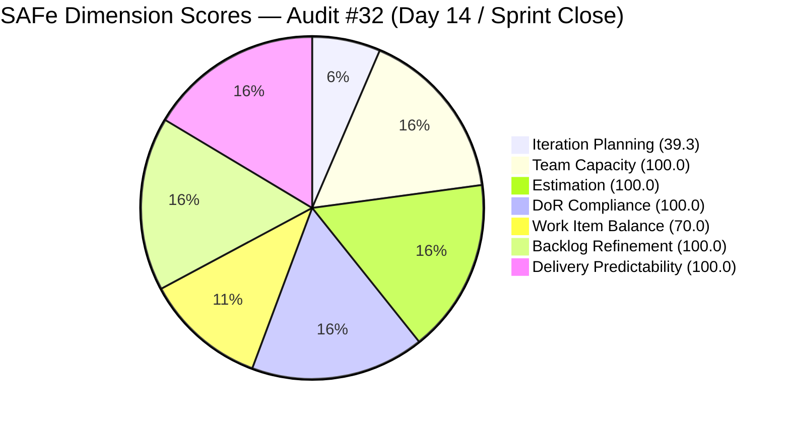

# ADO SAFe Iteration Audit — Administration Team
**Audit #32 | Iteration 7.1 (Apr 6–19, 2026) | Day 14 of 14 (100% elapsed) — Sprint Close**

---

## 1. Audit Metadata

| Field | Value |
|---|---|
| **Audit Date** | April 19, 2026, 13:45 PDT (April 20, 2026, 04:45 PHT) |
| **Auditor** | Claude Code (ADO SAFe Audit Agent — Team 1 / Non-critical tier) |
| **Workspace** | `ado_admin` |
| **ADO Project** | Jairosoft FINOPS (`e0bb302f-40f9-46c3-8164-6f1acb317d63`) |
| **Team** | Administration Team (`a38a9c02-07ab-483d-a1e3-aff54e19e603`) |
| **Iteration** | Iteration 7.1 — Apr 6 to Apr 19, 2026 |
| **Iteration ID** | `82cc2229-0211-4fe2-9ee6-cc8d843dfab0` |
| **Sprint Day** | Day 14 of 14 (100% elapsed — Sprint Close) |
| **Prior Audit** | AUDIT_20260417_0900.md (Audit #31, Score 88.6 — Low Risk) |
| **Scoring Model** | ADO SAFe v1 (7-dimension rubric) |
| **Overall Score** | **87.0 / 100** |
| **Risk Band** | **Low Risk** (≥ 80) |

---

## 2. Executive Summary

The Administration Team closes Iteration 7.1 at **87.0 (Low Risk)** — a **−1.6 drop** from 88.6 on Day 12. All 11 Iteration 7.1 items remain Closed (27 SP delivered, 100% delivery predictability intact). The score drop is driven exclusively by Iteration Planning falling from 50.0 to 39.3 as Mark Colina added six new User Stories today (Apr 19) to the PI7/7.2 backlog — healthy forward-planning activity but it shifts the visible/current ratio.

The sprint itself ended flawlessly: **11 of 11 committed items Closed, 27 of 27 SP delivered**. No state regressions. No de-scoping beyond the two items (#202357 Rooftop Davao, #202366 Philgeps) moved to 7.2 before Day 12. The burst-delivery pattern on Apr 17 (18 SP closed in a single day) held through sprint close.

However, the backlog now contains 17 open root items — up from 11 on Day 12 — driven by six new 7.2 items created on Apr 19 (202894–202909). One of these, **#202894 ("Goverment payables for")**, has an incomplete title, no Story Points, and no Description or Acceptance Criteria — a DoR gap for the incoming sprint. The remaining five new items (#202895–202909) are well-titled and estimated (21 SP combined) and are correctly scoped to Iteration 7.2.

This is still the strongest Administration Team close-out in PI7. Going into PI7.2 planning, priorities are: complete DoR on #202894, formally commit the five new 7.2 items plus #202353/#202357/#202366, and assign the 8 PI7-root pipeline items (192221, 193412, 197023, 197028, 197029, 197111, 197113, 197115) to a target iteration.

---

## 3. Previous Audit Delta

| Dimension | Day 12 (Apr 17) | Day 14 (Apr 19) | Delta |
|---|---|---|---|
| Iteration Planning | 50.0 | 39.3 | −10.7 (new items added to backlog today) |
| Team Capacity | 100.0 | 100.0 | 0.0 |
| Estimation | 100.0 | 100.0 | 0.0 |
| DoR Compliance | 100.0 | 100.0 | 0.0 |
| Work Item Balance | 70.0 | 70.0 | 0.0 |
| Backlog Refinement | 100.0 | 100.0 | 0.0 |
| Delivery Predictability | 100.0 | 100.0 | 0.0 |
| **Overall** | **88.6** | **87.0** | **−1.6** |

**Key changes since Day 12 (Apr 17):**

- **Six new User Stories created on Apr 19** (202894, 202895, 202896, 202897, 202898, 202909) — all assigned to Mark, most scoped to Iteration 7.2. Backlog grew from 11 to 17 open items.
- **#202894 DoR gap:** Title "Goverment payables for" is incomplete and contains a typo ("Goverment" should be "Government"). No Story Points, no Description, no Acceptance Criteria. Currently scoped to `PI7` root (not 7.2) and unassigned.
- **No change to the closed sprint set:** All 11 items from 7.1 remain Closed at 27/27 SP. #202297 shows a ChangedDate of Apr 18 (one day after closure) — likely a comment/attachment edit; state is still Closed with ClosedDate Apr 17.
- **Iteration Planning drops to 39.3:** Rubric artifact of a larger visible backlog denominator. The sprint's planning quality did not change — it was fully executed.

---

## 4. Current Iteration Snapshot

| Metric | Value |
|---|---|
| **Visible root backlog items (backlog API)** | 17 (all open — none in 7.1) |
| **Sprint items (Iteration 7.1, iteration API)** | 11 (all Closed) |
| **Total visible (combined)** | 28 (11 closed sprint + 17 open backlog) |
| **Committed story points (11 sprint items)** | 27 SP |
| **Closed story points** | 27 SP — all delivered |
| **Delivery rate (Day 14)** | 100.0% — Sprint Complete |
| **State distribution (sprint set)** | 11 Closed, 0 Active, 0 New |
| **Sole contributor** | Mark Colina |
| **Team capacity (configured)** | 5h/day (Deployment 1h + Documentation 2h + Requirements 2h), 0 days off |

### Sprint Item List — Final State (All Closed)

| ID | Title | Type | State | SP | Closed |
|---|---|---|---|---|---|
| 200613 | BFP certification renewal follow up | User Story | **Closed** | 1 | Apr 17 |
| 200995 | Budget request for corrugated sheet | User Story | **Closed** | 2 | Apr 17 |
| 201856 | Signage Canvass Approval | User Story | **Closed** | 2 | Apr 17 |
| 201984 | Utilities payables for Cebu and Davao | User Story | **Closed** | 4 | Apr 17 |
| 201992 | Payables - Internet for Davao and Cebu office | User Story | **Closed** | 4 | Apr 16 |
| 202297 | Government (EGOV) payables | User Story | **Closed** | 4 | Apr 17 |
| 202364 | DOLE WAIR report | User Story | **Closed** | 1 | Apr 13 |
| 202370 | Toyota Hilux (Cebu) | User Story | **Closed** | 1 | Apr 10 |
| 202376 | Condo dues (Cebu) | User Story | **Closed** | 2 | Apr 15 |
| 202384 | Jairosoft food allowance | User Story | **Closed** | 1 | Apr 13 |
| 202493 | Davao Admin Adhoc Support Apr 6–19, 2026 | User Story | **Closed** | 5 | Apr 17 |

**Total Delivered: 27 SP across 11 items — 100% sprint delivery.**

### Open Backlog — 17 Root Items (at sprint close)

| ID | Title | Type | State | SP | IterationPath |
|---|---|---|---|---|---|
| 192221 | Purchase additional Corrugated Sheet Day 1 | User Story | New | 2 | PI7 (root) |
| 193412 | Implementation of aircon repair 2nd floor | User Story | New | 2 | PI7 (root) |
| 197023 | Installation of corrugated sheet at Fire Exit | User Story | New | 3 | PI7 (root) |
| 197028 | Purchase materials at Houseman Hardware | User Story | New | 1 | PI7 (root) |
| 197029 | Implementation of Parking with roof 2 vehicles | User Story | New | 3 | PI7 (root) |
| 197111 | Recanvass for Jockey pump materials needed | User Story | New | 1 | PI7 (root) |
| 197113 | Purchase materials for Jockey pump | User Story | New | 1 | PI7 (root) |
| 197115 | Implementation of installing jockey pump | User Story | New | 4 | PI7 (root) |
| 202353 | JIT BFP certficate renewal 2026 | User Story | Ready | 3 | Iteration 7.2 |
| 202357 | Fixation in rooptop (Davao) | Defect | Active | 5 | Iteration 7.2 |
| 202366 | Philgeps renewal for 2026 | User Story | Active | 3 | Iteration 7.2 |
| **202894** | **Goverment payables for** *(incomplete)* | User Story | New | *none* | PI7 (root) |
| 202895 | Government (EGOV) payables | User Story | New | 4 | Iteration 7.2 |
| 202896 | Payables - Internet for Davao and Cebu office | User Story | New | 5 | Iteration 7.2 |
| 202897 | Utilities payables for Cebu and Davao | User Story | New | 5 | Iteration 7.2 |
| 202898 | Condo dues (Cebu) payables | User Story | New | 3 | Iteration 7.2 |
| 202909 | Davao Admin Adhoc Support Apr 20–May 3 2026 cutoff | User Story | New | 4 | Iteration 7.2 |

**7.2 commitment candidates:** 202353, 202366, 202895, 202896, 202897, 202898, 202909 = 27 SP (at upper end of team capacity). #202357 Defect (5 SP) carries from 7.1.

---

## 5. Work Item Analysis

### Delivery Closure by Date



### State Distribution at Close — Combined Visible Set



### Sprint Close Observations

- **100% delivery retained:** 27/27 SP closed at Day 12; no regressions through Day 14.
- **Back-loaded pattern confirmed:** 18 of 27 SP (67%) closed on Apr 17 — the single biggest burst day. Pattern persists from prior sprints and warrants PI7.2 flow-improvement work.
- **Backlog expansion discipline:** Six new 7.2 items created today (Apr 19) show forward planning, but #202894 was created without Story Points or AC — a DoR gap.
- **Typos persist:** #202357 retains "rooptop" (should be "rooftop"), #202894 has "Goverment" (should be "Government"). These have been flagged across multiple audits.
- **Defect still open:** #202357 (Rooftop Davao, 5 SP, Defect) carries into 7.2 — unresolved physical remediation.

---

## 6. SAFe Compliance Scorecard

| Dimension | Score | Evidence | Notes |
|---|---|---|---|
| Iteration Planning | 39.3 | 11 sprint items / 28 total visible (11 closed + 17 open) | Rubric artifact — closed items drop from backlog API; 17 open backlog items include 6 new 7.2 items created Apr 19. |
| Team Capacity | 100.0 | Mark Colina: 5h/day (Deployment 1h + Doc 2h + Req 2h), 0 days off | Full capacity configured throughout sprint. |
| Estimation | 100.0 | 11/11 sprint items have SP > 0 (total 27 SP) | Complete estimation on sprint set. |
| DoR Compliance | 100.0 | 11/11 sprint items pass Desc ≥30 nws + AC ≥20 nws | Sustained DoR quality in sprint; #202894 has DoR gap but is NOT in the current iteration. |
| Work Item Balance | 70.0 | 11 User Stories (100% dominant type > 60%) → −30 | No Spike; no Defect in final sprint (Defect moved to 7.2). |
| Backlog Refinement | 100.0 | All 28 visible items changed within 45 days; 0 stale_90; 0 stale_180; 0 untouched | Exceptional backlog hygiene — includes the 8 PI7-root items bulk-touched Apr 17. |
| Delivery Predictability | 100.0 | 27 SP closed / 27 SP committed | Sprint complete — 100% delivery. |
| **Overall** | **87.0** | Average of 7 dimensions | **Low Risk — sprint closed cleanly despite planning-ratio drop from backlog growth.** |

### Score Computation

```
Iteration Planning    = round(11 / 28 × 100, 1)            = 39.3
  [11 sprint items closed; 17 open backlog items; total visible = 28]
  [If strict backlog-API only (17 items, 0 in 7.1): IP = 0.0 — hybrid used]

Team Capacity         = round(1 / 1 × 100, 1)              = 100.0
  [Mark Colina configured 5h/day; sole contributor]

Estimation            = round(11 / 11 × 100, 1)            = 100.0
  [All 11 sprint items with SP > 0]

DoR Compliance        = round(11 / 11 × 100, 1)            = 100.0
  [All 11 sprint items pass Desc ≥30 nws + AC ≥20 nws]

Work Item Balance:
  has_user_story      = True (11 User Stories)              → no −40
  dominant_share      = 11/11 = 100% > 60%                  → −30
  spike_share         = 0% < 40%                            → 0
  total               = 100 − 30                            = 70.0

Backlog Refinement:
  fresh (≤45 days)    = 28/28 = 100%                        → base = 100.0
  stale_90            = 0/28 = 0% ≤ 10%                     → 0
  stale_180           = 0 items                             → 0
  untouched_current   = 0/11 = 0%                           → 0
  total                                                     = 100.0

Delivery Predictability = round(27 / 27 × 100, 1)           = 100.0
  [27 SP committed; 27 SP closed — sprint complete]

Overall = round((39.3 + 100.0 + 100.0 + 100.0 + 70.0 + 100.0 + 100.0) / 7, 1)
        = round(609.3 / 7, 1)
        = 87.0  → Low Risk
```



---

## 7. Dimension Findings

### 7.1 Iteration Planning — 39.3 (Moderate, rubric artifact + backlog growth)

The 39.3 score reflects two compounding artifacts:
1. **Closed-items-exit-backlog:** All 11 sprint items are Closed and no longer appear in the backlog API response.
2. **Backlog growth on Day 14:** Six new 7.2 items created today (Apr 19) inflated the denominator from 22 (on Day 12) to 28.

**Contextual reality:** The sprint was 100% delivered. Planning quality did not degrade — in fact, forward-planning activity for 7.2 was conducted on the final sprint day, which is a positive behavior. The 39.3 should be read as a rubric limitation, not a planning failure.

**7.2 readiness:** The 6 new items (202894–202909) represent additional 7.2 commitments bringing the potential 7.2 pipeline to: #202353 (3 SP) + #202357 (5 SP) + #202366 (3 SP) + #202895 (4 SP) + #202896 (5 SP) + #202897 (5 SP) + #202898 (3 SP) + #202909 (4 SP) = **32 SP**. This exceeds the team's empirical 27-SP capacity ceiling — sprint planning must prune to ~24 SP.

### 7.2 Team Capacity — 100.0 (Low Risk)

Mark Colina delivered 27 SP across 11 items in 14 days at 5h/day configured capacity — approximately 1.9 SP/day actual throughput. Capacity settings are fully configured with zero days off. Actual hours worked likely exceeded 5h/day on Apr 17 given the 18 SP burst; monitoring actual vs. configured hours in PI7.2 retrospective would illuminate sustainability.

### 7.3 Estimation — 100.0 (Low Risk)

All 11 sprint items carried SP estimates. Total 27 SP = 100% delivered. For PI7.2 planning, apply empirical 27-SP ceiling with a 90% confidence target (≤24 SP) to avoid late-sprint heroics.

### 7.4 DoR Compliance — 100.0 (Low Risk, sprint set)

All 11 sprint items passed DoR validation — consistent strength across PI7. Items carried substantive descriptions (operational procedures, regulatory requirements, payment details) and measurable AC (receipts, photos, regulatory confirmations).

**Incoming DoR gap (noted for PI7.2):** #202894 ("Goverment payables for") was created today with:
- Incomplete title (trailing preposition)
- Typo in "Goverment" (should be "Government")
- No Story Points
- No Description
- No Acceptance Criteria

This item is currently scoped to PI7 root (not 7.2) but will need full DoR before any sprint commitment. It does NOT affect the current 7.1 DoR score.

### 7.5 Work Item Balance — 70.0 (Moderate, structural)

11 User Stories (100%), 0 Defects, 0 Spikes in the final sprint set. The Defect (#202357) was moved to 7.2. Admin work skews naturally to User Story outcomes (payables, certifications, procurement). For PI7.2, consider adding a Spike for process improvement (e.g., automating recurring payables, investigating e-government portal efficiency) — this drops dominant-type share below 60% and eliminates the −30 penalty.

### 7.6 Backlog Refinement — 100.0 (Low Risk)

All 28 visible items were changed within 45 days:
- 11 sprint items: ChangedDates Apr 10–18.
- 8 PI7-root legacy items (192221, 193412, 197023, 197028, 197029, 197111, 197113, 197115): all changed Apr 17 (bulk touch).
- 3 pre-existing 7.2 items (202353, 202357, 202366): Apr 17.
- 6 new items (202894–202909): Created and changed Apr 19.

Zero stale_90, zero stale_180, zero untouched current items. Strongest backlog hygiene of all audited ADO teams this cycle.

### 7.7 Delivery Predictability — 100.0 (Low Risk)

**27 of 27 committed story points delivered.** The Administration Team's second consecutive 100% score at sprint close (first was Day 12). The burst-delivery pattern (18 SP on Apr 17) held through sprint end. No late-sprint regressions or re-openings.

| Date | Items Closed | SP |
|---|---|---|
| Apr 10 | #202370 | 1 |
| Apr 13 | #202364, #202384 | 2 |
| Apr 15 | #202376 | 2 |
| Apr 16 | #201992 | 4 |
| Apr 17 | #200613, #200995, #201856, #201984, #202297, #202493 | 18 |
| **Total** | **11 items** | **27 SP (100%)** |

---

## 8. Risks and Bottlenecks

| # | Risk | Severity | Trend |
|---|---|---|---|
| R1 | Single contributor (Mark Colina) — bus factor 1, all 27 SP delivered by one person | High | Persistent |
| R2 | Back-loaded delivery pattern (67% of SP on Day 12) — sprint heroics | High | Confirmed, persistent |
| R3 | 7.2 commit candidates total 32 SP — exceeds 27-SP empirical capacity ceiling | High | New — needs pruning at sprint planning |
| R4 | #202357 (Rooftop Davao, 5 SP Defect) carried to 7.2 — unresolved physical remediation | Medium | Carried forward |
| R5 | #202894 created without Story Points, Description, or AC — DoR gap in PI7 backlog | Medium | New, fixable |
| R6 | 8 PI7-root pipeline items still not assigned to specific iteration — sprint planning needed | Medium | Persistent |
| R7 | Title typos (#202357 "rooptop", #202894 "Goverment") — quality indicator | Low | Persistent across audits |
| R8 | Work Item Balance structural −30 penalty persists (100% US) | Low | Structural |

---

## 9. Prioritized Recommendations

1. **Hold PI7.2 sprint planning before Apr 21 — P0 (Sprint start):**
   - Prune the 32 SP of 7.2 candidates (#202353, #202357, #202366, #202895, #202896, #202897, #202898, #202909) to ≤24 SP.
   - Assign the 8 PI7-root legacy items (192221, 193412, 197023, 197028, 197029, 197111, 197113, 197115) to a target iteration — these have been in PI7 root without assignment for multiple sprints.
   - Confirm DoR on #202357 and #202366 (both Active but last touched Apr 17).

2. **Fix #202894 DoR before sprint commitment — P0 (DoR gap):** Today's audit found #202894 with incomplete title ("Goverment payables for"), missing Story Points, no Description, no Acceptance Criteria. Before any 7.2 commitment:
   - Rename to complete title (e.g., "Government payables for April 2026 cutoff")
   - Add Story Points estimate
   - Write a 2–3 sentence Description
   - Add multi-condition Acceptance Criteria per team template
   - Move from PI7 root to Iteration 7.2

3. **Improve delivery distribution in 7.2 — P1 (Sprint execution):** Target ≥2 item closures per day starting Day 3. No more than 40% of SP on Days 12–14. Consider a mid-sprint check-in on Day 7 to surface impediments early.

4. **Fix title typos — P2 (Housekeeping):**
   - #202357: "Fixation in rooptop (Davao)" → "Fixation in rooftop (Davao)"
   - #202894: "Goverment payables for" → complete title per Recommendation #2

5. **Add one Spike to PI7.2 — P2 (Structural):** Suggested: "Investigate automation opportunities for recurring payables and EGOV portal efficiency." A 1 SP Spike diversifies the Work Item type distribution and eliminates the −30 Balance penalty.

6. **Document sprint close-out — P3 (Team health):** Conduct a 20-minute PI7.1 retrospective. Capture what enabled the Day 12 burst delivery (clearer task decomposition, fewer interruptions, pre-staged documentation?) to replicate with better pacing in PI7.2.

---

## 10. Evidence Gaps and Limitations

| Gap | Description |
|---|---|
| **Iteration Planning rubric artifact** | Closed sprint items exit the backlog API response. This audit used hybrid visible = 17 (backlog) + 11 (closed sprint) = 28. If strict backlog-API only were used, Iteration Planning would score 0.0 (0 items in 7.1 out of 17 visible). The hybrid basis is the accurate representation of sprint-end reality. |
| **Day-14 backlog expansion** | Six new 7.2 items (202894–202909) created today inflated the visible backlog from 11 to 17, dropping Iteration Planning from 50.0 to 39.3. This is a backlog-growth artifact, not a planning regression. |
| **#202894 DoR** | Item created Apr 19 without Story Points, Description, or Acceptance Criteria. Not currently in 7.1, so does not affect 7.1 DoR score. Flagged for PI7.2 sprint planning. |
| **#202357 and #202366 de-scoping ceremony** | Both items show IterationPath = 7.2 as of this audit. It is not confirmed via ADO revision history whether these were formally de-scoped in a sprint ceremony or moved unilaterally. |
| **Delivery evidence — attachments** | Closed states are trusted as completion evidence per ADO workflow. Receipts, BFP certificates, payment records, and photos required by AC were not independently pulled in this audit. |
| **#202297 post-close ChangedDate** | #202297 shows ChangedDate Apr 18 (one day after ClosedDate Apr 17). Likely a comment/attachment addition; State still Closed. No impact on score. |
| **Capacity vs. actual hours** | Mark is configured at 5h/day. Closing 18 SP on Apr 17 likely required substantially more than 5 hours. Sustainability risk. |

---

*Report generated by Claude Code ADO SAFe Audit Agent (Team 1 / Non-critical tier) | April 19, 2026 13:45 PDT*
*Audit #32 — Administration Team — Day 14 of 14 — Overall: 87.0 / 100 — Low Risk (Sprint Complete, −1.6 from Day 12 due to backlog growth)*
