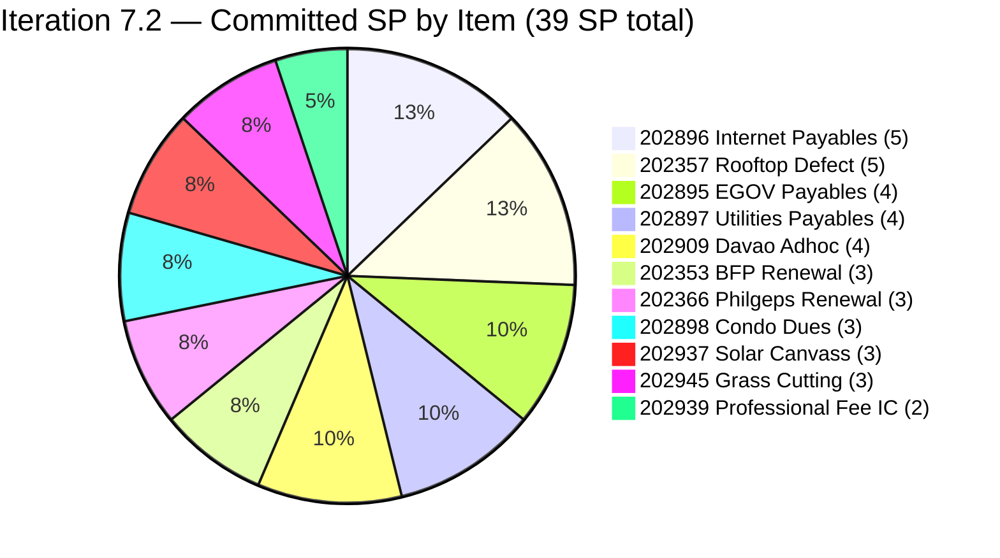
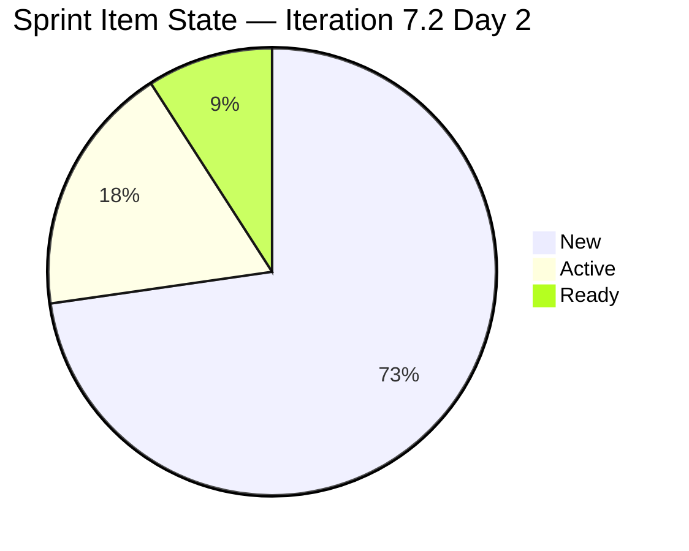
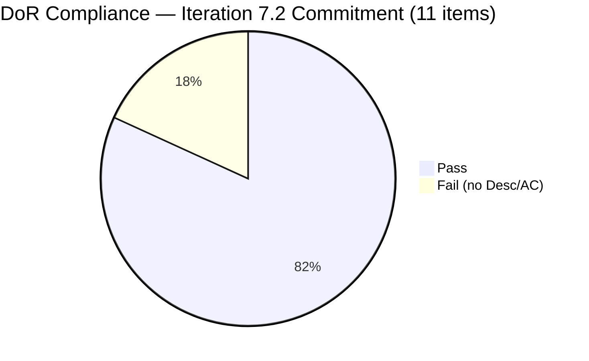
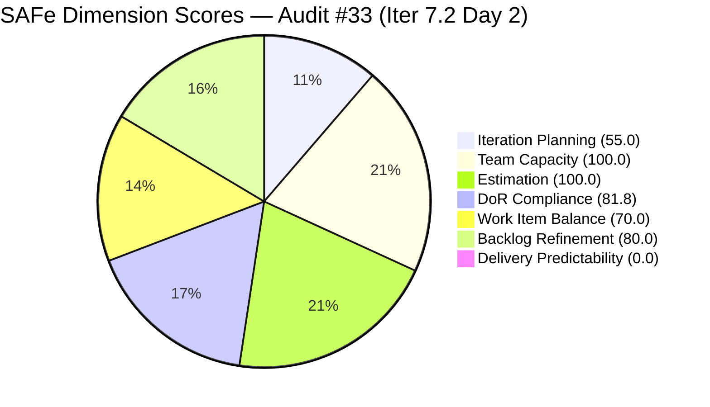

# ADO SAFe Iteration Audit — Administration Team

**Audit #33 | Iteration 7.2 (Apr 20 – May 3, 2026) | Day 2 of 14 (early-sprint)**

---

## 1. Audit Metadata

| Field | Value |
|---|---|
| **Audit Date** | April 21, 2026, 08:00 PDT |
| **Auditor** | Claude Code (ADO SAFe Audit Agent — `all-projects` batch, Team A) |
| **Workspace** | `ado_admin` |
| **ADO Project** | Jairosoft FINOPS (`e0bb302f-40f9-46c3-8164-6f1acb317d63`) |
| **Team** | Administration Team (`a38a9c02-07ab-483d-a1e3-aff54e19e603`) |
| **Iteration** | Iteration 7.2 — Apr 20 to May 3, 2026 |
| **Iteration ID** | `a9888bc5-48df-40dd-bcc8-6926a11aa7c7` |
| **Sprint Day** | Day 2 of 14 (early-sprint — Day 1–5 window) |
| **Prior Audit** | AUDIT_20260419_1345.md (Audit #32, 87.0 — Low Risk, PI7.1 close) |
| **Scoring Model** | ADO SAFe v1 (7-dimension rubric) |
| **Overall Score** | **69.5 / 100** |
| **Risk Band** | **Moderate Risk** (60 – 79.9) |

---

## 2. Executive Summary

The Administration Team opens Iteration 7.2 with a committed sprint of **11 root items totalling 39 SP** — a 44% over-commitment against the team's empirical 27-SP delivery ceiling from PI7.1. Mark Colina remains the sole assignee on every committed item. Planning quality in the sprint commitment is mixed: 9 of 11 items carry a substantive Description and Acceptance Criteria, but **2 items (#202898 Condo Dues, #202909 Davao Adhoc Support) were pulled into 7.2 without any Description or AC** and sit in New state — a DoR regression from the 100% sprint-set DoR posture sustained through PI7.1.

The overall score drops **−17.5** from the PI7.1 close-out (87.0 → 69.5) because a fresh sprint re-opens Delivery Predictability at 0.0 (early-sprint — no SP closed yet; no formula adjustment) and penalises Backlog Refinement by 20 for **5 of 11 current-iteration items whose last-changed date pre-dates the Apr 20 iteration start** — they were iteration-path'd in without in-sprint refinement. These are structural early-sprint artifacts, but the DoR gap (81.8) and the over-committed load are genuine risks.

The 9 PI7-root legacy items (192221, 193412, 197023, 197028, 197029, 197111, 197113, 197115, 202894) remain unassigned to a target iteration — carried over from the PI7.1 audit with no triage action in the 48 hours since. #202894 ("Goverment payables for") still shows the incomplete title, no SP, and no Description/AC flagged 48 hours ago.

Top actions for Day 2–3: (a) close DoR gaps on #202898 and #202909 before end of Day 3; (b) formally de-scope ~12 SP to stay within the 27-SP empirical capacity ceiling; (c) assign or close-out the 9 PI7-root legacy items.

---

## 3. Previous Audit Delta

| Dimension | PI7.1 Close (Apr 19) | PI7.2 Day 2 (Apr 21) | Delta |
|---|---|---|---|
| Iteration Planning | 39.3 | 55.0 | +15.7 |
| Team Capacity | 100.0 | 100.0 | 0.0 |
| Estimation | 100.0 | 100.0 | 0.0 |
| DoR Compliance | 100.0 | 81.8 | **−18.2** |
| Work Item Balance | 70.0 | 70.0 | 0.0 |
| Backlog Refinement | 100.0 | 80.0 | **−20.0** |
| Delivery Predictability | 100.0 | 0.0 | **−100.0** (early-sprint) |
| **Overall** | **87.0** | **69.5** | **−17.5** |

**Key changes since PI7.1 close (Apr 19):**

- **New sprint opened.** Iteration 7.2 started Apr 20 with 11 committed root items / 39 SP. Delivery Predictability resets to 0.0 on Day 2 — early-sprint, low delivery expected.
- **DoR regression:** #202898 (Condo dues, 3 SP) and #202909 (Davao Adhoc Support, 4 SP) were committed to 7.2 without any Description or Acceptance Criteria. Both remain in New state with Mark assigned.
- **New items created Apr 20:** #202937 (Solar canvass, 3 SP), #202939 (Professional fee for IC, 2 SP), #202945 (Grass cutting, 3 SP) — all well-DoR'd and added to 7.2 on Day 1.
- **#202894 unchanged:** Still has "Goverment payables for" title, no SP, no Description, no AC. Still scoped to PI7 root (not 7.2). Flagged in the PI7.1 close audit — no action taken.
- **9 PI7-root legacy items unchanged:** 192221, 193412, 197023, 197028, 197029, 197111, 197113, 197115, 202894 — last touched Apr 17 (bulk-edit) before PI7.2 opened. Still not assigned to a target iteration.
- **Backlog Refinement drops to 80.0:** 5 of 11 sprint items were not touched after the Apr 20 iteration start — the −20 untouched-current penalty kicks in. Items: #202353, #202357, #202366 (legacy 7.2 items from PI7.1 pipeline; last changed Apr 17), #202898, #202909 (created Apr 19, no edits after iter start).

---

## 4. Current Iteration Snapshot

| Metric | Value |
|---|---|
| **Visible root backlog items (backlog API)** | 20 |
| **Current iteration root items (Iter 7.2)** | 11 |
| **Committed story points** | 39 SP (44% over 27-SP empirical ceiling) |
| **Closed story points (Day 2)** | 0 SP |
| **Delivery rate (Day 2)** | 0.0% (early-sprint — Day 1–5) |
| **State distribution (sprint set)** | 8 New, 2 Active (#202357 Defect, #202366), 1 Ready (#202353) |
| **Sole contributor** | Mark Colina |
| **Team capacity (configured)** | 5h/day (Deployment 1h + Documentation 2h + Requirements 2h), 0 days off |
| **PI7-root legacy open items (not in 7.2)** | 9 (#192221, 193412, 197023, 197028, 197029, 197111, 197113, 197115, 202894) |

### Sprint Item List — Iteration 7.2 Commitment

| ID | Title | Type | State | SP | DoR | Last Changed |
|---|---|---|---|---|---|---|
| 202353 | JIT BFP certficate renewal 2026 | User Story | Ready | 3 | PASS | Apr 17 (pre-iter) |
| 202357 | Fixation in rooptop (Davao) | Defect | Active | 5 | PASS | Apr 17 (pre-iter) |
| 202366 | Philgeps renewal for 2026 | User Story | Active | 3 | PASS | Apr 17 (pre-iter) |
| 202895 | Government (EGOV) payables | User Story | New | 4 | PASS | Apr 20 |
| 202896 | Payables - Internet for Davao and Cebu office | User Story | New | 5 | PASS | Apr 20 |
| 202897 | Utilities payables for Cebu and Davao | User Story | New | 4 | PASS | Apr 20 |
| **202898** | **Condo dues (Cebu) payables** | User Story | New | 3 | **FAIL** (no Desc/AC) | Apr 19 (pre-iter) |
| **202909** | **Davao Admin Adhoc Support April 20–May 3 2026 cutoff** | User Story | New | 4 | **FAIL** (no Desc/AC) | Apr 19 (pre-iter) |
| 202937 | 3 vendors to site visit at Davao office for Solar panel qoutation | User Story | New | 3 | PASS | Apr 20 |
| 202939 | Professional fee for IC | User Story | New | 2 | PASS | Apr 20 |
| 202945 | Grass cutting outside at the building | User Story | New | 3 | PASS | Apr 20 |

**Committed: 39 SP across 10 User Stories + 1 Defect.** Over 27-SP empirical ceiling by 12 SP (44%).

### PI7-Root Legacy Items — Still Unassigned

| ID | Title | Type | SP | Created |
|---|---|---|---|---|
| 192221 | Purchase additional Corrugated Sheet and installation Day 1 | User Story | 2 | Sep 2025 |
| 193412 | Implementation of aircon repair 2nd floor | User Story | 2 | Oct 2025 |
| 197023 | Installation of corrugated sheet at Fire Exit | User Story | 3 | Jan 2026 |
| 197028 | Purchase materials at Houseman Hardware | User Story | 1 | Jan 2026 |
| 197029 | Implementation of Parking with roof for 2 vehicles (Day 1) | User Story | 3 | Jan 2026 |
| 197111 | Recanvass for Jockey pump materials needed | User Story | 1 | Jan 2026 |
| 197113 | Purchase materials for Jockey pump | User Story | 1 | Jan 2026 |
| 197115 | Implementation of installing jockey pump | User Story | 4 | Jan 2026 |
| 202894 | Goverment payables for *(incomplete title — DoR fail)* | User Story | — | Apr 19 |

---

## 5. Work Item Analysis

### Sprint Composition



### Sprint State Distribution



### DoR Status



### Observations

- **Over-commitment pattern persists.** PI7.1 committed 27 SP and delivered 27. PI7.2 commits 39 SP — 44% above proven capacity. Recommend pruning 12 SP at sprint planning review.
- **Two DoR gaps at sprint start.** #202898 and #202909 were created Apr 19 with titles only; iteration-pathed into 7.2 without any Description or Acceptance Criteria. Mark is assigned.
- **Sprint entry hygiene gap.** 5 of 11 items (#202353, #202357, #202366, #202898, #202909) have not been touched since before the Apr 20 iteration start — no sprint-kickoff grooming on Day 1.
- **Typos persist across audits.** "Goverment" (#202894), "rooptop" (#202357), "qoutation" (#202937). Persistent quality indicator.
- **9 PI7-root legacy items ignored.** 48 hours after the PI7.1 close-out recommendation, none of the 9 unassigned items have been assigned to an iteration or closed.

---

## 6. SAFe Compliance Scorecard

| Dimension | Score | Evidence | Notes |
|---|---|---|---|
| Iteration Planning | 55.0 | 11 of 20 visible root items scoped to Iter 7.2 | 9 PI7-root items remain un-iterated. |
| Team Capacity | 100.0 | Mark Colina: 5h/day (Deployment + Doc + Requirements); sole contributor with sprint work | Configured capacity at parity with sprint assignees. |
| Estimation | 100.0 | 11/11 sprint items carry SP > 0 | Total 39 SP committed. |
| DoR Compliance | 81.8 | 9/11 items pass Desc ≥30 nws + AC ≥20 nws | #202898 and #202909 have no Description and no AC. |
| Work Item Balance | 70.0 | 10 User Stories + 1 Defect; dominant share 10/11 = 90.9% > 60% → −30 | No Spike in 7.2. User Story present → no −40. |
| Backlog Refinement | 80.0 | fresh=20/20; stale_90=0; stale_180=0; untouched_current=5/11=45.5% > 30% → −20 | Base 100 minus untouched-current penalty. |
| Delivery Predictability | 0.0 | 0/39 SP closed at Day 2 | **Early-sprint — low delivery expected** (no formula adjustment). |
| **Overall** | **69.5** | Average of 7 dimensions | **Moderate Risk** |

### Score Computation

```
Iteration Planning    = round(11 / 20 × 100, 1)    = 55.0
Team Capacity         = round(1 / 1 × 100, 1)      = 100.0
Estimation            = round(11 / 11 × 100, 1)    = 100.0
DoR Compliance        = round(9 / 11 × 100, 1)     = 81.8

Work Item Balance:
  has_user_story      = True  (10 US)              → no −40
  dominant_share      = 10/11 = 90.9% > 60%        → −30
  spike_share         = 0/11 = 0%                  → 0
  total               = 100 − 30                   = 70.0

Backlog Refinement:
  fresh (≤45 days)    = 20/20 = 100%               → base = 100
  stale_90            = 0                          → 0
  stale_180           = 0                          → 0
  untouched_current   = 5/11 = 45.5% > 30%         → −20
  total               = 100 − 20                   = 80.0

Delivery Predictability = round(0 / 39 × 100, 1)   = 0.0
  (early-sprint annotation: Day 2 of 14 — low delivery expected)

Overall = round((55.0 + 100.0 + 100.0 + 81.8 + 70.0 + 80.0 + 0.0) / 7, 1)
        = round(486.8 / 7, 1)
        = 69.5  → Moderate Risk
```



---

## 7. Dimension Findings

### 7.1 Iteration Planning — 55.0 (High Moderate)

11 of 20 visible root items are scoped to Iteration 7.2. The remaining 9 items are legacy PI7-root items that have sat without iteration assignment since Jan 2026 (#197023–#197115) or earlier (#192221 from Sep 2025, #193412 from Oct 2025). These are backlog items the team has neither committed nor pruned. Moving them to a target iteration (or backlog) would lift this score materially. The newest unassigned item, #202894 ("Goverment payables for"), was flagged in the PI7.1 close audit with no remediation.

### 7.2 Team Capacity — 100.0 (Low Risk)

Mark Colina is configured at 5h/day (Deployment 1h + Documentation 2h + Requirements 2h) with zero days off across the 14-day sprint. Mark is the sole assignee across all 11 committed items — contributors_with_current_work = 1, contributors_with_capacity = 1. Rubric score 100.0. **Bus-factor risk remains High** (Risk R1) — no team-size change since PI7.1.

### 7.3 Estimation — 100.0 (Low Risk)

All 11 sprint items carry Story Points > 0 (range 2–5 SP, total 39 SP). **Commitment is 44% above the team's empirical 27-SP delivery ceiling** from PI7.1. Recommend de-scoping ~12 SP at sprint planning reconciliation to stay within proven capacity.

### 7.4 DoR Compliance — 81.8 (Low-end Moderate)

9 of 11 sprint items pass DoR (Description ≥30 non-whitespace + AC ≥20 non-whitespace). Two fail:

- **#202898 Condo dues (Cebu) payables (3 SP):** No Description, no Acceptance Criteria. State = New. Created Apr 19, iteration-pathed to 7.2 same day.
- **#202909 Davao Admin Adhoc Support April 20–May 3 2026 cutoff (4 SP):** No Description, no Acceptance Criteria. State = New. Created Apr 19, iteration-pathed to 7.2 same day.

Both items must be fully groomed before Day 3 (Apr 23) or formally de-scoped. The PI7.1 audit delivered a 100.0 DoR across all 11 sprint items — PI7.2 opens with a clear regression.

### 7.5 Work Item Balance — 70.0 (Moderate, structural)

10 User Stories + 1 Defect. Dominant type share = 10/11 = 90.9% > 60% → −30 penalty. No Spike in 7.2 — recommended for PI7.2 to drop dominant share and eliminate the penalty. Suggested Spike: "Investigate automation opportunities for recurring EGOV/payables workflow" (1–2 SP).

### 7.6 Backlog Refinement — 80.0 (Low-end Low)

All 20 visible items were changed within 45 days. Zero stale_90, zero stale_180. **Untouched-current penalty triggers (−20):** 5 of 11 sprint items (#202353, #202357, #202366, #202898, #202909) have not been touched since the Apr 20 iteration start — 45.5% exceeds the 30% threshold. The three legacy items (202353, 202357, 202366) were iteration-pathed during the Apr 17 bulk-edit; the two DoR-fail items (202898, 202909) were created Apr 19 with titles only. A Day 1 refinement session would have cleared both conditions.

### 7.7 Delivery Predictability — 0.0 (Early-sprint — low delivery expected)

Day 2 of 14. Zero story points closed. Iteration 7.2 runs Apr 20 – May 3. **Early-sprint annotation applied**: no formula adjustment per rubric. Normal expectation is <15% SP closed in first 5 days; the PI7.1 burst-delivery pattern concentrated 67% of SP in the final 3 days, which the team should consciously disrupt in PI7.2 by targeting ≥2 item closures/day starting Day 4.

---

## 8. Risks and Bottlenecks

| # | Risk | Severity | Trend |
|---|---|---|---|
| R1 | Single contributor (Mark Colina) — bus factor 1 on all 39 SP | High | Persistent |
| R2 | 44% over-commitment — 39 SP committed vs. 27-SP empirical ceiling | High | New (PI7.2) |
| R3 | DoR gaps on #202898 and #202909 at sprint open (Day 2) | High | New regression |
| R4 | 9 PI7-root legacy items still un-iterated — carried from PI7.1 audit recommendation | Medium | Persistent |
| R5 | #202894 (Goverment payables) still has incomplete title + no DoR | Medium | Unresolved from prior audit |
| R6 | 5 of 11 sprint items untouched after iteration start — missing Day 1 refinement | Medium | New (PI7.2) |
| R7 | Work Item Balance −30 structural penalty (no Spike) | Low | Structural |
| R8 | Title typos (#202357 "rooptop", #202894 "Goverment", #202937 "qoutation") | Low | Persistent |
| R9 | #202357 Rooftop Davao Defect (5 SP) carried from PI7.1 without physical remediation | Medium | Carried forward |

---

## 9. Prioritized Recommendations

1. **Complete DoR on #202898 and #202909 by end of Day 3 (Apr 23) — P0:**
   - #202898 (Condo dues, 3 SP): Add 2–3 sentence Description (Cebu condominium association fee for May cutoff) and AC (e.g., "Monthly condo dues fully settled by due date; OR and payment reference archived; statement reconciled against ledger").
   - #202909 (Davao Adhoc Support, 4 SP): Add Description outlining the Apr 20–May 3 support scope and AC (e.g., "All Davao admin support tickets for the cutoff window logged and resolved; cutoff report delivered to Ramon with attached receipts").
   - If DoR cannot be completed, de-scope to 7.3 backlog — reduces load by 7 SP.

2. **De-scope ~12 SP to honor 27-SP empirical ceiling — P0:** Current 39 SP is 44% over-commit. Candidates for de-scope (in order): #202945 Grass cutting (3 SP, lowest urgency), #202937 Solar canvass (3 SP, can slip to 7.3), #202909 Davao Adhoc (4 SP, if DoR not cleared), #202939 Professional fee IC (2 SP, if external payment timing allows). Target 24–27 SP commitment.

3. **Triage the 9 PI7-root legacy items by Day 3 — P1:** Reassign #197023, #197028, #197029, #197111, #197113, #197115 (jockey pump + parking bundle, 13 SP) to 7.3 or 7.4. Close #192221 and #193412 as stale if no longer applicable, or reassign. Fix #202894 title and DoR or close as duplicate of #202895.

4. **Fix title typos — P2:** #202357 "rooptop" → "rooftop"; #202937 "qoutation" → "quotation"; #202894 rename to proper title.

5. **Add one Spike to 7.2 — P2 (Structural):** Suggested: "Automation research for recurring EGOV payables and BPI/BIR portal workflow" (1–2 SP). Drops dominant-type share below 60%, eliminates −30 penalty.

6. **Day 1 refinement ritual in PI7.3 — P3 (Process):** Establish a 30-min Day 1 refinement session to ensure all committed items are touched and re-confirmed at sprint start. Would have prevented the 45.5% untouched-current penalty this sprint.

7. **Sustain delivery cadence target — P3 (Flow):** Target ≥2 item closures by Day 5 and ≥6 by Day 10 to avoid the PI7.1 Day-12 burst pattern. Review on Day 7.

---

## 10. Evidence Gaps and Limitations

| Gap | Description |
|---|---|
| **Early-sprint Delivery Predictability** | Day 2 of 14 inherently yields 0.0 on DP. Rubric applies the early-sprint annotation (Day 1–5 window) with no formula adjustment. Score reads truthfully as "no SP closed yet" and should not be interpreted as a sprint failure. |
| **202898 and 202909 grooming plan unknown** | Both items are in 7.2 without Description or AC. The audit cannot determine whether grooming is planned for later in the sprint or whether Mark intends to execute against the title alone. Direct confirmation with Ramon/Mark required. |
| **#202357 Rooftop Davao remediation status** | Active Defect carried from PI7.1 (5 SP). Last ChangedDate Apr 17. The audit cannot confirm whether the physical remediation is in progress, blocked on materials/vendor, or still pending canvass. |
| **9 PI7-root legacy items** | Items 192221/193412/197023/197028/197029/197111/197113/197115/202894 have no iteration-path assignment. Cannot tell if they are still in scope for PI7 at all or should be closed as deferred. |
| **Capacity vs. actual hours** | Mark is configured at 5h/day. The PI7.1 pattern showed single-day bursts of 18 SP — implying substantially more than 5 hours actual. Sustainability risk not visible in rubric. |
| **WSJF / Business Value fields** | Admin items continue to lack Business Value and Effort population (persistent finding from early audit series). Not scored by the current rubric but limits cross-team prioritisation. |

---

*Report generated by Claude Code ADO SAFe Audit Agent (Team A / `all-projects` batch) | April 21, 2026 08:00 PDT*
*Audit #33 — Administration Team — Iteration 7.2 Day 2 of 14 — Overall: 69.5 / 100 — Moderate Risk (early-sprint; PI7.1 closed at 87.0)*
