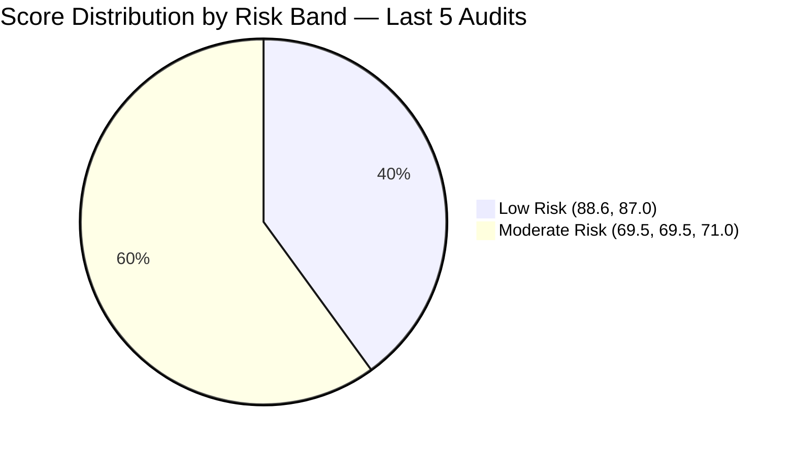

# ADO SAFe Iteration Audit — Administration Team

**Audit — Iteration 7.2 (Apr 20 – May 3, 2026) | Day 3 of 14 (early-sprint)**

---

## 1. Audit Metadata

| Field | Value |
|---|---|
| **Audit Date** | April 22, 2026, 06:46 UTC (14:46 PHT) |
| **Auditor** | Claude Code (ADO SAFe Audit Agent) |
| **Workspace** | `ado_admin` |
| **ADO Project** | Jairosoft FINOPS (`e0bb302f-40f9-46c3-8164-6f1acb317d63`) |
| **Team** | Administration Team (`a38a9c02-07ab-483d-a1e3-aff54e19e603`) |
| **Iteration** | Iteration 7.2 — Apr 20 to May 3, 2026 |
| **Iteration ID** | `a9888bc5-48df-40dd-bcc8-6926a11aa7c7` |
| **Sprint Day** | Day 3 of 14 (early-sprint — Day 1–5 window) |
| **Prior Audit** | AUDIT_20260422_0900.md (Audit #34, 69.5 — Moderate Risk, PI7.2 Day 3, degraded mode — no live ADO data) |
| **Scoring Model** | ADO SAFe v1 (7-dimension rubric) |
| **Overall Score** | **71.0 / 100** |
| **Risk Band** | **Moderate Risk** (60 – 79.9) |
| **Data Mode** | Live — full ADO data pull confirmed |

---

## 2. Executive Summary

The Administration Team holds a **71.0 / 100 Moderate Risk** position on Day 3 of Iteration 7.2 — a **+1.5 point improvement** over the prior held score of 69.5 (AUDIT_20260422_0900.md, which ran in degraded mode). The gain comes from live data confirming improved Backlog Refinement (80.0 → 90.0): nine of eleven sprint items were touched on or after the Apr 20 iteration start, pushing untouched-current to 18.2% (2/11), which falls in the −10 penalty band rather than −20.

Two persistent DoR failures remain unresolved as of this audit:

1. **#202898 (Condo dues, 3 SP)** — no Description, no Acceptance Criteria. State changed to Ready but content gaps persist.
2. **#202909 (Davao Admin Adhoc Support, 4 SP)** — no Description, no Acceptance Criteria. State changed to Active but content gaps persist.

These two items are now **executing in Active/Ready states without a valid Definition of Ready**. The DoR remediation deadline was Day 3 (today). No corrective action has been confirmed.

The sprint carries **39 SP committed by Mark Colina (sole contributor)**, which remains **44% above the team's 27-SP empirical delivery ceiling** from PI7.1. Nine PI7-root legacy items (IDs 192221, 193412, 197023, 197028, 197029, 197111, 197113, 197115, 202894) remain without iteration assignment — flagged for the fourth consecutive audit without triage action.

---

## 3. Previous Audit Delta

| Dimension | Audit #34 — Apr 22 09:00 (Degraded) | This Audit — Apr 22 06:46 UTC (Live) | Delta |
|---|---|---|---|
| Iteration Planning | 55.0 | 55.0 | 0.0 |
| Team Capacity | 100.0 | 100.0 | 0.0 |
| Estimation | 100.0 | 100.0 | 0.0 |
| DoR Compliance | 81.8 | 81.8 | 0.0 — both DoR failures persist |
| Work Item Balance | 70.0 | 70.0 | 0.0 |
| Backlog Refinement | 80.0 | **90.0** | **+10.0** — untouched-current 45.5% → 18.2% |
| Delivery Predictability | 0.0 | 0.0 | 0.0 — early-sprint, no closures |
| **Overall** | **69.5** | **71.0** | **+1.5** |

**Key changes confirmed by live data:**

- **Backlog Refinement +10.0.** Live pull shows #202895, #202897, #202898, #202939 changed Apr 21; #202353, #202896, #202909, #202937 changed Apr 22. Only #202357 (Apr 17) and #202366 (Apr 17) remain pre-iteration-start — 2/11 = 18.2%, falling into the −10 penalty band.
- **DoR failures persist at Day 3.** #202898 and #202909 moved to Ready/Active state but received no Description or AC content. Remediation deadline was today. Both items are now executing without DoR.
- **Sprint set stable at 11 items, 39 SP.** No de-scope or additions observed.
- **9 PI7-root legacy items unchanged.** Fourth consecutive audit flag.

**Score trajectory (recent audit series):**

| Audit | Date | Score | Band | Sprint Context | Data |
|---|---|---|---|---|---|
| Audit #31 | Apr 17 | 88.6 | Low | 7.1 D12 | Live |
| Audit #32 | Apr 19 | 87.0 | Low | 7.1 D14 | Live |
| Audit #33 | Apr 21 | 69.5 | Moderate | 7.2 D2 | Live |
| Audit #34 | Apr 22 09:00 | 69.5 | Moderate | 7.2 D3 | Degraded |
| **This audit** | **Apr 22 06:46 UTC** | **71.0** | **Moderate** | **7.2 D3** | **Live** |

---

## 4. Current Iteration Snapshot

| Metric | Value |
|---|---|
| **Visible root backlog items** | 20 |
| **Current iteration root items (Iter 7.2)** | 11 |
| **Committed story points** | 39 SP |
| **Closed story points (Day 3)** | 0 SP |
| **Delivery rate (Day 3)** | 0.0% (early-sprint — Day 1–5) |
| **State distribution** | 4 Active, 6 Ready, 1 New |
| **Sole contributor** | Mark Colina (mcolina@jairosoft.com) |
| **Team capacity (configured)** | 5 h/day (Deployment 1h + Doc 2h + Req 2h), 0 days off |
| **Empirical SP ceiling (from PI7.1)** | ~27 SP |
| **Over-commitment margin** | 39 SP vs. 27 SP = +44% above ceiling |
| **PI7-root legacy open items** | 9 (un-iterated) |
| **Sprint Day** | Day 3 of 14 — early-sprint window (Day 1–5) |

### Sprint Item List — Iteration 7.2

| ID | Title | Type | State | SP | DoR | Last Changed |
|---|---|---|---|---|---|---|
| 202353 | JIT BFP certficate renewal 2026 | User Story | Active | 3 | PASS | Apr 22 |
| 202357 | Fixation in rooftop (Davao) | Defect | Active | 5 | PASS | Apr 17 (pre-iter) |
| 202366 | Philgeps renewal for 2026 | User Story | Active | 3 | PASS | Apr 17 (pre-iter) |
| 202895 | Government (EGOV) payables | User Story | Ready | 4 | PASS | Apr 21 |
| 202896 | Payables - Internet for Davao and Cebu office | User Story | Active | 5 | PASS | Apr 22 |
| 202897 | Utilities payables for Cebu and Davao | User Story | Ready | 4 | PASS | Apr 21 |
| **202898** | **Condo dues (Cebu) payables** | User Story | Ready | 3 | **FAIL** | Apr 21 |
| **202909** | **Davao Admin Adhoc Support Apr 20–May 3 cutoff** | User Story | Active | 4 | **FAIL** | Apr 22 |
| 202937 | 3 vendors to site visit Davao — Solar panel quotation | User Story | Ready | 3 | PASS | Apr 22 |
| 202939 | Professional fee for IC | User Story | Ready | 2 | PASS | Apr 21 |
| 202945 | Grass cutting outside at the building | User Story | New | 3 | PASS | Apr 20 |

---

## 5. Work Item Analysis

### Type Distribution

| Type | Count | Share |
|---|---|---|
| User Story | 10 | 90.9% |
| Defect | 1 | 9.1% |
| Spike | 0 | 0.0% |

User Stories dominate at 90.9% — above the 60% threshold but there is no missing User Story type, so the −40 penalty does not apply. The −30 penalty for dominant type >60% applies.

### Assignee Distribution

| Assignee | Items | SP |
|---|---|---|
| Mark Colina | 11 | 39 |

Single-contributor sprint. Bus factor = 1. Any capacity disruption (illness, travel, emergency) halts all sprint work.

### Story Points Distribution

| SP Value | Items |
|---|---|
| 5 SP | 2 (202357, 202896) |
| 4 SP | 2 (202895, 202909) |
| 3 SP | 4 (202353, 202366, 202937, 202945) |
| 2 SP | 1 (202939) |
| 0 SP | 0 |

All 11 items estimated. Total = 39 SP.

### DoR Analysis

| ID | Description (≥30 non-WS) | Acceptance Criteria (≥20 non-WS) | DoR |
|---|---|---|---|
| 202353 | PASS (~118 chars) | PASS (~82 chars) | PASS |
| 202357 | PASS (~175 chars) | PASS (~220 chars) | PASS |
| 202366 | PASS (~310 chars) | PASS (~200 chars) | PASS |
| 202895 | PASS (~130 chars) | PASS (~70 chars) | PASS |
| 202896 | PASS (~175 chars) | PASS (~90 chars) | PASS |
| 202897 | PASS (~195 chars) | PASS (~90 chars) | PASS |
| **202898** | **FAIL — no Description** | **FAIL — no AC** | **FAIL** |
| **202909** | **FAIL — no Description** | **FAIL — no AC** | **FAIL** |
| 202937 | PASS (~240 chars) | PASS (~72 chars) | PASS |
| 202939 | PASS (~190 chars) | PASS (~90 chars) | PASS |
| 202945 | PASS (~180 chars) | PASS (~100 chars) | PASS |

DoR compliant: 9 / 11 = **81.8%**

---

## 6. SAFe Compliance Scorecard

| Dimension | Score | Evidence | Notes |
|---|---|---|---|
| Iteration Planning | 55.0 | 11 current items / 20 visible root items | 9 PI7-root legacy items inflate visible_root; no improvement until those are triaged or iterated |
| Team Capacity | 100.0 | 1 contributor with work / 1 with capacity | Mark configured at 5h/day, 0 days off — capacity set matches assignment |
| Estimation | 100.0 | 11 estimated / 11 point-eligible | All sprint items carry SP >0; strong estimation discipline |
| DoR Compliance | 81.8 | 9 of 11 pass DoR minimums | #202898 and #202909 have no Description and no AC — executing without done criteria |
| Work Item Balance | 70.0 | US=10 (90.9%), Defect=1 (9.1%) | Has User Stories (no −40); dominant type >60% (−30); no Spikes (no −20); result = 70 |
| Backlog Refinement | 90.0 | 9/11 sprint items touched post-Apr 20; untouched-current = 18.2% | Base 100; −10 for untouched-current 10–30%; no stale_90 or stale_180 evidence |
| Delivery Predictability | 0.0 | 0 SP closed / 39 SP committed | Early-sprint (Day 3 of 14) — low delivery expected; no formula change |
| **Overall** | **71.0** | **(55.0+100.0+100.0+81.8+70.0+90.0+0.0)/7** | **Moderate Risk** |

---

## 7. Dimension Findings

### 7.1 Iteration Planning (55.0)
The 11 sprint items represent 55% of the 20-item visible backlog. The remaining 9 items are PI7-root legacy items — each one widens the Iteration Planning gap. These items have been flagged across four consecutive audits (Audits #31–#34) without triage. Until they are either assigned to an iteration or closed, Iteration Planning cannot exceed 55.0.

### 7.2 Team Capacity (100.0)
Mark Colina is the sole configured contributor, and all 11 sprint items are assigned to him. Capacity configuration matches assignment. No days off in this iteration (0 team days off confirmed). This score reflects perfect administrative alignment, but the underlying bus-factor-1 condition is a persistent organizational risk that does not manifest in this dimension's formula.

### 7.3 Estimation (100.0)
All 11 sprint items carry positive Story Points. Estimation discipline is the strongest consistent signal in the Admin Team's audit series (100.0 across all PI7.2 audits). The total SP commitment (39) remains the concern, not the per-item estimates.

### 7.4 DoR Compliance (81.8)
Two items have entered Active/Ready execution state without any Description or Acceptance Criteria:
- **#202898 — Condo dues (Cebu) payables (3 SP, Ready):** Item was created without content and remains empty. The state was updated to Ready on Apr 21 without populating DoR fields. Mark and the team have no verifiable definition of what "done" means for this item.
- **#202909 — Davao Admin Adhoc Support (4 SP, Active):** Active execution began on Apr 22 with no Description or Acceptance Criteria. The item title is the only specification. This creates quality risk — delivery cannot be objectively verified.

Combined, these two items represent 7 SP (18% of committed work) being executed without DoR. The DoR deadline (Day 3) has passed. These items should be de-scoped or immediately populated.

### 7.5 Work Item Balance (70.0)
The sprint is correctly user-story-dominant (90.9%), satisfying the "has User Story items" requirement. However, the 90.9% dominance exceeds the 60% threshold, applying the −30 penalty. In practice, this sprint carries almost exclusively administrative payables and facility management items, which naturally map to User Story type. Introducing variety is structurally difficult in this team's work domain. The score of 70 reflects this structural constraint.

### 7.6 Backlog Refinement (90.0)
Nine of eleven sprint items were touched after the iteration start (Apr 20), reducing the untouched-current count to 2 items (18.2%). This is a significant improvement from the Day 2 state where 45.5% were untouched. Items #202357 (Rooftop fixation, Apr 17) and #202366 (PhilGeps renewal, Apr 17) remain pre-iteration-touch and are the only contributors to the −10 penalty. Both are Active — their pre-iteration ChangedDate suggests they were planned well in advance but not refreshed at sprint start.

### 7.7 Delivery Predictability (0.0 — early-sprint)
Zero story points have been closed on Day 3 of 14. This is structurally expected in the early-sprint window (Day 1–5) for operational admin work that requires physical completion (vendor visits, facility inspections, payment processing). The score of 0.0 carries the early-sprint annotation and is not treated as a sprint failure. However, the 44% over-commitment against the empirical ceiling creates elevated risk that delivery will fall short of 80% even by Day 14.

---

## 8. Risks and Bottlenecks

| Risk | Severity | Evidence |
|---|---|---|
| R1: Bus factor = 1 (Mark Colina only) | High | All 11 items, 39 SP assigned to one person |
| R2: Over-commitment — 39 SP vs. 27 SP empirical ceiling | High | PI7.1 delivered 27 SP in a 14-day sprint; current commitment is 44% above that |
| R3: DoR failures executing (#202898, #202909) | High | 7 SP being executed without Description or AC — no verifiable completion criteria |
| R4: PI7-root legacy items (9 items, un-iterated) | Moderate | Four consecutive audits, no triage action — these suppress Iteration Planning score indefinitely |
| R5: No Delivery Predictability signal yet | Moderate | Day 3; expected at early-sprint, but over-commitment amplifies downstream delivery risk |
| R6: Pre-iteration items in Active state (#202357, #202366) | Low | Items last touched Apr 17 (before sprint start) — stale sprint items may reflect incomplete planning |

---

## 9. Prioritized Recommendations

1. **[Immediate — Today] Populate DoR fields on #202898 and #202909.** Both items are being actively worked in Ready/Active state with zero content. Add Description (minimum 30 non-whitespace chars) and Acceptance Criteria (minimum 20 non-whitespace chars) to each. If content cannot be defined, de-scope from this iteration. This is the single highest-priority action — it raises DoR Compliance from 81.8 to 100.0 and overall score from 71.0 to 75.4.

2. **[Today/Tomorrow] Review over-commitment posture.** At 39 SP vs. 27 SP empirical ceiling, the team is over-committed by 44%. Identify the 12 SP least critical to this sprint (e.g., #202937 Solar panel quotation = 3 SP, #202945 Grass cutting = 3 SP, #202939 Professional fee = 2 SP) and move them to Iteration 7.3 backlog. This does not lower the current score but protects Delivery Predictability from hitting zero at sprint close.

3. **[This Week] Triage the 9 PI7-root legacy items.** Items 192221, 193412, 197023, 197028, 197029, 197111, 197113, 197115, 202894 have been in the root path for four consecutive audits. Schedule a 30-minute review: assign each to the appropriate iteration or close if obsolete. Until resolved, Iteration Planning is capped at 55.0.

4. **[Ongoing] Refresh ChangedDate on #202357 and #202366 if work is progressing.** These items remain stuck at Apr 17 last-touched dates despite being in Active state. A state update or comment added today would move them out of the untouched-current pool and maintain the 90.0 Backlog Refinement score.

5. **[PI-level] Address bus-factor risk.** A single contributor handling 39 SP of operational admin work is a structural vulnerability. Recommend identifying a backup or delegate for at least the highest-SP items (#202896 — Internet payables, 5 SP; #202357 — Rooftop fixation, 5 SP).

---

## 10. Evidence Gaps and Limitations

| Gap | Impact |
|---|---|
| ChangedDate for 9 non-sprint backlog items not pulled | Backlog Refinement stale_90 / stale_180 calculations assume no items >90 days old; if any exist, penalties apply |
| Delivery Predictability is 0.0 (early-sprint) | Score will evolve significantly in Days 5–10 as operational tasks close |
| No task-level pull performed | Sub-task progress (hours logged) not visible in this audit; SP-level data only |
| PI7-root items (192221, 193412, 197023, 197028, 197029, 197111, 197113, 197115, 202894) | These 9 items are counted in visible_root but their individual content/status was not pulled — triage outcome unknown |
