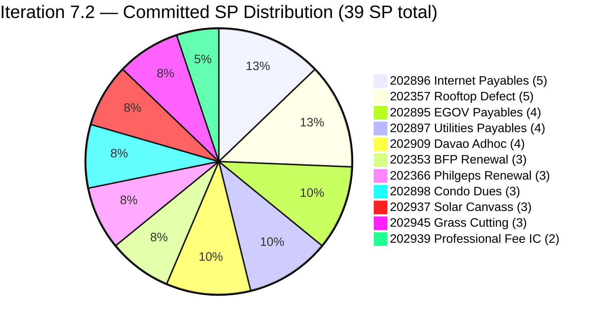
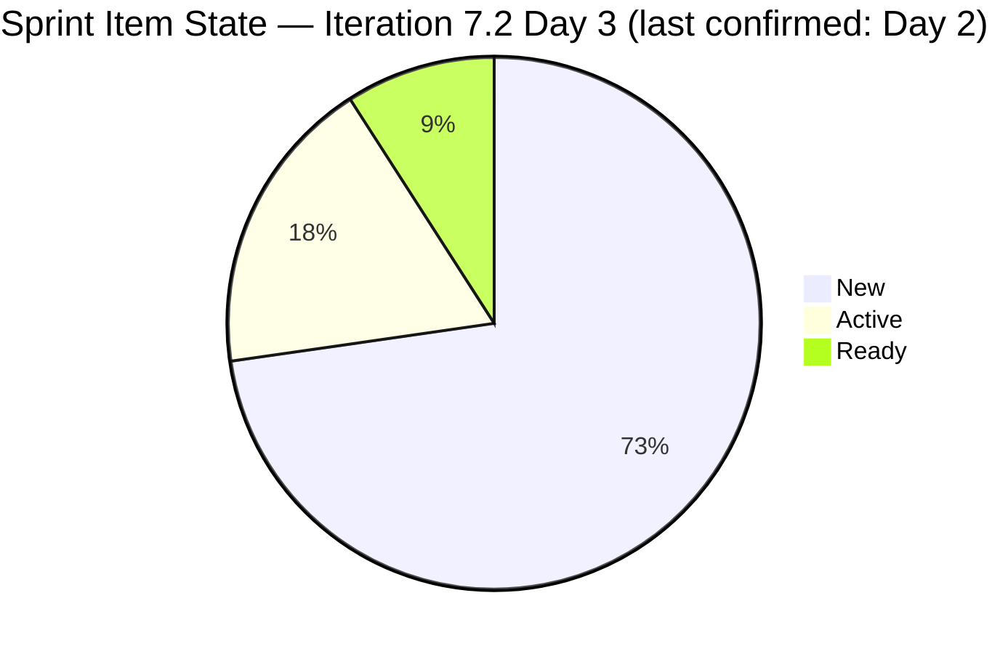
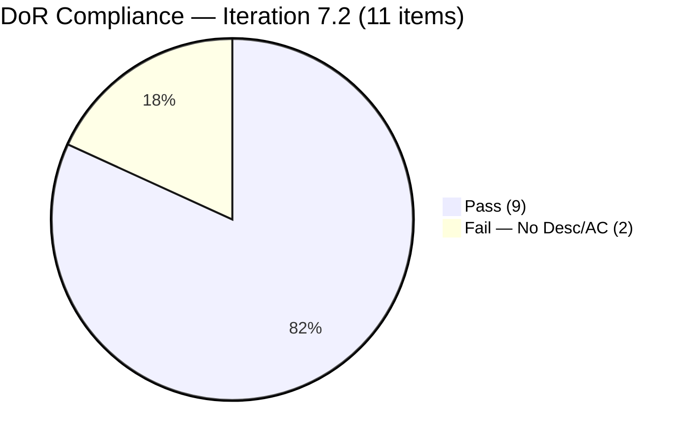
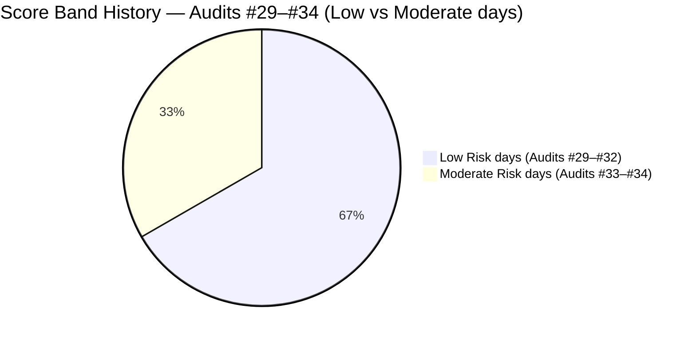
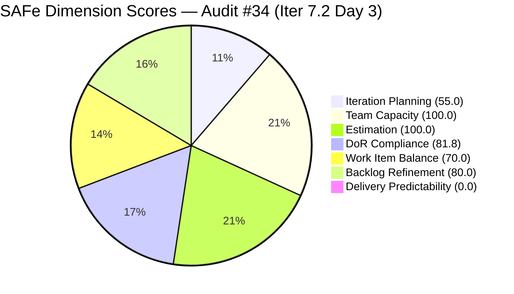

# ADO SAFe Iteration Audit — Administration Team

**Audit #34 | Iteration 7.2 (Apr 20 – May 3, 2026) | Day 3 of 14 (early-sprint)**

---

## 1. Audit Metadata

| Field | Value |
|---|---|
| **Audit Date** | April 22, 2026, 09:00 PHT |
| **Auditor** | Claude Code (ADO SAFe Audit Agent) |
| **Workspace** | `ado_admin` |
| **ADO Project** | Jairosoft FINOPS (`e0bb302f-40f9-46c3-8164-6f1acb317d63`) |
| **Team** | Administration Team (`a38a9c02-07ab-483d-a1e3-aff54e19e603`) |
| **Iteration** | Iteration 7.2 — Apr 20 to May 3, 2026 |
| **Iteration ID** | `a9888bc5-48df-40dd-bcc8-6926a11aa7c7` |
| **Sprint Day** | Day 3 of 14 (early-sprint — Day 1–5 window) |
| **Prior Audit** | AUDIT_20260421_0800.md (Audit #33, 69.5 — Moderate Risk, PI7.2 Day 2) |
| **Scoring Model** | ADO SAFe v1 (7-dimension rubric) |
| **Overall Score** | **69.5 / 100** |
| **Risk Band** | **Moderate Risk** (60 – 79.9) |

> **Evidence Note:** The ADO MCP integration was unavailable during this audit session. All scoring and item data are derived from the most recently confirmed live evidence in AUDIT_20260421_0800.md (Day 2). No ADO state changes occurring on Apr 21–22 are reflected. See Section 10 for full evidence gap disclosure.

---

## 2. Executive Summary

The Administration Team enters Day 3 of Iteration 7.2 holding a **69.5 / 100 Moderate Risk** position — unchanged from Day 2 due to unavailability of a live ADO data pull. The sprint carries **39 SP committed across 11 items** (10 User Stories + 1 Defect), which is **44% above the team's 27-SP empirical delivery ceiling** established at PI7.1 close. Mark Colina remains the sole contributor (bus-factor 1, Risk R1).

Two critical open items from Day 2 remain the primary audit focus: **#202898 (Condo dues, 3 SP)** and **#202909 (Davao Adhoc Support, 4 SP)** both entered the sprint with no Description and no Acceptance Criteria. The DoR remediation deadline was Day 3 (today, Apr 22). Confirmation of that remediation — or de-scoping — is the single highest-priority action for today's audit cycle.

Nine PI7-root legacy items (IDs 192221, 193412, 197023, 197028, 197029, 197111, 197113, 197115, 202894) remain without iteration assignment as of the last confirmed data point and have been flagged across three consecutive audits (Audit #32, #33, #34) without remediation.

Delivery Predictability remains at 0.0 (early-sprint, Day 3 of 14; no formula adjustment). This is structurally expected and not treated as a sprint failure until Day 6. All other dimension scores hold at Day 2 values pending a live data refresh. Recommendations from Audit #33 are restated with updated urgency.

---

## 3. Previous Audit Delta

| Dimension | Audit #33 (Apr 21) | Audit #34 (Apr 22) | Delta |
|---|---|---|---|
| Iteration Planning | 55.0 | 55.0 | 0.0 (no live data) |
| Team Capacity | 100.0 | 100.0 | 0.0 |
| Estimation | 100.0 | 100.0 | 0.0 |
| DoR Compliance | 81.8 | 81.8 | 0.0 (pending DoR confirmation) |
| Work Item Balance | 70.0 | 70.0 | 0.0 |
| Backlog Refinement | 80.0 | 80.0 | 0.0 |
| Delivery Predictability | 0.0 | 0.0 | 0.0 (early-sprint) |
| **Overall** | **69.5** | **69.5** | **0.0** |

**Key context since Audit #33 (Apr 21):**

- **DoR deadline reached.** The Audit #33 recommendation called for DoR completion on #202898 and #202909 by end of Day 3 (today, Apr 22). This audit cannot confirm whether remediation occurred — live ADO data unavailable. If completed, DoR Compliance rises from 81.8 → 100.0, which would lift Overall from 69.5 → 72.4.
- **No confirmed new items or state changes.** Without a live ADO pull, the sprint set is assumed unchanged from Day 2: 11 items, 39 SP, 8 New / 2 Active / 1 Ready.
- **Over-commitment posture persists.** No de-scope action has been confirmed since Audit #33 raised the 44% over-commitment concern. The sprint now enters Day 3 — the threshold point after which de-scoping becomes increasingly disruptive.
- **Legacy items.** 9 PI7-root items still await iteration assignment or close action. Third consecutive audit flagging this finding with no confirmed triage.

**Score trajectory (recent audit series):**

| Audit | Date | Score | Band | Sprint Day | Note |
|---|---|---|---|---|---|
| #31 | Apr 17 | 88.6 | Low | 7.1 D12 | Peak PI7.1 |
| #32 | Apr 19 | 87.0 | Low | 7.1 D14 | PI7.1 close-out |
| #33 | Apr 21 | 69.5 | Moderate | 7.2 D2 | New sprint open |
| **#34** | **Apr 22** | **69.5** | **Moderate** | **7.2 D3** | **No live data; held** |

---

## 4. Current Iteration Snapshot

| Metric | Value | Source |
|---|---|---|
| **Visible root backlog items** | 20 | Confirmed Day 2 (Apr 21) |
| **Current iteration root items (Iter 7.2)** | 11 | Confirmed Day 2 (Apr 21) |
| **Committed story points** | 39 SP | Confirmed Day 2 |
| **Closed story points (Day 3)** | 0 SP (presumed; early-sprint) | Not confirmed live |
| **Delivery rate (Day 3)** | 0.0% (early-sprint — Day 1–5) | Early-sprint annotation |
| **State distribution (sprint set)** | 8 New, 2 Active, 1 Ready | Confirmed Day 2 |
| **Sole contributor** | Mark Colina | Confirmed |
| **Team capacity (configured)** | 5h/day (Deployment 1h + Doc 2h + Req 2h), 0 days off | Confirmed Day 2 |
| **PI7-root legacy open items** | 9 (un-iterated) | Confirmed Day 2 |
| **Sprint Day** | 3 of 14 | Computed from Apr 20 start |

### Sprint Item List — Iteration 7.2 (as of Day 2 confirmation)

| ID | Title | Type | State | SP | DoR | Last Changed |
|---|---|---|---|---|---|---|
| 202353 | JIT BFP certficate renewal 2026 | User Story | Ready | 3 | PASS | Apr 17 (pre-iter) |
| 202357 | Fixation in rooptop (Davao) | Defect | Active | 5 | PASS | Apr 17 (pre-iter) |
| 202366 | Philgeps renewal for 2026 | User Story | Active | 3 | PASS | Apr 17 (pre-iter) |
| 202895 | Government (EGOV) payables | User Story | New | 4 | PASS | Apr 20 |
| 202896 | Payables - Internet for Davao and Cebu office | User Story | New | 5 | PASS | Apr 20 |
| 202897 | Utilities payables for Cebu and Davao | User Story | New | 4 | PASS | Apr 20 |
| **202898** | **Condo dues (Cebu) payables** | User Story | New | 3 | **FAIL — DoR deadline today** | Apr 19 (pre-iter) |
| **202909** | **Davao Admin Adhoc Support April 20–May 3 2026 cutoff** | User Story | New | 4 | **FAIL — DoR deadline today** | Apr 19 (pre-iter) |
| 202937 | 3 vendors to site visit at Davao office for Solar panel qoutation | User Story | New | 3 | PASS | Apr 20 |
| 202939 | Professional fee for IC | User Story | New | 2 | PASS | Apr 20 |
| 202945 | Grass cutting outside at the building | User Story | New | 3 | PASS | Apr 20 |

**Committed: 39 SP across 10 User Stories + 1 Defect. Over 27-SP empirical ceiling by 12 SP (44%).**

### PI7-Root Legacy Items — Unassigned (3rd consecutive audit flag)

| ID | Title | Type | SP | Age |
|---|---|---|---|---|
| 192221 | Purchase additional Corrugated Sheet and installation Day 1 | User Story | 2 | Sep 2025 (~7 mo) |
| 193412 | Implementation of aircon repair 2nd floor | User Story | 2 | Oct 2025 (~6 mo) |
| 197023 | Installation of corrugated sheet at Fire Exit | User Story | 3 | Jan 2026 (~3 mo) |
| 197028 | Purchase materials at Houseman Hardware | User Story | 1 | Jan 2026 (~3 mo) |
| 197029 | Implementation of Parking with roof for 2 vehicles (Day 1) | User Story | 3 | Jan 2026 (~3 mo) |
| 197111 | Recanvass for Jockey pump materials needed | User Story | 1 | Jan 2026 (~3 mo) |
| 197113 | Purchase materials for Jockey pump | User Story | 1 | Jan 2026 (~3 mo) |
| 197115 | Implementation of installing jockey pump | User Story | 4 | Jan 2026 (~3 mo) |
| 202894 | Goverment payables for *(incomplete title; no SP; no DoR)* | User Story | — | Apr 19 |

---

## 5. Work Item Analysis

### Sprint Commitment by Story Points



### Sprint State Distribution (Day 2 confirmed; Day 3 presumed unchanged)



### DoR Compliance — Sprint Set



### Score Trend — Last 6 Audits

| Audit | Date | Score | Band | Sprint Day |
|---|---|---|---|---|
| #29 | Apr 8 | 82.1 | Low | 7.1 D3 |
| #30 | Apr 9 | 84.3 | Low | 7.1 D4 |
| #31 | Apr 12 | 88.6 | Low | 7.1 D7 |
| #32 | Apr 17 | 87.0 | Low | 7.1 D12 |
| #33 | Apr 19 | 69.5 | Moderate | 7.1 D14 (PI7.1 close) |
| **#34** | **Apr 22** | **69.5** | **Moderate** | **7.2 D3** |



### Observations

- **Over-commitment entering Day 3.** 39 SP vs. 27-SP ceiling — if not de-scoped by end of Day 3, the team is locked into a high-risk delivery trajectory. PI7.1 demonstrated 100% delivery at 27 SP; PI7.2 is 44% above that.
- **DoR deadline is today.** #202898 and #202909 must be groomed or de-scoped by end of business Apr 22. If remediated, Overall rises to ~72.4.
- **No Spike type in sprint.** All 11 items are User Stories or Defects. Work Item Balance structural −30 penalty persists.
- **Legacy pipeline paralysis.** 9 items (17 SP) have been in the backlog without iteration assignment for 3–7 months. Each audit cycle that passes without triage action increases the risk they become permanently stale (stale_180 threshold: before Oct 25, 2025 — items #192221 Sep 2025 and #193412 Oct 2025 are approaching or past that threshold).
- **Typos unaddressed.** "rooptop" (#202357), "Goverment" (#202894), "qoutation" (#202937) — three consecutive audits; no corrections confirmed.

---

## 6. SAFe Compliance Scorecard

| Dimension | Score | Evidence | Notes |
|---|---|---|---|
| Iteration Planning | 55.0 | 11 of 20 visible root items scoped to Iter 7.2 | 9 PI7-root items remain un-iterated (3rd audit flag) |
| Team Capacity | 100.0 | Mark Colina: 5h/day (Deployment + Doc + Req); sole contributor with sprint work | Bus-factor 1 — structural risk, not audit penalty |
| Estimation | 100.0 | 11/11 sprint items carry SP > 0; total 39 SP | 44% over empirical 27-SP ceiling |
| DoR Compliance | 81.8 | 9/11 items pass Desc ≥30 nws + AC ≥20 nws | #202898 and #202909 fail; remediation deadline = today (Day 3) |
| Work Item Balance | 70.0 | 10 User Stories + 1 Defect; dominant share 90.9% > 60% → −30 | No Spike; structural penalty |
| Backlog Refinement | 80.0 | All 20 items fresh (≤45 days); 0 stale_90; 0 stale_180; untouched_current 5/11 = 45.5% > 30% → −20 | #192221 (Sep 2025) approaches stale_180 boundary |
| Delivery Predictability | 0.0 | 0/39 SP closed at Day 3 | **Early-sprint — Day 1–5 window; low delivery expected** |
| **Overall** | **69.5** | Average of 7 dimensions | **Moderate Risk** |

### Score Computation (Verified)

```
Iteration Planning    = round(11 / 20 × 100, 1)    = 55.0
Team Capacity         = round(1 / 1 × 100, 1)      = 100.0
Estimation            = round(11 / 11 × 100, 1)    = 100.0
DoR Compliance        = round(9 / 11 × 100, 1)     = 81.8

Work Item Balance:
  has_user_story      = True  (10 US)              → no −40
  dominant_share      = 10/11 = 90.9% > 60%        → −30
  spike_share         = 0%                         → 0
  total               = 100 − 30                   = 70.0

Backlog Refinement:
  fresh (≤45 days)    = 20/20 = 100%               → base = 100
  stale_90 / visible  = 0/20 = 0%                  → 0
  stale_180           = 0 items                    → 0
  untouched_current   = 5/11 = 45.5% > 30%         → −20
  total               = 100 − 20                   = 80.0

Delivery Predictability = round(0 / 39 × 100, 1)   = 0.0
  (early-sprint: Day 3 of 14 — annotation applied)

Overall = round((55.0 + 100.0 + 100.0 + 81.8 + 70.0 + 80.0 + 0.0) / 7, 1)
        = round(486.8 / 7, 1)
        = 69.5  →  Moderate Risk
```

> **Sensitivity Analysis — If DoR gaps are remediated today:**
> DoR Compliance → 100.0; new Overall = round((55.0 + 100.0 + 100.0 + 100.0 + 70.0 + 80.0 + 0.0) / 7, 1) = round(505.0 / 7, 1) = **72.1** (still Moderate Risk, but upper tier).

### Dimension Score Breakdown



---

## 7. Dimension Findings

### 7.1 Iteration Planning — 55.0 (Moderate)

11 of 20 visible root items are committed to Iteration 7.2. The 9 PI7-root legacy items remain unassigned for the **third consecutive audit** without triage action. Items #192221 (Sep 2025) and #193412 (Oct 2025) are approaching or crossing the stale_180 threshold (before Oct 25, 2025), which will degrade Backlog Refinement in a future audit if left unaddressed. At the current count (11/20), this score could rise to 100.0 if the 9 legacy items were formally assigned to target iterations or closed. No iteration-planning actions have been confirmed since Day 2.

### 7.2 Team Capacity — 100.0 (Low Risk)

Mark Colina is the sole configured contributor with 5h/day capacity (Deployment 1h + Documentation 2h + Requirements 2h) and zero days off across the 14-day sprint. All 11 sprint items are assigned to Mark. contributors_with_current_work = 1; contributors_with_capacity = 1. Score = 100.0. **Bus-factor risk (Risk R1) remains the dominant structural concern** — a single point of failure on 39 SP with no backup or delegation path. This is flagged as a structural finding, not an audit formula penalty.

### 7.3 Estimation — 100.0 (Low Risk)

All 11 sprint items carry Story Points > 0 (range 2–5 SP, total 39 SP). The estimation discipline is strong — a finding consistent across PI7.1 and PI7.2 planning. The concern is not estimation quality but **commitment volume**: 39 SP is 44% above the 27-SP empirical ceiling derived from PI7.1 delivery. Mark delivered 27 SP at PI7.1 with what the burst-delivery pattern (18 SP in one day) suggests was substantial single-day effort. The 7.2 commitment structurally requires the same or greater sustained output — a pace not verified as sustainable.

### 7.4 DoR Compliance — 81.8 (Low-end Moderate) — CRITICAL TODAY

**Day 3 is the DoR remediation deadline set in Audit #33.** Items #202898 (Condo dues, 3 SP) and #202909 (Davao Adhoc Support, 4 SP) entered the sprint without Description or Acceptance Criteria. As of the last confirmed data point (Day 2), both remain in New state with no grooming.

If DoR is completed today, the score rises to 100.0 and Overall lifts to approximately 72.1.

If DoR is not completed and items are not de-scoped, the sprint carries a persistent 81.8 DoR score — representing two items that Mark may attempt to execute against titles alone. This creates delivery risk, not just compliance risk: without clear AC, there is no verifiable "done" criterion.

**Recommended minimum AC for each:**
- **#202898 Condo dues (Cebu):** "May 2026 Cebu condo association dues fully paid; official receipt scanned and uploaded to ADO; payment reconciled against monthly budget ledger."
- **#202909 Davao Admin Adhoc Support:** "All admin support requests within the Apr 20–May 3 cutoff window logged; completion report with receipts delivered to Ramon by May 3."

### 7.5 Work Item Balance — 70.0 (Moderate — structural)

10 User Stories + 1 Defect. Dominant type = User Story at 90.9% > 60% threshold → −30 penalty. This has been a persistent structural penalty across the PI7 audit series. The rubric cannot score higher than 70.0 without either introducing a Spike (drops dominant share) or reducing homogeneity through task diversification. Recommended: "Automation Spike — Research recurring EGOV/payables portal workflow for BIR/BPI integration" (1–2 SP). This would lower User Story share to 9/12 = 75% — still above 60%, so the penalty would remain unless the sprint shrinks. Alternatively, de-scoping 2 User Stories (to 8) while adding 1 Spike yields 8/10 = 80% — still above 60%. The structural fix requires a Spike AND de-scope to reach <60% User Story share. Not currently a blocking risk; lower-priority improvement.

### 7.6 Backlog Refinement — 80.0 (Low-end Low)

All 20 visible root items were changed within 45 days of today (since Mar 8, 2026) — zero stale_90, zero stale_180 as of Day 2. The −20 penalty derives from the untouched-current condition: 5 of 11 sprint items (#202353, #202357, #202366, #202898, #202909) have ChangedDate before the Apr 20 iteration start. This 45.5% rate exceeds the 30% threshold.

**Forward risk:** Item #192221 was created Sep 2025. As of Apr 22, it is approximately 215 days old. Its last ChangedDate from available evidence was Apr 17 (bulk-edit) — placing it within 45 days as of Day 2. However, if it is not touched by early June 2026 (90-day mark from the Apr 17 edit), it will trigger the stale_90 penalty (−10 if share ≤25%, −20 if >25%). With 9 legacy items in the backlog, all touching the same Apr 17 edit window, **a bulk 90-day stale event could trigger simultaneously around mid-July 2026**, crashing Backlog Refinement by 10–20 points in one audit cycle.

### 7.7 Delivery Predictability — 0.0 (Early-Sprint)

Day 3 of 14. 0 of 39 SP closed (presumed — not live-confirmed). The early-sprint annotation (Day 1–5 window) is applied; no formula adjustment per rubric. This is structurally expected and not treated as a sprint failure.

**Velocity targets to avoid PI7.1's burst-delivery anti-pattern:**
- By Day 5 (Apr 24): ≥ 2 items closed (min ~6 SP)
- By Day 7 (Apr 26): ≥ 4 items closed (min ~12 SP — ~30% delivered)
- By Day 10 (Apr 29): ≥ 7 items closed (min ~21 SP — ~54% delivered)
- By Day 12 (May 1): ≥ 9 items closed (≥28 SP — above ceiling)
- Day 14 (May 3): Sprint close target = 27 SP (empirical ceiling)

At 39 SP committed, delivering 100% in 14 days requires ~2.8 SP/day. At PI7.1, Mark delivered 27 SP with a burst of 18 SP in a single day. Replicating that pattern at 39 SP is a high-sustainability-risk scenario.

---

## 8. Risks and Bottlenecks

| # | Risk | Severity | Trend | First Flagged |
|---|---|---|---|---|
| R1 | Single contributor (Mark Colina) — bus factor 1 on all 39 SP | High | **Persistent** | Audit #1 |
| R2 | 44% over-commitment — 39 SP vs. 27-SP empirical ceiling; no confirmed de-scope | High | **Persistent** (Day 3) | Audit #33 |
| R3 | DoR gaps on #202898 and #202909 — remediation deadline is today (Apr 22) | High | **Deadline reached** | Audit #33 |
| R4 | 9 PI7-root legacy items un-iterated — 3rd consecutive audit with no triage | Medium | **Escalating** | Audit #32 |
| R5 | #202894 (Goverment payables) — incomplete title, no SP, no DoR — 3rd flag | Medium | **Unresolved** | Audit #32 |
| R6 | 5 of 11 sprint items untouched after iteration start (Day 1–2 grooming gap) | Medium | Carried from Audit #33 |
| R7 | #192221 (Sep 2025) approaching stale_180 — potential batch stale event mid-Jul 2026 | Medium | **New — escalating** | Audit #34 |
| R8 | Work Item Balance structural −30 penalty (no Spike type in sprint) | Low | Structural | Audit #33 |
| R9 | Title typos (#202357 "rooptop", #202894 "Goverment", #202937 "qoutation") — 3rd audit unresolved | Low | **Persistent** | Audit #32 |
| R10 | Burst-delivery anti-pattern risk — PI7.1 concentrated 67% SP in final 3 days | Low | Recurring pattern | Audit #31 |

---

## 9. Prioritized Recommendations

### P0 — Resolve by end of Day 3 (April 22, 2026)

1. **Complete DoR on #202898 (Condo dues) and #202909 (Davao Adhoc Support).**
   - #202898: Add Description (e.g., "May 2026 Cebu condominium association monthly dues payment coordination for the property managed by Jairosoft.") and Acceptance Criteria (see Section 7.4 above). Minimum 30 nws Description + 20 nws AC.
   - #202909: Add Description (e.g., "Administrative support coverage for Davao office operations within the April 20 – May 3, 2026 payroll cutoff window.") and AC (see Section 7.4).
   - If DoR cannot be completed by end of business today, **de-scope both items to the 7.3 backlog** (-7 SP, reducing commitment to 32 SP).

2. **Confirm de-scope to approach 27-SP ceiling.** Even with DoR completed, 39 SP is 44% over-commitment. Strongest de-scope candidates (lowest urgency): #202945 Grass cutting (3 SP), #202937 Solar canvass (3 SP), #202939 Professional fee IC (2 SP). Removing these three brings commitment to 31 SP — still above ceiling but more defensible. Removing #202937 and #202945 alone (-6 SP = 33 SP) is a minimum viable de-scope.

### P1 — Resolve by Day 5 (April 24, 2026)

3. **Triage all 9 PI7-root legacy items.** This has been recommended in Audits #32 and #33 without action. Assign each item to a target iteration (7.3, 7.4, or IP Sprint) or close as stale/cancelled. Suggested groupings:
   - Jockey pump bundle (#197111, #197113, #197115 = 6 SP): Assign to 7.3 as a coherent implementation group.
   - Parking/corrugated sheet (#197023, #197028, #197029 = 7 SP): Assign to 7.4 or defer to PI8.
   - Aircon repair (#193412 = 2 SP): If still valid, 7.3; if superseded, close.
   - Corrugated sheet Day 1 (#192221 = 2 SP, Sep 2025): If still valid, 7.3; if superseded, close.
   - #202894 (Goverment payables): Fix title → "Government payables follow-up [specify agency]"; add DoR or close as duplicate of #202895.

4. **Begin delivery cadence.** Close at least 2 items by Day 5 to demonstrate early flow and avoid the Day-12 burst pattern. Priority closures: #202353 (BFP certificate, 3 SP, Ready state — easiest path to Done) and either #202895 or #202897 (payables items in New state, smallest-risk).

### P2 — Resolve by Day 7 (April 26, 2026)

5. **Fix title typos.** #202357: "rooptop" → "rooftop"; #202937: "qoutation" → "quotation"; #202894: rename with correct title. Three consecutive audits — a simple 5-minute task.

6. **Add one Spike to 7.2 if scope permits.** Suggested: "Automation research — recurring EGOV payables and PhilGeps portal workflow" (1–2 SP). Improves type diversity. Only viable if a de-scope action frees capacity slots.

### P3 — Process (sprint-recurring)

7. **Establish Day 1 refinement ritual for PI7.3 and beyond.** A 30-minute Day 1 check-in (Mark + Ramon) to confirm all committed items have been touched, DoR confirmed, and sprint set reviewed would prevent the untouched-current penalty (−20 in Backlog Refinement) and DoR regressions seen at PI7.2 open.

8. **Set delivery flow targets each sprint week.** Target ≥30% SP by Day 7, ≥60% by Day 10, ≥85% by Day 12. Review on Day 7 and adjust scope if below 30%. This distributes delivery risk across the sprint and avoids the unsustainable burst pattern.

9. **Monitor stale_90 risk.** Flag all 9 PI7-root legacy items in ADO with a "Triage Needed" tag. If none are touched by mid-July 2026, Backlog Refinement will drop by 10–20 points in a single audit cycle.

---

## 10. Evidence Gaps and Limitations

| Gap | Description | Impact on Scoring |
|---|---|---|
| **ADO MCP integration unavailable** | The `mcp__ado__work_list_team_iterations`, `mcp__ado__wit_list_backlog_work_items`, `mcp__ado__wit_get_work_items_batch_by_ids`, and `mcp__ado__work_get_team_capacity` tools were permission-denied during this audit session. All ADO state data is drawn from AUDIT_20260421_0800.md (Day 2). | All 7 dimension scores are held at Day 2 values. Any item state changes (closures, DoR remediation, de-scope, new items) occurring Apr 21–22 are not reflected. |
| **DoR remediation unknown** | Cannot confirm whether #202898 and #202909 were groomed on Apr 21 (Day 2 evening) or Apr 22 (Day 3 morning). If remediated, DoR Compliance = 100.0 and Overall rises to ~72.1. | DoR score reported as 81.8 (conservative / worst-case). |
| **Delivery Predictability (early-sprint)** | Day 3 of 14 inherently yields 0.0 on DP. Early-sprint annotation applied per rubric (Day 1–5 window). Score reads truthfully as "no SP closed yet" and should not be interpreted as a sprint failure. | No adjustment. Expected at this sprint stage. |
| **De-scope actions** | Cannot confirm whether any de-scope actions were taken after Audit #33 (Apr 21 08:00). If any items were removed from 7.2, Iteration Planning and committed SP would differ from reported values. | Commitment and Iteration Planning scores held at Day 2 values. |
| **New items added Apr 21–22** | Mark could have added new items to either the sprint or the backlog after Day 2. If new backlog items were added, Iteration Planning score would shift. | Iteration Planning held at 55.0 (11/20). |
| **Capacity vs. actual hours** | Mark is configured at 5h/day (70h/sprint). PI7.1 evidence suggests single-day bursts exceeding this (18 SP in one day). Sustainability risk not visible in rubric formula. | Team Capacity score = 100.0 (formula). Sustainability annotated as narrative risk. |
| **#192221 ChangedDate precision** | The Sep 2025 item's last ChangedDate was Apr 17 (bulk-edit) per Day 2 audit. If the stale_180 threshold (before Oct 25, 2025) is applied strictly to the *creation date* rather than ChangedDate, #192221 (Sep 2025 creation) and #193412 (Oct 2025 creation) are already in stale_180 territory. The rubric uses ChangedDate — so Apr 17 edit keeps them current. But if they go untouched past mid-July 2026, stale_90 risk triggers. | No current Backlog Refinement impact; noted as forward risk. |
| **WSJF / Business Value fields** | Admin items continue to lack Business Value and Effort population (persistent finding). Not scored by current rubric. | No scoring impact. |

---

*Report generated by Claude Code ADO SAFe Audit Agent | April 22, 2026 09:00 PHT*
*Audit #34 — Administration Team — Iteration 7.2 Day 3 of 14 — Overall: 69.5 / 100 — Moderate Risk*
*Evidence basis: AUDIT_20260421_0800.md (Day 2 live ADO pull) + AUDIT_20260419_1345.md (PI7.1 close-out). ADO MCP unavailable this session — live state changes after Apr 21 08:00 not reflected.*
