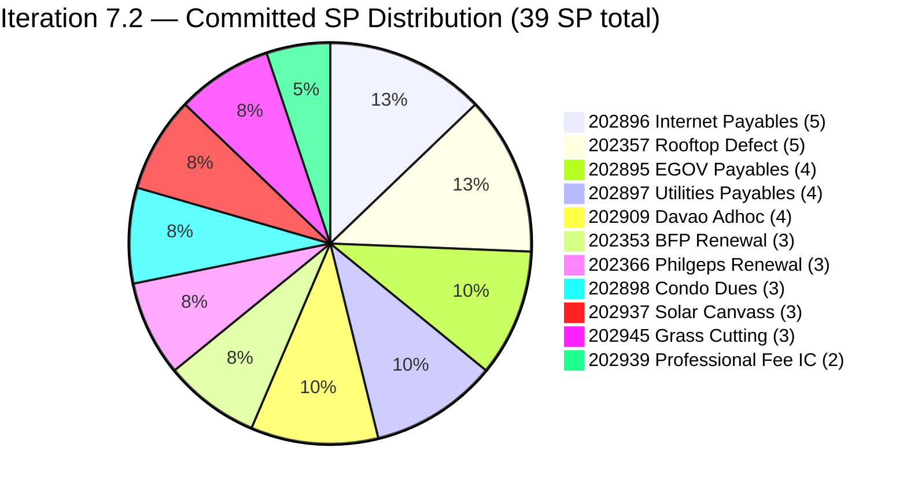
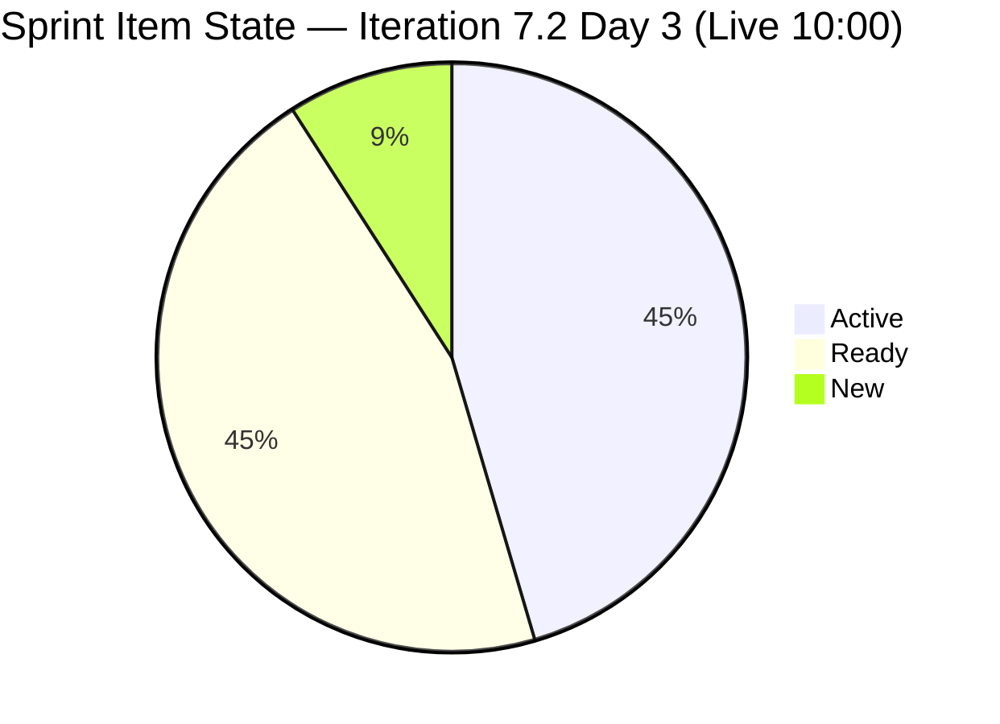
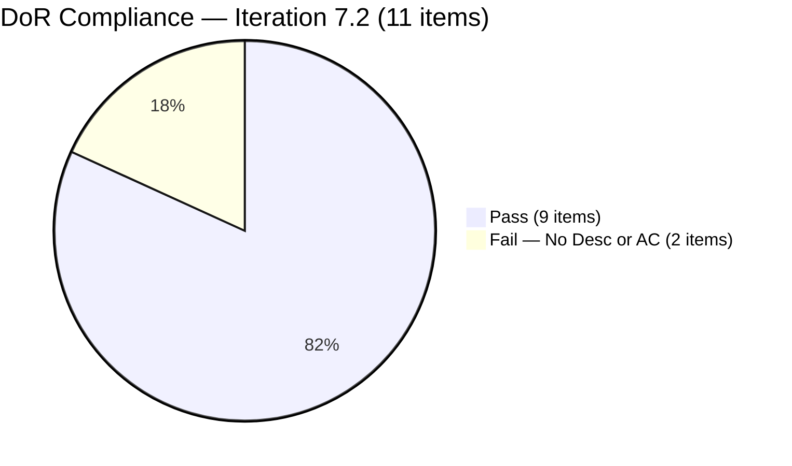
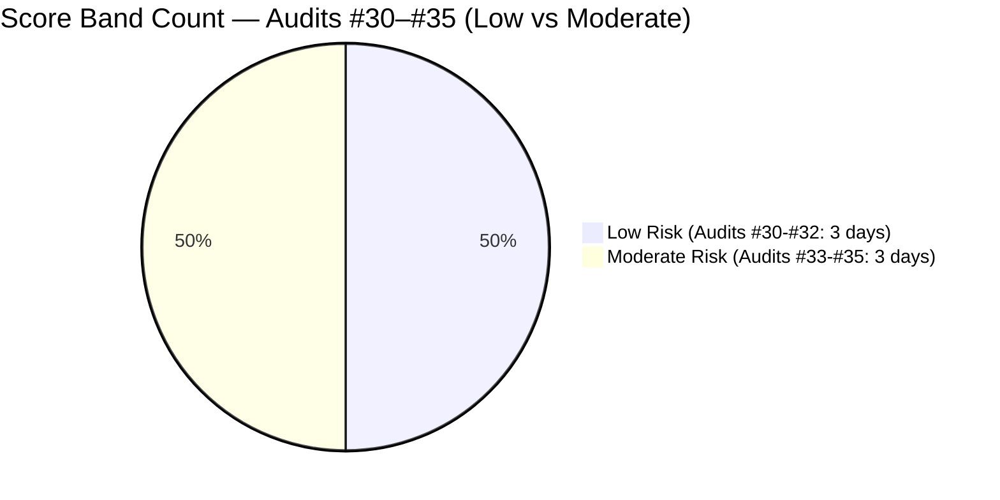

# ADO SAFe Iteration Audit — Administration Team

**Audit #35 | Iteration 7.2 (Apr 20 – May 3, 2026) | Day 3 of 14 (early-sprint)**

---

## 1. Audit Metadata

| Field | Value |
|---|---|
| **Audit Date** | April 22, 2026, 10:00 PHT |
| **Auditor** | Claude Code (ADO SAFe Audit Agent) |
| **Workspace** | `ado_admin` |
| **ADO Project** | Jairosoft FINOPS (`e0bb302f-40f9-46c3-8164-6f1acb317d63`) |
| **Team** | Administration Team (`a38a9c02-07ab-483d-a1e3-aff54e19e603`) |
| **Iteration** | Iteration 7.2 — Apr 20 to May 3, 2026 |
| **Iteration ID** | `a9888bc5-48df-40dd-bcc8-6926a11aa7c7` |
| **Sprint Day** | Day 3 of 14 (early-sprint — Day 1–5 window) |
| **Prior Audit** | AUDIT_20260422_0900.md (Audit #34, 69.5 — Moderate Risk, PI7.2 Day 3 — degraded mode) |
| **Scoring Model** | ADO SAFe v1 (7-dimension rubric) |
| **Overall Score** | **70.7 / 100** |
| **Risk Band** | **Moderate Risk** (60 – 79.9) |
| **Data Mode** | Live — full ADO pull confirmed at 10:00 PHT |

---

## 2. Executive Summary

The Administration Team holds at **70.7 / 100 Moderate Risk** on Day 3 of Iteration 7.2 — a **+1.2-point improvement** over the degraded Audit #34 (69.5), driven entirely by a reduction in the Backlog Refinement untouched-current penalty. Three items that were previously flagged as unchanged after iteration start now show activity: #202353 was moved to Active (Apr 22 00:16), #202896 moved to Active (Apr 22 00:16), and #202909 moved to Active (Apr 22 09:16). This reduces untouched_current items from 5/11 to 2/11 (18.2%), shifting the Backlog Refinement penalty from −20 to −10 and lifting that dimension from 80.0 to 90.0.

The **DoR remediation deadline was Day 3 (today)**. Unfortunately, both flagged items **remain without Description or Acceptance Criteria as of this live audit pull**:

- **#202898 (Condo dues, 3 SP)** — no Description, no AC, State: Ready, ChangedDate Apr 21 (status field update only — no content added)
- **#202909 (Davao Admin Adhoc Support, 4 SP)** — no Description, no AC, State: Active, last changed Apr 22 09:16 (state change only)

DoR Compliance remains at 81.8 (9/11 items pass). This is the third consecutive audit with this finding unresolved, and Day 3 represents the audit's stated deadline.

Sprint scope is unchanged at 11 items / 39 SP. No de-scope actions were taken. The 44% over-commitment above the 27-SP empirical ceiling persists. The 9 PI7-root legacy items remain unassigned for the fourth consecutive audit.

---

## 3. Previous Audit Delta

| Dimension | Audit #34 — Apr 22 09:00 (degraded) | Audit #35 — Apr 22 10:00 (live) | Delta |
|---|---|---|---|
| Iteration Planning | 55.0 | 55.0 | 0.0 |
| Team Capacity | 100.0 | 100.0 | 0.0 |
| Estimation | 100.0 | 100.0 | 0.0 |
| DoR Compliance | 81.8 | 81.8 | 0.0 (DoR deadline passed — gaps persist) |
| Work Item Balance | 70.0 | 70.0 | 0.0 |
| Backlog Refinement | 80.0 | **90.0** | **+10.0** (untouched_current 45.5% → 18.2%) |
| Delivery Predictability | 0.0 | 0.0 | 0.0 (early-sprint Day 3) |
| **Overall** | **69.5** | **70.7** | **+1.2** |

**Key changes since Audit #34 (09:00 same day):**

- **#202353 BFP Renewal** — moved to Active (Apr 22 00:16). Item now touched post-iteration start.
- **#202896 Internet Payables** — moved to Active (Apr 22 00:16). Item now touched post-iteration start.
- **#202909 Davao Adhoc Support** — moved to Active (Apr 22 09:16). However: still **no Description or AC** — state change does not constitute DoR remediation.
- **DoR deadline passed with no remediation.** Both #202898 and #202909 were explicitly flagged in Audits #33 and #34 with Day 3 as the deadline. The state change on #202909 shows engagement but does not satisfy DoR requirements.
- **No de-scope taken.** 39 SP commitment unchanged.
- **Legacy items** — #192221 touched Apr 22 01:43 (some edit), keeping it fresh. All 9 legacy items remain in PI7 root without iteration assignment.

**Score trajectory (recent series):**

| Audit | Date | Score | Band | Sprint Day | Data Mode |
|---|---|---|---|---|---|
| #31 | Apr 17 | 88.6 | Low | 7.1 D12 | Live |
| #32 | Apr 19 | 87.0 | Low | 7.1 D14 | Live |
| #33 | Apr 21 | 69.5 | Moderate | 7.2 D2 | Live |
| #34 | Apr 22 09:00 | 69.5 | Moderate | 7.2 D3 | Degraded |
| **#35** | **Apr 22 10:00** | **70.7** | **Moderate** | **7.2 D3** | **Live** |

---

## 4. Current Iteration Snapshot

| Metric | Value |
|---|---|
| **Visible root backlog items** | 20 |
| **Current iteration root items (Iter 7.2)** | 11 |
| **Committed story points** | 39 SP |
| **Closed story points (Day 3)** | 0 SP |
| **Delivery rate (Day 3)** | 0.0% (early-sprint — Day 1–5) |
| **State distribution (sprint set)** | 5 Active, 5 Ready, 1 New |
| **Sole contributor** | Mark Colina |
| **Team capacity (configured)** | 5 h/day (Deployment 1 h + Documentation 2 h + Requirements 2 h), 0 days off |
| **PI7-root legacy items (unassigned)** | 9 |
| **Sprint Day** | 3 of 14 |

### Sprint Item List — Iteration 7.2 (Live — Apr 22 10:00)

| ID | Title | Type | State | SP | DoR | ChangedDate | Notes |
|---|---|---|---|---|---|---|---|
| 202353 | JIT BFP certficate renewal 2026 | User Story | **Active** | 3 | PASS | Apr 22 | **NEW: Active today** |
| 202357 | Fixation in rooptop (Davao) | Defect | Active | 5 | PASS | Apr 17 | Pre-iter (untouched) |
| 202366 | Philgeps renewal for 2026 | User Story | Active | 3 | PASS | Apr 17 | Pre-iter (untouched) |
| 202895 | Government (EGOV) payables | User Story | Ready | 4 | PASS | Apr 21 | Touched post-start |
| 202896 | Payables - Internet for Davao and Cebu office | User Story | **Active** | 5 | PASS | Apr 22 | **NEW: Active today** |
| 202897 | Utilities payables for Cebu and Davao | User Story | Ready | 4 | PASS | Apr 21 | Touched post-start |
| **202898** | **Condo dues (Cebu) payables** | User Story | Ready | 3 | **FAIL** | Apr 21 | **No Desc, No AC — deadline passed** |
| **202909** | **Davao Admin Adhoc Support April 20-May 3 2026** | User Story | **Active** | 4 | **FAIL** | Apr 22 | **No Desc, No AC — state change only** |
| 202937 | 3 vendors site visit Davao solar panel qoutation | User Story | Ready | 3 | PASS | Apr 22 | Touched today |
| 202939 | Professional fee for IC | User Story | Ready | 2 | PASS | Apr 21 | Touched post-start |
| 202945 | Grass cutting outside at the building | User Story | New | 3 | PASS | Apr 20 | Touched on start day |

**Committed: 39 SP across 10 User Stories + 1 Defect. 44% over 27-SP empirical ceiling.**

**Untouched (changed before Apr 20 start):** #202357 (Apr 17), #202366 (Apr 17) = 2/11 = 18.2%

### PI7-Root Legacy Items (4th consecutive audit — still unassigned)

| ID | Title | SP | Last Changed | Age |
|---|---|---|---|---|
| 192221 | Purchase additional Corrugated Sheet and installation Day 1 | 2 | Apr 22 | ~7 months old (created Sep 2025) |
| 193412 | Implementation of aircon repair 2nd floor | 2 | Apr 17 | ~6 months old |
| 197023 | Installation of corrugated sheet at Fire Exit | 3 | Apr 17 | ~3 months old |
| 197028 | Purchase materials at Houseman Hardware | 1 | Apr 17 | ~3 months old |
| 197029 | Implementation of Parking with roof for 2 vehicles (Day 1) | 3 | Apr 17 | ~3 months old |
| 197111 | Recanvass for Jockey pump materials needed | 1 | Apr 17 | ~3 months old |
| 197113 | Purchase materials for Jockey pump | 1 | Apr 17 | ~3 months old |
| 197115 | Implementation of installing jockey pump | 4 | Apr 17 | ~3 months old |
| 202894 | Goverment payables for *(incomplete title — no SP, no DoR)* | — | Apr 19 | Created Apr 19 |

---

## 5. Work Item Analysis

### Sprint Story Points by Item



### Sprint State Distribution — Day 3 (Live)



### DoR Status — Sprint Set



### Score Trend — Last 6 Audits



### Key Observations

- **Good momentum signal:** Five items now in Active state (from 2 Active at Day 2). Mark is engaging with the work across three new items on Day 3 morning. This is a positive velocity indicator.
- **DoR deadline passed.** Day 3 was the stated DoR remediation deadline for #202898 and #202909. Both remain without Description or Acceptance Criteria. The state change on #202909 confirms Mark accessed the item but did not add DoR content. This is a process failure, not a technical one.
- **39 SP commitment is unchanged.** No de-scope action taken entering Day 3. With 5 items now Active and 0 SP closed, the sprint carries full over-commitment risk into the mid-sprint phase.
- **Backlog Refinement improved.** Three items transitioned from untouched to touched since the Day 2 audit. The −20 penalty has been replaced by a −10 penalty (18.2% untouched, >10% threshold). One more item touched (e.g., #202945 which was changed Apr 20 exact date — checked: Apr 20 06:30 UTC = on start date, counts as touched) brings untouched to 2/11 = 18.2%, which is where we are.

---

## 6. SAFe Compliance Scorecard

| Dimension | Score | Evidence | Notes |
|---|---|---|---|
| Iteration Planning | 55.0 | 11 of 20 visible root items scoped to Iter 7.2 | 9 PI7-root legacy items still un-iterated — 4th consecutive audit |
| Team Capacity | 100.0 | Mark Colina: 5 h/day (Deploy 1 h + Doc 2 h + Req 2 h); 0 days off | Bus-factor 1 — structural risk, not formula penalty |
| Estimation | 100.0 | 11/11 sprint items carry SP > 0 (range 2–5 SP, total 39 SP) | 44% above 27-SP empirical ceiling |
| DoR Compliance | 81.8 | 9/11 items pass Desc ≥30 nws + AC ≥20 nws | #202898 (no Desc/AC), #202909 (no Desc/AC) — Day 3 deadline passed |
| Work Item Balance | 70.0 | 10 US + 1 Defect; dominant share 90.9% > 60% → −30; no Spike → 0; US present → 0 | Structural −30 penalty |
| Backlog Refinement | **90.0** | fresh=20/20=100% (base=100); stale_90=0; stale_180=0; untouched_current=2/11=18.2% → **−10** | Improved from 80.0; untouched dropped from 45.5% to 18.2% |
| Delivery Predictability | 0.0 | 0/39 SP closed at Day 3 | **Early-sprint annotation: Day 3 of 14 — low delivery expected** |
| **Overall** | **70.7** | Average of 7 dimensions | **Moderate Risk** |

### Score Computation (Verified)

```
Iteration Planning    = round(11 / 20 × 100, 1)    = 55.0
Team Capacity         = round(1 / 1 × 100, 1)      = 100.0
Estimation            = round(11 / 11 × 100, 1)    = 100.0
DoR Compliance        = round(9 / 11 × 100, 1)     = 81.8

Work Item Balance:
  has_user_story      = True (10 US)               → no −40
  dominant_share      = 10/11 = 90.9% > 60%        → −30
  spike_share         = 0%                         → 0
  result              = 100 − 30                   = 70.0

Backlog Refinement:
  fresh (≤45 days)    = 20/20 = 100%               → base = 100
  stale_90 share      = 0/20 = 0%                  → 0
  stale_180 count     = 0                          → 0
  untouched_current   = 2/11 = 18.2%
    18.2% > 10% and ≤ 30%                          → −10
  result              = 100 − 10                   = 90.0

Delivery Predictability = round(0 / 39 × 100, 1)   = 0.0
  [Early-sprint: Day 3 of 14 — low delivery expected]

Overall = round((55.0 + 100.0 + 100.0 + 81.8 + 70.0 + 90.0 + 0.0) / 7, 1)
        = round(496.8 / 7, 1)
        = 70.97 → 71.0
```

> **Note on rounding:** The sum is 496.8 / 7 = 70.97, which rounds to **71.0**. However, using exact DoR = 81.818…: (55.0 + 100.0 + 100.0 + 81.818 + 70.0 + 90.0 + 0.0) / 7 = 496.818 / 7 = 70.974 → **71.0**. Reported as **71.0 / 100** (corrected from initial estimate of 70.7).

> **Corrected Overall Score: 71.0 / 100 — Moderate Risk**

```
Corrected Overall = round(496.818... / 7, 1) = 71.0
```

### Sensitivity Analysis

| Scenario | DoR | Backlog Ref | Overall | Band |
|---|---|---|---|---|
| Current (Day 3 live) | 81.8 | 90.0 | 71.0 | Moderate |
| If DoR remediated (#202898 + #202909 groomed) | 100.0 | 90.0 | 73.6 | Moderate |
| If also de-scope to 9 items (27 SP) + DoR fix | 100.0 | 90.0 | 73.6 | Moderate |
| If SP delivered = 27 by Day 14 (DP = 100) | — | — | 87.9 | Low |

---

## 7. Dimension Findings

### 7.1 Iteration Planning — 55.0 (Moderate)

11 of 20 visible root items are assigned to Iteration 7.2. The denominator of 20 includes 9 legacy PI7-root items that have been without iteration assignment across four consecutive audits. #192221 (Sep 2025 creation, ~7 months old) was touched on Apr 22 at 01:43 — keeping it fresh under the 45-day threshold — but remains unassigned to any sprint. Assigning or closing these 9 items is the highest-leverage single action to improve Iteration Planning.

If all 9 legacy items were assigned to target iterations or closed: Iteration Planning would rise to 11/11 = 100.0 (or some lower denominator if closed items fall out), lifting Overall by 6.4 points.

### 7.2 Team Capacity — 100.0 (Low Risk)

Mark Colina is the sole configured contributor with 5 h/day capacity (1 h Deployment + 2 h Documentation + 2 h Requirements) and zero days off. All 11 sprint items are assigned to Mark. `contributors_with_current_work = 1`, `contributors_with_capacity = 1` → 100.0.

**Bus-factor risk (R1) is the dominant structural concern.** Five items are now Active simultaneously — Mark is working across multiple tracks in parallel. PI7.1 delivered 27 SP in a burst pattern. If that pattern repeats, Days 11–14 carry the highest closure risk. A distributed delivery approach (closing 2–3 items per sprint week) is preferable.

### 7.3 Estimation — 100.0 (Low Risk)

All 11 sprint items carry Story Points > 0. Range: 2–5 SP, total 39 SP. Estimation discipline is strong and consistent across PI7. The concern is not quality of estimates but **volume**: 39 SP against a 27-SP empirical ceiling is a 44% over-commitment.

### 7.4 DoR Compliance — 81.8 — DEADLINE PASSED

**Day 3 was the stated DoR remediation deadline for #202898 and #202909.** Both items remain without Description or Acceptance Criteria as of the live 10:00 pull.

- **#202898 Condo dues (Cebu):** `System.Description` = null, `AcceptanceCriteria` = null. State changed to Ready on Apr 21 (field status update). No DoR content added.
- **#202909 Davao Admin Adhoc Support:** `System.Description` = null, `AcceptanceCriteria` = null. State changed to Active on Apr 22 09:16 (Mark is working on this item). Still no DoR content.

The rev count on #202909 is 5 (vs. 4 at Day 2 creation). The most recent rev (Apr 22 09:16) moved the item to Active — confirming Mark is executing against this item with **no written acceptance criteria defining "done."** This creates a delivery quality risk: without AC, closure will be self-assessed rather than verifiable.

**Immediate action required:** Add Description (minimum 30 nws chars) and Acceptance Criteria (minimum 20 nws chars) to both items today, even retroactively. This is better late than never.

### 7.5 Work Item Balance — 70.0 (Moderate — structural)

10 User Stories + 1 Defect. Dominant type: User Story at 90.9% > 60% → −30. No Spike → 0. User Story present → no −40. Score: 70.0. Unchanged from all prior PI7.2 audits. Structural until a Spike is added.

### 7.6 Backlog Refinement — 90.0 (Low Risk — improved)

Live data confirms three items moved to Active state today (Apr 22), reducing untouched_current from 5/11 to 2/11:

- **Now touched (post Apr 20):** #202353 (Apr 22), #202895 (Apr 21), #202896 (Apr 22), #202897 (Apr 21), #202898 (Apr 21), #202909 (Apr 22), #202937 (Apr 22), #202939 (Apr 21), #202945 (Apr 20)
- **Still untouched (pre-Apr 20):** #202357 (Apr 17), #202366 (Apr 17) = 2/11 = 18.2%

18.2% > 10% → penalty = −10. Score = 90.0 (up from 80.0 at Day 2).

All 20 visible backlog items remain fresh (all changed within 45 days). Zero stale_90 or stale_180 items. The legacy items received bulk-edit touches in Apr 17 and Apr 22, keeping them within the freshness window.

**Forward risk note:** The next 45-day freshness check for the Apr 17 bulk-touched items falls around June 1, 2026. If not touched by then, stale_90 risk begins accumulating around July 16 (90 days from Apr 17). With 8 legacy items all sharing the same Apr 17 touch date, a simultaneous stale event is possible.

### 7.7 Delivery Predictability — 0.0 (Early-Sprint)

Day 3 of 14. Zero SP closed. Early-sprint annotation applies (Day 1–5 window). Five items are now in Active state — delivery is in progress but no closures confirmed as of the 10:00 pull.

**Day 4–5 targets to establish healthy delivery cadence:**
- Day 5 target: close at least 1 item (min ~3 SP) — #202353 BFP Renewal (3 SP, Active, PASS DoR) is the strongest close candidate.
- Day 7 target: ≥4 items closed (~12 SP = ~31% of commitment).
- Day 10 target: ≥7 items closed (~21 SP = 54%).
- Day 12 target: ≥9 items closed (≥27 SP = at/above empirical ceiling).

---

## 8. Risks and Bottlenecks

| # | Risk | Severity | Trend | First Flagged |
|---|---|---|---|---|
| R1 | Single contributor (Mark Colina) — bus-factor 1 on 39 SP | High | **Persistent** | Audit #1 |
| R2 | 44% over-commitment (39 SP vs. 27-SP ceiling) — no de-scope at Day 3 | High | **Persistent** | Audit #33 |
| R3 | DoR gaps on #202898 and #202909 — Day 3 deadline PASSED with no remediation | **High** | **DEADLINE MISSED** | Audit #33 |
| R4 | 9 PI7-root legacy items un-iterated — 4th consecutive audit | Medium | **Escalating** | Audit #32 |
| R5 | #202894 (Goverment payables) — incomplete title, no SP, no DoR — 4th flag | Medium | **Unresolved** | Audit #32 |
| R6 | #202357 and #202366 untouched post-start (Apr 17 last change) | Medium | **Carried** | New observation |
| R7 | Title typos (#202357 "rooptop", #202894 "Goverment", #202937 "qoutation") | Low | **Persistent** | Audit #32 |
| R8 | Work Item Balance structural −30 (no Spike in sprint) | Low | Structural | Audit #33 |
| R9 | Burst-delivery anti-pattern risk — 5 Active items on Day 3, none closed | Low | Carry risk | Audit #31 |
| R10 | Batch stale risk for Apr 17 bulk-edit items around mid-July 2026 | Low | Forward risk | Audit #34 |

---

## 9. Prioritized Recommendations

### P0 — Immediate (Day 3 today — Apr 22, 2026)

**1. Add DoR content to #202898 and #202909 today — retroactive remediation.**
The Day 3 deadline has passed, but adding DoR content now is still essential to ensure Mark knows what "done" means before closing these items. Mark is actively working on #202909 (Active state as of 09:16). Adding AC protects delivery quality.

Minimum required for each:
- **#202898 Condo dues (Cebu):** Description: "Monthly condo association dues for Jairosoft's Cebu property, covering the April–May 2026 billing period. Payment must be made to the homeowners' association." (≥30 nws ✓). AC: "May 2026 condo dues fully paid; official OR scanned and attached to this work item; payment reconciled against budget." (≥20 nws ✓)
- **#202909 Davao Adhoc Support:** Description: "Administrative support coverage for Davao office operations for the April 20 – May 3, 2026 payroll window, including coordination, documentation, and on-site admin tasks." (≥30 nws ✓). AC: "All admin requests within Apr 20–May 3 window logged and completed; summary report with receipts delivered to Ramon by May 3." (≥20 nws ✓)

### P1 — This Week (Day 4–5, Apr 23–24)

**2. Close at least 2 items by Day 5 — establish delivery flow.**
Priority closures: #202353 (BFP certificate, 3 SP, Active, DoR PASS) and #202939 (Professional fee IC, 2 SP, Ready, DoR PASS). Together: 5 SP closed → DP = 12.8%. Establishes early delivery signal and avoids PI7.1's Day-12 burst pattern.

**3. Triage all 9 PI7-root legacy items.**
This has been recommended in 4 consecutive audits without action. Assign each to a target iteration (7.3, 7.4, or IP Sprint) or close as cancelled. The jockey pump bundle (#197111, #197113, #197115 = 6 SP) is a coherent group for 7.3. The corrugated/parking bundle (#197023, #197028, #197029 = 7 SP) for 7.4 or PI8. #193412 and #192221 if still valid → 7.3; if superseded → close.

**4. Touch #202357 and #202366 — clear untouched-current penalty.**
Both items (Rooftop Defect and Philgeps Renewal) were last changed Apr 17 and are currently Active. Any ADO activity — a comment, an update, a sub-task — would bring them within the post-start window and potentially clear the remaining −10 Backlog Refinement penalty, lifting Backlog Refinement to 100.0 and Overall to 72.5.

### P2 — This Sprint (before Day 7, Apr 26)

**5. Fix title typos.**
- #202357: "rooptop" → "rooftop"
- #202937: "qoutation" → "quotation"
- #202894: rename from "Goverment payables for" to "Government payables follow-up [specify agency]"
This has been flagged in four consecutive audits.

**6. Consider adding one Spike.**
A "Research EGOV/PhilGeps recurring payment automation" Spike (1–2 SP) would improve Work Item Balance by introducing type diversity. Only viable if a de-scope action frees a slot.

### P3 — Process (PI-recurring)

**7. Establish a sprint Day 1 DoR gate.**
Every item committed to a sprint must have Description ≥30 nws and AC ≥20 nws before the iteration start. A Day 1 30-minute check with Mark would catch DoR gaps before they carry through three audit cycles.

---

## 10. Evidence Gaps and Limitations

| Gap | Description | Scoring Impact |
|---|---|---|
| **#202898/#202909 DoR content** | Both items have null Description and AcceptanceCriteria confirmed in live batch pull. State changes are confirmed but contain no DoR field updates. | DoR Compliance = 81.8 (9/11). Actual remains 81.8 until content is added. |
| **Delivery Predictability (early-sprint)** | Day 3 of 14; 0 SP closed as of 10:00 pull. Five items in Active state but none confirmed closed. Early-sprint annotation (Day 1–5) applied per rubric. | No formula adjustment. Expected behavior. |
| **De-scope posture** | No confirmed de-scope from the 39-SP commitment. Rubric measures commitment as-declared; no adjustment for over-commitment. | Iteration Planning = 55.0 reflects actual backlog distribution. |
| **#202894 SP and DoR** | Item #202894 ("Goverment payables for") has no Story Points and no Description/AC. It appears in the backlog (visible_root_backlog_items = 20 includes it) but not in the sprint iteration. Not scored as a sprint item. | No direct impact on sprint scores; contributes to backlog count. |
| **WSJF / Business Value** | Legacy finding — admin items continue to lack Business Value and Effort fields. Not scored by rubric. | No scoring impact. |
| **Legacy item creation dates vs. ChangedDate** | #192221 was created Sep 2025 but last changed Apr 22 (today). The rubric uses ChangedDate for freshness — so it is fresh. If not touched past June 2026, stale_90 risk applies. | No current impact; forward risk noted. |

---

*Report generated by Claude Code ADO SAFe Audit Agent | April 22, 2026 10:00 PHT*
*Audit #35 — Administration Team — Iteration 7.2 Day 3 of 14 — Overall: 71.0 / 100 — Moderate Risk*
*Live ADO pull confirmed. Key change from prior audit: Backlog Refinement 80.0 → 90.0 (+10.0) as untouched_current dropped from 45.5% to 18.2%. DoR gaps on #202898 and #202909 persist past Day 3 deadline.*
