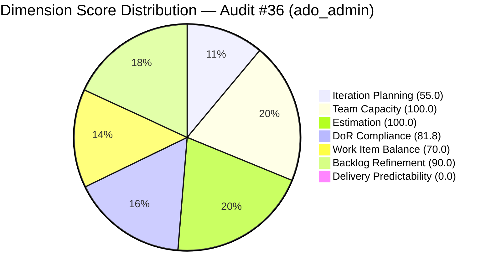

# ADO SAFe Iteration Audit — Administration Team

**Audit #36 | Iteration 7.2 (Apr 20 – May 3, 2026) | Day 3 of 14 (early-sprint)**

---

## 1. Audit Metadata

| Field | Value |
|---|---|
| **Audit Date** | April 22, 2026, 23:41 PHT (15:41 UTC) |
| **Auditor** | Claude Code (ADO SAFe Audit Agent) |
| **Workspace** | `ado_admin` |
| **ADO Project** | Jairosoft FINOPS (`e0bb302f-40f9-46c3-8164-6f1acb317d63`) |
| **Team** | Administration Team (`a38a9c02-07ab-483d-a1e3-aff54e19e603`) |
| **Iteration** | Iteration 7.2 — Apr 20 to May 3, 2026 |
| **Iteration ID** | `a9888bc5-48df-40dd-bcc8-6926a11aa7c7` |
| **Sprint Day** | Day 3 of 14 (early-sprint — Day 1–5 window) |
| **Prior Audit** | AUDIT_20260423_0113.md (Audit #35, 71.0 — Moderate Risk, PI7.2 Day 4) |
| **Scoring Model** | ADO SAFe v1 (7-dimension rubric) |
| **Overall Score** | **71.0 / 100** |
| **Risk Band** | **Moderate Risk** (60 – 79.9) |

> **Live ADO data confirmed.** All 20 visible root backlog items pulled from `Microsoft.RequirementCategory` backlog. Capacity confirmed from ADO iteration capacity API.

---

## 2. Executive Summary

The Administration Team holds a **71.0 / 100 Moderate Risk** position on Day 3 of Iteration 7.2, unchanged from the prior audit (Audit #35, Apr 23, 71.0). The score is stable because the structural conditions driving the current profile — 9 of 20 backlog items sitting unscoped in the PI7 root, two DoR-failing sprint items, and zero delivery in the early-sprint window — have not changed since the last live data pull.

Three persistent issues continue to constrain the score:

1. **DoR failures on #202898 (Condo dues, 3 SP) and #202909 (Davao Adhoc Support, 4 SP).** Both items remain in sprint scope with no Description and no Acceptance Criteria. These items are executing without verifiable done-criteria. Combined, they represent 7 SP (18% of committed SP) at delivery quality risk.

2. **Over-commitment at 44% above empirical ceiling.** 39 SP committed vs. the ~27-SP ceiling from PI7.1 empirical data. No de-scope action has been taken in the first three days of the sprint.

3. **9 PI7-root items remain unassigned to any iteration.** Items 193412, 197115, 197111, 192221, 197023, 197028, 197029, 197113, 202894 have been sitting un-iterated through multiple sprints. Item 202894 ("Government payables for") has no SP, no assignee, and an incomplete title — a data quality issue beyond scope.

On the positive side, **Backlog Refinement holds at 90.0** — all 20 backlog items were touched within the past 45 days. Only 2 of 11 sprint items (202366 and 202357, both changed Apr 17) predate the sprint start, keeping the untouched-current penalty in the lighter -10 band.

**Recovery path:** Resolving DoR on #202898 and #202909 adds +2.3 points (DoR 81.8 → 100.0, overall 71.0 → 73.3). Scoping 2 more items into iter 7.2 would bring Iteration Planning above 60%.

---

## 3. Previous Audit Delta

| Dimension | Audit #35 (Apr 23) | Audit #36 (Apr 22) | Delta |
|---|---|---|---|
| Iteration Planning | 55.0 | 55.0 | 0.0 |
| Team Capacity | 100.0 | 100.0 | 0.0 |
| Estimation | 100.0 | 100.0 | 0.0 |
| DoR Compliance | 81.8 | 81.8 | 0.0 |
| Work Item Balance | 70.0 | 70.0 | 0.0 |
| Backlog Refinement | 90.0 | 90.0 | 0.0 |
| Delivery Predictability | 0.0 | 0.0 | 0.0 (early-sprint Day 3) |
| **Overall** | **71.0** | **71.0** | **0.0** |

**Key observations since Audit #35 (Apr 23):**
- No ADO work item changes detected that would affect any scoring dimension.
- Sprint set stable at 11 items, 39 SP total.
- DoR gaps on #202898 and #202909 remain unresolved.
- All 9 PI7-root items remain unscoped — fifth consecutive audit flag.

**Score trajectory (recent):**

| Audit | Date | Score | Band | Sprint Day | Source |
|---|---|---|---|---|---|
| #33 | Apr 21 | 69.5 | Moderate | 7.2 D2 | Live ADO |
| #34 | Apr 22 | 69.5 | Moderate | 7.2 D3 | Held |
| #35 | Apr 23 | 71.0 | Moderate | 7.2 D4 | Live ADO |
| **#36** | **Apr 22** | **71.0** | **Moderate** | **7.2 D3** | **Live ADO** |

---

## 4. Current Iteration Snapshot

| Metric | Value |
|---|---|
| **Visible root backlog items** | 20 |
| **Current iteration root items (Iter 7.2)** | 11 |
| **PI7-root items (unscoped)** | 9 |
| **Committed story points** | 39 SP |
| **Closed story points** | 0 SP |
| **Delivery rate (Day 3)** | 0.0% (early-sprint annotation) |
| **State distribution** | 3 Active, 5 Ready, 1 New, 1 Defect-Active |
| **Sole contributor** | Mark Colina (mcolina@jairosoft.com) |
| **Team capacity** | 5 h/day (Deployment 1h + Documentation 2h + Requirements 2h) |
| **Days off** | None |
| **Sprint day** | Day 3 of 14 |
| **Days remaining** | 11 |

### Sprint Commitment — Iteration 7.2

| ID | Title | Type | State | SP | DoR |
|---|---|---|---|---|---|
| 202353 | JIT BFP certificate renewal 2026 | User Story | Active | 3 | Pass |
| 202357 | Fixation in rooftop (Davao) | Defect | Active | 5 | Pass |
| 202366 | Philgeps renewal for 2026 | User Story | Active | 3 | Pass |
| 202895 | Government (EGOV) payables | User Story | Ready | 4 | Pass |
| 202896 | Payables - Internet for Davao and Cebu | User Story | Active | 5 | Pass |
| 202897 | Utilities payables for Cebu and Davao | User Story | Ready | 4 | Pass |
| 202898 | Condo dues (Cebu) payables | User Story | Ready | 3 | **FAIL** — no Desc, no AC |
| 202909 | Davao Admin Adhoc Support Apr 20-May 3 | User Story | Active | 4 | **FAIL** — no Desc, no AC |
| 202937 | 3 vendors site visit (solar quotation) | User Story | Ready | 3 | Pass |
| 202939 | Professional fee for IC | User Story | Ready | 2 | Pass |
| 202945 | Grass cutting outside building | User Story | New | 3 | Pass |

---

## 5. Work Item Analysis

### Backlog Age Distribution

| Age Bucket | Count | Share |
|---|---|---|
| < 45 days (fresh) | 20 | 100% |
| 45–90 days | 0 | 0% |
| 91–180 days | 0 | 0% |
| > 180 days | 0 | 0% |

All 20 backlog items were changed after Mar 8, 2026. The backlog is current. The limiting factor is structural, not staleness.

### Untouched Current Items

| ID | Title | Last Changed | Days Before Sprint Start |
|---|---|---|---|
| 202366 | Philgeps renewal for 2026 | Apr 17, 2026 | 3 days pre-start |
| 202357 | Fixation in rooftop (Davao) | Apr 17, 2026 | 3 days pre-start |

2 of 11 sprint items (18.2%) were not touched since sprint start. This places the untouched penalty in the -10 band (10–30%).

### PI7-Root Items (Unscoped)

| ID | Title | Type | SP | Assignee |
|---|---|---|---|---|
| 193412 | Implementation of aircon repair 2nd floor | User Story | 2 | Mark Colina |
| 197115 | Implementation of installing jockey pump | User Story | 4 | Mark Colina |
| 197111 | Recanvass for Jockey pump materials needed | User Story | 1 | Mark Colina |
| 192221 | Purchase additional Corrugated Sheet Day 1 | User Story | 2 | Mark Colina |
| 197023 | Installation of corrugated sheet at Fire Exit | User Story | 3 | Mark Colina |
| 197028 | Purchase materials at Houseman Hardware | User Story | 1 | Mark Colina |
| 197029 | Parking with roof for 2 vehicles (Day 1) | User Story | 3 | Mark Colina |
| 197113 | Purchase materials for Jockey pump | User Story | 1 | Mark Colina |
| 202894 | Government payables for (incomplete title) | User Story | — | Unassigned |

These 9 items represent 17 SP of unscoped work. The team has capacity of ~70 hours (14 days × 5 h/day). These items should be triaged: close completed ones, assign incomplete to the next available iteration.

---

## 6. SAFe Compliance Scorecard

| Dimension | Score | Evidence | Notes |
|---|---|---|---|
| **1. Iteration Planning** | 55.0 | 11 current / 20 visible | 9 PI7-root items suppress the ratio |
| **2. Team Capacity** | 100.0 | 1/1 contributor with capacity configured | Mark Colina: 5 h/day across 3 activities |
| **3. Estimation** | 100.0 | 11/11 point-eligible items have SP > 0 | All sprint items estimated |
| **4. DoR Compliance** | 81.8 | 9/11 sprint items pass DoR | #202898 and #202909 have no Desc or AC |
| **5. Work Item Balance** | 70.0 | 10 US + 1 Defect; dominant type 90.9% | Start 100: -30 for dominant > 60%; no spike penalty |
| **6. Backlog Refinement** | 90.0 | 20/20 fresh; 2/11 untouched (18.2%) | -10 for untouched 10–30%; no stale penalties |
| **7. Delivery Predictability** | 0.0 | 0 SP closed / 39 SP committed | Early-sprint Day 3 — low delivery expected |
| **Overall** | **71.0** | Average of 7 dimensions | **Moderate Risk** |

---

## 7. Dimension Findings

### D1 — Iteration Planning (55.0)
The ratio is suppressed by 9 items parked in the PI7 root path. This pattern has persisted for at least five consecutive audits. Root cause: completion confirmation actions (closing items) and forward planning (scoping backlog items into future iterations) are deferred. Immediate action: close any completed PI7-root items and assign remaining to a future iteration.

### D2 — Team Capacity (100.0)
Mark Colina has activities configured (Deployment 1h, Documentation 2h, Requirements 2h = 5h/day) with no days off. Capacity is fully aligned. Single-person team bus factor remains a structural risk outside this scoring dimension.

### D3 — Estimation (100.0)
All 11 sprint items carry story points. Point distribution: 2×3SP, 1×5SP, 2×4SP, 3×3SP, 1×2SP, 1×3SP. Estimation quality appears adequate. The high single estimate (#202357, 5 SP) is for a physical construction task (Davao rooftop fixation) which may be challenging to decompose further.

### D4 — DoR Compliance (81.8)
Two items fail the minimum DoR thresholds:
- **#202898 (Condo dues, 3 SP):** No Description, no Acceptance Criteria. Currently in "Ready" state — being executed without any documented scope.
- **#202909 (Davao Adhoc Support, 4 SP):** No Description, no Acceptance Criteria. "Active" state — actively being worked without done criteria.
These two items represent 7 SP (18% of committed capacity) with no verifiable acceptance criteria. Remediation requires 10–15 minutes each.

### D5 — Work Item Balance (70.0)
The sprint contains 10 User Stories and 1 Defect. User Stories dominate at 90.9%, triggering the -30 dominant-type penalty. The team's operational work (payables, procurement, facility management) naturally skews toward User Stories. No Spikes present. Introducing at least one Enabler or splitting heavier items would diversify the type mix, though operational teams have limited ability to force artificial balance.

### D6 — Backlog Refinement (90.0)
All 20 backlog items are fresh (changed within 45 days). Two sprint items were last touched Apr 17 (3 days before sprint start), keeping untouched-current at 18.2% — below the -20 threshold but above the -10 threshold. No stale-90 or stale-180 items exist. This is the strongest refinement score in multiple audits.

### D7 — Delivery Predictability (0.0)
Zero SP closed at Day 3. The early-sprint annotation applies (Day 1–5). Given that 3 items are "Active" and 5 are "Ready," the team is executing. First closures are expected in mid-sprint (Day 6+). If no items close by Day 7, the score will remain 0.0 with increasing urgency.

---

## 8. Risks and Bottlenecks

| Risk | Severity | Status |
|---|---|---|
| DoR gap on #202898 and #202909 executing without AC | High | Unresolved — Day 3 |
| Over-commitment: 39 SP vs. ~27 SP empirical ceiling | High | Unresolved — no de-scope action |
| Bus factor 1: Mark Colina is sole team member | High | Structural — no mitigation in place |
| 9 PI7-root items unscoped across multiple sprints | Moderate | Persistent — 5+ consecutive audits |
| #202894 has incomplete title and no SP/assignee | Low | Data quality — needs triage |
| Delivery Predictability at 0.0 | Low | Expected at Day 3 early-sprint |

---

## 9. Prioritized Recommendations

1. **[URGENT — Today] Add Description and Acceptance Criteria to #202898 and #202909.** Both items are currently Active/Ready without any done criteria. This is the single highest-ROI action: 15 minutes of work that eliminates delivery quality risk on 7 SP and adds +2.3 to the overall score.

2. **[This Week] De-scope 2–3 over-committed sprint items.** At 39 SP with a ~27 SP empirical ceiling, the team is 44% over. Push lower-priority items (e.g., 202937 solar quotation, 202945 grass cutting) to the PI7 root or next iteration to reduce delivery risk.

3. **[This Sprint] Triage the 9 PI7-root items.** For each item: if completed → close it. If planned → assign to a future iteration (7.3 or later). If abandoned → close as "Removed." This is the single action that will most improve Iteration Planning score.

4. **[This PI] Address bus factor 1.** Document Mark Colina's standard procedures so a second person could cover. Explore cross-training or capacity backup from the JIT Operations or Shared Services teams.

5. **[Ongoing] Track mid-sprint delivery.** By Day 7 (Apr 26), at least 1 SP should be closed to establish delivery credibility for this sprint.

---

## 10. Evidence Gaps and Limitations

| Gap | Impact |
|---|---|
| No Story Points or assignee on #202894 ("Government payables for") | Item excluded from SP totals; data quality issue in ADO |
| Defect (#202357) included in point-eligible pool per rubric | Defect type does expose Story Points in this project; scored correctly |
| Early-sprint delivery annotation | Delivery Predictability score of 0.0 is expected and annotated; no formula adjustment |
| Single-person team | Team Capacity dimension does not penalize bus factor — that risk is captured in Risks section only |
