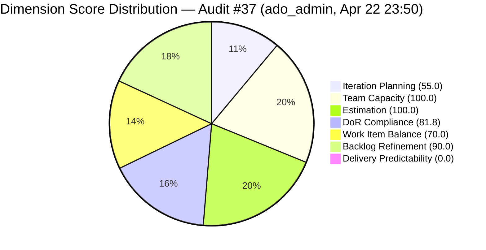

# ADO SAFe Iteration Audit — Administration Team

**Audit #37 | Iteration 7.2 (Apr 20 – May 3, 2026) | Day 3 of 14 (early-sprint)**

---

## 1. Audit Metadata

| Field | Value |
|---|---|
| **Audit Date** | April 22, 2026, 23:50 PHT (15:50 UTC) |
| **Auditor** | Claude Code (ADO SAFe Audit Agent) |
| **Workspace** | `ado_admin` |
| **ADO Project** | Jairosoft FINOPS (`e0bb302f-40f9-46c3-8164-6f1acb317d63`) |
| **Team** | Administration Team (`a38a9c02-07ab-483d-a1e3-aff54e19e603`) |
| **Iteration** | Iteration 7.2 — Apr 20 to May 3, 2026 |
| **Iteration ID** | `a9888bc5-48df-40dd-bcc8-6926a11aa7c7` |
| **Sprint Day** | Day 3 of 14 (early-sprint — Day 1–5 window) |
| **Prior Audit** | AUDIT_20260422_2341.md (Audit #36, 71.0 — Moderate Risk, PI7.2 Day 3) |
| **Scoring Model** | ADO SAFe v1 (7-dimension rubric) |
| **Overall Score** | **71.0 / 100** |
| **Risk Band** | **Moderate Risk** (60 – 79.9) |

> **Live ADO data confirmed.** All 20 visible root backlog items pulled from `Microsoft.RequirementCategory` backlog. Capacity confirmed from ADO iteration capacity API.

---

## 2. Executive Summary

The Administration Team holds a **71.0 / 100 Moderate Risk** position on Day 3 of Iteration 7.2. This is stable from the immediately prior audit (Audit #36, Apr 22, 71.0), consistent with a sprint whose structural profile has not changed since the iteration began.

Three persistent issues continue to constrain the score:

1. **DoR failures on #202898 (Condo dues, 3 SP) and #202909 (Davao Adhoc Support, 4 SP).** Both items remain in sprint scope — one Active, one Ready — with no Description and no Acceptance Criteria. Combined, they represent 7 SP (18% of committed SP) executing without verifiable done-criteria.

2. **Over-commitment at 44% above empirical ceiling.** 39 SP committed versus the ~27 SP ceiling established by PI7.1 empirical data. No de-scope action has been taken in the first three sprint days.

3. **9 PI7-root items remain unassigned to any iteration.** All nine items in the PI7 root path (193412, 197115, 197111, 192221, 197023, 197028, 197029, 197113, 202894) have been flagged in at least five consecutive audits without disposition. Item 202894 ("Goverment payables for") has no SP, no assignee, and an incomplete title — a data quality issue.

**One positive change since Audit #36:** Item 192221 ("Purchase additional Corrugated Sheet") was touched on Apr 22 (changed date 2026-04-22T01:43Z), confirming some PI7-root item activity, though it remains unscoped. The sprint set and all scores are otherwise unchanged.

**Recovery path:** Resolving DoR on #202898 and #202909 adds +2.3 points (DoR 81.8 → 100.0, overall 71.0 → 73.3). Scoping 2 more items into iter 7.2 would bring Iteration Planning to 65%.

---

## 3. Previous Audit Delta

| Dimension | Audit #36 (Apr 22, 23:41) | Audit #37 (Apr 22, 23:50) | Delta |
|---|---|---|---|
| Iteration Planning | 55.0 | 55.0 | 0.0 |
| Team Capacity | 100.0 | 100.0 | 0.0 |
| Estimation | 100.0 | 100.0 | 0.0 |
| DoR Compliance | 81.8 | 81.8 | 0.0 |
| Work Item Balance | 70.0 | 70.0 | 0.0 |
| Backlog Refinement | 90.0 | 90.0 | 0.0 |
| Delivery Predictability | 0.0 | 0.0 | 0.0 (early-sprint Day 3) |
| **Overall** | **71.0** | **71.0** | **0.0** |

**Key observations since Audit #36:**
- No scoring-impacting changes detected. Sprint item count, SP totals, DoR status, and backlog count are all unchanged.
- Item 192221 (PI7-root) was touched Apr 22 — confirming minor ADO activity, but the item remains unscoped.
- Item 202353 (sprint item) was touched Apr 22T00:16Z (day 3 start), confirming Mark is active on sprint work.
- Item 202909 ("Davao Admin Adhoc Support") was touched Apr 22T09:16Z — still Active, still no Description or AC.

**Score trajectory (recent):**

| Audit | Date | Score | Band | Sprint Day |
|---|---|---|---|---|
| #33 | Apr 21 | 69.5 | Moderate | 7.2 D2 |
| #34 | Apr 22 | 69.5 | Moderate | 7.2 D3 |
| #35 | Apr 23 | 71.0 | Moderate | 7.2 D4 |
| #36 | Apr 22, 23:41 | 71.0 | Moderate | 7.2 D3 |
| **#37** | **Apr 22, 23:50** | **71.0** | **Moderate** | **7.2 D3** |



---

## 4. Current Iteration Snapshot

| Metric | Value |
|---|---|
| **Visible root backlog items** | 20 |
| **Current iteration root items (Iter 7.2)** | 11 |
| **PI7-root items (unscoped)** | 9 |
| **Committed story points** | 39 SP |
| **Closed story points** | 0 SP |
| **Delivery rate (Day 3)** | 0.0% (early-sprint annotation) |
| **State distribution** | 4 Active, 5 Ready, 1 New, 1 Defect-Active |
| **Sole contributor** | Mark Colina (mcolina@jairosoft.com) |
| **Team capacity** | 5 h/day (Deployment 1h + Documentation 2h + Requirements 2h) |
| **Days off** | None |
| **Sprint day** | Day 3 of 14 |
| **Days remaining** | 11 |

### Sprint Commitment — Iteration 7.2 (Live, Apr 22 23:50)

| ID | Title | Type | State | SP | DoR | Last Changed |
|---|---|---|---|---|---|---|
| 202353 | JIT BFP certficate renewal 2026 | User Story | Active | 3 | Pass | Apr 22 |
| 202357 | Fixation in rooptop (Davao) | Defect | Active | 5 | Pass | Apr 17 (pre-iter) |
| 202366 | Philgeps renewal for 2026 | User Story | Active | 3 | Pass | Apr 17 (pre-iter) |
| 202895 | Government (EGOV) payables | User Story | Ready | 4 | Pass | Apr 21 |
| 202896 | Payables - Internet for Davao and Cebu office | User Story | Active | 5 | Pass | Apr 22 |
| 202897 | Utilities payables for Cebu and Davao | User Story | Ready | 4 | Pass | Apr 21 |
| 202898 | Condo dues (Cebu) payables | User Story | Ready | 3 | **FAIL** — no Desc, no AC | Apr 21 |
| 202909 | Davao Admin Adhoc Support Apr 20-May 3, 2026 | User Story | Active | 4 | **FAIL** — no Desc, no AC | Apr 22 |
| 202937 | 3 vendors to site visit at Davao for solar quotation | User Story | Ready | 3 | Pass | Apr 22 |
| 202939 | Professional fee for IC | User Story | Ready | 2 | Pass | Apr 21 |
| 202945 | Grass cutting outside at the building | User Story | New | 3 | Pass | Apr 20 |

---

## 5. Work Item Analysis

### Backlog Age Distribution

| Age Bucket | Count | Share |
|---|---|---|
| < 45 days (fresh, since Mar 8) | 20 | 100% |
| 45–90 days | 0 | 0% |
| 91–180 days | 0 | 0% |
| > 180 days | 0 | 0% |

All 20 backlog items were changed on or after Apr 17, 2026. The oldest touched item in the entire backlog (193412, Apr 17) is only 5 days old relative to today. The backlog is fully current.

### Untouched Current Items (ChangedDate < Apr 20, sprint start)

| ID | Title | Last Changed | Days Before Sprint Start |
|---|---|---|---|
| 202357 | Fixation in rooptop (Davao) | Apr 17, 2026 | 3 days pre-start |
| 202366 | Philgeps renewal for 2026 | Apr 17, 2026 | 3 days pre-start |

2 of 11 sprint items (18.2%) were not touched since sprint start. This falls in the -10 band (>10% but ≤30%).

### PI7-Root Items (Unscoped)

| ID | Title | Type | SP | Assignee | Last Changed |
|---|---|---|---|---|---|
| 193412 | Implementation of aircon repair 2nd floor | User Story | 2 | Mark Colina | Apr 17 |
| 197115 | Implementation of installing jockey pump | User Story | 4 | Mark Colina | Apr 17 |
| 197111 | Recanvass for Jockey pump materials needed | User Story | 1 | Mark Colina | Apr 17 |
| 192221 | Purchase additional Corrugated Sheet and installation Day 1 | User Story | 2 | Mark Colina | Apr 22 |
| 197023 | Installation of corrugated sheet at Fire Exit | User Story | 3 | Mark Colina | Apr 17 |
| 197028 | Purchase materials at Houseman Hardware | User Story | 1 | Mark Colina | Apr 17 |
| 197029 | Implementation of Parking with roof for 2 vehicles (Day 1) | User Story | 3 | Mark Colina | Apr 17 |
| 197113 | Purchase materials for Jockey pump | User Story | 1 | Mark Colina | Apr 17 |
| 202894 | Goverment payables for (incomplete title) | User Story | — | Unassigned | Apr 19 |

These 9 items represent 17 SP of unscoped work. All are in PI7 root path with no iteration assigned.

---

## 6. SAFe Compliance Scorecard

| Dimension | Score | Evidence | Notes |
|---|---|---|---|
| **1. Iteration Planning** | 55.0 | 11 current / 20 visible | 9 PI7-root items suppress ratio |
| **2. Team Capacity** | 100.0 | 1/1 contributor with capacity configured | Mark Colina: 5 h/day (Deploy 1h + Docs 2h + Req 2h), 0 days off |
| **3. Estimation** | 100.0 | 11/11 point-eligible items have SP > 0 | All sprint items estimated; SP range 2–5 |
| **4. DoR Compliance** | 81.8 | 9/11 sprint items pass DoR | #202898 and #202909 have no Description, no AC |
| **5. Work Item Balance** | 70.0 | 10 US + 1 Defect; dominant US = 90.9% | Start 100; -30 for dominant >60%; no spike penalty |
| **6. Backlog Refinement** | 90.0 | 20/20 fresh; 2/11 untouched (18.2%) | Base 100; -10 for untouched 10–30%; no stale penalties |
| **7. Delivery Predictability** | 0.0 | 0 SP closed / 39 SP committed | Early-sprint Day 3 — low delivery expected |
| **Overall** | **71.0** | Average of 7 dimensions | **Moderate Risk** |

### Score Computation

```
Iteration Planning    = round(11 / 20 × 100, 1)    = 55.0
Team Capacity         = round(1 / 1 × 100, 1)       = 100.0
Estimation            = round(11 / 11 × 100, 1)     = 100.0
DoR Compliance        = round(9 / 11 × 100, 1)      = 81.8
  [202898: no Desc, no AC → FAIL]
  [202909: no Desc, no AC → FAIL]

Work Item Balance:
  has_user_story      = True (10 User Stories)      → 0
  dominant_share      = 10/11 = 90.9% > 60%         → -30
  spike_share         = 0/11 = 0% < 40%             → 0
  total               = max(0, 100 - 30)            = 70.0

Backlog Refinement:
  fresh (≤45 days)    = 20/20 = 100%                → base = 100.0
  stale_90 share      = 0/20 = 0% ≤ 10%             → 0
  stale_180 count     = 0                           → 0
  untouched_current   = 2/11 = 18.2% > 10% ≤ 30%   → -10
  total               = max(0, 100 - 10)            = 90.0

Delivery Predictability = round(0 / 39 × 100, 1)   = 0.0
  [Early-sprint: Day 3 of 14 — low delivery expected]

Overall = round((55.0 + 100.0 + 100.0 + 81.8 + 70.0 + 90.0 + 0.0) / 7, 1)
        = round(496.8 / 7, 1)
        = round(70.97, 1)
        = 71.0  → Moderate Risk
```

---

## 7. Dimension Findings

### D1 — Iteration Planning (55.0)
The 9 PI7-root items suppress the ratio. All 9 root items are assigned to Mark Colina and have been parked in the PI7 root path through multiple sprint cycles. Item 192221 was touched Apr 22, confirming awareness, yet no iteration assignment was made. Triage action (close completed, scope remaining to 7.3+) is the single action that most improves this score.

### D2 — Team Capacity (100.0)
Mark Colina has activities configured at 5 h/day with no days off registered for this iteration. Single-person team bus factor remains a structural risk outside this scoring dimension.

### D3 — Estimation (100.0)
All 11 sprint items carry story points. SP distribution: 5(1), 4(2), 3(4), 2(1), 3(3). The highest-point item is #202357 (5 SP, rooftop fixation — a physical construction task). Estimation quality appears adequate for the work types.

### D4 — DoR Compliance (81.8)
Two items fail:
- **#202898 (Condo dues, 3 SP):** No Description field, no Acceptance Criteria. State = Ready — executing without documented scope. Has child tasks (202904, 202905) suggesting work is underway.
- **#202909 (Davao Admin Adhoc Support, 4 SP):** No Description, no AC. State = Active — actively being worked. Has child tasks (202910, 202943, 203010, 203012). This is the highest-priority DoR gap: an Active sprint item with 4 SP and no done criteria.

### D5 — Work Item Balance (70.0)
Sprint contains 10 User Stories and 1 Defect. User Stories dominate at 90.9%, triggering the -30 dominant-type penalty. No Spikes present. The operational nature of admin work (payables, procurement, facility maintenance) naturally skews to User Stories. Introducing Enablers or technical spike work would require deliberate backlog restructuring.

### D6 — Backlog Refinement (90.0)
All 20 backlog items are fresh (changed within 45 days — most within the past 5 days). Two sprint items were last touched Apr 17, placing untouched-current at 18.2% (in the -10 penalty band). This score is strong and expected to remain stable through the sprint.

### D7 — Delivery Predictability (0.0)
Zero SP closed at Day 3. Early-sprint annotation applies (Day 1–5). Four sprint items are in Active state (202353, 202357, 202366, 202909). First closures expected mid-sprint. If no items close by Day 7 (Apr 26), the score will remain 0.0 with increasing urgency.

---

## 8. Risks and Bottlenecks

| Risk | Severity | Status |
|---|---|---|
| DoR gap on #202909 (Active, 4 SP) — executing without any AC | High | Unresolved — Day 3 |
| DoR gap on #202898 (Ready, 3 SP) — no Desc or AC before execution | High | Unresolved — Day 3 |
| Over-commitment: 39 SP vs. ~27 SP empirical ceiling (44% over) | High | Unresolved — no de-scope in 3 days |
| Bus factor 1: Mark Colina is sole team member | High | Structural — no mitigation in place |
| 9 PI7-root items unscoped across multiple sprints | Moderate | Persistent — 5+ consecutive audit flags |
| #202894 has incomplete title and no SP/assignee | Low | Data quality — needs triage |
| Delivery Predictability at 0.0 | Low | Expected at Day 3; escalates after Day 5 |

---

## 9. Prioritized Recommendations

1. **[URGENT — Today] Add Description and AC to #202909 (Active, 4 SP) and #202898 (Ready, 3 SP).** #202909 is the highest priority — it is actively being worked with no done criteria. This is a 10-minute ADO edit that eliminates delivery quality risk on 7 SP and lifts overall score from 71.0 → 73.3.

2. **[This Week] De-scope 2–3 sprint items.** At 39 SP committed vs. ~27 SP ceiling, the team is overcommitted. Candidates for de-scope to 7.3: 202937 (solar quotation, 3 SP — procurement research), 202945 (grass cutting, 3 SP — low urgency). De-scoping 2 items reduces overcommitment risk without significantly impacting critical payable obligations.

3. **[This Sprint] Triage the 9 PI7-root items.** For each: completed → close; planned → assign to 7.3 or 7.4; abandoned → close as Removed. Resolving 4 of 9 would push Iteration Planning above 65.0.

4. **[This PI] Fix #202894 incomplete title and missing SP/assignee.** Title "Goverment payables for" is truncated and has a typo. Add the complete payable description, assign to Mark, and either move to a sprint or close if already settled.

5. **[Ongoing] Track mid-sprint delivery.** By Day 7 (Apr 26), at least 1 SP should be closed to establish delivery credibility. Target: 202895 (EGOV payables, 4 SP, Ready) — if triggered by a government payment deadline this week, it can be the first closure.

---

## 10. Evidence Gaps and Limitations

| Gap | Impact |
|---|---|
| #202894 has no SP, no assignee — excluded from SP totals | Item counted in Iteration Planning denominator but not in SP sums; data quality issue in ADO |
| #202898 and #202909 have no Description/AC fields in API response | DoR FAIL confirmed from null/missing field values; no ambiguity |
| Early-sprint delivery annotation | Delivery Predictability 0.0 is expected at Day 3 and is annotated; no formula adjustment |
| Single-person team | Team Capacity rewards capacity configuration; bus factor risk is flagged in Risks only |
| 202357 listed as Defect type in ADO | Defect type does expose Story Points in this project; scored correctly as point-eligible |

---

*Report generated by Claude Code ADO SAFe Audit Agent | April 22, 2026 23:50 PHT*
*Audit #37 — Administration Team — Iteration 7.2 Day 3 of 14 — Overall: 71.0 / 100 — Moderate Risk*
*Live ADO data — full pull confirmed*
*Priority actions: (1) Add Desc+AC to #202909 (Active) and #202898 today; (2) De-scope 2 items to address over-commitment; (3) Triage 9 PI7-root items*
