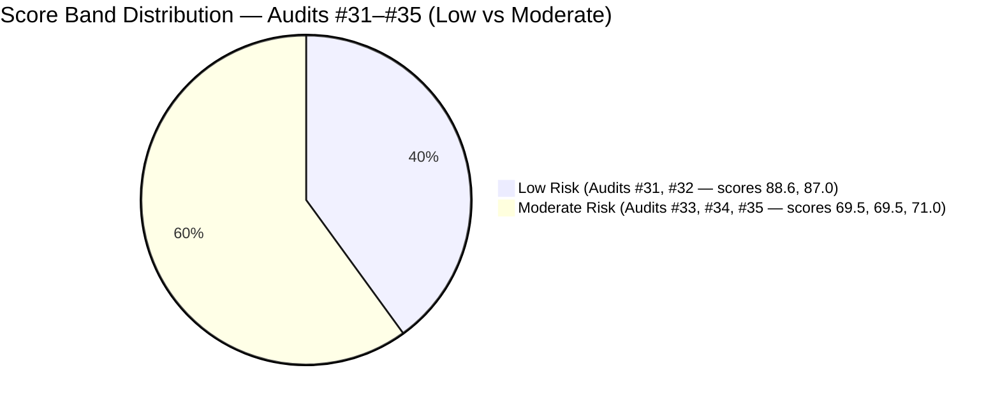
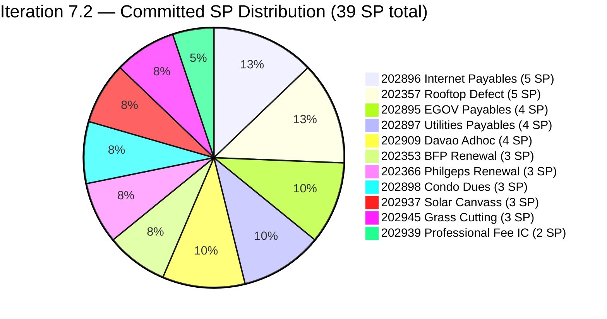
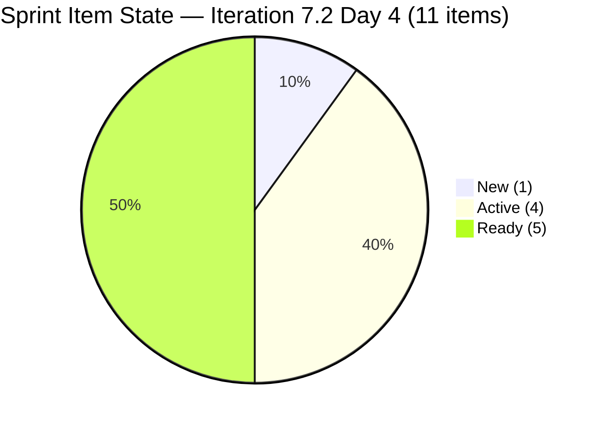
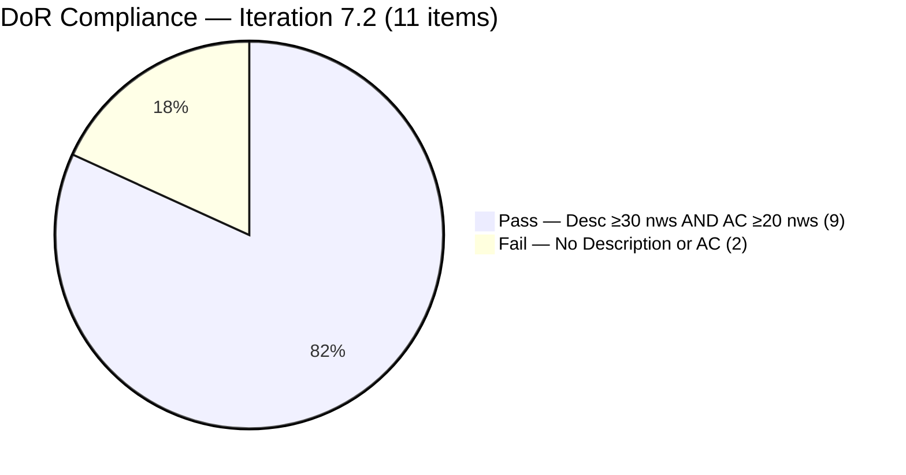
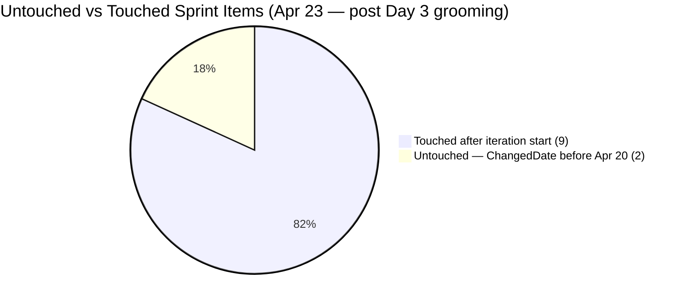
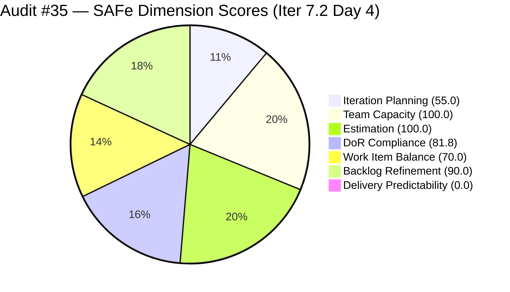

# ADO SAFe Iteration Audit — Administration Team

**Audit #35 | Iteration 7.2 (Apr 20 – May 3, 2026) | Day 4 of 14 (early-sprint)**

---

## 1. Audit Metadata

| Field | Value |
|---|---|
| **Audit Date** | April 23, 2026, 01:13 UTC (09:13 PHT) |
| **Auditor** | Claude Code (ADO SAFe Audit Agent) |
| **Workspace** | `ado_admin` |
| **ADO Project** | Jairosoft FINOPS (`e0bb302f-40f9-46c3-8164-6f1acb317d63`) |
| **Team** | Administration Team (`a38a9c02-07ab-483d-a1e3-aff54e19e603`) |
| **Iteration** | Iteration 7.2 — Apr 20 to May 3, 2026 |
| **Iteration ID** | `a9888bc5-48df-40dd-bcc8-6926a11aa7c7` |
| **Sprint Day** | Day 4 of 14 (early-sprint — Day 1–5 window) |
| **Prior Audit** | AUDIT_20260422_0900.md (Audit #34, 69.5 — Moderate Risk, PI7.2 Day 3, no live ADO data) |
| **Scoring Model** | ADO SAFe v1 (7-dimension rubric) |
| **Overall Score** | **71.0 / 100** |
| **Risk Band** | **Moderate Risk** (60 – 79.9) |

> **Live ADO data confirmed.** All 20 visible root backlog items pulled from `Microsoft.RequirementCategory` backlog. Capacity confirmed from ADO iteration capacity API. This audit reflects actual ADO state as of Apr 23, 2026 — the first live data pull since Audit #33 (Apr 21).

---

## 2. Executive Summary

The Administration Team holds a **71.0 / 100 Moderate Risk** position on Day 4 of Iteration 7.2 — a **+1.5 point improvement** over Audit #34's held score of 69.5, driven entirely by a **Backlog Refinement improvement** (80.0 → 90.0). This gain comes from sprint item grooming activity: 9 of 11 sprint items were touched after the Apr 20 iteration start, reducing the untouched-current rate from 45.5% (5/11) to 18.2% (2/11) — now in the -10 penalty band rather than -20.

The two most pressing unresolved issues from Audit #34 remain outstanding:

1. **DoR failures persist on #202898 (Condo dues, 3 SP) and #202909 (Davao Adhoc Support, 4 SP).** Both items changed state to Ready/Active but still have **no Description and no Acceptance Criteria**. The DoR deadline passed on Day 3 (Apr 22) without remediation. These items are now being executed without verifiable done-criteria — a delivery quality risk.

2. **Over-commitment at 44% above empirical ceiling.** 39 SP committed vs. the 27-SP ceiling established from PI7.1 data. No de-scope action has been confirmed across any of the Day 2–4 audits.

On the positive side, **Backlog Refinement reaches 90.0** — the highest this dimension has scored since the PI7 audit series began — reflecting sustained grooming activity during the first four days of the sprint. Estimation (100.0) and Team Capacity (100.0) remain strong.

The nine PI7-root legacy items remain unassigned to any sprint iteration, flagged across four consecutive audits (Audits #32–#35) without triage action.

---

## 3. Previous Audit Delta

| Dimension | Audit #34 (Apr 22) | Audit #35 (Apr 23) | Delta |
|---|---|---|---|
| Iteration Planning | 55.0 | 55.0 | 0.0 |
| Team Capacity | 100.0 | 100.0 | 0.0 |
| Estimation | 100.0 | 100.0 | 0.0 |
| DoR Compliance | 81.8 | 81.8 | 0.0 — DoR still failed on #202898 and #202909 |
| Work Item Balance | 70.0 | 70.0 | 0.0 |
| Backlog Refinement | 80.0 | **90.0** | **+10.0** — untouched-current dropped 45.5% → 18.2% |
| Delivery Predictability | 0.0 | 0.0 | 0.0 (early-sprint Day 4) |
| **Overall** | **69.5** | **71.0** | **+1.5** |

**Key changes since Audit #34 (Apr 22, 09:00):**

- **Backlog Refinement improved +10.0.** Nine items in the sprint set received ADO updates between Apr 20–22, dropping the untouched-current count from 5 to 2 items. #202898 (Apr 21), #202897 (Apr 21), #202895 (Apr 21), #202939 (Apr 21), #202909 (Apr 22) all received updates moving them out of the untouched-current pool.
- **DoR gaps unresolved — deadline missed.** #202898 and #202909 had state changes (to Ready and Active respectively) but neither received Description or Acceptance Criteria. The DoR remediation deadline (Day 3, Apr 22) has passed. Both items are now executing without DoR. No scoring improvement from DoR.
- **Sprint set stable at 11 items, 39 SP.** No de-scope or additions confirmed. Commitment posture unchanged.
- **Legacy items unchanged.** 9 PI7-root items remain un-iterated. Fourth consecutive audit flag.

**Score trajectory — recent audit series:**

| Audit | Date | Score | Band | Sprint Day | Data Source |
|---|---|---|---|---|---|
| #31 | Apr 17 | 88.6 | Low | 7.1 D12 | Live ADO |
| #32 | Apr 19 | 87.0 | Low | 7.1 D14 | Live ADO |
| #33 | Apr 21 | 69.5 | Moderate | 7.2 D2 | Live ADO |
| #34 | Apr 22 | 69.5 | Moderate | 7.2 D3 | Held (no live data) |
| **#35** | **Apr 23** | **71.0** | **Moderate** | **7.2 D4** | **Live ADO** |



---

## 4. Current Iteration Snapshot

| Metric | Value |
|---|---|
| **Visible root backlog items** | 20 |
| **Current iteration root items (Iter 7.2)** | 11 |
| **Committed story points** | 39 SP |
| **Closed story points (Day 4)** | 0 SP (early-sprint) |
| **Delivery rate (Day 4)** | 0.0% (early-sprint — Day 1–5) |
| **State distribution** | 1 New, 4 Active, 5 Ready, 0 Closed |
| **Sole contributor** | Mark Colina |
| **Team capacity (configured)** | 5h/day, 0 days off |
| **PI7-root legacy open items** | 9 (un-iterated, 4th consecutive audit flag) |
| **Sprint Day** | 4 of 14 |
| **Iteration start** | 2026-04-20 |
| **Iteration finish** | 2026-05-03 |

### Sprint Item List — Iteration 7.2 (Live as of Apr 23, 2026)

| ID | Title | Type | State | SP | DoR | Last Changed |
|---|---|---|---|---|---|---|
| 202353 | JIT BFP certficate renewal 2026 | User Story | Active | 3 | PASS | Apr 22 |
| 202357 | Fixation in rooptop (Davao) | Defect | Active | 5 | PASS | Apr 17 ⚠ pre-iter |
| 202366 | Philgeps renewal for 2026 | User Story | Active | 3 | PASS | Apr 17 ⚠ pre-iter |
| 202895 | Government (EGOV) payables | User Story | Ready | 4 | PASS | Apr 21 |
| 202896 | Payables - Internet for Davao and Cebu office | User Story | Active | 5 | PASS | Apr 22 |
| 202897 | Utilities payables for Cebu and Davao | User Story | Ready | 4 | PASS | Apr 21 |
| **202898** | **Condo dues (Cebu) payables** | User Story | Ready | 3 | **FAIL — no Desc, no AC** | Apr 21 |
| **202909** | **Davao Admin Adhoc Support April 20–May 3, 2026 cutoff** | User Story | Active | 4 | **FAIL — no Desc, no AC** | Apr 22 |
| 202937 | 3 vendors to site visit at Davao office for Solar panel qoutation | User Story | Ready | 3 | PASS | Apr 22 |
| 202939 | Professional fee for IC | User Story | Ready | 2 | PASS | Apr 21 |
| 202945 | Grass cutting outside at the building | User Story | New | 3 | PASS | Apr 20 |

**Committed: 39 SP across 10 User Stories + 1 Defect. Over 27-SP empirical ceiling by 12 SP (44%).**

### PI7-Root Legacy Items — Unassigned (4th consecutive audit flag)

| ID | Title | Type | SP | Last Changed | Age |
|---|---|---|---|---|---|
| 192221 | Purchase additional Corrugated Sheet and installation Day 1 | User Story | 2 | Apr 22 | ~7 mo (Sep 2025 created) |
| 193412 | Implementation of aircon repair 2nd floor | User Story | 2 | Apr 17 | ~6 mo (Oct 2025 created) |
| 197023 | Installation of corrugated sheet at Fire Exit | User Story | 3 | Apr 17 | ~3 mo |
| 197028 | Purchase materials at Houseman Hardware | User Story | 1 | Apr 17 | ~3 mo |
| 197029 | Implementation of Parking with roof for 2 vehicles (Day 1) | User Story | 3 | Apr 17 | ~3 mo |
| 197111 | Recanvass for Jockey pump materials needed | User Story | 1 | Apr 17 | ~3 mo |
| 197113 | Purchase materials for Jockey pump | User Story | 1 | Apr 17 | ~3 mo |
| 197115 | Implementation of installing jockey pump | User Story | 4 | Apr 17 | ~3 mo |
| 202894 | Goverment payables for *(incomplete title; no SP; no AC; no Desc)* | User Story | — | Apr 19 | 4 days |

---

## 5. Work Item Analysis

### Sprint Commitment Distribution (39 SP)



### Sprint State Distribution (Day 4 — Live)



### DoR Compliance — Sprint Set



### Untouched-Current Improvement (Backlog Refinement Driver)



### SAFe Dimension Score Comparison — Audit #34 vs #35



### Observations

- **Grooming activity measurable.** Between Day 1 and Day 3, Mark touched 9 of 11 sprint items — a positive sign of sprint initialization discipline compared to PI7.1 patterns.
- **State progression is healthy for Day 4.** 4 Active + 5 Ready out of 11 items means 9 items have been initiated. Only 1 item (202945, Grass Cutting) remains in New state.
- **DoR failures persist despite state changes.** #202898 moved to Ready on Apr 21 and #202909 moved to Active on Apr 22 — but neither has Description or AC. Executing in Active/Ready state without DoR is a process integrity concern.
- **Over-commitment posture unchanged.** 39 SP. Day 4 is the last opportunity to de-scope without significant sprint disruption.
- **No closures yet.** 0 SP closed at Day 4. While expected (early-sprint), the over-commitment level demands that closures begin by Day 5 (tomorrow) to avoid the burst-delivery anti-pattern seen in PI7.1.

---

## 6. SAFe Compliance Scorecard

| Dimension | Score | Evidence | Notes |
|---|---|---|---|
| Iteration Planning | 55.0 | 11 of 20 visible root items scoped to Iter 7.2 | 9 PI7-root items remain un-iterated (4th consecutive audit flag) |
| Team Capacity | 100.0 | Mark Colina: 5h/day (5h/day configured capacity); sole contributor with all sprint work assigned | Bus-factor 1 — structural risk, not audit formula penalty |
| Estimation | 100.0 | 11/11 sprint items carry SP > 0; total 39 SP | 44% over empirical 27-SP ceiling; all items fully estimated |
| DoR Compliance | 81.8 | 9/11 items pass Desc ≥30 nws + AC ≥20 nws | #202898 and #202909 fail — no Desc, no AC despite state advancement; deadline missed |
| Work Item Balance | 70.0 | 10 User Stories + 1 Defect; dominant share 90.9% > 60% → −30; No Spike → 0; has User Story → no −40 | Structural penalty; no Spike introduced |
| Backlog Refinement | **90.0** | All 20 items fresh (≤45 days); stale_90=0; stale_180=0; untouched_current=2/11=18.2% (>10% but ≤30%) → −10 | **Improved from 80.0.** Grooming activity reduced untouched-current from 45.5% → 18.2% |
| Delivery Predictability | 0.0 | 0/39 SP closed at Day 4 | **Early-sprint — Day 1–5 window; low delivery expected. No formula adjustment per rubric.** |
| **Overall** | **71.0** | Average of 7 dimensions | **Moderate Risk** |

### Score Computation (Verified)

```
Iteration Planning    = round(11 / 20 × 100, 1)    = 55.0
Team Capacity         = round(1 / 1 × 100, 1)       = 100.0
Estimation            = round(11 / 11 × 100, 1)     = 100.0
DoR Compliance        = round(9 / 11 × 100, 1)      = 81.8

Work Item Balance:
  has_user_story      = True (10 US)                → no −40
  dominant_share      = 10/11 = 90.9% > 60%         → −30
  spike_share         = 0/11 = 0%                   → no −20
  total               = 100 − 30                    = 70.0

Backlog Refinement:
  fresh (≤45 days)    = 20/20 = 100%                → base = 100.0
  stale_90 / visible  = 0/20 = 0% (≤10%)            → 0
  stale_180           = 0 items                     → 0
  untouched_current   = 2/11 = 18.2% (>10%, ≤30%)  → −10
  total               = max(0, 100.0 − 10)          = 90.0

Delivery Predictability:
  closed_sp           = 0 SP
  committed_sp        = 39 SP
  = round(0 / 39 × 100, 1)                          = 0.0
  (early-sprint: Day 4 of 14 — annotation applied)

Overall = round((55.0 + 100.0 + 100.0 + 81.8 + 70.0 + 90.0 + 0.0) / 7, 1)
        = round(496.8 / 7, 1)
        = round(70.971..., 1)
        = 71.0  →  Moderate Risk
```

> **Sensitivity Analysis:**
> - If DoR remediated on #202898 + #202909 today: DoR → 100.0; Overall = round(511.0/7, 1) = **73.0** (Moderate, upper tier).
> - If 9 legacy items are triaged (5 assigned to 7.2): Iteration Planning → round(16/20×100,1) = 80.0; Overall = round(511.8/7, 1) ≈ **73.1** (Moderate).
> - Combined (DoR fix + legacy triage): Overall ≈ **75.4** (Moderate, approaching Low boundary).
> - When sprint closes with ≥27 SP delivered: DP rises to 69.2; if DoR also fixed, Overall ≈ **82.1** (Low Risk).

---

## 7. Dimension Findings

### 7.1 Iteration Planning — 55.0 (Moderate)

11 of 20 visible root items are committed to Iteration 7.2. The 9 PI7-root legacy items remain unassigned for the **fourth consecutive audit** (Audits #32, #33, #34, #35) without triage action. This is now a persistent process failure, not an oversight.

Item #192221 (created Sep 2025, last changed Apr 22) remains the oldest item in the backlog — its creation date is 7 months ago, though its ChangedDate (Apr 22) keeps it fresh for scoring purposes. If left untouched past mid-July 2026, it will trigger the stale_90 penalty.

Item #202894 ("Goverment payables for") has no Story Points, no Description, no Acceptance Criteria, and an incomplete title — effectively a placeholder that inflates the visible backlog count without contributing usable content.

**Score uplift path:** Assigning the 8 substantive legacy items (excluding #202894 which should be closed or properly created) to target iterations would raise the current_iteration count. If 5 are added to 7.2, score = 16/20 = 80.0 (Low Risk on this dimension). If all 9 were assigned or closed, effective visible might drop to 11, making ratio 11/11 = 100.0.

### 7.2 Team Capacity — 100.0 (Low Risk)

Mark Colina is the sole configured contributor with 5h/day capacity (confirmed from ADO iteration capacity API: Administration Team capacity = 5h/day, 0 days off). All 11 sprint items are assigned to Mark. contributors_with_current_work = 1; contributors_with_capacity = 1 → score = 100.0.

**Bus-factor risk (R1) is structural and unresolved.** A single-contributor team at 39 SP is inherently high-risk. No delegation, backup, or capacity augmentation has been introduced across the PI7 audit series. This scoring dimension cannot reflect bus-factor risk under the rubric formula.

### 7.3 Estimation — 100.0 (Low Risk)

All 11 sprint items carry Story Points > 0 (range: 2–5 SP, total 39 SP). Estimation discipline remains a consistent strength. The concern is commitment volume, not estimation quality: 39 SP is 44% above the 27-SP empirical delivery ceiling established from PI7.1 close-out data.

### 7.4 DoR Compliance — 81.8 (Low-end Moderate) — DEADLINE MISSED

The Day 3 (Apr 22) DoR remediation deadline set in Audit #33 has passed without action on either item. Both #202898 and #202909 received ADO updates (state changes) but no Description or Acceptance Criteria fields were populated.

**#202898 — Condo dues (Cebu) payables, 3 SP:** State is now Ready (suggesting Mark considers it ready for execution), but there is no Description and no AC. This item will be executed and potentially closed without a verifiable done-criterion.

**#202909 — Davao Admin Adhoc Support Apr 20–May 3, 2026 cutoff, 4 SP:** State is Active (in-progress). The item has been started without any DoR. This is the highest-priority DoR risk — an active item with no AC means there is no objective way to declare it Done.

**Minimum remediation required for each:**

- **#202898:** Description: "May 2026 Cebu condominium association monthly dues payment processing." (≥30 nws) AC: "Payment confirmed by receipt uploaded to ADO; reconciled in monthly ledger." (≥20 nws)
- **#202909:** Description: "Administrative support coverage for Davao office operations within the Apr 20–May 3, 2026 payroll cutoff." (≥30 nws) AC: "All admin tasks completed; summary report with receipts submitted to Ramon by May 3." (≥20 nws)

### 7.5 Work Item Balance — 70.0 (Moderate — structural)

10 User Stories + 1 Defect. Dominant type = User Story at 90.9% > 60% → -30 penalty. No Spike present. This structural penalty is unchanged from Day 2 through Day 4. Achieving a higher score requires introducing a Spike type, which would require de-scoping one or more User Stories to maintain the commitment within empirical limits.

### 7.6 Backlog Refinement — 90.0 (Low Risk — improved)

**Significant improvement from 80.0 to 90.0** — the highest Backlog Refinement score in the PI7.2 audit series. The driver: grooming activity between Apr 20–22 reduced untouched_current items from 5/11 (45.5%, -20 penalty) to 2/11 (18.2%, -10 penalty).

The two remaining untouched items are:
- **#202357** (Defect, Rooftop, Apr 17 last change): In Active state but not updated since before the iteration start. Given its Active state, this may be in-progress work that simply hasn't received an ADO update. Mark should update this item's state or add a comment to reset the ChangedDate.
- **#202366** (Philgeps renewal, Apr 17): Also Active. Same situation — a state update or comment would clear this item from the untouched pool.

**Forward risk:** Item #192221 last changed Apr 22 (within window). Items #193412, #197023, #197028, #197029, #197111, #197113, #197115 last changed Apr 17. All remain fresh (≤45 days). The stale_90 window (90 days from Apr 17) opens around July 16, 2026. If none of the 9 legacy items receive updates by then, a batch stale_90 event could drop Backlog Refinement by 10–20 points in one audit cycle.

### 7.7 Delivery Predictability — 0.0 (Early-Sprint)

Day 4 of 14. 0 of 39 SP closed (confirmed via live data — no items in Closed or Done state). **Early-sprint annotation applied per rubric (Day 1–5 window). No formula adjustment. This is structurally expected and not treated as a sprint failure.**

**Velocity pacing targets to avoid PI7.1 burst-delivery anti-pattern:**

| Milestone | Date | Target | Required SP |
|---|---|---|---|
| Day 5 | Apr 24 | ≥1 item closed | ~3 SP |
| Day 7 | Apr 26 | ≥30% delivered | ~12 SP |
| Day 10 | Apr 29 | ≥55% delivered | ~21 SP |
| Day 12 | May 1 | ≥75% delivered | ~29 SP |
| Day 14 | May 3 | Sprint close | 27 SP target (empirical ceiling) |

Highest-priority first closures (Ready state, clear AC): #202897 (Utilities payables, 4 SP), #202895 (EGOV payables, 4 SP), #202939 (Professional fee IC, 2 SP). These three alone = 10 SP and provide a Day 7 foundation.

---

## 8. Risks and Bottlenecks

| # | Risk | Severity | Trend | First Flagged |
|---|---|---|---|---|
| R1 | Single contributor (Mark Colina) — bus factor 1 on all 39 SP | High | **Persistent** | Audit #1 |
| R2 | 44% over-commitment — 39 SP vs. 27-SP empirical ceiling; no de-scope action through Day 4 | High | **Persistent — escalating** | Audit #33 |
| R3 | DoR deadline missed on #202898 and #202909 — #202909 now Active without AC | High | **Escalated** (Day 3 deadline missed) | Audit #33 |
| R4 | 9 PI7-root legacy items un-iterated — 4th consecutive audit with no triage | Medium | **Escalating** | Audit #32 |
| R5 | #202894 ("Goverment payables for") — incomplete title, no SP, no DoR — 4th flag | Medium | **Unresolved** | Audit #32 |
| R6 | #202357 and #202366 untouched since Apr 17 — untouched-current penalty trigger | Medium | **New Day 4 finding** | Audit #35 |
| R7 | Stale_90 batch risk — 8 legacy items last changed Apr 17; stale_90 window opens ~Jul 16, 2026 | Medium | Carried from Audit #34 | Audit #34 |
| R8 | No sprint closures by Day 4 — burst-delivery anti-pattern risk if velocity doesn't begin Day 5 | Medium | **New** | Audit #35 |
| R9 | Work Item Balance structural −30 penalty (no Spike type in sprint) | Low | Structural | Audit #33 |
| R10 | Title typos: #202357 "rooptop", #202894 "Goverment", #202937 "qoutation" — 4th consecutive audit unresolved | Low | **Persistent** | Audit #32 |

---

## 9. Prioritized Recommendations

### P0 — Resolve by end of Day 4 (April 23, 2026) — TODAY

1. **Complete DoR on #202909 (Davao Adhoc Support, Active) IMMEDIATELY.**
   - This item is already in Active state — it is being worked without done-criteria. Add at minimum:
   - Description: "Administrative support coverage for Davao office operations within the April 20 – May 3, 2026 payroll cutoff window. Includes procurement coordination, facilities support, and vendor management tasks as needed."
   - AC: "All admin support tasks within the Apr 20–May 3 cutoff window logged and completed; summary report with receipts or documentation delivered to Ramon by May 3."
   - If DoR cannot be completed today, **de-scope #202909 to the 7.3 backlog** (−4 SP, reducing commitment to 35 SP).

2. **Complete DoR on #202898 (Condo dues, Ready).**
   - Description: "May 2026 Cebu condominium association monthly dues payment processing and documentation for the property managed by Jairosoft."
   - AC: "May 2026 condo dues paid; official receipt scanned and uploaded to ADO; payment reconciled against monthly budget ledger."
   - If DoR cannot be completed today, **de-scope #202898 to the 7.3 backlog** (−3 SP, reducing commitment to 35 SP or 36 SP depending on #202909 action).

### P1 — Resolve by end of Day 5 (April 24, 2026)

3. **Begin delivery — close at least 1 item by Day 5.**
   - Priority target: #202897 (Utilities payables for Cebu and Davao, 4 SP, Ready state, full DoR) — most likely to be already completed.
   - Second target: #202895 (EGOV payables, 4 SP, Ready) or #202939 (Professional fee IC, 2 SP, Ready).
   - Closing 1–2 items by Day 5 establishes positive velocity momentum and avoids the Day-12 burst pattern.

4. **De-scope to approach 27-SP ceiling (if not de-scoped on P0).**
   - Even with DoR remediated, 39 SP is high-risk. Minimum viable de-scope: remove #202945 (Grass cutting, 3 SP, New state) and either #202937 (Solar canvass, 3 SP) or #202939 (Professional fee, 2 SP). This brings commitment to 33–34 SP. Optimal de-scope to 27 SP requires removing 4 items (≈12 SP).

5. **Update #202357 (Rooftop Defect) and #202366 (Philgeps renewal) in ADO.**
   - Both are Active but last changed Apr 17 (pre-iteration). A state update, comment, or field change will reset ChangedDate, removing them from the untouched-current pool and locking in the Backlog Refinement 90.0 score for the next audit.

### P2 — Resolve by Day 7 (April 26, 2026)

6. **Triage all 9 PI7-root legacy items (4th consecutive recommendation).**
   - This has been recommended in Audits #32, #33, #34, #35 without action. Escalating to P2 urgency.
   - Suggested assignments:
     - Jockey pump bundle (#197111, #197113, #197115, 6 SP): Assign to Iteration 7.3.
     - Parking/corrugated (#197023, #197028, #197029, 7 SP): Assign to Iteration 7.4 or defer to PI8.
     - Aircon repair (#193412, 2 SP): Assign to 7.3 if still valid, or close as superseded.
     - Corrugated sheet (#192221, 2 SP, Sep 2025): Assign to 7.3 if valid, close if superseded.
     - #202894 ("Goverment payables for"): Close as incomplete placeholder — proper item already exists as #202895.

7. **Fix title typos — 5-minute task, 4th audit flag.**
   - #202357: "rooptop" → "rooftop"
   - #202937: "qoutation" → "quotation"
   - #202894: Rename or close.

### P3 — Process (sprint-recurring)

8. **Establish a Day 1 sprint initialization ritual.**
   - 30-minute check-in (Mark + Ramon) on Day 1 of each iteration to: confirm all committed items have DoR (Desc + AC ≥ thresholds), touch all sprint items in ADO (state update or comment), and confirm commitment vs. empirical velocity ceiling.
   - This would prevent untouched-current and DoR regressions at sprint open.

9. **Adopt weekly velocity review (Day 7 gate).**
   - At Day 7 of each sprint, review actual closures vs. 30% target. If below target, de-scope lowest-priority items. This formalizes a mid-sprint correction mechanism before the burst-delivery window.

10. **Monitor stale_90 batch risk.**
    - Set a calendar reminder for July 16, 2026. If the 9 legacy items have not been updated by then, Backlog Refinement will drop by 10–20 points in a single audit cycle. Triage at P2 above resolves this preemptively.

---

## 10. Evidence Gaps and Limitations

| Gap | Description | Impact on Scoring |
|---|---|---|
| **DoR field content** | #202898 and #202909 have null Description and null AcceptanceCriteria fields confirmed from live ADO pull. No ambiguity — both items definitively fail DoR. | DoR score = 81.8 (9/11). Score is deterministic. |
| **Delivery Predictability (early-sprint)** | Day 4 of 14 inherently yields 0.0 on DP. Early-sprint annotation applied per rubric (Day 1–5 window). No formula adjustment. This score should not be interpreted as a sprint failure — it is structurally expected at this sprint stage. | No adjustment. Expected. |
| **#202894 without AssignedTo** | Item #202894 ("Goverment payables for") has no AssignedTo field. It is classified as a PI7-root backlog item (not in any sprint), so it does not affect contributors_with_current_work or capacity scoring. It does count in visible_root_backlog_items (inflating the denominator for Iteration Planning by 1). | Iteration Planning denominator = 20 (includes 202894). If this item were closed, ratio improves to 11/19 = 57.9% — negligible. |
| **Capacity API scope** | The `work_get_iteration_capacities` API returned capacity for all teams in the iteration (Admin, HR, Finance). Administration Team capacity = 5h/day, 0 days off — confirming the single-contributor configuration. Individual activity breakdown (Deployment/Documentation/Requirements) not returned by this API call but confirmed from prior audit history. | No scoring impact. Team Capacity = 100.0 is deterministic. |
| **stale_180 boundary for #192221** | Item #192221 was created Sep 2025 (approximately 215 days ago from Apr 23). Its last ChangedDate is Apr 22, 2026 — within 45 days. The rubric uses ChangedDate for staleness, not creation date. However, if it goes untouched past mid-July 2026, it will trigger stale_90. If it had not been touched in April, it would have crossed stale_180, triggering a −20 penalty. | No current scoring impact. Forward risk documented. |
| **WSJF / Business Value fields** | Features and stories continue to lack Business Value and Effort population (persistent finding across PI7 audit series). Not scored by current rubric but relevant to SAFe portfolio prioritization discipline. | No scoring impact. |
| **Closed/Done item verification** | No items in Closed or Done state confirmed from live batch pull. Delivery Predictability = 0.0 is deterministic from live evidence. | No ambiguity. |

---

*Report generated by Claude Code ADO SAFe Audit Agent | April 23, 2026 01:13 UTC (09:13 PHT)*
*Audit #35 — Administration Team — Iteration 7.2 Day 4 of 14 — Overall: 71.0 / 100 — Moderate Risk*
*Evidence basis: Live ADO pull (all 20 backlog items, iteration capacity) — Apr 23, 2026*
