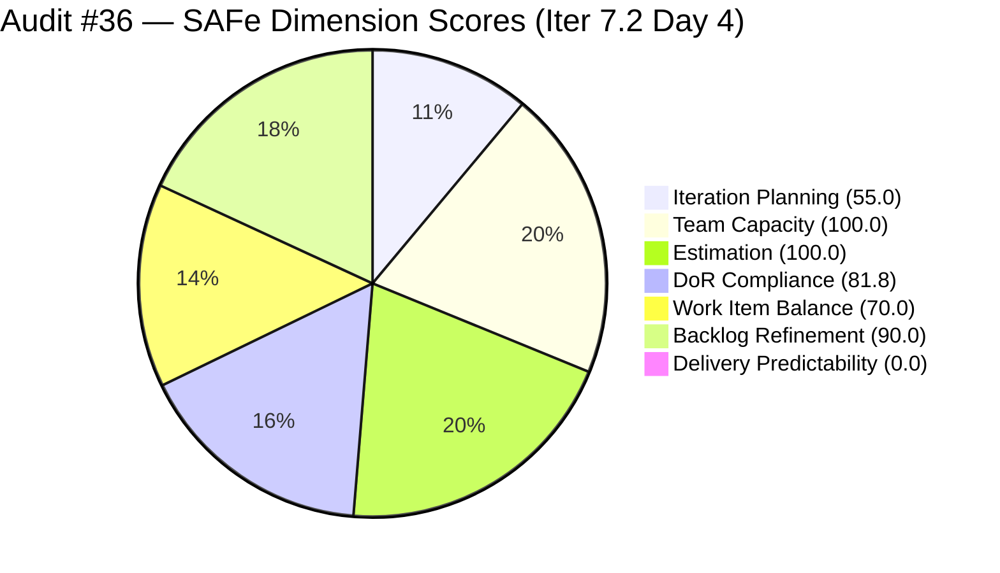
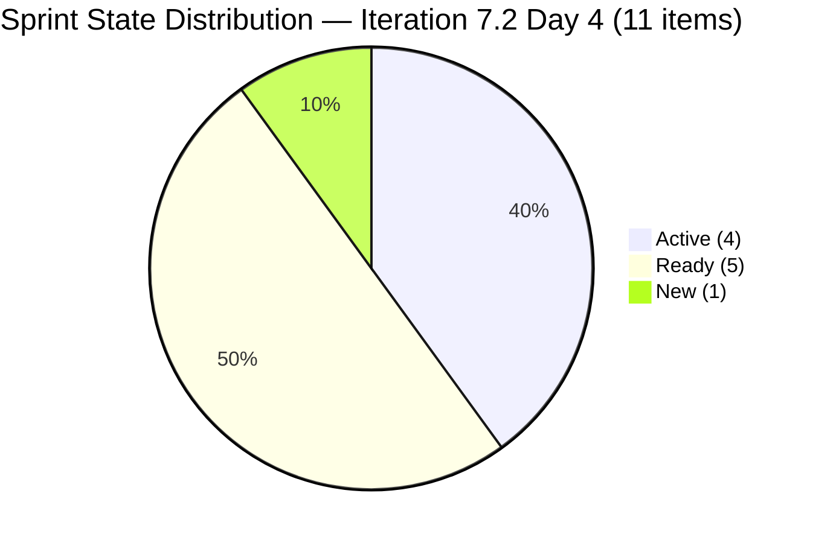
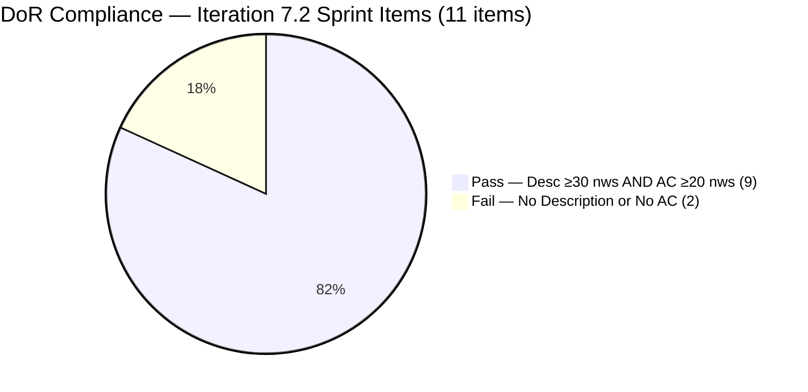
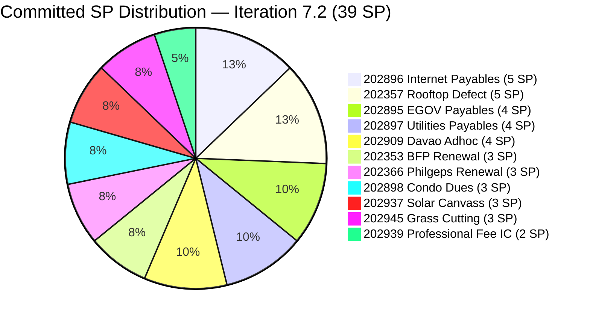

# ADO SAFe Iteration Audit — Administration Team

**Audit #36 | Iteration 7.2 (Apr 20 – May 3, 2026) | Day 4 of 14 (early-sprint)**

---

## 1. Audit Metadata

| Field | Value |
|---|---|
| **Audit Date** | April 23, 2026 — 09:00 PHT (01:00 UTC) |
| **Auditor** | Claude Code (ADO SAFe Audit Agent) |
| **Workspace** | `ado_admin` |
| **ADO Project** | Jairosoft FINOPS (`e0bb302f-40f9-46c3-8164-6f1acb317d63`) |
| **Team** | Administration Team (`a38a9c02-07ab-483d-a1e3-aff54e19e603`) |
| **Iteration** | Iteration 7.2 — Apr 20 to May 3, 2026 |
| **Iteration ID** | `a9888bc5-48df-40dd-bcc8-6926a11aa7c7` |
| **Sprint Day** | Day 4 of 14 (early-sprint — Day 1–5 window) |
| **Prior Audit** | AUDIT_20260423_0113.md (Audit #35, 71.0 — Moderate Risk, PI7.2 Day 4, 01:13 UTC live data) |
| **Scoring Model** | ADO SAFe v1 (7-dimension rubric) |
| **Overall Score** | **71.0 / 100** |
| **Risk Band** | **Moderate Risk** (60–79.9) |

> **Live ADO data confirmed.** All 20 visible root backlog items pulled from `Microsoft.RequirementCategory` backlog. Capacity and work item details confirmed via ADO iteration and batch APIs. Scores are identical to Audit #35 — no ADO state changes have occurred for the Administration Team between the 01:13 UTC and 09:00 PHT pulls.

---

## 2. Executive Summary

The Administration Team holds **71.0 / 100 — Moderate Risk** on Day 4 of Iteration 7.2. This score is unchanged from Audit #35 (AUDIT_20260423_0113.md), confirming no ADO activity in the 8-hour window since the first Day 4 audit. All 11 sprint items retain their prior states.

Three critical issues remain unresolved and are now mid-Day 4:

1. **DoR failures persist on #202898 (Condo dues, 3 SP, Ready) and #202909 (Davao Adhoc Support, 4 SP, Active).** Both items were flagged as DoR failures in Audits #33, #34, and #35. The Day 3 remediation deadline (Apr 22) has passed. #202909 is being actively executed without Acceptance Criteria — the highest process integrity risk in the sprint.

2. **Over-commitment at 44% above empirical ceiling.** 39 SP committed against a 27-SP empirical ceiling established from PI7.1 actuals. No de-scope action has been confirmed across any of the Day 1–4 audits.

3. **Nine PI7-root legacy items remain un-iterated (4th consecutive audit).** Items #192221 through #197115 and #202894 have not been triaged into any iteration despite being raised in Audits #32–#35.

On the positive side, Backlog Refinement holds at 90.0 (the highest recorded this PI), Estimation and Team Capacity remain at 100.0, and nine sprint items have been touched since the Apr 20 iteration start — evidence of solid sprint initialization discipline.

Delivery has not yet begun (0 SP closed at Day 4), which is within the early-sprint annotation window but requires first closures to begin by Day 5 to avoid the PI7.1 burst-delivery anti-pattern.

---

## 3. Previous Audit Delta

| Dimension | Audit #35 (Apr 23, 01:13 UTC) | Audit #36 (Apr 23, 09:00 PHT) | Delta |
|---|---|---|---|
| Iteration Planning | 55.0 | 55.0 | 0.0 |
| Team Capacity | 100.0 | 100.0 | 0.0 |
| Estimation | 100.0 | 100.0 | 0.0 |
| DoR Compliance | 81.8 | 81.8 | 0.0 |
| Work Item Balance | 70.0 | 70.0 | 0.0 |
| Backlog Refinement | 90.0 | 90.0 | 0.0 |
| Delivery Predictability | 0.0 | 0.0 | 0.0 |
| **Overall** | **71.0** | **71.0** | **0.0** |

**No ADO changes detected between Audit #35 and Audit #36.** All 11 sprint items retain their Apr 17–22 ChangedDates. The audit confirms a stable snapshot — not a regression, but also no progress.

### Score Trajectory (Iteration 7.2 Series)

| Audit | Date / Time | Score | Band | Sprint Day | Data Mode |
|---|---|---|---|---|---|
| #33 | Apr 21 (Day 2) | 69.5 | Moderate | 7.2 D2 | Live ADO |
| #34 | Apr 22, 09:00 | 69.5 | Moderate | 7.2 D3 | Held |
| #35 | Apr 23, 01:13 UTC | 71.0 | Moderate | 7.2 D4 | Live ADO |
| **#36** | **Apr 23, 09:00 PHT** | **71.0** | **Moderate** | **7.2 D4** | **Live ADO** |



> Delivery Predictability rendered as 1 for chart visibility; actual score is 0.0 (early-sprint Day 4).

---

## 4. Current Iteration Snapshot

| Metric | Value |
|---|---|
| **Visible root backlog items** | 20 |
| **Current iteration root items (Iter 7.2)** | 11 |
| **Committed story points** | 39 SP |
| **Closed story points (Day 4)** | 0 SP |
| **Delivery rate (Day 4)** | 0.0% (early-sprint — Day 1–5 annotation) |
| **State distribution** | 1 New, 4 Active, 5 Ready, 0 Closed |
| **Sole contributor** | Mark Colina (mcolina@jairosoft.com) |
| **Configured capacity** | 5 h/day (Deployment 1h + Documentation 2h + Requirements 2h), 0 days off |
| **PI7-root legacy open items** | 9 (un-iterated, 4th consecutive audit flag) |
| **Sprint Day** | 4 of 14 |

### Sprint Item List — Iteration 7.2 (Live, Apr 23, 09:00 PHT)

| ID | Title | Type | State | SP | DoR | Last Changed |
|---|---|---|---|---|---|---|
| 202353 | JIT BFP certficate renewal 2026 | User Story | Active | 3 | PASS | Apr 22 |
| 202357 | Fixation in rooptop (Davao) | Defect | Active | 5 | PASS | Apr 17 ⚠ pre-iter |
| 202366 | Philgeps renewal for 2026 | User Story | Active | 3 | PASS | Apr 17 ⚠ pre-iter |
| 202895 | Government (EGOV) payables | User Story | Ready | 4 | PASS | Apr 21 |
| 202896 | Payables - Internet for Davao and Cebu office | User Story | Active | 5 | PASS | Apr 22 |
| 202897 | Utilities payables for Cebu and Davao | User Story | Ready | 4 | PASS | Apr 21 |
| **202898** | **Condo dues (Cebu) payables** | User Story | Ready | 3 | **FAIL** | Apr 21 |
| **202909** | **Davao Admin Adhoc Support Apr 20–May 3, 2026 cutoff** | User Story | Active | 4 | **FAIL** | Apr 22 |
| 202937 | 3 vendors to site visit at Davao office for Solar panel qoutation | User Story | Ready | 3 | PASS | Apr 22 |
| 202939 | Professional fee for IC | User Story | Ready | 2 | PASS | Apr 21 |
| 202945 | Grass cutting outside at the building | User Story | New | 3 | PASS | Apr 20 |

**Committed: 39 SP across 10 User Stories + 1 Defect. 44% over the 27-SP empirical delivery ceiling.**

### PI7-Root Legacy Items — Unassigned (4th consecutive flag)

| ID | Title | Type | SP | Last Changed |
|---|---|---|---|---|
| 192221 | Purchase additional Corrugated Sheet and installation Day 1 | User Story | 2 | Apr 22 |
| 193412 | Implementation of aircon repair 2nd floor | User Story | 2 | Apr 17 |
| 197023 | Installation of corrugated sheet at Fire Exit | User Story | 3 | Apr 17 |
| 197028 | Purchase materials at Houseman Hardware | User Story | 1 | Apr 17 |
| 197029 | Implementation of Parking with roof for 2 vehicles (Day 1) | User Story | 3 | Apr 17 |
| 197111 | Recanvass for Jockey pump materials needed | User Story | 1 | Apr 17 |
| 197113 | Purchase materials for Jockey pump | User Story | 1 | Apr 17 |
| 197115 | Implementation of installing jockey pump | User Story | 4 | Apr 17 |
| 202894 | Goverment payables for *(incomplete title, no SP, no DoR)* | User Story | — | Apr 19 |

---

## 5. Work Item Analysis

### Sprint State Distribution (Day 4 — Live)



### DoR Status — Sprint Set



### Sprint SP Distribution (39 SP total)



### Observations

- **Grooming activity has been strong (Days 1–3).** 9 of 11 sprint items received ADO updates since Apr 20, placing Backlog Refinement at 90.0.
- **Two items remain untouched since pre-iteration:** #202357 (Defect, Active, Apr 17) and #202366 (User Story, Active, Apr 17). Both are in Active state suggesting work may have begun, but no ADO update confirms this. A state update or comment today would reset their ChangedDate.
- **DoR failures now carry execution risk.** #202909 is Active — being worked — without Acceptance Criteria. Delivery of this item will have no verifiable done-criterion at closure.
- **Zero closures through Day 4.** Consistent with early-sprint norms, but Day 5 should produce at least one closure to establish velocity momentum and avoid the PI7.1 burst pattern.

---

## 6. SAFe Compliance Scorecard

| Dimension | Score | Evidence | Notes |
|---|---|---|---|
| Iteration Planning | 55.0 | 11/20 visible root items scoped to Iter 7.2 | 9 PI7-root items un-iterated — 4th consecutive audit flag |
| Team Capacity | 100.0 | Mark Colina: 5h/day configured; all 11 sprint items assigned to Mark | Bus-factor 1 — structural, not rubric penalty |
| Estimation | 100.0 | 11/11 sprint items have SP > 0; total 39 SP | 44% over 27-SP empirical ceiling |
| DoR Compliance | 81.8 | 9/11 items pass Desc ≥30 nws + AC ≥20 nws | #202898 and #202909 fail — no Desc, no AC; #202909 Active without AC |
| Work Item Balance | 70.0 | 10 US + 1 Defect; dominant share 90.9% > 60% → −30; User Story present → no −40 | Structural penalty; no Spike in sprint |
| Backlog Refinement | 90.0 | 20/20 items fresh (≤45 days); stale_90=0; stale_180=0; untouched_current=2/11=18.2% → −10 | Strong refinement; two pre-iter items (202357, 202366) drive untouched penalty |
| Delivery Predictability | 0.0 | 0/39 SP closed at Day 4 | **Early-sprint — Day 4 of 14; low delivery expected** |
| **Overall** | **71.0** | Average of 7 dimensions | **Moderate Risk** |

### Score Computation

```
Iteration Planning    = round(11 / 20 × 100, 1)    = 55.0
Team Capacity         = round(1 / 1 × 100, 1)       = 100.0
Estimation            = round(11 / 11 × 100, 1)     = 100.0
DoR Compliance        = round(9 / 11 × 100, 1)      = 81.8

Work Item Balance:
  has_user_story      = True (10 User Stories)        → no −40
  dominant_share      = 10/11 = 90.9% > 60%           → −30
  spike_share         = 0/11 = 0%                     → no −20
  total               = max(0, 100 − 30)              = 70.0

Backlog Refinement:
  fresh (≤45 days)    = 20/20 = 100%                  → base = 100.0
  stale_90 / visible  = 0/20 = 0% (≤10%)              → 0
  stale_180           = 0 items                       → 0
  untouched_current   = 2/11 = 18.2% (>10%, ≤30%)    → −10
  total               = max(0, 100.0 − 10)            = 90.0

Delivery Predictability:
  closed_sp / committed_sp = 0 / 39                   = 0.0
  (annotation: Day 4 of 14 — early-sprint)

Overall = round((55.0 + 100.0 + 100.0 + 81.8 + 70.0 + 90.0 + 0.0) / 7, 1)
        = round(496.8 / 7, 1)
        = 71.0  →  Moderate Risk
```

---

## 7. Dimension Findings

### 7.1 Iteration Planning — 55.0 (Moderate)

11 of 20 visible root items are in Iteration 7.2. The 9 PI7-root legacy items remain unassigned for four consecutive audits (#32–#36). This is now a persistent process failure, not an isolated oversight. Item #202894 ("Goverment payables for") has no SP, no Description, no AC, and an incomplete title — a placeholder that inflates the backlog denominator without contributing value.

**Score uplift path:** Triaging the 8 substantive legacy items into explicit iterations (7.3, 7.4, PI8) would remove the PI7-root anomaly. If 5 are added to 7.2: score = 16/20 = 80.0. If all 9 are assigned or closed: score = 11/11 = 100.0 (if 202894 is closed and the denominator drops accordingly).

### 7.2 Team Capacity — 100.0 (Low Risk)

Mark Colina remains the sole contributor with 5h/day configured capacity (Deployment 1h + Documentation 2h + Requirements 2h). All 11 sprint items are assigned to Mark. 1/1 contributors with capacity = 100.0.

**Bus-factor risk (R1) is structural and unresolved.** 39 SP on a single contributor throughout a 14-day sprint is inherently fragile. Any unplanned absence would halt all sprint delivery.

### 7.3 Estimation — 100.0 (Low Risk)

All 11 sprint items carry SP > 0 (range 2–5 SP, total 39 SP). Estimation discipline remains strong. The concern is the commitment volume against empirical history: PI7.1 delivered 61.3% of committed SP at close-out. At 39 SP, a 61% delivery rate yields ~24 SP — below the 27-SP historical ceiling.

### 7.4 DoR Compliance — 81.8 (Moderate) — DEADLINE MISSED

The Day 3 (Apr 22) DoR remediation deadline set in Audit #33 has passed without action on either item.

**#202898 — Condo dues (Cebu) payables, 3 SP, Ready:** No Description, no Acceptance Criteria. Item is in Ready state — Mark considers it ready for work — but there is no done-criterion.

**#202909 — Davao Admin Adhoc Support Apr 20–May 3, 4 SP, Active:** No Description, no Acceptance Criteria. This item is being actively worked. Without AC, there is no objective test for "Done." This represents the highest process integrity risk in the sprint.

Minimum remediation for each remains as specified in prior audits. Both require under 10 minutes of ADO editing.

### 7.5 Work Item Balance — 70.0 (Moderate — structural)

10 User Stories + 1 Defect. User Story share = 90.9% > 60% → -30 penalty. No Spike. Score = 70.0. This penalty is unchanged since Day 2 and is structural given the sprint composition. Adding a Spike (e.g., a PI8 planning spike) would require de-scoping a User Story first, given over-commitment concerns.

### 7.6 Backlog Refinement — 90.0 (Low Risk)

All 20 visible items are fresh (≤45 days). Two sprint items (#202357, #202366) are untouched since Apr 17 (pre-iteration) — the -10 penalty source. Both are in Active state, suggesting work may be underway. A brief ADO update (state change or comment) would clear their untouched status and potentially push Backlog Refinement to 100.0 in the next audit.

**Stale_90 watch:** Items #193412, #197023, #197028, #197029, #197111, #197113, #197115 last changed Apr 17. The stale_90 window opens ~July 16, 2026. Triaging at P2 (see recommendations) preempts a batch staleness event.

### 7.7 Delivery Predictability — 0.0 (Early-Sprint)

Day 4 of 14, 0/39 SP closed. **Early-sprint annotation applied (Day 1–5).** Day 5 (Apr 24) is the last early-sprint annotation day. First closures should target Ready items with clear AC: #202897 (Utilities payables, 4 SP, Ready), #202895 (EGOV payables, 4 SP, Ready), or #202939 (Professional fee IC, 2 SP, Ready). Closing #202939 alone (2 SP) produces DP = 5.1%, raising overall to ~71.7.

---

## 8. Risks and Bottlenecks

| # | Risk | Severity | Trend | First Flagged |
|---|---|---|---|---|
| R1 | Single contributor (Mark Colina) — bus factor 1 on all 39 SP | High | Persistent | Audit #1 |
| R2 | 44% over-commitment — 39 SP vs. 27-SP empirical ceiling; no de-scope through Day 4 | High | Escalating | Audit #33 |
| R3 | #202909 Active without AC — being worked with no done-criterion | High | Escalated (deadline missed) | Audit #33 |
| R4 | #202898 Ready without AC — will be executed without done-criterion | High | Escalated (deadline missed) | Audit #33 |
| R5 | 9 PI7-root legacy items un-iterated — 4th consecutive flag, no triage action | Medium | Escalating | Audit #32 |
| R6 | #202894 placeholder item — incomplete title, no SP, no DoR | Medium | Persistent | Audit #32 |
| R7 | #202357 and #202366 untouched since Apr 17 — Backlog Refinement penalty | Medium | Persistent | Audit #35 |
| R8 | No sprint closures by Day 4 — burst-delivery risk if Day 5 velocity doesn't start | Medium | New | Audit #35 |
| R9 | Stale_90 batch risk — 8 legacy items last changed Apr 17; window opens ~Jul 16 | Low | Carried | Audit #34 |
| R10 | Title typos: "certficate" (#202353), "rooptop" (#202357), "qoutation" (#202937) | Low | Persistent | Audit #32 |

---

## 9. Prioritized Recommendations

### P0 — Resolve by end of Day 4 (April 23) — Overdue

1. **Complete DoR on #202909 (Davao Adhoc, Active, 4 SP) — CRITICAL.**
   - Item is being worked without any done-criterion. Minimum:
   - Description (≥30 nws): "Administrative support coverage for Davao office operations within the Apr 20–May 3, 2026 payroll cutoff window, including procurement coordination, facilities support, and vendor management tasks."
   - AC (≥20 nws): "All admin support tasks within the Apr 20–May 3 cutoff window logged and completed; summary report with receipts or documentation delivered to Ramon by May 3, 2026."
   - If DoR cannot be completed today, **de-scope #202909 to Iter 7.3** (−4 SP, commitment → 35 SP).

2. **Complete DoR on #202898 (Condo dues, Ready, 3 SP).**
   - Description (≥30 nws): "May 2026 Cebu condominium association monthly dues payment processing and documentation for the Jairosoft-managed property."
   - AC (≥20 nws): "May 2026 condo dues paid; official receipt scanned and uploaded to ADO; payment reconciled against monthly budget ledger."
   - If DoR cannot be completed today, **de-scope #202898 to Iter 7.3** (−3 SP).

### P1 — Resolve by end of Day 5 (April 24)

3. **Close at least one sprint item to begin delivery.**
   - Priority order: #202939 (Professional fee IC, 2 SP, Ready, full DoR) → #202897 (Utilities payables, 4 SP, Ready) → #202895 (EGOV payables, 4 SP, Ready).
   - First closure by Day 5 establishes velocity and avoids the PI7.1 burst pattern (Week 2 collapse).

4. **Update #202357 (Rooftop Defect) and #202366 (Philgeps renewal) in ADO.**
   - Both Active but last changed Apr 17 (pre-iteration). A state update or comment resets ChangedDate, clearing the untouched-current penalty and lifting Backlog Refinement toward 100.0.

### P2 — Resolve by Day 7 (April 26)

5. **Triage all 9 PI7-root legacy items — 4th consecutive recommendation.**
   - #202894: Close as incomplete placeholder (proper item = #202895).
   - Jockey pump bundle (#197111, #197113, #197115, 6 SP): Assign to Iter 7.3.
   - Parking/corrugated (#197023, #197028, #197029, 7 SP): Assign to 7.4 or PI8.
   - Aircon repair (#193412, 2 SP): Assign to 7.3 if valid, or close as superseded.
   - Corrugated sheet (#192221, 2 SP, Sep 2025): Assign to 7.3 if valid, close if superseded.

6. **Fix title typos — 5-minute task, 4th flag.**
   - #202353: "certficate" → "certificate"
   - #202357: "rooptop" → "rooftop"
   - #202937: "qoutation" → "quotation"
   - #202894: Rename or close.

### P3 — Process (sprint-recurring)

7. **Establish Day 1 sprint initialization ritual (Mark + Ramon, 30 min).**
   - Confirm all committed items pass DoR; touch all sprint items in ADO; confirm commitment vs. 27-SP ceiling.

8. **Adopt mid-sprint Day 7 velocity gate.**
   - At Day 7, verify ≥30% SP closed. If below, de-scope lowest-priority New items immediately.

---

## 10. Evidence Gaps and Limitations

| Gap | Description | Impact |
|---|---|---|
| **DoR fields on #202898 and #202909** | Both items confirmed null Description and null AcceptanceCriteria in live ADO batch pull. No ambiguity — both definitively fail DoR. | DoR score = 81.8 deterministic. |
| **Delivery Predictability (early-sprint)** | Day 4 of 14 yields 0.0 on DP inherently. Early-sprint annotation applied (Day 1–5). Not a sprint failure at this stage — structurally expected. | No adjustment. Score is accurate. |
| **#202894 without SP or DoR** | No StoryPoints, Description, or AC. Counted in visible_root_backlog_items (denominator = 20). If closed, IP denominator drops to 19, ratio = 11/19 = 57.9% — negligible improvement. | Denominator includes 202894. |
| **stale_90 watch on legacy items** | Items #193412 and #197023–197115 last changed Apr 17. All currently fresh. Stale_90 window opens ~Jul 16, 2026. No current scoring impact. | Forward risk documented. |
| **WSJF/Business Value fields** | Features and stories continue to lack Business Value and Effort population. Not scored by current rubric. | No scoring impact. |
| **No ADO changes detected since Audit #35** | All 11 sprint items retain their prior-audit states. Score is identical to Audit #35 (71.0). This audit provides independent confirmation of the Day 4 state. | Scores are deterministic and unchanged. |

---

*Report generated by Claude Code ADO SAFe Audit Agent | April 23, 2026 — 09:00 PHT*
*Audit #36 — Administration Team — Iteration 7.2 Day 4 of 14 — Overall: 71.0 / 100 — Moderate Risk*
*Evidence basis: Live ADO pull — 20 backlog items, 11 iteration items, capacity confirmed — Apr 23, 2026*
*Prior audit: AUDIT_20260423_0113.md (Audit #35, 71.0 — same score, no inter-audit ADO changes)*
