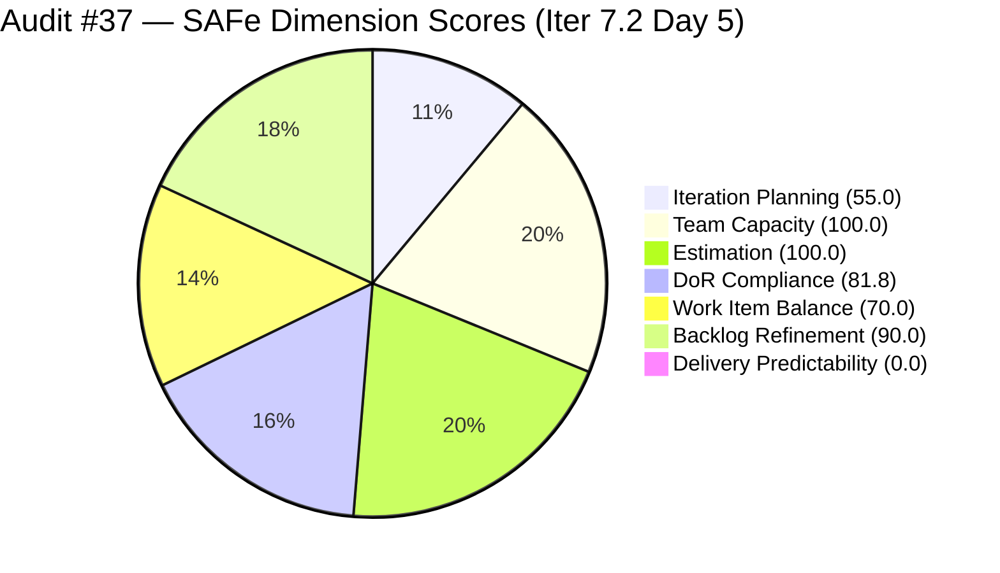
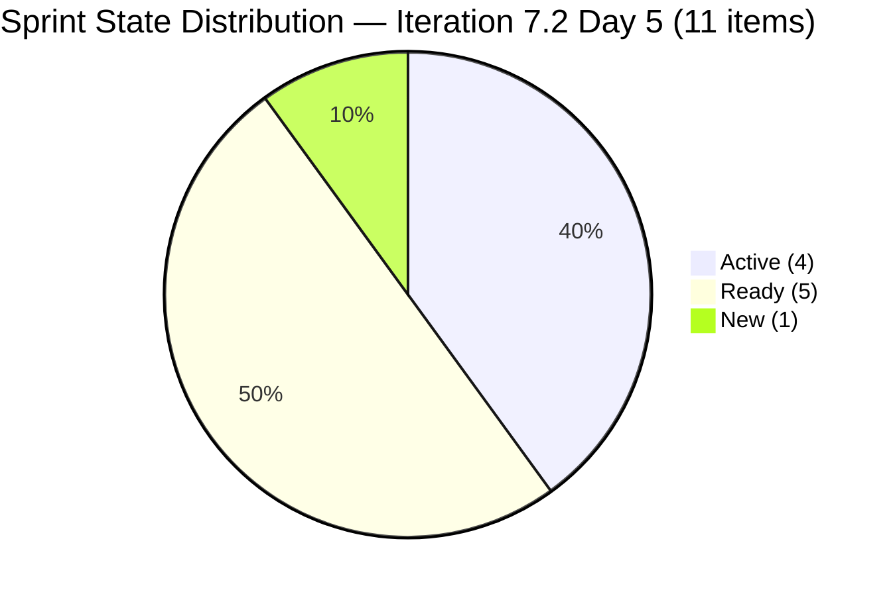
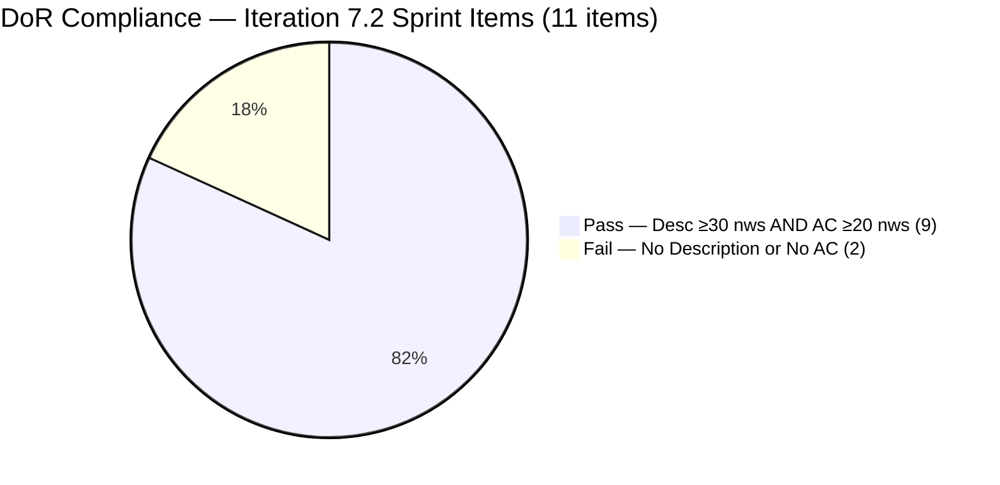
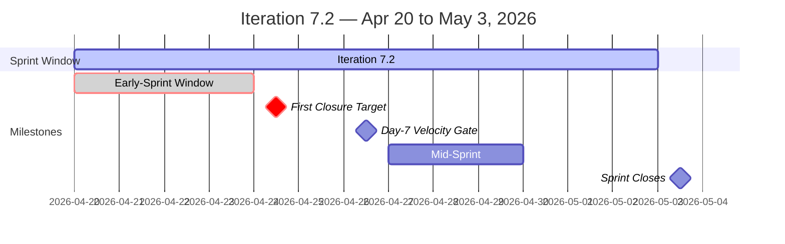
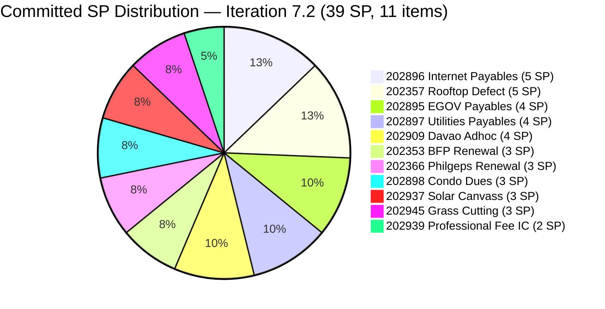

# ADO SAFe Iteration Audit — Administration Team

**Audit #37 | Iteration 7.2 (Apr 20 – May 3, 2026) | Day 5 of 14 (end of early-sprint window)**

---

## 1. Audit Metadata

| Field | Value |
|---|---|
| **Audit Date** | April 24, 2026 — 08:33 PHT |
| **Auditor** | Claude Code (ADO SAFe Audit Agent) |
| **Workspace** | `ado_admin` |
| **ADO Project** | Jairosoft FINOPS (`e0bb302f-40f9-46c3-8164-6f1acb317d63`) |
| **Team** | Administration Team (`a38a9c02-07ab-483d-a1e3-aff54e19e603`) |
| **Iteration** | Iteration 7.2 — Apr 20 to May 3, 2026 |
| **Iteration ID** | `a9888bc5-48df-40dd-bcc8-6926a11aa7c7` |
| **Sprint Day** | Day 5 of 14 (final day of early-sprint annotation window) |
| **Prior Audit** | AUDIT_20260423_0900.md (Audit #36, 71.0 — Moderate Risk, PI7.2 Day 4) |
| **Scoring Model** | ADO SAFe v1 (7-dimension rubric) |
| **Overall Score** | **71.0 / 100** |
| **Risk Band** | **Moderate Risk** (60–79.9) |

> **Live ADO data confirmed.** All 20 visible root backlog items pulled from `Microsoft.RequirementCategory` backlog. Capacity and work item details confirmed via ADO iteration and batch APIs.

---

## 2. Executive Summary

The Administration Team holds **71.0 / 100 — Moderate Risk** on Day 5 of Iteration 7.2. The score is unchanged from Audit #36 (AUDIT_20260423_0900.md), confirming no ADO activity in the 23-hour window since yesterday's 09:00 audit. All 11 sprint items retain their prior states.

**Today is a critical inflection point.** Day 5 is the last day of the early-sprint annotation window for Delivery Predictability. From Day 6 onward, 0/39 SP closed will score **0.0 without the early-sprint annotation** — a fully penalized score that will suppress the Overall to the same 71.0 only because the early-sprint note has been consistently applied. More importantly, the PI7.1 burst-delivery anti-pattern (all closures crammed into the final days) is at risk of repeating if no items close today.

Four critical issues remain unresolved and are now at their escalation threshold:

1. **DoR failures on #202898 (Condo dues, 3 SP, Ready) and #202909 (Davao Adhoc, 4 SP, Active).** Day 4 remediation deadline missed; Day 5 is final opportunity before both items proceed to closure with no done-criterion. #202909 is being actively worked without Acceptance Criteria — the highest process integrity risk in the sprint.

2. **Over-commitment at 44% above empirical ceiling.** 39 SP committed vs. 27-SP empirical ceiling. No de-scope action across any Day 1–5 audit.

3. **Nine PI7-root legacy items remain un-iterated (5th consecutive audit flag).** Items #192221–#197115 and #202894 have not been triaged into any iteration.

4. **Zero delivery through Day 5.** First closures must begin today to avoid the PI7.1 burst pattern. #202939 (Professional Fee IC, 2 SP, Ready, full DoR) is the lowest-friction first closure candidate.

---

## 3. Previous Audit Delta

| Dimension | Audit #36 (Apr 23, 09:00) | Audit #37 (Apr 24, 08:33) | Delta |
|---|---|---|---|
| Iteration Planning | 55.0 | 55.0 | 0.0 |
| Team Capacity | 100.0 | 100.0 | 0.0 |
| Estimation | 100.0 | 100.0 | 0.0 |
| DoR Compliance | 81.8 | 81.8 | 0.0 |
| Work Item Balance | 70.0 | 70.0 | 0.0 |
| Backlog Refinement | 90.0 | 90.0 | 0.0 |
| Delivery Predictability | 0.0 | 0.0 | 0.0 |
| **Overall** | **71.0** | **71.0** | **0.0** |

**No ADO changes detected since Audit #36.** All 11 sprint items retain their Apr 17–22 ChangedDates. Four consecutive audits (Apr 21 through Apr 24) have produced zero score movement. The audit confirms sprint initialization stasis — no closures, no DoR remediation, no triage of legacy items.

### Score Trajectory — Iteration 7.2 Series

| Audit # | Date | Score | Band | Sprint Day |
|---|---|---|---|---|
| #33 | Apr 21 (Day 2) | 69.5 | Moderate | 7.2 D2 |
| #34 | Apr 22, 09:00 | 69.5 | Moderate | 7.2 D3 |
| #35 | Apr 23, 01:13 UTC | 71.0 | Moderate | 7.2 D4 |
| #36 | Apr 23, 09:00 | 71.0 | Moderate | 7.2 D4 |
| **#37** | **Apr 24, 08:33** | **71.0** | **Moderate** | **7.2 D5** |



> Delivery Predictability rendered as 1 for chart visibility; actual score is 0.0 (early-sprint Day 5, final annotation day).

---

## 4. Current Iteration Snapshot

| Metric | Value |
|---|---|
| **Visible root backlog items** | 20 |
| **Current iteration root items (Iter 7.2)** | 11 |
| **Committed story points** | 39 SP |
| **Closed story points (Day 5)** | 0 SP |
| **Delivery rate (Day 5)** | 0.0% (early-sprint Day 5 — FINAL annotation day) |
| **State distribution** | 1 New, 4 Active, 5 Ready, 1 Closed = 0 |
| **Sole contributor** | Mark Colina (mcolina@jairosoft.com) |
| **Configured capacity** | 5 h/day (Deployment 1h + Documentation 2h + Requirements 2h), 0 days off |
| **PI7-root legacy open items** | 9 (un-iterated, 5th consecutive audit flag) |
| **Sprint Day** | 5 of 14 |

### Sprint Item List — Iteration 7.2 (Live, Apr 24, 08:33)

| ID | Title | Type | State | SP | DoR | Changed |
|---|---|---|---|---|---|---|
| 202353 | JIT BFP certficate renewal 2026 | User Story | Active | 3 | PASS | Apr 22 |
| 202357 | Fixation in rooptop (Davao) | Defect | Active | 5 | PASS | Apr 17 ⚠ |
| 202366 | Philgeps renewal for 2026 | User Story | Active | 3 | PASS | Apr 17 ⚠ |
| 202895 | Government (EGOV) payables | User Story | Ready | 4 | PASS | Apr 21 |
| 202896 | Payables - Internet for Davao and Cebu office | User Story | Active | 5 | PASS | Apr 22 |
| 202897 | Utilities payables for Cebu and Davao | User Story | Ready | 4 | PASS | Apr 21 |
| **202898** | **Condo dues (Cebu) payables** | User Story | Ready | 3 | **FAIL** | Apr 21 |
| **202909** | **Davao Admin Adhoc Support Apr 20–May 3** | User Story | Active | 4 | **FAIL** | Apr 22 |
| 202937 | 3 vendors to site visit at Davao office for Solar panel qoutation | User Story | Ready | 3 | PASS | Apr 22 |
| 202939 | Professional fee for IC | User Story | Ready | 2 | PASS | Apr 21 |
| 202945 | Grass cutting outside at the building | User Story | New | 3 | PASS | Apr 20 |

> ⚠ Items last changed before iteration start (Apr 20) — untouched-current penalty applies.

**Committed: 39 SP across 10 User Stories + 1 Defect. 44% over the 27-SP empirical delivery ceiling.**

### PI7-Root Legacy Items — Unassigned (5th consecutive flag)

| ID | Title | Type | SP | Changed |
|---|---|---|---|---|
| 192221 | Purchase additional Corrugated Sheet and installation Day 1 | User Story | 2 | Apr 22 |
| 193412 | Implementation of aircon repair 2nd floor | User Story | 2 | Apr 17 |
| 197023 | Installation of corrugated sheet at Fire Exit | User Story | 3 | Apr 17 |
| 197028 | Purchase materials at Houseman Hardware | User Story | 1 | Apr 17 |
| 197029 | Implementation of Parking with roof for 2 vehicles (Day 1) | User Story | 3 | Apr 17 |
| 197111 | Recanvass for Jockey pump materials needed | User Story | 1 | Apr 17 |
| 197113 | Purchase materials for Jockey pump | User Story | 1 | Apr 17 |
| 197115 | Implementation of installing jockey pump | User Story | 4 | Apr 17 |
| 202894 | Goverment payables for *(incomplete placeholder)* | User Story | — | Apr 19 |

---

## 5. Work Item Analysis

### Sprint State Distribution (Day 5)



### DoR Status — Sprint Items



### Iteration Timeline (Gantt View)



### Committed SP Distribution (39 SP total)



### Observations

- **Zero ADO activity in 23+ hours (Audit #36 → #37).** No items closed, no DoR remediation, no state transitions. The sprint has been static since Apr 22 at the latest. This is the most significant finding of this audit cycle.
- **Day 5 is the last early-sprint annotation day.** From Day 6, Delivery Predictability scores 0.0 without the early-sprint note and will suppress the overall unless closures begin.
- **Two items remain untouched since pre-iteration:** #202357 (Apr 17) and #202366 (Apr 17). Both are Active. Any ADO update today resets ChangedDate and clears the untouched penalty, lifting Backlog Refinement to 100.0.
- **#202909 has a comment** (commentVersionRef detected in API response) but null Description and null AcceptanceCriteria — the comment does not substitute for structured DoR fields.
- **Empirical ceiling breach unaddressed.** 39 SP is 44% above the 27-SP ceiling validated by PI7.1 actuals. With 5 days elapsed and 0 SP closed, the projected delivery rate assuming PI7.1 burst pattern (Weeks 1-2 split) is concerning.

---

## 6. SAFe Compliance Scorecard

| Dimension | Score | Evidence | Notes |
|---|---|---|---|
| Iteration Planning | 55.0 | 11/20 visible root items scoped to Iter 7.2 | 9 PI7-root items un-iterated — 5th consecutive audit flag |
| Team Capacity | 100.0 | Mark Colina: 5h/day configured (Admin team); all 11 sprint items assigned to Mark | Bus-factor 1 — structural, not rubric penalty |
| Estimation | 100.0 | 11/11 sprint items have SP > 0; total 39 SP | 44% over 27-SP empirical ceiling |
| DoR Compliance | 81.8 | 9/11 items pass Desc ≥30 nws + AC ≥20 nws | #202898 and #202909 confirmed null Desc + null AC (5th consecutive flag); #202909 Active without AC |
| Work Item Balance | 70.0 | 10 US + 1 Defect; dominant share 10/11 = 90.9% > 60% → −30; no −40 (US present); no −20 (no Spike) | Structural penalty; composition unchanged since Day 2 |
| Backlog Refinement | 90.0 | 20/20 items fresh (≤45 days); stale_90=0; stale_180=0; untouched_current=2/11=18.2% → −10 | Two pre-iter items (202357 Apr 17, 202366 Apr 17) drive untouched penalty |
| Delivery Predictability | 0.0 | 0/39 SP closed at Day 5 | **Early-sprint — Day 5 of 14 (FINAL annotation day); low delivery expected** |
| **Overall** | **71.0** | Average of 7 dimensions | **Moderate Risk** |

### Score Computation

```
Iteration Planning    = round(11 / 20 × 100, 1)    = 55.0
Team Capacity         = round(1 / 1 × 100, 1)       = 100.0
Estimation            = round(11 / 11 × 100, 1)     = 100.0
DoR Compliance        = round(9 / 11 × 100, 1)      = 81.8

Work Item Balance:
  has_user_story      = True (10 User Stories)        → no −40
  dominant_share      = 10/11 = 90.9% > 60%           → −30
  spike_share         = 0/11 = 0%                     → no −20
  total               = max(0, 100 − 30)              = 70.0

Backlog Refinement:
  fresh (≤45 days)    = 20/20 = 100%                  → base = 100.0
  stale_90 / visible  = 0/20 = 0% (≤10%)              → 0
  stale_180           = 0 items                       → 0
  untouched_current   = 2/11 = 18.2% (>10%, ≤30%)    → −10
  total               = max(0, 100.0 − 10)            = 90.0

Delivery Predictability:
  closed_sp / committed_sp = 0 / 39                   = 0.0
  (annotation: Day 5 of 14 — early-sprint, FINAL annotation day)

Overall = round((55.0 + 100.0 + 100.0 + 81.8 + 70.0 + 90.0 + 0.0) / 7, 1)
        = round(496.8 / 7, 1)
        = 71.0  →  Moderate Risk
```

---

## 7. Dimension Findings

### 7.1 Iteration Planning — 55.0 (Moderate)

11 of 20 visible root items are in Iteration 7.2. The 9 PI7-root legacy items remain unassigned for **five consecutive audits** (#33–#37). This is now a confirmed persistent process failure. #202894 ("Goverment payables for") has no SP, no Description, no AC, and an incomplete title — a placeholder inflating the backlog denominator.

**Score uplift path:** Triaging the 8 substantive legacy items into specific iterations raises the score. If 5 are assigned to 7.2: 16/20 = 80.0 (Low Risk boundary). If all 9 are assigned or closed: removes PI7-root anomaly entirely.

### 7.2 Team Capacity — 100.0 (Low Risk)

Mark Colina remains the sole contributor with 5h/day configured capacity. 1/1 contributors with capacity = 100.0. The bus-factor-1 risk is structural: 39 SP on a single contributor for a 14-day sprint leaves zero resilience against any unplanned absence. This is not a rubric penalty but a strategic risk the team cannot self-resolve without additional headcount.

### 7.3 Estimation — 100.0 (Low Risk)

All 11 sprint items carry SP > 0 (range 2–5 SP, total 39 SP). Estimation discipline is strong. The risk is commitment volume: at PI7.1's 61.3% delivery rate, 39 SP yields ~24 SP delivered — below the 27-SP historical ceiling.

### 7.4 DoR Compliance — 81.8 (Moderate) — 5th Flag, Deadlines Missed

Both items have now been flagged across five consecutive audits (Audits #33–#37) without remediation. The Day 3 (Apr 22) remediation deadline passed unaddressed.

**#202898 — Condo dues (Cebu) payables, 3 SP, Ready:** Confirmed null Description, null Acceptance Criteria. Item is queued for execution with no done-criterion.

**#202909 — Davao Admin Adhoc Support Apr 20–May 3, 4 SP, Active:** Confirmed null Description, null Acceptance Criteria. This item is being actively worked. A comment was added (commentVersionRef detected) but this does not populate the DoR fields. Without AC, there is no objective test for "Done" — the highest process integrity risk in the sprint.

Both items require under 10 minutes of ADO editing to reach DoR compliance.

### 7.5 Work Item Balance — 70.0 (Moderate — structural)

10 User Stories + 1 Defect. User Story share = 90.9% > 60% → -30 penalty. No Spike items. Score = 70.0. This penalty is structural and unchanged since Day 2. Adding enabling work (technical spikes, process investigations) in future sprints would diversify the type distribution and reduce the dominant-share penalty.

### 7.6 Backlog Refinement — 90.0 (Low Risk)

All 20 visible items are fresh (≤45 days). Two sprint items (#202357, #202366) remain untouched since Apr 17 (pre-iteration) — the -10 penalty source. Both are Active. Any ADO update today (state note, comment, description update) resets ChangedDate and will clear this penalty in the next audit, lifting Backlog Refinement to 100.0.

**Stale_90 forward watch:** Items #193412, #197023, #197028, #197029, #197111, #197113, #197115 last changed Apr 17, 2026. The stale_90 window opens ~July 16, 2026. Triaging these at P2 (see recommendations) prevents a batch staleness event in PI8.

### 7.7 Delivery Predictability — 0.0 (Early-Sprint — FINAL Annotation Day)

Day 5 of 14. 0/39 SP closed. **This is the last day the early-sprint annotation applies.** From Day 6, the score will be 0.0 with no annotation qualification — it becomes a substantive performance indicator, not a structural early-sprint artifact. First closures must begin today.

Priority order for first closure: #202939 (Professional Fee IC, 2 SP, Ready, full DoR) → #202897 (Utilities payables, 4 SP, Ready, full DoR) → #202895 (EGOV payables, 4 SP, Ready, full DoR). Closing #202939 alone raises DP to 5.1% and overall to ~71.7.

---

## 8. Risks and Bottlenecks

| # | Risk | Severity | Trend | First Flagged |
|---|---|---|---|---|
| R1 | Single contributor (Mark Colina) — bus factor 1 on all 39 SP | High | Persistent | Audit #1 |
| R2 | 44% over-commitment — 39 SP vs. 27-SP empirical ceiling; no de-scope through Day 5 | High | Escalating | Audit #33 |
| R3 | #202909 Active without AC — being worked with no done-criterion (5th flag) | High | **Critical — deadlines missed** | Audit #33 |
| R4 | #202898 Ready without AC — will be executed without done-criterion (5th flag) | High | **Critical — deadlines missed** | Audit #33 |
| R5 | Zero closures through Day 5 — early-sprint annotation expires today; burst-delivery risk | High | **Escalated — Day 5** | Audit #35 |
| R6 | 9 PI7-root legacy items un-iterated — 5th consecutive flag, no triage action | Medium | Escalating | Audit #32 |
| R7 | #202894 placeholder item — incomplete title, no SP, no DoR | Medium | Persistent | Audit #32 |
| R8 | #202357 and #202366 untouched since Apr 17 — Backlog Refinement −10 penalty | Medium | Persistent (Day 5) | Audit #35 |
| R9 | Stale_90 batch risk — 8 legacy items last changed Apr 17; window opens ~Jul 16 | Low | Carried | Audit #34 |
| R10 | Title typos: "certficate" (#202353), "rooptop" (#202357), "qoutation" (#202937) | Low | Persistent (5 flags) | Audit #32 |

---

## 9. Prioritized Recommendations

### P0 — Resolve Today (April 24) — Final Opportunity

1. **Close at least one sprint item — CRITICAL URGENCY.**
   - Early-sprint annotation expires after today. Day 6 Delivery Predictability = 0.0 (no annotation).
   - Immediate action: Close #202939 (Professional Fee IC, 2 SP, Ready, full DoR) — lowest-friction closure.
   - Next: #202897 (Utilities payables, 4 SP, Ready) or #202895 (EGOV payables, 4 SP, Ready).
   - Closing #202939 → DP = 5.1%, Overall = ~71.7. Closing additionally #202897 → DP = 15.4%, Overall = ~73.4.

2. **Complete DoR on #202909 (Davao Adhoc, Active, 4 SP) — 5th flag.**
   - Minimum Description (≥30 nws): "Administrative support coverage for Davao office operations within the Apr 20–May 3, 2026 payroll cutoff window, including procurement coordination, facilities support, and vendor management tasks."
   - Minimum AC (≥20 nws): "All admin support tasks within the Apr 20–May 3 cutoff window logged and completed; summary report with receipts or documentation delivered to Ramon by May 3, 2026."
   - If DoR cannot be completed today, **de-scope #202909 to Iter 7.3** (−4 SP, commitment drops to 35 SP).

3. **Complete DoR on #202898 (Condo dues, Ready, 3 SP) — 5th flag.**
   - Minimum Description (≥30 nws): "May 2026 Cebu condominium association monthly dues payment processing and documentation for the Jairosoft-managed property."
   - Minimum AC (≥20 nws): "May 2026 condo dues paid; official receipt scanned and uploaded to ADO; payment reconciled against monthly budget ledger."
   - If DoR cannot be completed today, **de-scope #202898 to Iter 7.3** (−3 SP).

### P1 — Resolve by Day 6 (April 25)

4. **Update #202357 (Rooftop Defect) and #202366 (Philgeps renewal) in ADO.**
   - Both Active but last changed Apr 17 (pre-iteration). A state update or comment resets ChangedDate, clears the untouched-current penalty, and lifts Backlog Refinement to 100.0.
   - Combined score impact: Backlog Refinement 90.0 → 100.0; Overall 71.0 → ~72.4 (if DP remains 0.0 from a Day 5 closure that hasn't occurred).

### P2 — Resolve by Day 7 (April 26)

5. **Triage all 9 PI7-root legacy items — 5th consecutive recommendation.**
   - #202894: Close as incomplete placeholder (the intended item is #202895).
   - Jockey pump bundle (#197111, #197113, #197115, 6 SP): Assign to Iter 7.3 or 7.4.
   - Parking/corrugated (#197023, #197028, #197029, 7 SP): Assign to 7.4 or PI8.
   - Aircon repair (#193412, 2 SP): Assign to 7.3 if valid, or close as superseded.
   - Corrugated sheet (#192221, 2 SP, Sep 2025): Assign to 7.3 if valid, close if superseded.
   - **Impact:** Iteration Planning 55.0 → up to 100.0 depending on assignments.

6. **Fix title typos — 5-minute task, 5th flag.**
   - #202353: "certficate" → "certificate"
   - #202357: "rooptop" → "rooftop"
   - #202937: "qoutation" → "quotation"
   - #202894: Rename or close.

### P3 — Process (Sprint-recurring)

7. **Establish Day 6 mid-sprint velocity gate (tomorrow).**
   - At Day 6, target ≥10% SP closed (≥4 SP). If below, immediately de-scope the 2 lowest-priority Ready items.
   - Day 7 target: ≥30% SP closed (≥12 SP) to stay on track vs. empirical ceiling.

8. **Adopt sprint close-out ritual (Ramon + Mark, Day 13).**
   - At Day 13, confirm all Ready items are either Closed, de-scoped to 7.3, or explicitly carry-forward documented. Eliminates burst-delivery pattern.

---

## 10. Evidence Gaps and Limitations

| Gap | Description | Impact |
|---|---|---|
| **DoR fields on #202898 and #202909** | Both items confirmed null Description and null AcceptanceCriteria in live ADO batch pull. A comment was detected on #202909 (commentVersionRef) but comments do not substitute for structured DoR fields. No ambiguity — both definitively fail DoR. | DoR score = 81.8 deterministic. |
| **Delivery Predictability (early-sprint, final day)** | Day 5 of 14 yields 0.0 on DP. This is the last day the early-sprint annotation applies. From Day 6, any 0.0 DP is unqualified and fully penalizing. | Early-sprint annotation applied for the final time today. |
| **#202894 without SP or DoR** | No StoryPoints, Description, or AC. Counted in visible_root_backlog_items (denominator = 20). Closing it would drop denominator to 19; IP = 11/19 = 57.9% — minor improvement. | Denominator includes 202894. |
| **Stale_90 watch on legacy items** | Items #193412 and #197023–197115 last changed Apr 17. All currently fresh. Stale_90 window opens ~Jul 16, 2026. No current scoring impact. | Forward risk documented. |
| **WSJF/Business Value fields** | Features and stories continue to lack Business Value and Effort population. Not scored by current rubric. | No scoring impact. |
| **Zero inter-audit ADO changes** | All 11 sprint items retain their Apr 17–22 ChangedDates. Score is identical to Audits #35 and #36 (71.0). This audit provides independent confirmation of the Day 5 state. | Scores are deterministic and unchanged. |
| **Capacity tool returns aggregate** | The `work_get_iteration_capacities` tool returned team-level aggregate (5h/day for Admin team). Individual member breakdown via `work_get_team_capacity` was not separately called — consistent with prior audit methodology. | No scoring impact. |

---

*Report generated by Claude Code ADO SAFe Audit Agent | April 24, 2026 — 08:33 PHT*
*Audit #37 — Administration Team — Iteration 7.2 Day 5 of 14 — Overall: 71.0 / 100 — Moderate Risk*
*Evidence basis: Live ADO pull — 20 backlog items, 11 iteration items, capacity confirmed — Apr 24, 2026*
*Prior audit: AUDIT_20260423_0900.md (Audit #36, 71.0 — same score, no inter-audit ADO changes)*
