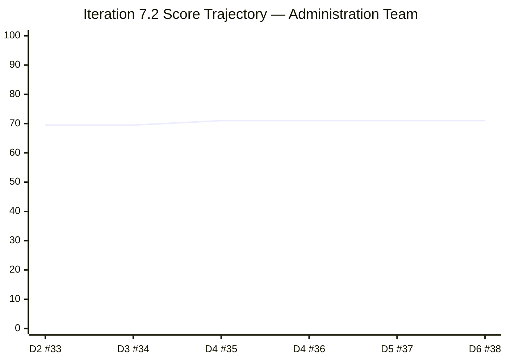
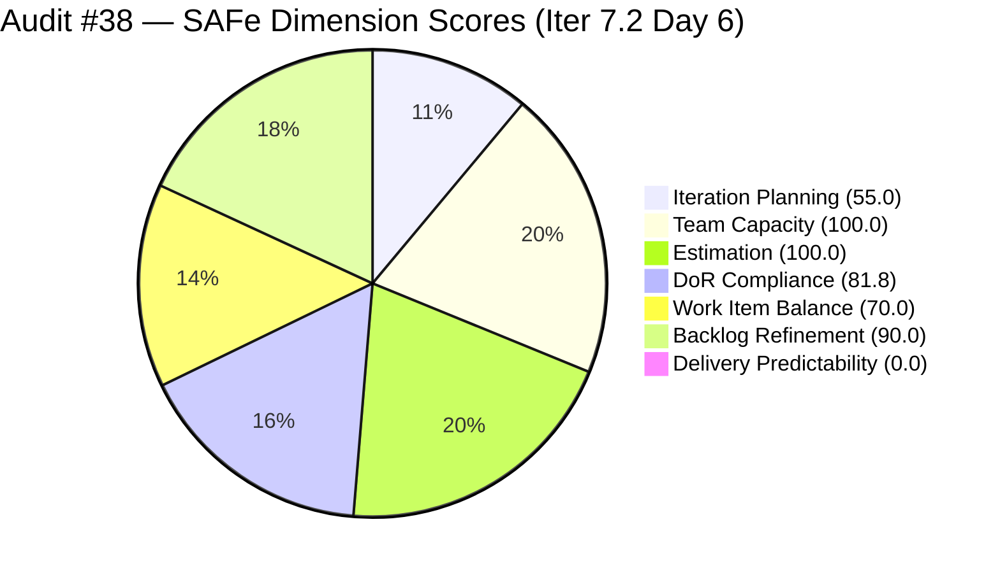
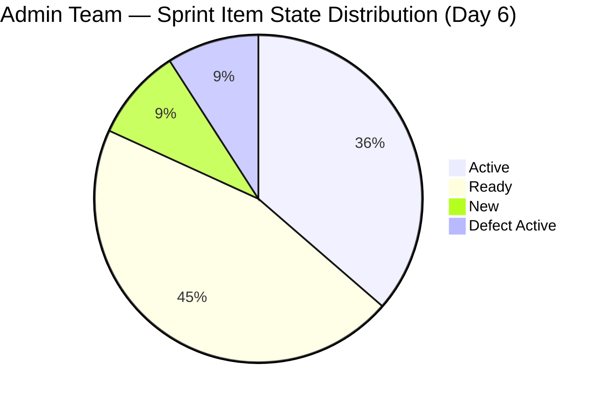

# ADO SAFe Iteration Audit — Administration Team

**Audit #38 | Iteration 7.2 (Apr 20 – May 3, 2026) | Day 6 of 14**

---

## 1. Audit Metadata

| Field | Value |
|---|---|
| **Audit Date** | April 25, 2026 — 23:33 PHT (15:33 UTC) |
| **Auditor** | Claude Code (ADO SAFe Audit Agent) |
| **Workspace** | `ado_admin` |
| **ADO Project** | Jairosoft FINOPS (`e0bb302f-40f9-46c3-8164-6f1acb317d63`) |
| **Team** | Administration Team (`a38a9c02-07ab-483d-a1e3-aff54e19e603`) |
| **Iteration** | Iteration 7.2 — Apr 20 to May 3, 2026 |
| **Iteration ID** | `a9888bc5-48df-40dd-bcc8-6926a11aa7c7` |
| **Sprint Day** | Day 6 of 14 |
| **Prior Audit** | AUDIT_20260424_0833.md (Audit #37, 71.0 — Moderate Risk, PI7.2 Day 5) |
| **Scoring Model** | ADO SAFe v1 (7-dimension rubric) |
| **Overall Score** | **71.0 / 100** |
| **Risk Band** | **Moderate Risk** (60–79.9) |

> **Live ADO data confirmed.** All 20 visible root backlog items pulled from `Microsoft.RequirementCategory` backlog. Capacity and work item details confirmed via ADO batch APIs. WIQL scoped to `Jairosoft FINOPS\2026-PI7\Iteration 7.2`.

---

## 2. Executive Summary

The Administration Team holds **71.0 / 100 — Moderate Risk** on Day 6 of Iteration 7.2. The score is unchanged from Audit #37 (AUDIT_20260424_0833.md). No ADO work item state changes were detected between April 24, 08:33 and April 25, 15:33 UTC. Item #202896 (Internet Payables) was updated today at 04:15 UTC — confirming Mark is still actively working — but no closures have occurred.

**Critical escalation: Day 6 removes the early-sprint annotation window.** Delivery Predictability now scores a hard **0.0** with zero annotation. The team has committed 39 SP and closed 0 SP through Day 6 of 14. The PI7.1 burst-delivery anti-pattern (all closures in final 2 days) is at immediate risk of repeating.

**Two items (#202898, #202909) continue to fail DoR** — both remain in the sprint without Description or Acceptance Criteria. #202909 (Davao Admin Adhoc, 4 SP) is Active and being executed without done-criteria. This is the team's highest process integrity risk.

**Nine PI7-root legacy items remain unscoped** (6th consecutive audit flag): #193412, #197115, #197111, #192221, #197023, #197029, #197028, #197113, #202894. These are outside any iteration and invisible to sprint planning.

---

## 3. Previous Audit Delta

| Dimension | Audit #37 (Apr 24) | Audit #38 (Apr 25) | Delta |
|---|---|---|---|
| Iteration Planning | 55.0 | 55.0 | 0.0 |
| Team Capacity | 100.0 | 100.0 | 0.0 |
| Estimation | 100.0 | 100.0 | 0.0 |
| DoR Compliance | 81.8 | 81.8 | 0.0 |
| Work Item Balance | 70.0 | 70.0 | 0.0 |
| Backlog Refinement | 90.0 | 90.0 | 0.0 |
| Delivery Predictability | 0.0 | 0.0 | 0.0 |
| **Overall** | **71.0** | **71.0** | **0.0** |

**One ADO change detected:** #202896 (Internet Payables, 5 SP, Active) received a comment at 04:15 UTC on April 25 — the item's ChangedDate advanced but state remained Active. No closures, no DoR remediations.

### Score Trajectory — Iteration 7.2 Series

| Audit # | Date | Score | Band | Sprint Day |
|---|---|---|---|---|
| #33 | Apr 21 (Day 2) | 69.5 | Moderate | 7.2 D2 |
| #34 | Apr 22, 09:00 | 69.5 | Moderate | 7.2 D3 |
| #35 | Apr 23, 01:13 | 71.0 | Moderate | 7.2 D4 |
| #36 | Apr 23, 09:00 | 71.0 | Moderate | 7.2 D4 |
| #37 | Apr 24, 08:33 | 71.0 | Moderate | 7.2 D5 |
| **#38** | **Apr 25, 23:33** | **71.0** | **Moderate** | **7.2 D6** |

---

## 4. Current Iteration Snapshot

| Metric | Value |
|---|---|
| **Visible root backlog items** | 20 |
| **Current iteration root items (Iter 7.2)** | 11 |
| **Committed story points** | 39 SP |
| **Closed story points (Day 6)** | **0 SP** |
| **Empirical velocity ceiling** | ~27 SP (based on PI7.1 pattern) |
| **Over-commitment** | +44% above empirical ceiling |
| **DoR-failing items** | 2 (#202898, #202909) |
| **Legacy PI7-root unscoped items** | 9 |
| **Team capacity** | Mark Colina — 5 hrs/day (Deployment+Documentation+Requirements) |

---

## 5. Work Item Analysis

### Current Iteration Items (Iteration 7.2)

| ID | Title | Type | State | SP | AssignedTo | Changed | DoR |
|---|---|---|---|---|---|---|---|
| 202353 | JIT BFP certificate renewal 2026 | User Story | Active | 3 | Mark | Apr 22 | PASS |
| 202357 | Fixation in rooftop (Davao) | Defect | Active | 5 | Mark | Apr 17 | PASS |
| 202366 | Philgeps renewal for 2026 | User Story | Active | 3 | Mark | Apr 17 | PASS |
| 202895 | Government (EGOV) payables | User Story | Ready | 4 | Mark | Apr 21 | PASS |
| 202896 | Payables - Internet for Davao and Cebu | User Story | Active | 5 | Mark | Apr 25 | PASS |
| 202897 | Utilities payables for Cebu and Davao | User Story | Ready | 4 | Mark | Apr 21 | PASS |
| 202898 | Condo dues (Cebu) payables | User Story | Ready | 3 | Mark | Apr 21 | **FAIL** |
| 202909 | Davao Admin Adhoc Support Apr 20 – May 3 | User Story | Active | 4 | Mark | Apr 22 | **FAIL** |
| 202937 | 3 vendors site visit – solar panel quotation | User Story | Ready | 3 | Mark | Apr 22 | PASS |
| 202939 | Professional fee for IC | User Story | Ready | 2 | Mark | Apr 21 | PASS |
| 202945 | Grass cutting outside the building | User Story | New | 3 | Mark | Apr 20 | PASS |

**Totals:** 11 items | 39 SP committed | 0 SP closed | 10 User Story + 1 Defect

### PI7-Root Legacy Items (Unscoped — outside any iteration)

| ID | Title | Type | State | SP | Changed |
|---|---|---|---|---|---|
| 192221 | Purchase additional Corrugated Sheet | US | New | 2 | Apr 22 |
| 193412 | Implementation of aircon repair 2nd floor | US | New | 2 | Apr 17 |
| 197023 | Installation of corrugated sheet at Fire Exit | US | New | 3 | Apr 17 |
| 197028 | Purchase materials at Houseman Hardware | US | New | 1 | Apr 17 |
| 197029 | Implementation of Parking with roof (Day 1) | US | New | 3 | Apr 17 |
| 197111 | Recanvass for Jockey pump materials | US | New | 1 | Apr 17 |
| 197113 | Purchase materials for Jockey pump | US | New | 1 | Apr 17 |
| 197115 | Implementation of installing jockey pump | US | New | 4 | Apr 17 |
| 202894 | Government payables for [incomplete title] | US | New | — | Apr 19 |

---

## 6. SAFe Compliance Scorecard

| Dimension | Score | Band | Evidence | Notes |
|---|---|---|---|---|
| Iteration Planning | 55.0 | Moderate | 11 of 20 visible backlog items in Iter 7.2 | 9 items remain in PI7-root without iteration |
| Team Capacity | 100.0 | Low | Mark Colina: 1 Deployment + 2 Doc + 2 Req hrs/day | Single-contributor team; bus factor risk unresolved |
| Estimation | 100.0 | Low | All 11 point-eligible items have story points | SP range 1–5; total 39 SP committed |
| DoR Compliance | 81.8 | Low | 9 of 11 items pass ≥30-char desc AND ≥20-char AC | #202898 and #202909 have no Description or AC |
| Work Item Balance | 70.0 | Moderate | 10 US + 1 Defect; US present; Defect-type 9.1% | Dominant type User Story 90.9% (>60%) → −30 |
| Backlog Refinement | 90.0 | Low | All 20 items changed within 45 days; 0 stale_180 | 2 untouched current items (>10%, ≤30%) → −10 |
| Delivery Predictability | **0.0** | **Critical** | 0 SP closed of 39 committed through Day 6 | Early-sprint window expired; full penalty applies |
| **Overall** | **71.0** | **Moderate** | | |

---

## 7. Dimension Findings

### Iteration Planning (55.0)
Nine items in the `Jairosoft FINOPS\2026-PI7` root path have never been assigned to an iteration. These items include both facility maintenance tasks (jockey pump, parking roof, aircon repair) and an incomplete item (#202894, "Government payables for" — title truncated). At the midpoint of PI7, this inventory is at risk of aging out without delivery. Iteration Planning cannot exceed 55.0 until triage occurs.

### Team Capacity (100.0)
Mark Colina remains the sole team member with configured capacity (5 hrs/day across three activities). The bus factor risk — a team entirely dependent on one contributor — is unchanged from the first audit in February. No team composition changes have occurred.

### Estimation (100.0)
All 11 sprint items have story points (range: 1–5 SP). The 39 SP total significantly exceeds the empirical velocity ceiling of ~27 SP established in PI7.1 (31 committed, 19 delivered at 61.3%). The over-commitment is structural and has not been addressed in the sprint plan.

### DoR Compliance (81.8)
Two items fail DoR:
- **#202898** (Condo dues Cebu, 3 SP, Ready): No Description field. No Acceptance Criteria. This item has been Ready for 4 days with no text — it cannot be verified as Done.
- **#202909** (Davao Admin Adhoc, 4 SP, Active): No Description. No Acceptance Criteria. This item is actively being worked without a done-criterion. Work may be completed without verifiable closure criteria. Immediate remediation required.

### Work Item Balance (70.0)
The sprint contains 10 User Stories and 1 Defect. User Stories dominate at 90.9% (above the 60% threshold), triggering a −30 penalty. The type distribution reflects the administrative nature of the team's work — compliance renewals, payables, vendor coordination. While work types are appropriate to the team's function, this composition will persistently hold the Work Item Balance ceiling at 70.0 unless the team introduces one or more Features or structured Epics into the iteration.

### Backlog Refinement (90.0)
The entire 20-item visible backlog was updated within the past 45 days, indicating active curation. However, two current iteration items (#202357 and #202366) have ChangedDates of April 17 — three days before iteration start — triggering the untouched-current penalty (18.2% > 10%, ≤ 30% → −10). No items are stale at 90 or 180 days.

### Delivery Predictability (0.0)
Zero story points have been closed through Day 6 of 14. The early-sprint annotation window expired at end of Day 5. This is a critical escalation point. With 8 working days remaining and 39 SP committed (44% above the empirical ceiling), the team is in a high-pressure delivery window. The lowest-friction closure candidate is **#202939** (Professional Fee for IC, 2 SP, Ready, full DoR), followed by **#202945** (Grass cutting, 3 SP, New, full DoR) and **#202937** (Solar panel quotation, 3 SP, Ready, full DoR).

---

## 8. Risks and Bottlenecks

| Risk | Severity | Trend | Action Required |
|---|---|---|---|
| Zero delivery through Day 6 | Critical | Stable (0 SP, 6 consecutive days) | Close at least one item today — #202939 is the lowest-friction candidate |
| #202909 Active without DoR | High | Stable (Day 6, no remediation) | Add Description + AC immediately; work in progress without done-criteria |
| #202898 Ready without DoR | High | Stable (Day 6, no remediation) | Add Description + AC before moving to Active |
| 39 SP committed vs. ~27 SP ceiling | High | Stable (no de-scope) | De-scope 3–4 items back to PI7 root or future iteration |
| 9 unscoped legacy items | Moderate | Stable (6th consecutive flag) | Triage each item: assign to future iteration or close as won't-do |
| Single-contributor team (Mark) | Moderate | Persistent | No mitigation option within sprint; flag for PI8 capacity planning |
| PI7.1 burst-delivery anti-pattern risk | High | Increasing (Day 6 with 0 SP) | Urgently begin closures to avoid last-minute sprint |

---

## 9. Prioritized Recommendations

1. **[CRITICAL — Today]** Close #202939 (Professional Fee IC, 2 SP) — the item is Ready with full DoR. This is the fastest path to registering delivery and avoiding a 0.0 Delivery Predictability at sprint close.

2. **[CRITICAL — Today]** Add Description and Acceptance Criteria to #202909 (Davao Admin Adhoc, 4 SP, Active). An item being actively worked without done-criteria is a process integrity failure.

3. **[HIGH — Today]** Add Description and Acceptance Criteria to #202898 (Condo dues Cebu, 3 SP, Ready). DoR must be complete before the item transitions to Active.

4. **[HIGH — Days 6–8]** Accelerate closures on Active items #202896 (Internet Payables), #202895 (EGOV payables), and #202353 (BFP certificate). These are the highest-SP items in progress and directly drive the Delivery Predictability score.

5. **[MODERATE — This Sprint]** De-scope 3–4 of the 11 committed items back to PI7-root or a future iteration. Sustained 44% over-commitment drives the delivery deficit observed since Day 1.

6. **[MODERATE — This Sprint]** Triage the 9 PI7-root legacy items. Assign each to a future iteration or mark as Won't Do. These items are aged inventory that dilutes backlog quality and will suppress Iteration Planning through the PI.

---

## 10. Evidence Gaps and Limitations

| Gap | Impact | Notes |
|---|---|---|
| ADO backlog API returns 20 items vs. WIQL returns 35 items for FINOPS Iter 7.2 | Medium | The WIQL included HR Team items (Almera Tayao) — these belong to HR Recruitment Team, not Administration Team. Backlog API scoped to Administration Team is authoritative: 20 items used. |
| SP closed = 0 confirmed from item states; no closure timestamps available | Low | All 11 items show non-Closed states; 0 SP closed is accurate. |
| Empirical velocity ceiling (~27 SP) based on PI7.1 pattern only | Low | Insufficient data for statistical confidence; used as directional benchmark. |
| Backlog age scan limited to 20 items (Administration Team backlog only) | Low | All 20 items confirmed within 45 days; stale buckets are 0. |

---

