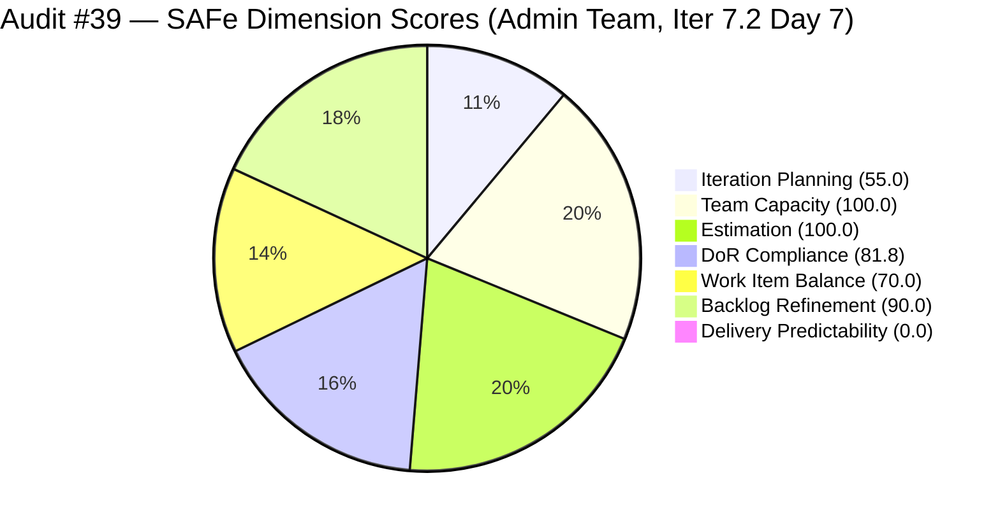
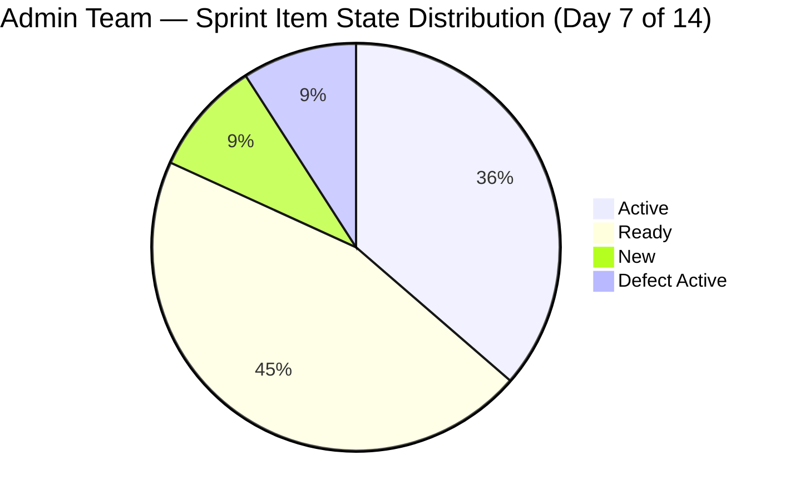
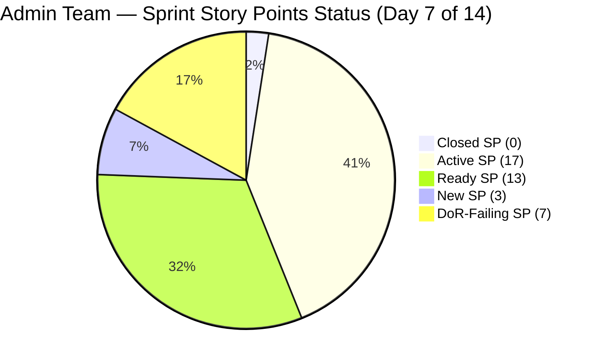

# ADO SAFe Iteration Audit — Administration Team

**Audit #39 | Iteration 7.2 (Apr 20 – May 3, 2026) | Day 7 of 14**

---

## 1. Audit Metadata

| Field | Value |
|---|---|
| **Audit Date** | April 26, 2026 — 05:00 PHT (21:00 UTC) |
| **Auditor** | Claude Code (ADO SAFe Audit Agent) |
| **Workspace** | `ado_admin` |
| **ADO Project** | Jairosoft FINOPS (`e0bb302f-40f9-46c3-8164-6f1acb317d63`) |
| **Team** | Administration Team (`a38a9c02-07ab-483d-a1e3-aff54e19e603`) |
| **Iteration** | Iteration 7.2 — Apr 20 to May 3, 2026 |
| **Iteration ID** | `a9888bc5-48df-40dd-bcc8-6926a11aa7c7` |
| **Sprint Day** | Day 7 of 14 |
| **Prior Audit** | AUDIT_20260425_1533.md (Audit #38, 71.0 — Moderate Risk, PI7.2 Day 6) |
| **Scoring Model** | ADO SAFe v1 (7-dimension rubric) |
| **Overall Score** | **71.0 / 100** |
| **Risk Band** | **Moderate Risk** (60–79.9) |

> **Live ADO data confirmed.** All 20 visible root backlog items pulled from `Microsoft.RequirementCategory` backlog for Administration Team. Capacity and work item details confirmed via ADO batch APIs at 21:00 UTC April 26, 2026.

---

## 2. Executive Summary

The Administration Team holds **71.0 / 100 — Moderate Risk** on Day 7 of Iteration 7.2. The score is unchanged from Audit #38 for the seventh consecutive daily audit (Audit #33 through #39 all at 71.0 or 69.5). No ADO work item state changes have been detected since the last confirmed activity on April 25 (#202896 update at 04:15 UTC). Zero story points remain closed through Day 7 of 14.

**Critical escalation — Day 7 is the midpoint:** With exactly 7 working days remaining and 39 SP committed against an empirical velocity ceiling of ~27 SP, the team requires an immediate surge in delivery activity. The probability of closing all 39 SP in the remaining half-sprint is near zero. The realistic target is closing 15–20 SP by sprint close, which would move Delivery Predictability from 0.0 to 38–51 and overall from 71.0 to approximately 76–78.

**Two DoR failures persist unchanged:** #202898 (Condo dues Cebu, 3 SP, Ready) and #202909 (Davao Admin Adhoc, 4 SP, Active) remain without Description or Acceptance Criteria for 7 consecutive days. Item #202909 continues to be actively worked without any done-criterion — this is the team's highest process integrity risk.

**Nine PI7-root legacy items remain unscoped** (7th consecutive audit flag). Triage of this inventory is overdue.

---

## 3. Previous Audit Delta

| Dimension | Audit #38 (Apr 25) | Audit #39 (Apr 26) | Delta |
|---|---|---|---|
| Iteration Planning | 55.0 | 55.0 | 0.0 |
| Team Capacity | 100.0 | 100.0 | 0.0 |
| Estimation | 100.0 | 100.0 | 0.0 |
| DoR Compliance | 81.8 | 81.8 | 0.0 |
| Work Item Balance | 70.0 | 70.0 | 0.0 |
| Backlog Refinement | 90.0 | 90.0 | 0.0 |
| Delivery Predictability | 0.0 | 0.0 | 0.0 |
| **Overall** | **71.0** | **71.0** | **0.0** |

**Zero ADO changes detected** between April 25, 15:33 UTC and April 26, 21:00 UTC. All 11 sprint items maintain the same state as Audit #38. Mark's last confirmed ADO activity was April 25, 04:15 UTC (#202896 comment). No closures, no DoR remediations, no new items.

### Score Trajectory — Iteration 7.2 Series

| Audit # | Date | Score | Band | Sprint Day |
|---|---|---|---|---|
| #33 | Apr 21 (Day 2) | 69.5 | Moderate | 7.2 D2 |
| #34 | Apr 22, 09:00 | 69.5 | Moderate | 7.2 D3 |
| #35 | Apr 23, 01:13 | 71.0 | Moderate | 7.2 D4 |
| #36 | Apr 23, 09:00 | 71.0 | Moderate | 7.2 D4 |
| #37 | Apr 24, 08:33 | 71.0 | Moderate | 7.2 D5 |
| #38 | Apr 25, 15:33 | 71.0 | Moderate | 7.2 D6 |
| **#39** | **Apr 26, 21:00** | **71.0** | **Moderate** | **7.2 D7** |

**Seven consecutive audits at 71.0 (Days 4–7)** with zero delivery registered. The score stasis reflects complete absence of closures and no DoR or backlog changes. This is the longest zero-delivery plateau in the current PI.

---

## 4. Current Iteration Snapshot

| Metric | Value |
|---|---|
| **Visible root backlog items** | 20 |
| **Current iteration root items (Iter 7.2)** | 11 |
| **Committed story points** | 39 SP |
| **Closed story points (Day 7)** | **0 SP** |
| **Empirical velocity ceiling** | ~27 SP (PI7.1 pattern) |
| **Over-commitment** | +44% above empirical ceiling |
| **DoR-failing items** | 2 (#202898, #202909) |
| **Legacy PI7-root unscoped items** | 9 |
| **Team capacity** | Mark Colina — 5 hrs/day (Deployment + Documentation + Requirements) |
| **Last ADO activity** | Apr 25, 04:15 UTC (#202896 comment by Mark) |
| **Days remaining** | 7 |

---

## 5. Work Item Analysis

### Current Iteration Items (Iteration 7.2)

| ID | Title | Type | State | SP | AssignedTo | Changed | DoR |
|---|---|---|---|---|---|---|---|
| 202353 | JIT BFP certificate renewal 2026 | User Story | Active | 3 | Mark | Apr 22 | PASS |
| 202357 | Fixation in rooftop (Davao) | Defect | Active | 5 | Mark | Apr 17 | PASS |
| 202366 | Philgeps renewal for 2026 | User Story | Active | 3 | Mark | Apr 17 | PASS |
| 202895 | Government (EGOV) payables | User Story | Ready | 4 | Mark | Apr 21 | PASS |
| 202896 | Payables - Internet for Davao and Cebu | User Story | Active | 5 | Mark | Apr 25 | PASS |
| 202897 | Utilities payables for Cebu and Davao | User Story | Ready | 4 | Mark | Apr 21 | PASS |
| 202898 | Condo dues (Cebu) payables | User Story | Ready | 3 | Mark | Apr 21 | **FAIL** |
| 202909 | Davao Admin Adhoc Support Apr 20 – May 3 | User Story | Active | 4 | Mark | Apr 22 | **FAIL** |
| 202937 | 3 vendors site visit – solar panel quotation | User Story | Ready | 3 | Mark | Apr 22 | PASS |
| 202939 | Professional fee for IC | User Story | Ready | 2 | Mark | Apr 21 | PASS |
| 202945 | Grass cutting outside the building | User Story | New | 3 | Mark | Apr 20 | PASS |

**Totals:** 11 items | 39 SP committed | 0 SP closed | 10 User Story + 1 Defect

**DoR Detail:**
- #202898: No `System.Description` field, no `Microsoft.VSTS.Common.AcceptanceCriteria` field — FAIL (7th consecutive day)
- #202909: No `System.Description` field, no `Microsoft.VSTS.Common.AcceptanceCriteria` field — FAIL (7th consecutive day); item is Active (in progress without done-criteria)

### PI7-Root Legacy Items (Unscoped)

| ID | Title | Type | State | SP | Last Changed |
|---|---|---|---|---|---|
| 192221 | Purchase additional Corrugated Sheet | User Story | New | 2 | Apr 22 |
| 193412 | Implementation of aircon repair 2nd floor | User Story | New | 2 | Apr 17 |
| 197023 | Installation of corrugated sheet at Fire Exit | User Story | New | 3 | Apr 17 |
| 197028 | Purchase materials at Houseman Hardware | User Story | New | 1 | Apr 17 |
| 197029 | Implementation of Parking with roof (Day 1) | User Story | New | 3 | Apr 17 |
| 197111 | Recanvass for Jockey pump materials | User Story | New | 1 | Apr 17 |
| 197113 | Purchase materials for Jockey pump | User Story | New | 1 | Apr 17 |
| 197115 | Implementation of installing jockey pump | User Story | New | 4 | Apr 17 |
| 202894 | Goverment payables for [incomplete title] | User Story | New | — | Apr 19 |

---

## 6. SAFe Compliance Scorecard

| Dimension | Score | Band | Evidence | Notes |
|---|---|---|---|---|
| Iteration Planning | 55.0 | Moderate | 11 of 20 visible backlog items in Iter 7.2 | 9 items in PI7-root without iteration (7th flag) |
| Team Capacity | 100.0 | Low | Mark Colina: 5 hrs/day configured (Deployment + Doc + Req) | Single-contributor; bus factor risk unresolved |
| Estimation | 100.0 | Low | All 11 point-eligible items have story points | SP range: 2–5; total 39 SP committed |
| DoR Compliance | 81.8 | Low | 9 of 11 items pass ≥30-char desc AND ≥20-char AC | #202898 and #202909 have no Description or AC (Day 7) |
| Work Item Balance | 70.0 | Moderate | 10 US + 1 Defect; US present ✓; Defect 9.1%; US dominant 90.9% > 60% → −30 | Structural; team's work type composition drives this ceiling |
| Backlog Refinement | 90.0 | Low | All 20 items changed within 45 days; 0 stale_90; 0 stale_180 | 2 untouched current items (#202357 Apr 17, #202366 Apr 17 — before sprint start) → −10 |
| Delivery Predictability | **0.0** | **Critical** | 0 SP closed of 39 committed through Day 7 | No early-sprint annotation; 7 days remaining |
| **Overall** | **71.0** | **Moderate** | | |

---

## 7. Dimension Findings

### Iteration Planning (55.0)
Nine items in the `Jairosoft FINOPS\2026-PI7` root path remain unassigned to any iteration through Day 7. The item #202894 ("Goverment payables for") has an incomplete title and no story points — it was created April 19 and has remained in this state for 7 days. The remaining 8 facility-related items (jockey pump series, parking roof, aircon repair, corrugated sheets) represent physical infrastructure work that should either be scoped into a future iteration or evaluated for cancellation. At Day 7, these items are burning through PI7 time without planned delivery slots.

### Team Capacity (100.0)
Mark Colina remains the sole Administration Team member with configured capacity (5 hrs/day across three activities). Capacity configuration is accurate and unchanged. The bus factor risk — no backup for any team function — persists at PI-level severity.

### Estimation (100.0)
All 11 sprint items have story points (range: 2–5 SP). The 39 SP total remains 44% above the empirical velocity ceiling of ~27 SP. De-scoping has not occurred despite 7 days of zero delivery. The over-commitment creates structural pressure that will likely result in the same burst-delivery pattern observed in PI7.1.

### DoR Compliance (81.8)
Both DoR failures from Day 1 persist unchanged through Day 7:
- **#202898** (Condo dues Cebu, 3 SP, Ready): No Description. No Acceptance Criteria. Item has been Ready for 5 days with no text content.
- **#202909** (Davao Admin Adhoc, 4 SP, Active): No Description. No Acceptance Criteria. This item is being actively executed. Work may be considered complete by Mark without any verifiable done-criterion — creating a potential unrecorded closure or quality gap.

### Work Item Balance (70.0)
The sprint composition (10 US, 1 Defect) is structurally locked. The User Story type dominance at 90.9% triggers the −30 penalty. This dimension cannot exceed 70.0 without introducing at least one additional work item type below the 60% threshold. For an administrative team managing payables, renewals, and facility maintenance, this structural ceiling is a persistent feature of the team's work model rather than a process failure.

### Backlog Refinement (90.0)
All 20 visible backlog items were updated within the past 45 days, confirming an actively curated backlog. Two current iteration items — #202357 (Fixation in Rooftop, Apr 17) and #202366 (PhilGeps renewal, Apr 17) — were last changed 3 days before the April 20 iteration start, triggering the untouched-current penalty (2/11 = 18.2% > 10%, ≤ 30% → −10). No items are stale at 90 or 180 days. The base score of 100 minus the −10 untouched penalty yields 90.0.

### Delivery Predictability (0.0)
Zero story points have been closed through Day 7 of 14. With 7 working days remaining and 39 SP committed, the team is at the midpoint with no delivery registered. The realistic closure scenarios through sprint end:

| Scenario | SP Closed | DP Score | Overall |
|---|---|---|---|
| Conservative (close Ready items: #202939, #202945, #202937) | 8 SP | 20.5 | 73.6 |
| Moderate (above + 2 Active closures: #202895, #202353) | 15 SP | 38.5 | 75.6 |
| Optimistic (all Ready + Active items) | 27 SP | 69.2 | 79.0 |

The optimistic scenario requires closing 9 of 11 items in 7 days — possible but requiring sustained daily output.

---

## 8. Risks and Bottlenecks

| Risk | Severity | Trend | Action Required |
|---|---|---|---|
| Zero delivery through Day 7 (midpoint) | **Critical** | Escalating | Must close at minimum 1 item today; #202939 (2 SP, Ready, full DoR) is zero-friction |
| #202909 Active without DoR | **High** | Stable (7 days unresolved) | Add Description + AC immediately; risk of unverifiable closure |
| #202898 Ready without DoR | **High** | Stable (7 days unresolved) | Add Description + AC before any state transition |
| 39 SP committed vs. ~27 SP ceiling (+44%) | **High** | Stable (no de-scope action taken) | De-scope 3–4 items; focus closure on highest-impact items |
| 9 unscoped legacy items in PI7-root | **Moderate** | Stable (7th flag, no action) | Triage: assign to future iteration or close as Won't Do |
| PI7.1 burst-delivery anti-pattern repeating | **High** | Active risk at midpoint | Urgency level: maximum — any further delay compounds delivery risk |
| Single-contributor team (Mark) | **Moderate** | Persistent | No mitigation within sprint; flag for PI8 planning |

---

## 9. Prioritized Recommendations

1. **[CRITICAL — Today]** Close #202939 (Professional Fee IC, 2 SP, Ready, full DoR). This is the minimum action needed to break the 0.0 Delivery Predictability and register any sprint progress. It is the lowest-friction closure in the backlog.

2. **[CRITICAL — Today]** Add Description and Acceptance Criteria to #202909 (Davao Admin Adhoc, 4 SP, Active). Every day this item is worked without done-criteria increases the risk of unverifiable completion. This is a 5-minute remediation.

3. **[HIGH — Today]** Add Description and Acceptance Criteria to #202898 (Condo dues Cebu, 3 SP, Ready). Item cannot be verified as Done without AC. Remediate before the item moves to Active.

4. **[HIGH — Days 7–9]** Accelerate closure of Active items: #202353 (BFP certificate, 3 SP), #202896 (Internet payables, 5 SP), #202895 (EGOV payables, 4 SP). These three items alone represent 12 SP — closing them would move DP from 0.0 to 30.8 and overall from 71.0 to 75.4.

5. **[HIGH — Days 7–8]** De-scope 3–4 of the lower-priority committed items back to PI7-root or a future iteration. Suggested candidates: #202945 (Grass cutting, 3 SP, New), #202898 (Condo dues, 3 SP, if DoR not remediated by tomorrow), and one of the Ready payables.

6. **[MODERATE — This Sprint]** Triage the 9 PI7-root legacy items. Seven of them have been unflagged since early PI7. Assign each to PI7.3+ or close as Won't Do before PI7 closes.

---

## 10. Evidence Gaps and Limitations

| Gap | Impact | Notes |
|---|---|---|
| No ADO activity detected between Apr 25, 04:15 UTC and Apr 26, 21:00 UTC | Low | All item states confirmed via batch API; 0 SP closed is accurate. Mark may have done physical work not yet reflected in ADO. |
| Empirical velocity ceiling (~27 SP) based on PI7.1 only | Low | Single-PI sample insufficient for statistical confidence; directional use only. |
| #202909 active without verifiable done-criteria | Medium | Risk that Mark considers this item complete without ADO record; monitoring required. |
| 9 PI7-root items not assessed for sprint assignment logic | Low | Items remain in PI7 path with no iteration; triage overdue. |

---

