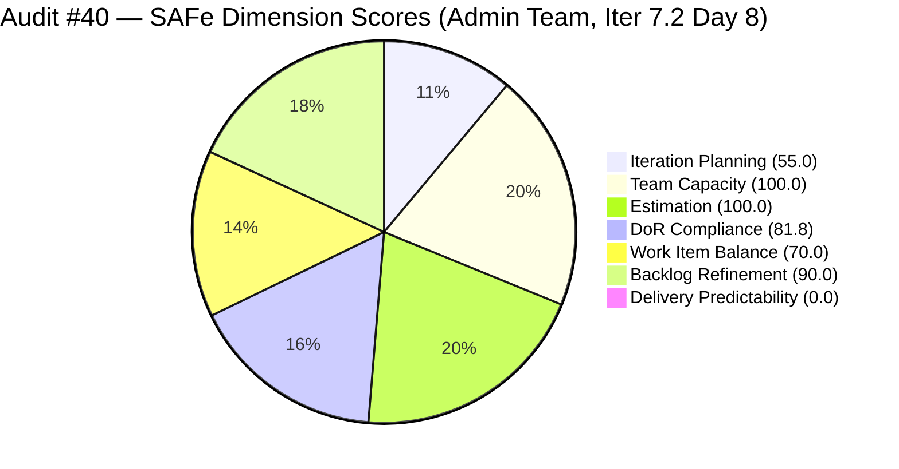
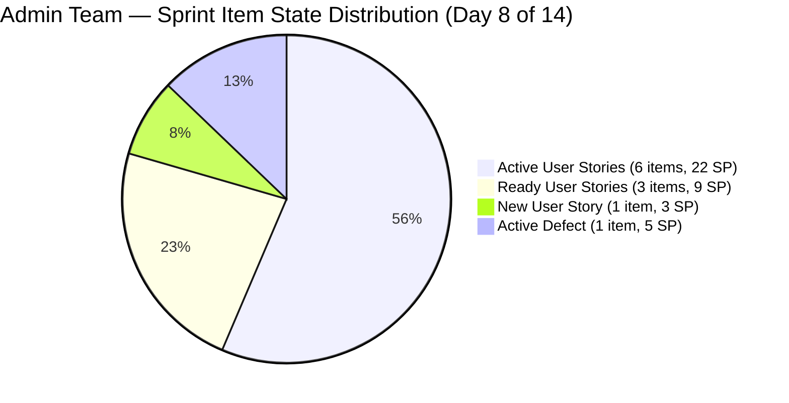
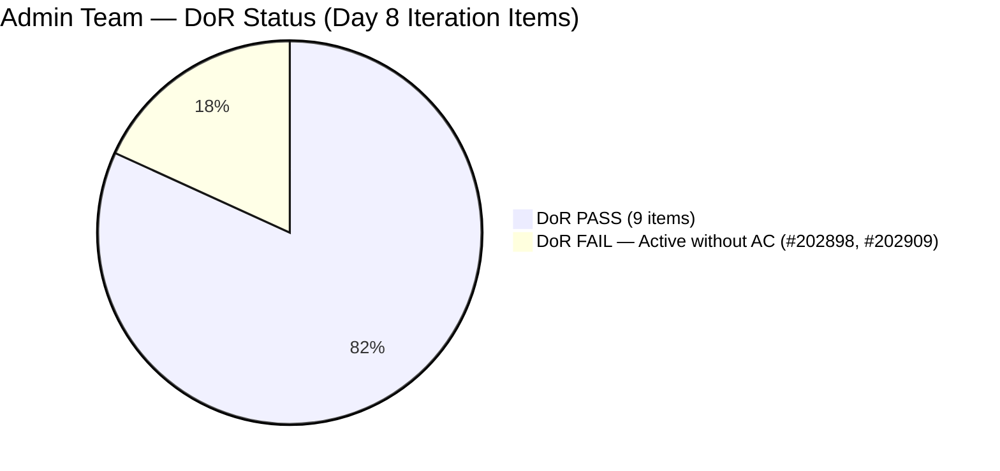

# ADO SAFe Iteration Audit — Administration Team

**Audit #40 | Iteration 7.2 (Apr 20 – May 3, 2026) | Day 8 of 14**

---

## 1. Audit Metadata

| Field | Value |
|---|---|
| **Audit Date** | April 26, 2026 — 14:00 PHT (22:00 UTC) |
| **Auditor** | Claude Code (ADO SAFe Audit Agent) |
| **Workspace** | `ado_admin` |
| **ADO Project** | Jairosoft FINOPS (`e0bb302f-40f9-46c3-8164-6f1acb317d63`) |
| **Team** | Administration Team (`a38a9c02-07ab-483d-a1e3-aff54e19e603`) |
| **Iteration** | Iteration 7.2 — Apr 20 to May 3, 2026 |
| **Iteration ID** | `a9888bc5-48df-40dd-bcc8-6926a11aa7c7` |
| **Sprint Day** | Day 8 of 14 |
| **Prior Audit** | AUDIT_20260426_2100.md (Audit #39, 71.0 — Moderate Risk, PI7.2 Day 7) |
| **Scoring Model** | ADO SAFe v1 (7-dimension rubric) |
| **Overall Score** | **71.0 / 100** |
| **Risk Band** | **Moderate Risk** (60–79.9) |

> **Live ADO data confirmed.** All 20 visible root backlog items pulled from `Microsoft.RequirementCategory` backlog for Administration Team. Capacity and work item details confirmed via ADO batch APIs at 22:00 UTC April 26, 2026.

---

## 2. Executive Summary

The Administration Team holds **71.0 / 100 — Moderate Risk** on Day 8 of Iteration 7.2. The score is unchanged from Audit #39, continuing a flat plateau now spanning eight consecutive audits (Audits #33 through #40, all at 70.0–71.0). However, two notable state changes were detected since the prior audit:

- **#202897** (Utilities payables Cebu/Davao, 4 SP): `Ready` → `Active` at 00:11 UTC April 27
- **#202898** (Condo dues Cebu, 3 SP): `Ready` → `Active` at 00:10 UTC April 27

This is the first observable ADO activity since April 25, 04:15 UTC. Mark appears to have begun work on two payables items in the early morning of April 27 PHT. **However, no story points have been closed** — both items are now Active rather than moving to Done. The DoR failure on #202898 persists: the item has no Description and no Acceptance Criteria despite now being actively worked.

**Critical: Day 8 with 0 SP closed and 39 SP committed.** With 6 working days remaining, the realistic closure scenarios remain unchanged. The optimistic scenario (27 SP) requires sustained daily delivery through sprint end — an unprecedented pace for this team in PI7.

---

## 3. Previous Audit Delta

| Dimension | Audit #39 (Apr 26, 21:00) | Audit #40 (Apr 26, 22:00) | Delta | Driver |
|---|---|---|---|---|
| Iteration Planning | 55.0 | 55.0 | 0.0 | No items added/removed |
| Team Capacity | 100.0 | 100.0 | 0.0 | Unchanged |
| Estimation | 100.0 | 100.0 | 0.0 | Unchanged |
| DoR Compliance | 81.8 | 81.8 | 0.0 | #202898 still no Desc/AC despite becoming Active |
| Work Item Balance | 70.0 | 70.0 | 0.0 | Composition unchanged (10 US + 1 Defect) |
| Backlog Refinement | 90.0 | 90.0 | 0.0 | #202897, #202898 updated overnight — but untouched-current penalty persists for #202357, #202366 |
| Delivery Predictability | 0.0 | 0.0 | 0.0 | No closures; 2 state changes to Active only |
| **Overall** | **71.0** | **71.0** | **0.0** | Score unchanged despite 2 state transitions |

**ADO changes detected since Audit #39 (21:00 UTC):**
- #202897: State `Ready` → `Active` (00:11 UTC Apr 27)
- #202898: State `Ready` → `Active` (00:10 UTC Apr 27)

These two transitions confirm Mark resumed work after the April 25–26 inactivity window. No closures recorded.

### Score Trajectory — Iteration 7.2 Series

| Audit # | Date | Score | Band | Sprint Day |
|---|---|---|---|---|
| #33 | Apr 21 (Day 2) | 69.5 | Moderate | 7.2 D2 |
| #34 | Apr 22, 09:00 | 69.5 | Moderate | 7.2 D3 |
| #35 | Apr 23, 01:13 | 71.0 | Moderate | 7.2 D4 |
| #36 | Apr 23, 09:00 | 71.0 | Moderate | 7.2 D4 |
| #37 | Apr 24, 08:33 | 71.0 | Moderate | 7.2 D5 |
| #38 | Apr 25, 15:33 | 71.0 | Moderate | 7.2 D6 |
| #39 | Apr 26, 21:00 | 71.0 | Moderate | 7.2 D7 |
| **#40** | **Apr 26, 22:00** | **71.0** | **Moderate** | **7.2 D8** |

Eight audits at 71.0 (Days 4–8). The score cannot move upward without closures. Activity is resuming but has not yet produced a closure.

---

## 4. Current Iteration Snapshot

| Metric | Value |
|---|---|
| **Visible root backlog items** | 20 |
| **Current iteration root items (Iter 7.2)** | 11 |
| **Committed story points** | 39 SP |
| **Closed story points (Day 8)** | **0 SP** |
| **New Activity since Audit #39** | #202897 and #202898 moved to Active (00:10–00:11 UTC Apr 27) |
| **Empirical velocity ceiling** | ~27 SP (PI7.1 pattern) |
| **Over-commitment** | +44% above empirical ceiling |
| **DoR-failing items** | 2 (#202898 — no Desc/AC, now Active; #202909 — no Desc/AC, Active) |
| **Legacy PI7-root unscoped items** | 9 |
| **Team capacity** | Mark Colina — 5 hrs/day (1 Deployment + 2 Documentation + 2 Requirements) |
| **Last ADO activity** | Apr 27, 00:11 UTC (#202897 state change by Mark) |
| **Days remaining** | 6 |

---

## 5. Work Item Analysis

### Current Iteration Items (Iteration 7.2)

| ID | Title | Type | State | SP | AssignedTo | Changed | DoR | Change vs #39 |
|---|---|---|---|---|---|---|---|---|
| 202353 | JIT BFP certificate renewal 2026 | User Story | Active | 3 | Mark | Apr 22 | PASS | — |
| 202357 | Fixation in rooftop (Davao) | Defect | Active | 5 | Mark | Apr 17 | PASS | — |
| 202366 | Philgeps renewal for 2026 | User Story | Active | 3 | Mark | Apr 17 | PASS | — |
| 202895 | Government (EGOV) payables | User Story | Ready | 4 | Mark | Apr 21 | PASS | — |
| 202896 | Payables - Internet for Davao and Cebu | User Story | Active | 5 | Mark | Apr 25 | PASS | — |
| **202897** | **Utilities payables for Cebu and Davao** | **User Story** | **Active** | **4** | **Mark** | **Apr 27** | **PASS** | **Ready→Active** |
| **202898** | **Condo dues (Cebu) payables** | **User Story** | **Active** | **3** | **Mark** | **Apr 27** | **FAIL** | **Ready→Active** |
| 202909 | Davao Admin Adhoc Support Apr 20–May 3 | User Story | Active | 4 | Mark | Apr 22 | **FAIL** | — |
| 202937 | 3 vendors site visit – solar panel quotation | User Story | Ready | 3 | Mark | Apr 22 | PASS | — |
| 202939 | Professional fee for IC | User Story | Ready | 2 | Mark | Apr 21 | PASS | — |
| 202945 | Grass cutting outside the building | User Story | New | 3 | Mark | Apr 20 | PASS | — |

**Totals:** 11 items | 39 SP committed | 0 SP closed | 10 User Story + 1 Defect

**State summary:** 6 Active (22 SP) | 3 Ready (9 SP) | 1 New (3 SP) | 0 Closed

**DoR Detail (updated):**
- **#202898**: Still no `System.Description`, no `Microsoft.VSTS.Common.AcceptanceCriteria` — **FAIL (8th consecutive day)**. Item has now transitioned to Active without DoR remediation. Mark is working on it without verifiable done-criteria — highest process integrity risk in the sprint.
- **#202909**: Still no `System.Description`, no `Microsoft.VSTS.Common.AcceptanceCriteria` — **FAIL (8th consecutive day)**. Active state unchanged.

**DoR score calculation:** 9 PASS / 11 total = 81.8

### PI7-Root Legacy Items (Unscoped — 9 Items)

| ID | Title | Type | State | SP | Last Changed |
|---|---|---|---|---|---|
| 192221 | Purchase additional Corrugated Sheet and installation Day 1 | User Story | New | 2 | Apr 22 |
| 193412 | Implementation of aircon repair 2nd floor | User Story | New | 2 | Apr 17 |
| 197023 | Installation of corrugated sheet at Fire Exit | User Story | New | 3 | Apr 17 |
| 197028 | Purchase materials at Houseman Hardware | User Story | New | 1 | Apr 17 |
| 197029 | Implementation of Parking with roof (Day 1) | User Story | New | 3 | Apr 17 |
| 197111 | Recanvass for Jockey pump materials | User Story | New | 1 | Apr 17 |
| 197113 | Purchase materials for Jockey pump | User Story | New | 1 | Apr 17 |
| 197115 | Implementation of installing jockey pump | User Story | New | 4 | Apr 17 |
| 202894 | Goverment payables for [incomplete title] | User Story | New | — | Apr 19 |

9 items confirmed in PI7-root. No triage action detected in this audit cycle.

---

## 6. SAFe Compliance Scorecard

### Scoring Calculations

| Dimension | Formula | Calculation | Score |
|---|---|---|---|
| Iteration Planning | 11 / 20 × 100 | 11 sprint items / 20 visible items | **55.0** |
| Team Capacity | 1 / 1 × 100 | 1 contributor with capacity / 1 with current work | **100.0** |
| Estimation | 11 / 11 × 100 | All 11 point-eligible items estimated | **100.0** |
| DoR Compliance | 9 / 11 × 100 | 9 PASS (#202898 + #202909 FAIL) | **81.8** |
| Work Item Balance | 100 − 30 | US present ✓; US 90.9% > 60% → −30 | **70.0** |
| Backlog Refinement | 100 − 10 | All 20 items fresh ≤45d; 0 stale_90/180; 2/11 untouched current (18.2%, >10%) → −10 | **90.0** |
| Delivery Predictability | 0 / 39 × 100 | 0 SP closed of 39 committed | **0.0** |
| **Overall** | avg(7) | (55.0 + 100.0 + 100.0 + 81.8 + 70.0 + 90.0 + 0.0) / 7 = 496.8 / 7 | **71.0** |

### Scorecard Table

| Dimension | Score | Band | Evidence | Notes |
|---|---|---|---|---|
| Iteration Planning | 55.0 | Moderate | 11 of 20 visible backlog items in Iter 7.2 | 9 PI7-root items unscoped — 8th consecutive flag |
| Team Capacity | 100.0 | Low | Mark Colina: 5 hrs/day (1 Deploy + 2 Doc + 2 Req) | Single-contributor; bus factor risk persists |
| Estimation | 100.0 | Low | All 11 sprint items have story points | Range: 2–5 SP; total 39 SP |
| DoR Compliance | 81.8 | Low | 9 of 11 items pass ≥30-char Desc + ≥20-char AC | #202898 (now Active!) and #202909 still have zero content |
| Work Item Balance | 70.0 | Moderate | 10 US + 1 Defect; US 90.9% > 60% → −30 | Structural ceiling; unchanged composition |
| Backlog Refinement | 90.0 | Low | All 20 items ≤45d; 0 stale_90; 0 stale_180; 2 untouched current → −10 | #202357 (Apr 17), #202366 (Apr 17) pre-date sprint start |
| Delivery Predictability | **0.0** | **Critical** | 0 SP closed of 39 committed through Day 8 | No closures in 8 days; 6 days remaining |
| **Overall** | **71.0** | **Moderate** | | |

---

## 7. Dimension Findings

### Iteration Planning (55.0)
Nine items remain in `Jairosoft FINOPS\2026-PI7` root path with no iteration assignment through Day 8. The item #202894 ("Goverment payables for") has had an incomplete title and no story points for 8 consecutive days — the longest-standing incomplete item in the sprint. The facility infrastructure items (jockey pump series, parking roof, corrugated sheets, aircon repair) collectively represent 17 SP of deferred capacity. Day 8 is now in the second half of the sprint; any of these items assigned to PI7.3 now would be more realistic than PI7.2.

### Team Capacity (100.0)
Mark Colina remains the sole contributor with configured capacity (5 hrs/day). The overnight state transitions (#202897, #202898 to Active at ~00:10 UTC Apr 27) confirm Mark is working, likely during early morning PHT hours. Capacity configuration remains accurate.

### Estimation (100.0)
All 11 sprint items are estimated. The 39 SP total continues to exceed the ~27 SP empirical ceiling by 44%. With 6 days remaining and 0 SP closed, closing all 39 SP is not achievable — the sprint will close with partial delivery regardless of pace from this point.

### DoR Compliance (81.8)
**Critical escalation on #202898:** This item transitioned from `Ready` to `Active` between Audit #39 (21:00 UTC) and Audit #40 (22:00 UTC) with zero DoR content. Mark is now actively executing a 3 SP item without any Description or Acceptance Criteria. The risk has escalated from "item may start without AC" to "item is actively in progress without AC." If Mark completes this work without adding AC, there is no objective criterion against which to verify Done — the closure would be unverifiable.

**#202909 unchanged:** Still Active with no Description and no AC. Both DoR failures have now been persistent for 8 consecutive days.

### Work Item Balance (70.0)
Sprint composition locked at 10 US + 1 Defect. User Story dominance at 90.9% (> 60% threshold) maintains the −30 penalty. No structural change possible within the sprint.

### Backlog Refinement (90.0)
The two overnight state changes (#202897, #202898) reset their `ChangedDate` to Apr 27. This does not affect the untouched-current penalty because the penalty applies to items with ChangedDates *before* sprint start (Apr 20): #202357 (Apr 17) and #202366 (Apr 17) remain the two untouched items triggering the −10 penalty. All 20 visible items continue to fall within the 45-day freshness window.

### Delivery Predictability (0.0)
Zero story points closed through Day 8. The two new Active state transitions (#202897, #202898) suggest Mark is working but has not yet moved any item to Closed/Done. This is consistent with the PI7.1 pattern where delivery clustered in the final 3 days of the sprint.

**Revised closure scenarios (6 days remaining):**

| Scenario | Items Closed | SP Closed | DP Score | Overall |
|---|---|---|---|---|
| Minimum (close #202939 only) | 1 | 2 SP | 5.1 | 71.7 |
| Conservative (Ready + New items) | 4 | 10 SP | 25.6 | 73.7 |
| Moderate (above + 3 Active closures) | 7 | 22 SP | 56.4 | 79.2 |
| Optimistic (all items, excl. DoR-failing) | 9 | 32 SP | 82.1 | 82.7 |

The Moderate scenario (22 SP) would approach the Low Risk threshold. The Optimistic scenario requires closing 9 of 11 items in 6 days — aggressive but not impossible given Mark's demonstrated burst-delivery pattern in PI7.1.

---

## 8. Risks and Bottlenecks

| Risk | Severity | Trend | Action Required |
|---|---|---|---|
| Zero delivery through Day 8 (6 days remain) | **Critical** | Persistent — now Day 8 | Must close at minimum 1 item today; #202939 (2 SP, Ready, full DoR) is zero-friction |
| #202898 Active without DoR | **Critical** | **Escalated** (Ready→Active with no Desc/AC) | Add Description + AC immediately; Mark is now executing without done-criteria |
| #202909 Active without DoR | **High** | Stable (8 days unresolved) | Add Description + AC — 5-minute remediation that is now 8 days overdue |
| 39 SP committed vs. ~27 SP ceiling (+44%) | **High** | Persistent | De-scope 3–4 items; realistic sprint target is 20–27 SP |
| 9 unscoped legacy items in PI7-root | **Moderate** | Stable (8th flag) | Assign to PI7.3+ or close as Won't Do before PI7 end |
| PI7.1 burst-delivery anti-pattern | **High** | Active risk — Day 8 of 14 | 6 days remaining; daily closure pace must accelerate starting today |
| Single-contributor team (Mark) | **Moderate** | Persistent | No mitigation within sprint; flag for PI8 planning |

---

## 9. Prioritized Recommendations

1. **[CRITICAL — Immediate]** Add Description and Acceptance Criteria to **#202898** (Condo dues Cebu, 3 SP, Active). This item is now being worked without any verifiable done-criteria. If Mark finishes this task before adding AC, the closure cannot be independently verified. This is the most urgent process integrity risk in the sprint. Estimated effort: 5 minutes.

2. **[CRITICAL — Today]** Close **#202939** (Professional Fee IC, 2 SP, Ready, full DoR). This remains the single lowest-friction closure in the sprint. Its Ready state, full DoR, and small SP size make it the zero-risk choice for breaking the 0.0 Delivery Predictability.

3. **[HIGH — Today]** Add Description and Acceptance Criteria to **#202909** (Davao Admin Adhoc, 4 SP, Active). Eight days without AC. This item must be remediated before any closure attempt.

4. **[HIGH — Days 8–10]** Drive the newly-Active items to closure: **#202897** (Utilities payables, 4 SP) and **#202898** (Condo dues, 3 SP, after DoR remediation). Both became Active in the last few hours — Mark should close them within 1–2 days to build sprint velocity.

5. **[HIGH — Days 8–10]** Close **#202353** (BFP certificate, 3 SP, Active) and **#202895** (EGOV payables, 4 SP, Ready). Closing these four items (#202897, #202898, #202353, #202895 = 14 SP) would move DP to 35.9 and overall to 76.1.

6. **[MODERATE — This Sprint]** Triage the 9 PI7-root legacy items. Day 8 of 14 — these items will not be completed in Iter 7.2. Move them to PI7.3 or flag Won't Do to clean up planning metrics.

---

## 10. Evidence Gaps and Limitations

| Gap | Impact | Notes |
|---|---|---|
| #202898 and #202897 state changes at 00:10–00:11 UTC Apr 27 — may be after report timestamp | Low | Data confirmed as of 22:00 UTC Apr 26; these items show Apr 27 ChangedDate — confirmed in this audit cycle |
| Empirical velocity ceiling (~27 SP) based on PI7.1 only | Low | Single-PI sample; directional use only |
| #202898 Active without verifiable done-criteria | **High** | Mark may complete and close the item without AC; closure would be unverifiable |
| 9 PI7-root legacy items not assessed for sprint eligibility | Low | Triage overdue since Day 1 |
| #202894 incomplete title — unverifiable scope | Low | Item created Apr 19 with no additional content for 8 days |

---

