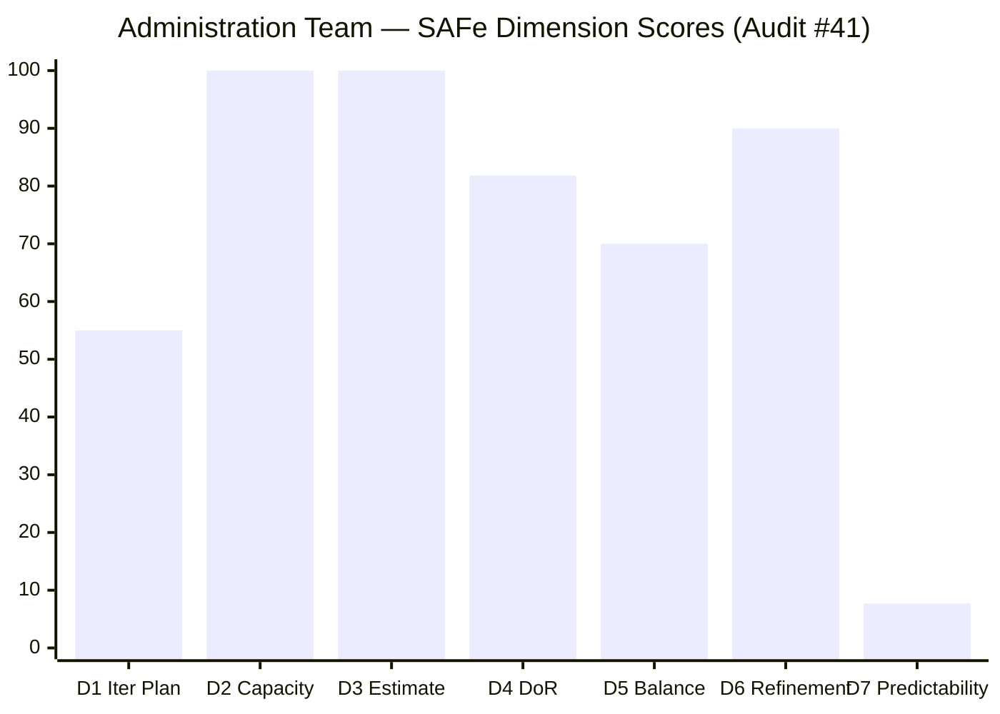
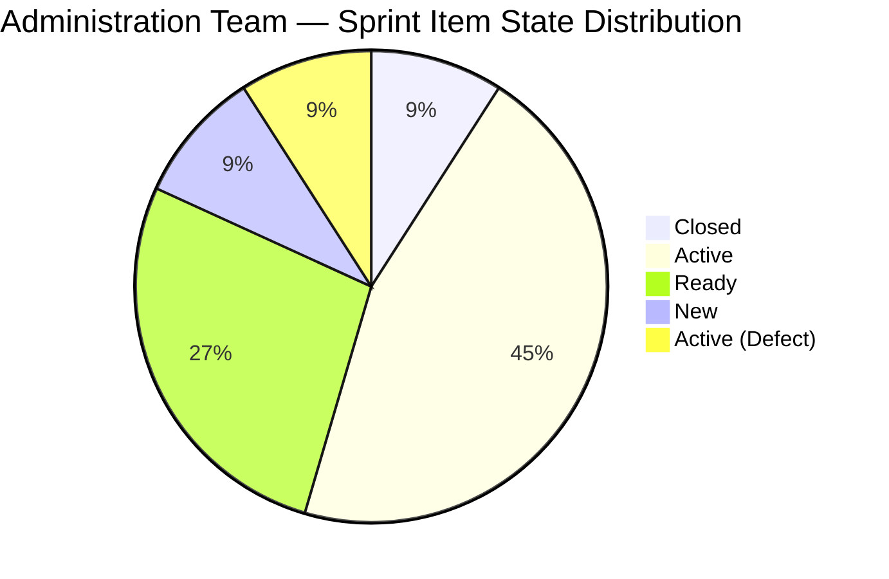
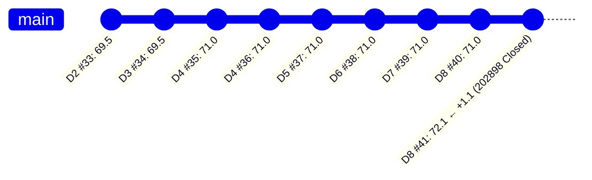

# ADO SAFe Iteration Audit — Administration Team

**Audit #41 | Iteration 7.2 (Apr 20 – May 3, 2026) | Day 8 of 14**

---

## 1. Audit Metadata

| Field | Value |
|---|---|
| **Audit Date** | April 27, 2026 — 11:10 CST |
| **Auditor** | Claude Code (ADO SAFe Audit Agent) |
| **Workspace** | `ado_admin` |
| **ADO Project** | Jairosoft FINOPS (`e0bb302f-40f9-46c3-8164-6f1acb317d63`) |
| **Team** | Administration Team (`a38a9c02-07ab-483d-a1e3-aff54e19e603`) |
| **Iteration** | Iteration 7.2 — Apr 20 to May 3, 2026 |
| **Iteration ID** | `a9888bc5-48df-40dd-bcc8-6926a11aa7c7` |
| **Sprint Day** | Day 8 of 14 |
| **Prior Audit** | AUDIT_20260426_2200.md (Audit #40, 71.0 — Moderate Risk, PI7.2 Day 8) |
| **Scoring Model** | ADO SAFe v1 (7-dimension rubric) |
| **Overall Score** | **72.1 / 100** |
| **Risk Band** | **Moderate Risk** (60–79.9) |

> **Live ADO data confirmed.** 20 visible root backlog items (19 active + 1 closed sprint item #202898) pulled from `Microsoft.RequirementCategory` backlog for Administration Team. Capacity and work item details confirmed via ADO batch APIs at 11:10 CST April 27, 2026.

---

## 2. Executive Summary

The Administration Team moves to **72.1 / 100 — Moderate Risk** on Day 8 of Iteration 7.2, a **+1.1 improvement** over Audit #40 (71.0). This is the first score increase since Day 4 of the sprint and is driven entirely by a single closure: **#202898 "Condo dues (Cebu) payables" (3 SP) was Closed at 05:58 UTC today**.

This is Mark Colina's first completed delivery of Iteration 7.2. Delivery Predictability moves from 0.0 to **7.7** (3 closed / 39 committed SP). Six working days remain with 36 SP still open.

**Structural ceiling remains unchanged.** The score cannot breach 80 without reducing the dominant User Story type share (currently 90.9%) or expanding active team membership. Iteration Planning is capped at 55.0 due to 9 unscoped PI7-root items.

**Item #202909 and #202898 both fail DoR** — no Description or Acceptance Criteria. #202898 was closed without documentation despite this gap, which is a compliance concern.

**Score trajectory:** The team climbed from 71.0 (plateau, Days 4–8) to 72.1 today — the first positive movement in 4 days.

---

## 3. Previous Audit Delta

| Dimension | Audit #40 (Apr 26, 22:00) | Audit #41 (Apr 27, 11:10) | Delta | Driver |
|---|---|---|---|---|
| Iteration Planning | 55.0 | 55.0 | 0.0 | No items added/removed from sprint |
| Team Capacity | 100.0 | 100.0 | 0.0 | Unchanged |
| Estimation | 100.0 | 100.0 | 0.0 | Unchanged |
| DoR Compliance | 81.8 | 81.8 | 0.0 | #202909 and #202898 both still lacking Desc/AC |
| Work Item Balance | 70.0 | 70.0 | 0.0 | Composition unchanged (10 US + 1 Defect) |
| Backlog Refinement | 90.0 | 90.0 | 0.0 | Untouched-current penalty persists for #202357 and #202366 |
| Delivery Predictability | 0.0 | **7.7** | **+7.7** | #202898 Closed (3 SP) — first closure of Iteration 7.2 |
| **Overall** | **71.0** | **72.1** | **+1.1** | First positive movement since Day 4 |

**ADO changes detected since Audit #40 (22:00 UTC Apr 26):**
- **#202898** ("Condo dues Cebu payables", 3 SP): `Active` → `Closed` at 05:58 UTC Apr 27

### Score Trajectory — Iteration 7.2 Series

| Audit # | Date | Score | Band | Sprint Day |
|---|---|---|---|---|
| #33 | Apr 21 (Day 2) | 69.5 | Moderate | 7.2 D2 |
| #34 | Apr 22, 09:00 | 69.5 | Moderate | 7.2 D3 |
| #35 | Apr 23, 01:13 | 71.0 | Moderate | 7.2 D4 |
| #36 | Apr 23, 09:00 | 71.0 | Moderate | 7.2 D4 |
| #37 | Apr 24, 08:33 | 71.0 | Moderate | 7.2 D5 |
| #38 | Apr 25, 15:33 | 71.0 | Moderate | 7.2 D6 |
| #39 | Apr 26, 21:00 | 71.0 | Moderate | 7.2 D7 |
| #40 | Apr 26, 22:00 | 71.0 | Moderate | 7.2 D8 |
| **#41** | **Apr 27, 11:10** | **72.1** | **Moderate** | **7.2 D8** |

First score increase since Day 4. Closure momentum must be sustained to reach Low Risk before sprint end.

---

## 4. Current Iteration Snapshot

| Metric | Value |
|---|---|
| **Visible root backlog items** | 20 |
| **Current iteration root items (Iter 7.2)** | 11 |
| **PI7-root unscoped items** | 9 |
| **Committed story points** | 39 SP |
| **Closed story points** | 3 SP |
| **Remaining open SP** | 36 SP |
| **Sprint progress** | Day 8 of 14 (57% elapsed) |
| **SP delivery rate** | 3 SP closed / 8 days = 0.375 SP/day |
| **SP needed per remaining day** | 36 SP / 6 days = 6.0 SP/day |
| **Team capacity per day** | 5 hrs/day (Mark: 1 Deploy + 2 Doc + 2 Req) |
| **Days off this sprint** | 0 |
| **Assignees on sprint items** | Mark Colina (sole contributor) |
| **Bus factor** | 1 — critical single-person dependency |

### State Distribution — Current Iteration Items

| State | Count | SP | Items |
|---|---|---|---|
| Closed | 1 | 3 | #202898 |
| Active | 5 | 22 | #202353, #202896, #202897, #202909, #202366 |
| Ready | 3 | 9 | #202895, #202937, #202939 |
| New | 1 | 3 | #202945 |
| Active (Defect) | 1 | 5 | #202357 |
| **Total** | **11** | **39** | |

---

## 5. Work Item Analysis

### Current Iteration Root Items (11 items)

| ID | Title | Type | State | SP | DoR | AssignedTo | Changed |
|---|---|---|---|---|---|---|---|
| 202898 | Condo dues (Cebu) payables | User Story | **Closed** | 3 | FAIL (no Desc/AC) | Mark Colina | Apr 27 |
| 202353 | JIT BFP certficate renewal 2026 | User Story | Active | 3 | PASS | Mark Colina | Apr 27 |
| 202897 | Utilities payables Cebu and Davao | User Story | Active | 4 | PASS | Mark Colina | Apr 27 |
| 202895 | Government (EGOV) payables | User Story | Ready | 4 | PASS | Mark Colina | Apr 27 |
| 202896 | Payables - Internet Davao and Cebu | User Story | Active | 5 | PASS | Mark Colina | Apr 25 |
| 202909 | Davao Admin Adhoc Support Apr 20-May 3 | User Story | Active | 4 | **FAIL** (no Desc/AC) | Mark Colina | Apr 22 |
| 202357 | Fixation in rooftop (Davao) | Defect | Active | 5 | PASS | Mark Colina | Apr 17 |
| 202366 | Philgeps renewal for 2026 | User Story | Active | 3 | PASS | Mark Colina | Apr 17 |
| 202937 | 3 vendors site visit Davao – Solar panel | User Story | Ready | 3 | PASS | Mark Colina | Apr 22 |
| 202939 | Professional fee for IC | User Story | Ready | 2 | PASS | Mark Colina | Apr 21 |
| 202945 | Grass cutting outside building | User Story | New | 3 | PASS | Mark Colina | Apr 20 |

### Unscoped PI7-Root Items (9 items — not committed to any sprint)

| ID | Title | SP |
|---|---|---|
| 193412 | Implementation of aircon repair 2nd floor | 2 |
| 197115 | Implementation of installing jockey pump | 4 |
| 197111 | Recanvass for Jockey pump materials | 1 |
| 192221 | Purchase additional Corrugated Sheet Day 1 | 2 |
| 197023 | Installation of corrugated sheet at Fire Exit | 3 |
| 197029 | Implementation of Parking with roof (Day 1) | 3 |
| 197028 | Purchase materials at Houseman Hardware | 1 |
| 197113 | Purchase materials for Jockey pump | 1 |
| 202894 | Goverment payables for (incomplete title) | — |

---

## 6. SAFe Compliance Scorecard

| Dimension | Score | Evidence | Notes |
|---|---|---|---|
| D1 Iteration Planning | 55.0 | 11 / 20 items in sprint | 9 PI7-root items unscoped; typo in #202894 title |
| D2 Team Capacity | 100.0 | 1 / 1 contributor with capacity | Mark (5 hrs/day configured); 0 days off |
| D3 Estimation | 100.0 | 11 / 11 items have SP | All sprint items estimated |
| D4 DoR Compliance | 81.8 | 9 / 11 items pass | #202909 (no Desc/AC); #202898 (closed w/o Desc/AC) |
| D5 Work Item Balance | 70.0 | Penalty: dominant type >60% | 10 US + 1 Defect; User Story = 90.9% → -30 |
| D6 Backlog Refinement | 90.0 | 20/20 fresh; 2 untouched current | #202357, #202366 unchanged since Apr 17 (before sprint) → -10 |
| D7 Delivery Predictability | 7.7 | 3 / 39 SP closed | #202898 closed today; 36 SP remain; 6 days left |
| **Overall** | **72.1** | **(D1+D2+D3+D4+D5+D6+D7) / 7** | **Moderate Risk** |

---

## 7. Dimension Findings

### D1 — Iteration Planning (55.0)
Nine of 20 visible root items remain in the PI7-root bucket without sprint assignment. This depresses Iteration Planning to 55.0. The jockey pump series (#197111, #197113, #197115) and fire exit installation (#197023) have been parked since mid-April. **#202894 has an incomplete title ("Goverment payables for") and is unscoped** — this item requires both correction and sprint assignment or explicit deferral to PI8.

### D2 — Team Capacity (100.0)
Mark Colina is fully configured: 1 hr/day Deployment, 2 hrs/day Documentation, 2 hrs/day Requirements = 5 total/day. No days off in Iteration 7.2. Single-contributor dependency is the risk here, not configuration.

### D3 — Estimation (100.0)
All 11 sprint items carry story point estimates. Committed load = 39 SP. At the current closure rate (0.375 SP/day), only ~2 additional SP would close by sprint end — a significant gap against 36 remaining.

### D4 — DoR Compliance (81.8)
Two failures:
- **#202909** ("Davao Admin Adhoc Support"): No Description, no Acceptance Criteria. This is an ongoing catch-all task committed to the sprint without proper definition.
- **#202898** ("Condo dues Cebu"): Closed with no Description or Acceptance Criteria — work was completed but not documented in ADO. This is an audit trail gap.

Both items represent the same DoR violation pattern observed across all prior PI7 audits.

### D5 — Work Item Balance (70.0)
The sprint contains 10 User Stories and 1 Defect. While the presence of User Stories prevents the -40 penalty, the 90.9% User Story dominance exceeds the 60% threshold, incurring a -30 penalty. The Administration Team's work is operationally homogeneous (facilities, payables, permits) which naturally produces a mono-type backlog. Structural improvement requires either Defect tracking or Feature decomposition.

### D6 — Backlog Refinement (90.0)
All 20 visible items were touched within 45 days — the backlog is active. The -10 penalty applies because #202357 (rooftop fixation, Davao) and #202366 (PhilGEPS renewal) both carry ChangedDate of April 17, which is **3 days before the Iteration 7.2 start date (April 20)**. By the untouched-current rule (>10% of sprint items untouched since sprint start), the 2/11 = 18.2% ratio triggers the -10 penalty. Both items have been in Active state since early sprint — Mark should update these items to reflect current work status.

### D7 — Delivery Predictability (7.7)
First closure of Iteration 7.2: **#202898 (3 SP)** at 05:58 UTC April 27. At the current rate of 3 SP / 8 days ≈ 0.375 SP/day, the projected sprint total is approximately 5 SP (3 already + 6 days × 0.375). To reach meaningful delivery predictability (>50%), Mark would need to close approximately 17 more SP, requiring a 4–5x acceleration of the current daily rate. The optimistic scenario of closing all remaining Active items (22 SP) would bring D7 to 64.1 and overall to ~80.

---

## 8. Risks and Bottlenecks

| # | Risk | Severity | Status |
|---|---|---|---|
| R1 | 36 SP open with 6 days remaining — current rate (0.375 SP/day) projects ~2 more SP closed | Critical | Active |
| R2 | Single contributor (Mark Colina) — any absence or disruption halts delivery entirely | High | Persistent |
| R3 | #202909 and #202898 closed without Description/AC — audit trail incomplete | High | Confirmed |
| R4 | #202357 and #202366 unchanged since Apr 17 — sprint items with zero evidence of progress | Moderate | Active |
| R5 | 9 unscoped PI7-root items competing for attention | Moderate | Persistent |
| R6 | #202894 has incomplete title — likely a placeholder item never refined | Low | Active |

---

## 9. Prioritized Recommendations

1. **[URGENT] Accelerate closures before sprint end (Day 14 = May 3):** With 36 SP remaining and 6 days left, Mark must target high-SP items: #202896 (Internet payables, 5 SP) and #202357 (Rooftop fixation, 5 SP) are the highest-value quick wins if already in progress.

2. **[HIGH] Update #202357 and #202366 in ADO:** Both are Active and unchanged since Apr 17. Add a comment or state transition to confirm status. This eliminates the D6 -10 penalty and lifts the overall score to ~72.9 if both are touched.

3. **[HIGH] Add Description and AC to #202909:** The Adhoc Support item is committed to the sprint but has no documentation. At minimum, add a one-sentence scope description and a completion criterion.

4. **[MEDIUM] Decide on 9 unscoped PI7-root items:** Either assign to Iteration 7.2, defer to PI8, or close if no longer relevant. #202894's incomplete title ("Goverment payables for") must be corrected regardless.

5. **[MEDIUM] Log completion evidence on closed items:** #202898 was closed without Description or Acceptance Criteria. For an admin-ops team, photos and receipts are the compliance artifacts — these should be attached or linked in ADO before closing.

6. **[LOW] Explore adding a second team member:** The persistent bus-factor risk of a single-member team will continue to suppress velocity and prevent score improvement beyond structural limits.

---

## 10. Evidence Gaps and Limitations

| Gap | Impact | Action |
|---|---|---|
| #202898 closed without Description or AC | DoR compliance cannot be verified post-closure | Log receipt/photo evidence retroactively |
| #202909 has no Description or AC | Cannot assess whether work scope was agreed before start | Add before next closure |
| 9 unscoped items — no sprint assignment visible | D1 Iteration Planning capped at 55.0 indefinitely until items are assigned or removed | Sprint planning needed for PI7-root backlog |
| Delivery Predictability based on SP only | Operational items (payables, permits) may close multiple in a single day — point-in-time tracking undercounts burst delivery | No formula adjustment; note for interpretation |

---

## Appendix: Mermaid Charts

### Score Breakdown — Iteration 7.2 Day 8 (Audit #41)

> Note: Chart uses standard bar type. Rendered in Obsidian with the Mermaid plugin.

### Sprint State Distribution (Current Iteration Items)

### Audit-to-Audit Score Delta — Iteration 7.2 Series

