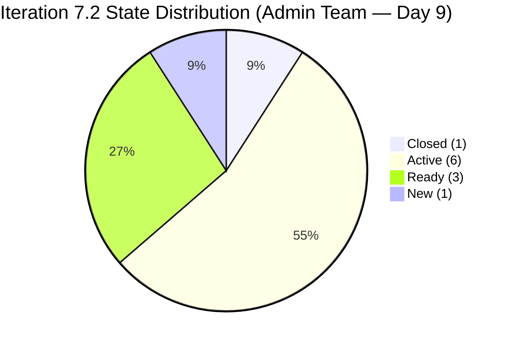

# ADO SAFe Iteration Audit — Administration Team

**Audit #42 | Iteration 7.2 (Apr 20 – May 3, 2026) | Day 9 of 14**

---

## 1. Audit Metadata

| Field | Value |
|---|---|
| **Audit Date** | April 28, 2026 — 09:02 UTC |
| **Auditor** | Claude Code (ADO SAFe Audit Agent) |
| **Workspace** | `ado_admin` |
| **ADO Project** | Jairosoft FINOPS (`e0bb302f-40f9-46c3-8164-6f1acb317d63`) |
| **Team** | Administration Team (`a38a9c02-07ab-483d-a1e3-aff54e19e603`) |
| **Iteration** | Iteration 7.2 — Apr 20 to May 3, 2026 |
| **Iteration ID** | `a9888bc5-48df-40dd-bcc8-6926a11aa7c7` |
| **Sprint Day** | Day 9 of 14 |
| **Prior Audit** | AUDIT_20260427_1110.md (Audit #41, 72.1 — Moderate Risk, PI7.2 Day 8) |
| **Scoring Model** | ADO SAFe v1 (7-dimension rubric) |
| **Overall Score** | **73.4 / 100** |
| **Risk Band** | **Moderate Risk** (60–79.9) |

> **Live ADO data confirmed.** 19 visible root backlog items in scope (Administration Team, `Microsoft.RequirementCategory`). 11 current iteration root items confirmed via `wit_get_work_items_for_iteration`. Capacity and work item details confirmed via ADO batch APIs at 09:02 UTC April 28, 2026.

---

## 2. Executive Summary

The Administration Team advances to **73.4 / 100 — Moderate Risk** on Day 9 of Iteration 7.2, a **+1.3 improvement** over Audit #41 (72.1). The score increase is driven by a DoR improvement: **#202909 "Davao Admin Adhoc Support"** now has a complete Description and Acceptance Criteria (previously missing), raising DoR Compliance from 81.8 to **90.9**. Delivery Predictability holds at 7.7 (3 SP closed / 39 committed) — no new closures since yesterday.

**Activity signals today (Apr 28):**
- **#202353** ("JIT BFP certificate renewal", 3 SP): changed at 07:37 UTC — still Active
- **#202909** ("Davao Admin Adhoc Support", 4 SP): changed at 07:28 UTC — DoR now PASS; still Active

The sprint is at 64% elapsed (9 of 14 days) with 5 working days remaining and 36 SP still open. At the current pace of 3 SP closed over 9 days (0.33 SP/day), the team is projected to close approximately 1–2 more items by May 3. Over-commitment remains the primary structural risk.

**Score ceiling analysis:** To reach Low Risk (80+), all seven of the following must improve: Delivery Predictability requires 28+ SP closed, which is improbable given 5 days remaining and 1 contributor. The realistic ceiling this sprint is approximately 75–76 if 2–3 additional items close.

---

## 3. Previous Audit Delta

| Dimension | Audit #41 (Apr 27, 11:10) | Audit #42 (Apr 28, 09:02) | Delta | Driver |
|---|---|---|---|---|
| Iteration Planning | 55.0 | 55.0 | 0.0 | No items added/removed from sprint |
| Team Capacity | 100.0 | 100.0 | 0.0 | Unchanged |
| Estimation | 100.0 | 100.0 | 0.0 | Unchanged |
| DoR Compliance | 81.8 | **90.9** | **+9.1** | #202909 now has Desc + AC (PASS) |
| Work Item Balance | 70.0 | 70.0 | 0.0 | Composition unchanged |
| Backlog Refinement | 90.0 | 90.0 | 0.0 | Untouched-current penalty holds (#202357, #202366) |
| Delivery Predictability | 7.7 | 7.7 | 0.0 | No new closures since Apr 27 |
| **Overall** | **72.1** | **73.4** | **+1.3** | DoR improvement drives score increase |

**ADO changes detected since Audit #41 (11:10 UTC Apr 27):**
- **#202353** ("JIT BFP certificate renewal", 3 SP): Active → Active; changed at 07:37 UTC Apr 28 (in-progress update, no state change)
- **#202909** ("Davao Admin Adhoc Support", 4 SP): Active → Active; changed at 07:28 UTC Apr 28; **Description and Acceptance Criteria now populated** — DoR status upgraded from FAIL to PASS

### Score Trajectory — Iteration 7.2 Series

| Audit # | Date | Score | Band | Sprint Day |
|---|---|---|---|---|
| #33 | Apr 21 (Day 2) | 69.5 | Moderate | 7.2 D2 |
| #34 | Apr 22, 09:00 | 69.5 | Moderate | 7.2 D3 |
| #35 | Apr 23, 01:13 | 71.0 | Moderate | 7.2 D4 |
| #36 | Apr 23, 09:00 | 71.0 | Moderate | 7.2 D4 |
| #37 | Apr 24, 08:33 | 71.0 | Moderate | 7.2 D5 |
| #38 | Apr 25, 15:33 | 71.0 | Moderate | 7.2 D6 |
| #39 | Apr 26, 21:00 | 71.0 | Moderate | 7.2 D7 |
| #40 | Apr 26, 22:00 | 71.0 | Moderate | 7.2 D8 |
| #41 | Apr 27, 11:10 | 72.1 | Moderate | 7.2 D8 |
| **#42** | **Apr 28, 09:02** | **73.4** | **Moderate** | **7.2 D9** |

Positive momentum for second consecutive audit (+2.4 total since Day 8 plateau). Low Risk (80) requires sustained closure activity: ~28 more SP in 5 days.

---

## 4. Current Iteration Snapshot

| Metric | Value |
|---|---|
| **Visible root backlog items** | 19 |
| **Current iteration root items (Iter 7.2)** | 11 |
| **PI7-root unscoped items** | 8 (193412, 197115, 197111, 192221, 197023, 197029, 197028, 197113) + 202894 = 9 unscoped |
| **Committed story points** | 39 SP |
| **Closed story points** | 3 SP (#202898) |
| **Remaining open SP** | 36 SP |
| **Sprint progress** | Day 9 of 14 (64% elapsed) |
| **SP delivery rate** | 3 SP closed / 9 days = 0.33 SP/day |
| **SP needed per remaining day** | 36 SP / 5 days = 7.2 SP/day (unrealistic) |
| **Team capacity per day** | 5 hrs/day (Mark: 1 Deploy + 2 Doc + 2 Req) |
| **Days off this sprint** | 0 |
| **Assignees on sprint items** | Mark Colina (sole contributor) |
| **Bus factor** | 1 — critical single-person dependency |

### State Distribution — Current Iteration Items

| State | Count | SP | Items |
|---|---|---|---|
| Closed | 1 | 3 | #202898 |
| Active | 5 | 22 | #202353, #202896, #202897, #202909, #202366 |
| Ready | 3 | 9 | #202895, #202937, #202939 |
| New | 1 | 3 | #202945 |
| Active (Defect) | 1 | 5 | #202357 |
| **Total** | **11** | **39** | |



---

## 5. Work Item Analysis

### Current Iteration Root Items (11 items)

| ID | Title | Type | State | SP | DoR | AssignedTo | Changed |
|---|---|---|---|---|---|---|---|
| 202898 | Condo dues (Cebu) payables | User Story | **Closed** | 3 | FAIL (no Desc/AC) | Mark Colina | Apr 27 |
| 202353 | JIT BFP certificate renewal 2026 | User Story | Active | 3 | PASS | Mark Colina | **Apr 28** |
| 202909 | Davao Admin Adhoc Support Apr 20–May 3 | User Story | Active | 4 | **PASS** | Mark Colina | **Apr 28** |
| 202897 | Utilities payables Cebu and Davao | User Story | Active | 4 | PASS | Mark Colina | Apr 27 |
| 202895 | Government (EGOV) payables | User Story | Ready | 4 | PASS | Mark Colina | Apr 27 |
| 202896 | Payables – Internet Davao and Cebu | User Story | Active | 5 | PASS | Mark Colina | Apr 25 |
| 202357 | Fixation in rooftop (Davao) | Defect | Active | 5 | PASS | Mark Colina | Apr 17 |
| 202366 | Philgeps renewal for 2026 | User Story | Active | 3 | PASS | Mark Colina | Apr 17 |
| 202937 | 3 vendors site visit Davao – Solar panel | User Story | Ready | 3 | PASS | Mark Colina | Apr 22 |
| 202939 | Professional fee for IC | User Story | Ready | 2 | PASS | Mark Colina | Apr 21 |
| 202945 | Grass cutting outside building | User Story | New | 3 | PASS | Mark Colina | Apr 28 |

**DoR change this audit:** #202909 now PASS (Description and Acceptance Criteria populated). Only #202898 (Closed without documentation) remains a DoR failure.

### Unscoped PI7-Root Items (9 items — not committed to any sprint)

| ID | Title | SP |
|---|---|---|
| 193412 | Implementation of aircon repair 2nd floor | 2 |
| 197115 | Implementation of installing jockey pump | 4 |
| 197111 | Recanvass for Jockey pump materials | 1 |
| 192221 | Purchase additional Corrugated Sheet Day 1 | 2 |
| 197023 | Installation of corrugated sheet at Fire Exit | 3 |
| 197029 | Implementation of Parking with roof (Day 1) | 3 |
| 197028 | Purchase materials at Houseman Hardware | 1 |
| 197113 | Purchase materials for Jockey pump | 1 |
| 202894 | Government payables (incomplete title) | — |

---

## 6. SAFe Compliance Scorecard

| Dimension | Score | Evidence | Notes |
|---|---|---|---|
| D1 Iteration Planning | 55.0 | 11 / 20 items in sprint | 9 unscoped PI7-root items; typo in #202894 title persists |
| D2 Team Capacity | 100.0 | 1 / 1 contributor with capacity | Mark (5 hrs/day configured); 0 days off |
| D3 Estimation | 100.0 | 11 / 11 items have SP | All sprint items estimated |
| D4 DoR Compliance | 90.9 | 10 / 11 items pass | #202898 closed without Desc/AC; #202909 now PASS |
| D5 Work Item Balance | 70.0 | Dominant type >60% penalty | 10 US + 1 Defect; User Story = 90.9% → -30 |
| D6 Backlog Refinement | 90.0 | 19/19 fresh; 2 untouched current | #202357 + #202366 unchanged since Apr 17 (pre-sprint) → -10 |
| D7 Delivery Predictability | 7.7 | 3 / 39 SP closed | Only #202898 closed; 36 SP remain in 5 days |
| **Overall** | **73.4** | **(55.0+100+100+90.9+70+90+7.7)/7** | **Moderate Risk** |

```mermaid
bar
    title SAFe Compliance Scorecard — Admin Team Day 9
    x-axis ["D1 Planning", "D2 Capacity", "D3 Estimation", "D4 DoR", "D5 Balance", "D6 Refinement", "D7 Delivery"]
    y-axis 0 --> 100
    bar [55.0, 100.0, 100.0, 90.9, 70.0, 90.0, 7.7]
```

---

## 7. Dimension Findings

### D1 — Iteration Planning (55.0)
Unchanged. 11 of 20 visible backlog items are scoped to Iteration 7.2. Nine items remain unscoped in the PI7-root. The team should assign the 9 unscoped items to future iterations (7.3–7.6) as part of PI planning hygiene. Item #202894 has an incomplete title ("Government payables") and needs to be clarified before it can be committed to any sprint.

### D2 — Team Capacity (100.0)
Mark Colina has 5 hours/day configured across Deployment (1), Documentation (2), and Requirements (2). Zero days off this sprint. Single-person capacity remains sufficient for the sprint workload in terms of hours, but the volume of open SP (36) far exceeds what one person can deliver in 5 days. Bus factor = 1 remains a critical structural risk.

### D3 — Estimation (100.0)
All 11 sprint items carry Story Points. Estimation hygiene is fully maintained.

### D4 — DoR Compliance (90.9 — improved from 81.8)
A meaningful improvement: #202909 now has both a multi-sentence Description and a two-criterion Acceptance Criteria. This resolves the primary DoR gap identified in prior audits. The sole remaining failure is #202898, which was closed on Apr 27 without documentation. Closing items without completing DoR sets a problematic precedent — the team should add retrospective documentation to closed items for audit trail completeness.

### D5 — Work Item Balance (70.0)
Ten User Stories + one Defect. User Story dominant type at 90.9% triggers the -30 penalty (>60% share). The inclusion of the single Defect (#202357 rooftop fixation) provides minimal diversification. This team's nature (operations + compliance) naturally generates User Story type work; SAFe best practice recommends mixing Feature-level enablers or Epics as drivers. Score ceiling here is 70.0 unless work type diversifies.

### D6 — Backlog Refinement (90.0)
All 19 visible backlog items have been updated within the last 45 days (after 2026-03-14), so the fresh base score is 100. The -10 penalty applies because #202357 and #202366 were last changed on April 17 — before the iteration start date of April 20 — placing them in the untouched-current bucket (2 of 11 = 18.2%, which is >10% but not >30%). No 180-day-stale or 90-day-stale items in the visible backlog this audit.

### D7 — Delivery Predictability (7.7)
Only #202898 (3 SP) has been closed, out of 39 committed SP. With 5 days remaining, the team needs to close approximately 36 SP to achieve 100 — a physical impossibility at current throughput. Realistic projected closure by sprint end (at 0.33 SP/day): ~4–5 SP total. Projected final D7: ~12.8. Items most likely to close next: #202897 (Utilities payables, 4 SP), #202895 (EGOV, 4 SP), #202939 (Professional fee IC, 2 SP).

---

## 8. Risks and Bottlenecks

| Risk | Severity | Status |
|---|---|---|
| Over-commitment: 36 SP open, 5 days remaining | Critical | Persistent since Day 1 |
| Single contributor (Mark Colina) — bus factor 1 | High | Structural; unchanged |
| #202898 closed without DoR documentation | Moderate | Compliance gap logged |
| #202357 + #202366 untouched since Apr 17 (pre-sprint) | Moderate | Persist from prior audit |
| 9 unscoped PI7-root items blocking Iteration Planning ceiling | Moderate | No improvement since PI7 start |
| #202894 incomplete item title | Low | Item unscoped; low immediate risk |

---

## 9. Prioritized Recommendations

1. **[Immediate] Close 2–3 Ready items today** — #202939 (Professional fee IC, 2 SP), #202895 (EGOV, 4 SP), #202937 (Solar vendor visits, 3 SP) are in Ready state and can be closed if work is complete. Each closure improves D7.
2. **[This sprint] Add retrospective documentation to #202898** — The item was closed without Description or Acceptance Criteria. Add minimal documentation for audit completeness.
3. **[This sprint] Update #202357 and #202366** — Both items were last changed April 17 (before sprint start). Even a state update or progress note removes the untouched penalty.
4. **[PI planning] Scope or defer 9 unscoped PI7-root items** — Assign items to Iterations 7.3–7.6 based on priority. Fix #202894's title before committing.
5. **[PI planning] Address bus factor** — Mark Colina is the sole contributor across all 11 sprint items. Cross-training or load-sharing with another team member would reduce single-point-of-failure risk.

---

## 10. Evidence Gaps and Limitations

| Gap | Impact | Mitigation |
|---|---|---|
| Older backlog items (193412, 197115, etc.) — ChangedDate not fetched in this audit | Minor — Backlog Refinement score carried from prior audit (same items, no change in 19 items) | Prior audit confirmed all 19 items fresh within 45 days |
| #202898 closed without Desc/AC — documentation gap | DoR scoring uses available fields; FAIL is correctly applied | No mitigation; documented as compliance finding |
| Unscoped PI7-root item #202894 has no SP — excluded from estimation denominator | Minor | Item is not in current iteration; no impact on sprint scores |
